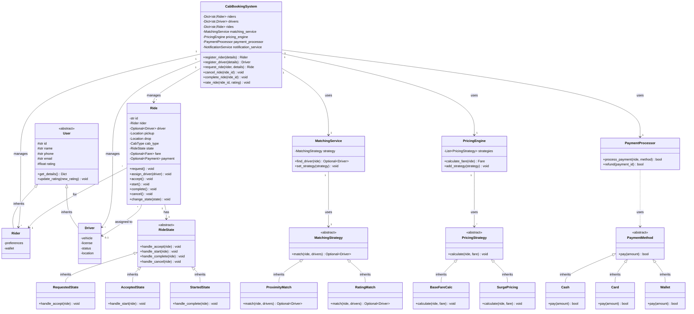

# Cab Booking System - Low Level Design

## 1. Problem Statement

Design a comprehensive cab booking system similar to Uber/Lyft that supports ride booking, driver-rider matching, real-time tracking, dynamic pricing, and payment processing.

### Core Requirements

1. **User Management**
   - Rider registration and profiles
   - Driver registration and verification
   - Profile management
   - Rating and reviews

2. **Ride Booking**
   - Book a ride with pickup and drop locations
   - Multiple cab types (Economy, Premium, XL, etc.)
   - Ride scheduling (now or later)
   - Fare estimation before booking

3. **Driver-Rider Matching**
   - Real-time proximity-based matching
   - Driver availability management
   - Match optimization (distance, ratings, availability)
   - Automatic retry on rejection

4. **Ride Lifecycle**
   - States: REQUESTED → MATCHED → ACCEPTED → ARRIVED → STARTED → COMPLETED → PAID
   - Driver acceptance/rejection
   - Ride tracking
   - Ride cancellation (by rider or driver)

5. **Pricing Engine**
   - Base fare + distance + time calculation
   - Surge pricing during peak hours
   - Different rates for different cab types
   - Discount and promo code support

6. **Location & Tracking**
   - Real-time location updates
   - ETA calculation
   - Route optimization
   - Geofencing for service areas

7. **Payment System**
   - Multiple payment methods (cash, card, wallet)
   - Fare calculation
   - Payment processing
   - Refund handling

8. **Rating System**
   - Rider rates driver
   - Driver rates rider
   - Average rating calculation
   - Feedback comments

### Non-Functional Requirements

1. **Performance**
   - Match drivers within 3-5 seconds
   - Real-time location updates (< 2s latency)
   - Support 10,000+ concurrent rides

2. **Scalability**
   - Horizontal scaling for matching service
   - Geospatial indexing for location queries
   - Cache frequently accessed data

3. **Availability**
   - 99.9% uptime
   - Graceful degradation
   - Fault tolerance

4. **Real-time**
   - Live location tracking
   - Push notifications
   - WebSocket support

## 2. Core Components

### 2.1 User System

```text
User (Abstract)
├── Rider
│   ├── id, name, email, phone
│   ├── rating
│   ├── payment_methods
│   └── ride_history
└── Driver
    ├── id, name, email, phone
    ├── license_number
    ├── vehicle
    ├── rating
    ├── availability_status
    ├── current_location
    └── ride_history
```

### 2.2 Vehicle System

```text
Vehicle
├── Economy (UberX, Lyft)
├── Premium (Uber Black, Lyft Lux)
├── XL (UberXL, Lyft XL)
└── SUV (UberSUV)

Properties:
- vehicle_type
- license_plate
- model
- capacity
- base_fare_rate
```

### 2.3 Ride System

```text
Ride
├── id
├── rider
├── driver
├── pickup_location
├── drop_location
├── cab_type
├── status (State)
├── fare
├── payment
├── ratings
└── timestamps
```

### 2.4 Pricing Engine

```text
Pricing Components
├── Base Fare
├── Distance Fare (per km)
├── Time Fare (per minute)
├── Surge Multiplier
└── Discounts/Promos
```

## 3. Class Diagram



## 4. Design Patterns Used

### 4.1 State Pattern (Ride Lifecycle)

**Purpose:** Manage ride states and valid state transitions.

**States:**

- **Requested:** Ride requested, searching for driver
- **Matched:** Driver found, awaiting acceptance
- **Accepted:** Driver accepted, heading to pickup
- **Arrived:** Driver arrived at pickup location
- **Started:** Ride in progress
- **Completed:** Ride finished
- **Cancelled:** Ride cancelled
- **Paid:** Payment completed

**Transitions:**

```text
REQUESTED → MATCHED → ACCEPTED → ARRIVED → STARTED → COMPLETED → PAID
     ↓          ↓          ↓         ↓         ↓
CANCELLED  CANCELLED  CANCELLED  CANCELLED  CANCELLED
```

**Implementation:**

```python
class RideState(ABC):
    def accept(self, ride): raise InvalidStateError()
    def start(self, ride): raise InvalidStateError()
    def complete(self, ride): raise InvalidStateError()
    def cancel(self, ride): pass  # Can cancel from any state

class RequestedState(RideState):
    def accept(self, ride):
        ride.state = AcceptedState()
        
class AcceptedState(RideState):
    def start(self, ride):
        ride.state = StartedState()
```

### 4.2 Strategy Pattern (Matching & Pricing)

**Purpose:** Different algorithms for driver matching and fare calculation.

**Matching Strategies:**

- **ProximityBasedMatching:** Match nearest available driver
- **RatingBasedMatching:** Match highest-rated driver within range
- **HybridMatching:** Balance between proximity and rating

**Pricing Strategies:**

- **BaseFareStrategy:** Base fare + distance + time
- **SurgePricingStrategy:** Apply surge multiplier during peak hours
- **DiscountStrategy:** Apply promo codes and discounts

### 4.3 Observer Pattern (Real-time Updates)

**Purpose:** Notify interested parties about ride events.

**Observers:**

- **RiderNotificationObserver:** Notify rider about ride updates
- **DriverNotificationObserver:** Notify driver about new rides
- **TrackingObserver:** Update location tracking
- **AnalyticsObserver:** Log events for analytics

**Events:**

- Ride requested
- Driver matched
- Driver arrived
- Ride started
- Ride completed
- Payment processed

### 4.4 Factory Pattern (User & Vehicle Creation)

**Purpose:** Create different types of users and vehicles.

**Factories:**

- **UserFactory:** Create Rider or Driver
- **VehicleFactory:** Create Economy, Premium, XL, SUV vehicles

### 4.5 Command Pattern (Ride Operations)

**Purpose:** Encapsulate ride operations for undo/logging.

**Commands:**

- **RequestRideCommand:** Request a new ride
- **CancelRideCommand:** Cancel a ride
- **AcceptRideCommand:** Driver accepts ride
- **CompleteRideCommand:** Complete ride

### 4.6 Singleton Pattern (System Components)

**Purpose:** Single instance of core services.

**Singletons:**

- CabBookingSystem
- NotificationService
- LocationService

### 4.7 Decorator Pattern (Pricing Add-ons)

**Purpose:** Add additional charges to base fare.

**Decorators:**

- **TollDecorator:** Add toll charges
- **WaitingChargeDecorator:** Add waiting charges
- **AirportFeeDecorator:** Add airport pickup/drop fees

### 4.8 Chain of Responsibility (Driver Selection)

**Purpose:** Multiple criteria for driver selection.

**Chain:**

1. AvailabilityFilter → Filter available drivers
2. ProximityFilter → Filter by distance (< 5 km)
3. RatingFilter → Filter by rating (> 4.0)
4. VehicleTypeFilter → Filter by vehicle type

### 4.9 Template Method Pattern (Ride Processing)

**Purpose:** Define skeleton of ride processing algorithm.

```python
class RideProcessor:
    def process_ride(self, ride):
        self.validate_ride(ride)
        self.match_driver(ride)
        self.calculate_fare(ride)
        self.notify_parties(ride)
```

### 4.10 Proxy Pattern (Location Tracking)

**Purpose:** Cache location data and reduce GPS queries.

**Implementation:**

- LocationProxy caches last known location
- Only queries GPS if cache is stale (> 30 seconds)
- Reduces battery drain

## 5. Key Algorithms

### 5.1 Driver-Rider Matching (Proximity-Based)

**Algorithm:** Find nearest available driver within service radius.

```python
def find_nearest_driver(pickup_location, drivers, max_distance=5):
    """
    Find nearest available driver using geospatial distance
    
    Time Complexity: O(n) where n = number of drivers
    Space Complexity: O(1)
    """
    nearest_driver = None
    min_distance = float('inf')
    
    for driver in drivers:
        if not driver.is_available():
            continue
        
        distance = calculate_distance(pickup_location, driver.location)
        
        if distance <= max_distance and distance < min_distance:
            min_distance = distance
            nearest_driver = driver
    
    return nearest_driver

def calculate_distance(loc1, loc2):
    """
    Haversine formula for great-circle distance
    """
    R = 6371  # Earth's radius in km
    
    lat1, lon1 = radians(loc1.lat), radians(loc1.lon)
    lat2, lon2 = radians(loc2.lat), radians(loc2.lon)
    
    dlat = lat2 - lat1
    dlon = lon2 - lon1
    
    a = sin(dlat/2)**2 + cos(lat1) * cos(lat2) * sin(dlon/2)**2
    c = 2 * asin(sqrt(a))
    
    return R * c
```

**Optimization:** Use geospatial index (R-tree, Quadtree) for O(log n) lookup.

### 5.2 Surge Pricing Calculation

**Algorithm:** Dynamic pricing based on demand-supply ratio.

```python
def calculate_surge_multiplier(location, time):
    """
    Calculate surge multiplier based on demand-supply ratio
    
    Surge = 1.0 + (demand - supply) / supply * sensitivity
    """
    demand = get_active_ride_requests(location, time)
    supply = get_available_drivers(location)
    
    if supply == 0:
        return MAX_SURGE  # e.g., 3.0x
    
    ratio = demand / supply
    
    # Linear surge model
    if ratio < 1.0:
        return 1.0  # No surge
    elif ratio < 2.0:
        return 1.5  # 1.5x
    elif ratio < 3.0:
        return 2.0  # 2x
    else:
        return min(3.0, 1.0 + ratio * 0.5)  # Cap at 3x
```

### 5.3 Fare Calculation

**Algorithm:** Multi-component fare calculation.

```python
def calculate_fare(ride):
    """
    Total Fare = (Base + Distance * Rate + Time * Rate) * Surge - Discount
    """
    base_fare = get_base_fare(ride.cab_type)
    
    distance = calculate_route_distance(ride.pickup, ride.drop)
    distance_fare = distance * get_distance_rate(ride.cab_type)
    
    duration = estimate_duration(ride.pickup, ride.drop)
    time_fare = duration * get_time_rate(ride.cab_type)
    
    subtotal = base_fare + distance_fare + time_fare
    
    # Apply surge
    surge_multiplier = calculate_surge_multiplier(ride.pickup, ride.time)
    subtotal *= surge_multiplier
    
    # Apply discount
    discount = apply_discount(ride.promo_code, subtotal)
    
    total = max(MINIMUM_FARE, subtotal - discount)
    
    return Fare(
        base=base_fare,
        distance=distance_fare,
        time=time_fare,
        surge=surge_multiplier,
        discount=discount,
        total=total
    )
```

### 5.4 ETA Calculation

**Algorithm:** Estimate time of arrival using distance and speed.

```python
def calculate_eta(current_location, destination, traffic_factor=1.2):
    """
    ETA = Distance / Average_Speed * Traffic_Factor
    """
    distance = calculate_distance(current_location, destination)
    
    # Average speed based on area type
    if is_highway(current_location, destination):
        avg_speed = 60  # km/h
    elif is_city_area(current_location):
        avg_speed = 30  # km/h
    else:
        avg_speed = 40  # km/h
    
    # Adjust for traffic
    current_hour = get_current_hour()
    if is_peak_hour(current_hour):
        traffic_factor = 1.5
    
    eta_hours = (distance / avg_speed) * traffic_factor
    eta_minutes = eta_hours * 60
    
    return round(eta_minutes)
```

### 5.5 Rating Update Algorithm

**Algorithm:** Update average rating with new rating.

```python
def update_rating(user, new_rating):
    """
    Update average rating using incremental mean
    
    New_Avg = (Old_Avg * Count + New_Rating) / (Count + 1)
    """
    old_avg = user.rating
    count = user.total_rides
    
    new_avg = (old_avg * count + new_rating) / (count + 1)
    
    user.rating = round(new_avg, 2)
    user.total_rides += 1
    
    return user.rating
```

### 5.6 Driver Availability Management

**Algorithm:** Track and update driver availability.

```python
class DriverAvailability:
    def __init__(self):
        self.available_drivers = set()
        self.busy_drivers = set()
    
    def mark_available(self, driver):
        """Mark driver as available"""
        self.busy_drivers.discard(driver)
        self.available_drivers.add(driver)
    
    def mark_busy(self, driver):
        """Mark driver as busy"""
        self.available_drivers.discard(driver)
        self.busy_drivers.add(driver)
    
    def get_available_in_radius(self, location, radius):
        """Get available drivers within radius"""
        nearby = []
        for driver in self.available_drivers:
            if calculate_distance(driver.location, location) <= radius:
                nearby.append(driver)
        return nearby
```

## 6. API Design

### 6.1 Rider APIs

```python
# Register rider
POST /api/riders
{
  "name": "John Doe",
  "phone": "+1234567890",
  "email": "john@example.com"
}

# Request ride
POST /api/rides
{
  "rider_id": "R123",
  "pickup": {"lat": 37.7749, "lon": -122.4194},
  "drop": {"lat": 37.7849, "lon": -122.4094},
  "cab_type": "ECONOMY"
}

# Get ride status
GET /api/rides/{ride_id}

# Cancel ride
DELETE /api/rides/{ride_id}

# Rate ride
POST /api/rides/{ride_id}/rating
{
  "rating": 5,
  "feedback": "Great ride!"
}

# Get fare estimate
POST /api/rides/estimate
{
  "pickup": {"lat": 37.7749, "lon": -122.4194},
  "drop": {"lat": 37.7849, "lon": -122.4094},
  "cab_type": "ECONOMY"
}
```

### 6.2 Driver APIs

```python
# Register driver
POST /api/drivers
{
  "name": "Jane Smith",
  "phone": "+1234567891",
  "license": "DL12345",
  "vehicle": {
    "type": "ECONOMY",
    "plate": "ABC123",
    "model": "Toyota Camry"
  }
}

# Update availability
PUT /api/drivers/{driver_id}/availability
{
  "available": true
}

# Update location
PUT /api/drivers/{driver_id}/location
{
  "lat": 37.7749,
  "lon": -122.4194
}

# Accept ride
POST /api/rides/{ride_id}/accept

# Start ride
POST /api/rides/{ride_id}/start

# Complete ride
POST /api/rides/{ride_id}/complete

# Get earnings
GET /api/drivers/{driver_id}/earnings?period=weekly
```

## 7. Implementation Examples

### 7.1 Request and Match Ride

```python
# Rider requests ride
rider = system.get_rider("R123")
ride = system.request_ride(
    rider=rider,
    pickup=Location(37.7749, -122.4194),
    drop=Location(37.7849, -122.4094),
    cab_type=CabType.ECONOMY
)

# System matches driver
driver = system.matching_service.find_driver(ride)
if driver:
    ride.assign_driver(driver)
    system.notify_driver(driver, ride)
    system.notify_rider(rider, "Driver found!")
else:
    system.notify_rider(rider, "No drivers available")
```

### 7.2 Complete Ride and Process Payment

```python
# Complete ride
ride.complete()

# Calculate fare
fare = system.pricing_engine.calculate_fare(ride)
ride.set_fare(fare)

# Process payment
payment_method = rider.get_payment_method()
success = system.payment_processor.process_payment(
    amount=fare.total,
    method=payment_method
)

if success:
    ride.mark_paid()
    system.notify_rider(rider, f"Payment of ${fare.total} successful")
else:
    system.notify_rider(rider, "Payment failed")
```

### 7.3 Real-time Location Tracking

```python
# Driver updates location every 5 seconds
driver.update_location(Location(37.7750, -122.4195))

# Calculate ETA for rider
if ride.state == RideState.ACCEPTED:
    eta = calculate_eta(driver.location, ride.pickup)
    system.notify_rider(rider, f"Driver arriving in {eta} minutes")
```

## 8. Edge Cases & Error Handling

### 8.1 No Drivers Available

```text
Scenario: No drivers available in the area

Handling:
1. Retry matching with increased radius
2. Notify rider about wait time
3. Queue ride request
4. Auto-retry when driver becomes available
5. Allow rider to cancel without penalty
```

### 8.2 Driver Cancellation

```text
Scenario: Driver cancels after accepting

Handling:
1. Mark driver as penalized (affects rating)
2. Find alternative driver immediately
3. Notify rider about change
4. Track cancellation rate for driver
5. Suspend driver if cancellation rate > 20%
```

### 8.3 Ride Cancellation by Rider

```text
Scenario: Rider cancels after driver acceptance

Handling:
1. Check time since acceptance
2. If < 2 minutes: No cancellation fee
3. If > 2 minutes: Apply cancellation fee
4. Compensate driver
5. Mark driver as available
```

### 8.4 Payment Failure

```text
Scenario: Payment fails after ride completion

Handling:
1. Allow rider to add alternative payment method
2. Send payment reminder
3. Mark account as having pending payment
4. Restrict new bookings until payment cleared
5. Auto-retry payment after 24 hours
```

### 8.5 GPS/Network Issues

```text
Scenario: Location tracking fails during ride

Handling:
1. Use last known location
2. Estimate ETA based on route
3. Notify rider about tracking issue
4. Use alternative location sources (cell tower triangulation)
5. Calculate fare based on direct distance if tracking unavailable
```

## 9. Optimizations

### 9.1 Geospatial Indexing

**Problem:** O(n) driver search is slow for large number of drivers.

**Solution:** Use R-tree or Quadtree for spatial indexing.

```python
class DriverIndex:
    def __init__(self):
        self.rtree = RTree()
    
    def insert(self, driver):
        """Insert driver into spatial index"""
        bounds = (driver.location.lat, driver.location.lon,
                  driver.location.lat, driver.location.lon)
        self.rtree.insert(driver.id, bounds)
    
    def find_nearby(self, location, radius_km):
        """Find drivers within radius - O(log n)"""
        bounds = calculate_bounding_box(location, radius_km)
        driver_ids = self.rtree.intersection(bounds)
        return [get_driver(id) for id in driver_ids]
```

**Performance:** O(log n) instead of O(n)

### 9.2 Caching Strategy

**Cache frequently accessed data:**

```python
# Redis cache
cache.set(f"driver:location:{driver_id}", location, ttl=30)
cache.set(f"ride:status:{ride_id}", status, ttl=300)
cache.set(f"surge:multiplier:{area_id}", multiplier, ttl=60)
```

### 9.3 Database Sharding

**Shard by geography:**

```python
# US West Coast
shard_1: Rides in CA, OR, WA

# US East Coast
shard_2: Rides in NY, NJ, MA

# Reduces cross-region queries
```

### 9.4 Connection Pooling

```python
# Database connection pool
pool = ConnectionPool(
    max_connections=100,
    min_connections=10,
    connection_timeout=5
)
```

## 10. Testing Strategy

### 10.1 Unit Tests

```python
# Test ride state transitions
test_ride_request_to_matched()
test_ride_accepted_to_started()
test_ride_cancellation()

# Test matching algorithm
test_proximity_based_matching()
test_no_available_drivers()

# Test pricing
test_base_fare_calculation()
test_surge_pricing()
test_discount_application()

# Test payment
test_successful_payment()
test_payment_failure()
test_refund_processing()
```

### 10.2 Integration Tests

```python
# Test complete ride flow
test_end_to_end_ride_booking()
test_driver_acceptance_flow()
test_payment_processing_flow()

# Test real-time updates
test_location_tracking()
test_eta_calculation()
```

### 10.3 Load Tests

```python
# Performance tests
test_1000_concurrent_ride_requests()
test_driver_matching_under_load()
test_database_query_performance()
test_location_update_throughput()
```

## 11. Extensions

### 11.1 Ride Sharing (Pool)

```python
# Multiple riders share same ride
ride_pool = RidePool(max_capacity=4)
ride_pool.add_rider(rider1, pickup1, drop1)
ride_pool.add_rider(rider2, pickup2, drop2)

# Optimize route for all pickups/drops
optimized_route = optimize_multi_stop_route(ride_pool.stops)
```

### 11.2 Scheduled Rides

```python
# Book ride for future
scheduled_ride = system.schedule_ride(
    rider=rider,
    pickup=pickup,
    drop=drop,
    scheduled_time=datetime(2025, 10, 7, 10, 0)
)

# Match driver 15 minutes before scheduled time
```

### 11.3 Corporate Accounts

```python
# Business account with multiple riders
corporate_account = CorporateAccount(
    company="TechCorp",
    billing_email="billing@techcorp.com",
    payment_method=CorporateCard()
)

corporate_account.add_rider(employee1)
corporate_account.add_rider(employee2)
```

### 11.4 Accessibility Features

```python
# Wheelchair accessible vehicles
accessible_vehicle = Vehicle(
    type=VehicleType.ACCESSIBLE,
    has_ramp=True,
    capacity=3
)

# Request accessible ride
ride = system.request_ride(
    rider=rider,
    accessibility_required=True
)
```

## 12. Scalability Considerations

### 12.1 Microservices Architecture

```text
Services:
├── User Service (riders, drivers)
├── Ride Service (booking, lifecycle)
├── Matching Service (driver-rider matching)
├── Pricing Service (fare calculation)
├── Payment Service (transactions)
├── Notification Service (push, SMS, email)
├── Location Service (tracking, ETA)
└── Analytics Service (metrics, reporting)
```

### 12.2 Message Queue

```python
# Async processing with RabbitMQ/Kafka
queue.publish("ride.requested", ride_data)
queue.publish("location.updated", location_data)
queue.publish("payment.processed", payment_data)
```

### 12.3 Load Balancing

```text
Request → Load Balancer → [Server1, Server2, Server3, ...]
         ↓
    Round Robin / Least Connections
```

### 12.4 Database Replication

```text
Master DB (Writes) → Replica1 (Reads)
                  → Replica2 (Reads)
                  → Replica3 (Reads)
```

## 13. Summary

### Key Design Patterns (10)

1. **State Pattern** - Ride lifecycle management
2. **Strategy Pattern** - Matching and pricing algorithms
3. **Observer Pattern** - Real-time notifications
4. **Factory Pattern** - User and vehicle creation
5. **Command Pattern** - Ride operations
6. **Singleton Pattern** - Core services
7. **Decorator Pattern** - Pricing add-ons
8. **Chain of Responsibility** - Driver filtering
9. **Template Method** - Ride processing
10. **Proxy Pattern** - Location caching

### Core Algorithms

1. **Haversine Distance** - O(1) geographic distance
2. **Nearest Driver Search** - O(n) or O(log n) with spatial index
3. **Surge Pricing** - O(1) demand-supply calculation
4. **Fare Calculation** - O(1) multi-component pricing
5. **ETA Estimation** - O(1) time prediction
6. **Rating Update** - O(1) incremental mean

### Complexity Analysis

| Operation | Time Complexity | Space Complexity |
|-----------|----------------|------------------|
| Request Ride | O(1) | O(1) |
| Find Driver | O(n) or O(log n) | O(1) |
| Calculate Fare | O(1) | O(1) |
| Update Location | O(1) | O(1) |
| Process Payment | O(1) | O(1) |
| Update Rating | O(1) | O(1) |

### Features Implemented

✅ User management (riders, drivers)  
✅ Ride booking and lifecycle  
✅ Real-time driver-rider matching  
✅ Dynamic pricing with surge  
✅ Multiple cab types  
✅ Payment processing  
✅ Rating system  
✅ Location tracking  
✅ ETA calculation  
✅ Cancellation handling  
✅ Notification system  

### Real-World Applications

- **Uber** - Ride-hailing platform
- **Lyft** - Ride-sharing service
- **Ola** - Indian cab aggregator
- **Grab** - Southeast Asian ride platform
- **Didi** - Chinese ride-hailing

---

**Difficulty:** HARD (P3 - Medium Priority)  
**Category:** Booking & Reservation  
**Estimated Implementation Time:** 8-10 hours  
**Lines of Code:** ~1800-2200 (with comprehensive features)
