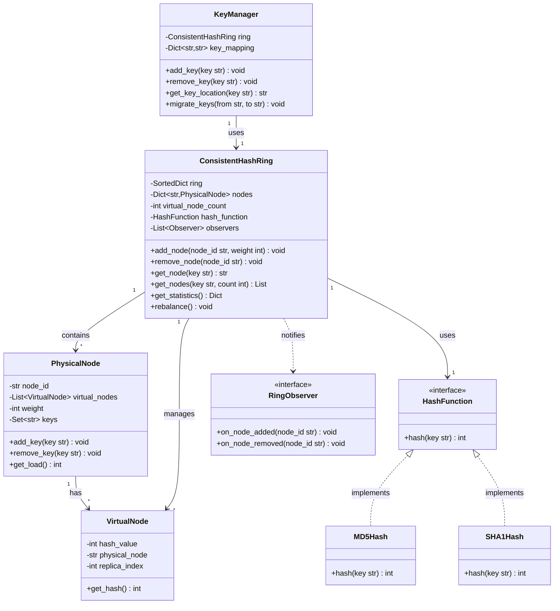

# Consistent Hashing System - Low Level Design

## Table of Contents

- [Overview](#overview)
- [Requirements](#requirements)
  - [Functional Requirements](#functional-requirements)
  - [Non-Functional Requirements](#non-functional-requirements)
- [Core Concepts](#core-concepts)
- [Design Patterns Used](#design-patterns-used)
- [Class Diagram](#class-diagram)
- [Component Design](#component-design)
- [Data Structures](#data-structures)
- [API Design](#api-design)
- [Implementation Details](#implementation-details)
- [Complexity Analysis](#complexity-analysis)
- [Trade-offs and Design Decisions](#trade-offs-and-design-decisions)
- [Testing Strategy](#testing-strategy)
- [Real-World Applications](#real-world-applications)

## Overview

Consistent Hashing is a distributed hashing scheme that operates independently of the number of servers in a distributed hash table. It minimizes key redistribution when nodes are added or removed, making it ideal for distributed systems like caches, databases, and load balancers.

### Key Features

- **Minimal Redistribution**: Only K/N keys need remapping when a node is added/removed (K = keys, N = nodes)
- **Virtual Nodes**: Multiple replicas per physical node for better load distribution
- **Horizontal Scalability**: Easy addition/removal of nodes with minimal disruption
- **Load Balancing**: Uniform key distribution across nodes
- **Fault Tolerance**: Graceful handling of node failures

## Requirements

### Functional Requirements

1. **Hash Ring Management**
   - Create circular hash space (0 to 2^160-1)
   - Add/remove physical nodes
   - Manage virtual nodes for each physical node

2. **Key Operations**
   - Get node for a given key
   - Add/remove keys from the system
   - Handle key migration during node changes

3. **Node Management**
   - Add server nodes to the ring
   - Remove server nodes from the ring
   - Handle node failures gracefully

4. **Load Distribution**
   - Ensure uniform distribution of keys
   - Support configurable virtual nodes
   - Balance load across all nodes

5. **Key Migration**
   - Track keys during node addition/removal
   - Minimize key redistribution
   - Support bulk key migration

### Non-Functional Requirements

1. **Performance**
   - O(log N) lookup time (N = virtual nodes)
   - Fast node addition/removal
   - Efficient key redistribution

2. **Scalability**
   - Support thousands of nodes
   - Handle millions of keys
   - Linear scaling with virtual nodes

3. **Reliability**
   - Consistent key-to-node mapping
   - No single point of failure
   - Predictable behavior

4. **Flexibility**
   - Pluggable hash functions
   - Configurable virtual node count
   - Custom replication factor

## Core Concepts

### 1. Hash Ring

A circular hash space where both nodes and keys are hashed to positions on a ring (0 to 2^160-1).

```text
        Hash Ring (0 to 2^160-1)
        
           0/2^160
              |
        N3 --|-- N1
             |
        N2 --|-- N4
             |
           2^159
           
Clockwise search finds the next node
```

### 2. Virtual Nodes

Each physical node is replicated multiple times on the ring with different hash values.

```text
Benefits:
- Better load distribution
- Smoother key migration
- Handles heterogeneous nodes
- Reduced variance in load

Physical Node A -> Virtual Nodes: A-1, A-2, A-3, ...
```

### 3. Key Placement

Keys are hashed and placed on the ring. The first node found in clockwise direction owns the key.

```text
Key K -> Hash(K) = 150
Nodes on ring: 50, 100, 200, 300
Result: Key K is assigned to node at position 200
```

### 4. Node Addition/Removal

When a node is added or removed, only keys between the node and its predecessor are affected.

```text
Before: N1(100), N2(200), N3(300)
After adding N4(150):
  - Only keys in range (100, 150] move from N2 to N4
  - Impact: ~25% of keys (1 out of 4 nodes)
```

## Design Patterns Used

### 1. Strategy Pattern

- **Purpose**: Pluggable hash functions
- **Usage**: Different hashing algorithms (MD5, SHA-1, MurmurHash)
- **Benefit**: Flexibility to change hash functions

### 2. Singleton Pattern

- **Purpose**: Single hash ring instance
- **Usage**: ConsistentHashRing as singleton
- **Benefit**: Centralized ring management

### 3. Observer Pattern

- **Purpose**: Node change notifications
- **Usage**: Notify clients when nodes are added/removed
- **Benefit**: Reactive system updates

### 4. Template Method Pattern

- **Purpose**: Standardize node operations
- **Usage**: Common workflow for add/remove operations
- **Benefit**: Consistent behavior across operations

### 5. Factory Pattern

- **Purpose**: Create virtual nodes
- **Usage**: VirtualNodeFactory
- **Benefit**: Encapsulated virtual node creation

## Class Diagram



## Component Design

### 1. HashFunction Interface

```python
class HashFunction:
    """
    Abstract interface for hash functions.
    Allows pluggable hashing strategies.
    """
    def hash(self, key: str) -> int:
        """Compute hash value for the given key"""
        pass
```

### 2. VirtualNode

```python
class VirtualNode:
    """
    Represents a virtual replica of a physical node on the ring.
    Each physical node has multiple virtual nodes for better distribution.
    """
    - hash_value: Computed hash position on the ring
    - physical_node: Reference to actual physical node
    - replica_index: Index of this virtual replica
```

### 3. PhysicalNode

```python
class PhysicalNode:
    """
    Represents an actual server/node in the system.
    Manages its virtual nodes and assigned keys.
    """
    - node_id: Unique identifier for the node
    - virtual_nodes: List of virtual node positions
    - weight: Node capacity (affects virtual node count)
    - keys: Set of keys assigned to this node
    - metadata: Additional node information
```

### 4. ConsistentHashRing

```python
class ConsistentHashRing:
    """
    Main hash ring implementation.
    Manages the circular hash space and node operations.
    """
    - ring: Sorted dictionary mapping hash -> node_id
    - nodes: Dictionary of physical nodes
    - virtual_node_count: Number of virtual nodes per physical node
    - hash_function: Strategy for hashing
    - total_keys: Total number of keys in the system
```

### 5. KeyManager

```python
class KeyManager:
    """
    Manages key placement and migration.
    Tracks key-to-node mappings and handles redistribution.
    """
    - ring: Reference to ConsistentHashRing
    - key_mapping: Map of key -> current node
    - migration_log: History of key migrations
```

## Data Structures

### 1. Sorted Dictionary/Tree Map

```text
Purpose: Store ring positions in sorted order
Structure: Red-Black Tree or Sorted List
Operations:
  - Insert: O(log N)
  - Delete: O(log N)
  - Find successor: O(log N)

Implementation: SortedDict in Python, TreeMap in JavaScript
```

### 2. Hash Set

```text
Purpose: Store keys assigned to each node
Structure: Hash table with chaining
Operations:
  - Add: O(1)
  - Remove: O(1)
  - Contains: O(1)
```

### 3. Hash Map

```text
Purpose: Map node IDs to PhysicalNode objects
Structure: Hash table
Operations:
  - Get: O(1)
  - Put: O(1)
  - Delete: O(1)
```

## API Design

### Core Operations

```python
# Node Management
add_node(node_id: str, weight: int = 1) -> bool
    """Add a physical node with optional weight"""
    
remove_node(node_id: str) -> bool
    """Remove a physical node and redistribute its keys"""

# Key Operations
get_node(key: str) -> str
    """Get the node responsible for a given key"""
    
get_nodes(key: str, count: int) -> List[str]
    """Get N nodes for replication (successor nodes)"""

# Statistics
get_statistics() -> Dict
    """
    Returns:
    {
        'total_nodes': int,
        'virtual_nodes': int,
        'total_keys': int,
        'load_distribution': Dict[str, int],
        'load_variance': float
    }
    """

# Load Balancing
rebalance() -> None
    """Rebalance keys across nodes for uniform distribution"""
    
get_load_distribution() -> Dict[str, float]
    """Get load percentage for each node"""
```

### Key Management

```python
# Key Operations
add_key(key: str) -> str
    """Add key and return assigned node"""
    
remove_key(key: str) -> bool
    """Remove key from the system"""
    
get_key_location(key: str) -> str
    """Get current node for a key"""

# Migration
migrate_keys(from_node: str, to_node: str) -> int
    """Migrate keys between nodes, returns count"""
    
get_migration_stats() -> Dict
    """Get statistics about key migrations"""
```

## Implementation Details

### 1. Hash Ring Initialization

```python
def __init__(self, virtual_node_count=150, hash_function=None):
    """
    Initialize the hash ring.
    
    Args:
        virtual_node_count: Number of virtual nodes per physical node
        hash_function: Custom hash function (default: MD5)
    
    virtual_node_count of 150 provides:
    - Standard deviation ~10% with 10 nodes
    - Good balance between memory and distribution
    """
    self.ring = SortedDict()
    self.nodes = {}
    self.virtual_node_count = virtual_node_count
    self.hash_function = hash_function or MD5HashFunction()
```

### 2. Adding a Node

```text
Algorithm:
1. Create PhysicalNode object
2. Generate virtual_node_count virtual nodes
3. For each virtual node:
   a. Compute hash: hash(node_id + "#" + replica_index)
   b. Insert into sorted ring: ring[hash_value] = node_id
4. Find keys that should migrate to new node
5. Redistribute keys from successor node
6. Notify observers

Time Complexity: O(V log N)
  - V = virtual_node_count
  - N = total virtual nodes in ring
```

### 3. Removing a Node

```text
Algorithm:
1. Get all virtual nodes for the physical node
2. For each virtual node:
   a. Remove from ring
   b. Get keys assigned to this virtual node
3. Find successor nodes for each key
4. Migrate keys to successor nodes
5. Remove PhysicalNode object
6. Notify observers

Time Complexity: O(V log N + K)
  - V = virtual_node_count
  - N = total virtual nodes
  - K = keys to migrate
```

### 4. Finding Node for Key

```text
Algorithm:
1. Compute hash value of key: hash(key)
2. Find smallest hash in ring >= hash(key)
3. If not found, wrap around to first node (ring is circular)
4. Return physical node ID

Time Complexity: O(log N)
  - Binary search in sorted ring
```

### 5. Getting Multiple Nodes (for Replication)

```text
Algorithm:
1. Find first node using get_node(key)
2. Continue clockwise to find next N-1 distinct physical nodes
3. Skip duplicate physical nodes (only count distinct)
4. Return list of physical node IDs

Time Complexity: O(log N + R)
  - R = replication factor
  - Usually R << N, so effectively O(log N)
```

### 6. Hash Functions

```python
class MD5HashFunction:
    """
    MD5-based hash function.
    Produces 128-bit hash, converted to integer.
    """
    def hash(self, key: str) -> int:
        return int(hashlib.md5(key.encode()).hexdigest(), 16)

class SHA1HashFunction:
    """
    SHA1-based hash function.
    Produces 160-bit hash, converted to integer.
    """
    def hash(self, key: str) -> int:
        return int(hashlib.sha1(key.encode()).hexdigest(), 16)

class MurmurHashFunction:
    """
    MurmurHash3-based function.
    Fast non-cryptographic hash.
    """
    def hash(self, key: str) -> int:
        # MurmurHash3 implementation
        return murmur3_hash(key)
```

## Complexity Analysis

### Time Complexity

| Operation | Complexity | Notes |
|-----------|------------|-------|
| add_node | O(V log N) | V = virtual nodes, N = total virtual nodes |
| remove_node | O(V log N + K) | K = keys to migrate |
| get_node | O(log N) | Binary search in sorted ring |
| get_nodes | O(log N + R) | R = replication factor |
| add_key | O(log N) | Find node + O(1) add to set |
| remove_key | O(log N) | Find node + O(1) remove from set |
| rebalance | O(N + K) | N = nodes, K = total keys |

### Space Complexity

| Component | Complexity | Notes |
|-----------|------------|-------|
| Ring | O(N × V) | N = physical nodes, V = virtual nodes |
| Nodes Map | O(N) | Physical node objects |
| Keys per Node | O(K) | K = total keys in system |
| Total | O(N × V + K) | Dominated by virtual nodes if V is large |

### Load Distribution Analysis

```text
Standard Deviation Formula:
σ = sqrt(Σ(load_i - avg_load)² / N)

With V virtual nodes per physical node:
- Expected σ decreases as ~1/sqrt(V)
- V = 10: σ ≈ 30%
- V = 50: σ ≈ 15%
- V = 150: σ ≈ 10%
- V = 500: σ ≈ 5%

Trade-off: More virtual nodes → Better distribution but higher memory
```

## Trade-offs and Design Decisions

### 1. Virtual Node Count

**Decision:** Default to 150 virtual nodes per physical node

| Aspect | Low Count (10-50) | High Count (150-500) |
|--------|-------------------|----------------------|
| Memory | Lower | Higher |
| Distribution | Less uniform | More uniform |
| Add/Remove Speed | Faster | Slower |
| Key Migration | More keys moved | Fewer keys moved |

**Rationale:** 150 provides ~10% standard deviation, balancing memory and distribution.

### 2. Hash Function

**Decision:** MD5 as default, with pluggable alternatives

| Hash Function | Speed | Distribution | Use Case |
|--------------|-------|--------------|----------|
| MD5 | Medium | Excellent | General purpose |
| SHA-1 | Slower | Excellent | Security-sensitive |
| MurmurHash3 | Fastest | Very Good | High-performance |

**Rationale:** MD5 offers good balance; MurmurHash for performance-critical systems.

### 3. Data Structure for Ring

**Decision:** Sorted Dictionary (Red-Black Tree)

| Alternative | Pros | Cons |
|-------------|------|------|
| Sorted Array | Simple, cache-friendly | O(N) insertion/deletion |
| Skip List | Simpler than RB-Tree | Probabilistic, more memory |
| Red-Black Tree | Guaranteed O(log N) | Complex implementation |

**Rationale:** Red-Black Tree provides guaranteed performance with reasonable complexity.

### 4. Key Storage

**Decision:** Store keys in each node's hash set

| Alternative | Pros | Cons |
|-------------|------|------|
| Store in nodes | Fast lookup, easy migration | Memory overhead |
| Don't store | Minimal memory | Can't track assignments |
| External store | Flexible | Additional complexity |

**Rationale:** Storing keys simplifies migration and provides visibility into load.

### 5. Weight Support

**Decision:** Support weighted nodes through virtual node multiplication

```text
Node with weight W gets W × virtual_node_count virtual nodes.
Allows heterogeneous node capacities:
- High-capacity server: weight = 2 → 300 virtual nodes
- Low-capacity server: weight = 1 → 150 virtual nodes
```

## Testing Strategy

### Unit Tests

```python
# Ring Operations
test_add_single_node()
test_add_multiple_nodes()
test_remove_node()
test_remove_nonexistent_node()

# Key Operations
test_get_node_for_key()
test_keys_distributed_uniformly()
test_get_multiple_nodes_for_replication()

# Virtual Nodes
test_virtual_node_creation()
test_virtual_node_distribution()
test_weighted_nodes()

# Edge Cases
test_empty_ring()
test_single_node_ring()
test_remove_last_node()
test_very_large_number_of_keys()
```

### Integration Tests

```python
# Migration
test_key_migration_on_node_addition()
test_key_migration_on_node_removal()
test_minimal_key_movement()

# Load Balancing
test_load_distribution_uniformity()
test_load_variance_with_virtual_nodes()
test_weighted_load_distribution()

# Replication
test_replica_placement()
test_replica_diversity()
```

### Performance Tests

```python
# Benchmarks
test_lookup_performance_1M_keys()
test_add_node_performance()
test_remove_node_performance()
test_rebalance_performance()

# Scalability
test_100_nodes_performance()
test_1000_nodes_performance()
test_10M_keys_distribution()
```

### Statistical Tests

```python
# Distribution Quality
test_chi_squared_uniformity()
test_standard_deviation_under_threshold()
test_kolmogorov_smirnov_test()
```

## Real-World Applications

### 1. Distributed Caching (Memcached, Redis Cluster)

```text
Use Case: Shard cache keys across multiple cache servers

Benefits:
- Minimal cache miss during scaling
- Only ~1/N keys need redistribution when adding Nth server
- Automatic load balancing

Example:
  10 cache servers, 1M keys
  Add 1 server: Only ~91K keys (1/11) need to move
  Traditional hash: ~909K keys (10/11) need to move
```

### 2. CDN (Content Delivery Network)

```text
Use Case: Route user requests to edge servers

Benefits:
- Consistent routing of same content to same server (cache hits)
- Smooth server addition/removal
- Geographic load balancing with weights

Example:
  User requests video.mp4
  Hash(video.mp4) → Server in nearest datacenter
  Same video always routes to same server → High cache hit rate
```

### 3. Distributed Databases (Cassandra, DynamoDB)

```text
Use Case: Partition data across database nodes

Benefits:
- Balanced data distribution
- Minimal data movement during scaling
- Natural replication with get_nodes(key, 3)

Example:
  Cassandra uses virtual nodes (tokens) for data partitioning
  Each node owns multiple token ranges
  Adding node: Only adjacent ranges move data
```

### 4. Load Balancers

```text
Use Case: Route requests to backend servers

Benefits:
- Session affinity (same user → same server)
- Smooth server scaling
- Weighted routing based on capacity

Example:
  User123's requests always go to same server
  Enables stateful sessions without shared storage
```

### 5. Distributed Hash Tables (DHT) - Chord, Kademlia

```text
Use Case: P2P file sharing, blockchain

Benefits:
- Decentralized key lookup
- Self-organizing network
- Fault tolerance

Example:
  BitTorrent DHT uses consistent hashing
  Each peer responsible for range of file hashes
  Peer joining/leaving: Minimal disruption
```

## Advanced Features

### 1. Bounded Loads

```text
Problem: Some nodes may get overloaded even with good distribution

Solution: Bounded Load Consistent Hashing
- Set maximum load per node: max_load = avg_load × (1 + ε)
- If node exceeds max_load, route to next node
- Ensures no node exceeds bounded load

Trade-off: Slightly worse distribution for better load guarantee
```

### 2. Jump Consistent Hashing

```text
Alternative: Jump Consistent Hash (Google's algorithm)

Benefits:
- O(1) space (no ring storage)
- Very fast: O(log N) time
- Minimal memory footprint

Limitation:
- Cannot remove individual nodes
- All nodes must be numbered 0 to N-1
- No weighted nodes

Use Case: When node set rarely changes
```

### 3. Rendezvous Hashing (HRW)

```text
Alternative: Highest Random Weight hashing

Algorithm:
1. For each node, compute hash(key + node_id)
2. Select node with highest hash value

Benefits:
- Simpler implementation (no ring)
- Predictable: O(N) to find node

Trade-off: Slower lookup (must check all nodes)

Use Case: Small number of nodes (<100)
```

## Summary

Consistent Hashing is a fundamental technique for distributed systems that:

- **Minimizes disruption** during scaling (only K/N keys move)
- **Balances load** through virtual nodes
- **Enables horizontal scaling** with predictable behavior
- **Provides fault tolerance** through replication support
- **Powers major systems** like Cassandra, DynamoDB, CDNs, and caches

**Key Insights:**

1. Virtual nodes are essential for uniform distribution
2. More virtual nodes → Better distribution but higher memory
3. O(log N) lookup is acceptable for most applications
4. Weighted nodes handle heterogeneous capacities
5. Replication is natural with clockwise successor nodes

**Perfect for:**

- Distributed caching systems
- Sharded databases
- Load balancers with session affinity
- Content delivery networks
- Any system requiring consistent key-to-server mapping
