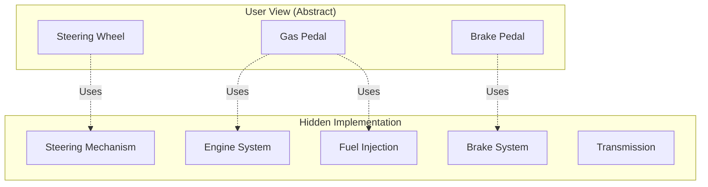
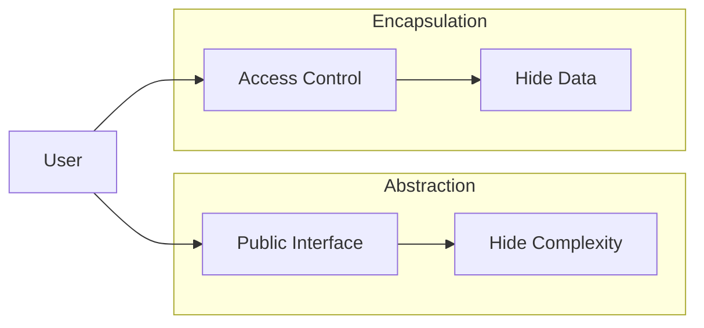
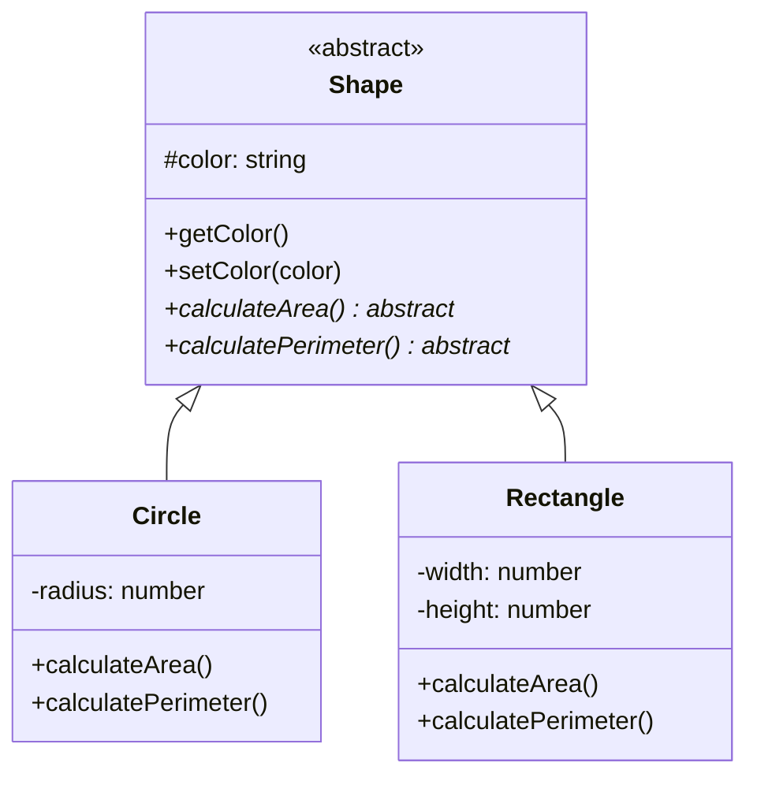
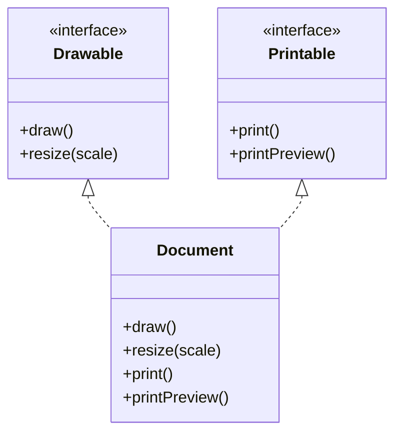
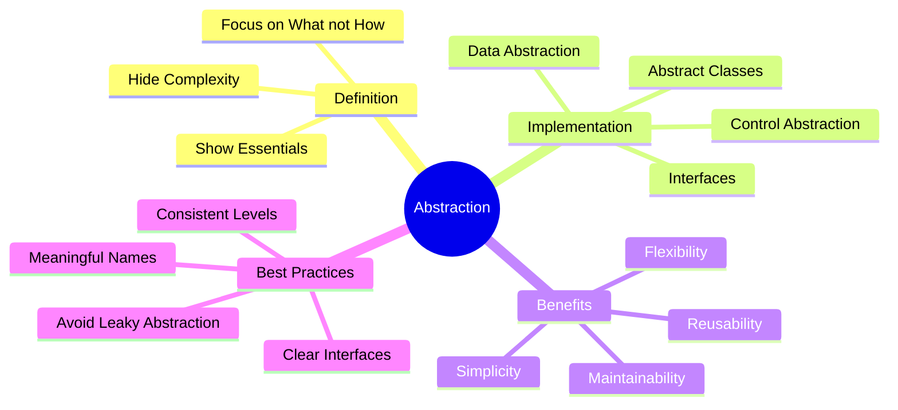

# Abstraction

**Purpose**: Master the concept of abstraction - hiding complex implementation details and exposing only the essential features to simplify interaction with objects.

---

## Table of Contents

1. [What is Abstraction?](#what-is-abstraction)
2. [Abstraction vs Encapsulation](#abstraction-vs-encapsulation)
3. [Types of Abstraction](#types-of-abstraction)
4. [Abstract Classes](#abstract-classes)
5. [Interfaces](#interfaces)
6. [Real-World Examples](#real-world-examples)
7. [Best Practices](#best-practices)
8. [Common Mistakes](#common-mistakes)
9. [Interview Questions](#interview-questions)

---

## What is Abstraction?

**Abstraction** is the process of hiding complex implementation details and showing only the essential features of an object. It allows users to interact with objects at a high level without needing to understand the internal complexity.

### Key Definition

> Abstraction is the concept of exposing only the relevant information and hiding the background details or implementation complexity.

### Real-World Analogy

Think of driving a car:
- **What you see**: Steering wheel, pedals, gear shift (abstract interface)
- **What's hidden**: Engine mechanics, fuel injection, transmission details (implementation)



---

## Abstraction vs Encapsulation

### Key Differences

| Aspect | Abstraction | Encapsulation |
|--------|-------------|---------------|
| **Focus** | Hiding complexity | Hiding data |
| **Purpose** | Show only relevant features | Protect data |
| **Implementation** | Abstract classes, interfaces | Access modifiers |
| **Level** | Design level | Implementation level |
| **Solves** | What to show | How to protect |

### Visual Comparison



### Example Showing Both

**JavaScript:**

```javascript
// Abstraction + Encapsulation Example
class PaymentProcessor {
    // Encapsulation: Private data
    #apiKey;
    #merchantId;
    
    constructor(apiKey, merchantId) {
        this.#apiKey = apiKey;
        this.#merchantId = merchantId;
    }
    
    // Abstraction: Simple interface hiding complex implementation
    processPayment(amount, cardDetails) {
        // User doesn't need to know these steps
        this.#validateCard(cardDetails);
        this.#connectToPaymentGateway();
        this.#authenticateTransaction();
        this.#chargeCard(amount, cardDetails);
        this.#sendConfirmation();
        
        return { success: true, transactionId: this.#generateId() };
    }
    
    // Private methods (implementation hidden)
    #validateCard(cardDetails) {
        // Complex validation logic
        console.log("Validating card...");
    }
    
    #connectToPaymentGateway() {
        // Network connection logic
        console.log("Connecting to gateway...");
    }
    
    #authenticateTransaction() {
        // Authentication logic
        console.log("Authenticating...");
    }
    
    #chargeCard(amount, cardDetails) {
        // Charging logic
        console.log(`Charging $${amount}...`);
    }
    
    #sendConfirmation() {
        // Email/SMS confirmation
        console.log("Sending confirmation...");
    }
    
    #generateId() {
        return `TXN-${Date.now()}`;
    }
}

// Usage - Simple abstraction!
const processor = new PaymentProcessor("api_key_123", "merchant_456");
const result = processor.processPayment(99.99, { cardNumber: "****1234" });
console.log(result); // { success: true, transactionId: "TXN-1234567890" }
```

**Python:**

```python
# Abstraction + Encapsulation Example
class PaymentProcessor:
    # Encapsulation: Private data
    def __init__(self, api_key, merchant_id):
        self.__api_key = api_key
        self.__merchant_id = merchant_id
    
    # Abstraction: Simple interface hiding complex implementation
    def process_payment(self, amount, card_details):
        # User doesn't need to know these steps
        self.__validate_card(card_details)
        self.__connect_to_payment_gateway()
        self.__authenticate_transaction()
        self.__charge_card(amount, card_details)
        self.__send_confirmation()
        
        return {'success': True, 'transactionId': self.__generate_id()}
    
    # Private methods (implementation hidden)
    def __validate_card(self, card_details):
        # Complex validation logic
        print("Validating card...")
    
    def __connect_to_payment_gateway(self):
        # Network connection logic
        print("Connecting to gateway...")
    
    def __authenticate_transaction(self):
        # Authentication logic
        print("Authenticating...")
    
    def __charge_card(self, amount, card_details):
        # Charging logic
        print(f"Charging ${amount}...")
    
    def __send_confirmation(self):
        # Email/SMS confirmation
        print("Sending confirmation...")
    
    def __generate_id(self):
        import time
        return f"TXN-{int(time.time() * 1000)}"

# Usage - Simple abstraction!
processor = PaymentProcessor("api_key_123", "merchant_456")
result = processor.process_payment(99.99, {'cardNumber': '****1234'})
print(result)  # {'success': True, 'transactionId': 'TXN-1234567890'}
```

---

## Types of Abstraction

### 1. Data Abstraction

Hiding data representation and exposing only operations.

```javascript
class Stack {
    #items = [];
    
    push(item) {
        this.#items.push(item);
    }
    
    pop() {
        return this.#items.pop();
    }
    
    peek() {
        return this.#items[this.#items.length - 1];
    }
    
    isEmpty() {
        return this.#items.length === 0;
    }
    
    size() {
        return this.#items.length;
    }
    // User doesn't know #items is an array
}
```

### 2. Control Abstraction

Hiding control flow details.

```javascript
class DatabaseConnection {
    #connection;
    
    async query(sql) {
        // All connection handling abstracted
        await this.#ensureConnected();
        await this.#retryOnFailure(async () => {
            return await this.#executeQuery(sql);
        });
        return this.#formatResults();
    }
    
    #ensureConnected() { /* ... */ }
    #retryOnFailure(fn) { /* ... */ }
    #executeQuery(sql) { /* ... */ }
    #formatResults() { /* ... */ }
}
```

---

## Abstract Classes

### Concept

Abstract classes define a template with some implemented methods and some abstract methods that must be implemented by subclasses.



### JavaScript Implementation

```javascript
// Abstract class (enforced through constructor check)
class Shape {
    #color;
    
    constructor(color) {
        if (new.target === Shape) {
            throw new Error("Cannot instantiate abstract class Shape");
        }
        this.#color = color;
    }
    
    getColor() {
        return this.#color;
    }
    
    setColor(color) {
        this.#color = color;
    }
    
    // Abstract methods (must be implemented by subclasses)
    calculateArea() {
        throw new Error("Method 'calculateArea()' must be implemented");
    }
    
    calculatePerimeter() {
        throw new Error("Method 'calculatePerimeter()' must be implemented");
    }
    
    describe() {
        return `A ${this.#color} shape with area ${this.calculateArea()} 
                and perimeter ${this.calculatePerimeter()}`;
    }
}

class Circle extends Shape {
    #radius;
    
    constructor(color, radius) {
        super(color);
        this.#radius = radius;
    }
    
    calculateArea() {
        return Math.PI * this.#radius ** 2;
    }
    
    calculatePerimeter() {
        return 2 * Math.PI * this.#radius;
    }
}

class Rectangle extends Shape {
    #width;
    #height;
    
    constructor(color, width, height) {
        super(color);
        this.#width = width;
        this.#height = height;
    }
    
    calculateArea() {
        return this.#width * this.#height;
    }
    
    calculatePerimeter() {
        return 2 * (this.#width + this.#height);
    }
}

// Usage
// const shape = new Shape("red"); // ❌ Error: Cannot instantiate abstract class

const circle = new Circle("blue", 5);
console.log(circle.calculateArea());      // 78.54
console.log(circle.calculatePerimeter()); // 31.42
console.log(circle.describe());

const rectangle = new Rectangle("green", 4, 6);
console.log(rectangle.calculateArea());      // 24
console.log(rectangle.calculatePerimeter()); // 20
```

### Python Implementation

```python
from abc import ABC, abstractmethod
import math

# Abstract class
class Shape(ABC):
    def __init__(self, color):
        self.__color = color
    
    def get_color(self):
        return self.__color
    
    def set_color(self, color):
        self.__color = color
    
    # Abstract methods (must be implemented by subclasses)
    @abstractmethod
    def calculate_area(self):
        pass
    
    @abstractmethod
    def calculate_perimeter(self):
        pass
    
    def describe(self):
        return (f"A {self.__color} shape with area {self.calculate_area():.2f} "
                f"and perimeter {self.calculate_perimeter():.2f}")

class Circle(Shape):
    def __init__(self, color, radius):
        super().__init__(color)
        self.__radius = radius
    
    def calculate_area(self):
        return math.pi * self.__radius ** 2
    
    def calculate_perimeter(self):
        return 2 * math.pi * self.__radius

class Rectangle(Shape):
    def __init__(self, color, width, height):
        super().__init__(color)
        self.__width = width
        self.__height = height
    
    def calculate_area(self):
        return self.__width * self.__height
    
    def calculate_perimeter(self):
        return 2 * (self.__width + self.__height)

# Usage
# shape = Shape("red")  # ❌ TypeError: Can't instantiate abstract class

circle = Circle("blue", 5)
print(circle.calculate_area())       # 78.54
print(circle.calculate_perimeter())  # 31.42
print(circle.describe())

rectangle = Rectangle("green", 4, 6)
print(rectangle.calculate_area())       # 24
print(rectangle.calculate_perimeter())  # 20
```

---

## Interfaces

### Concept

Interfaces define a contract that implementing classes must follow, with no implementation details.



### JavaScript Implementation

```javascript
// Interface-like pattern using class
class Drawable {
    draw() {
        throw new Error("Method 'draw()' must be implemented");
    }
    
    resize(scale) {
        throw new Error("Method 'resize()' must be implemented");
    }
}

class Printable {
    print() {
        throw new Error("Method 'print()' must be implemented");
    }
    
    printPreview() {
        throw new Error("Method 'printPreview()' must be implemented");
    }
}

// Multiple inheritance simulation
class Document {
    constructor(content) {
        this.content = content;
        // Mix in interfaces
        Object.assign(this, new Drawable(), new Printable());
    }
    
    draw() {
        console.log(`Drawing document: ${this.content}`);
    }
    
    resize(scale) {
        console.log(`Resizing document by ${scale}x`);
    }
    
    print() {
        console.log(`Printing: ${this.content}`);
    }
    
    printPreview() {
        console.log(`Preview: ${this.content.substring(0, 50)}...`);
    }
}

// Usage
const doc = new Document("This is a sample document content");
doc.draw();
doc.resize(1.5);
doc.print();
doc.printPreview();
```

### Python Implementation

```python
from abc import ABC, abstractmethod

# Interface (using ABC)
class Drawable(ABC):
    @abstractmethod
    def draw(self):
        pass
    
    @abstractmethod
    def resize(self, scale):
        pass

class Printable(ABC):
    @abstractmethod
    def print(self):
        pass
    
    @abstractmethod
    def print_preview(self):
        pass

# Multiple inheritance
class Document(Drawable, Printable):
    def __init__(self, content):
        self.content = content
    
    def draw(self):
        print(f"Drawing document: {self.content}")
    
    def resize(self, scale):
        print(f"Resizing document by {scale}x")
    
    def print(self):
        print(f"Printing: {self.content}")
    
    def print_preview(self):
        print(f"Preview: {self.content[:50]}...")

# Usage
doc = Document("This is a sample document content")
doc.draw()
doc.resize(1.5)
doc.print()
doc.print_preview()
```

---

## Real-World Examples

### Example 1: Database Layer Abstraction

```javascript
// Abstract database interface
class Database {
    connect() { throw new Error("Must implement connect()"); }
    disconnect() { throw new Error("Must implement disconnect()"); }
    query(sql) { throw new Error("Must implement query()"); }
    insert(table, data) { throw new Error("Must implement insert()"); }
}

// Concrete implementations
class MySQLDatabase extends Database {
    #connection;
    
    connect() {
        console.log("Connecting to MySQL...");
        this.#connection = { type: 'mysql' };
    }
    
    disconnect() {
        console.log("Disconnecting from MySQL...");
        this.#connection = null;
    }
    
    query(sql) {
        console.log(`MySQL Query: ${sql}`);
        return [];
    }
    
    insert(table, data) {
        console.log(`MySQL Insert into ${table}:`, data);
    }
}

class MongoDatabase extends Database {
    #connection;
    
    connect() {
        console.log("Connecting to MongoDB...");
        this.#connection = { type: 'mongodb' };
    }
    
    disconnect() {
        console.log("Disconnecting from MongoDB...");
        this.#connection = null;
    }
    
    query(sql) {
        // MongoDB uses different query syntax
        console.log(`MongoDB Find: ${sql}`);
        return [];
    }
    
    insert(table, data) {
        console.log(`MongoDB Insert into ${table}:`, data);
    }
}

// Application code - abstracted from implementation
class UserRepository {
    #db;
    
    constructor(database) {
        this.#db = database;
    }
    
    findAll() {
        return this.#db.query("SELECT * FROM users");
    }
    
    create(userData) {
        this.#db.insert("users", userData);
    }
}

// Usage - easy to switch databases
const mysql = new MySQLDatabase();
mysql.connect();
const userRepo = new UserRepository(mysql);
userRepo.findAll();
userRepo.create({ name: "Alice", email: "alice@example.com" });

// Switch to MongoDB without changing UserRepository
const mongo = new MongoDatabase();
mongo.connect();
const userRepo2 = new UserRepository(mongo);
userRepo2.findAll();
```

### Example 2: Notification System

```javascript
// Abstract notification sender
class NotificationSender {
    send(recipient, message) {
        throw new Error("Must implement send()");
    }
    
    validateRecipient(recipient) {
        throw new Error("Must implement validateRecipient()");
    }
}

class EmailSender extends NotificationSender {
    send(recipient, message) {
        if (!this.validateRecipient(recipient)) {
            throw new Error("Invalid email address");
        }
        console.log(`📧 Sending email to ${recipient}`);
        console.log(`Subject: ${message.subject}`);
        console.log(`Body: ${message.body}`);
    }
    
    validateRecipient(recipient) {
        return /^[^\s@]+@[^\s@]+\.[^\s@]+$/.test(recipient);
    }
}

class SMSSender extends NotificationSender {
    send(recipient, message) {
        if (!this.validateRecipient(recipient)) {
            throw new Error("Invalid phone number");
        }
        console.log(`📱 Sending SMS to ${recipient}`);
        console.log(`Message: ${message.text}`);
    }
    
    validateRecipient(recipient) {
        return /^\+?[\d\s-()]+$/.test(recipient);
    }
}

class PushNotificationSender extends NotificationSender {
    send(recipient, message) {
        if (!this.validateRecipient(recipient)) {
            throw new Error("Invalid device token");
        }
        console.log(`🔔 Sending push notification to ${recipient}`);
        console.log(`Title: ${message.title}`);
        console.log(`Body: ${message.body}`);
    }
    
    validateRecipient(recipient) {
        return recipient.length > 10; // Simplified validation
    }
}

// High-level abstraction
class NotificationService {
    #senders = new Map();
    
    registerSender(type, sender) {
        this.#senders.set(type, sender);
    }
    
    notify(type, recipient, message) {
        const sender = this.#senders.get(type);
        if (!sender) {
            throw new Error(`No sender registered for type: ${type}`);
        }
        sender.send(recipient, message);
    }
}

// Usage
const service = new NotificationService();
service.registerSender('email', new EmailSender());
service.registerSender('sms', new SMSSender());
service.registerSender('push', new PushNotificationSender());

// Simple, abstracted interface
service.notify('email', 'user@example.com', {
    subject: 'Welcome!',
    body: 'Thank you for signing up'
});

service.notify('sms', '+1-555-0123', {
    text: 'Your verification code is 123456'
});

service.notify('push', 'device_token_abc123', {
    title: 'New Message',
    body: 'You have a new message'
});
```

---

## Best Practices

### 1. Define Clear Interfaces

```javascript
// ✅ GOOD: Clear, focused interface
class PaymentMethod {
    processPayment(amount) {}
    validatePaymentDetails(details) {}
    getTransactionFee(amount) {}
}
```

### 2. Keep Abstraction Levels Consistent

```javascript
// ❌ BAD: Mixed abstraction levels
class Order {
    processOrder() {
        this.validateOrder();
        this.connectToDatabase(); // Too low-level!
        this.executeSQL("INSERT..."); // Way too low-level!
    }
}

// ✅ GOOD: Consistent abstraction
class Order {
    processOrder() {
        this.validateOrder();
        this.saveToDatabase();
        this.sendConfirmation();
    }
}
```

### 3. Favor Composition Over Inheritance for Abstraction

```javascript
// ✅ GOOD: Composition
class TextProcessor {
    constructor(formatter, validator) {
        this.formatter = formatter;
        this.validator = validator;
    }
    
    process(text) {
        if (this.validator.isValid(text)) {
            return this.formatter.format(text);
        }
    }
}
```

### 4. Use Meaningful Names

```javascript
// ✅ GOOD: Clear intent
class DataExporter {
    exportToCSV(data) {}
    exportToJSON(data) {}
    exportToXML(data) {}
}
```

---

## Common Mistakes

### Mistake 1: Over-Abstraction

```javascript
// ❌ BAD: Too much abstraction
class NumberAdder {
    add(a, b) {
        return this.performAddition(a, b);
    }
    
    performAddition(a, b) {
        return this.calculateSum(a, b);
    }
    
    calculateSum(a, b) {
        return a + b; // Simple operation, unnecessary layers
    }
}

// ✅ GOOD: Appropriate abstraction
class Calculator {
    add(a, b) {
        return a + b;
    }
}
```

### Mistake 2: Leaky Abstraction

```javascript
// ❌ BAD: Implementation details leak through
class FileStorage {
    save(filename, data) {
        // Leaking MySQL details
        return `INSERT INTO files (name, data) VALUES ('${filename}', '${data}')`;
    }
}

// ✅ GOOD: Clean abstraction
class FileStorage {
    save(filename, data) {
        // Implementation hidden
        console.log(`Saving ${filename}...`);
        return { success: true, id: "file123" };
    }
}
```

---

## Interview Questions

### Q1: What is abstraction in OOP?

**Answer**: Abstraction is the process of hiding complex implementation details and exposing only the essential features. It allows users to interact with objects without needing to understand the underlying complexity.

### Q2: What's the difference between abstraction and encapsulation?

**Answer**:

- **Abstraction**: Focuses on *what* an object does (hiding complexity)
- **Encapsulation**: Focuses on *how* it does it (hiding data)

Abstraction is about design and showing only relevant features, while encapsulation is about implementation and data protection.

### Q3: When should you use an abstract class vs an interface?

**Answer**:

**Abstract Class**:
- When you have common implementation to share
- When you want to provide default behavior
- When classes have a clear "is-a" relationship

**Interface**:
- When you want to define a contract with no implementation
- When you need multiple inheritance
- When unrelated classes should share behavior

### Q4: What is a leaky abstraction?

**Answer**: A leaky abstraction is when implementation details are exposed through the abstraction layer, breaking the principle of hiding complexity. For example, if a database abstraction layer returns SQL-specific error codes.

### Q5: How does abstraction help with code maintenance?

**Answer**:

1. **Flexibility**: Change implementation without affecting users
2. **Modularity**: Separate concerns clearly
3. **Testability**: Easy to mock abstract interfaces
4. **Scalability**: Add new implementations easily
5. **Readability**: High-level code is easier to understand

---

## Summary



---

## Next Steps

1. **Study**: [Inheritance](./inheritance.md)
2. **Study**: [Polymorphism](./polymorphism.md)
3. **Practice**: Create abstract base classes for common scenarios

---

**Key Takeaway**: Abstraction is about hiding complexity and exposing only what's necessary for users to interact with your objects effectively!

