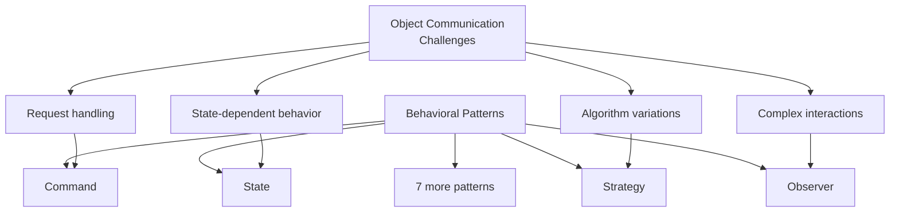
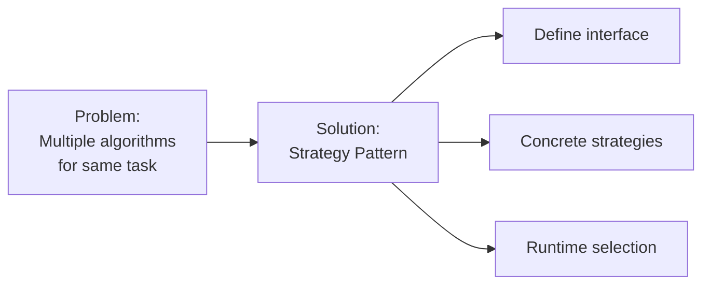
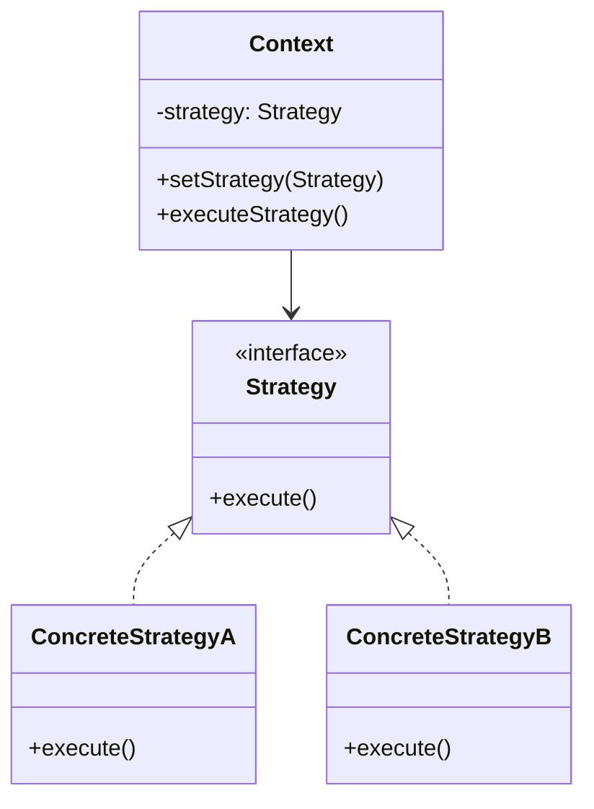
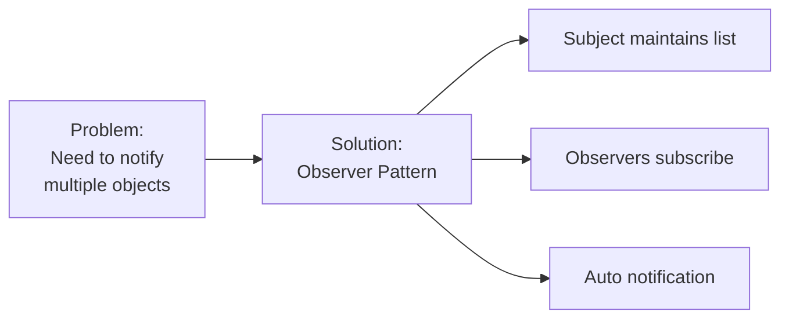
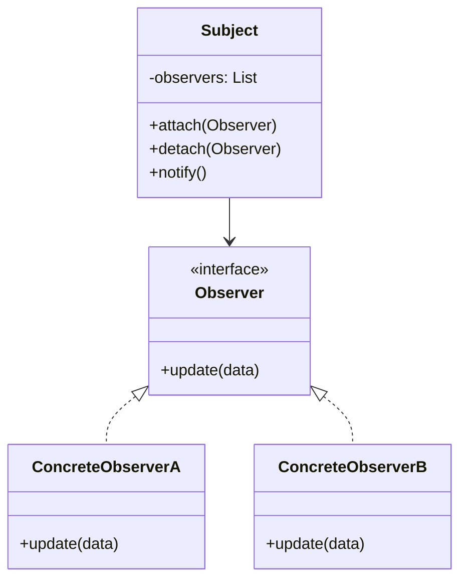
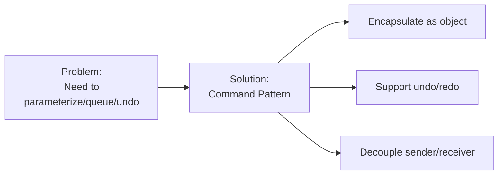
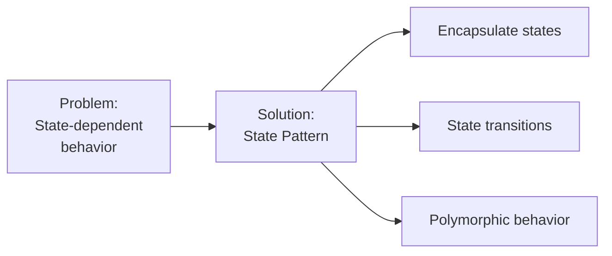
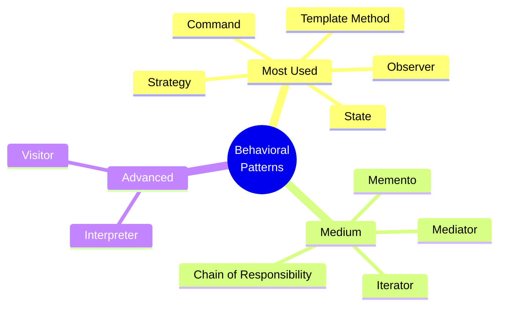

# Behavioral Design Patterns

**Purpose**: Master the 11 behavioral design patterns that define common communication patterns between objects and how responsibilities are distributed among them.

---

## Table of Contents

1. [Overview](#overview)
2. [Strategy Pattern](#strategy-pattern)
3. [Observer Pattern](#observer-pattern)
4. [Command Pattern](#command-pattern)
5. [State Pattern](#state-pattern)
6. [Template Method Pattern](#template-method-pattern)
7. [Chain of Responsibility Pattern](#chain-of-responsibility-pattern)
8. [Iterator Pattern](#iterator-pattern)
9. [Mediator Pattern](#mediator-pattern)
10. [Memento Pattern](#memento-pattern)
11. [Visitor Pattern](#visitor-pattern)
12. [Interpreter Pattern](#interpreter-pattern)
13. [Pattern Comparison](#pattern-comparison)
14. [Interview Questions](#interview-questions)

---

## Overview

**Behavioral patterns** focus on algorithms and the assignment of responsibilities between objects. They describe not just patterns of objects or classes but also the patterns of communication between them.

### Why Behavioral Patterns?



### The 11 Patterns Overview

| Pattern | Purpose | Use When | Complexity |
|---------|---------|----------|------------|
| Strategy | Interchangeable algorithms | Multiple ways to do same thing | Low |
| Observer | One-to-many notification | Changes in one affect many | Low |
| Command | Encapsulate requests | Need undo/redo, queuing | Low |
| State | Behavior changes with state | State-dependent behavior | Medium |
| Template Method | Algorithm skeleton | Common structure, vary steps | Low |
| Chain of Responsibility | Pass request through chain | Multiple handlers | Medium |
| Iterator | Sequential access | Traverse collections | Low |
| Mediator | Centralize communications | Complex object interactions | High |
| Memento | Save/restore state | Undo mechanism | Medium |
| Visitor | Operations on object structure | Add operations without changing classes | High |
| Interpreter | Language grammar | Interpret domain language | High |

---

## Strategy Pattern

**Intent**: Define family of algorithms, encapsulate each one, and make them **interchangeable**.

### Strategy: Problem & Solution



### Strategy: Structure



### Strategy: JavaScript Implementation

```javascript
/**
 * Strategy Pattern - JavaScript Implementation
 * Payment processing with different methods
 */

// Strategy interface
class PaymentStrategy {
    pay(amount) {
        throw new Error('Must implement pay()');
    }
    
    validate() {
        throw new Error('Must implement validate()');
    }
}

// Concrete Strategies
class CreditCardStrategy extends PaymentStrategy {
    constructor(cardNumber, cvv, expiryDate) {
        super();
        this.cardNumber = cardNumber;
        this.cvv = cvv;
        this.expiryDate = expiryDate;
    }
    
    validate() {
        // Validate credit card
        return this.cardNumber.length === 16 && this.cvv.length === 3;
    }
    
    pay(amount) {
        if (!this.validate()) {
            throw new Error('Invalid credit card');
        }
        console.log(`Paid $${amount} using Credit Card ending in ${this.cardNumber.slice(-4)}`);
        return { success: true, method: 'Credit Card' };
    }
}

class PayPalStrategy extends PaymentStrategy {
    constructor(email, password) {
        super();
        this.email = email;
        this.password = password;
    }
    
    validate() {
        return this.email.includes('@') && this.password.length > 6;
    }
    
    pay(amount) {
        if (!this.validate()) {
            throw new Error('Invalid PayPal credentials');
        }
        console.log(`Paid $${amount} using PayPal account ${this.email}`);
        return { success: true, method: 'PayPal' };
    }
}

class CryptoStrategy extends PaymentStrategy {
    constructor(walletAddress, privateKey) {
        super();
        this.walletAddress = walletAddress;
        this.privateKey = privateKey;
    }
    
    validate() {
        return this.walletAddress.length === 42 && this.privateKey.length > 0;
    }
    
    pay(amount) {
        if (!this.validate()) {
            throw new Error('Invalid wallet');
        }
        console.log(`Paid $${amount} using Crypto wallet ${this.walletAddress.slice(0, 8)}...`);
        return { success: true, method: 'Cryptocurrency' };
    }
}

// Context
class PaymentProcessor {
    constructor() {
        this.strategy = null;
    }
    
    setStrategy(strategy) {
        this.strategy = strategy;
    }
    
    processPayment(amount) {
        if (!this.strategy) {
            throw new Error('Payment strategy not set');
        }
        return this.strategy.pay(amount);
    }
}

// Usage
const processor = new PaymentProcessor();

// Use Credit Card
processor.setStrategy(new CreditCardStrategy('1234567890123456', '123', '12/25'));
processor.processPayment(100.00);

// Switch to PayPal
processor.setStrategy(new PayPalStrategy('user@example.com', 'password123'));
processor.processPayment(200.00);

// Switch to Crypto
processor.setStrategy(new CryptoStrategy('0x742d35Cc6634C0532925a3b844Bc9e7595f0bEb', 'privatekey'));
processor.processPayment(300.00);
```

### Strategy: Python Implementation

```python
"""
Strategy Pattern - Python Implementation
Data compression with different algorithms
"""

from abc import ABC, abstractmethod
from typing import bytes

# Strategy interface
class CompressionStrategy(ABC):
    """Abstract compression strategy."""
    
    @abstractmethod
    def compress(self, data: bytes) -> bytes:
        """Compress data."""
        pass
    
    @abstractmethod
    def decompress(self, data: bytes) -> bytes:
        """Decompress data."""
        pass


# Concrete Strategies
class ZipCompression(CompressionStrategy):
    """ZIP compression strategy."""
    
    def compress(self, data: bytes) -> bytes:
        print(f"Compressing {len(data)} bytes using ZIP")
        # Simulate ZIP compression
        compressed = data[:len(data)//2]  # Mock: 50% compression
        print(f"Compressed to {len(compressed)} bytes")
        return compressed
    
    def decompress(self, data: bytes) -> bytes:
        print(f"Decompressing {len(data)} bytes using ZIP")
        # Simulate ZIP decompression
        decompressed = data * 2  # Mock: restore original
        return decompressed


class RarCompression(CompressionStrategy):
    """RAR compression strategy."""
    
    def compress(self, data: bytes) -> bytes:
        print(f"Compressing {len(data)} bytes using RAR")
        # Simulate RAR compression (better ratio)
        compressed = data[:len(data)//3]  # Mock: 66% compression
        print(f"Compressed to {len(compressed)} bytes")
        return compressed
    
    def decompress(self, data: bytes) -> bytes:
        print(f"Decompressing {len(data)} bytes using RAR")
        # Simulate RAR decompression
        decompressed = data * 3  # Mock: restore original
        return decompressed


class LzmaCompression(CompressionStrategy):
    """LZMA compression strategy."""
    
    def compress(self, data: bytes) -> bytes:
        print(f"Compressing {len(data)} bytes using LZMA")
        # Simulate LZMA compression (best ratio, slow)
        compressed = data[:len(data)//4]  # Mock: 75% compression
        print(f"Compressed to {len(compressed)} bytes")
        return compressed
    
    def decompress(self, data: bytes) -> bytes:
        print(f"Decompressing {len(data)} bytes using LZMA")
        # Simulate LZMA decompression
        decompressed = data * 4  # Mock: restore original
        return decompressed


# Context
class FileCompressor:
    """File compressor that uses strategy."""
    
    def __init__(self, strategy: CompressionStrategy):
        self._strategy = strategy
    
    def set_strategy(self, strategy: CompressionStrategy) -> None:
        """Change compression strategy at runtime."""
        self._strategy = strategy
    
    def compress_file(self, data: bytes) -> bytes:
        """Compress file using current strategy."""
        return self._strategy.compress(data)
    
    def decompress_file(self, data: bytes) -> bytes:
        """Decompress file using current strategy."""
        return self._strategy.decompress(data)


# Usage
def main():
    data = b"Sample data to compress" * 100
    
    # Use ZIP
    compressor = FileCompressor(ZipCompression())
    compressed = compressor.compress_file(data)
    
    print("\n" + "="*50 + "\n")
    
    # Switch to RAR
    compressor.set_strategy(RarCompression())
    compressed = compressor.compress_file(data)
    
    print("\n" + "="*50 + "\n")
    
    # Switch to LZMA
    compressor.set_strategy(LzmaCompression())
    compressed = compressor.compress_file(data)


if __name__ == "__main__":
    main()
```

### Strategy: Best Practices

**✅ DO:**

- Use when you have multiple algorithms for same task
- Allow runtime strategy selection
- Keep strategies independent and interchangeable
- Use composition over inheritance

**❌ DON'T:**

- Use for single algorithm
- Create strategies with complex dependencies
- Expose strategy implementation details to client
- Mix business logic with strategy selection

---

## Observer Pattern

**Intent**: Define one-to-many dependency so when one object changes state, all dependents are **notified automatically**.

### Observer: Problem & Solution



### Observer: Structure



### Observer: JavaScript Implementation

```javascript
/**
 * Observer Pattern - JavaScript Implementation
 * Stock market ticker with multiple subscribers
 */

// Observer interface
class Observer {
    update(data) {
        throw new Error('Must implement update()');
    }
}

// Subject
class StockTicker {
    constructor(symbol) {
        this.symbol = symbol;
        this.price = 0;
        this.observers = [];
    }
    
    attach(observer) {
        if (!this.observers.includes(observer)) {
            this.observers.push(observer);
            console.log(`Observer attached to ${this.symbol}`);
        }
    }
    
    detach(observer) {
        const index = this.observers.indexOf(observer);
        if (index > -1) {
            this.observers.splice(index, 1);
            console.log(`Observer detached from ${this.symbol}`);
        }
    }
    
    notify() {
        console.log(`\nNotifying ${this.observers.length} observers about ${this.symbol}`);
        this.observers.forEach(observer => {
            observer.update({
                symbol: this.symbol,
                price: this.price,
                timestamp: new Date()
            });
        });
    }
    
    setPrice(newPrice) {
        console.log(`\n${this.symbol} price changing: $${this.price} → $${newPrice}`);
        this.price = newPrice;
        this.notify();
    }
}

// Concrete Observers
class MobileApp extends Observer {
    constructor(userId) {
        super();
        this.userId = userId;
    }
    
    update(data) {
        console.log(`📱 Mobile App [${this.userId}]: ${data.symbol} is now $${data.price}`);
    }
}

class EmailAlert extends Observer {
    constructor(email) {
        super();
        this.email = email;
    }
    
    update(data) {
        console.log(`📧 Email Alert [${this.email}]: Sending email about ${data.symbol} @ $${data.price}`);
    }
}

class TradingBot extends Observer {
    constructor(strategy) {
        super();
        this.strategy = strategy;
    }
    
    update(data) {
        console.log(`🤖 Trading Bot [${this.strategy}]: Analyzing ${data.symbol} @ $${data.price}`);
        if (data.price < 100) {
            console.log(`   → BUY signal triggered!`);
        } else if (data.price > 150) {
            console.log(`   → SELL signal triggered!`);
        }
    }
}

// Usage
const applStock = new StockTicker('AAPL');

const mobileApp = new MobileApp('user123');
const emailAlert = new EmailAlert('trader@example.com');
const tradingBot = new TradingBot('momentum');

applStock.attach(mobileApp);
applStock.attach(emailAlert);
applStock.attach(tradingBot);

applStock.setPrice(150);
applStock.setPrice(95);

applStock.detach(emailAlert);
applStock.setPrice(160);
```

### Observer: Python Implementation

```python
"""
Observer Pattern - Python Implementation
Weather station with multiple displays
"""

from abc import ABC, abstractmethod
from typing import List, Dict
from datetime import datetime

# Observer interface
class Observer(ABC):
    """Abstract observer."""
    
    @abstractmethod
    def update(self, data: Dict) -> None:
        """Receive update from subject."""
        pass


# Subject
class WeatherStation:
    """Weather station subject."""
    
    def __init__(self):
        self._observers: List[Observer] = []
        self._temperature: float = 0.0
        self._humidity: float = 0.0
        self._pressure: float = 0.0
    
    def attach(self, observer: Observer) -> None:
        """Attach an observer."""
        if observer not in self._observers:
            self._observers.append(observer)
            print(f"Observer {observer.__class__.__name__} attached")
    
    def detach(self, observer: Observer) -> None:
        """Detach an observer."""
        if observer in self._observers:
            self._observers.remove(observer)
            print(f"Observer {observer.__class__.__name__} detached")
    
    def notify(self) -> None:
        """Notify all observers."""
        print(f"\n🌡️  Notifying {len(self._observers)} observers...")
        data = {
            'temperature': self._temperature,
            'humidity': self._humidity,
            'pressure': self._pressure,
            'timestamp': datetime.now()
        }
        for observer in self._observers:
            observer.update(data)
    
    def set_measurements(self, temp: float, humidity: float, pressure: float) -> None:
        """Set new measurements and notify observers."""
        print(f"\n📊 New measurements received:")
        print(f"   Temperature: {temp}°C, Humidity: {humidity}%, Pressure: {pressure}hPa")
        self._temperature = temp
        self._humidity = humidity
        self._pressure = pressure
        self.notify()


# Concrete Observers
class CurrentConditionsDisplay(Observer):
    """Display current conditions."""
    
    def update(self, data: Dict) -> None:
        print(f"\n📺 Current Conditions Display:")
        print(f"   Temperature: {data['temperature']}°C")
        print(f"   Humidity: {data['humidity']}%")
        print(f"   Pressure: {data['pressure']}hPa")


class StatisticsDisplay(Observer):
    """Display statistics."""
    
    def __init__(self):
        self.temperatures: List[float] = []
    
    def update(self, data: Dict) -> None:
        self.temperatures.append(data['temperature'])
        avg_temp = sum(self.temperatures) / len(self.temperatures)
        min_temp = min(self.temperatures)
        max_temp = max(self.temperatures)
        
        print(f"\n📊 Statistics Display:")
        print(f"   Avg: {avg_temp:.1f}°C, Min: {min_temp}°C, Max: {max_temp}°C")


class ForecastDisplay(Observer):
    """Display forecast."""
    
    def __init__(self):
        self.last_pressure: float = 0.0
    
    def update(self, data: Dict) -> None:
        current_pressure = data['pressure']
        
        print(f"\n🌤️  Forecast Display:")
        if current_pressure > self.last_pressure:
            print("   Improving weather on the way!")
        elif current_pressure < self.last_pressure:
            print("   Watch out for cooler, rainy weather")
        else:
            print("   More of the same")
        
        self.last_pressure = current_pressure


# Usage
def main():
    station = WeatherStation()
    
    current_display = CurrentConditionsDisplay()
    stats_display = StatisticsDisplay()
    forecast_display = ForecastDisplay()
    
    station.attach(current_display)
    station.attach(stats_display)
    station.attach(forecast_display)
    
    station.set_measurements(25.0, 65.0, 1013.0)
    station.set_measurements(27.0, 70.0, 1015.0)
    
    station.detach(forecast_display)
    station.set_measurements(23.0, 75.0, 1012.0)


if __name__ == "__main__":
    main()
```

### Observer: Best Practices

**✅ DO:**

- Use for event-driven systems
- Decouple subject and observers
- Consider weak references to avoid memory leaks
- Handle observer exceptions gracefully

**❌ DON'T:**

- Create circular dependencies
- Update observers in specific order (should be independent)
- Perform heavy operations in update()
- Forget to detach observers

---

## Command Pattern

**Intent**: Encapsulate a request as an **object**, allowing parameterization, queuing, and **undo/redo**.

### Command: Problem & Solution



### Command: JavaScript Implementation

```javascript
/**
 * Command Pattern - JavaScript Implementation
 * Text editor with undo/redo functionality
 */

// Command interface
class Command {
    execute() {
        throw new Error('Must implement execute()');
    }
    
    undo() {
        throw new Error('Must implement undo()');
    }
}

// Receiver
class TextEditor {
    constructor() {
        this.text = '';
    }
    
    getText() {
        return this.text;
    }
    
    setText(text) {
        this.text = text;
    }
    
    insertText(position, newText) {
        this.text = this.text.slice(0, position) + newText + this.text.slice(position);
    }
    
    deleteText(position, length) {
        this.text = this.text.slice(0, position) + this.text.slice(position + length);
    }
}

// Concrete Commands
class InsertCommand extends Command {
    constructor(editor, text, position) {
        super();
        this.editor = editor;
        this.text = text;
        this.position = position;
    }
    
    execute() {
        this.editor.insertText(this.position, this.text);
        console.log(`Inserted "${this.text}" at position ${this.position}`);
    }
    
    undo() {
        this.editor.deleteText(this.position, this.text.length);
        console.log(`Undid insertion of "${this.text}"`);
    }
}

class DeleteCommand extends Command {
    constructor(editor, position, length) {
        super();
        this.editor = editor;
        this.position = position;
        this.length = length;
        this.deletedText = '';
    }
    
    execute() {
        this.deletedText = this.editor.getText().slice(this.position, this.position + this.length);
        this.editor.deleteText(this.position, this.length);
        console.log(`Deleted "${this.deletedText}" from position ${this.position}`);
    }
    
    undo() {
        this.editor.insertText(this.position, this.deletedText);
        console.log(`Undid deletion, restored "${this.deletedText}"`);
    }
}

// Invoker
class CommandManager {
    constructor() {
        this.history = [];
        this.current = -1;
    }
    
    execute(command) {
        // Remove any commands after current position (for redo)
        this.history = this.history.slice(0, this.current + 1);
        
        command.execute();
        this.history.push(command);
        this.current++;
    }
    
    undo() {
        if (this.current >= 0) {
            const command = this.history[this.current];
            command.undo();
            this.current--;
        } else {
            console.log('Nothing to undo');
        }
    }
    
    redo() {
        if (this.current < this.history.length - 1) {
            this.current++;
            const command = this.history[this.current];
            command.execute();
        } else {
            console.log('Nothing to redo');
        }
    }
}

// Usage
const editor = new TextEditor();
const manager = new CommandManager();

console.log('Initial text:', editor.getText());

manager.execute(new InsertCommand(editor, 'Hello', 0));
console.log('Text:', editor.getText());

manager.execute(new InsertCommand(editor, ' World', 5));
console.log('Text:', editor.getText());

manager.execute(new DeleteCommand(editor, 5, 6));
console.log('Text:', editor.getText());

console.log('\n--- Undo Operations ---');
manager.undo();
console.log('Text:', editor.getText());

manager.undo();
console.log('Text:', editor.getText());

console.log('\n--- Redo Operations ---');
manager.redo();
console.log('Text:', editor.getText());
```

### Command: Python Implementation

```python
"""
Command Pattern - Python Implementation
Smart home automation system
"""

from abc import ABC, abstractmethod
from typing import List
from datetime import datetime

# Command interface
class Command(ABC):
    """Abstract command."""
    
    @abstractmethod
    def execute(self) -> None:
        pass
    
    @abstractmethod
    def undo(self) -> None:
        pass


# Receivers
class Light:
    """Light receiver."""
    
    def __init__(self, location: str):
        self.location = location
        self.is_on = False
        self.brightness = 0
    
    def turn_on(self) -> None:
        self.is_on = True
        self.brightness = 100
        print(f"💡 {self.location} light is ON (100%)")
    
    def turn_off(self) -> None:
        self.is_on = False
        self.brightness = 0
        print(f"💡 {self.location} light is OFF")
    
    def dim(self, level: int) -> None:
        self.brightness = level
        print(f"💡 {self.location} light dimmed to {level}%")


class Thermostat:
    """Thermostat receiver."""
    
    def __init__(self):
        self.temperature = 20
    
    def set_temperature(self, temp: int) -> None:
        self.temperature = temp
        print(f"🌡️  Thermostat set to {temp}°C")


# Concrete Commands
class LightOnCommand(Command):
    """Turn light on command."""
    
    def __init__(self, light: Light):
        self.light = light
    
    def execute(self) -> None:
        self.light.turn_on()
    
    def undo(self) -> None:
        self.light.turn_off()


class LightOffCommand(Command):
    """Turn light off command."""
    
    def __init__(self, light: Light):
        self.light = light
    
    def execute(self) -> None:
        self.light.turn_off()
    
    def undo(self) -> None:
        self.light.turn_on()


class DimLightCommand(Command):
    """Dim light command."""
    
    def __init__(self, light: Light, level: int):
        self.light = light
        self.level = level
        self.previous_brightness = 0
    
    def execute(self) -> None:
        self.previous_brightness = self.light.brightness
        self.light.dim(self.level)
    
    def undo(self) -> None:
        self.light.dim(self.previous_brightness)


class SetTemperatureCommand(Command):
    """Set temperature command."""
    
    def __init__(self, thermostat: Thermostat, temperature: int):
        self.thermostat = thermostat
        self.temperature = temperature
        self.previous_temperature = 0
    
    def execute(self) -> None:
        self.previous_temperature = self.thermostat.temperature
        self.thermostat.set_temperature(self.temperature)
    
    def undo(self) -> None:
        self.thermostat.set_temperature(self.previous_temperature)


# Macro Command
class MacroCommand(Command):
    """Execute multiple commands."""
    
    def __init__(self, commands: List[Command]):
        self.commands = commands
    
    def execute(self) -> None:
        print("\n🎬 Executing macro command...")
        for command in self.commands:
            command.execute()
    
    def undo(self) -> None:
        print("\n↩️  Undoing macro command...")
        for command in reversed(self.commands):
            command.undo()


# Invoker
class RemoteControl:
    """Remote control invoker."""
    
    def __init__(self):
        self.history: List[Command] = []
    
    def press_button(self, command: Command) -> None:
        command.execute()
        self.history.append(command)
    
    def press_undo(self) -> None:
        if self.history:
            command = self.history.pop()
            command.undo()
        else:
            print("Nothing to undo")


# Usage
def main():
    # Create receivers
    living_room_light = Light("Living Room")
    bedroom_light = Light("Bedroom")
    thermostat = Thermostat()
    
    # Create commands
    living_room_on = LightOnCommand(living_room_light)
    bedroom_on = LightOnCommand(bedroom_light)
    bedroom_dim = DimLightCommand(bedroom_light, 30)
    set_temp = SetTemperatureCommand(thermostat, 22)
    
    # Create macro for "Good Night" mode
    good_night = MacroCommand([
        LightOffCommand(living_room_light),
        bedroom_dim,
        SetTemperatureCommand(thermostat, 18)
    ])
    
    # Create remote
    remote = RemoteControl()
    
    # Use remote
    remote.press_button(living_room_on)
    remote.press_button(bedroom_on)
    remote.press_button(set_temp)
    
    print("\n--- Activating Good Night Mode ---")
    remote.press_button(good_night)
    
    print("\n--- Undo Last Action ---")
    remote.press_undo()


if __name__ == "__main__":
    main()
```

### Command: Best Practices

**✅ DO:**

- Use for undo/redo functionality
- Encapsulate all information needed to execute
- Support macro commands (composite)
- Queue commands for later execution

**❌ DON'T:**

- Make commands stateful (except for undo data)
- Couple command with specific receiver
- Use for simple method calls
- Forget to implement undo properly

---

## State Pattern

**Intent**: Allow object to alter behavior when its **internal state changes**.

### State: Problem & Solution



### State: JavaScript Implementation

```javascript
/**
 * State Pattern - JavaScript Implementation
 * Vending machine with different states
 */

// State interface
class VendingMachineState {
    insertCoin(machine) {
        throw new Error('Must implement insertCoin()');
    }
    
    selectProduct(machine) {
        throw new Error('Must implement selectProduct()');
    }
    
    dispense(machine) {
        throw new Error('Must implement dispense()');
    }
}

// Concrete States
class IdleState extends VendingMachineState {
    insertCoin(machine) {
        console.log('💰 Coin inserted');
        machine.setState(machine.hasMoneyState);
    }
    
    selectProduct(machine) {
        console.log('⚠️  Please insert coin first');
    }
    
    dispense(machine) {
        console.log('⚠️  Please insert coin first');
    }
}

class HasMoneyState extends VendingMachineState {
    insertCoin(machine) {
        console.log('💰 Additional coin inserted');
        machine.addMoney(1);
    }
    
    selectProduct(machine) {
        console.log('🎯 Product selected');
        machine.setState(machine.dispensingState);
    }
    
    dispense(machine) {
        console.log('⚠️  Please select a product first');
    }
}

class DispensingState extends VendingMachineState {
    insertCoin(machine) {
        console.log('⚠️  Please wait, dispensing product');
    }
    
    selectProduct(machine) {
        console.log('⚠️  Already dispensing');
    }
    
    dispense(machine) {
        if (machine.getStock() > 0) {
            console.log('✅ Product dispensed!');
            machine.releaseProduct();
            
            if (machine.getStock() > 0) {
                machine.setState(machine.idleState);
            } else {
                console.log('⚠️  Machine is now out of stock');
                machine.setState(machine.outOfStockState);
            }
        }
    }
}

class OutOfStockState extends VendingMachineState {
    insertCoin(machine) {
        console.log('⚠️  Out of stock. Coin returned.');
    }
    
    selectProduct(machine) {
        console.log('⚠️  Out of stock');
    }
    
    dispense(machine) {
        console.log('⚠️  Out of stock');
    }
}

// Context
class VendingMachine {
    constructor(stock) {
        this.stock = stock;
        this.money = 0;
        
        // Create all states
        this.idleState = new IdleState();
        this.hasMoneyState = new HasMoneyState();
        this.dispensingState = new DispensingState();
        this.outOfStockState = new OutOfStockState();
        
        // Set initial state
        this.currentState = this.idleState;
    }
    
    setState(state) {
        this.currentState = state;
        console.log(`[State changed to: ${state.constructor.name}]`);
    }
    
    insertCoin() {
        this.currentState.insertCoin(this);
    }
    
    selectProduct() {
        this.currentState.selectProduct(this);
    }
    
    dispense() {
        this.currentState.dispense(this);
    }
    
    addMoney(amount) {
        this.money += amount;
    }
    
    releaseProduct() {
        this.stock--;
        this.money = 0;
    }
    
    getStock() {
        return this.stock;
    }
}

// Usage
const machine = new VendingMachine(2);

console.log('\n=== Transaction 1 ===');
machine.insertCoin();
machine.selectProduct();
machine.dispense();

console.log('\n=== Transaction 2 ===');
machine.insertCoin();
machine.selectProduct();
machine.dispense();

console.log('\n=== Transaction 3 (Out of Stock) ===');
machine.insertCoin();
```

### State: Python Implementation

```python
"""
State Pattern - Python Implementation
TCP connection with different states
"""

from abc import ABC, abstractmethod

# State interface
class TCPState(ABC):
    """Abstract TCP state."""
    
    @abstractmethod
    def open(self, connection) -> None:
        pass
    
    @abstractmethod
    def close(self, connection) -> None:
        pass
    
    @abstractmethod
    def acknowledge(self, connection) -> None:
        pass


# Concrete States
class TCPClosed(TCPState):
    """Closed state."""
    
    def open(self, connection) -> None:
        print("🔌 Opening connection...")
        connection.set_state(connection.listen_state)
    
    def close(self, connection) -> None:
        print("⚠️  Connection already closed")
    
    def acknowledge(self, connection) -> None:
        print("⚠️  Cannot acknowledge in closed state")


class TCPListen(TCPState):
    """Listen state."""
    
    def open(self, connection) -> None:
        print("⚠️  Connection already open")
    
    def close(self, connection) -> None:
        print("🔌 Closing connection...")
        connection.set_state(connection.closed_state)
    
    def acknowledge(self, connection) -> None:
        print("✅ Connection acknowledged, establishing...")
        connection.set_state(connection.established_state)


class TCPEstablished(TCPState):
    """Established state."""
    
    def open(self, connection) -> None:
        print("⚠️  Connection already established")
    
    def close(self, connection) -> None:
        print("🔌 Closing connection...")
        connection.set_state(connection.closed_state)
    
    def acknowledge(self, connection) -> None:
        print("✅ Data acknowledged")


# Context
class TCPConnection:
    """TCP connection context."""
    
    def __init__(self):
        # Create all states
        self.closed_state = TCPClosed()
        self.listen_state = TCPListen()
        self.established_state = TCPEstablished()
        
        # Set initial state
        self._state = self.closed_state
    
    def set_state(self, state: TCPState) -> None:
        """Change state."""
        self._state = state
        print(f"[State: {state.__class__.__name__}]\n")
    
    def open(self) -> None:
        """Open connection."""
        self._state.open(self)
    
    def close(self) -> None:
        """Close connection."""
        self._state.close(self)
    
    def acknowledge(self) -> None:
        """Acknowledge."""
        self._state.acknowledge(self)


# Usage
def main():
    connection = TCPConnection()
    
    print("=== Scenario 1: Normal Connection ===\n")
    connection.open()
    connection.acknowledge()
    connection.close()
    
    print("\n=== Scenario 2: Invalid Operations ===\n")
    connection.open()
    connection.open()  # Already open
    connection.close()
    connection.acknowledge()  # Already closed


if __name__ == "__main__":
    main()
```

### State: Best Practices

**✅ DO:**

- Use when behavior changes with state
- Encapsulate state-specific behavior
- Make state transitions explicit
- Keep states independent

**❌ DON'T:**

- Use for simple if/else logic
- Make states aware of too many other states
- Create too many state classes
- Mix state logic with context logic

---

## Template Method Pattern

**Intent**: Define skeleton of algorithm, letting subclasses **redefine certain steps** without changing structure.

### Template Method: JavaScript Implementation

```javascript
/**
 * Template Method Pattern - JavaScript Implementation
 * Data mining from different file formats
 */

// Abstract class
class DataMiner {
    /**
     * Template method - defines algorithm skeleton
     */
    mine(path) {
        console.log('\n📊 Starting data mining process...\n');
        
        const file = this.openFile(path);
        const rawData = this.extractData(file);
        const data = this.parseData(rawData);
        const analysis = this.analyzeData(data);
        this.sendReport(analysis);
        this.closeFile(file);
        
        console.log('\n✅ Data mining complete!\n');
    }
    
    // Steps to be implemented by subclasses
    openFile(path) {
        throw new Error('Must implement openFile()');
    }
    
    extractData(file) {
        throw new Error('Must implement extractData()');
    }
    
    parseData(rawData) {
        throw new Error('Must implement parseData()');
    }
    
    // Hook methods (can be overridden)
    analyzeData(data) {
        console.log(`Step 4: Analyzing data (${data.length} records)`);
        return { totalRecords: data.length, summary: 'Basic analysis' };
    }
    
    sendReport(analysis) {
        console.log(`Step 5: Sending report`);
        console.log(`  → ${JSON.stringify(analysis)}`);
    }
    
    closeFile(file) {
        console.log(`Step 6: Closing file`);
    }
}

// Concrete classes
class CSVDataMiner extends DataMiner {
    openFile(path) {
        console.log(`Step 1: Opening CSV file: ${path}`);
        return { type: 'CSV', path };
    }
    
    extractData(file) {
        console.log(`Step 2: Extracting CSV data`);
        return 'col1,col2,col3\nval1,val2,val3\nval4,val5,val6';
    }
    
    parseData(rawData) {
        console.log(`Step 3: Parsing CSV format`);
        const lines = rawData.split('\n');
        const headers = lines[0].split(',');
        const data = lines.slice(1).map(line => {
            const values = line.split(',');
            const obj = {};
            headers.forEach((header, i) => obj[header] = values[i]);
            return obj;
        });
        return data;
    }
}

class JSONDataMiner extends DataMiner {
    openFile(path) {
        console.log(`Step 1: Opening JSON file: ${path}`);
        return { type: 'JSON', path };
    }
    
    extractData(file) {
        console.log(`Step 2: Extracting JSON data`);
        return '[{"name":"John","age":30},{"name":"Jane","age":25}]';
    }
    
    parseData(rawData) {
        console.log(`Step 3: Parsing JSON format`);
        return JSON.parse(rawData);
    }
    
    // Override hook method
    analyzeData(data) {
        console.log(`Step 4: Advanced JSON analysis`);
        const avgAge = data.reduce((sum, item) => sum + item.age, 0) / data.length;
        return { 
            totalRecords: data.length, 
            averageAge: avgAge,
            summary: 'Advanced analysis' 
        };
    }
}

// Usage
console.log('=== Mining CSV Data ===');
const csvMiner = new CSVDataMiner();
csvMiner.mine('data.csv');

console.log('\n' + '='.repeat(50));
console.log('=== Mining JSON Data ===');
const jsonMiner = new JSONDataMiner();
jsonMiner.mine('data.json');
```

### Template Method: Python Implementation

```python
"""
Template Method Pattern - Python Implementation
Beverage preparation with different recipes
"""

from abc import ABC, abstractmethod

# Abstract class
class Beverage(ABC):
    """Abstract beverage class with template method."""
    
    def prepare_recipe(self) -> None:
        """Template method - defines algorithm skeleton."""
        print(f"\n☕ Preparing {self.__class__.__name__}...\n")
        
        self.boil_water()
        self.brew()
        self.pour_in_cup()
        
        if self.customer_wants_condiments():
            self.add_condiments()
        
        print(f"\n✅ {self.__class__.__name__} is ready!\n")
    
    # Common steps (implemented in base class)
    def boil_water(self) -> None:
        """Boil water (same for all beverages)."""
        print("1. Boiling water 💧")
    
    def pour_in_cup(self) -> None:
        """Pour in cup (same for all beverages)."""
        print("3. Pouring into cup ☕")
    
    # Steps to be implemented by subclasses
    @abstractmethod
    def brew(self) -> None:
        """Brew the beverage."""
        pass
    
    @abstractmethod
    def add_condiments(self) -> None:
        """Add condiments."""
        pass
    
    # Hook method (optional override)
    def customer_wants_condiments(self) -> bool:
        """Hook method - can be overridden."""
        return True


# Concrete classes
class Tea(Beverage):
    """Tea preparation."""
    
    def brew(self) -> None:
        print("2. Steeping the tea 🍵")
    
    def add_condiments(self) -> None:
        print("4. Adding lemon 🍋")


class Coffee(Beverage):
    """Coffee preparation."""
    
    def brew(self) -> None:
        print("2. Dripping coffee through filter ☕")
    
    def add_condiments(self) -> None:
        print("4. Adding sugar and milk 🥛")


class BlackCoffee(Beverage):
    """Black coffee (no condiments)."""
    
    def brew(self) -> None:
        print("2. Brewing strong black coffee ☕")
    
    def add_condiments(self) -> None:
        # Not used because customer_wants_condiments returns False
        pass
    
    def customer_wants_condiments(self) -> bool:
        """Override hook - no condiments for black coffee."""
        return False


# Usage
def main():
    print("=" * 50)
    tea = Tea()
    tea.prepare_recipe()
    
    print("=" * 50)
    coffee = Coffee()
    coffee.prepare_recipe()
    
    print("=" * 50)
    black_coffee = BlackCoffee()
    black_coffee.prepare_recipe()


if __name__ == "__main__":
    main()
```

### Template Method: Best Practices

**✅ DO:**

- Use when algorithms share common structure
- Make template method final (non-overridable)
- Provide hook methods for optional behavior
- Document which methods must be overridden

**❌ DON'T:**

- Allow template method to be overridden
- Make all steps abstract (some should be concrete)
- Create too granular steps
- Use when algorithms are completely different

---

## Chain of Responsibility Pattern

**Intent**: Pass request along **chain of handlers** until one handles it, avoiding coupling sender to receiver.

### Chain of Responsibility: JavaScript Implementation

```javascript
/**
 * Chain of Responsibility Pattern - JavaScript Implementation
 * Customer support ticket handling system
 */

// Handler interface
class SupportHandler {
    constructor() {
        this.nextHandler = null;
    }
    
    setNext(handler) {
        this.nextHandler = handler;
        return handler; // For chaining
    }
    
    handle(ticket) {
        if (this.canHandle(ticket)) {
            this.processTicket(ticket);
        } else if (this.nextHandler) {
            console.log(`${this.constructor.name} → passing to next handler`);
            this.nextHandler.handle(ticket);
        } else {
            console.log('❌ No handler available for this ticket');
        }
    }
    
    canHandle(ticket) {
        throw new Error('Must implement canHandle()');
    }
    
    processTicket(ticket) {
        throw new Error('Must implement processTicket()');
    }
}

// Concrete Handlers
class Level1Support extends SupportHandler {
    canHandle(ticket) {
        return ticket.priority === 'low' && ticket.type === 'general';
    }
    
    processTicket(ticket) {
        console.log(`✅ Level 1 Support handling ticket #${ticket.id}`);
        console.log(`   Issue: ${ticket.description}`);
    }
}

class Level2Support extends SupportHandler {
    canHandle(ticket) {
        return ticket.priority === 'medium';
    }
    
    processTicket(ticket) {
        console.log(`✅ Level 2 Support handling ticket #${ticket.id}`);
        console.log(`   Issue: ${ticket.description}`);
    }
}

class Level3Support extends SupportHandler {
    canHandle(ticket) {
        return ticket.priority === 'high';
    }
    
    processTicket(ticket) {
        console.log(`✅ Level 3 Support (Expert) handling ticket #${ticket.id}`);
        console.log(`   Issue: ${ticket.description}`);
    }
}

// Usage
const level1 = new Level1Support();
const level2 = new Level2Support();
const level3 = new Level3Support();

// Build chain
level1.setNext(level2).setNext(level3);

// Test tickets
console.log('=== Ticket 1 ===');
level1.handle({ id: 1, priority: 'low', type: 'general', description: 'Password reset' });

console.log('\n=== Ticket 2 ===');
level1.handle({ id: 2, priority: 'medium', type: 'technical', description: 'Database connection issue' });

console.log('\n=== Ticket 3 ===');
level1.handle({ id: 3, priority: 'high', type: 'critical', description: 'System outage' });
```

### Chain of Responsibility: Python Implementation

```python
"""
Chain of Responsibility Pattern - Python Implementation
Expense approval system
"""

from abc import ABC, abstractmethod

class Approver(ABC):
    """Abstract approver handler."""
    
    def __init__(self):
        self._next_approver = None
    
    def set_next(self, approver: 'Approver') -> 'Approver':
        """Set next approver in chain."""
        self._next_approver = approver
        return approver
    
    def approve(self, expense: dict) -> None:
        """Handle approval request."""
        if self._can_approve(expense):
            self._process_approval(expense)
        elif self._next_approver:
            print(f"{self.__class__.__name__} → Forwarding to next approver")
            self._next_approver.approve(expense)
        else:
            print(f"❌ Expense ${expense['amount']} cannot be approved by anyone")
    
    @abstractmethod
    def _can_approve(self, expense: dict) -> bool:
        """Check if can approve."""
        pass
    
    @abstractmethod
    def _process_approval(self, expense: dict) -> None:
        """Process approval."""
        pass


class TeamLead(Approver):
    """Team lead approver (up to $1000)."""
    
    def _can_approve(self, expense: dict) -> bool:
        return expense['amount'] <= 1000
    
    def _process_approval(self, expense: dict) -> None:
        print(f"✅ Team Lead approved expense: ${expense['amount']}")
        print(f"   Purpose: {expense['purpose']}")


class Manager(Approver):
    """Manager approver (up to $5000)."""
    
    def _can_approve(self, expense: dict) -> bool:
        return expense['amount'] <= 5000
    
    def _process_approval(self, expense: dict) -> None:
        print(f"✅ Manager approved expense: ${expense['amount']}")
        print(f"   Purpose: {expense['purpose']}")


class Director(Approver):
    """Director approver (up to $10000)."""
    
    def _can_approve(self, expense: dict) -> bool:
        return expense['amount'] <= 10000
    
    def _process_approval(self, expense: dict) -> None:
        print(f"✅ Director approved expense: ${expense['amount']}")
        print(f"   Purpose: {expense['purpose']}")


# Usage
def main():
    # Create chain
    team_lead = TeamLead()
    manager = Manager()
    director = Director()
    
    team_lead.set_next(manager).set_next(director)
    
    # Test expenses
    expenses = [
        {'amount': 500, 'purpose': 'Office supplies'},
        {'amount': 3000, 'purpose': 'Team building'},
        {'amount': 8000, 'purpose': 'New equipment'},
        {'amount': 15000, 'purpose': 'Company retreat'}
    ]
    
    for expense in expenses:
        print(f"\n{'='*50}")
        print(f"Expense: ${expense['amount']}")
        team_lead.approve(expense)


if __name__ == "__main__":
    main()
```

---

## Iterator Pattern

**Intent**: Provide way to access elements of collection **sequentially** without exposing underlying representation.

### Iterator: JavaScript Implementation

```javascript
/**
 * Iterator Pattern - JavaScript Implementation
 * Custom collection with iterator
 */

// Iterator interface
class Iterator {
    hasNext() {
        throw new Error('Must implement hasNext()');
    }
    
    next() {
        throw new Error('Must implement next()');
    }
}

// Concrete Iterator
class BookIterator extends Iterator {
    constructor(books) {
        super();
        this.books = books;
        this.index = 0;
    }
    
    hasNext() {
        return this.index < this.books.length;
    }
    
    next() {
        if (this.hasNext()) {
            return this.books[this.index++];
        }
        return null;
    }
}

// Collection
class BookCollection {
    constructor() {
        this.books = [];
    }
    
    addBook(book) {
        this.books.push(book);
    }
    
    createIterator() {
        return new BookIterator(this.books);
    }
    
    // Modern JavaScript: Make collection iterable
    *[Symbol.iterator]() {
        for (const book of this.books) {
            yield book;
        }
    }
}

// Usage
const collection = new BookCollection();
collection.addBook({ title: '1984', author: 'George Orwell' });
collection.addBook({ title: 'Brave New World', author: 'Aldous Huxley' });
collection.addBook({ title: 'Fahrenheit 451', author: 'Ray Bradbury' });

console.log('=== Using Custom Iterator ===');
const iterator = collection.createIterator();
while (iterator.hasNext()) {
    const book = iterator.next();
    console.log(`📖 ${book.title} by ${book.author}`);
}

console.log('\n=== Using Built-in Iterator ===');
for (const book of collection) {
    console.log(`📖 ${book.title} by ${book.author}`);
}
```

---

## Mediator Pattern

**Intent**: Define object that **encapsulates how set of objects interact**, promoting loose coupling.

### Mediator: JavaScript Implementation

```javascript
/**
 * Mediator Pattern - JavaScript Implementation
 * Chat room mediator
 */

// Mediator
class ChatRoom {
    constructor() {
        this.users = new Map();
    }
    
    register(user) {
        this.users.set(user.name, user);
        user.setChatRoom(this);
        console.log(`${user.name} joined the chat`);
    }
    
    send(message, from, to = null) {
        if (to) {
            // Private message
            const recipient = this.users.get(to);
            if (recipient) {
                recipient.receive(message, from);
            }
        } else {
            // Broadcast to all except sender
            this.users.forEach(user => {
                if (user.name !== from) {
                    user.receive(message, from);
                }
            });
        }
    }
}

// Colleague
class User {
    constructor(name) {
        this.name = name;
        this.chatRoom = null;
    }
    
    setChatRoom(chatRoom) {
        this.chatRoom = chatRoom;
    }
    
    send(message, to = null) {
        console.log(`\n${this.name} sends: "${message}"`);
        this.chatRoom.send(message, this.name, to);
    }
    
    receive(message, from) {
        console.log(`${this.name} received from ${from}: "${message}"`);
    }
}

// Usage
const chatRoom = new ChatRoom();

const alice = new User('Alice');
const bob = new User('Bob');
const charlie = new User('Charlie');

chatRoom.register(alice);
chatRoom.register(bob);
chatRoom.register(charlie);

alice.send('Hello everyone!');
bob.send('Hi Alice!', 'Alice');
charlie.send('Hey there!');
```

---

## Memento Pattern

**Intent**: Capture and externalize object's internal state for **later restoration** without violating encapsulation.

### Memento: JavaScript Implementation

```javascript
/**
 * Memento Pattern - JavaScript Implementation
 * Document editor with history
 */

// Memento
class DocumentMemento {
    constructor(content, cursorPosition) {
        this._content = content;
        this._cursorPosition = cursorPosition;
        this._timestamp = new Date();
    }
    
    getContent() {
        return this._content;
    }
    
    getCursorPosition() {
        return this._cursorPosition;
    }
    
    getTimestamp() {
        return this._timestamp;
    }
}

// Originator
class Document {
    constructor() {
        this.content = '';
        this.cursorPosition = 0;
    }
    
    write(text) {
        this.content += text;
        this.cursorPosition = this.content.length;
    }
    
    save() {
        return new DocumentMemento(this.content, this.cursorPosition);
    }
    
    restore(memento) {
        this.content = memento.getContent();
        this.cursorPosition = memento.getCursorPosition();
    }
    
    show() {
        console.log(`Content: "${this.content}"`);
        console.log(`Cursor at: ${this.cursorPosition}`);
    }
}

// Caretaker
class History {
    constructor() {
        this.mementos = [];
    }
    
    push(memento) {
        this.mementos.push(memento);
    }
    
    pop() {
        return this.mementos.pop();
    }
}

// Usage
const doc = new Document();
const history = new History();

doc.write('Hello');
history.push(doc.save());

doc.write(' World');
history.push(doc.save());

doc.write('!');
doc.show();

console.log('\n--- Undo ---');
doc.restore(history.pop());
doc.show();

console.log('\n--- Undo ---');
doc.restore(history.pop());
doc.show();
```

---

## Visitor Pattern

**Intent**: Represent **operation to be performed** on elements of object structure, letting you define new operation without changing classes.

### Visitor: JavaScript Implementation

```javascript
/**
 * Visitor Pattern - JavaScript Implementation
 * Shape area calculator
 */

// Visitor interface
class ShapeVisitor {
    visitCircle(circle) {
        throw new Error('Must implement visitCircle()');
    }
    
    visitRectangle(rectangle) {
        throw new Error('Must implement visitRectangle()');
    }
}

// Concrete Visitor
class AreaCalculator extends ShapeVisitor {
    visitCircle(circle) {
        const area = Math.PI * circle.radius ** 2;
        console.log(`Circle area: ${area.toFixed(2)}`);
        return area;
    }
    
    visitRectangle(rectangle) {
        const area = rectangle.width * rectangle.height;
        console.log(`Rectangle area: ${area.toFixed(2)}`);
        return area;
    }
}

// Element interface
class Shape {
    accept(visitor) {
        throw new Error('Must implement accept()');
    }
}

// Concrete Elements
class Circle extends Shape {
    constructor(radius) {
        super();
        this.radius = radius;
    }
    
    accept(visitor) {
        return visitor.visitCircle(this);
    }
}

class Rectangle extends Shape {
    constructor(width, height) {
        super();
        this.width = width;
        this.height = height;
    }
    
    accept(visitor) {
        return visitor.visitRectangle(this);
    }
}

// Usage
const shapes = [
    new Circle(5),
    new Rectangle(4, 6),
    new Circle(3)
];

const areaCalc = new AreaCalculator();

console.log('Calculating areas:');
shapes.forEach(shape => shape.accept(areaCalc));
```

---

## Interpreter Pattern

**Intent**: Define **grammar representation** for language and interpreter to interpret sentences.

### Interpreter: JavaScript Implementation

```javascript
/**
 * Interpreter Pattern - JavaScript Implementation
 * Simple mathematical expression evaluator
 */

// Abstract Expression
class Expression {
    interpret(context) {
        throw new Error('Must implement interpret()');
    }
}

// Terminal Expressions
class NumberExpression extends Expression {
    constructor(number) {
        super();
        this.number = number;
    }
    
    interpret(context) {
        return this.number;
    }
}

class VariableExpression extends Expression {
    constructor(name) {
        super();
        this.name = name;
    }
    
    interpret(context) {
        return context[this.name] || 0;
    }
}

// Non-terminal Expressions
class AddExpression extends Expression {
    constructor(left, right) {
        super();
        this.left = left;
        this.right = right;
    }
    
    interpret(context) {
        return this.left.interpret(context) + this.right.interpret(context);
    }
}

class SubtractExpression extends Expression {
    constructor(left, right) {
        super();
        this.left = left;
        this.right = right;
    }
    
    interpret(context) {
        return this.left.interpret(context) - this.right.interpret(context);
    }
}

// Usage
const context = { x: 10, y: 5 };

// Expression: (x + y) - 3
const expression = new SubtractExpression(
    new AddExpression(
        new VariableExpression('x'),
        new VariableExpression('y')
    ),
    new NumberExpression(3)
);

console.log(`Expression: (x + y) - 3`);
console.log(`Context: x=${context.x}, y=${context.y}`);
console.log(`Result: ${expression.interpret(context)}`);
```

---

## Pattern Comparison

### Decision Matrix

| Need | Use Pattern | Alternative |
|------|-------------|-------------|
| Multiple algorithms | Strategy | State |
| Event notification | Observer | Mediator |
| Undo/Redo | Command | Memento |
| State-based behavior | State | Strategy |
| Algorithm skeleton | Template Method | Strategy |
| Pass requests | Chain of Responsibility | Command |
| Traverse collection | Iterator | Visitor |
| Centralize communication | Mediator | Observer |
| Save/restore state | Memento | Command |
| Operations on structure | Visitor | Iterator |
| Parse language | Interpreter | Strategy |

### Common Confusions

**Strategy vs State:**

- **Strategy**: Client chooses algorithm, strategies independent
- **State**: State chooses next state, states know each other

**Command vs Strategy:**

- **Command**: Encapsulates request, supports undo
- **Strategy**: Encapsulates algorithm, no undo

**Observer vs Mediator:**

- **Observer**: One-to-many, subjects don't know observers
- **Mediator**: Many-to-many, all know mediator

---

## Interview Questions

### Q1: What's the difference between Strategy and State patterns?

**Answer**:

- **Strategy**: Different algorithms for same task. Client selects strategy. Strategies are independent.
- **State**: Different behaviors based on internal state. State transitions happen automatically. States know about each other.

Both use similar structure but different intent.

### Q2: When would you use Observer over Mediator?

**Answer**: Use Observer when:

- One-to-many relationship
- Subject doesn't need to know observers
- Simple notification needed

Use Mediator when:

- Many-to-many relationships
- Complex interactions
- Need to centralize control logic

### Q3: How does Command pattern enable undo/redo?

**Answer**: Command pattern enables undo/redo by:

1. Encapsulating actions as objects
2. Storing executed commands in history
3. Each command implements `execute()` and `undo()`
4. Redo = execute forward, Undo = execute backward
5. Can maintain stack of commands

### Q4: What's a hook method in Template Method pattern?

**Answer**: A hook method is an optional method in the template that:

- Has default (often empty) implementation
- Can be overridden by subclasses
- Provides extension points
- Doesn't break template if not overridden

Example: `customerWantsCondiments()` returning `true` by default.

### Q5: Can behavioral patterns be combined?

**Answer**: Yes! Common combinations:

- **Command + Memento**: Commands store mementos for undo
- **Observer + Mediator**: Mediator notifies via observer pattern
- **Strategy + Template Method**: Template uses strategies for steps
- **Chain + Command**: Chain processes command objects
- **Iterator + Visitor**: Visitor traverses using iterator

---

## Summary



---

**Key Takeaways:**

- **11 behavioral patterns** handle object interaction
- **Strategy**: Interchangeable algorithms
- **Observer**: Event notification
- **Command**: Encapsulate requests, undo/redo
- **State**: State-dependent behavior
- **Template Method**: Algorithm skeleton
- **5 most common**: Strategy, Observer, Command, State, Template Method
- Choose based on **communication needs**

**Remember**: Behavioral patterns focus on **HOW** objects **communicate** and distribute **responsibility**!
