# Class Diagram

**Purpose**: Master class diagrams - the most important UML diagram showing the static structure of a system including classes, attributes, methods, and relationships.

---

## Table of Contents

1. [What is a Class Diagram?](#what-is-a-class-diagram)
2. [Class Notation](#class-notation)
3. [Visibility Modifiers](#visibility-modifiers)
4. [Relationships](#relationships)
5. [Multiplicity](#multiplicity)
6. [Advanced Concepts](#advanced-concepts)
7. [Real-World Examples](#real-world-examples)
8. [Best Practices](#best-practices)
9. [Common Mistakes](#common-mistakes)
10. [Interview Questions](#interview-questions)

---

## What is a Class Diagram?

**Class Diagram** is a structural UML diagram that shows the static structure of a system, depicting classes, their attributes, methods, and relationships between classes.

### Key Definition

> A Class Diagram provides a static view of the system's structure by showing classes, interfaces, and their relationships. It's the blueprint for implementing object-oriented systems.

### Purpose

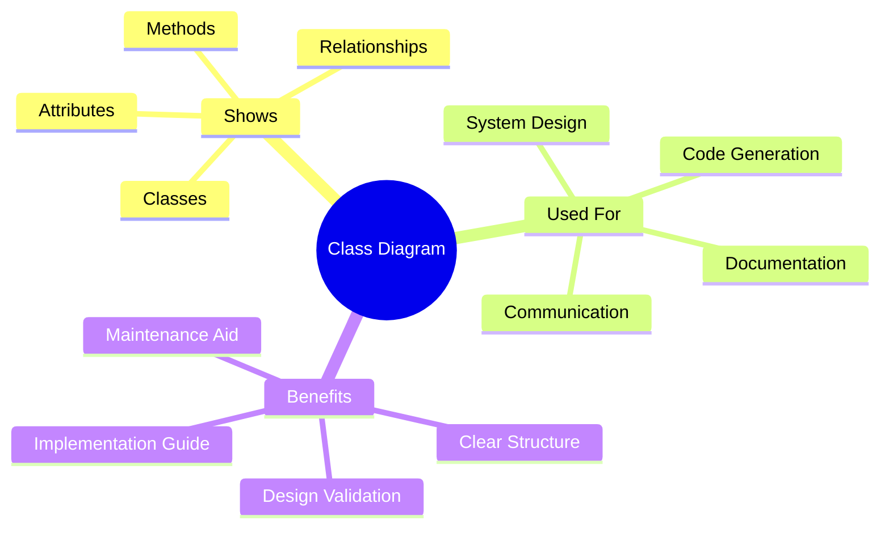

### When to Use

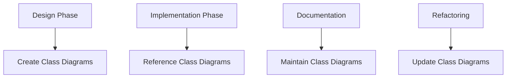

---

## Class Notation

### Basic Class Structure

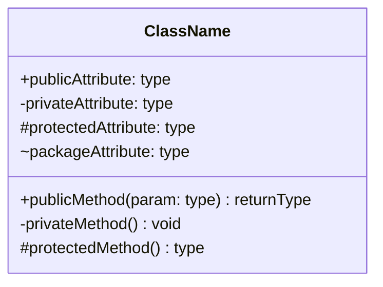

### Three Compartments

```text
┌─────────────────────┐
│    ClassName        │ ← Class Name (mandatory)
├─────────────────────┤
│ - attribute: type   │ ← Attributes (optional)
│ + attribute: type   │
├─────────────────────┤
│ + method(): type    │ ← Methods (optional)
│ - method(): void    │
└─────────────────────┘
```

### JavaScript Example

```javascript
/**
 * Represents a bank account in the system
 * This class demonstrates standard class notation
 */
class BankAccount {
    // Private attributes (using # for true privacy)
    #accountNumber;
    #balance;
    #accountType;
    
    // Public attributes
    owner;
    
    // Protected attribute (convention with _)
    _createdDate;
    
    /**
     * Constructor - Initialize account
     * @param {string} accountNumber - Unique account identifier
     * @param {string} owner - Account owner name
     * @param {number} initialBalance - Starting balance
     * @param {string} accountType - Type of account (SAVINGS/CHECKING)
     */
    constructor(accountNumber, owner, initialBalance = 0, accountType = 'SAVINGS') {
        this.#accountNumber = accountNumber;
        this.owner = owner;
        this.#balance = initialBalance;
        this.#accountType = accountType;
        this._createdDate = new Date();
    }
    
    // Public methods
    /**
     * Deposit money into account
     * @param {number} amount - Amount to deposit
     * @returns {number} New balance
     */
    deposit(amount) {
        if (amount <= 0) {
            throw new Error("Deposit amount must be positive");
        }
        this.#balance += amount;
        this.#logTransaction('DEPOSIT', amount);
        return this.#balance;
    }
    
    /**
     * Withdraw money from account
     * @param {number} amount - Amount to withdraw
     * @returns {number} New balance
     */
    withdraw(amount) {
        if (amount <= 0) {
            throw new Error("Withdrawal amount must be positive");
        }
        if (amount > this.#balance) {
            throw new Error("Insufficient funds");
        }
        this.#balance -= amount;
        this.#logTransaction('WITHDRAWAL', amount);
        return this.#balance;
    }
    
    /**
     * Get current balance
     * @returns {number} Current balance
     */
    getBalance() {
        return this.#balance;
    }
    
    /**
     * Get account information
     * @returns {object} Account details
     */
    getAccountInfo() {
        return {
            accountNumber: this.#accountNumber,
            owner: this.owner,
            balance: this.#balance,
            type: this.#accountType,
            created: this._createdDate
        };
    }
    
    // Private method
    #logTransaction(type, amount) {
        console.log(`[${new Date().toISOString()}] ${type}: $${amount}`);
    }
    
    // Protected method (convention)
    _validateAmount(amount) {
        return typeof amount === 'number' && amount > 0;
    }
}

// Demo
const account = new BankAccount("ACC001", "John Doe", 1000);
console.log(account.getAccountInfo());
account.deposit(500);
account.withdraw(200);
console.log(`Balance: $${account.getBalance()}`);
```

### Python Example

```python
from datetime import datetime
from typing import Optional

class BankAccount:
    """
    Represents a bank account in the system
    This class demonstrates standard class notation
    
    Attributes:
        __account_number (str): Private - Unique account identifier
        __balance (float): Private - Current balance
        __account_type (str): Private - Type of account
        owner (str): Public - Account owner name
        _created_date (datetime): Protected - Account creation date
    """
    
    def __init__(self, account_number: str, owner: str, 
                 initial_balance: float = 0, account_type: str = 'SAVINGS'):
        """
        Initialize bank account
        
        Args:
            account_number: Unique account identifier
            owner: Account owner name
            initial_balance: Starting balance (default: 0)
            account_type: Type of account (default: 'SAVINGS')
        """
        self.__account_number = account_number  # Private
        self.owner = owner  # Public
        self.__balance = initial_balance  # Private
        self.__account_type = account_type  # Private
        self._created_date = datetime.now()  # Protected
    
    def deposit(self, amount: float) -> float:
        """
        Deposit money into account (Public method)
        
        Args:
            amount: Amount to deposit
            
        Returns:
            New balance
            
        Raises:
            ValueError: If amount is not positive
        """
        if amount <= 0:
            raise ValueError("Deposit amount must be positive")
        
        self.__balance += amount
        self.__log_transaction('DEPOSIT', amount)
        return self.__balance
    
    def withdraw(self, amount: float) -> float:
        """
        Withdraw money from account (Public method)
        
        Args:
            amount: Amount to withdraw
            
        Returns:
            New balance
            
        Raises:
            ValueError: If amount is invalid or insufficient funds
        """
        if amount <= 0:
            raise ValueError("Withdrawal amount must be positive")
        if amount > self.__balance:
            raise ValueError("Insufficient funds")
        
        self.__balance -= amount
        self.__log_transaction('WITHDRAWAL', amount)
        return self.__balance
    
    def get_balance(self) -> float:
        """Get current balance (Public method)"""
        return self.__balance
    
    def get_account_info(self) -> dict:
        """
        Get account information (Public method)
        
        Returns:
            Dictionary with account details
        """
        return {
            'account_number': self.__account_number,
            'owner': self.owner,
            'balance': self.__balance,
            'type': self.__account_type,
            'created': self._created_date
        }
    
    def __log_transaction(self, transaction_type: str, amount: float):
        """Log transaction (Private method)"""
        print(f"[{datetime.now().isoformat()}] {transaction_type}: ${amount}")
    
    def _validate_amount(self, amount: float) -> bool:
        """Validate amount (Protected method)"""
        return isinstance(amount, (int, float)) and amount > 0

# Demo
account = BankAccount("ACC001", "John Doe", 1000)
print(account.get_account_info())
account.deposit(500)
account.withdraw(200)
print(f"Balance: ${account.get_balance()}")
```

---

## Visibility Modifiers

### Standard UML Notation

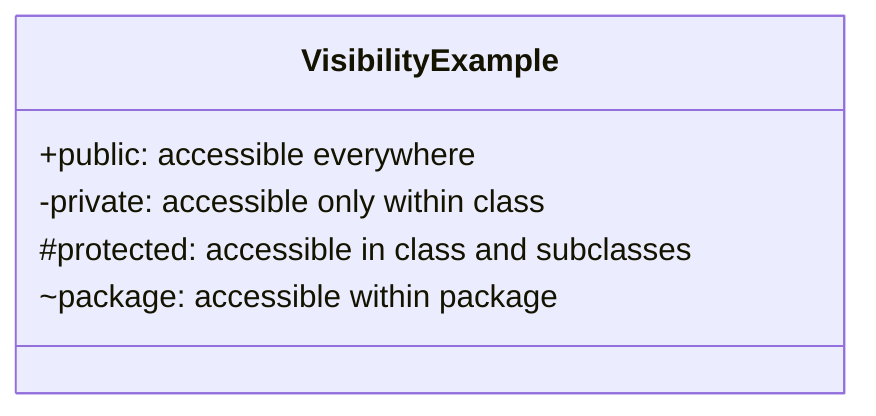

### Comparison Table

| Symbol | Visibility | JavaScript | Python | Access Level |
|--------|-----------|------------|--------|--------------|
| **+** | Public | `property` | `property` | Everywhere |
| **-** | Private | `#property` | `__property` | Class only |
| **#** | Protected | `_property` (convention) | `_property` | Class + subclasses |
| **~** | Package | N/A | N/A | Same package |

### Example: All Visibility Levels

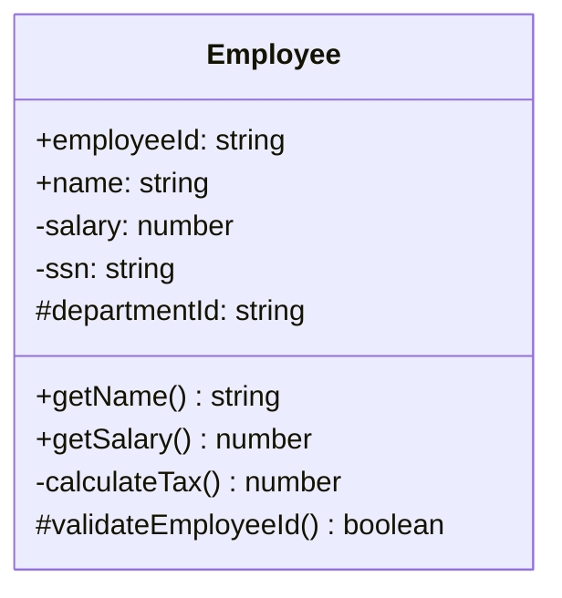

---

## Relationships

### Overview of Relationships

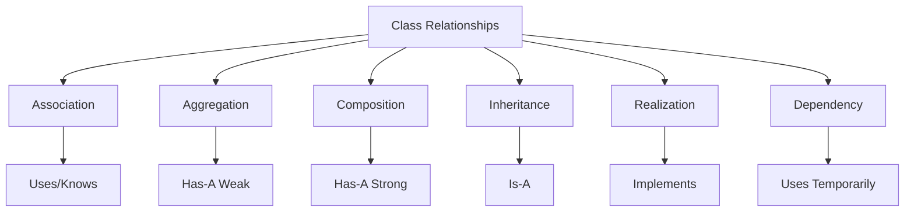

### 1. Association

A relationship where objects are independent but connected.

**Notation**: Solid line

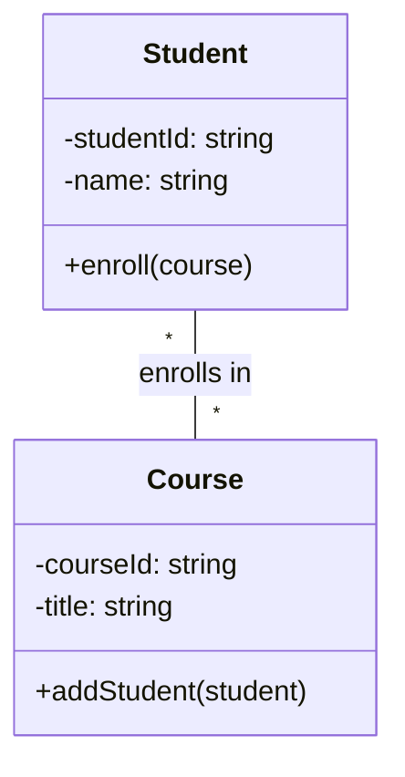

**JavaScript Example:**

```javascript
class Student {
    #studentId;
    #name;
    #courses = [];
    
    constructor(studentId, name) {
        this.#studentId = studentId;
        this.#name = name;
    }
    
    enroll(course) {
        this.#courses.push(course);
        course.addStudent(this);
    }
    
    getCourses() {
        return this.#courses;
    }
    
    getName() {
        return this.#name;
    }
}

class Course {
    #courseId;
    #title;
    #students = [];
    
    constructor(courseId, title) {
        this.#courseId = courseId;
        this.#title = title;
    }
    
    addStudent(student) {
        if (!this.#students.includes(student)) {
            this.#students.push(student);
        }
    }
    
    getStudents() {
        return this.#students;
    }
    
    getTitle() {
        return this.#title;
    }
}

// Demo - Association (both exist independently)
const student1 = new Student("S001", "Alice");
const student2 = new Student("S002", "Bob");
const course1 = new Course("CS101", "Data Structures");
const course2 = new Course("CS102", "Algorithms");

student1.enroll(course1);
student1.enroll(course2);
student2.enroll(course1);

console.log(`${student1.getName()} enrolled in ${student1.getCourses().length} courses`);
console.log(`${course1.getTitle()} has ${course1.getStudents().length} students`);
```

### 2. Aggregation (Has-A Weak)

A "has-a" relationship where parts can exist independently of the whole.

**Notation**: Empty diamond

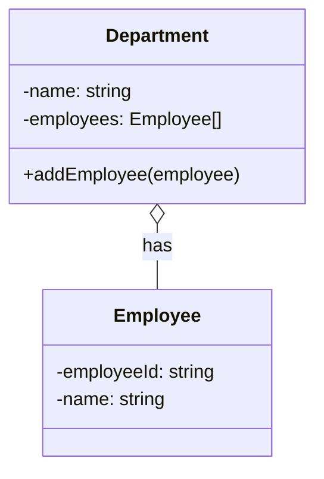

**JavaScript Example:**

```javascript
class Employee {
    #employeeId;
    #name;
    
    constructor(employeeId, name) {
        this.#employeeId = employeeId;
        this.#name = name;
    }
    
    getName() {
        return this.#name;
    }
    
    getId() {
        return this.#employeeId;
    }
}

class Department {
    #name;
    #employees = [];
    
    constructor(name) {
        this.#name = name;
    }
    
    // Aggregation - employees exist independently
    addEmployee(employee) {
        this.#employees.push(employee);
    }
    
    removeEmployee(employee) {
        this.#employees = this.#employees.filter(e => e !== employee);
    }
    
    getEmployees() {
        return this.#employees;
    }
    
    getName() {
        return this.#name;
    }
}

// Demo - Aggregation (employee can exist without department)
const emp1 = new Employee("E001", "John");
const emp2 = new Employee("E002", "Jane");

const itDept = new Department("IT");
itDept.addEmployee(emp1);
itDept.addEmployee(emp2);

console.log(`${itDept.getName()} has ${itDept.getEmployees().length} employees`);

// Remove from department but employee still exists
itDept.removeEmployee(emp1);
console.log(`${emp1.getName()} still exists even after removal from department`);
```

### 3. Composition (Has-A Strong)

A strong "has-a" relationship where parts cannot exist without the whole.

**Notation**: Filled diamond

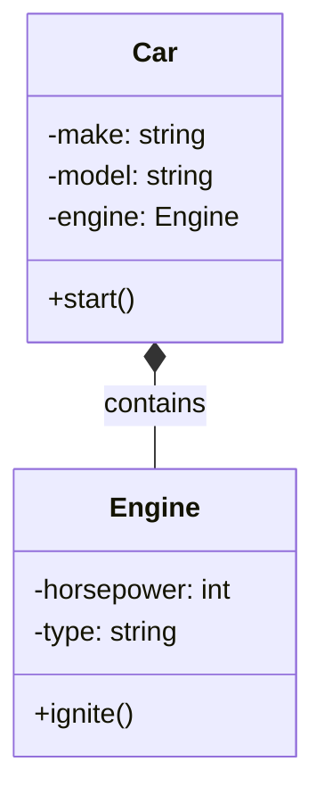

**JavaScript Example:**

```javascript
class Engine {
    #horsepower;
    #type;
    
    constructor(horsepower, type) {
        this.#horsepower = horsepower;
        this.#type = type;
    }
    
    ignite() {
        console.log(`${this.#type} engine with ${this.#horsepower}HP starting...`);
    }
    
    getSpecs() {
        return `${this.#type} - ${this.#horsepower}HP`;
    }
}

class Car {
    #make;
    #model;
    #engine;
    
    constructor(make, model, horsepower, engineType) {
        this.#make = make;
        this.#model = model;
        // Composition - engine is created with car and dies with car
        this.#engine = new Engine(horsepower, engineType);
    }
    
    start() {
        console.log(`Starting ${this.#make} ${this.#model}`);
        this.#engine.ignite();
    }
    
    getInfo() {
        return `${this.#make} ${this.#model} - Engine: ${this.#engine.getSpecs()}`;
    }
}

// Demo - Composition (engine cannot exist without car)
const car = new Car("Toyota", "Camry", 200, "V6");
car.start();
console.log(car.getInfo());

// When car is destroyed, engine is also destroyed
// No way to access engine independently
```

**Python Example:**

```python
class Engine:
    def __init__(self, horsepower: int, engine_type: str):
        self.__horsepower = horsepower
        self.__type = engine_type
    
    def ignite(self):
        print(f"{self.__type} engine with {self.__horsepower}HP starting...")
    
    def get_specs(self) -> str:
        return f"{self.__type} - {self.__horsepower}HP"

class Car:
    def __init__(self, make: str, model: str, horsepower: int, engine_type: str):
        self.__make = make
        self.__model = model
        # Composition - engine is created with car
        self.__engine = Engine(horsepower, engine_type)
    
    def start(self):
        print(f"Starting {self.__make} {self.__model}")
        self.__engine.ignite()
    
    def get_info(self) -> str:
        return f"{self.__make} {self.__model} - Engine: {self.__engine.get_specs()}"

# Demo
car = Car("Toyota", "Camry", 200, "V6")
car.start()
print(car.get_info())
```

### 4. Inheritance (Is-A)

Represents generalization/specialization relationship.

**Notation**: Hollow triangle arrow

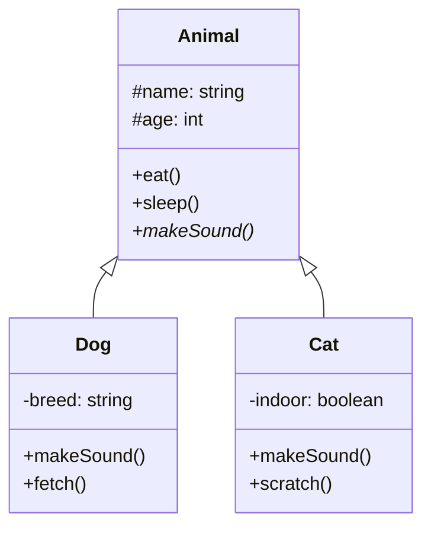

**JavaScript Example:**

```javascript
class Animal {
    #name;
    #age;
    
    constructor(name, age) {
        this.#name = name;
        this.#age = age;
    }
    
    eat() {
        console.log(`${this.#name} is eating`);
    }
    
    sleep() {
        console.log(`${this.#name} is sleeping`);
    }
    
    makeSound() {
        throw new Error("Must be implemented by subclass");
    }
    
    getName() {
        return this.#name;
    }
}

class Dog extends Animal {
    #breed;
    
    constructor(name, age, breed) {
        super(name, age);
        this.#breed = breed;
    }
    
    makeSound() {
        console.log(`${this.getName()} says: Woof! Woof!`);
    }
    
    fetch() {
        console.log(`${this.getName()} is fetching the ball`);
    }
}

class Cat extends Animal {
    #indoor;
    
    constructor(name, age, indoor = true) {
        super(name, age);
        this.#indoor = indoor;
    }
    
    makeSound() {
        console.log(`${this.getName()} says: Meow!`);
    }
    
    scratch() {
        console.log(`${this.getName()} is scratching`);
    }
}

// Demo - Inheritance
const dog = new Dog("Buddy", 3, "Golden Retriever");
const cat = new Cat("Whiskers", 2, true);

dog.eat();
dog.makeSound();
dog.fetch();

cat.eat();
cat.makeSound();
cat.scratch();
```

### 5. Realization/Implementation

A class implements an interface.

**Notation**: Dashed line with hollow triangle

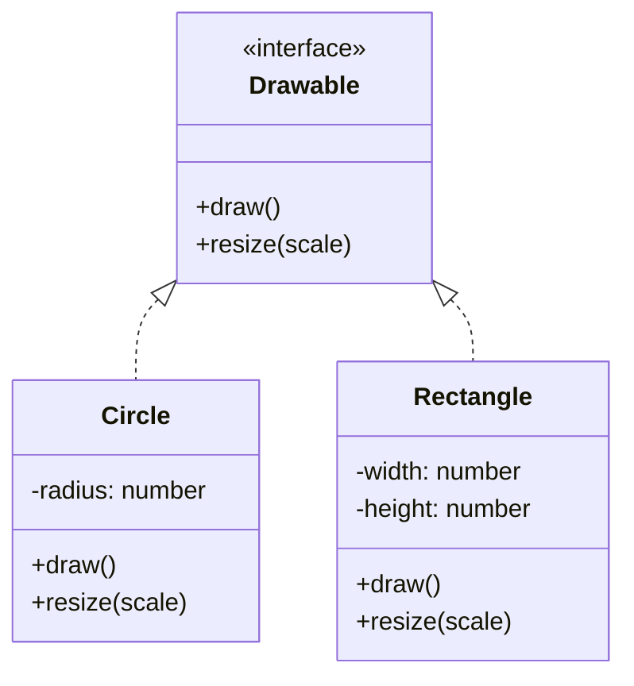

**JavaScript Example:**

```javascript
// Interface (using class as interface pattern)
class Drawable {
    draw() {
        throw new Error("Must implement draw()");
    }
    
    resize(scale) {
        throw new Error("Must implement resize()");
    }
}

class Circle extends Drawable {
    #radius;
    
    constructor(radius) {
        super();
        this.#radius = radius;
    }
    
    draw() {
        console.log(`Drawing circle with radius ${this.#radius}`);
    }
    
    resize(scale) {
        this.#radius *= scale;
        console.log(`Circle resized to radius ${this.#radius}`);
    }
}

class Rectangle extends Drawable {
    #width;
    #height;
    
    constructor(width, height) {
        super();
        this.#width = width;
        this.#height = height;
    }
    
    draw() {
        console.log(`Drawing rectangle ${this.#width}x${this.#height}`);
    }
    
    resize(scale) {
        this.#width *= scale;
        this.#height *= scale;
        console.log(`Rectangle resized to ${this.#width}x${this.#height}`);
    }
}

// Demo
const shapes = [
    new Circle(5),
    new Rectangle(10, 20)
];

shapes.forEach(shape => {
    shape.draw();
    shape.resize(2);
});
```

### 6. Dependency

One class uses another temporarily (parameter, local variable).

**Notation**: Dashed arrow

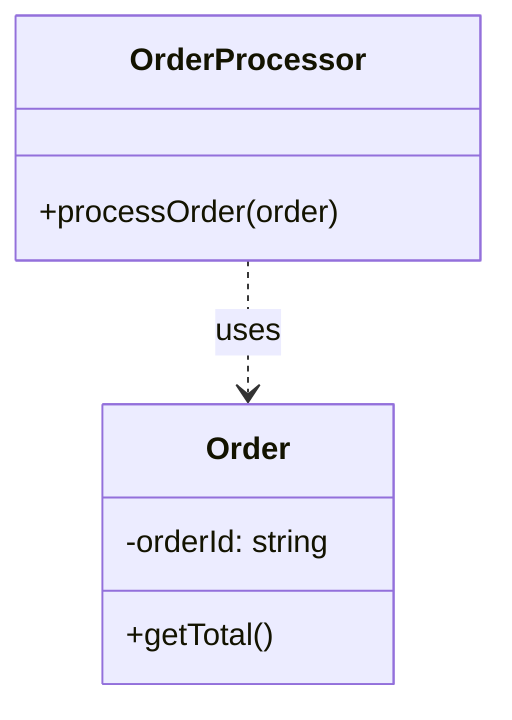

**JavaScript Example:**

```javascript
class Order {
    #orderId;
    #items = [];
    
    constructor(orderId) {
        this.#orderId = orderId;
    }
    
    addItem(item) {
        this.#items.push(item);
    }
    
    getTotal() {
        return this.#items.reduce((sum, item) => sum + item.price, 0);
    }
}

class OrderProcessor {
    // Dependency - uses Order temporarily
    processOrder(order) {
        console.log("Processing order...");
        const total = order.getTotal(); // Uses Order but doesn't store it
        console.log(`Order total: $${total}`);
        return total > 0;
    }
}

// Demo - Dependency (temporary usage)
const order = new Order("ORD001");
order.addItem({ name: "Book", price: 20 });
order.addItem({ name: "Pen", price: 5 });

const processor = new OrderProcessor();
processor.processOrder(order); // Uses order as parameter
```

---

## Multiplicity

### Notation

Multiplicity defines how many instances of one class relate to instances of another class.

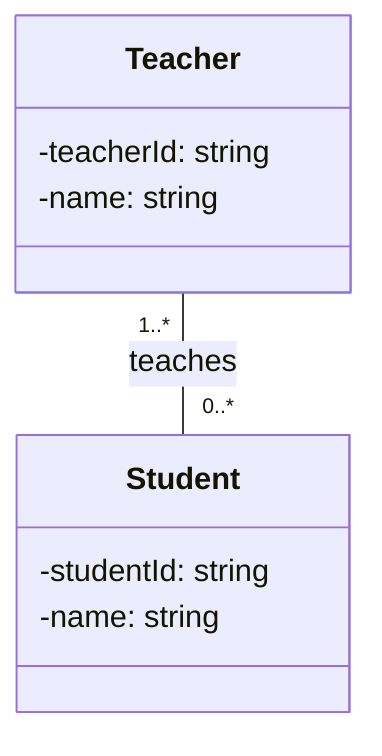

### Common Multiplicity Values

| Notation | Meaning | Example |
|----------|---------|---------|
| `1` | Exactly one | One person has exactly one birth certificate |
| `0..1` | Zero or one | A person may have zero or one spouse |
| `*` or `0..*` | Zero or more | A customer can have zero or more orders |
| `1..*` | One or more | A company must have one or more employees |
| `n` | Exactly n | A triangle has exactly 3 sides |
| `n..m` | Between n and m | A team has 5 to 11 players |

### Complete Example

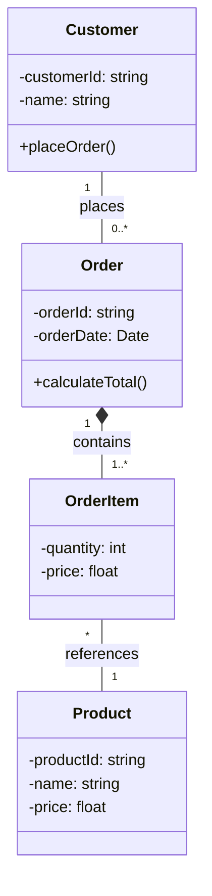

**JavaScript Implementation:**

```javascript
class Customer {
    #customerId;
    #name;
    #orders = [];
    
    constructor(customerId, name) {
        this.#customerId = customerId;
        this.#name = name;
    }
    
    // 1 Customer has 0..* Orders
    placeOrder(order) {
        this.#orders.push(order);
    }
    
    getOrders() {
        return this.#orders;
    }
    
    getName() {
        return this.#name;
    }
}

class Product {
    #productId;
    #name;
    #price;
    
    constructor(productId, name, price) {
        this.#productId = productId;
        this.#name = name;
        this.#price = price;
    }
    
    getPrice() {
        return this.#price;
    }
    
    getName() {
        return this.#name;
    }
}

class OrderItem {
    #product;
    #quantity;
    #price;
    
    // * OrderItems reference 1 Product
    constructor(product, quantity) {
        if (quantity < 1) {
            throw new Error("Quantity must be at least 1");
        }
        this.#product = product;
        this.#quantity = quantity;
        this.#price = product.getPrice();
    }
    
    getSubtotal() {
        return this.#price * this.#quantity;
    }
    
    getProduct() {
        return this.#product;
    }
}

class Order {
    #orderId;
    #orderDate;
    #items = [];
    
    constructor(orderId) {
        this.#orderId = orderId;
        this.#orderDate = new Date();
    }
    
    // 1 Order contains 1..* OrderItems
    addItem(product, quantity) {
        if (this.#items.length === 0 && quantity < 1) {
            throw new Error("Order must have at least one item");
        }
        const item = new OrderItem(product, quantity);
        this.#items.push(item);
    }
    
    calculateTotal() {
        return this.#items.reduce((sum, item) => sum + item.getSubtotal(), 0);
    }
    
    getItemCount() {
        return this.#items.length;
    }
}

// Demo - Multiplicity in action
const customer = new Customer("C001", "Alice");

const product1 = new Product("P001", "Laptop", 999);
const product2 = new Product("P002", "Mouse", 29);

const order1 = new Order("ORD001");
order1.addItem(product1, 1);  // Must have at least 1 item (1..*)
order1.addItem(product2, 2);

customer.placeOrder(order1);

console.log(`${customer.getName()} placed ${customer.getOrders().length} orders`);
console.log(`Order has ${order1.getItemCount()} items`);
console.log(`Order total: $${order1.calculateTotal()}`);
```

---

## Advanced Concepts

### Abstract Classes

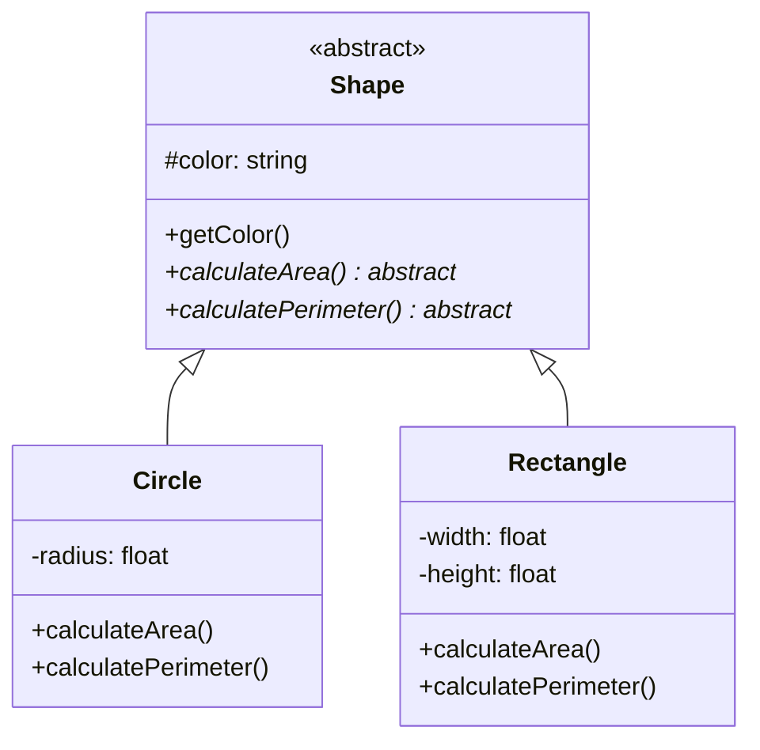

### Interfaces

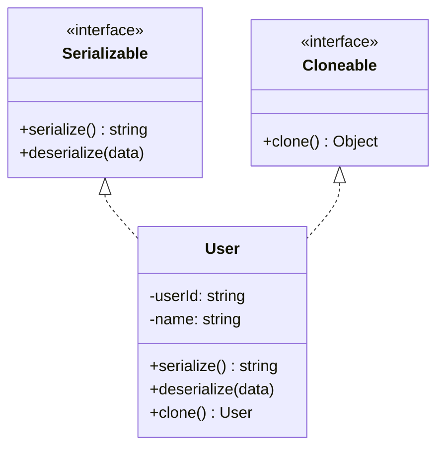

### Enumerations

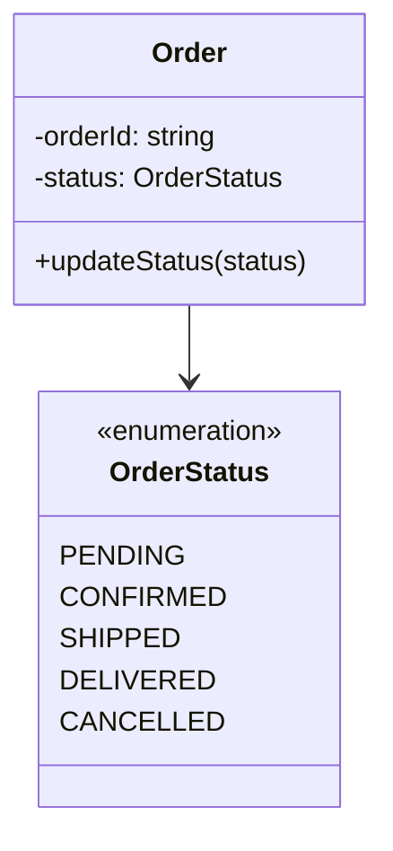

---

## Real-World Examples

### Example 1: E-Commerce System

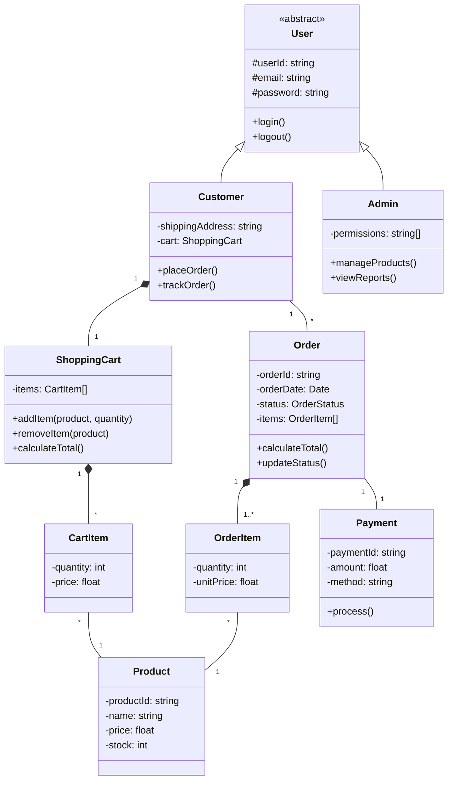

### Example 2: Library Management System

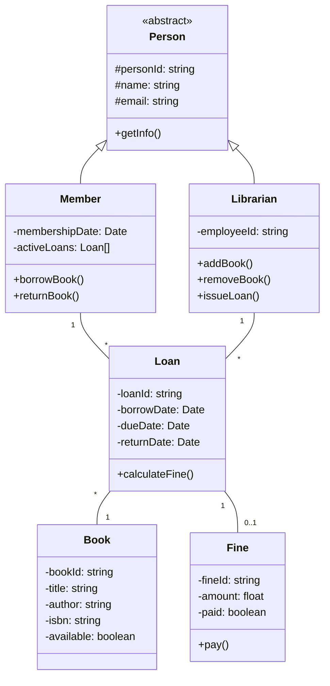

---

## Best Practices

### 1. Show Only Relevant Details

```javascript
// ✅ GOOD: Show essential attributes and methods
class User {
    -userId: string
    -name: string
    -email: string
    +login()
    +updateProfile()
}

// ❌ BAD: Too much detail
class User {
    -userId: string
    -name: string
    -email: string
    -password: string
    -createdDate: Date
    -lastLoginDate: Date
    -loginAttempts: int
    +getUserId()
    +setUserId()
    +getName()
    +setName()
    // ... 20 more methods
}
```

### 2. Use Proper Relationship Types

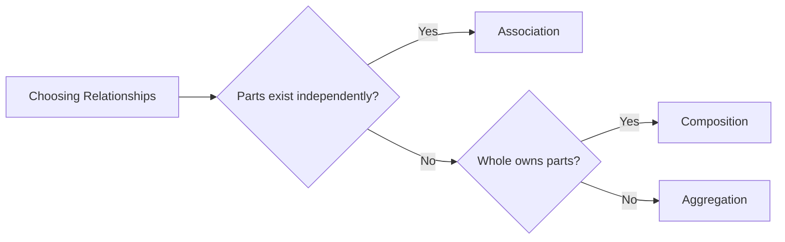

### 3. Clear Multiplicity

```text
✅ GOOD: Specific multiplicity
Customer "1" -- "0..*" Order
Person "1" -- "0..1" Passport

❌ BAD: Unclear multiplicity
Customer -- Order
Person -- Passport
```

### 4. Consistent Abstraction Level

```text
✅ GOOD: Consistent level
- Customer
- Product
- Order

❌ BAD: Mixed levels
- Customer (business entity)
- DatabaseConnection (technical detail)
- Order (business entity)
```

---

## Common Mistakes

### Mistake 1: Bi-directional Association Everywhere

```javascript
// ❌ BAD: Unnecessary bi-directional
class Customer {
    orders = [];
}

class Order {
    customer; // Do we really need back reference?
}

// ✅ GOOD: One direction when sufficient
class Customer {
    orders = [];
}

class Order {
    // No customer reference if not needed
}
```

### Mistake 2: Wrong Relationship Type

```text
❌ BAD: Car aggregates Engine
Car o-- Engine

✅ GOOD: Car composes Engine
Car *-- Engine
(Engine cannot exist without Car)
```

### Mistake 3: Too Many Classes in One Diagram

```text
❌ BAD: 50 classes in one diagram
- Unreadable
- Overwhelming
- Hard to maintain

✅ GOOD: Multiple focused diagrams
- User Management (5-10 classes)
- Order Processing (5-10 classes)
- Payment System (5-10 classes)
```

---

## Interview Questions

### Q1: What is a class diagram?

**Answer**: A class diagram is a UML structural diagram that shows the static structure of a system, including classes, their attributes, methods, and relationships between classes.

### Q2: What's the difference between association and dependency?

**Answer**:

- **Association**: Structural relationship, object holds reference (e.g., Customer has Orders)
- **Dependency**: Usage relationship, temporary (e.g., method parameter, local variable)

### Q3: What's the difference between aggregation and composition?

**Answer**:

- **Aggregation**: Weak "has-a", parts can exist independently (e.g., Department has Employees)
- **Composition**: Strong "has-a", parts die with whole (e.g., Car has Engine)

### Q4: What does multiplicity mean?

**Answer**: Multiplicity specifies how many instances of one class can relate to instances of another class. Examples:

- `1`: Exactly one
- `0..1`: Zero or one
- `*` or `0..*`: Zero or more
- `1..*`: One or more

### Q5: What are the visibility modifiers in UML?

**Answer**:

- `+` Public: Accessible everywhere
- `-` Private: Accessible only within class
- `#` Protected: Accessible in class and subclasses
- `~` Package: Accessible within package

### Q6: When should you use an abstract class?

**Answer**: Use abstract classes when:

- You want to define common behavior for subclasses
- Some methods should be implemented by subclasses
- You want to prevent instantiation of the base class
- Example: Shape with abstract calculateArea()

### Q7: How do you represent an interface in a class diagram?

**Answer**: Use `<<interface>>` stereotype above the class name, and show realization with dashed line and hollow triangle arrow from implementing class to interface.

---

## Summary

```mermaid
mindmap
  root((Class Diagram))
    Components
      Classes
        Attributes
        Methods
        Visibility
      Relationships
        Association
        Aggregation
        Composition
        Inheritance
        Realization
        Dependency
      Multiplicity
        1, 0..1, *, 1..*
    Usage
      Design Phase
      Documentation
      Code Generation
    Best Practices
      Relevant Details
      Proper Relationships
      Clear Multiplicity
      Consistent Level
```

---

## Next Steps

1. **Study**: [Sequence Diagrams](./sequence-diagram.md)
2. **Study**: [Design Patterns](./design-patterns-introduction.md)
3. **Practice**: Create class diagrams for existing systems
4. **Exercise**: Design a class diagram for a system you're building
5. **Review**: Compare your diagrams with actual code implementations

---

**Key Takeaway**: Class diagrams are the blueprint of your system. They show the static structure clearly, making it easy to understand, communicate, and implement object-oriented designs. Master relationships and multiplicity to create accurate, professional class diagrams!

