# Creational Design Patterns

**Purpose**: Master the 5 creational design patterns that provide flexible and reusable solutions for object creation, making systems independent of how objects are created, composed, and represented.

---

## Table of Contents

1. [Overview](#overview)
2. [Singleton Pattern](#singleton-pattern)
3. [Factory Method Pattern](#factory-method-pattern)
4. [Abstract Factory Pattern](#abstract-factory-pattern)
5. [Builder Pattern](#builder-pattern)
6. [Prototype Pattern](#prototype-pattern)
7. [Pattern Comparison](#pattern-comparison)
8. [Interview Questions](#interview-questions)

---

## Overview

**Creational patterns** abstract the instantiation process, making a system independent of how its objects are created, composed, and represented.

### Why Creational Patterns?

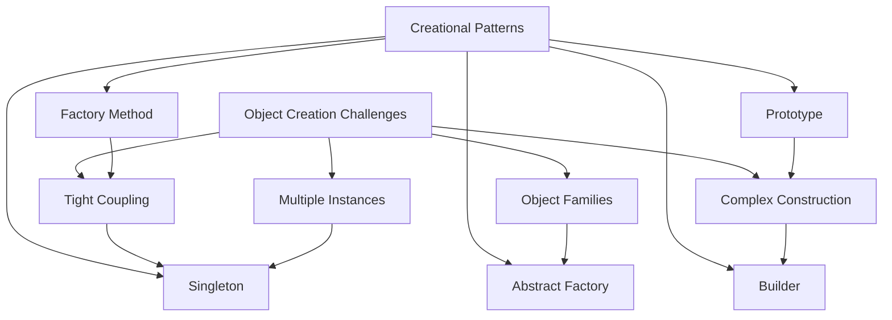

### The 5 Patterns at a Glance

| Pattern | Purpose | Complexity | Use When |
|---------|---------|------------|----------|
| Singleton | One instance only | Low | Need single instance globally |
| Factory Method | Create via inheritance | Medium | Defer creation to subclasses |
| Abstract Factory | Create families | High | Need related object families |
| Builder | Step-by-step construction | Medium | Complex objects with options |
| Prototype | Clone existing objects | Low | Creation is expensive |

---

## Singleton Pattern

**Intent**: Ensure a class has only **one instance** and provide a **global point of access** to it.

### Singleton: Problem & Solution

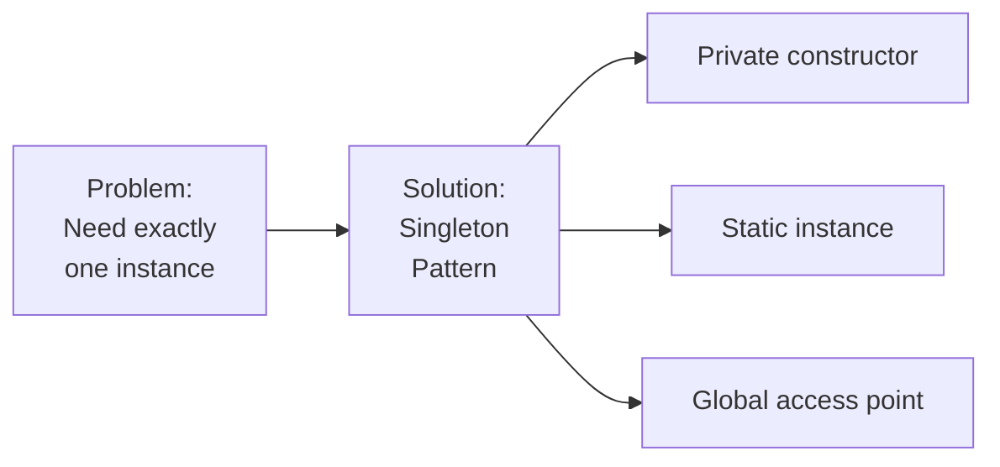

### Singleton: Structure

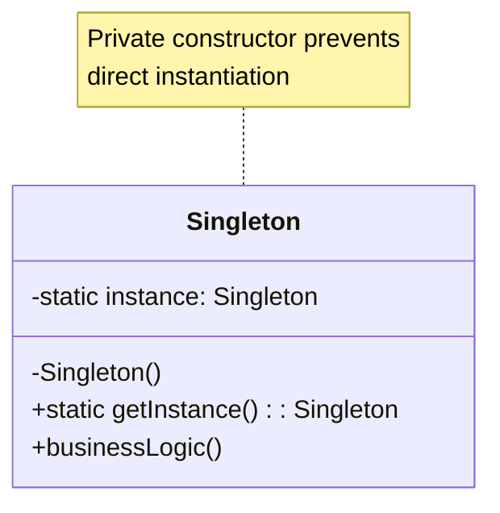

### Singleton: JavaScript Implementation

```javascript
/**
 * Singleton Pattern - Modern JavaScript Implementation
 * Ensures only one instance exists globally
 * 
 * Use Cases:
 * - Database connections
 * - Configuration settings
 * - Logging systems
 * - Cache managers
 */

class DatabaseConnection {
    // Private static instance
    static #instance = null;
    
    // Private constructor
    constructor() {
        if (DatabaseConnection.#instance) {
            throw new Error('Use DatabaseConnection.getInstance()');
        }
        
        this.connection = null;
        this.isConnected = false;
        console.log('DatabaseConnection created');
    }
    
    /**
     * Get singleton instance
     * @returns {DatabaseConnection} The singleton instance
     */
    static getInstance() {
        if (!DatabaseConnection.#instance) {
            DatabaseConnection.#instance = new DatabaseConnection();
        }
        return DatabaseConnection.#instance;
    }
    
    /**
     * Connect to database
     */
    connect() {
        if (!this.isConnected) {
            this.connection = 'Connected to DB';
            this.isConnected = true;
            console.log('Database connected');
        }
    }
    
    /**
     * Execute query
     */
    query(sql) {
        if (!this.isConnected) {
            throw new Error('Not connected to database');
        }
        console.log(`Executing: ${sql}`);
        return { results: [] };
    }
}

// Usage
const db1 = DatabaseConnection.getInstance();
const db2 = DatabaseConnection.getInstance();

console.log(db1 === db2); // true - same instance

db1.connect();
db1.query('SELECT * FROM users');
```

### Singleton: Python Implementation

```python
"""
Singleton Pattern - Python Implementation
Thread-safe singleton using metaclass

Use Cases:
- Application configuration
- Logging service
- Database pool manager
- Cache system
"""

from threading import Lock
from typing import Optional

class SingletonMeta(type):
    """
    Thread-safe Singleton metaclass.
    """
    _instances = {}
    _lock: Lock = Lock()
    
    def __call__(cls, *args, **kwargs):
        """
        Control instance creation.
        """
        with cls._lock:
            if cls not in cls._instances:
                instance = super().__call__(*args, **kwargs)
                cls._instances[cls] = instance
        return cls._instances[cls]


class Configuration(metaclass=SingletonMeta):
    """
    Application configuration singleton.
    """
    
    def __init__(self):
        """Initialize configuration (called only once)."""
        self.settings = {}
        print("Configuration initialized")
    
    def set(self, key: str, value: any) -> None:
        """Set configuration value."""
        self.settings[key] = value
    
    def get(self, key: str, default=None) -> any:
        """Get configuration value."""
        return self.settings.get(key, default)
    
    def load_from_file(self, filepath: str) -> None:
        """Load configuration from file."""
        print(f"Loading config from {filepath}")
        # Simulate loading
        self.settings = {
            'database_url': 'postgresql://localhost/mydb',
            'debug': True,
            'max_connections': 10
        }


# Usage
config1 = Configuration()
config2 = Configuration()

print(config1 is config2)  # True - same instance

config1.set('api_key', 'secret123')
print(config2.get('api_key'))  # 'secret123' - shared state
```

### Singleton: Best Practices

**✅ DO:**

- Use for truly global, single-instance resources
- Ensure thread-safety in multi-threaded environments
- Document why singleton is necessary
- Consider lazy initialization

**❌ DON'T:**

- Overuse - creates global state (hard to test)
- Use for objects that should have multiple instances
- Hide dependencies (makes testing difficult)
- Ignore thread-safety concerns

### Alternatives to Singleton

```javascript
// Alternative 1: Dependency Injection
class Application {
    constructor(config, logger) {
        this.config = config;  // Inject dependencies
        this.logger = logger;
    }
}

// Alternative 2: Module Pattern (JavaScript)
const configModule = {
    settings: {},
    get(key) { return this.settings[key]; },
    set(key, value) { this.settings[key] = value; }
};

export default configModule;
```

---

## Factory Method Pattern

**Intent**: Define an interface for creating objects, but let **subclasses decide** which class to instantiate.

### Factory Method: Problem & Solution

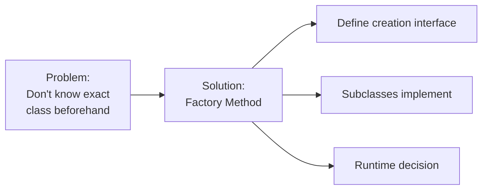

### Factory Method: Structure

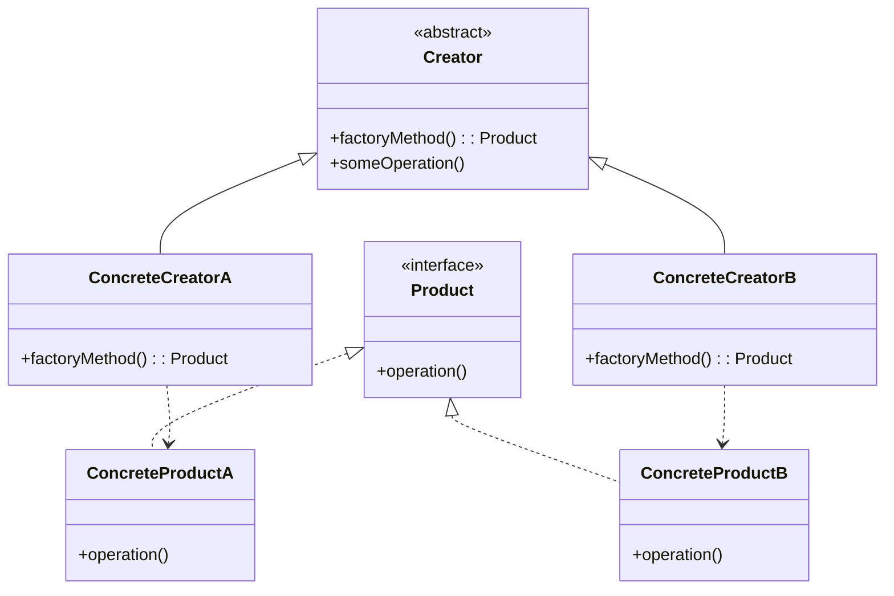

### Factory Method: JavaScript Implementation

```javascript
/**
 * Factory Method Pattern - JavaScript Implementation
 * Payment processing system with different payment methods
 */

// Product interface
class Payment {
    processPayment(amount) {
        throw new Error('Must implement processPayment()');
    }
}

// Concrete Products
class CreditCardPayment extends Payment {
    constructor(cardNumber, cvv) {
        super();
        this.cardNumber = cardNumber;
        this.cvv = cvv;
    }
    
    processPayment(amount) {
        console.log(`Processing credit card payment: $${amount}`);
        console.log(`Card: **** **** **** ${this.cardNumber.slice(-4)}`);
        return {
            success: true,
            transactionId: `CC-${Date.now()}`,
            amount
        };
    }
}

class PayPalPayment extends Payment {
    constructor(email) {
        super();
        this.email = email;
    }
    
    processPayment(amount) {
        console.log(`Processing PayPal payment: $${amount}`);
        console.log(`Account: ${this.email}`);
        return {
            success: true,
            transactionId: `PP-${Date.now()}`,
            amount
        };
    }
}

class CryptoPayment extends Payment {
    constructor(walletAddress) {
        super();
        this.walletAddress = walletAddress;
    }
    
    processPayment(amount) {
        console.log(`Processing crypto payment: $${amount}`);
        console.log(`Wallet: ${this.walletAddress}`);
        return {
            success: true,
            transactionId: `BTC-${Date.now()}`,
            amount
        };
    }
}

// Creator (abstract)
class PaymentProcessor {
    /**
     * Factory method to be implemented by subclasses
     */
    createPayment() {
        throw new Error('Must implement createPayment()');
    }
    
    /**
     * Business logic that uses factory method
     */
    processOrder(order) {
        const payment = this.createPayment();
        const result = payment.processPayment(order.total);
        
        if (result.success) {
            console.log(`Order ${order.id} paid successfully`);
            order.status = 'paid';
            order.transactionId = result.transactionId;
        }
        
        return result;
    }
}

// Concrete Creators
class CreditCardProcessor extends PaymentProcessor {
    constructor(cardNumber, cvv) {
        super();
        this.cardNumber = cardNumber;
        this.cvv = cvv;
    }
    
    createPayment() {
        return new CreditCardPayment(this.cardNumber, this.cvv);
    }
}

class PayPalProcessor extends PaymentProcessor {
    constructor(email) {
        super();
        this.email = email;
    }
    
    createPayment() {
        return new PayPalPayment(this.email);
    }
}

class CryptoProcessor extends PaymentProcessor {
    constructor(walletAddress) {
        super();
        this.walletAddress = walletAddress;
    }
    
    createPayment() {
        return new CryptoPayment(this.walletAddress);
    }
}

// Usage
const order = { id: 'ORD-001', total: 99.99, status: 'pending' };

// Use credit card
const ccProcessor = new CreditCardProcessor('1234567890123456', '123');
ccProcessor.processOrder(order);

// Switch to PayPal
const ppProcessor = new PayPalProcessor('user@example.com');
ppProcessor.processOrder(order);
```

### Factory Method: Python Implementation

```python
"""
Factory Method Pattern - Python Implementation
Document processing system with different formats
"""

from abc import ABC, abstractmethod
from typing import Dict, Any

# Product interface
class Document(ABC):
    """Abstract document class."""
    
    @abstractmethod
    def open(self) -> None:
        """Open document."""
        pass
    
    @abstractmethod
    def save(self, content: str) -> None:
        """Save document."""
        pass
    
    @abstractmethod
    def close(self) -> None:
        """Close document."""
        pass


# Concrete Products
class PDFDocument(Document):
    """PDF document implementation."""
    
    def __init__(self, filename: str):
        self.filename = filename
        self.content = ""
    
    def open(self) -> None:
        print(f"Opening PDF: {self.filename}")
    
    def save(self, content: str) -> None:
        self.content = content
        print(f"Saving PDF: {self.filename}")
        print(f"Content: {content[:50]}...")
    
    def close(self) -> None:
        print(f"Closing PDF: {self.filename}")


class WordDocument(Document):
    """Word document implementation."""
    
    def __init__(self, filename: str):
        self.filename = filename
        self.content = ""
    
    def open(self) -> None:
        print(f"Opening Word doc: {self.filename}")
    
    def save(self, content: str) -> None:
        self.content = content
        print(f"Saving Word doc: {self.filename}")
        print(f"Content: {content[:50]}...")
    
    def close(self) -> None:
        print(f"Closing Word doc: {self.filename}")


class TextDocument(Document):
    """Plain text document implementation."""
    
    def __init__(self, filename: str):
        self.filename = filename
        self.content = ""
    
    def open(self) -> None:
        print(f"Opening text file: {self.filename}")
    
    def save(self, content: str) -> None:
        self.content = content
        print(f"Saving text file: {self.filename}")
        print(f"Content: {content[:50]}...")
    
    def close(self) -> None:
        print(f"Closing text file: {self.filename}")


# Creator (abstract)
class DocumentProcessor(ABC):
    """Abstract document processor."""
    
    @abstractmethod
    def create_document(self, filename: str) -> Document:
        """Factory method to create document."""
        pass
    
    def process_document(self, filename: str, content: str) -> None:
        """Process document using factory method."""
        doc = self.create_document(filename)
        doc.open()
        doc.save(content)
        doc.close()


# Concrete Creators
class PDFProcessor(DocumentProcessor):
    """PDF document processor."""
    
    def create_document(self, filename: str) -> Document:
        return PDFDocument(filename)


class WordProcessor(DocumentProcessor):
    """Word document processor."""
    
    def create_document(self, filename: str) -> Document:
        return WordDocument(filename)


class TextProcessor(DocumentProcessor):
    """Text document processor."""
    
    def create_document(self, filename: str) -> Document:
        return TextDocument(filename)


# Usage
def main():
    content = "This is a sample document with some content."
    
    # Process PDF
    pdf_processor = PDFProcessor()
    pdf_processor.process_document("report.pdf", content)
    
    print("\n")
    
    # Process Word
    word_processor = WordProcessor()
    word_processor.process_document("report.docx", content)
    
    print("\n")
    
    # Process Text
    text_processor = TextProcessor()
    text_processor.process_document("report.txt", content)


if __name__ == "__main__":
    main()
```

### Factory Method: Best Practices

**✅ DO:**

- Use when exact type is unknown until runtime
- Encapsulate object creation logic
- Follow Open/Closed Principle
- Keep factory methods simple

**❌ DON'T:**

- Use for simple object creation
- Create unnecessary subclasses
- Mix business logic with creation logic
- Make factory methods too complex

---

## Abstract Factory Pattern

**Intent**: Provide interface for creating **families of related objects** without specifying concrete classes.

### Abstract Factory: Problem & Solution

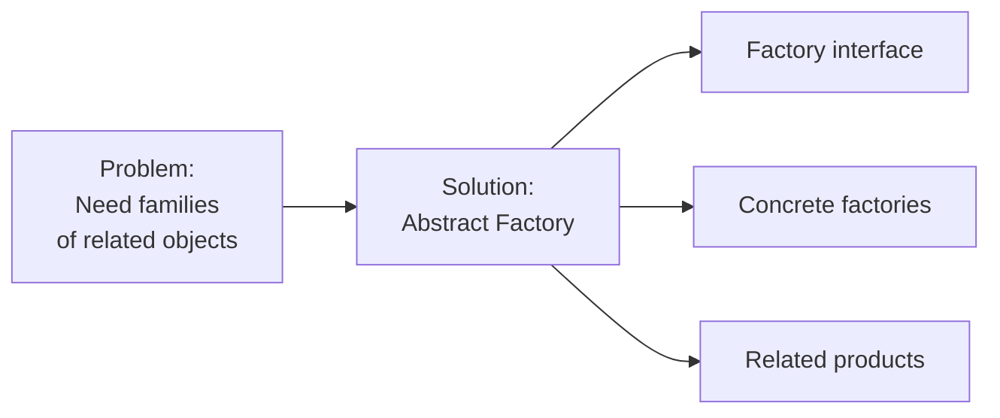

### Abstract Factory: Structure

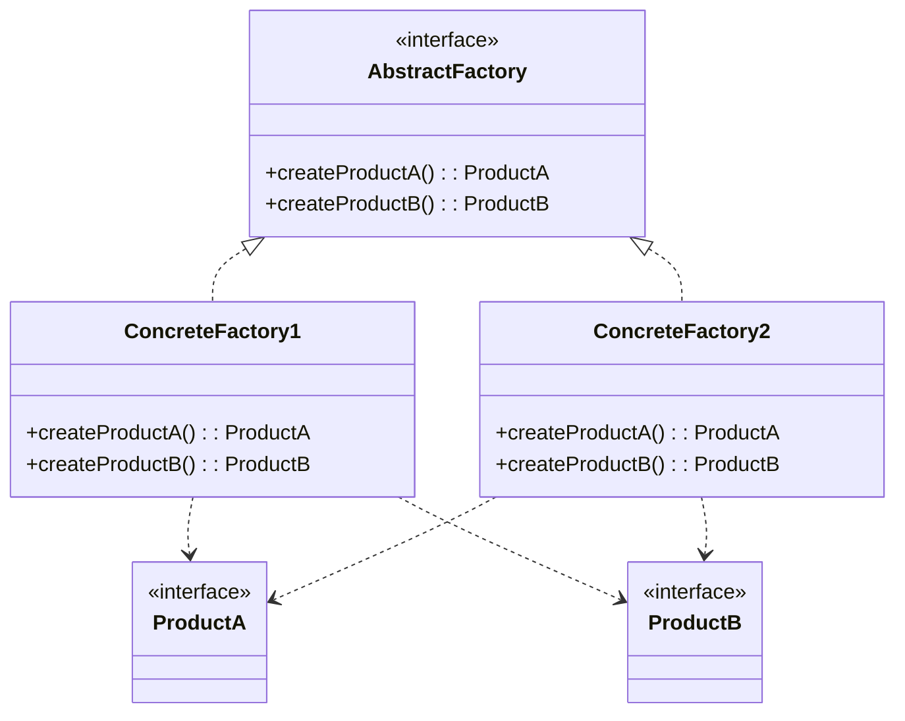

### Abstract Factory: JavaScript Implementation

```javascript
/**
 * Abstract Factory Pattern - JavaScript Implementation
 * UI Component library with different themes
 */

// Abstract Products
class Button {
    render() {
        throw new Error('Must implement render()');
    }
}

class Checkbox {
    render() {
        throw new Error('Must implement render()');
    }
}

// Concrete Products - Light Theme
class LightButton extends Button {
    render() {
        return '<button class="light-button">Light Button</button>';
    }
}

class LightCheckbox extends Checkbox {
    render() {
        return '<input type="checkbox" class="light-checkbox" />';
    }
}

// Concrete Products - Dark Theme
class DarkButton extends Button {
    render() {
        return '<button class="dark-button">Dark Button</button>';
    }
}

class DarkCheckbox extends Checkbox {
    render() {
        return '<input type="checkbox" class="dark-checkbox" />';
    }
}

// Concrete Products - High Contrast Theme
class HighContrastButton extends Button {
    render() {
        return '<button class="hc-button">HC Button</button>';
    }
}

class HighContrastCheckbox extends Checkbox {
    render() {
        return '<input type="checkbox" class="hc-checkbox" />';
    }
}

// Abstract Factory
class UIFactory {
    createButton() {
        throw new Error('Must implement createButton()');
    }
    
    createCheckbox() {
        throw new Error('Must implement createCheckbox()');
    }
}

// Concrete Factories
class LightThemeFactory extends UIFactory {
    createButton() {
        return new LightButton();
    }
    
    createCheckbox() {
        return new LightCheckbox();
    }
}

class DarkThemeFactory extends UIFactory {
    createButton() {
        return new DarkButton();
    }
    
    createCheckbox() {
        return new DarkCheckbox();
    }
}

class HighContrastFactory extends UIFactory {
    createButton() {
        return new HighContrastButton();
    }
    
    createCheckbox() {
        return new HighContrastCheckbox();
    }
}

// Client code
class Application {
    constructor(factory) {
        this.factory = factory;
    }
    
    createUI() {
        const button = this.factory.createButton();
        const checkbox = this.factory.createCheckbox();
        
        console.log('UI Components:');
        console.log(button.render());
        console.log(checkbox.render());
    }
}

// Usage
console.log('=== Light Theme ===');
const lightApp = new Application(new LightThemeFactory());
lightApp.createUI();

console.log('\n=== Dark Theme ===');
const darkApp = new Application(new DarkThemeFactory());
darkApp.createUI();

console.log('\n=== High Contrast Theme ===');
const hcApp = new Application(new HighContrastFactory());
hcApp.createUI();
```

### Abstract Factory: Python Implementation

```python
"""
Abstract Factory Pattern - Python Implementation
Cross-platform GUI toolkit
"""

from abc import ABC, abstractmethod

# Abstract Products
class Window(ABC):
    """Abstract window."""
    
    @abstractmethod
    def render(self) -> str:
        pass


class Dialog(ABC):
    """Abstract dialog."""
    
    @abstractmethod
    def render(self) -> str:
        pass


# Concrete Products - Windows
class WindowsWindow(Window):
    """Windows-style window."""
    
    def render(self) -> str:
        return "[Windows Window] Title Bar | Minimize | Maximize | Close"


class WindowsDialog(Dialog):
    """Windows-style dialog."""
    
    def render(self) -> str:
        return "[Windows Dialog] OK | Cancel"


# Concrete Products - MacOS
class MacOSWindow(Window):
    """MacOS-style window."""
    
    def render(self) -> str:
        return "[MacOS Window] 🔴 🟡 🟢 | Title"


class MacOSDialog(Dialog):
    """MacOS-style dialog."""
    
    def render(self) -> str:
        return "[MacOS Dialog] Cancel | OK"


# Concrete Products - Linux
class LinuxWindow(Window):
    """Linux-style window."""
    
    def render(self) -> str:
        return "[Linux Window] [-] [□] [×] | Title"


class LinuxDialog(Dialog):
    """Linux-style dialog."""
    
    def render(self) -> str:
        return "[Linux Dialog] <Cancel> <OK>"


# Abstract Factory
class GUIFactory(ABC):
    """Abstract GUI factory."""
    
    @abstractmethod
    def create_window(self) -> Window:
        pass
    
    @abstractmethod
    def create_dialog(self) -> Dialog:
        pass


# Concrete Factories
class WindowsFactory(GUIFactory):
    """Windows GUI factory."""
    
    def create_window(self) -> Window:
        return WindowsWindow()
    
    def create_dialog(self) -> Dialog:
        return WindowsDialog()


class MacOSFactory(GUIFactory):
    """MacOS GUI factory."""
    
    def create_window(self) -> Window:
        return MacOSWindow()
    
    def create_dialog(self) -> Dialog:
        return MacOSDialog()


class LinuxFactory(GUIFactory):
    """Linux GUI factory."""
    
    def create_window(self) -> Window:
        return LinuxWindow()
    
    def create_dialog(self) -> Dialog:
        return LinuxDialog()


# Client
class Application:
    """Cross-platform application."""
    
    def __init__(self, factory: GUIFactory):
        self.factory = factory
        self.window = None
        self.dialog = None
    
    def create_ui(self) -> None:
        """Create UI using factory."""
        self.window = self.factory.create_window()
        self.dialog = self.factory.create_dialog()
    
    def render(self) -> None:
        """Render UI."""
        print(self.window.render())
        print(self.dialog.render())


# Usage
def main():
    import platform
    
    # Detect platform
    system = platform.system()
    
    if system == "Windows":
        factory = WindowsFactory()
    elif system == "Darwin":  # MacOS
        factory = MacOSFactory()
    else:  # Linux
        factory = LinuxFactory()
    
    app = Application(factory)
    app.create_ui()
    app.render()


if __name__ == "__main__":
    main()
```

### Abstract Factory: Best Practices

**✅ DO:**

- Use for families of related products
- Ensure products from same family work together
- Keep factory interface stable
- Use when platform independence is needed

**❌ DON'T:**

- Use for single product creation
- Add too many product types
- Make factories too complex
- Mix products from different families

---

## Builder Pattern

**Intent**: Separate construction of complex object from its representation, allowing same construction process to create different representations.

### Builder: Problem & Solution

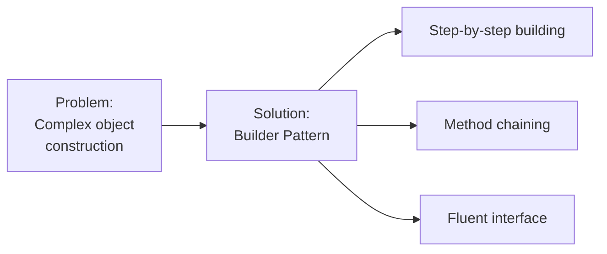

### Builder: Structure

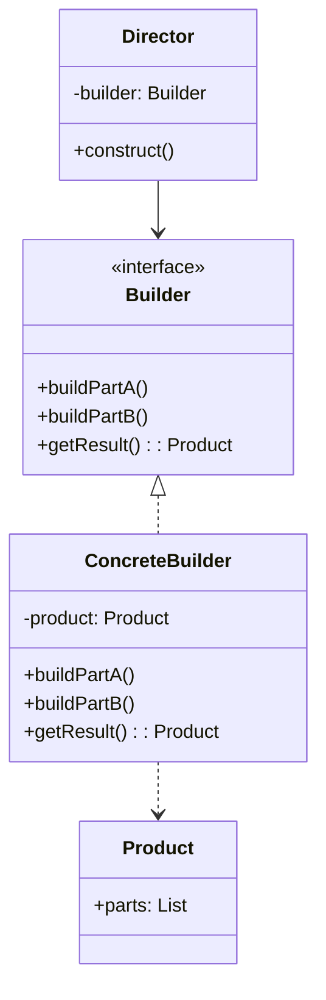

### Builder: JavaScript Implementation

```javascript
/**
 * Builder Pattern - JavaScript Implementation
 * HTTP Request builder with fluent interface
 */

class HttpRequest {
    constructor() {
        this.method = 'GET';
        this.url = '';
        this.headers = {};
        this.body = null;
        this.timeout = 30000;
        this.retries = 0;
    }
    
    execute() {
        console.log('Executing HTTP Request:');
        console.log(`${this.method} ${this.url}`);
        console.log('Headers:', this.headers);
        if (this.body) console.log('Body:', this.body);
        console.log(`Timeout: ${this.timeout}ms, Retries: ${this.retries}`);
    }
}

class HttpRequestBuilder {
    constructor() {
        this.request = new HttpRequest();
    }
    
    /**
     * Set HTTP method
     */
    setMethod(method) {
        this.request.method = method.toUpperCase();
        return this; // Enable chaining
    }
    
    /**
     * Set URL
     */
    setUrl(url) {
        this.request.url = url;
        return this;
    }
    
    /**
     * Add header
     */
    addHeader(key, value) {
        this.request.headers[key] = value;
        return this;
    }
    
    /**
     * Set request body
     */
    setBody(body) {
        this.request.body = body;
        return this;
    }
    
    /**
     * Set timeout
     */
    setTimeout(milliseconds) {
        this.request.timeout = milliseconds;
        return this;
    }
    
    /**
     * Set retry count
     */
    setRetries(count) {
        this.request.retries = count;
        return this;
    }
    
    /**
     * Build and return request
     */
    build() {
        if (!this.request.url) {
            throw new Error('URL is required');
        }
        return this.request;
    }
}

// Specialized builders
class JsonRequestBuilder extends HttpRequestBuilder {
    constructor() {
        super();
        this.addHeader('Content-Type', 'application/json');
        this.addHeader('Accept', 'application/json');
    }
    
    setJsonBody(obj) {
        this.setBody(JSON.stringify(obj));
        return this;
    }
}

// Usage
const getRequest = new HttpRequestBuilder()
    .setMethod('GET')
    .setUrl('https://api.example.com/users')
    .addHeader('Authorization', 'Bearer token123')
    .setTimeout(5000)
    .build();

getRequest.execute();

console.log('\n');

const postRequest = new JsonRequestBuilder()
    .setMethod('POST')
    .setUrl('https://api.example.com/users')
    .addHeader('Authorization', 'Bearer token123')
    .setJsonBody({ name: 'John Doe', email: 'john@example.com' })
    .setRetries(3)
    .build();

postRequest.execute();
```

### Builder: Python Implementation

```python
"""
Builder Pattern - Python Implementation
SQL Query builder with fluent interface
"""

from typing import List, Dict, Any, Optional

class SQLQuery:
    """SQL Query representation."""
    
    def __init__(self):
        self.select_columns: List[str] = []
        self.from_table: Optional[str] = None
        self.where_conditions: List[str] = []
        self.join_clauses: List[str] = []
        self.order_by: List[str] = []
        self.limit_value: Optional[int] = None
        self.offset_value: Optional[int] = None
    
    def to_sql(self) -> str:
        """Convert to SQL string."""
        if not self.from_table:
            raise ValueError("Table name is required")
        
        # SELECT
        columns = ', '.join(self.select_columns) if self.select_columns else '*'
        sql = f"SELECT {columns}"
        
        # FROM
        sql += f"\nFROM {self.from_table}"
        
        # JOIN
        if self.join_clauses:
            sql += '\n' + '\n'.join(self.join_clauses)
        
        # WHERE
        if self.where_conditions:
            sql += '\nWHERE ' + ' AND '.join(self.where_conditions)
        
        # ORDER BY
        if self.order_by:
            sql += '\nORDER BY ' + ', '.join(self.order_by)
        
        # LIMIT
        if self.limit_value:
            sql += f'\nLIMIT {self.limit_value}'
        
        # OFFSET
        if self.offset_value:
            sql += f'\nOFFSET {self.offset_value}'
        
        return sql


class SQLQueryBuilder:
    """SQL Query builder with fluent interface."""
    
    def __init__(self):
        self.query = SQLQuery()
    
    def select(self, *columns: str) -> 'SQLQueryBuilder':
        """Add columns to SELECT."""
        self.query.select_columns.extend(columns)
        return self
    
    def from_table(self, table: str) -> 'SQLQueryBuilder':
        """Set table name."""
        self.query.from_table = table
        return self
    
    def where(self, condition: str) -> 'SQLQueryBuilder':
        """Add WHERE condition."""
        self.query.where_conditions.append(condition)
        return self
    
    def join(self, table: str, on: str, join_type: str = 'INNER') -> 'SQLQueryBuilder':
        """Add JOIN clause."""
        self.query.join_clauses.append(f"{join_type} JOIN {table} ON {on}")
        return self
    
    def order_by(self, column: str, direction: str = 'ASC') -> 'SQLQueryBuilder':
        """Add ORDER BY."""
        self.query.order_by.append(f"{column} {direction}")
        return self
    
    def limit(self, count: int) -> 'SQLQueryBuilder':
        """Set LIMIT."""
        self.query.limit_value = count
        return self
    
    def offset(self, count: int) -> 'SQLQueryBuilder':
        """Set OFFSET."""
        self.query.offset_value = count
        return self
    
    def build(self) -> SQLQuery:
        """Build and return query."""
        return self.query


# Usage
def main():
    # Simple query
    query1 = (SQLQueryBuilder()
              .select('id', 'name', 'email')
              .from_table('users')
              .where('active = true')
              .order_by('name', 'ASC')
              .limit(10)
              .build())
    
    print("Query 1:")
    print(query1.to_sql())
    print("\n" + "="*50 + "\n")
    
    # Complex query with joins
    query2 = (SQLQueryBuilder()
              .select('u.id', 'u.name', 'o.order_id', 'o.total')
              .from_table('users u')
              .join('orders o', 'u.id = o.user_id')
              .where('o.total > 100')
              .where('u.country = "USA"')
              .order_by('o.total', 'DESC')
              .limit(20)
              .offset(10)
              .build())
    
    print("Query 2:")
    print(query2.to_sql())


if __name__ == "__main__":
    main()
```

### Builder: Best Practices

**✅ DO:**

- Use for objects with many optional parameters
- Provide fluent interface (method chaining)
- Validate in build() method
- Keep builder immutable if possible

**❌ DON'T:**

- Use for simple objects
- Force all parameters through builder
- Make building process too complex
- Forget to validate required fields

---

## Prototype Pattern

**Intent**: Specify kinds of objects to create using prototypical instance, and create new objects by **copying** this prototype.

### Prototype: Problem & Solution

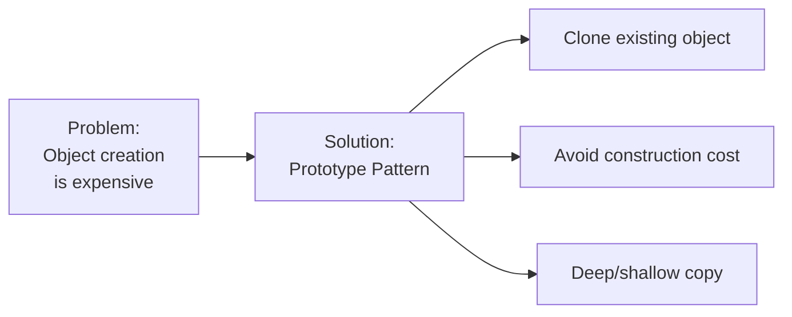

### Prototype: Structure

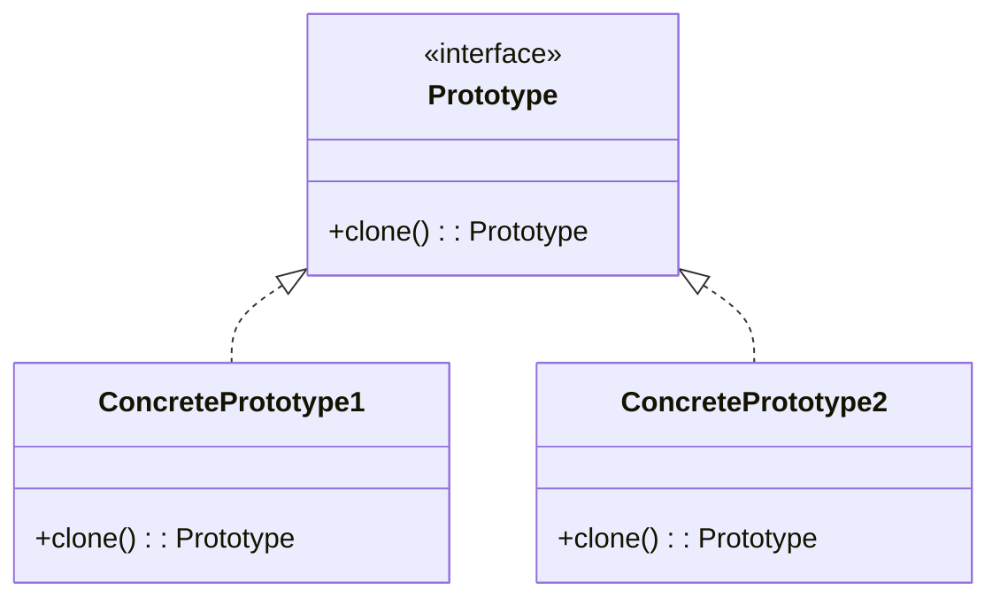

### Prototype: JavaScript Implementation

```javascript
/**
 * Prototype Pattern - JavaScript Implementation
 * Game character cloning system
 */

class Character {
    constructor(name, health, position) {
        this.name = name;
        this.health = health;
        this.position = position || { x: 0, y: 0 };
        this.inventory = [];
        this.skills = [];
    }
    
    /**
     * Shallow clone
     */
    clone() {
        const cloned = Object.create(Object.getPrototypeOf(this));
        Object.assign(cloned, this);
        return cloned;
    }
    
    /**
     * Deep clone
     */
    deepClone() {
        const cloned = new Character(
            this.name,
            this.health,
            { ...this.position }
        );
        cloned.inventory = [...this.inventory];
        cloned.skills = [...this.skills];
        return cloned;
    }
    
    addItem(item) {
        this.inventory.push(item);
    }
    
    addSkill(skill) {
        this.skills.push(skill);
    }
    
    display() {
        console.log(`Character: ${this.name}`);
        console.log(`Health: ${this.health}`);
        console.log(`Position: (${this.position.x}, ${this.position.y})`);
        console.log(`Inventory: [${this.inventory.join(', ')}]`);
        console.log(`Skills: [${this.skills.join(', ')}]`);
    }
}

// Usage
console.log('=== Original Character ===');
const warrior = new Character('Warrior', 100, { x: 10, y: 20 });
warrior.addItem('Sword');
warrior.addItem('Shield');
warrior.addSkill('Slash');
warrior.addSkill('Block');
warrior.display();

console.log('\n=== Shallow Clone ===');
const warriorClone1 = warrior.clone();
warriorClone1.name = 'Warrior Clone';
warriorClone1.position.x = 50; // This affects original!
warriorClone1.addItem('Potion'); // This affects original!
warriorClone1.display();

console.log('\n=== Original After Shallow Clone ===');
warrior.display();

console.log('\n=== Deep Clone ===');
const warriorClone2 = warrior.deepClone();
warriorClone2.name = 'Warrior Deep Clone';
warriorClone2.position.x = 100; // Independent
warriorClone2.addItem('Magic Scroll'); // Independent
warriorClone2.display();

console.log('\n=== Original After Deep Clone ===');
warrior.display();
```

### Prototype: Python Implementation

```python
"""
Prototype Pattern - Python Implementation
Document template system with cloning
"""

import copy
from typing import List, Dict, Any
from datetime import datetime

class Document:
    """Document prototype."""
    
    def __init__(self, title: str, content: str):
        self.title = title
        self.content = content
        self.created_at = datetime.now()
        self.metadata: Dict[str, Any] = {}
        self.sections: List[str] = []
        self.attachments: List[str] = []
    
    def add_section(self, section: str) -> None:
        """Add section to document."""
        self.sections.append(section)
    
    def add_attachment(self, filename: str) -> None:
        """Add attachment."""
        self.attachments.append(filename)
    
    def set_metadata(self, key: str, value: Any) -> None:
        """Set metadata."""
        self.metadata[key] = value
    
    def shallow_copy(self) -> 'Document':
        """Create shallow copy."""
        return copy.copy(self)
    
    def deep_copy(self) -> 'Document':
        """Create deep copy."""
        return copy.deepcopy(self)
    
    def display(self) -> None:
        """Display document."""
        print(f"Title: {self.title}")
        print(f"Content: {self.content[:50]}...")
        print(f"Created: {self.created_at}")
        print(f"Sections: {self.sections}")
        print(f"Attachments: {self.attachments}")
        print(f"Metadata: {self.metadata}")


class DocumentRegistry:
    """Registry of document prototypes."""
    
    def __init__(self):
        self._prototypes: Dict[str, Document] = {}
    
    def register(self, name: str, document: Document) -> None:
        """Register a prototype."""
        self._prototypes[name] = document
    
    def get(self, name: str) -> Document:
        """Get a clone of registered prototype."""
        prototype = self._prototypes.get(name)
        if not prototype:
            raise ValueError(f"Prototype '{name}' not found")
        return prototype.deep_copy()


# Usage
def main():
    # Create original document template
    print("=== Original Template ===")
    template = Document(
        "Project Report Template",
        "This is a template for project reports..."
    )
    template.add_section("Introduction")
    template.add_section("Methodology")
    template.add_section("Results")
    template.add_section("Conclusion")
    template.set_metadata("author", "Template Creator")
    template.set_metadata("version", "1.0")
    template.display()
    
    # Create registry and register template
    registry = DocumentRegistry()
    registry.register("project_report", template)
    
    # Clone for specific project
    print("\n=== Project 1 Document ===")
    project1_doc = registry.get("project_report")
    project1_doc.title = "Project Alpha Report"
    project1_doc.content = "Report for Project Alpha..."
    project1_doc.add_attachment("data.csv")
    project1_doc.set_metadata("project", "Alpha")
    project1_doc.display()
    
    # Clone for another project
    print("\n=== Project 2 Document ===")
    project2_doc = registry.get("project_report")
    project2_doc.title = "Project Beta Report"
    project2_doc.content = "Report for Project Beta..."
    project2_doc.add_attachment("results.pdf")
    project2_doc.set_metadata("project", "Beta")
    project2_doc.display()
    
    # Original template unchanged
    print("\n=== Original Template (unchanged) ===")
    template.display()


if __name__ == "__main__":
    main()
```

### Prototype: Best Practices

**✅ DO:**

- Use when object creation is expensive
- Implement both shallow and deep copy
- Consider prototype registry for management
- Document cloning behavior clearly

**❌ DON'T:**

- Use when simple constructor is sufficient
- Forget about circular references
- Mix shallow and deep copying
- Clone objects with external resources

---

## Pattern Comparison

### When to Use Which Pattern

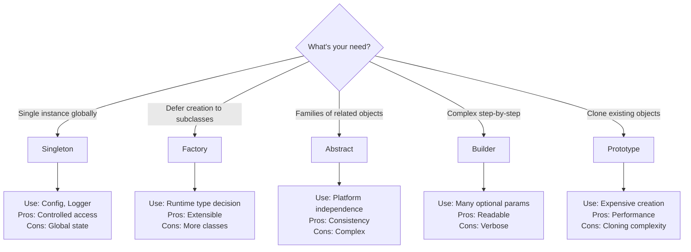

### Comparison Table

| Pattern | Instances | Complexity | Runtime | Subclassing | Best For |
|---------|-----------|------------|---------|-------------|----------|
| Singleton | One | Low | No | No | Global resources |
| Factory Method | Many | Medium | Yes | Yes | Type flexibility |
| Abstract Factory | Families | High | Yes | No | Product families |
| Builder | One | Medium | No | Optional | Complex objects |
| Prototype | Clones | Low | No | No | Expensive creation |

---

## Interview Questions

### Q1: What's the difference between Singleton and Static Class?

**Answer**:

- **Singleton**: Can implement interfaces, lazy initialization, instance-based
- **Static Class**: Cannot implement interfaces, no instantiation, class-based

Singleton is more flexible and testable.

### Q2: When would you use Abstract Factory over Factory Method?

**Answer**: Use Abstract Factory when:

- Need to create families of related products
- Products must work together
- Want to enforce consistency across products
- System should be independent of product implementation

Factory Method for single product hierarchies.

### Q3: What's the main benefit of Builder pattern?

**Answer**: Builder separates construction from representation:

- Handles objects with many optional parameters
- Provides fluent interface (readable)
- Allows step-by-step construction
- Same process creates different representations

### Q4: Explain shallow vs deep copy in Prototype pattern

**Answer**:

- **Shallow Copy**: Copies object, but nested objects are referenced (not copied)
- **Deep Copy**: Recursively copies object and all nested objects

Use deep copy when cloned object should be completely independent.

### Q5: Is Singleton an anti-pattern?

**Answer**: It's controversial:

**Cons:**

- Global state (hard to test)
- Hidden dependencies
- Violates Single Responsibility

**When OK:**

- Truly need single instance (logging, config)
- Alternative: Dependency injection

Not anti-pattern if used appropriately.

### Q6: Can Builder and Factory patterns be combined?

**Answer**: Yes! Common combinations:

- Factory creates Builder instances
- Builder creates different product types using Factory
- Director uses Factory to get Builders

Example: DocumentBuilderFactory creates different document builders.

### Q7: How do you make Singleton thread-safe

**Answer**: Multiple approaches:

1. **Eager initialization**: Create at class loading
2. **Double-checked locking**: Check before synchronization
3. **Initialization-on-demand holder**: Lazy and thread-safe
4. **Enum singleton** (Java): Best approach

In Python: Use metaclass with lock
In JavaScript: Module scope or private static field

---

## Summary

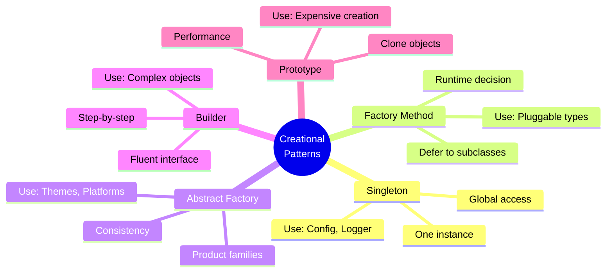

---

**Key Takeaways:**

- **5 Creational patterns** solve object creation problems
- **Singleton**: One instance globally (use sparingly)
- **Factory Method**: Defer creation to subclasses
- **Abstract Factory**: Create related object families
- **Builder**: Construct complex objects step-by-step
- **Prototype**: Clone expensive objects

**Remember**: Choose pattern based on **problem**, not popularity. Start simple, add patterns when **needed**!
