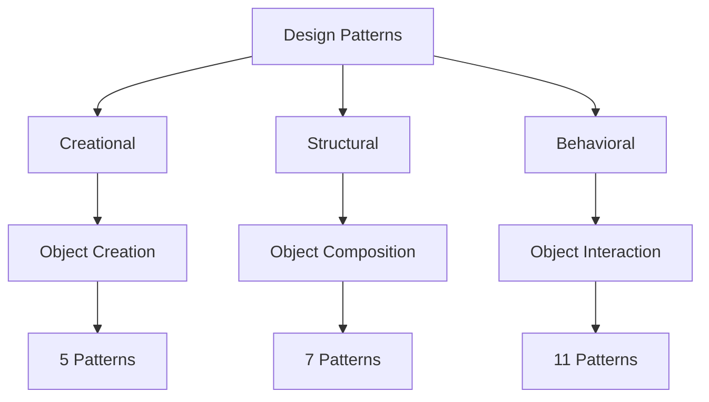
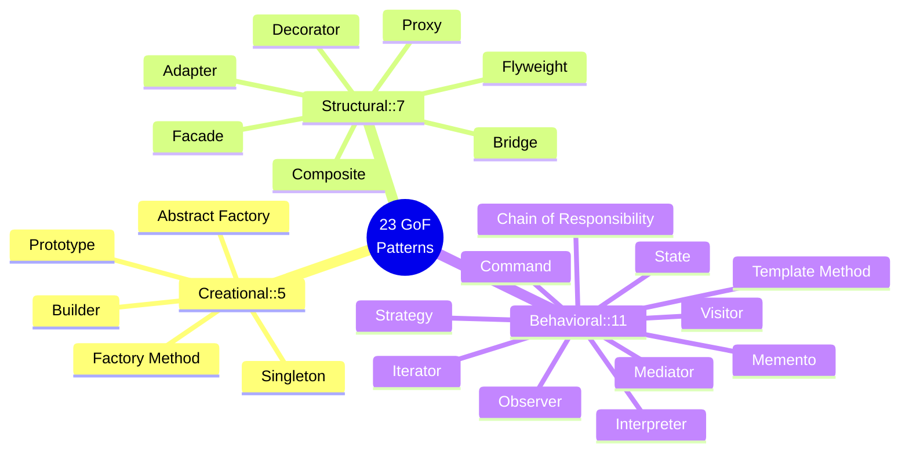
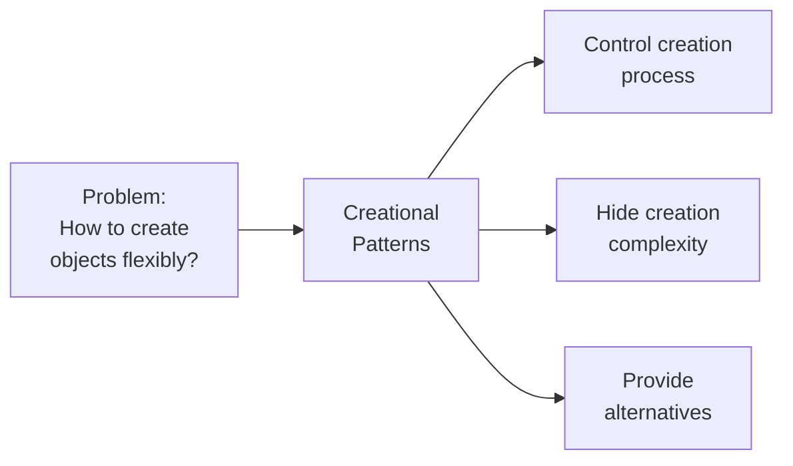
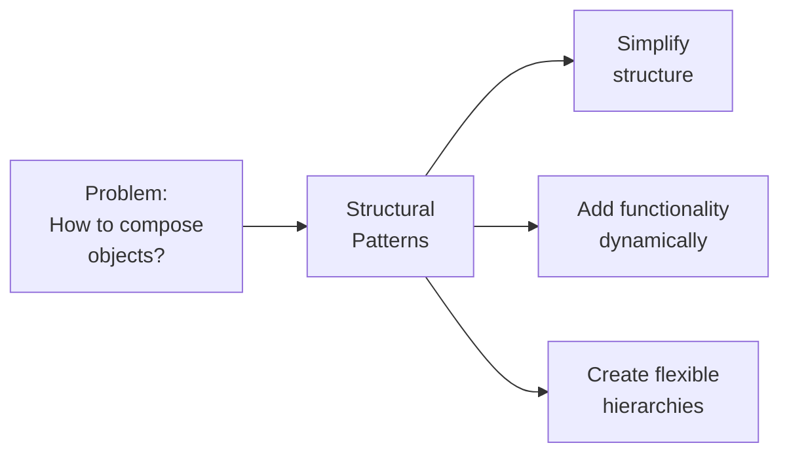
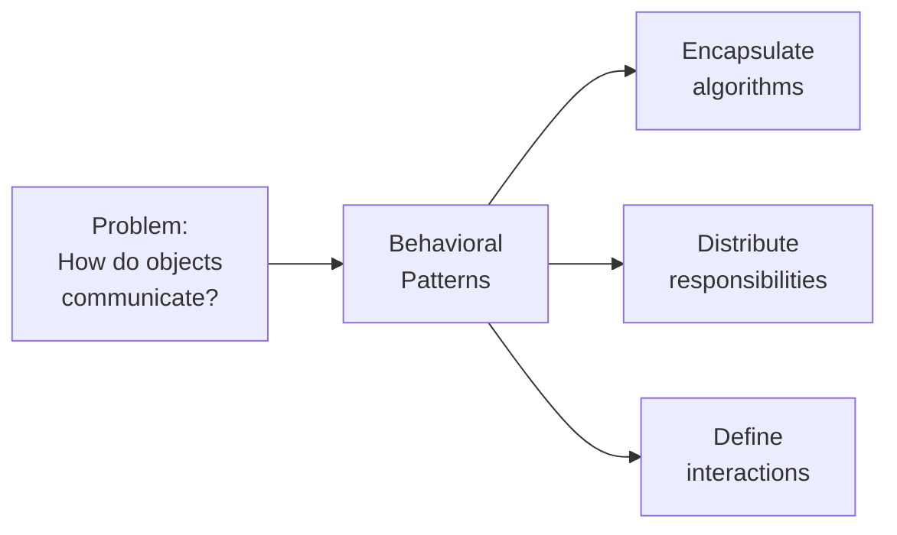
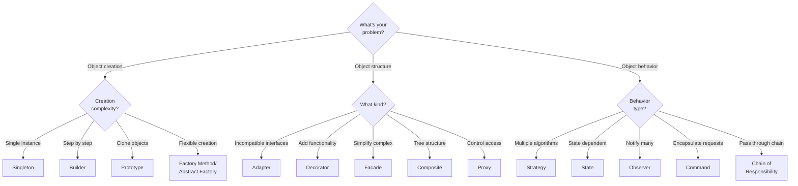
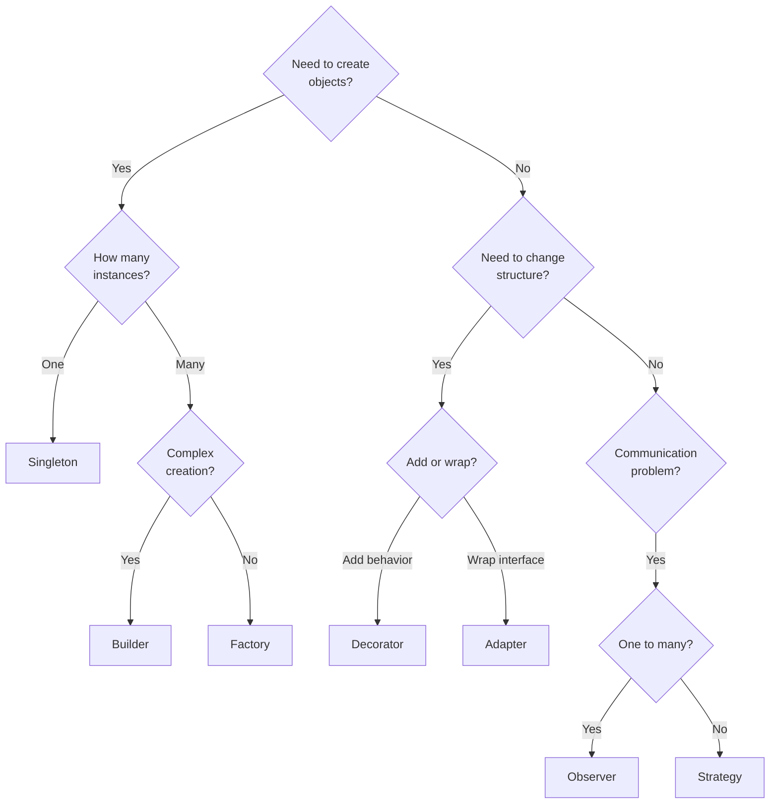
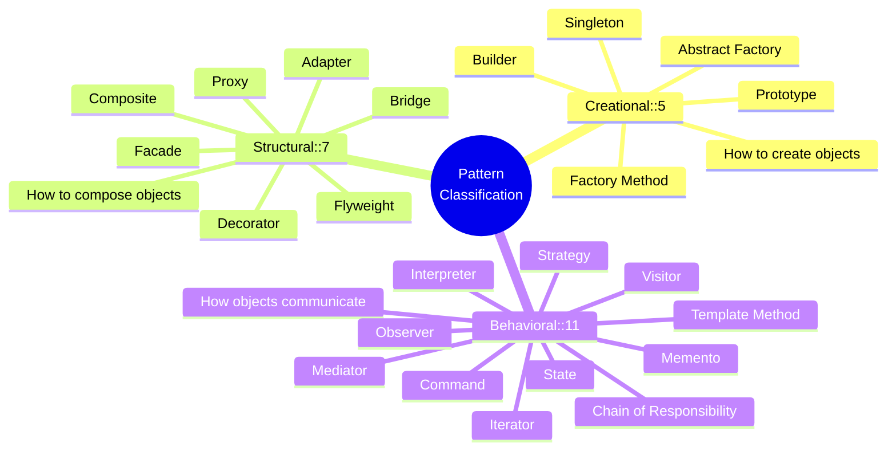

# Design Patterns Classification

**Purpose**: Understand how design patterns are organized into categories - Creational, Structural, and Behavioral - and learn to select the right pattern for your problem.

---

## Table of Contents

1. [Overview](#overview)
2. [Creational Patterns](#creational-patterns)
3. [Structural Patterns](#structural-patterns)
4. [Behavioral Patterns](#behavioral-patterns)
5. [Pattern Selection Guide](#pattern-selection-guide)
6. [Quick Reference](#quick-reference)
7. [Interview Questions](#interview-questions)

---

## Overview

Design patterns are classified into **three main categories** based on their purpose:



### Classification Criteria

| Category | Focus | Question Answered | Count |
|----------|-------|-------------------|-------|
| **Creational** | Object creation | **How** to create objects? | 5 |
| **Structural** | Object composition | **How** to compose objects? | 7 |
| **Behavioral** | Object interaction | **How** do objects communicate? | 11 |

### The Gang of Four Classification



---

## Creational Patterns

**Purpose**: Provide mechanisms for **object creation** that increase flexibility and reuse.

### Creational Overview

**Creational patterns** abstract the instantiation process, making systems independent of how objects are created, composed, and represented.



### The 5 Creational Patterns

#### 1. Singleton

**Purpose**: Ensure a class has only **one instance** and provide global access.

**When to Use**:

- Need exactly one instance (logging, configuration, database connection)
- Global point of access required

**JavaScript Example**:

```javascript
class DatabaseConnection {
    static #instance = null;
    
    static getInstance() {
        if (!DatabaseConnection.#instance) {
            DatabaseConnection.#instance = new DatabaseConnection();
        }
        return DatabaseConnection.#instance;
    }
    
    connect() {
        console.log('Connected to database');
    }
}

// Always returns same instance
const db1 = DatabaseConnection.getInstance();
const db2 = DatabaseConnection.getInstance();
console.log(db1 === db2); // true
```

#### 2. Factory Method

**Purpose**: Define interface for creating objects, let subclasses decide which class to instantiate.

**When to Use**:

- Don't know exact types/classes beforehand
- Want subclasses to specify object creation

**Python Example**:

```python
from abc import ABC, abstractmethod

class PaymentProcessor(ABC):
    @abstractmethod
    def create_payment(self):
        pass
    
    def process(self, amount):
        payment = self.create_payment()
        return payment.pay(amount)

class CreditCardProcessor(PaymentProcessor):
    def create_payment(self):
        return CreditCardPayment()

class PayPalProcessor(PaymentProcessor):
    def create_payment(self):
        return PayPalPayment()
```

#### 3. Abstract Factory

**Purpose**: Create families of related objects without specifying concrete classes.

**When to Use**:

- System needs to be independent of product creation
- Need to provide multiple families of related products

#### 4. Builder

**Purpose**: Construct complex objects step by step.

**When to Use**:

- Object has many optional parameters
- Want to create different representations
- Construction process must be independent

#### 5. Prototype

**Purpose**: Create new objects by copying existing ones.

**When to Use**:

- Object creation is expensive
- Want to avoid subclasses
- Objects have only few state variations

### Creational Patterns Comparison

| Pattern | Use Case | Complexity |
|---------|----------|------------|
| Singleton | Single instance globally | Low |
| Factory Method | Defer instantiation to subclasses | Medium |
| Abstract Factory | Families of related objects | High |
| Builder | Complex object construction | Medium |
| Prototype | Clone existing objects | Low |

---

## Structural Patterns

**Purpose**: Compose objects into larger structures while keeping structures **flexible and efficient**.

### Structural Overview

**Structural patterns** explain how to assemble objects and classes into larger structures, while keeping these structures flexible and efficient.



### The 7 Structural Patterns

#### 1. Adapter

**Purpose**: Convert interface of a class into another interface clients expect.

**When to Use**:

- Want to use existing class with incompatible interface
- Need to create reusable class with unrelated classes

**JavaScript Example**:

```javascript
// Old system
class LegacyPrinter {
    printDocument(text) {
        console.log(`[Legacy] Printing: ${text}`);
    }
}

// New interface
class ModernPrinter {
    print(document) {
        throw new Error('Must implement print()');
    }
}

// Adapter
class PrinterAdapter extends ModernPrinter {
    constructor(legacyPrinter) {
        super();
        this.legacyPrinter = legacyPrinter;
    }
    
    print(document) {
        this.legacyPrinter.printDocument(document.text);
    }
}
```

#### 2. Bridge

**Purpose**: Decouple abstraction from implementation so both can vary independently.

**When to Use**:

- Want to avoid permanent binding between abstraction and implementation
- Both abstraction and implementation should be extensible

#### 3. Composite

**Purpose**: Compose objects into tree structures to represent part-whole hierarchies.

**When to Use**:

- Want to represent part-whole hierarchies
- Want clients to treat individual objects and compositions uniformly

**Python Example**:

```python
class FileSystemComponent:
    def get_size(self):
        raise NotImplementedError

class File(FileSystemComponent):
    def __init__(self, name, size):
        self.name = name
        self.size = size
    
    def get_size(self):
        return self.size

class Folder(FileSystemComponent):
    def __init__(self, name):
        self.name = name
        self.children = []
    
    def add(self, component):
        self.children.append(component)
    
    def get_size(self):
        return sum(child.get_size() for child in self.children)
```

#### 4. Decorator

**Purpose**: Attach additional responsibilities to objects dynamically.

**When to Use**:

- Need to add responsibilities without affecting other objects
- Want to withdraw responsibilities
- Extension by subclassing is impractical

#### 5. Facade

**Purpose**: Provide unified interface to a set of interfaces in subsystem.

**When to Use**:

- Want simple interface to complex subsystem
- Need to decouple subsystem from clients
- Want to layer subsystems

#### 6. Flyweight

**Purpose**: Use sharing to support large numbers of fine-grained objects efficiently.

**When to Use**:

- Application uses large number of objects
- Storage costs are high because of quantity
- Most object state can be made extrinsic

#### 7. Proxy

**Purpose**: Provide surrogate/placeholder for another object to control access.

**When to Use**:

- Need lazy initialization (virtual proxy)
- Need access control (protection proxy)
- Need local representative for remote object (remote proxy)

### Structural Patterns Comparison

| Pattern | Use Case | Complexity |
|---------|----------|------------|
| Adapter | Make incompatible interfaces work | Low |
| Bridge | Separate abstraction from implementation | High |
| Composite | Tree structures of objects | Medium |
| Decorator | Add responsibilities dynamically | Medium |
| Facade | Simplify complex subsystem | Low |
| Flyweight | Share objects to save memory | High |
| Proxy | Control access to objects | Medium |

---

## Behavioral Patterns

**Purpose**: Define common **communication patterns** between objects and how responsibilities are distributed.

### Behavioral Overview

**Behavioral patterns** are concerned with algorithms and the assignment of responsibilities between objects.



### The 11 Behavioral Patterns

#### 1. Chain of Responsibility

**Purpose**: Pass request along chain of handlers until one handles it.

**When to Use**:

- Multiple objects may handle request
- Don't know handler beforehand
- Want to issue request to one of several objects without specifying receiver

#### 2. Command

**Purpose**: Encapsulate request as an object.

**When to Use**:

- Need to parameterize objects with operations
- Want to queue, log, or support undo operations
- Need to support transactions

**JavaScript Example**:

```javascript
class Command {
    execute() {}
    undo() {}
}

class AddTextCommand extends Command {
    constructor(editor, text) {
        super();
        this.editor = editor;
        this.text = text;
    }
    
    execute() {
        this.editor.content += this.text;
    }
    
    undo() {
        this.editor.content = this.editor.content.slice(0, -this.text.length);
    }
}

class Editor {
    constructor() {
        this.content = '';
        this.history = [];
    }
    
    executeCommand(command) {
        command.execute();
        this.history.push(command);
    }
    
    undo() {
        const command = this.history.pop();
        if (command) command.undo();
    }
}
```

#### 3. Iterator

**Purpose**: Access elements of collection sequentially without exposing underlying representation.

**When to Use**:

- Need to access collection contents without exposing internal structure
- Support multiple traversals
- Provide uniform interface for different structures

#### 4. Mediator

**Purpose**: Define object that encapsulates how set of objects interact.

**When to Use**:

- Objects communicate in complex but well-defined ways
- Want to reuse objects difficult because they reference many others
- Behavior distributed between several classes should be customizable

#### 5. Memento

**Purpose**: Capture and externalize object's internal state for later restoration.

**When to Use**:

- Need to save/restore object state
- Direct interface would expose implementation
- Want undo mechanism

#### 6. Observer

**Purpose**: Define one-to-many dependency so when one object changes state, dependents are notified.

**When to Use**:

- Change to one object requires changing others
- Don't know how many objects need to change
- Object should notify others without knowing who they are

**Python Example**:

```python
class Subject:
    def __init__(self):
        self._observers = []
    
    def attach(self, observer):
        self._observers.append(observer)
    
    def notify(self, event):
        for observer in self._observers:
            observer.update(event)

class Observer:
    def update(self, event):
        print(f"Observer received: {event}")

# Usage
subject = Subject()
observer1 = Observer()
observer2 = Observer()

subject.attach(observer1)
subject.attach(observer2)
subject.notify("State changed")
```

#### 7. State

**Purpose**: Allow object to alter behavior when internal state changes.

**When to Use**:

- Object behavior depends on its state
- Operations have large conditional statements on object state
- State transitions are explicit

#### 8. Strategy

**Purpose**: Define family of algorithms, encapsulate each, make them interchangeable.

**When to Use**:

- Many related classes differ only in behavior
- Need different variants of algorithm
- Algorithm uses data clients shouldn't know about

#### 9. Template Method

**Purpose**: Define skeleton of algorithm, let subclasses redefine certain steps.

**When to Use**:

- Want to implement invariant parts once
- Common behavior among subclasses should be factored
- Want to control subclass extensions

#### 10. Visitor

**Purpose**: Represent operation to be performed on elements of object structure.

**When to Use**:

- Object structure contains many classes with differing interfaces
- Need to perform many distinct operations on objects
- Classes defining structure rarely change but operations often do

#### 11. Interpreter

**Purpose**: Define representation for grammar along with interpreter.

**When to Use**:

- Grammar is simple
- Efficiency is not critical concern
- Want to interpret sentences in a language

### Behavioral Patterns Comparison

| Pattern | Use Case | Complexity |
|---------|----------|------------|
| Chain of Responsibility | Pass request through chain | Medium |
| Command | Encapsulate requests | Low |
| Iterator | Traverse collections | Low |
| Mediator | Centralize complex communications | High |
| Memento | Save/restore object state | Medium |
| Observer | Notify multiple objects of changes | Low |
| State | Change behavior based on state | Medium |
| Strategy | Interchangeable algorithms | Low |
| Template Method | Define algorithm skeleton | Low |
| Visitor | Operations on object structure | High |
| Interpreter | Define language grammar | High |

---

## Pattern Selection Guide

### Decision Tree



### Problem-Pattern Mapping

| Problem | Recommended Pattern | Alternative |
|---------|-------------------|-------------|
| Need single instance | Singleton | Static methods |
| Complex object creation | Builder | Factory Method |
| Different algorithms | Strategy | State |
| Notify subscribers | Observer | Mediator |
| Add functionality | Decorator | Subclassing |
| Simplify complex system | Facade | Adapter |
| Undo/Redo functionality | Command | Memento |
| Tree structures | Composite | - |
| State-based behavior | State | Strategy |
| Incompatible interfaces | Adapter | Wrapper |

### Selection Questions



---

## Quick Reference

### By Complexity

**Low Complexity** (Learn First):

- Singleton, Strategy, Command, Observer, Iterator, Template Method

**Medium Complexity**:

- Factory Method, Builder, Adapter, Decorator, Composite, Proxy, State, Memento, Chain of Responsibility

**High Complexity** (Advanced):

- Abstract Factory, Bridge, Flyweight, Mediator, Visitor, Interpreter

### By Popularity

**Most Used** (in modern applications):

1. Singleton
2. Factory/Factory Method
3. Observer
4. Strategy
5. Decorator
6. Adapter
7. Command
8. Template Method

**Less Common** (but still important):

- Flyweight, Interpreter, Visitor, Bridge

### By Use Case

**Web Development**:

- Singleton (config, connections)
- Observer (event systems)
- Strategy (authentication methods)
- Factory (creating components)
- Decorator (middleware)

**Game Development**:

- State (game states)
- Command (input handling)
- Observer (event systems)
- Flyweight (rendering optimization)
- Composite (scene graphs)

**Enterprise Applications**:

- Factory/Abstract Factory (object creation)
- Facade (subsystem simplification)
- Proxy (lazy loading, security)
- Strategy (business rules)
- Command (transactions)

---

## Interview Questions

### Q1: What are the three main categories of design patterns?

**Answer**: The three categories are:

1. **Creational** (5 patterns): Focus on object creation mechanisms
2. **Structural** (7 patterns): Focus on object composition and relationships
3. **Behavioral** (11 patterns): Focus on communication between objects

### Q2: What's the difference between Factory Method and Abstract Factory?

**Answer**:

- **Factory Method**: Creates one type of object through inheritance. Subclasses decide which class to instantiate.
- **Abstract Factory**: Creates families of related objects through composition. Provides interface for creating related objects without specifying concrete classes.

### Q3: When would you use Adapter vs Decorator?

**Answer**:

- **Adapter**: Use when you need to make incompatible interfaces compatible. Changes the interface.
- **Decorator**: Use when you need to add new functionality to existing object. Keeps same interface.

### Q4: What's the difference between Strategy and State patterns?

**Answer**:

- **Strategy**: Different algorithms for same task. Client chooses strategy explicitly. Strategies are independent.
- **State**: Different behavior based on internal state. State transitions happen automatically. States know about each other.

### Q5: Which pattern would you use for implementing undo/redo?

**Answer**: **Command** pattern or **Memento** pattern.

- **Command**: Store commands in history, call execute() and undo()
- **Memento**: Store state snapshots, restore when needed

Command is more common for undo/redo as it encapsulates actions.

### Q6: How do Composite and Decorator patterns differ?

**Answer**:

- **Composite**: Focuses on representing part-whole hierarchies (tree structures). Uniform treatment of individual objects and compositions.
- **Decorator**: Focuses on adding responsibilities dynamically. Wraps objects to enhance behavior.

Both use similar structure but different intent.

### Q7: What's the most overused/misused pattern?

**Answer**: **Singleton** is often overused:

- Creates global state (hard to test)
- Can hide dependencies
- Alternative: Dependency injection

Use Singleton only when truly need single instance (logging, config).

### Q8: Can you combine multiple pattern categories?

**Answer**: Yes, absolutely! Common combinations:

- **Factory (Creational) + Strategy (Behavioral)**: Factory creates different strategies
- **Singleton (Creational) + Facade (Structural)**: Single facade instance
- **Observer (Behavioral) + Mediator (Behavioral)**: Complex event systems
- **Decorator (Structural) + Factory (Creational)**: Factory creates decorated objects

---

## Summary



---

## Next Steps

1. **Study in depth**: [Creational Patterns](./creational-patterns.md)
2. **Study in depth**: [Structural Patterns](./structural-patterns.md)
3. **Study in depth**: [Behavioral Patterns](./behavioral-patterns.md)
4. **Review**: [Design Patterns Introduction](./design-patterns-introduction.md)
5. **Practice**: Identify patterns in your current projects
6. **Exercise**: Build a small app using 3-5 different patterns

---

**Key Takeaways:**

- **23 patterns** organized into **3 categories**
- **Creational** = object creation (5 patterns)
- **Structural** = object composition (7 patterns)
- **Behavioral** = object interaction (11 patterns)
- Start with **low complexity** patterns first
- Use **selection guide** to find right pattern
- Most patterns can be **combined** effectively

**Remember**: The category helps you find the pattern, but understanding the **problem** helps you choose the **right** pattern!
