# Introduction to Design Patterns

**Purpose**: Understand design patterns - proven, reusable solutions to commonly occurring problems in software design that improve code quality, maintainability, and communication.

---

## Table of Contents

1. [What are Design Patterns?](#what-are-design-patterns)
2. [History and Evolution](#history-and-evolution)
3. [Why Design Patterns?](#why-design-patterns)
4. [Benefits of Design Patterns](#benefits-of-design-patterns)
5. [When to Use Patterns](#when-to-use-patterns)
6. [When NOT to Use Patterns](#when-not-to-use-patterns)
7. [Pattern Selection Guide](#pattern-selection-guide)
8. [Common Misconceptions](#common-misconceptions)
9. [Interview Questions](#interview-questions)

---

## What are Design Patterns?

**Design Patterns** are proven, reusable solutions to commonly occurring problems in software design. They represent best practices evolved over time by experienced software developers.

### Key Definition

> A design pattern is a general repeatable solution to a commonly occurring problem in software design. It's a description or template for how to solve a problem that can be used in many different situations.

### Important Clarifications

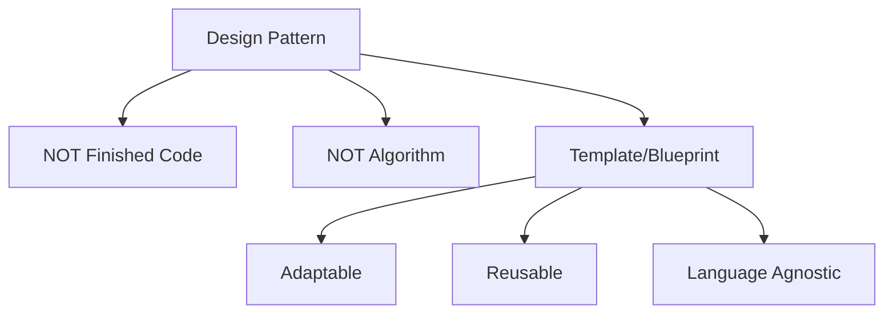

**Design Patterns ARE:**

- ✅ Templates for solving problems
- ✅ Best practice guidelines
- ✅ Communication tools
- ✅ Proven solutions

**Design Patterns are NOT:**

- ❌ Ready-to-use code
- ❌ Specific algorithms
- ❌ Silver bullets
- ❌ Mandatory rules

### Analogy

Think of design patterns like architectural blueprints:

- **Blueprint for a house**: Shows structure, not specific materials
- **Design Pattern**: Shows solution structure, not exact code

```javascript
// Pattern is like a recipe, not a ready meal
// You adapt it to your specific ingredients and taste

// Singleton Pattern (the recipe)
class Database {
    static #instance = null;
    
    static getInstance() {
        if (!Database.#instance) {
            Database.#instance = new Database();
        }
        return Database.#instance;
    }
    
    // Your specific implementation here
    connect() { /* your connection logic */ }
    query() { /* your query logic */ }
}
```

---

## History and Evolution

### Timeline

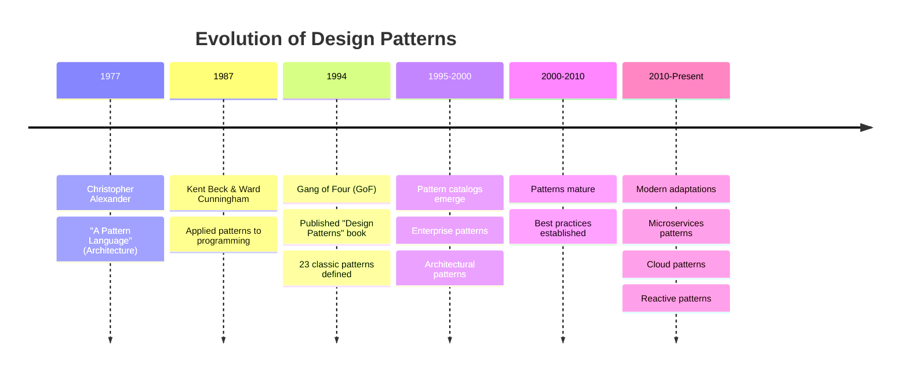

### The Gang of Four (GoF)

The foundational book that established design patterns in software engineering.

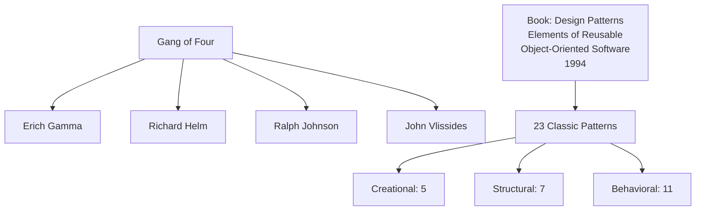

**The Book's Impact:**

- Standardized pattern terminology
- Established pattern documentation format
- Created common vocabulary for developers
- Influenced entire software industry

### Original 23 Patterns

```mermaid
graph TD
    A[23 GoF Patterns] --> B[Creational: 5]
    A --> C[Structural: 7]
    A --> D[Behavioral: 11]
    
    B --> B1[Singleton]
    B --> B2[Factory Method]
    B --> B3[Abstract Factory]
    B --> B4[Builder]
    B --> B5[Prototype]
    
    C --> C1[Adapter]
    C --> C2[Bridge]
    C --> C3[Composite]
    C --> C4[Decorator]
    C --> C5[Facade]
    C --> C6[Flyweight]
    C --> C7[Proxy]
    
    D --> D1[Chain of Responsibility]
    D --> D2[Command]
    D --> D3[Interpreter]
    D --> D4[Iterator]
    D --> D5[Mediator]
    D --> D6[Memento]
    D --> D7[Observer]
    D --> D8[State]
    D --> D9[Strategy]
    D --> D10[Template Method]
    D --> D11[Visitor]
```

---

## Why Design Patterns?

### The Problem Without Patterns

**JavaScript Example - Before Patterns:**

```javascript
// ❌ BAD: No patterns, tightly coupled, hard to maintain
class OrderProcessor {
    processOrder(order) {
        // Validation mixed with business logic
        if (!order.items || order.items.length === 0) {
            throw new Error("No items");
        }
        
        // Payment processing hardcoded
        if (order.paymentMethod === 'credit_card') {
            // Credit card logic
            console.log("Processing credit card...");
        } else if (order.paymentMethod === 'paypal') {
            // PayPal logic
            console.log("Processing PayPal...");
        } else if (order.paymentMethod === 'crypto') {
            // Crypto logic
            console.log("Processing crypto...");
        }
        // Adding new payment method requires modifying this class!
        
        // Email sending hardcoded
        console.log("Sending email confirmation...");
        
        // Logging hardcoded
        console.log("Order processed");
        
        // Violates: Single Responsibility, Open/Closed Principle
    }
}
```

**With Patterns - Strategy Pattern:**

```javascript
// ✅ GOOD: Using Strategy Pattern
class PaymentStrategy {
    process(amount) {
        throw new Error("Must implement process()");
    }
}

class CreditCardPayment extends PaymentStrategy {
    process(amount) {
        console.log(`Processing credit card payment: $${amount}`);
        return { success: true, transactionId: 'CC123' };
    }
}

class PayPalPayment extends PaymentStrategy {
    process(amount) {
        console.log(`Processing PayPal payment: $${amount}`);
        return { success: true, transactionId: 'PP456' };
    }
}

class CryptoPayment extends PaymentStrategy {
    process(amount) {
        console.log(`Processing crypto payment: $${amount}`);
        return { success: true, transactionId: 'BTC789' };
    }
}

class OrderProcessor {
    #paymentStrategy;
    
    constructor(paymentStrategy) {
        this.#paymentStrategy = paymentStrategy;
    }
    
    setPaymentStrategy(strategy) {
        this.#paymentStrategy = strategy;
    }
    
    processOrder(order) {
        // Clean, focused, easy to extend
        const result = this.#paymentStrategy.process(order.total);
        console.log("Order processed");
        return result;
    }
}

// Easy to add new payment methods without modifying OrderProcessor!
const processor = new OrderProcessor(new CreditCardPayment());
processor.processOrder({ total: 100 });

// Switch payment strategy at runtime
processor.setPaymentStrategy(new PayPalPayment());
processor.processOrder({ total: 200 });
```

**Python Example:**

```python
# ✅ GOOD: Using Strategy Pattern
from abc import ABC, abstractmethod

class PaymentStrategy(ABC):
    @abstractmethod
    def process(self, amount: float) -> dict:
        pass

class CreditCardPayment(PaymentStrategy):
    def process(self, amount: float) -> dict:
        print(f"Processing credit card payment: ${amount}")
        return {'success': True, 'transactionId': 'CC123'}

class PayPalPayment(PaymentStrategy):
    def process(self, amount: float) -> dict:
        print(f"Processing PayPal payment: ${amount}")
        return {'success': True, 'transactionId': 'PP456'}

class CryptoPayment(PaymentStrategy):
    def process(self, amount: float) -> dict:
        print(f"Processing crypto payment: ${amount}")
        return {'success': True, 'transactionId': 'BTC789'}

class OrderProcessor:
    def __init__(self, payment_strategy: PaymentStrategy):
        self._payment_strategy = payment_strategy
    
    def set_payment_strategy(self, strategy: PaymentStrategy):
        self._payment_strategy = strategy
    
    def process_order(self, order: dict) -> dict:
        result = self._payment_strategy.process(order['total'])
        print("Order processed")
        return result

# Usage
processor = OrderProcessor(CreditCardPayment())
processor.process_order({'total': 100})

processor.set_payment_strategy(PayPalPayment())
processor.process_order({'total': 200})
```

---

## Benefits of Design Patterns

### 1. Reusability

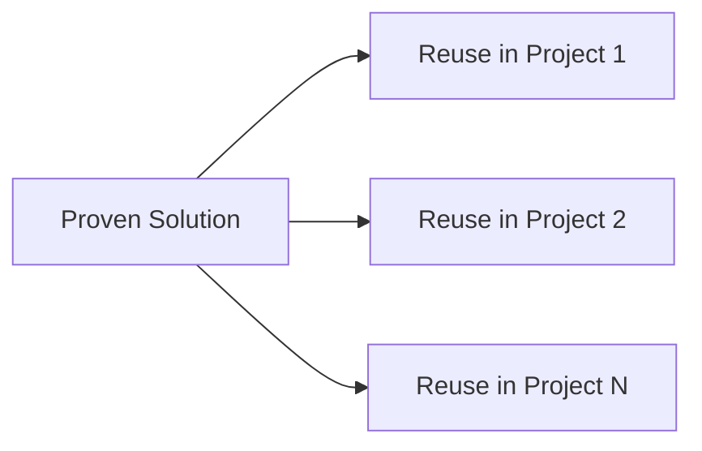

### 2. Common Vocabulary

```javascript
// Instead of explaining:
"We need a class that ensures only one instance exists globally
and provides a single point of access to it..."

// Just say:
"Use Singleton pattern"

// Everyone understands immediately!
```

### 3. Better Communication

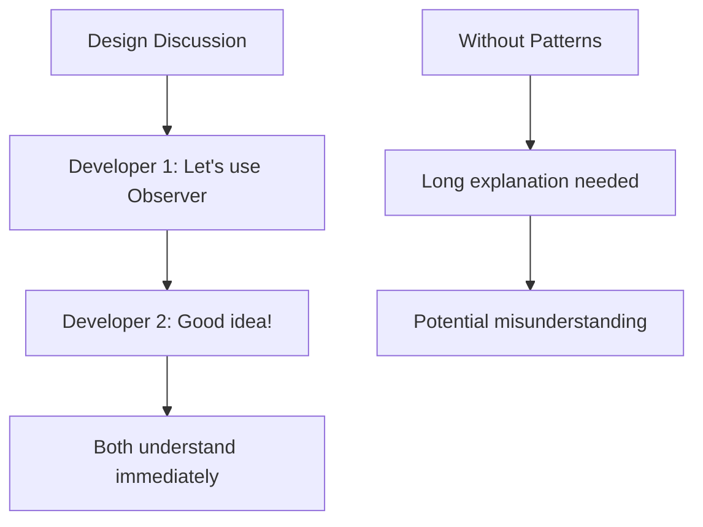

### 4. Proven Solutions

- Battle-tested by thousands of developers
- Known trade-offs and limitations
- Well-documented best practices

### 5. Code Quality

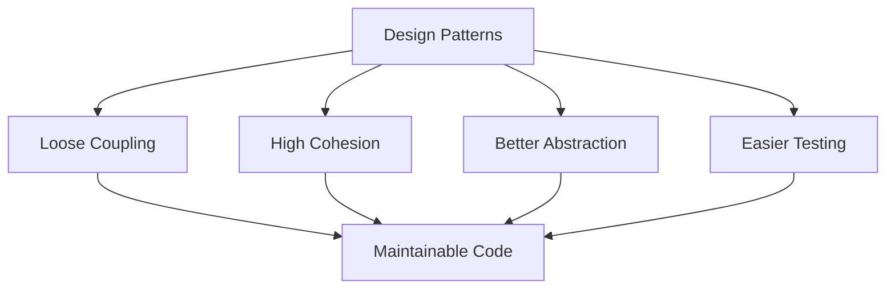

### 6. Faster Development

- No need to reinvent the wheel
- Focus on business logic
- Proven architecture decisions

### 7. Easier Maintenance

```javascript
// With patterns, new developers can understand code faster
// "Oh, this is Factory pattern, I know how this works!"
```

---

## When to Use Patterns

### Decision Tree

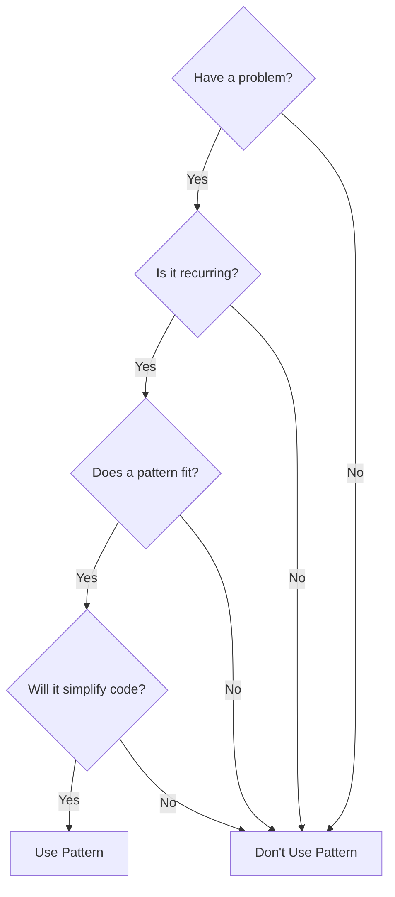

### Scenarios for Using Patterns

#### 1. Multiple Implementations Needed

```javascript
// Use Strategy Pattern when you have multiple algorithms
class DataExporter {
    constructor(exportStrategy) {
        this.strategy = exportStrategy;
    }
    
    export(data) {
        return this.strategy.export(data);
    }
}

// Easy to add: CSV, JSON, XML, PDF exporters
```

#### 2. Single Instance Required

```javascript
// Use Singleton for configuration, logging, database connections
class Config {
    static #instance = null;
    
    static getInstance() {
        if (!Config.#instance) {
            Config.#instance = new Config();
        }
        return Config.#instance;
    }
}
```

#### 3. Complex Object Creation

```javascript
// Use Builder for objects with many optional parameters
const user = new UserBuilder()
    .setName("John")
    .setEmail("john@example.com")
    .setAge(30)
    .setAddress("123 Main St")
    .build();
```

#### 4. Need to Notify Multiple Objects

```javascript
// Use Observer for event-driven systems
class EventEmitter {
    #observers = [];
    
    subscribe(observer) {
        this.#observers.push(observer);
    }
    
    notify(event) {
        this.#observers.forEach(obs => obs.update(event));
    }
}
```

#### 5. Adding Functionality Dynamically

```javascript
// Use Decorator to add behavior without modifying classes
const basicCoffee = new Coffee();
const milkCoffee = new MilkDecorator(basicCoffee);
const sweetMilkCoffee = new SugarDecorator(milkCoffee);
```

---

## When NOT to Use Patterns

### Anti-Patterns: Overusing Patterns

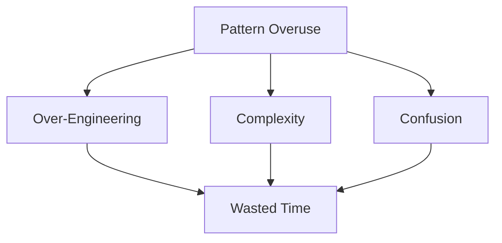

### 1. Simple Problems

```javascript
// ❌ BAD: Overkill for simple addition
class AdditionStrategy {
    execute(a, b) { return a + b; }
}

class Calculator {
    constructor(strategy) {
        this.strategy = strategy;
    }
    add(a, b) {
        return this.strategy.execute(a, b);
    }
}

// ✅ GOOD: Just do it simply!
function add(a, b) {
    return a + b;
}
```

### 2. Unique Problems

```text
If the problem only occurs once in your codebase,
a pattern might be overkill. Don't force patterns
where they don't fit!
```

### 3. Performance Critical Code

```javascript
// Sometimes patterns add overhead
// Profile first, optimize if needed
// Don't use patterns that hurt critical performance
```

### 4. Small Projects

```javascript
// ❌ BAD: Full enterprise architecture for a 100-line script
// ✅ GOOD: Keep it simple for small projects
```

### 5. When You Don't Understand the Pattern

```text
⚠️ Never use a pattern just because it sounds cool!
⚠️ Understand it first, then apply it appropriately
```

---

## Pattern Selection Guide

### Common Problem-Pattern Mapping

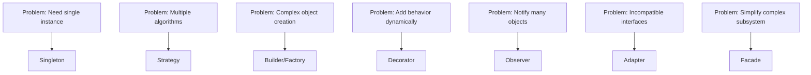

### Selection Matrix

| Problem | Pattern | Category |
|---------|---------|----------|
| One instance globally | Singleton | Creational |
| Create object families | Abstract Factory | Creational |
| Build complex objects | Builder | Creational |
| Clone existing objects | Prototype | Creational |
| Flexible object creation | Factory Method | Creational |
| Make interfaces compatible | Adapter | Structural |
| Add responsibilities dynamically | Decorator | Structural |
| Simplify complex interfaces | Facade | Structural |
| Tree structures | Composite | Structural |
| Multiple algorithms | Strategy | Behavioral |
| Event notification | Observer | Behavioral |
| State-dependent behavior | State | Behavioral |
| Encapsulate requests | Command | Behavioral |

---

## Common Misconceptions

### Myth 1: "Patterns Make Code Better"

```text
❌ WRONG: Patterns automatically improve code
✅ RIGHT: Appropriate patterns, properly applied, improve code
```

### Myth 2: "Always Use Patterns"

```text
❌ WRONG: Every problem needs a pattern
✅ RIGHT: Use patterns when they genuinely solve your problem
```

### Myth 3: "Patterns Are Rules"

```text
❌ WRONG: Must follow pattern exactly as defined
✅ RIGHT: Patterns are guidelines, adapt to your needs
```

### Myth 4: "More Patterns = Better Code"

```text
❌ WRONG: Using many patterns shows expertise
✅ RIGHT: Using appropriate patterns shows expertise
```

### Myth 5: "Patterns Are for Large Projects Only"

```text
❌ WRONG: Patterns only useful in enterprise apps
✅ RIGHT: Patterns useful wherever they solve problems
```

---

## Interview Questions

### Q1: What is a design pattern?

**Answer**: A design pattern is a proven, reusable solution to a commonly occurring problem in software design. It's a template or guideline that can be adapted to solve similar problems in different contexts, promoting best practices and improving code quality.

### Q2: Why are design patterns important?

**Answer**: Design patterns are important because they:

1. Provide proven solutions to common problems
2. Create a common vocabulary for developers
3. Improve code quality and maintainability
4. Speed up development by avoiding reinventing solutions
5. Help in making informed design decisions

### Q3: What are the main categories of design patterns?

**Answer**: The three main categories are:

1. **Creational**: Concerned with object creation (Singleton, Factory, Builder, Prototype, Abstract Factory)
2. **Structural**: Concerned with object composition (Adapter, Decorator, Facade, Composite, Proxy, Bridge, Flyweight)
3. **Behavioral**: Concerned with communication between objects (Strategy, Observer, Command, State, Template Method, etc.)

### Q4: When should you NOT use design patterns?

**Answer**: Avoid patterns when:

- The problem is simple and doesn't need the complexity
- It's a one-time unique problem
- Performance is critical and the pattern adds overhead
- The project is very small
- You don't fully understand the pattern
- Forcing a pattern where it doesn't fit

### Q5: What's the difference between Strategy and State patterns?

**Answer**:

- **Strategy**: Different algorithms for the same task, chosen externally
- **State**: Different behaviors based on internal state, transitions automatically

Both use similar structure but different intent and context.

### Q6: Is Singleton considered an anti-pattern?

**Answer**: Singleton is controversial because:

- **Pros**: Ensures single instance, global access point
- **Cons**: Global state, testing difficulties, tight coupling
- **Verdict**: Not an anti-pattern, but use carefully. Consider dependency injection as an alternative.

### Q7: Can you combine multiple patterns?

**Answer**: Yes! Patterns are often used together:

- Factory + Singleton: Factory that returns singleton instances
- Strategy + Factory: Factory creates different strategies
- Observer + Mediator: For complex event systems
- Decorator + Factory: Factory creates decorated objects

### Q8: How do design patterns relate to SOLID principles?

**Answer**: Design patterns implement SOLID principles:

- Strategy implements Open/Closed Principle
- Dependency Injection implements Dependency Inversion
- Adapter implements Interface Segregation
- Observer implements Open/Closed Principle
- Decorator implements Open/Closed Principle

---

## Summary

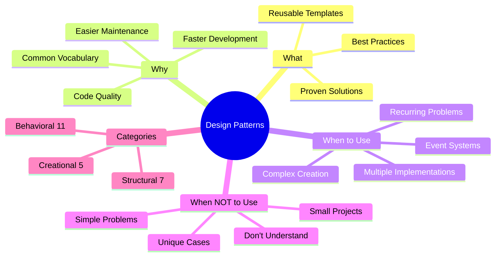

---

## Next Steps

1. **Study**: [Design Pattern Classification](./design-patterns-classification.md)
2. **Study**: [Creational Patterns](./creational-patterns.md)
3. **Study**: [Structural Patterns](./structural-patterns.md)
4. **Study**: [Behavioral Patterns](./behavioral-patterns.md)
5. **Practice**: Identify patterns in codebases you use
6. **Exercise**: Refactor code to use appropriate patterns

---

## Resources

- **Book**: "Design Patterns: Elements of Reusable Object-Oriented Software" by Gang of Four
- **Website**: Refactoring.Guru (<https://refactoring.guru/design-patterns>)
- **Practice**: Implement each pattern in small projects

---

**Key Takeaway**: Design patterns are tools in your toolbox, not rules to follow blindly. Learn them, understand when to use them, but also when NOT to use them. The goal is better software, not more patterns!

**Remember**:

- Patterns solve problems, they don't create architecture
- Simple solutions are often better than pattern-heavy ones
- Understand the problem before applying a pattern
- Don't force patterns where they don't belong
