# Introduction to Design Patterns

**Purpose**: Understand design patterns - proven, reusable solutions to commonly occurring problems in software design that improve code quality, maintainability, and communication.

---

## Table of Contents

1. [What are Design Patterns?](#what-are-design-patterns)
2. [How to Learn Design Patterns (For Beginners)](#how-to-learn-design-patterns-for-beginners)
3. [History and Evolution](#history-and-evolution)
4. [Why Design Patterns?](#why-design-patterns)
5. [Benefits of Design Patterns](#benefits-of-design-patterns)
6. [When to Use Patterns](#when-to-use-patterns)
7. [When NOT to Use Patterns](#when-not-to-use-patterns)
8. [Pattern Selection Guide](#pattern-selection-guide)
9. [Common Misconceptions](#common-misconceptions)
10. [Getting Started - Your First Pattern](#getting-started---your-first-pattern)
11. [Interview Questions](#interview-questions)

---

## What are Design Patterns?

**Design Patterns** are proven, reusable solutions to commonly occurring problems in software design. They represent best practices evolved over time by experienced software developers.

Think of design patterns as **tried-and-tested blueprints** that you can customize to solve recurring design problems in your code. Just like how architects have standard blueprints for building different types of structures, software developers have design patterns for building different parts of applications.

### A Simple Analogy for Beginners

Imagine you're building furniture. You could:

1. **Without Patterns** (Reinvent the wheel): Figure out from scratch how to build every chair, table, or shelf, making mistakes along the way
2. **With Patterns** (Use proven designs): Follow IKEA-style instructions that show you the best way to assemble furniture

Design patterns are like those IKEA instructions - they don't give you the finished furniture (code), but they show you **how to assemble the parts** in a way that's been proven to work well.

### Key Definition

> A design pattern is a general repeatable solution to a commonly occurring problem in software design. It's a description or template for how to solve a problem that can be used in many different situations.

**In simpler terms**: Design patterns are like recipes in a cookbook. The recipe doesn't give you the finished meal, but it tells you:
- What ingredients you need (classes/objects)
- How to prepare them (relationships)
- What steps to follow (implementation approach)
- What the end result should be like (expected behavior)

### Important Clarifications

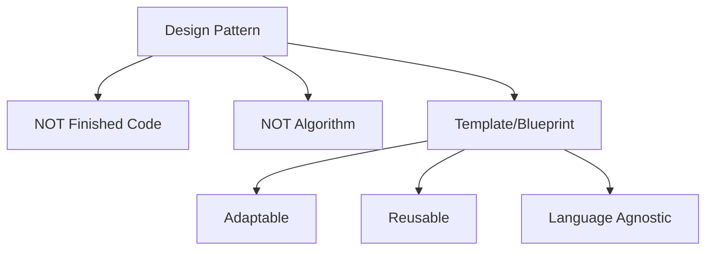
```mermaid
graph TD
    A[Design Pattern] --> B[NOT Finished Code]
    A --> C[NOT Algorithm]
    A --> D[Template/Blueprint]
    
    D --> E[Adaptable]
    D --> F[Reusable]
    D --> G[Language Agnostic]
```

**Design Patterns ARE:**

- ✅ Templates for solving problems
- ✅ Best practice guidelines
- ✅ Communication tools
- ✅ Proven solutions

**Design Patterns are NOT:**

- ❌ Ready-to-use code
- ❌ Specific algorithms
- ❌ Silver bullets
- ❌ Mandatory rules

### More Analogies to Help You Understand

**1. Architectural Blueprints**
- **Blueprint for a house**: Shows structure, not specific materials
- **Design Pattern**: Shows solution structure, not exact code
- You can use the same blueprint to build houses with wood, brick, or concrete

**2. Cooking Recipes**
- **Recipe**: Lists ingredients and steps
- **Design Pattern**: Lists components and their relationships
- You adapt the recipe based on what's in your kitchen

**3. Chess Strategies**
- **Opening move patterns** (like Sicilian Defense): General approach, not exact moves
- **Design Patterns**: General solution approach, not exact code
- You adapt based on your opponent's (project's) specific needs

### Example: Understanding a Pattern Through Code

Let's look at a simple example to understand what a pattern looks like:

```javascript
// BEFORE: Without Pattern (Messy, Hard to Understand)
// ❌ Creating database connections everywhere in the code
let db1 = new Database();
let db2 = new Database(); // Oops! Two connections waste resources
let db3 = new Database(); // Three connections? Even worse!

// AFTER: Using Singleton Pattern (Clean, Easy to Understand)
// ✅ One connection shared everywhere
class Database {
    static #instance = null;  // Private: Only one instance
    
    static getInstance() {
        // Create only if doesn't exist
        if (!Database.#instance) {
            Database.#instance = new Database();
        }
        return Database.#instance;  // Always return same instance
    }
    
    connect() { console.log('Connected to database'); }
    query(sql) { console.log(`Executing: ${sql}`); }
}

// Now anywhere in your code:
const db1 = Database.getInstance();
const db2 = Database.getInstance();
const db3 = Database.getInstance();
// db1, db2, db3 all point to the SAME instance - efficient!
```

**What did the pattern give us?**
- ✅ **One instance** instead of multiple wasteful instances
- ✅ **Global access** from anywhere in the code
- ✅ **Resource efficiency** - one database connection
- ✅ **Clearer intent** - anyone reading knows it's a singleton

---

## How to Learn Design Patterns (For Beginners)

Learning design patterns can feel overwhelming at first. Here's a roadmap to make it easier:

### Step 1: Start with the "Why"

**Before diving into patterns, understand the problems they solve:**

```javascript
// Example: The Problem
// Imagine you have different payment methods in an e-commerce app

// ❌ BAD CODE (No Pattern):
function processPayment(amount, method) {
    if (method === 'credit_card') {
        // 50 lines of credit card logic
        console.log('Processing credit card...');
    } else if (method === 'paypal') {
        // 50 lines of PayPal logic  
        console.log('Processing PayPal...');
    } else if (method === 'crypto') {
        // 50 lines of crypto logic
        console.log('Processing crypto...');
    }
    // Adding a new method? Modify this function! Risky!
}
```

**Problems with the above code:**
- 🔴 Adding new payment methods requires modifying existing code
- 🔴 The function becomes huge and hard to understand
- 🔴 Testing each payment method is difficult
- 🔴 Can't easily switch payment methods at runtime

### Step 2: See the Pattern Solution

```javascript
// ✅ GOOD CODE (Using Strategy Pattern):

// Define the interface
class PaymentStrategy {
    pay(amount) {
        throw new Error('Must implement pay()');
    }
}

// Each payment method is a separate class
class CreditCardPayment extends PaymentStrategy {
    pay(amount) {
        console.log(`Paying $${amount} via Credit Card`);
        // Credit card specific logic here
    }
}

class PayPalPayment extends PaymentStrategy {
    pay(amount) {
        console.log(`Paying $${amount} via PayPal`);
        // PayPal specific logic here
    }
}

class CryptoPayment extends PaymentStrategy {
    pay(amount) {
        console.log(`Paying $${amount} via Cryptocurrency`);
        // Crypto specific logic here
    }
}

// Payment processor uses the strategy
class PaymentProcessor {
    constructor(strategy) {
        this.strategy = strategy;
    }
    
    setStrategy(newStrategy) {
        this.strategy = newStrategy;  // Can switch at runtime!
    }
    
    processPayment(amount) {
        this.strategy.pay(amount);
    }
}

// Using it:
const processor = new PaymentProcessor(new CreditCardPayment());
processor.processPayment(100);  // Uses credit card

processor.setStrategy(new PayPalPayment());  // Switch to PayPal
processor.processPayment(200);  // Uses PayPal
```

**Benefits of the pattern:**
- ✅ **Easy to add new payment methods** - just create a new class
- ✅ **Each class is focused** - only handles one payment type
- ✅ **Easy to test** - test each payment method independently
- ✅ **Flexible** - switch payment methods at runtime
- ✅ **Follows SOLID principles** - open for extension, closed for modification

### Step 3: Learn Patterns Gradually

**Don't try to learn all 23 patterns at once!** Follow this progression:

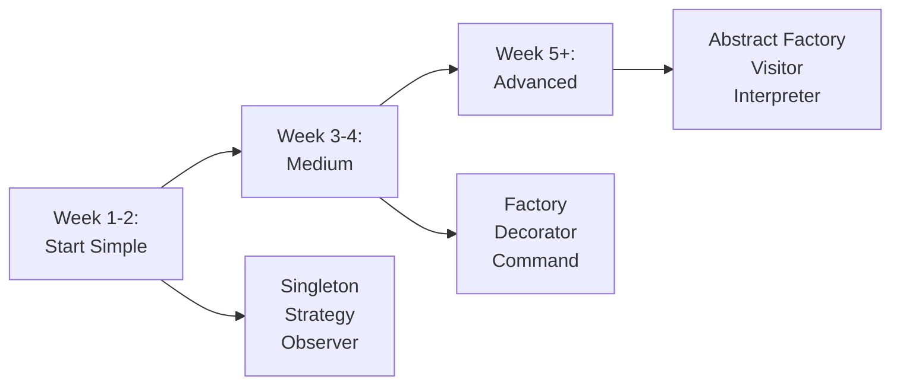
```mermaid
graph LR
    A[Week 1-2:<br/>Start Simple] --> B[Week 3-4:<br/>Medium] --> C[Week 5+:<br/>Advanced]
    
    A --> A1[Singleton<br/>Strategy<br/>Observer]
    B --> B1[Factory<br/>Decorator<br/>Command]
    C --> C1[Abstract Factory<br/>Visitor<br/>Interpreter]
```

**Beginner-Friendly Learning Order:**

1. **Week 1-2: Essential Patterns (Learn First)**
   - **Singleton**: One instance for the whole app (e.g., database connection)
   - **Strategy**: Different ways to do the same thing (e.g., payment methods)
   - **Observer**: Notify multiple objects when something changes (e.g., event listeners)

2. **Week 3-4: Common Patterns (Learn Next)**
   - **Factory**: Create objects without specifying exact class
   - **Decorator**: Add features to objects dynamically
   - **Command**: Encapsulate requests as objects (undo/redo)

3. **Week 5+: Advanced Patterns (Learn Later)**
   - **Abstract Factory**: Create families of related objects
   - **Visitor**: Add operations to objects without changing them
   - **Interpreter**: Create a language interpreter

### Step 4: Practice with Real Examples

**For each pattern you learn:**

1. **Understand the problem** it solves (see bad code example)
2. **Study the solution** (see pattern implementation)
3. **Try it yourself** (build a small example)
4. **Recognize it in the wild** (find it in popular libraries)

### Step 5: Don't Memorize - Understand

**❌ Don't Do This:**
- Memorize UML diagrams without understanding
- Try to use patterns everywhere
- Learn all 23 patterns in one day

**✅ Do This Instead:**
- Understand what problem each pattern solves
- Start with simple patterns you'll use daily
- Practice implementing patterns in small projects
- Recognize when NOT to use a pattern

### Beginner's Checklist

Before moving to the next pattern, make sure you can:

- [ ] Explain the problem the pattern solves in simple words
- [ ] Draw a simple diagram of the pattern
- [ ] Implement the pattern from scratch in your favorite language
- [ ] Give 2-3 real-world examples where this pattern is useful
- [ ] Explain when NOT to use this pattern

---

## History and Evolution

### Timeline

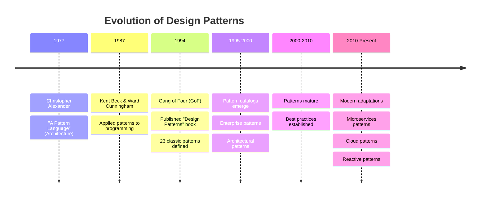
```mermaid
timeline
    title Evolution of Design Patterns
    1977 : Christopher Alexander
           : "A Pattern Language" (Architecture)
    1987 : Kent Beck & Ward Cunningham
           : Applied patterns to programming
    1994 : Gang of Four (GoF)
           : Published "Design Patterns" book
           : 23 classic patterns defined
    1995-2000 : Pattern catalogs emerge
                : Enterprise patterns
                : Architectural patterns
    2000-2010 : Patterns mature
                : Best practices established
    2010-Present : Modern adaptations
                   : Microservices patterns
                   : Cloud patterns
                   : Reactive patterns
```

### The Gang of Four (GoF)

The foundational book that established design patterns in software engineering.

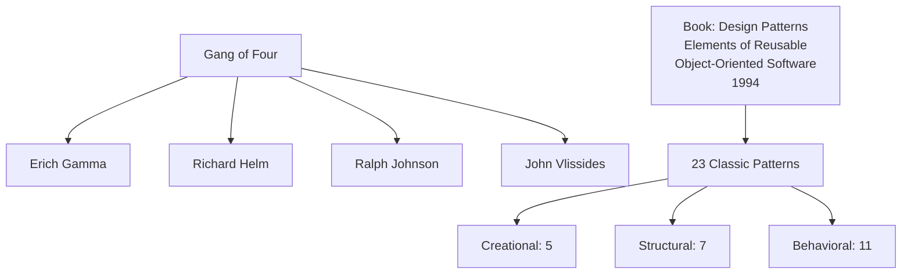
```mermaid
graph TB
    A[Gang of Four] --> B[Erich Gamma]
    A --> C[Richard Helm]
    A --> D[Ralph Johnson]
    A --> E[John Vlissides]
    
    F[Book: Design Patterns<br/>Elements of Reusable<br/>Object-Oriented Software<br/>1994] --> G[23 Classic Patterns]
    
    G --> H[Creational: 5]
    G --> I[Structural: 7]
    G --> J[Behavioral: 11]
```

**The Book's Impact:**

- Standardized pattern terminology
- Established pattern documentation format
- Created common vocabulary for developers
- Influenced entire software industry

### Original 23 Patterns


```mermaid
graph TD
    A[23 GoF Patterns] --> B[Creational: 5]
    A --> C[Structural: 7]
    A --> D[Behavioral: 11]
    
    B --> B1[Singleton]
    B --> B2[Factory Method]
    B --> B3[Abstract Factory]
    B --> B4[Builder]
    B --> B5[Prototype]
    
    C --> C1[Adapter]
    C --> C2[Bridge]
    C --> C3[Composite]
    C --> C4[Decorator]
    C --> C5[Facade]
    C --> C6[Flyweight]
    C --> C7[Proxy]
    
    D --> D1[Chain of Responsibility]
    D --> D2[Command]
    D --> D3[Interpreter]
    D --> D4[Iterator]
    D --> D5[Mediator]
    D --> D6[Memento]
    D --> D7[Observer]
    D --> D8[State]
    D --> D9[Strategy]
    D --> D10[Template Method]
    D --> D11[Visitor]
```

---

## Why Design Patterns?

### The Real-World Problem: Growing Pains in Software

Imagine you're building a house:

**Scenario 1: Without a Blueprint (No Patterns)**
- You start building walls wherever feels right
- Each room uses different types of doors
- Electrical wiring goes in random directions
- When you need to add a new room, you realize nothing is organized
- Maintenance becomes a nightmare

**Scenario 2: With a Blueprint (With Patterns)**
- Walls follow a logical structure
- All doors work the same way
- Electrical system is organized and documented
- Adding a new room is straightforward
- Maintenance is easy because everything is organized

**Software is the same way!** Without patterns, your code becomes a maintenance nightmare.

### The Problem Without Patterns

**Real Example: An E-commerce Order Processing System**

Let's see what happens when we don't use design patterns:

**JavaScript Example - Before Patterns:**

```javascript
// ❌ BAD: No patterns, tightly coupled, hard to maintain
class OrderProcessor {
    processOrder(order) {
        // Validation mixed with business logic
        if (!order.items || order.items.length === 0) {
            throw new Error("No items");
        }
        
        // Payment processing hardcoded
        if (order.paymentMethod === 'credit_card') {
            // Credit card logic
            console.log("Processing credit card...");
            // Imagine 50 lines of credit card code here
        } else if (order.paymentMethod === 'paypal') {
            // PayPal logic
            console.log("Processing PayPal...");
            // Imagine 50 lines of PayPal code here
        } else if (order.paymentMethod === 'crypto') {
            // Crypto logic
            console.log("Processing crypto...");
            // Imagine 50 lines of crypto code here
        }
        // ⚠️ Need to add Apple Pay? Must modify this class!
        // ⚠️ Need to add Google Pay? Must modify this class again!
        
        // Email sending hardcoded
        console.log("Sending email confirmation...");
        
        // Logging hardcoded
        console.log("Order processed");
        
        // 🔴 Problems with this code:
        // 1. Violates Single Responsibility Principle
        // 2. Violates Open/Closed Principle
        // 3. Hard to test (must test everything together)
        // 4. Hard to add new payment methods
        // 5. This class will grow to 500+ lines
    }
}
```

**What happens over time:**
1. **Week 1**: Boss asks to add Apple Pay → modify OrderProcessor (now 250 lines)
2. **Week 2**: Boss asks to add Google Pay → modify OrderProcessor (now 350 lines)
3. **Week 3**: Credit card processing changes → modify OrderProcessor (hope nothing breaks!)
4. **Week 4**: Bug in PayPal → must search through 400 lines to find it
5. **Week 5**: Need to test crypto → must set up entire order processing system

**Result**: Code becomes unmaintainable, testing becomes impossible, bugs multiply!

### With Patterns - Strategy Pattern:**

```javascript
// ✅ GOOD: Using Strategy Pattern
class PaymentStrategy {
    process(amount) {
        throw new Error("Must implement process()");
    }
}

class CreditCardPayment extends PaymentStrategy {
    process(amount) {
        console.log(`Processing credit card payment: $${amount}`);
        return { success: true, transactionId: 'CC123' };
    }
}

class PayPalPayment extends PaymentStrategy {
    process(amount) {
        console.log(`Processing PayPal payment: $${amount}`);
        return { success: true, transactionId: 'PP456' };
    }
}

class CryptoPayment extends PaymentStrategy {
    process(amount) {
        console.log(`Processing crypto payment: $${amount}`);
        return { success: true, transactionId: 'BTC789' };
    }
}

class OrderProcessor {
    #paymentStrategy;
    
    constructor(paymentStrategy) {
        this.#paymentStrategy = paymentStrategy;
    }
    
    setPaymentStrategy(strategy) {
        this.#paymentStrategy = strategy;
    }
    
    processOrder(order) {
        // Clean, focused, easy to extend
        const result = this.#paymentStrategy.process(order.total);
        console.log("Order processed");
        return result;
    }
}

// Easy to add new payment methods without modifying OrderProcessor!
const processor = new OrderProcessor(new CreditCardPayment());
processor.processOrder({ total: 100 });

// Switch payment strategy at runtime
processor.setPaymentStrategy(new PayPalPayment());
processor.processOrder({ total: 200 });
```

**Python Example:**

```python
# ✅ GOOD: Using Strategy Pattern
from abc import ABC, abstractmethod

class PaymentStrategy(ABC):
    @abstractmethod
    def process(self, amount: float) -> dict:
        pass

class CreditCardPayment(PaymentStrategy):
    def process(self, amount: float) -> dict:
        print(f"Processing credit card payment: ${amount}")
        return {'success': True, 'transactionId': 'CC123'}

class PayPalPayment(PaymentStrategy):
    def process(self, amount: float) -> dict:
        print(f"Processing PayPal payment: ${amount}")
        return {'success': True, 'transactionId': 'PP456'}

class CryptoPayment(PaymentStrategy):
    def process(self, amount: float) -> dict:
        print(f"Processing crypto payment: ${amount}")
        return {'success': True, 'transactionId': 'BTC789'}

class OrderProcessor:
    def __init__(self, payment_strategy: PaymentStrategy):
        self._payment_strategy = payment_strategy
    
    def set_payment_strategy(self, strategy: PaymentStrategy):
        self._payment_strategy = strategy
    
    def process_order(self, order: dict) -> dict:
        result = self._payment_strategy.process(order['total'])
        print("Order processed")
        return result

# Usage
processor = OrderProcessor(CreditCardPayment())
processor.process_order({'total': 100})

processor.set_payment_strategy(PayPalPayment())
processor.process_order({'total': 200})
```

---

## Benefits of Design Patterns

Design patterns provide concrete benefits that improve your code and your career. Let's explore each one with real examples.

### 1. Reusability: Write Once, Use Everywhere

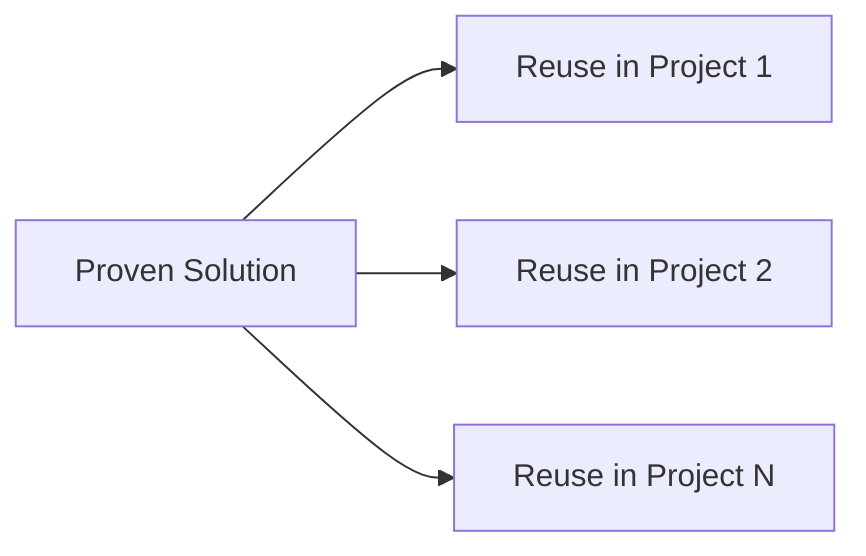
```mermaid
graph LR
    A[Proven Solution] --> B[Reuse in Project 1]
    A --> C[Reuse in Project 2]
    A --> D[Reuse in Project N]
```

**Real Example**: Once you understand the Observer pattern, you can use it in:
- A chat application (notify users of new messages)
- A stock trading app (notify traders of price changes)
- A weather app (notify subscribers of weather updates)
- Any real-time notification system

**The pattern stays the same**, only the details change!

### 2. Common Vocabulary: Speak the Same Language

**Without Patterns (Confusing):**

```text
Developer 1: "So we need a class that... um... makes sure there's only 
             one thing of that type in the whole app, and everyone can 
             get to it from anywhere, and it creates itself the first 
             time someone needs it..."

Developer 2: "Wait, what? Can you repeat that?"

Developer 1: *Spends 10 minutes explaining*
```

**With Patterns (Clear):**

```javascript
Developer 1: "Use Singleton pattern"
Developer 2: "Got it!"  // Conversation done in 2 seconds!

// Both developers immediately understand:
class DatabaseConnection {
    static #instance = null;
    static getInstance() {
        if (!DatabaseConnection.#instance) {
            DatabaseConnection.#instance = new DatabaseConnection();
        }
        return DatabaseConnection.#instance;
    }
}
```

**Time saved**: Hours of meetings and misunderstandings avoided!

### 3. Better Communication: Design Discussions Made Easy

**Without Patterns:**

```text
Team Meeting (45 minutes):
- Developer explains their idea for 15 minutes
- Others ask clarifying questions for 15 minutes
- Draw diagrams on whiteboard for 15 minutes
- Still some confusion remains
```

**With Patterns:**

```text
Team Meeting (5 minutes):
Developer: "I'll use Strategy for payment processing, 
           Observer for notifications, 
           Factory for creating payment objects"
           
Team: "Perfect! That's exactly what we need."
```

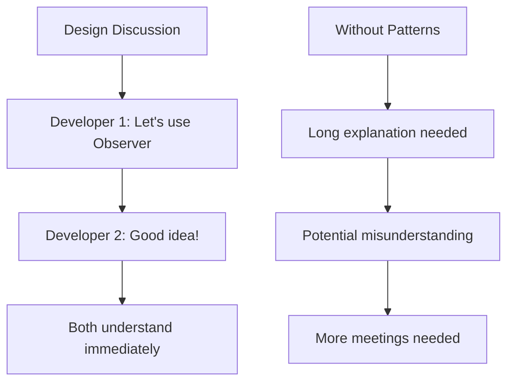
```mermaid
graph TD
    A[Design Discussion] --> B[Developer 1: Let's use Observer]
    B --> C[Developer 2: Good idea!]
    C --> D[Both understand immediately]
    
    E[Without Patterns] --> F[Long explanation needed]
    F --> G[Potential misunderstanding]
    G --> H[More meetings needed]
```

### 4. Proven Solutions: Stand on the Shoulders of Giants

**Why Reinvent the Wheel?**

```javascript
// ❌ You could spend 2 weeks creating your own solution:
// - Research different approaches
// - Make mistakes
// - Fix bugs
// - Realize it's not scalable
// - Start over

// ✅ Or use a proven pattern in 2 hours:
// - Pick the right pattern
// - Implement it correctly
// - Use battle-tested approach
// - Move on to other features
```

**Benefits of Proven Solutions:**
- 🎯 Battle-tested by thousands of developers over 30+ years
- 📚 Well-documented with known trade-offs and limitations
- 🛡️ Fewer bugs because common pitfalls are already known
- 🚀 Faster development - no need to reinvent the wheel
- 💡 Learn from experts' experience

### 5. Code Quality: Better Structure Automatically

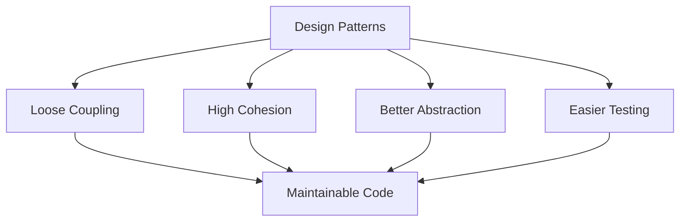
```mermaid
graph TD
    A[Design Patterns] --> B[Loose Coupling]
    A --> C[High Cohesion]
    A --> D[Better Abstraction]
    A --> E[Easier Testing]
    
    B --> F[Maintainable Code]
    C --> F
    D --> F
    E --> F
```

### 6. Faster Development: Save Time and Money

**Time Comparison:**

| Task | Without Patterns | With Patterns | Time Saved |
|------|------------------|---------------|------------|
| Design payment system | 2 weeks (trial & error) | 2 days (use Strategy) | 8 days ⏰ |
| Add undo/redo feature | 1 week (custom solution) | 1 day (use Command) | 4 days ⏰ |
| Event notification system | 10 days (reinvent wheel) | 2 days (use Observer) | 8 days ⏰ |

**Why it's faster:**
- ✅ No need to reinvent the wheel
- ✅ Focus on business logic, not infrastructure
- ✅ Proven architecture decisions already made
- ✅ Less debugging (fewer mistakes)
- ✅ Faster code reviews (everyone knows the pattern)

### 7. Easier Maintenance: Future-Proof Your Code

```javascript
// Scenario: 6 months later, a new developer joins the team

// ❌ Without Patterns:
new Developer(looking at code): "What is this code doing? 
                                I need 3 hours to understand it..."

// ✅ With Patterns:
new Developer(looking at code): "Oh, this is Factory pattern! 
                                I understand it in 5 minutes!"
```

**Maintenance Benefits:**
- 📖 Self-documenting code (pattern name explains purpose)
- 🔍 Easy to find and fix bugs (clean structure)
- ➕ Easy to add features (extensible design)
- 🧪 Easy to test (loosely coupled components)
- 👥 New team members onboard faster

### 8. Career Benefits: Level Up Your Skills

Learning design patterns helps your career:

- 💼 **Better Job Opportunities**: Most senior positions require pattern knowledge
- 💰 **Higher Salary**: Senior developers earn 30-50% more
- 🗣️ **Better Interviews**: Ace technical interviews by speaking the pattern language
- 🌟 **Respected by Peers**: Show professional maturity and experience
- 📈 **Faster Promotions**: Write better code, get promoted faster

---

## When to Use Patterns

### The Golden Rule for Beginners

**Before using ANY pattern, ask yourself these 3 questions:**

1. ❓ **Do I have a recurring problem?** (Not a one-time issue)
2. ❓ **Will the pattern make my code simpler?** (Not more complex)
3. ❓ **Do I understand the pattern well?** (Can you explain it to someone else?)

If **YES** to all three → Use the pattern!
If **NO** to any → Don't force it!

### Decision Tree

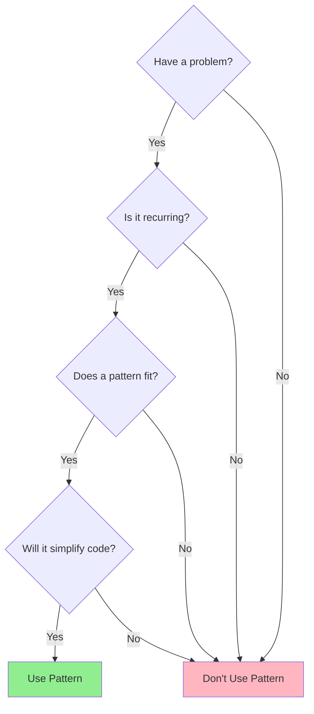
```mermaid
graph TD
    A{Have a problem?} -->|Yes| B{Is it recurring?}
    B -->|Yes| C{Does a pattern fit?}
    C -->|Yes| D{Will it simplify code?}
    D -->|Yes| E[Use Pattern]
    D -->|No| F[Don't Use Pattern]
    C -->|No| F
    B -->|No| F
    A -->|No| F
    
    style E fill:#90EE90
    style F fill:#FFB6C1
```

### Clear Scenarios: When Patterns Are Perfect

#### 1. Multiple Implementations Needed (Use Strategy)

**Problem**: You need different ways to do the same thing.

**Real-World Example**: Payment processing in an e-commerce site
- Today: Credit Card, PayPal
- Tomorrow: Apple Pay, Google Pay
- Next month: Cryptocurrency

```javascript
// ✅ Perfect for Strategy Pattern
class DataExporter {
    constructor(exportStrategy) {
        this.strategy = exportStrategy;
    }
    
    export(data) {
        return this.strategy.export(data);
    }
}

// Easy to add: CSV, JSON, XML, PDF exporters
const csvExporter = new DataExporter(new CSVStrategy());
const jsonExporter = new DataExporter(new JSONStrategy());
const pdfExporter = new DataExporter(new PDFStrategy());
```

**Why Strategy Works Here:**
- ✅ Need to switch between algorithms at runtime
- ✅ Each algorithm is independent
- ✅ Easy to add new exporters without changing existing code

#### 2. Single Instance Required (Use Singleton)

**Problem**: You need exactly ONE instance of something in your entire application.

**Real-World Examples:**
- Database connection pool (one pool for all queries)
- Application configuration (one config for entire app)
- Logger (one log file, not multiple)
- Print spooler (one queue for all print jobs)

```javascript
// ✅ Perfect for Singleton Pattern
class Logger {
    static #instance = null;
    
    static getInstance() {
        if (!Logger.#instance) {
            Logger.#instance = new Logger();
        }
        return Logger.#instance;
    }
    
    log(message) {
        console.log(`[${new Date().toISOString()}] ${message}`);
    }
}

// Everywhere in your code:
const logger = Logger.getInstance();  // Same instance every time
logger.log('User logged in');
```

**Why Singleton Works Here:**
- ✅ Need global access from anywhere
- ✅ Multiple instances would waste resources
- ✅ Need to coordinate all operations through one point

#### 3. Complex Object Creation (Use Builder)

**Problem**: Creating an object requires many optional parameters.

**Real-World Example**: Building a user profile
- Required: username, email
- Optional: phone, address, bio, avatar, preferences, notifications...

```javascript
// ❌ Without Builder (Messy):
const user = new User('john', 'john@email.com', '123-456-7890', 
                      '123 Main St', 'Bio here...', 'avatar.jpg', 
                      {theme: 'dark'}, {email: true, sms: false});
// Which parameter is which? Hard to read!

// ✅ With Builder (Clean):
const user = new UserBuilder()
    .setUsername('john')
    .setEmail('john@email.com')
    .setPhone('123-456-7890')
    .setAddress('123 Main St')
    .setBio('Bio here...')
    .setAvatar('avatar.jpg')
    .setTheme('dark')
    .enableEmailNotifications()
    .build();
// Clear and readable!
```

**Why Builder Works Here:**
- ✅ Many optional parameters (8+ parameters)
- ✅ Makes code readable and self-documenting
- ✅ Easy to add new optional fields later

#### 4. Need to Notify Multiple Objects (Use Observer)

**Problem**: When one thing changes, many others need to know about it.

**Real-World Examples:**
- Stock price changes → notify all traders watching that stock
- New message arrives → notify all open chat windows
- File changes → notify all editors with that file open
- Event happens → notify all registered listeners

```javascript
// ✅ Perfect for Observer Pattern
class StockTicker {
    constructor(symbol) {
        this.symbol = symbol;
        this.price = 0;
        this.observers = [];
    }
    
    subscribe(observer) {
        this.observers.push(observer);
    }
    
    setPrice(newPrice) {
        this.price = newPrice;
        this.notify();  // Tell everyone!
    }
    
    notify() {
        this.observers.forEach(obs => obs.update(this.price));
    }
}

// Usage:
const appleStock = new StockTicker('AAPL');
appleStock.subscribe(mobileApp);      // Gets notifications
appleStock.subscribe(emailAlert);     // Gets notifications
appleStock.subscribe(tradingBot);     // Gets notifications

appleStock.setPrice(150);  // All 3 get notified automatically!
```

**Why Observer Works Here:**
- ✅ One change affects multiple objects
- ✅ Don't know how many subscribers in advance
- ✅ Subscribers can join/leave dynamically

#### 5. Adding Functionality Dynamically (Use Decorator)

**Problem**: Need to add features to objects without changing their code.

**Real-World Example**: Coffee shop customization
- Start with simple coffee
- Add milk → coffee with milk
- Add sugar → coffee with milk and sugar
- Add whip → coffee with milk, sugar, and whipped cream

```javascript
// ✅ Perfect for Decorator Pattern
class Coffee {
    cost() { return 5; }
    description() { return 'Coffee'; }
}

class MilkDecorator {
    constructor(coffee) {
        this.coffee = coffee;
    }
    cost() { return this.coffee.cost() + 2; }
    description() { return this.coffee.description() + ', milk'; }
}

class SugarDecorator {
    constructor(coffee) {
        this.coffee = coffee;
    }
    cost() { return this.coffee.cost() + 1; }
    description() { return this.coffee.description() + ', sugar'; }
}

// Build your custom coffee:
let myCoffee = new Coffee();                    // $5
myCoffee = new MilkDecorator(myCoffee);        // $7
myCoffee = new SugarDecorator(myCoffee);       // $8
console.log(myCoffee.description());  // "Coffee, milk, sugar"
```

**Why Decorator Works Here:**
- ✅ Add features without modifying Coffee class
- ✅ Combine features in any order
- ✅ Easy to add new decorators (WhipDecorator, CaramelDecorator, etc.)

---

## When NOT to Use Patterns

### Important Warning for Beginners ⚠️

**The #1 Mistake**: Trying to use patterns everywhere!

```text
Junior Developer Mindset:
"I just learned 23 design patterns! 
 Let me use ALL of them in this 100-line project!"

Result: 
- 500 lines of code doing what 100 lines could do
- Nobody can understand the code
- Boss is confused
- Team is frustrated
```

### The Golden Rule: KISS (Keep It Simple, Stupid)

**Use patterns to make code SIMPLER, not MORE COMPLEX!**

### Anti-Patterns: Overusing Patterns

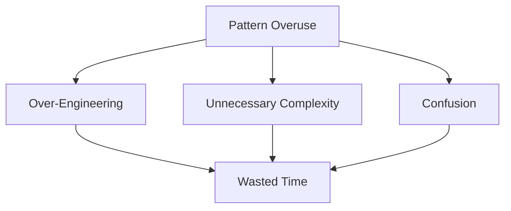
```mermaid
graph TD
    A[Pattern Overuse] --> B[Over-Engineering]
    A --> C[Unnecessary Complexity]
    A --> D[Confusion]
    
    B --> E[Wasted Time]
    C --> E
    D --> E
```

### 1. Simple Problems

```javascript
// ❌ BAD: Overkill for simple addition
class AdditionStrategy {
    execute(a, b) { return a + b; }
}

class Calculator {
    constructor(strategy) {
        this.strategy = strategy;
    }
    add(a, b) {
        return this.strategy.execute(a, b);
    }
}

// ✅ GOOD: Just do it simply!
function add(a, b) {
    return a + b;
}
```

### 2. Unique Problems

```text
If the problem only occurs once in your codebase,
a pattern might be overkill. Don't force patterns
where they don't fit!
```

### 3. Performance Critical Code

    D --> E
    
    E --> F[Failed Project]
    E --> G[Frustrated Team]
```

### Clear Examples: When Patterns Are WRONG

#### 1. Simple Problems (Don't Overcomplicate!)

**Problem**: You need to add two numbers.

```javascript
// ❌ BAD: Overkill! Don't do this!
class AdditionStrategy {
    execute(a, b) {
        return a + b;
    }
}

class SubtractionStrategy {
    execute(a, b) {
        return a - b;
    }
}

class Calculator {
    constructor(strategy) {
        this.strategy = strategy;
    }
    
    calculate(a, b) {
        return this.strategy.execute(a, b);
    }
}

// Usage (unnecessarily complex):
const calc = new Calculator(new AdditionStrategy());
const result = calc.calculate(2, 3);  // Returns 5

// 🔴 This is ridiculous! You wrote 20 lines to add 2 numbers!

// ✅ GOOD: Just do it simply!
function add(a, b) {
    return a + b;
}

const result = add(2, 3);  // Returns 5
// Only 1 line! Clear and simple!
```

**Lesson**: If your problem is simple, keep the solution simple!

#### 2. Unique, One-Time Problems

**Problem**: You need to validate a form once in your entire application.

```javascript
// ❌ BAD: Creating entire validation framework for one form
class ValidationStrategy {
    validate(value) {
        throw new Error('Implement validate()');
    }
}

class EmailValidation extends ValidationStrategy {
    // ... 20 lines of code
}

class FormValidator {
    // ... 30 lines of code
}

// ✅ GOOD: Simple validation for one form
function validateEmail(email) {
    return email.includes('@') && email.includes('.');
}

if (!validateEmail(userEmail)) {
    console.log('Invalid email');
}
```

**Lesson**: If you're solving a problem that appears only once, don't build an elaborate pattern around it!

#### 3. Performance-Critical Code

**Problem**: Image processing that must run in real-time (60 FPS).

```javascript
// ❌ BAD: Using patterns that add overhead
class ImageProcessor {
    constructor() {
        this.filters = []; // Array of filter objects
    }
    
    addFilter(filter) {
        this.filters.push(filter);  // Creating many objects
    }
    
    process(image) {
        // Loop through all filter objects
        this.filters.forEach(filter => {
            image = filter.apply(image);  // Virtual function calls
        });
        return image;
    }
}
// Each frame: Create objects, virtual calls, overhead
// Result: Slow! Only 20 FPS instead of 60!

// ✅ GOOD: Direct, optimized code
function processImage(image) {
    // Direct function calls, no object creation
    image = applyBrightness(image);
    image = applyContrast(image);
    image = applySharpness(image);
    return image;
}
// Result: Fast! Runs at 60 FPS!
```

**Lesson**: In performance-critical code, measure first! Patterns can add overhead.

#### 4. Small Projects (100 Lines or Less)

**Scenario**: A simple CLI tool to rename files.

```javascript
// ❌ BAD: Full enterprise architecture for tiny script
class FileSystemFacade {
    // ... 50 lines
}

class FileRenamerFactory {
    // ... 30 lines
}

class RenameStrategy {
    // ... 40 lines
}

// Total: 120 lines to rename a file!

// ✅ GOOD: Keep it simple
const fs = require('fs');

function renameFiles(oldName, newName) {
    fs.rename(oldName, newName, (err) => {
        if (err) console.log(err);
        else console.log('File renamed!');
    });
}

// Total: 8 lines. Done!
```

**Lesson**: For small projects (scripts, utilities, prototypes), simple code is better!

#### 5. When You Don't Understand the Pattern

**Danger Zone ⚠️:**

```javascript
// ❌ BAD: Using a pattern you don't understand
// Developer thinks: "Abstract Factory sounds cool! I'll use it!"

class AbstractWidgetFactory {
    // ... copied from internet, don't understand it
}

class ConcreteWidgetFactory extends AbstractWidgetFactory {
    // ... cargo cult programming
}

// 3 days later...
// Developer: "Why is this not working? What does this even do?"
// Team: "We can't maintain this code!"
// Project: *fails*
```

**The Right Approach:**

1. **Learn** the pattern thoroughly
2. **Understand** the problem it solves
3. **Practice** on small examples
4. **Then** use it in your project

**Lesson**: Never use a pattern just because it sounds sophisticated!

### How to Know If You're Overusing Patterns

**Warning Signs 🚨:**

1. **Complexity Increased**: Your code is harder to understand than before
2. **Team Confused**: Your teammates ask "Why did you do it this way?"
3. **Time Wasted**: You spent more time on architecture than on features
4. **Can't Explain**: You can't explain why you chose that pattern in 2 sentences
5. **Maintenance Hard**: Adding a simple feature requires changing 10 files

**If you see these signs, STOP and simplify!**

### The Right Mindset

```text
❌ WRONG Mindset:
"I know 23 patterns! Let me use as many as possible!"

✅ RIGHT Mindset:
"I know 23 patterns. Let me use only the ones that 
 make my code simpler and solve real problems."
```

**Remember**: The best code is the simplest code that works!

---

## Pattern Selection Guide

### Beginner's Decision Framework

**Step 1: Identify the Core Problem**

Ask yourself: *"What exactly is the problem I'm trying to solve?"*

Examples:
- "I need different payment methods" → Multiple algorithms
- "I need to notify users when price changes" → Event notification
- "I need exactly one database connection" → Single instance
- "Object creation is too complex" → Complex construction

**Step 2: Match Problem to Pattern Category**

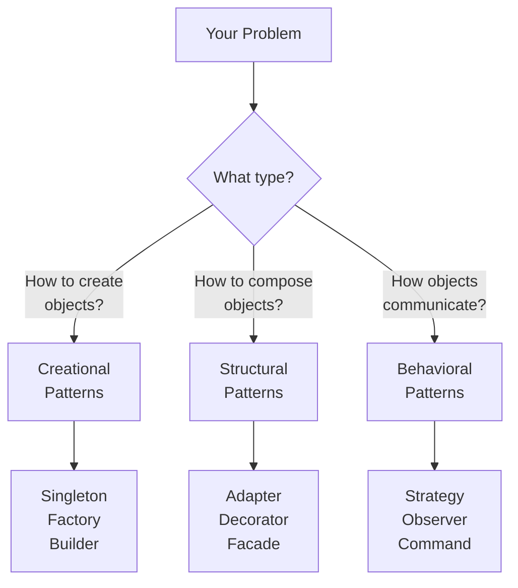
```mermaid
graph TD
    A[Your Problem] --> B{What type?}
    
    B -->|How to create<br/>objects?| C[Creational<br/>Patterns]
    B -->|How to compose<br/>objects?| D[Structural<br/>Patterns]
    B -->|How objects<br/>communicate?| E[Behavioral<br/>Patterns]
    
    C --> C1[Singleton<br/>Factory<br/>Builder]
    D --> D1[Adapter<br/>Decorator<br/>Facade]
    E --> E1[Strategy<br/>Observer<br/>Command]
```

**Step 3: Verify It's the Right Choice**

Before implementing, answer these questions:

- ❓ Does this pattern actually solve my specific problem?
- ❓ Will it make my code simpler (not more complex)?
- ❓ Can I explain to a teammate why I chose this pattern?
- ❓ Is this problem recurring (or a one-time issue)?

If **YES** to all → Implement the pattern!
If **NO** to any → Consider a simpler solution!

### Common Problem-Pattern Mapping

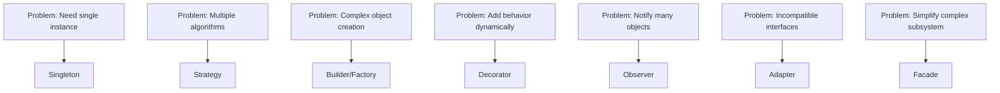
```mermaid
graph TD
    A[Problem: Need single instance] --> B[Singleton]
    C[Problem: Multiple algorithms] --> D[Strategy]
    E[Problem: Complex object creation] --> F[Builder/Factory]
    G[Problem: Add behavior dynamically] --> H[Decorator]
    I[Problem: Notify many objects] --> J[Observer]
    K[Problem: Incompatible interfaces] --> L[Adapter]
    M[Problem: Simplify complex subsystem] --> N[Facade]
```

### Quick Reference: Problem → Pattern

**Use this table to quickly find the right pattern:**

| Your Problem | Best Pattern | Why? |
|-------------|--------------|------|
| Need exactly ONE instance globally | **Singleton** | Ensures single instance, global access |
| Need different ways to do same thing | **Strategy** | Interchangeable algorithms |
| Need to notify many objects of changes | **Observer** | One-to-many notification |
| Need to undo/redo operations | **Command** | Encapsulates requests as objects |
| Object has 5+ optional parameters | **Builder** | Clean, readable object construction |
| Behavior changes based on state | **State** | State-dependent behavior |
| Need to wrap legacy code | **Adapter** | Makes incompatible interfaces work |
| Need to add features without modifying class | **Decorator** | Dynamically add responsibilities |

### Selection Matrix (Complete)

| Problem | Pattern | Category |
|---------|---------|----------|
| One instance globally | Singleton | Creational |
| Create object families | Abstract Factory | Creational |
| Build complex objects | Builder | Creational |
| Clone existing objects | Prototype | Creational |
| Flexible object creation | Factory Method | Creational |
| Make interfaces compatible | Adapter | Structural |
| Add responsibilities dynamically | Decorator | Structural |
| Simplify complex interfaces | Facade | Structural |
| Tree structures | Composite | Structural |
| Multiple algorithms | Strategy | Behavioral |
| Event notification | Observer | Behavioral |
| State-dependent behavior | State | Behavioral |
| Encapsulate requests | Command | Behavioral |

---

## Common Misconceptions

### Myth 1: "Patterns Make Code Better"

```text
❌ WRONG: Patterns automatically improve code
✅ RIGHT: Appropriate patterns, properly applied, improve code
```

### Myth 2: "Always Use Patterns"

```text
❌ WRONG: Every problem needs a pattern
✅ RIGHT: Use patterns when they genuinely solve your problem
```

### Myth 3: "Patterns Are Rules"

```text
❌ WRONG: Must follow pattern exactly as defined
✅ RIGHT: Patterns are guidelines, adapt to your needs
```

### Myth 4: "More Patterns = Better Code"

```text
❌ WRONG: Using many patterns shows expertise
✅ RIGHT: Using appropriate patterns shows expertise
```

### Myth 5: "Patterns Are for Large Projects Only"

```text
❌ WRONG: Patterns only useful in enterprise apps
✅ RIGHT: Patterns useful wherever they solve problems
```

---

## Getting Started - Your First Pattern

Let's walk through implementing your very first design pattern step-by-step. We'll use the **Singleton pattern** because it's simple and commonly used.

### The Problem: Too Many Database Connections

Imagine your application creates a new database connection every time it needs to query data:

```javascript
// ❌ Problem: Creating multiple connections wastes resources
class Database {
    constructor() {
        console.log('Creating new database connection...');
        // Expensive setup: connect to server, authenticate, etc.
    }
    
    query(sql) {
        console.log(`Executing: ${sql}`);
    }
}

// Different parts of your application:
const db1 = new Database();  // Connection 1
db1.query('SELECT * FROM users');

const db2 = new Database();  // Connection 2 (unnecessary!)
db2.query('SELECT * FROM products');

const db3 = new Database();  // Connection 3 (wasteful!)
db3.query('SELECT * FROM orders');

// Output:
// Creating new database connection...
// Executing: SELECT * FROM users
// Creating new database connection...
// Executing: SELECT * FROM products
// Creating new database connection...
// Executing: SELECT * FROM orders

// 🔴 Problem: We created 3 connections when we only need 1!
```

### The Solution: Singleton Pattern

**Step 1: Understand the Concept**
- We want **only ONE instance** of Database class
- Everyone uses that **same instance**
- The class itself **controls** instance creation

**Step 2: Implement the Pattern**

```javascript
// ✅ Solution: Singleton Pattern
class Database {
    // Step 1: Store the single instance as a private static field
    static #instance = null;
    
    // Step 2: Make constructor private-like (in JavaScript, we check in getInstance)
    constructor() {
        // Prevent multiple instances
        if (Database.#instance) {
            throw new Error('Use Database.getInstance() instead of new Database()');
        }
        console.log('Creating THE database connection...');
        // Expensive setup happens only once
    }
    
    // Step 3: Provide public static method to get the instance
    static getInstance() {
        // Create instance only if it doesn't exist
        if (!Database.#instance) {
            Database.#instance = new Database();
        }
        // Always return the same instance
        return Database.#instance;
    }
    
    // Regular methods
    query(sql) {
        console.log(`Executing: ${sql}`);
    }
}

// Step 4: Use the Singleton
const db1 = Database.getInstance();  // Creates the one instance
db1.query('SELECT * FROM users');

const db2 = Database.getInstance();  // Returns same instance
db2.query('SELECT * FROM products');

const db3 = Database.getInstance();  // Returns same instance
db3.query('SELECT * FROM orders');

// Output:
// Creating THE database connection...
// Executing: SELECT * FROM users
// Executing: SELECT * FROM products
// Executing: SELECT * FROM orders

// ✅ Success: Only 1 connection created and shared!

// Verify they're the same instance
console.log(db1 === db2);  // true
console.log(db2 === db3);  // true
```

### Step 3: Understand What We Gained

**Before (No Pattern):**
- 🔴 Created 3 separate database connections
- 🔴 Wasted resources (memory, network connections)
- 🔴 Hard to manage and coordinate

**After (With Singleton):**
- ✅ Only 1 database connection created
- ✅ Efficient resource usage
- ✅ Easy to manage - one instance
- ✅ Consistent state across the application

### Step 4: Practice Exercise

**Try it yourself!** Implement a Singleton for a configuration manager:

```javascript
// TODO: Implement a Singleton ConfigManager that:
// 1. Stores application configuration (like API keys, URLs)
// 2. Ensures only one instance exists
// 3. Provides global access to configuration

class ConfigManager {
    // Your code here!
}

// Test your implementation:
const config1 = ConfigManager.getInstance();
config1.set('apiKey', 'abc123');

const config2 = ConfigManager.getInstance();
console.log(config2.get('apiKey'));  // Should print: abc123

console.log(config1 === config2);  // Should print: true
```

### Step 5: When You've Mastered Your First Pattern

**Congratulations!** You've learned your first design pattern. Now:

1. ✅ Practice with 2-3 more examples
2. ✅ Read the [Creational Patterns](./creational-patterns.md) guide
3. ✅ Try implementing the **Strategy pattern** next (it's also beginner-friendly)
4. ✅ Look for Singleton pattern in code you read (frameworks, libraries)

**Remember**: You don't need to learn all patterns at once. Master one, use it in a project, then move to the next!

---

## Interview Questions

### Q1: What is a design pattern?

**Answer**: A design pattern is a proven, reusable solution to a commonly occurring problem in software design. It's a template or guideline that can be adapted to solve similar problems in different contexts, promoting best practices and improving code quality.

### Q2: Why are design patterns important?

**Answer**: Design patterns are important because they:

1. Provide proven solutions to common problems
2. Create a common vocabulary for developers
3. Improve code quality and maintainability
4. Speed up development by avoiding reinventing solutions
5. Help in making informed design decisions

### Q3: What are the main categories of design patterns?

**Answer**: The three main categories are:

1. **Creational**: Concerned with object creation (Singleton, Factory, Builder, Prototype, Abstract Factory)
2. **Structural**: Concerned with object composition (Adapter, Decorator, Facade, Composite, Proxy, Bridge, Flyweight)
3. **Behavioral**: Concerned with communication between objects (Strategy, Observer, Command, State, Template Method, etc.)

### Q4: When should you NOT use design patterns?

**Answer**: Avoid patterns when:

- The problem is simple and doesn't need the complexity
- It's a one-time unique problem
- Performance is critical and the pattern adds overhead
- The project is very small
- You don't fully understand the pattern
- Forcing a pattern where it doesn't fit

### Q5: What's the difference between Strategy and State patterns?

**Answer**:

- **Strategy**: Different algorithms for the same task, chosen externally
- **State**: Different behaviors based on internal state, transitions automatically

Both use similar structure but different intent and context.

### Q6: Is Singleton considered an anti-pattern?

**Answer**: Singleton is controversial because:

- **Pros**: Ensures single instance, global access point
- **Cons**: Global state, testing difficulties, tight coupling
- **Verdict**: Not an anti-pattern, but use carefully. Consider dependency injection as an alternative.

### Q7: Can you combine multiple patterns?

**Answer**: Yes! Patterns are often used together:

- Factory + Singleton: Factory that returns singleton instances
- Strategy + Factory: Factory creates different strategies
- Observer + Mediator: For complex event systems
- Decorator + Factory: Factory creates decorated objects

### Q8: How do design patterns relate to SOLID principles?

**Answer**: Design patterns implement SOLID principles:

- Strategy implements Open/Closed Principle
- Dependency Injection implements Dependency Inversion
- Adapter implements Interface Segregation
- Observer implements Open/Closed Principle
- Decorator implements Open/Closed Principle

---

## Summary

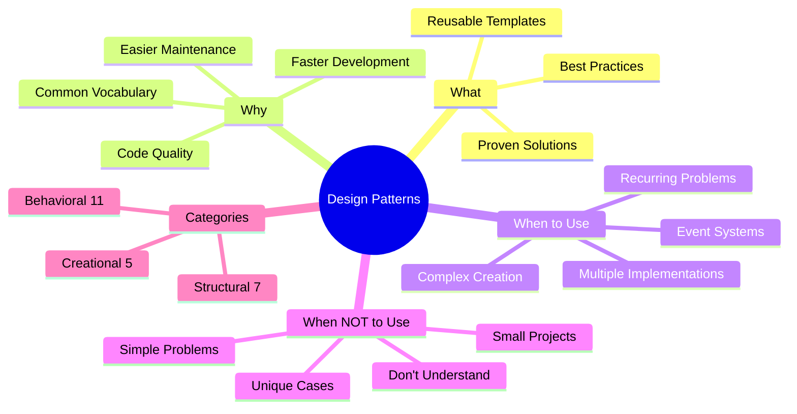
```mermaid
mindmap
  root((Design Patterns))
    What
      Proven Solutions
      Reusable Templates
      Best Practices
    Why
      Common Vocabulary
      Code Quality
      Faster Development
      Easier Maintenance
    When to Use
      Recurring Problems
      Multiple Implementations
      Complex Creation
      Event Systems
    When NOT to Use
      Simple Problems
      Unique Cases
      Small Projects
      Don't Understand
    Categories
      Creational 5
      Structural 7
      Behavioral 11
```

---

## Next Steps

1. **Study**: [Design Pattern Classification](./design-patterns-classification.md)
2. **Study**: [Creational Patterns](./creational-patterns.md)
3. **Study**: [Structural Patterns](./structural-patterns.md)
4. **Study**: [Behavioral Patterns](./behavioral-patterns.md)
5. **Practice**: Identify patterns in codebases you use
6. **Exercise**: Refactor code to use appropriate patterns

---

## Resources

- **Book**: "Design Patterns: Elements of Reusable Object-Oriented Software" by Gang of Four
- **Website**: Refactoring.Guru (<https://refactoring.guru/design-patterns>)
- **Practice**: Implement each pattern in small projects

---

**Key Takeaway**: Design patterns are tools in your toolbox, not rules to follow blindly. Learn them, understand when to use them, but also when NOT to use them. The goal is better software, not more patterns!

**Remember**:

- Patterns solve problems, they don't create architecture
- Simple solutions are often better than pattern-heavy ones
- Understand the problem before applying a pattern
- Don't force patterns where they don't belong
