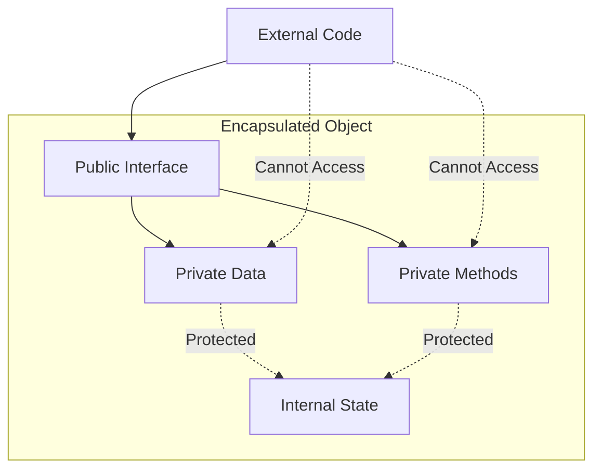
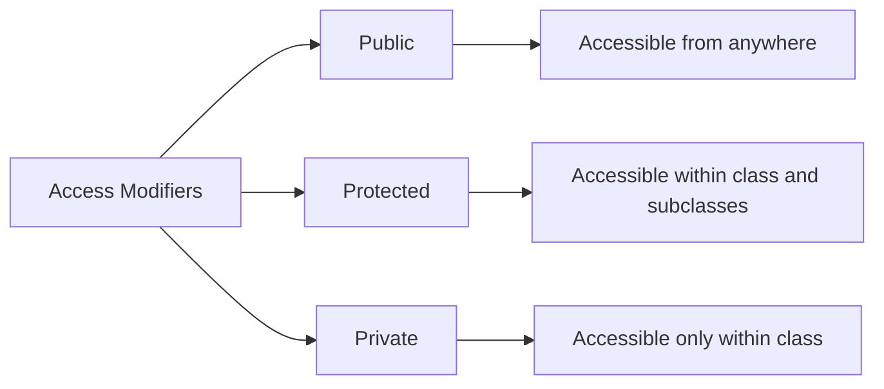
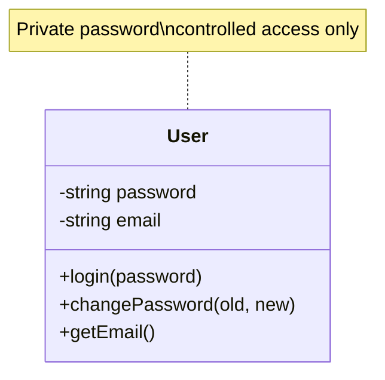
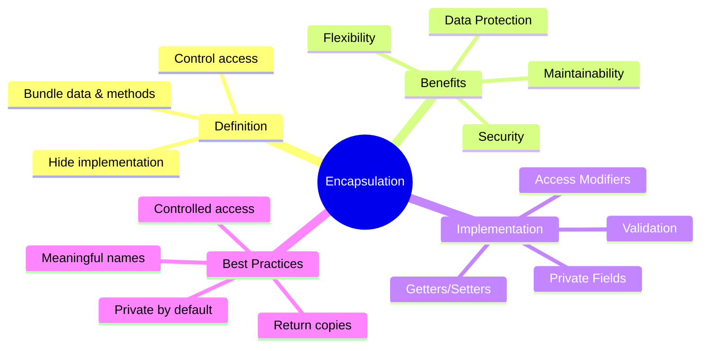

# Encapsulation

**Purpose**: Master the concept of encapsulation - bundling data and methods together while controlling access to protect the internal state of objects.

---

## Table of Contents

1. [What is Encapsulation?](#what-is-encapsulation)
2. [Why Encapsulation?](#why-encapsulation)
3. [Access Modifiers](#access-modifiers)
4. [Data Hiding](#data-hiding)
5. [Getters and Setters](#getters-and-setters)
6. [Real-World Examples](#real-world-examples)
7. [Best Practices](#best-practices)
8. [Common Mistakes](#common-mistakes)
9. [Interview Questions](#interview-questions)

---

## What is Encapsulation?

**Encapsulation** is the bundling of data (attributes) and methods (functions) that operate on that data into a single unit (class), while restricting direct access to some of the object's components.

### Key Definition

> Encapsulation is the mechanism of wrapping data and code acting on the data together as a single unit, and controlling access to that data through well-defined interfaces.

### Visual Representation



---

## Why Encapsulation?

### 1. **Data Protection**

Prevent unauthorized or unintended access to data.

### 2. **Maintainability**

Internal implementation can be changed without affecting external code.

### 3. **Flexibility**

Add validation, logging, or other logic when accessing data.

### 4. **Security**

Hide sensitive information from outside access.

### Problem Without Encapsulation

```javascript
// ❌ BAD: No Encapsulation
class BankAccount {
    constructor(balance) {
        this.balance = balance; // Public, can be directly modified
    }
}

const account = new BankAccount(1000);
account.balance = -500; // 😱 Direct manipulation! Negative balance!
console.log(account.balance); // -500 (Invalid state)
```

```python
# ❌ BAD: No Encapsulation
class BankAccount:
    def __init__(self, balance):
        self.balance = balance  # Public, can be directly modified

account = BankAccount(1000)
account.balance = -500  # 😱 Direct manipulation! Negative balance!
print(account.balance)  # -500 (Invalid state)
```

### Solution With Encapsulation

```javascript
// ✅ GOOD: With Encapsulation
class BankAccount {
    #balance; // Private field
    
    constructor(initialBalance) {
        if (initialBalance < 0) {
            throw new Error("Initial balance cannot be negative");
        }
        this.#balance = initialBalance;
    }
    
    deposit(amount) {
        if (amount <= 0) {
            throw new Error("Deposit amount must be positive");
        }
        this.#balance += amount;
        return this.#balance;
    }
    
    withdraw(amount) {
        if (amount <= 0) {
            throw new Error("Withdrawal amount must be positive");
        }
        if (amount > this.#balance) {
            throw new Error("Insufficient funds");
        }
        this.#balance -= amount;
        return this.#balance;
    }
    
    getBalance() {
        return this.#balance;
    }
}

const account = new BankAccount(1000);
// account.#balance = -500; // ❌ Error: Cannot access private field
account.withdraw(200); // ✅ Controlled access with validation
console.log(account.getBalance()); // 800
```

```python
# ✅ GOOD: With Encapsulation
class BankAccount:
    def __init__(self, initial_balance):
        if initial_balance < 0:
            raise ValueError("Initial balance cannot be negative")
        self.__balance = initial_balance  # Private attribute
    
    def deposit(self, amount):
        if amount <= 0:
            raise ValueError("Deposit amount must be positive")
        self.__balance += amount
        return self.__balance
    
    def withdraw(self, amount):
        if amount <= 0:
            raise ValueError("Withdrawal amount must be positive")
        if amount > self.__balance:
            raise ValueError("Insufficient funds")
        self.__balance -= amount
        return self.__balance
    
    def get_balance(self):
        return self.__balance

account = BankAccount(1000)
# account.__balance = -500  # ❌ Won't directly modify private attribute
account.withdraw(200)  # ✅ Controlled access with validation
print(account.get_balance())  # 800
```

---

## Access Modifiers

### Access Levels



### JavaScript Access Modifiers

```javascript
class Example {
    publicField = "I'm public";    // Public
    _protectedField = "I'm protected"; // Convention: protected
    #privateField = "I'm private";     // Private (ES2022+)
    
    constructor() {
        console.log(this.publicField);    // ✅ Accessible
        console.log(this._protectedField); // ✅ Accessible
        console.log(this.#privateField);   // ✅ Accessible
    }
    
    publicMethod() {
        return "Public method";
    }
    
    _protectedMethod() {
        return "Protected method (by convention)";
    }
    
    #privateMethod() {
        return "Private method";
    }
}

const obj = new Example();
console.log(obj.publicField);    // ✅ Accessible
console.log(obj._protectedField); // ⚠️ Accessible (but shouldn't be used)
// console.log(obj.#privateField); // ❌ Error: Private field
```

### Python Access Modifiers

```python
class Example:
    def __init__(self):
        self.public_field = "I'm public"        # Public
        self._protected_field = "I'm protected" # Protected (by convention)
        self.__private_field = "I'm private"    # Private (name mangling)
    
    def public_method(self):
        return "Public method"
    
    def _protected_method(self):
        return "Protected method (by convention)"
    
    def __private_method(self):
        return "Private method"

obj = Example()
print(obj.public_field)      # ✅ Accessible
print(obj._protected_field)  # ⚠️ Accessible (but shouldn't be used)
# print(obj.__private_field) # ❌ AttributeError
print(obj._Example__private_field)  # ⚠️ Accessible via name mangling (not recommended)
```

### Comparison Table

| Modifier | JavaScript | Python | Access Level |
|----------|------------|--------|--------------|
| **Public** | `field` | `field` | Everywhere |
| **Protected** | `_field` (convention) | `_field` (convention) | Class + subclasses |
| **Private** | `#field` (ES2022+) | `__field` (name mangling) | Class only |

---

## Data Hiding

### Concept

Hide the internal state and require all interaction to be performed through an object's methods.



### Example: User Authentication

**JavaScript:**

```javascript
class User {
    #password;
    #email;
    #isLoggedIn = false;
    
    constructor(email, password) {
        this.#email = email;
        this.#setPassword(password);
    }
    
    #setPassword(password) {
        // Validation logic
        if (password.length < 8) {
            throw new Error("Password must be at least 8 characters");
        }
        // In real app, hash the password
        this.#password = this.#hashPassword(password);
    }
    
    #hashPassword(password) {
        // Simplified hashing (use bcrypt in production)
        return `hashed_${password}`;
    }
    
    #verifyPassword(inputPassword) {
        return this.#hashPassword(inputPassword) === this.#password;
    }
    
    login(password) {
        if (this.#verifyPassword(password)) {
            this.#isLoggedIn = true;
            console.log(`${this.#email} logged in successfully`);
            return true;
        }
        throw new Error("Invalid password");
    }
    
    logout() {
        this.#isLoggedIn = false;
        console.log("Logged out");
    }
    
    changePassword(oldPassword, newPassword) {
        if (!this.#isLoggedIn) {
            throw new Error("Must be logged in to change password");
        }
        if (!this.#verifyPassword(oldPassword)) {
            throw new Error("Invalid old password");
        }
        this.#setPassword(newPassword);
        console.log("Password changed successfully");
    }
    
    getEmail() {
        return this.#email;
    }
    
    isAuthenticated() {
        return this.#isLoggedIn;
    }
}

// Usage
const user = new User("alice@example.com", "SecurePass123");
user.login("SecurePass123");
console.log(user.getEmail()); // alice@example.com
user.changePassword("SecurePass123", "NewSecure456");
// user.#password; // ❌ Error: Cannot access private field
```

**Python:**

```python
class User:
    def __init__(self, email, password):
        self.__email = email
        self.__is_logged_in = False
        self.__set_password(password)
    
    def __set_password(self, password):
        # Validation logic
        if len(password) < 8:
            raise ValueError("Password must be at least 8 characters")
        # In real app, hash the password
        self.__password = self.__hash_password(password)
    
    def __hash_password(self, password):
        # Simplified hashing (use bcrypt in production)
        return f"hashed_{password}"
    
    def __verify_password(self, input_password):
        return self.__hash_password(input_password) == self.__password
    
    def login(self, password):
        if self.__verify_password(password):
            self.__is_logged_in = True
            print(f"{self.__email} logged in successfully")
            return True
        raise ValueError("Invalid password")
    
    def logout(self):
        self.__is_logged_in = False
        print("Logged out")
    
    def change_password(self, old_password, new_password):
        if not self.__is_logged_in:
            raise ValueError("Must be logged in to change password")
        if not self.__verify_password(old_password):
            raise ValueError("Invalid old password")
        self.__set_password(new_password)
        print("Password changed successfully")
    
    def get_email(self):
        return self.__email
    
    def is_authenticated(self):
        return self.__is_logged_in

# Usage
user = User("alice@example.com", "SecurePass123")
user.login("SecurePass123")
print(user.get_email())  # alice@example.com
user.change_password("SecurePass123", "NewSecure456")
# user.__password  # ❌ AttributeError
```

---

## Getters and Setters

### Purpose

Provide controlled access to private data with validation and business logic.

### Benefits

1. **Validation**: Ensure data integrity
2. **Flexibility**: Change internal representation without affecting external code
3. **Computed Properties**: Calculate values on-the-fly
4. **Side Effects**: Add logging, notifications, etc.

### JavaScript Getters and Setters

```javascript
class Temperature {
    #celsius;
    
    constructor(celsius = 0) {
        this.celsius = celsius; // Uses setter
    }
    
    // Getter
    get celsius() {
        return this.#celsius;
    }
    
    // Setter with validation
    set celsius(value) {
        if (typeof value !== 'number') {
            throw new Error("Temperature must be a number");
        }
        if (value < -273.15) {
            throw new Error("Temperature below absolute zero");
        }
        this.#celsius = value;
    }
    
    // Computed property
    get fahrenheit() {
        return (this.#celsius * 9/5) + 32;
    }
    
    set fahrenheit(value) {
        this.celsius = (value - 32) * 5/9; // Uses celsius setter
    }
    
    get kelvin() {
        return this.#celsius + 273.15;
    }
    
    set kelvin(value) {
        this.celsius = value - 273.15; // Uses celsius setter
    }
}

// Usage
const temp = new Temperature(25);
console.log(`${temp.celsius}°C`);       // 25°C
console.log(`${temp.fahrenheit}°F`);    // 77°F
console.log(`${temp.kelvin}K`);         // 298.15K

temp.fahrenheit = 100;
console.log(`${temp.celsius}°C`);       // 37.78°C

// temp.celsius = -300; // ❌ Error: Temperature below absolute zero
```

### Python Properties

```python
class Temperature:
    def __init__(self, celsius=0):
        self.celsius = celsius  # Uses setter
    
    @property
    def celsius(self):
        return self.__celsius
    
    @celsius.setter
    def celsius(self, value):
        if not isinstance(value, (int, float)):
            raise ValueError("Temperature must be a number")
        if value < -273.15:
            raise ValueError("Temperature below absolute zero")
        self.__celsius = value
    
    @property
    def fahrenheit(self):
        return (self.__celsius * 9/5) + 32
    
    @fahrenheit.setter
    def fahrenheit(self, value):
        self.celsius = (value - 32) * 5/9  # Uses celsius setter
    
    @property
    def kelvin(self):
        return self.__celsius + 273.15
    
    @kelvin.setter
    def kelvin(self, value):
        self.celsius = value - 273.15  # Uses celsius setter

# Usage
temp = Temperature(25)
print(f"{temp.celsius}°C")      # 25°C
print(f"{temp.fahrenheit}°F")   # 77°F
print(f"{temp.kelvin}K")        # 298.15K

temp.fahrenheit = 100
print(f"{temp.celsius}°C")      # 37.78°C

# temp.celsius = -300  # ❌ ValueError: Temperature below absolute zero
```

---

## Real-World Examples

### Example 1: Shopping Cart

```javascript
class ShoppingCart {
    #items = [];
    #maxItems = 50;
    
    addItem(product, quantity = 1) {
        if (this.#items.length >= this.#maxItems) {
            throw new Error(`Cart limit of ${this.#maxItems} items reached`);
        }
        
        const existingItem = this.#items.find(item => item.product.id === product.id);
        
        if (existingItem) {
            existingItem.quantity += quantity;
        } else {
            this.#items.push({ product, quantity });
        }
    }
    
    removeItem(productId) {
        this.#items = this.#items.filter(item => item.product.id !== productId);
    }
    
    updateQuantity(productId, newQuantity) {
        if (newQuantity <= 0) {
            this.removeItem(productId);
            return;
        }
        
        const item = this.#items.find(item => item.product.id === productId);
        if (item) {
            item.quantity = newQuantity;
        }
    }
    
    getTotal() {
        return this.#items.reduce((total, item) => {
            return total + (item.product.price * item.quantity);
        }, 0);
    }
    
    getItemCount() {
        return this.#items.reduce((count, item) => count + item.quantity, 0);
    }
    
    getItems() {
        // Return copy to prevent external modification
        return JSON.parse(JSON.stringify(this.#items));
    }
    
    clear() {
        this.#items = [];
    }
}

// Usage
const cart = new ShoppingCart();
cart.addItem({ id: 1, name: "Book", price: 20 }, 2);
cart.addItem({ id: 2, name: "Pen", price: 5 }, 5);

console.log(`Total: $${cart.getTotal()}`);        // Total: $65
console.log(`Items: ${cart.getItemCount()}`);     // Items: 7
```

```python
class ShoppingCart:
    def __init__(self):
        self.__items = []
        self.__max_items = 50
    
    def add_item(self, product, quantity=1):
        if len(self.__items) >= self.__max_items:
            raise ValueError(f"Cart limit of {self.__max_items} items reached")
        
        existing_item = next((item for item in self.__items 
                            if item['product']['id'] == product['id']), None)
        
        if existing_item:
            existing_item['quantity'] += quantity
        else:
            self.__items.append({'product': product, 'quantity': quantity})
    
    def remove_item(self, product_id):
        self.__items = [item for item in self.__items 
                       if item['product']['id'] != product_id]
    
    def update_quantity(self, product_id, new_quantity):
        if new_quantity <= 0:
            self.remove_item(product_id)
            return
        
        item = next((item for item in self.__items 
                    if item['product']['id'] == product_id), None)
        if item:
            item['quantity'] = new_quantity
    
    def get_total(self):
        return sum(item['product']['price'] * item['quantity'] 
                  for item in self.__items)
    
    def get_item_count(self):
        return sum(item['quantity'] for item in self.__items)
    
    def get_items(self):
        # Return copy to prevent external modification
        import copy
        return copy.deepcopy(self.__items)
    
    def clear(self):
        self.__items = []

# Usage
cart = ShoppingCart()
cart.add_item({'id': 1, 'name': 'Book', 'price': 20}, 2)
cart.add_item({'id': 2, 'name': 'Pen', 'price': 5}, 5)

print(f"Total: ${cart.get_total()}")        # Total: $65
print(f"Items: {cart.get_item_count()}")    # Items: 7
```

### Example 2: Date Range Validator

```javascript
class DateRange {
    #startDate;
    #endDate;
    
    constructor(startDate, endDate) {
        this.setRange(startDate, endDate);
    }
    
    setRange(startDate, endDate) {
        const start = new Date(startDate);
        const end = new Date(endDate);
        
        if (isNaN(start.getTime()) || isNaN(end.getTime())) {
            throw new Error("Invalid date format");
        }
        
        if (start > end) {
            throw new Error("Start date must be before end date");
        }
        
        this.#startDate = start;
        this.#endDate = end;
    }
    
    getDurationInDays() {
        const diffTime = Math.abs(this.#endDate - this.#startDate);
        return Math.ceil(diffTime / (1000 * 60 * 60 * 24));
    }
    
    contains(date) {
        const checkDate = new Date(date);
        return checkDate >= this.#startDate && checkDate <= this.#endDate;
    }
    
    overlaps(otherRange) {
        return this.#startDate <= otherRange.#endDate && 
               this.#endDate >= otherRange.#startDate;
    }
    
    getStartDate() {
        return new Date(this.#startDate); // Return copy
    }
    
    getEndDate() {
        return new Date(this.#endDate); // Return copy
    }
}

// Usage
const vacation = new DateRange('2025-07-01', '2025-07-15');
console.log(`Duration: ${vacation.getDurationInDays()} days`);
console.log(vacation.contains('2025-07-10')); // true
console.log(vacation.contains('2025-08-01')); // false
```

---

## Best Practices

### 1. Make Data Private by Default

```javascript
// ✅ GOOD
class User {
    #data;
    
    constructor(data) {
        this.#data = data;
    }
}
```

### 2. Provide Controlled Access

```javascript
// ✅ GOOD: Controlled access with validation
class Account {
    #balance;
    
    deposit(amount) {
        if (amount > 0) {
            this.#balance += amount;
        }
    }
}
```

### 3. Return Copies of Mutable Objects

```javascript
// ✅ GOOD: Return copy
class DataStore {
    #data = [];
    
    getData() {
        return [...this.#data]; // Return copy
    }
}
```

### 4. Use Meaningful Method Names

```javascript
// ✅ GOOD: Clear intent
class User {
    #email;
    
    updateEmail(newEmail) { /* ... */ }
    validateEmail(email) { /* ... */ }
}
```

### 5. Validate in Setters

```javascript
// ✅ GOOD: Validation
class Person {
    #age;
    
    set age(value) {
        if (value < 0 || value > 150) {
            throw new Error("Invalid age");
        }
        this.#age = value;
    }
}
```

---

## Common Mistakes

### Mistake 1: Exposing Internal State

```javascript
// ❌ BAD
class Order {
    #items = [];
    
    getItems() {
        return this.#items; // Direct reference!
    }
}

const order = new Order();
order.getItems().push({ corrupted: true }); // 😱 Modifies internal state!

// ✅ GOOD
class Order {
    #items = [];
    
    getItems() {
        return [...this.#items]; // Return copy
    }
}
```

### Mistake 2: No Validation

```javascript
// ❌ BAD
class User {
    #email;
    
    setEmail(email) {
        this.#email = email; // No validation!
    }
}

// ✅ GOOD
class User {
    #email;
    
    setEmail(email) {
        if (!this.#isValidEmail(email)) {
            throw new Error("Invalid email format");
        }
        this.#email = email;
    }
    
    #isValidEmail(email) {
        return /^[^\s@]+@[^\s@]+\.[^\s@]+$/.test(email);
    }
}
```

### Mistake 3: Too Many Getters/Setters

```javascript
// ❌ BAD: Getters/Setters for everything
class Person {
    get firstName() { return this.#firstName; }
    set firstName(v) { this.#firstName = v; }
    get lastName() { return this.#lastName; }
    set lastName(v) { this.#lastName = v; }
    get age() { return this.#age; }
    set age(v) { this.#age = v; }
    // ... 20 more properties
}

// ✅ GOOD: Only expose what's needed
class Person {
    #firstName;
    #lastName;
    #age;
    
    constructor(firstName, lastName, age) {
        this.#firstName = firstName;
        this.#lastName = lastName;
        this.#age = age;
    }
    
    getFullName() {
        return `${this.#firstName} ${this.#lastName}`;
    }
    
    updateAge(newAge) {
        if (newAge < 0) throw new Error("Invalid age");
        this.#age = newAge;
    }
}
```

---

## Interview Questions

### Q1: What is encapsulation?

**Answer**: Encapsulation is bundling data and methods together in a class while restricting direct access to internal state. It's achieved through access modifiers (private, protected, public) and provides controlled access via methods.

### Q2: What are the benefits of encapsulation?

**Answer**:

1. **Data Protection**: Prevents unauthorized access
2. **Flexibility**: Internal implementation can change without affecting external code
3. **Maintainability**: Localized changes
4. **Security**: Sensitive data hidden
5. **Validation**: Control data modification

### Q3: Difference between public, private, and protected?

**Answer**:

- **Public**: Accessible from anywhere
- **Private**: Accessible only within the class
- **Protected**: Accessible within class and subclasses

### Q4: Why use getters and setters instead of public properties?

**Answer**:

1. **Validation**: Can validate data before setting
2. **Computed Values**: Can calculate values on-the-fly
3. **Side Effects**: Can log, notify, or trigger other actions
4. **Backward Compatibility**: Can change internal representation
5. **Debugging**: Can add breakpoints or logging

### Q5: What is the difference between data hiding and encapsulation?

**Answer**:

- **Encapsulation**: Broader concept of bundling data and methods
- **Data Hiding**: Specific aspect of encapsulation that restricts access to data

Encapsulation includes data hiding but also includes providing controlled access through methods.

---

## Summary



---

## Next Steps

1. **Study**: [Abstraction](./abstraction.md)
2. **Practice**: Implement encapsulated classes
3. **Review**: SOLID principles related to encapsulation

---

**Key Takeaway**: Encapsulation is about bundling data with methods and controlling access to protect the integrity of your objects!
