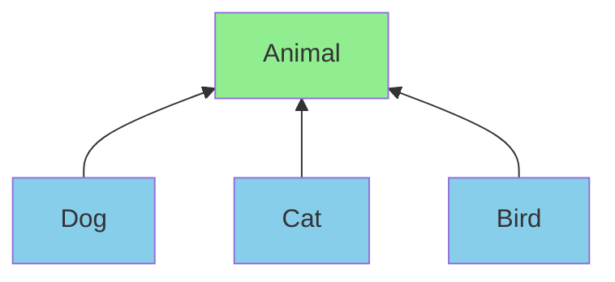
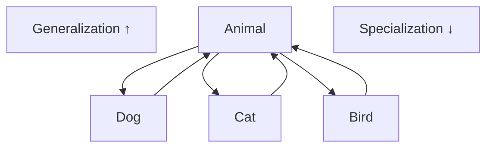
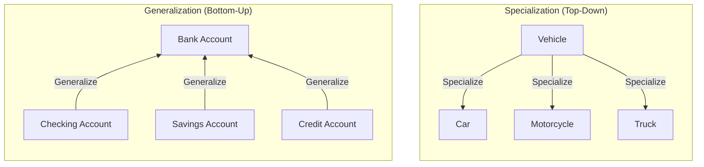
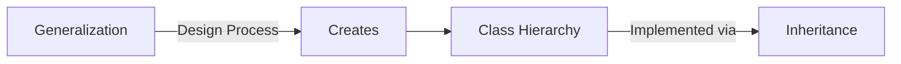
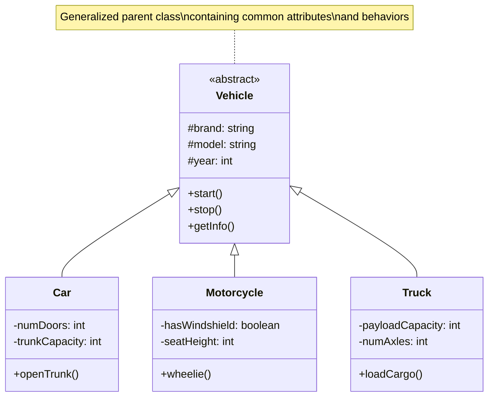
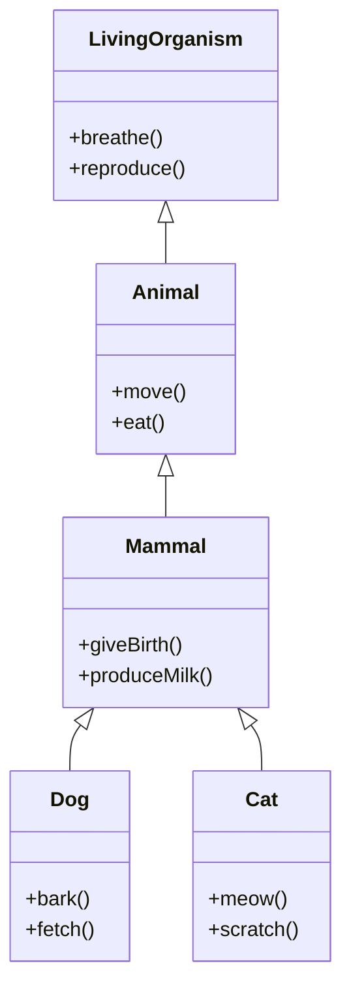
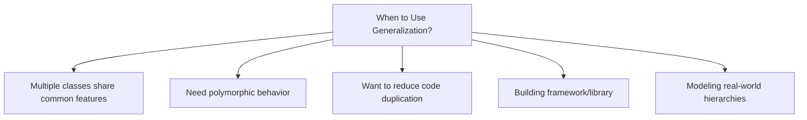
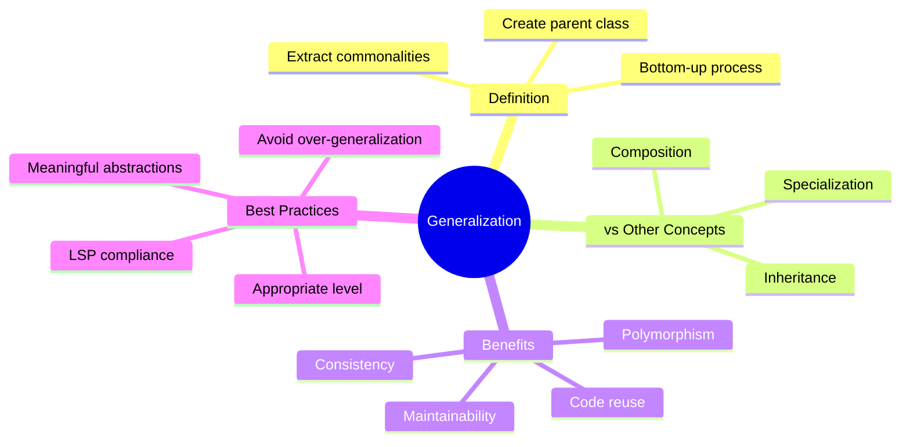

# Generalization

**Purpose**: Understanding generalization - the process of extracting common features from specific entities to create more general, reusable abstractions.

---

## Table of Contents

1. [What is Generalization?](#what-is-generalization)
2. [Generalization vs Specialization](#generalization-vs-specialization)
3. [Generalization vs Inheritance](#generalization-vs-inheritance)
4. [Generalization in UML](#generalization-in-uml)
5. [Real-World Examples](#real-world-examples)
6. [Benefits and Use Cases](#benefits-and-use-cases)
7. [Best Practices](#best-practices)
8. [Common Mistakes](#common-mistakes)
9. [Interview Questions](#interview-questions)

---

## What is Generalization?

**Generalization** is the process of extracting shared characteristics from two or more classes and combining them into a generalized superclass. It's a bottom-up approach where you identify common features among specific classes and create a more general parent class.

### Key Definition

> Generalization is the process of identifying common attributes and behaviors across multiple classes and creating a parent class that captures these commonalities.

### Bottom-Up Approach



### Example Analogy

Think about organizing a library:
- You have: Novel, Textbook, Magazine, Comic
- You generalize to: **Book/Publication** (general concept)
- Common features: title, author, publication date, pages

---

## Generalization vs Specialization

### Relationship



### Comparison

| Generalization | Specialization |
|----------------|----------------|
| Bottom-up approach | Top-down approach |
| Combines common features | Adds specific features |
| Creates parent classes | Creates child classes |
| "is-a-kind-of" | "is-a" |
| Example: Dog, Cat → Animal | Example: Animal → Dog, Cat |

### Visual Representation



---

## Generalization vs Inheritance

### Relationship



### Key Differences

| Aspect | Generalization | Inheritance |
|--------|----------------|-------------|
| **Phase** | Design/Analysis | Implementation |
| **Direction** | Bottom-up (combining) | Top-down (deriving) |
| **Purpose** | Extract commonalities | Reuse and extend |
| **Result** | General concepts | Code reuse |
| **Focus** | What to share | How to share |

### Example

**Generalization (Design Phase):**

```javascript
// Step 1: Identify specific classes
class SavingsAccount {
    accountNumber;
    balance;
    interestRate;
    
    deposit(amount) { /* ... */ }
    withdraw(amount) { /* ... */ }
    calculateInterest() { /* ... */ }
}

class CheckingAccount {
    accountNumber;
    balance;
    overdraftLimit;
    
    deposit(amount) { /* ... */ }
    withdraw(amount) { /* ... */ }
    writeCheck() { /* ... */ }
}

// Step 2: Generalize common features
// Common: accountNumber, balance, deposit(), withdraw()
// Different: interestRate vs overdraftLimit, calculateInterest() vs writeCheck()
```

**Inheritance (Implementation Phase):**

```javascript
// Step 3: Create generalized parent class
class BankAccount {
    #accountNumber;
    #balance;
    
    constructor(accountNumber, initialBalance) {
        this.#accountNumber = accountNumber;
        this.#balance = initialBalance;
    }
    
    deposit(amount) {
        if (amount > 0) {
            this.#balance += amount;
            return true;
        }
        return false;
    }
    
    withdraw(amount) {
        if (amount > 0 && amount <= this.#balance) {
            this.#balance -= amount;
            return true;
        }
        return false;
    }
    
    getBalance() {
        return this.#balance;
    }
}

// Step 4: Specialize with specific features
class SavingsAccount extends BankAccount {
    #interestRate;
    
    constructor(accountNumber, initialBalance, interestRate) {
        super(accountNumber, initialBalance);
        this.#interestRate = interestRate;
    }
    
    calculateInterest() {
        const interest = this.getBalance() * (this.#interestRate / 100);
        this.deposit(interest);
        return interest;
    }
}

class CheckingAccount extends BankAccount {
    #overdraftLimit;
    
    constructor(accountNumber, initialBalance, overdraftLimit) {
        super(accountNumber, initialBalance);
        this.#overdraftLimit = overdraftLimit;
    }
    
    withdraw(amount) {
        const availableBalance = this.getBalance() + this.#overdraftLimit;
        if (amount > 0 && amount <= availableBalance) {
            return super.withdraw(amount);
        }
        return false;
    }
    
    writeCheck(amount, payee) {
        if (this.withdraw(amount)) {
            console.log(`Check written to ${payee} for $${amount}`);
            return true;
        }
        return false;
    }
}

// Usage
const savings = new SavingsAccount("SAV001", 1000, 3.5);
savings.deposit(500);
savings.calculateInterest();

const checking = new CheckingAccount("CHK001", 500, 200);
checking.writeCheck(600, "John Doe"); // Uses overdraft
```

**Python Example:**

```python
# Generalized parent class
class BankAccount:
    def __init__(self, account_number, initial_balance):
        self.__account_number = account_number
        self.__balance = initial_balance
    
    def deposit(self, amount):
        if amount > 0:
            self.__balance += amount
            return True
        return False
    
    def withdraw(self, amount):
        if amount > 0 and amount <= self.__balance:
            self.__balance -= amount
            return True
        return False
    
    def get_balance(self):
        return self.__balance

# Specialized classes
class SavingsAccount(BankAccount):
    def __init__(self, account_number, initial_balance, interest_rate):
        super().__init__(account_number, initial_balance)
        self.__interest_rate = interest_rate
    
    def calculate_interest(self):
        interest = self.get_balance() * (self.__interest_rate / 100)
        self.deposit(interest)
        return interest

class CheckingAccount(BankAccount):
    def __init__(self, account_number, initial_balance, overdraft_limit):
        super().__init__(account_number, initial_balance)
        self.__overdraft_limit = overdraft_limit
    
    def withdraw(self, amount):
        available_balance = self.get_balance() + self.__overdraft_limit
        if amount > 0 and amount <= available_balance:
            return super().withdraw(amount)
        return False
    
    def write_check(self, amount, payee):
        if self.withdraw(amount):
            print(f"Check written to {payee} for ${amount}")
            return True
        return False

# Usage
savings = SavingsAccount("SAV001", 1000, 3.5)
savings.deposit(500)
savings.calculate_interest()

checking = CheckingAccount("CHK001", 500, 200)
checking.write_check(600, "John Doe")  # Uses overdraft
```

---

## Generalization in UML

### UML Notation



### Multi-Level Generalization



---

## Real-World Examples

### Example 1: Payment Methods

**Step 1: Identify Specific Classes**

```javascript
// Specific payment implementations before generalization
class CreditCardPayment {
    processPayment(amount, cardNumber, cvv, expiry) {
        console.log(`Processing credit card payment of $${amount}`);
        // Validation
        // Authorization
        // Charge
        return { success: true, transactionId: "CC123" };
    }
}

class PayPalPayment {
    processPayment(amount, email, password) {
        console.log(`Processing PayPal payment of $${amount}`);
        // Authentication
        // Authorization
        // Transfer
        return { success: true, transactionId: "PP456" };
    }
}

class BankTransferPayment {
    processPayment(amount, accountNumber, routingNumber) {
        console.log(`Processing bank transfer of $${amount}`);
        // Verification
        // Authorization
        // Transfer
        return { success: true, transactionId: "BT789" };
    }
}
```

**Step 2: Generalize Common Features**

```javascript
// Generalized parent class
class PaymentMethod {
    #transactionFee;
    
    constructor(transactionFee = 0) {
        this.#transactionFee = transactionFee;
    }
    
    // Template method - common flow
    processPayment(amount, details) {
        console.log(`Processing payment of $${amount}`);
        
        // Common steps
        if (!this.validate(details)) {
            throw new Error("Invalid payment details");
        }
        
        if (!this.authorize(amount)) {
            throw new Error("Authorization failed");
        }
        
        const result = this.charge(amount, details);
        this.recordTransaction(result);
        
        return result;
    }
    
    // Methods to be implemented by subclasses
    validate(details) {
        throw new Error("Must implement validate()");
    }
    
    authorize(amount) {
        throw new Error("Must implement authorize()");
    }
    
    charge(amount, details) {
        throw new Error("Must implement charge()");
    }
    
    // Common method
    recordTransaction(result) {
        console.log(`Transaction recorded: ${result.transactionId}`);
    }
    
    calculateTotal(amount) {
        return amount + this.#transactionFee;
    }
}

// Specialized classes
class CreditCardPayment extends PaymentMethod {
    constructor() {
        super(2.50); // $2.50 transaction fee
    }
    
    validate(details) {
        const { cardNumber, cvv, expiry } = details;
        return cardNumber && cvv && expiry;
    }
    
    authorize(amount) {
        console.log("Authorizing credit card...");
        return true;
    }
    
    charge(amount, details) {
        console.log(`Charging credit card ${details.cardNumber}`);
        return {
            success: true,
            transactionId: `CC-${Date.now()}`,
            amount: this.calculateTotal(amount)
        };
    }
}

class PayPalPayment extends PaymentMethod {
    constructor() {
        super(1.50); // $1.50 transaction fee
    }
    
    validate(details) {
        const { email, password } = details;
        return email && password;
    }
    
    authorize(amount) {
        console.log("Authorizing PayPal account...");
        return true;
    }
    
    charge(amount, details) {
        console.log(`Charging PayPal account ${details.email}`);
        return {
            success: true,
            transactionId: `PP-${Date.now()}`,
            amount: this.calculateTotal(amount)
        };
    }
}

class BankTransferPayment extends PaymentMethod {
    constructor() {
        super(0); // No transaction fee
    }
    
    validate(details) {
        const { accountNumber, routingNumber } = details;
        return accountNumber && routingNumber;
    }
    
    authorize(amount) {
        console.log("Verifying bank account...");
        return true;
    }
    
    charge(amount, details) {
        console.log(`Transferring from account ${details.accountNumber}`);
        return {
            success: true,
            transactionId: `BT-${Date.now()}`,
            amount: this.calculateTotal(amount)
        };
    }
}

// Usage - polymorphic behavior
function processOrder(paymentMethod, amount, details) {
    try {
        const result = paymentMethod.processPayment(amount, details);
        console.log(`Payment successful! Transaction ID: ${result.transactionId}`);
        console.log(`Total charged: $${result.amount}`);
    } catch (error) {
        console.error(`Payment failed: ${error.message}`);
    }
}

// All payment methods can be used polymorphically
processOrder(
    new CreditCardPayment(),
    100,
    { cardNumber: "****1234", cvv: "123", expiry: "12/25" }
);

processOrder(
    new PayPalPayment(),
    100,
    { email: "user@example.com", password: "secure123" }
);

processOrder(
    new BankTransferPayment(),
    100,
    { accountNumber: "123456789", routingNumber: "987654321" }
);
```

### Example 2: Document Processing

```javascript
// Step 1: Specific document types
// Step 2: Generalize to Document class

class Document {
    #title;
    #author;
    #createdDate;
    #content;
    
    constructor(title, author) {
        this.#title = title;
        this.#author = author;
        this.#createdDate = new Date();
        this.#content = "";
    }
    
    // Common methods
    getMetadata() {
        return {
            title: this.#title,
            author: this.#author,
            created: this.#createdDate,
            type: this.constructor.name
        };
    }
    
    setContent(content) {
        this.#content = content;
    }
    
    getContent() {
        return this.#content;
    }
    
    // Methods to be overridden
    render() {
        throw new Error("Must implement render()");
    }
    
    export(format) {
        throw new Error("Must implement export()");
    }
    
    validate() {
        return this.#title && this.#author && this.#content;
    }
}

// Specialized document types
class TextDocument extends Document {
    #fontSize;
    #fontFamily;
    
    constructor(title, author, fontSize = 12, fontFamily = "Arial") {
        super(title, author);
        this.#fontSize = fontSize;
        this.#fontFamily = fontFamily;
    }
    
    render() {
        return `<div style="font-size:${this.#fontSize}px; font-family:${this.#fontFamily}">
                    ${this.getContent()}
                </div>`;
    }
    
    export(format) {
        if (format === 'txt') {
            return this.getContent();
        } else if (format === 'html') {
            return this.render();
        }
        throw new Error(`Unsupported format: ${format}`);
    }
}

class SpreadsheetDocument extends Document {
    #rows = [];
    #columns = [];
    
    constructor(title, author) {
        super(title, author);
    }
    
    addRow(data) {
        this.#rows.push(data);
    }
    
    render() {
        let table = '<table border="1">';
        this.#rows.forEach(row => {
            table += '<tr>';
            row.forEach(cell => {
                table += `<td>${cell}</td>`;
            });
            table += '</tr>';
        });
        table += '</table>';
        return table;
    }
    
    export(format) {
        if (format === 'csv') {
            return this.#rows.map(row => row.join(',')).join('\n');
        } else if (format === 'html') {
            return this.render();
        }
        throw new Error(`Unsupported format: ${format}`);
    }
}

class PresentationDocument extends Document {
    #slides = [];
    
    constructor(title, author) {
        super(title, author);
    }
    
    addSlide(title, content) {
        this.#slides.push({ title, content });
    }
    
    render() {
        let presentation = '<div class="presentation">';
        this.#slides.forEach((slide, index) => {
            presentation += `
                <div class="slide" id="slide-${index + 1}">
                    <h2>${slide.title}</h2>
                    <div>${slide.content}</div>
                </div>
            `;
        });
        presentation += '</div>';
        return presentation;
    }
    
    export(format) {
        if (format === 'html') {
            return this.render();
        } else if (format === 'pdf') {
            return `PDF export of ${this.#slides.length} slides`;
        }
        throw new Error(`Unsupported format: ${format}`);
    }
}

// Usage - polymorphic document handling
class DocumentManager {
    #documents = [];
    
    addDocument(document) {
        if (document instanceof Document) {
            this.#documents.push(document);
        }
    }
    
    renderAll() {
        this.#documents.forEach(doc => {
            console.log(`\n=== ${doc.getMetadata().title} ===`);
            console.log(doc.render());
        });
    }
    
    exportAll(format) {
        this.#documents.forEach(doc => {
            try {
                console.log(`\nExporting ${doc.getMetadata().title} as ${format}`);
                console.log(doc.export(format));
            } catch (error) {
                console.error(`Cannot export: ${error.message}`);
            }
        });
    }
}

// Usage
const manager = new DocumentManager();

const textDoc = new TextDocument("Meeting Notes", "John Doe");
textDoc.setContent("Discuss Q4 goals and budget allocation");
manager.addDocument(textDoc);

const spreadsheet = new SpreadsheetDocument("Sales Report", "Jane Smith");
spreadsheet.addRow(["Product", "Q1", "Q2", "Q3"]);
spreadsheet.addRow(["Widget A", 1000, 1200, 1500]);
spreadsheet.addRow(["Widget B", 800, 900, 1100]);
manager.addDocument(spreadsheet);

const presentation = new PresentationDocument("Annual Review", "Bob Johnson");
presentation.addSlide("Introduction", "Welcome to our annual review");
presentation.addSlide("Achievements", "We accomplished 95% of our goals");
manager.addDocument(presentation);

manager.renderAll();
manager.exportAll('html');
```

---

## Benefits and Use Cases

### Benefits of Generalization

1. **Code Reusability**
   - Common code written once in parent class
   
2. **Maintainability**
   - Changes to common behavior in one place
   
3. **Consistency**
   - Ensures uniform behavior across related classes
   
4. **Polymorphism**
   - Enables treating different objects uniformly
   
5. **Reduced Complexity**
   - Simplifies understanding by grouping related concepts

### Use Cases



---

## Best Practices

### 1. Identify True Commonalities

```javascript
// ✅ GOOD: True common features
class Vehicle {
    start() { }
    stop() { }
    refuel() { }
}

// ❌ BAD: Forced generalization
class Thing {
    exists() { }
    doSomething() { }
}
```

### 2. Use Meaningful Abstractions

```javascript
// ✅ GOOD: Clear, meaningful abstraction
class Employee {
    calculateSalary() { }
    clockIn() { }
}

// ❌ BAD: Too generic
class Entity {
    process() { }
}
```

### 3. Don't Over-Generalize

```javascript
// ❌ BAD: Over-generalization
class Object {
    getId() { }
    toString() { }
    equals() { }
}

class User extends Object { }
class Order extends Object { }
class Payment extends Object { }
// Everything becomes an Object - too generic!

// ✅ GOOD: Appropriate level of generalization
class User { }
class Order { }
class Payment { }
// Keep separate unless there's real commonality
```

### 4. Follow Liskov Substitution Principle

```javascript
// ✅ GOOD: Substitutable
class Rectangle {
    setDimensions(width, height) {
        this.width = width;
        this.height = height;
    }
}

// ❌ BAD: Violates LSP
class Square extends Rectangle {
    setDimensions(width, height) {
        // Square can't have different width and height!
        this.width = this.height = width;
    }
}
```

---

## Common Mistakes

### Mistake 1: Generalizing Unrelated Classes

```javascript
// ❌ BAD
class Utility {
    doStuff() { }
}

class User extends Utility { }
class Database extends Utility { }
// No logical relationship!
```

### Mistake 2: Creating God Classes

```javascript
// ❌ BAD: God class with everything
class BaseObject {
    save() { }
    delete() { }
    validate() { }
    render() { }
    export() { }
    import() { }
    transform() { }
    // ... 50 more methods
}
```

### Mistake 3: Ignoring Composition Alternative

```javascript
// ❌ BAD: Inheritance where composition fits better
class Logger {
    log(message) { }
}

class UserService extends Logger { }
// UserService is not a Logger!

// ✅ GOOD: Use composition
class UserService {
    #logger = new Logger();
    
    createUser(data) {
        this.#logger.log("Creating user");
    }
}
```

---

## Interview Questions

### Q1: What is generalization in OOP?

**Answer**: Generalization is the process of extracting common features from multiple specific classes and creating a more general parent class. It's a bottom-up approach that promotes code reuse and establishes class hierarchies.

### Q2: How is generalization different from inheritance?

**Answer**:
- **Generalization** is a design process (bottom-up) where you identify commonalities
- **Inheritance** is an implementation mechanism (top-down) where child classes extend parent classes
- Generalization creates the hierarchy, inheritance implements it

### Q3: What is the difference between generalization and specialization?

**Answer**:
- **Generalization**: Bottom-up, combining common features from specific classes into a general class
- **Specialization**: Top-down, adding specific features to a general class to create specialized classes

### Q4: When should you generalize classes?

**Answer**: Generalize when:
- Multiple classes share common attributes/behaviors
- You need polymorphic behavior
- Want to reduce code duplication
- Building reusable frameworks
- Modeling natural hierarchies

### Q5: What are the risks of over-generalization?

**Answer**:
1. **Complexity**: Too many abstraction layers
2. **Fragility**: Changes in parent affect all children
3. **Tight Coupling**: Hard to modify independently
4. **God Classes**: Classes with too many responsibilities
5. **Violates SOLID**: Especially SRP and ISP

---

## Summary



---

## Next Steps

1. **Study**: [Polymorphism](./polymorphism.md)
2. **Study**: [OOAD](./ooad.md)
3. **Practice**: Identify generalization opportunities in existing code
4. **Review**: UML class diagrams for generalization relationships

---

**Key Takeaway**: Generalization is about finding and extracting commonalities to create reusable, maintainable class hierarchies. Use it wisely - not everything needs to be generalized!

