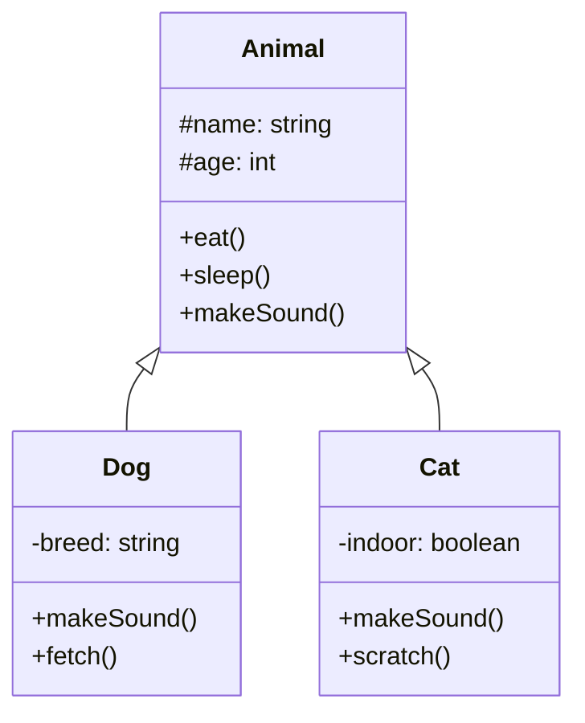
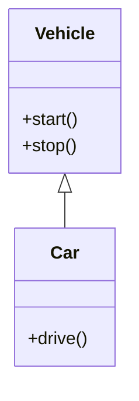
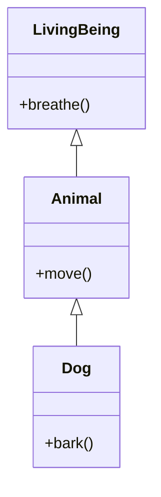
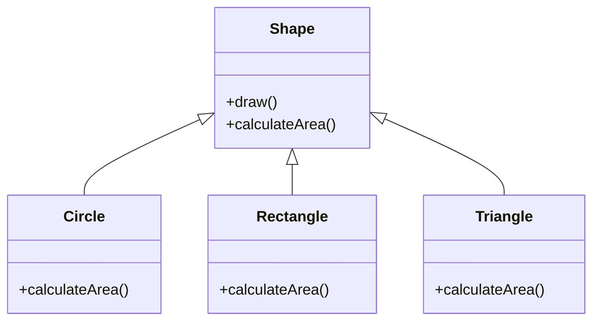
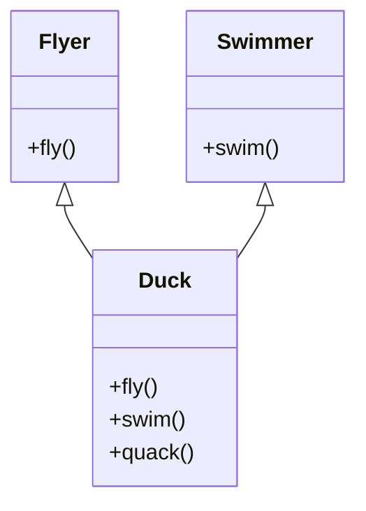
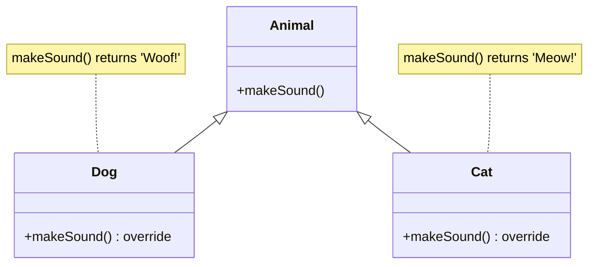
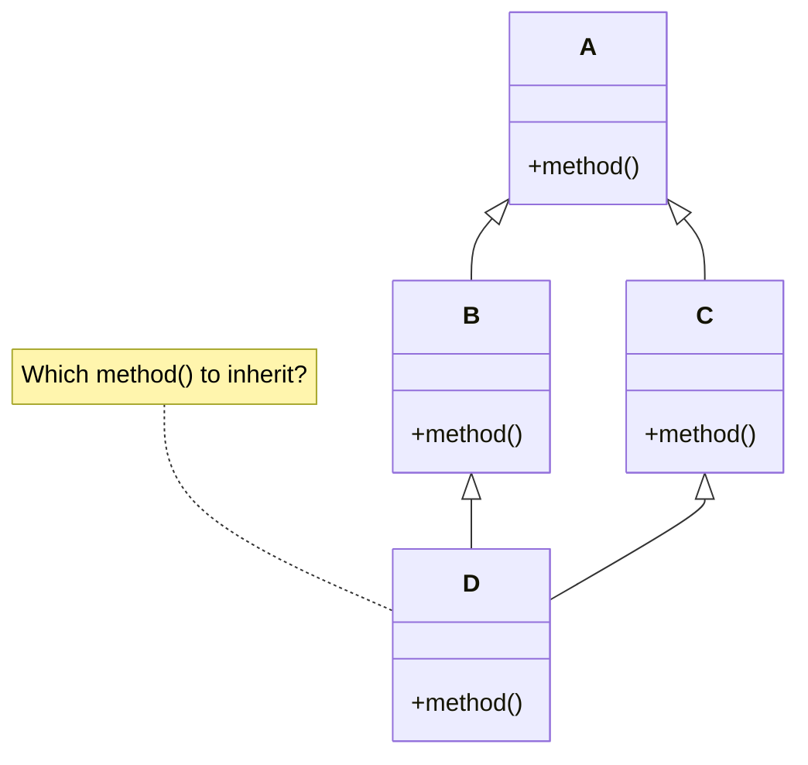
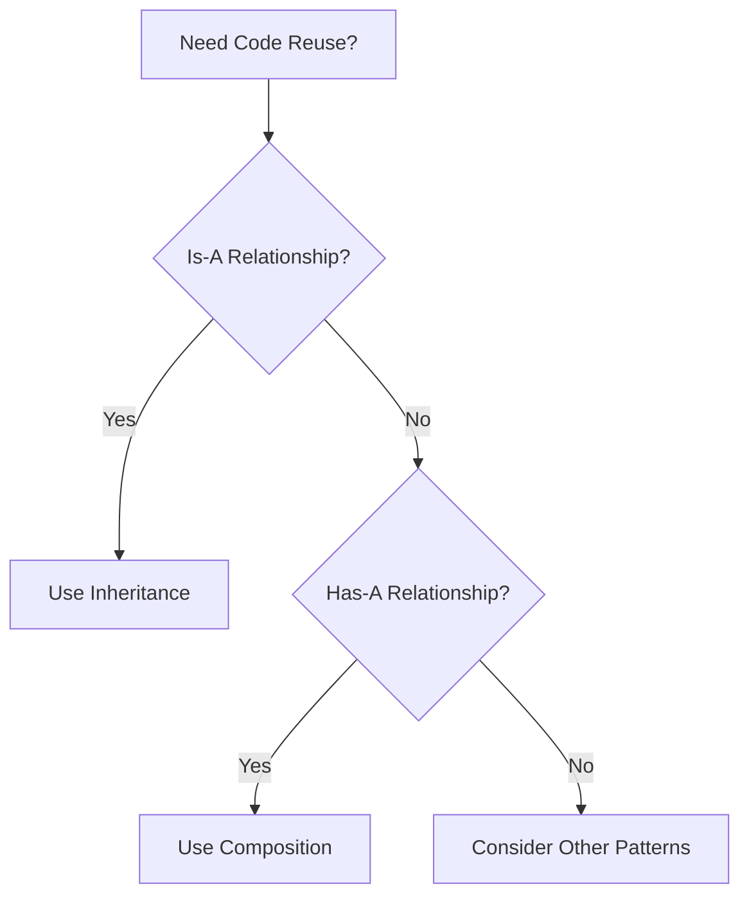
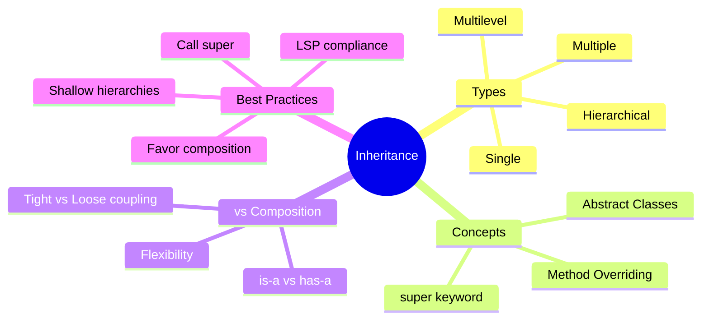

# Inheritance

**Purpose**: Master the concept of inheritance - creating new classes from existing ones to promote code reuse and establish hierarchical relationships.

---

## Table of Contents

1. [What is Inheritance?](#what-is-inheritance)
2. [Types of Inheritance](#types-of-inheritance)
3. [Method Overriding](#method-overriding)
4. [Super Keyword](#super-keyword)
5. [Multiple Inheritance](#multiple-inheritance)
6. [Composition vs Inheritance](#composition-vs-inheritance)
7. [Real-World Examples](#real-world-examples)
8. [Best Practices](#best-practices)
9. [Common Mistakes](#common-mistakes)
10. [Interview Questions](#interview-questions)

---

## What is Inheritance?

**Inheritance** is a mechanism where a new class (child/derived/subclass) derives properties and behaviors from an existing class (parent/base/superclass). It establishes an "is-a" relationship between classes.

### Key Definition

> Inheritance allows a class to inherit attributes and methods from another class, promoting code reuse and establishing a hierarchical relationship.

### Visual Representation



---

## Types of Inheritance

### 1. Single Inheritance

One child class inherits from one parent class.



**JavaScript Example:**

```javascript
class Vehicle {
    #brand;
    
    constructor(brand) {
        this.#brand = brand;
    }
    
    start() {
        console.log(`${this.#brand} vehicle starting...`);
    }
    
    stop() {
        console.log(`${this.#brand} vehicle stopping...`);
    }
    
    getBrand() {
        return this.#brand;
    }
}

class Car extends Vehicle {
    #model;
    #doors;
    
    constructor(brand, model, doors) {
        super(brand); // Call parent constructor
        this.#model = model;
        this.#doors = doors;
    }
    
    drive() {
        console.log(`Driving ${this.getBrand()} ${this.#model} with ${this.#doors} doors`);
    }
    
    getInfo() {
        return `${this.getBrand()} ${this.#model}`;
    }
}

// Usage
const myCar = new Car("Toyota", "Camry", 4);
myCar.start();  // Inherited from Vehicle
myCar.drive();  // Car's own method
myCar.stop();   // Inherited from Vehicle
console.log(myCar.getInfo());
```

**Python Example:**

```python
class Vehicle:
    def __init__(self, brand):
        self.__brand = brand
    
    def start(self):
        print(f"{self.__brand} vehicle starting...")
    
    def stop(self):
        print(f"{self.__brand} vehicle stopping...")
    
    def get_brand(self):
        return self.__brand

class Car(Vehicle):
    def __init__(self, brand, model, doors):
        super().__init__(brand)  # Call parent constructor
        self.__model = model
        self.__doors = doors
    
    def drive(self):
        print(f"Driving {self.get_brand()} {self.__model} with {self.__doors} doors")
    
    def get_info(self):
        return f"{self.get_brand()} {self.__model}"

# Usage
my_car = Car("Toyota", "Camry", 4)
my_car.start()  # Inherited from Vehicle
my_car.drive()  # Car's own method
my_car.stop()   # Inherited from Vehicle
print(my_car.get_info())
```

### 2. Multilevel Inheritance

A chain of inheritance where a class inherits from another class, which in turn inherits from another class.



**JavaScript Example:**

```javascript
class LivingBeing {
    breathe() {
        console.log("Breathing...");
    }
    
    live() {
        console.log("Living...");
    }
}

class Animal extends LivingBeing {
    #species;
    
    constructor(species) {
        super();
        this.#species = species;
    }
    
    move() {
        console.log(`${this.#species} is moving...`);
    }
    
    eat() {
        console.log(`${this.#species} is eating...`);
    }
}

class Dog extends Animal {
    #name;
    
    constructor(name) {
        super("Canine");
        this.#name = name;
    }
    
    bark() {
        console.log(`${this.#name} says: Woof! Woof!`);
    }
    
    fetch() {
        console.log(`${this.#name} is fetching the ball`);
    }
}

// Usage
const buddy = new Dog("Buddy");
buddy.breathe();  // From LivingBeing
buddy.move();     // From Animal
buddy.bark();     // From Dog
buddy.fetch();    // From Dog
```

**Python Example:**

```python
class LivingBeing:
    def breathe(self):
        print("Breathing...")
    
    def live(self):
        print("Living...")

class Animal(LivingBeing):
    def __init__(self, species):
        self.__species = species
    
    def move(self):
        print(f"{self.__species} is moving...")
    
    def eat(self):
        print(f"{self.__species} is eating...")

class Dog(Animal):
    def __init__(self, name):
        super().__init__("Canine")
        self.__name = name
    
    def bark(self):
        print(f"{self.__name} says: Woof! Woof!")
    
    def fetch(self):
        print(f"{self.__name} is fetching the ball")

# Usage
buddy = Dog("Buddy")
buddy.breathe()  # From LivingBeing
buddy.move()     # From Animal
buddy.bark()     # From Dog
buddy.fetch()    # From Dog
```

### 3. Hierarchical Inheritance

Multiple child classes inherit from the same parent class.



**JavaScript Example:**

```javascript
class Employee {
    #name;
    #id;
    #baseSalary;
    
    constructor(name, id, baseSalary) {
        this.#name = name;
        this.#id = id;
        this.#baseSalary = baseSalary;
    }
    
    getDetails() {
        return `${this.#name} (ID: ${this.#id})`;
    }
    
    getBaseSalary() {
        return this.#baseSalary;
    }
    
    calculateSalary() {
        throw new Error("Must be implemented by subclass");
    }
}

class FullTimeEmployee extends Employee {
    #benefits;
    
    constructor(name, id, baseSalary, benefits) {
        super(name, id, baseSalary);
        this.#benefits = benefits;
    }
    
    calculateSalary() {
        return this.getBaseSalary() + this.#benefits;
    }
}

class PartTimeEmployee extends Employee {
    #hoursWorked;
    #hourlyRate;
    
    constructor(name, id, hourlyRate, hoursWorked) {
        super(name, id, 0);
        this.#hourlyRate = hourlyRate;
        this.#hoursWorked = hoursWorked;
    }
    
    calculateSalary() {
        return this.#hourlyRate * this.#hoursWorked;
    }
}

class Contractor extends Employee {
    #projectFee;
    #projectsCompleted;
    
    constructor(name, id, projectFee, projectsCompleted) {
        super(name, id, 0);
        this.#projectFee = projectFee;
        this.#projectsCompleted = projectsCompleted;
    }
    
    calculateSalary() {
        return this.#projectFee * this.#projectsCompleted;
    }
}

// Usage
const fullTime = new FullTimeEmployee("Alice", "FT001", 50000, 10000);
const partTime = new PartTimeEmployee("Bob", "PT001", 25, 80);
const contractor = new Contractor("Charlie", "CT001", 5000, 3);

console.log(`${fullTime.getDetails()}: $${fullTime.calculateSalary()}`);
console.log(`${partTime.getDetails()}: $${partTime.calculateSalary()}`);
console.log(`${contractor.getDetails()}: $${contractor.calculateSalary()}`);
```

### 4. Multiple Inheritance (Python Only)

A class inherits from multiple parent classes.



**Python Example:**

```python
class Flyer:
    def fly(self):
        print("Flying in the sky")
    
    def land(self):
        print("Landing on ground")

class Swimmer:
    def swim(self):
        print("Swimming in water")
    
    def dive(self):
        print("Diving underwater")

# Multiple inheritance
class Duck(Flyer, Swimmer):
    def __init__(self, name):
        self.__name = name
    
    def quack(self):
        print(f"{self.__name} says: Quack!")

# Usage
donald = Duck("Donald")
donald.fly()    # From Flyer
donald.swim()   # From Swimmer
donald.quack()  # Duck's own method
donald.land()   # From Flyer
donald.dive()   # From Swimmer
```

**JavaScript Workaround (Mixins):**

```javascript
// Mixin pattern for multiple inheritance
const FlyerMixin = {
    fly() {
        console.log("Flying in the sky");
    },
    
    land() {
        console.log("Landing on ground");
    }
};

const SwimmerMixin = {
    swim() {
        console.log("Swimming in water");
    },
    
    dive() {
        console.log("Diving underwater");
    }
};

class Duck {
    #name;
    
    constructor(name) {
        this.#name = name;
        // Apply mixins
        Object.assign(this, FlyerMixin, SwimmerMixin);
    }
    
    quack() {
        console.log(`${this.#name} says: Quack!`);
    }
}

// Usage
const donald = new Duck("Donald");
donald.fly();    // From FlyerMixin
donald.swim();   // From SwimmerMixin
donald.quack();  // Duck's own method
donald.land();   // From FlyerMixin
donald.dive();   // From SwimmerMixin
```

---

## Method Overriding

### Concept

Child class provides a specific implementation of a method already defined in the parent class.



**JavaScript Example:**

```javascript
class Animal {
    #name;
    
    constructor(name) {
        this.#name = name;
    }
    
    makeSound() {
        return "Some generic animal sound";
    }
    
    describe() {
        return `${this.#name} makes sound: ${this.makeSound()}`;
    }
}

class Dog extends Animal {
    constructor(name, breed) {
        super(name);
        this.breed = breed;
    }
    
    // Override parent method
    makeSound() {
        return "Woof! Woof!";
    }
}

class Cat extends Animal {
    constructor(name, color) {
        super(name);
        this.color = color;
    }
    
    // Override parent method
    makeSound() {
        return "Meow!";
    }
}

class Bird extends Animal {
    constructor(name, canFly) {
        super(name);
        this.canFly = canFly;
    }
    
    // Override parent method
    makeSound() {
        return "Tweet! Tweet!";
    }
}

// Usage
const animals = [
    new Dog("Buddy", "Golden Retriever"),
    new Cat("Whiskers", "Orange"),
    new Bird("Tweety", true)
];

animals.forEach(animal => {
    console.log(animal.describe());
});
// Output:
// Buddy makes sound: Woof! Woof!
// Whiskers makes sound: Meow!
// Tweety makes sound: Tweet! Tweet!
```

**Python Example:**

```python
class Animal:
    def __init__(self, name):
        self.__name = name
    
    def make_sound(self):
        return "Some generic animal sound"
    
    def describe(self):
        return f"{self.__name} makes sound: {self.make_sound()}"

class Dog(Animal):
    def __init__(self, name, breed):
        super().__init__(name)
        self.breed = breed
    
    # Override parent method
    def make_sound(self):
        return "Woof! Woof!"

class Cat(Animal):
    def __init__(self, name, color):
        super().__init__(name)
        self.color = color
    
    # Override parent method
    def make_sound(self):
        return "Meow!"

class Bird(Animal):
    def __init__(self, name, can_fly):
        super().__init__(name)
        self.can_fly = can_fly
    
    # Override parent method
    def make_sound(self):
        return "Tweet! Tweet!"

# Usage
animals = [
    Dog("Buddy", "Golden Retriever"),
    Cat("Whiskers", "Orange"),
    Bird("Tweety", True)
]

for animal in animals:
    print(animal.describe())
# Output:
# Buddy makes sound: Woof! Woof!
# Whiskers makes sound: Meow!
# Tweety makes sound: Tweet! Tweet!
```

---

## Super Keyword

### Purpose

The `super` keyword is used to call methods from the parent class.

**JavaScript Example:**

```javascript
class BankAccount {
    #balance;
    
    constructor(accountNumber, initialBalance) {
        this.accountNumber = accountNumber;
        this.#balance = initialBalance;
    }
    
    deposit(amount) {
        this.#balance += amount;
        console.log(`Deposited $${amount}. New balance: $${this.#balance}`);
    }
    
    getBalance() {
        return this.#balance;
    }
}

class SavingsAccount extends BankAccount {
    #interestRate;
    
    constructor(accountNumber, initialBalance, interestRate) {
        super(accountNumber, initialBalance); // Call parent constructor
        this.#interestRate = interestRate;
    }
    
    deposit(amount) {
        // Call parent method
        super.deposit(amount);
        console.log(`Interest rate: ${this.#interestRate}%`);
    }
    
    addInterest() {
        const interest = this.getBalance() * (this.#interestRate / 100);
        super.deposit(interest);
        console.log(`Added interest: $${interest}`);
    }
}

// Usage
const savings = new SavingsAccount("SAV001", 1000, 3.5);
savings.deposit(500);     // Calls overridden method
savings.addInterest();    // Calls parent deposit via super
```

**Python Example:**

```python
class BankAccount:
    def __init__(self, account_number, initial_balance):
        self.account_number = account_number
        self.__balance = initial_balance
    
    def deposit(self, amount):
        self.__balance += amount
        print(f"Deposited ${amount}. New balance: ${self.__balance}")
    
    def get_balance(self):
        return self.__balance

class SavingsAccount(BankAccount):
    def __init__(self, account_number, initial_balance, interest_rate):
        super().__init__(account_number, initial_balance)  # Call parent constructor
        self.__interest_rate = interest_rate
    
    def deposit(self, amount):
        # Call parent method
        super().deposit(amount)
        print(f"Interest rate: {self.__interest_rate}%")
    
    def add_interest(self):
        interest = self.get_balance() * (self.__interest_rate / 100)
        super().deposit(interest)
        print(f"Added interest: ${interest}")

# Usage
savings = SavingsAccount("SAV001", 1000, 3.5)
savings.deposit(500)      # Calls overridden method
savings.add_interest()    # Calls parent deposit via super
```

---

## Multiple Inheritance

### Diamond Problem



**Python Solution (MRO - Method Resolution Order):**

```python
class A:
    def method(self):
        print("A method")

class B(A):
    def method(self):
        print("B method")
        super().method()

class C(A):
    def method(self):
        print("C method")
        super().method()

class D(B, C):
    def method(self):
        print("D method")
        super().method()

# Usage
d = D()
d.method()
# Output:
# D method
# B method
# C method
# A method

# Check Method Resolution Order
print(D.__mro__)
# (<class 'D'>, <class 'B'>, <class 'C'>, <class 'A'>, <class 'object'>)
```

---

## Composition vs Inheritance

### When to Use Each



### Inheritance Example ("is-a")

```javascript
// Car IS-A Vehicle
class Vehicle {
    start() { console.log("Starting..."); }
}

class Car extends Vehicle {
    drive() { console.log("Driving..."); }
}
```

### Composition Example ("has-a")

```javascript
// Car HAS-AN Engine
class Engine {
    start() {
        console.log("Engine starting...");
    }
    
    stop() {
        console.log("Engine stopping...");
    }
}

class Car {
    #engine;
    
    constructor() {
        this.#engine = new Engine(); // Composition
    }
    
    start() {
        this.#engine.start();
        console.log("Car ready to drive");
    }
    
    stop() {
        this.#engine.stop();
        console.log("Car stopped");
    }
}

// Usage
const car = new Car();
car.start();
car.stop();
```

### Comparison

| Inheritance | Composition |
|-------------|-------------|
| "is-a" relationship | "has-a" relationship |
| Tight coupling | Loose coupling |
| Less flexible | More flexible |
| Compile-time binding | Runtime binding |
| Can't change behavior | Can change behavior |

---

## Real-World Examples

### Example 1: Employee Management System

```javascript
class Person {
    #firstName;
    #lastName;
    #dateOfBirth;
    
    constructor(firstName, lastName, dateOfBirth) {
        this.#firstName = firstName;
        this.#lastName = lastName;
        this.#dateOfBirth = new Date(dateOfBirth);
    }
    
    getFullName() {
        return `${this.#firstName} ${this.#lastName}`;
    }
    
    getAge() {
        const today = new Date();
        let age = today.getFullYear() - this.#dateOfBirth.getFullYear();
        const monthDiff = today.getMonth() - this.#dateOfBirth.getMonth();
        
        if (monthDiff < 0 || (monthDiff === 0 && today.getDate() < this.#dateOfBirth.getDate())) {
            age--;
        }
        
        return age;
    }
}

class Employee extends Person {
    #employeeId;
    #department;
    #salary;
    #hireDate;
    
    constructor(firstName, lastName, dateOfBirth, employeeId, department, salary) {
        super(firstName, lastName, dateOfBirth);
        this.#employeeId = employeeId;
        this.#department = department;
        this.#salary = salary;
        this.#hireDate = new Date();
    }
    
    getEmployeeInfo() {
        return {
            name: this.getFullName(),
            age: this.getAge(),
            id: this.#employeeId,
            department: this.#department,
            salary: this.#salary
        };
    }
    
    promote(newSalary) {
        this.#salary = newSalary;
        console.log(`${this.getFullName()} promoted! New salary: $${newSalary}`);
    }
}

class Manager extends Employee {
    #teamSize;
    #bonus;
    
    constructor(firstName, lastName, dateOfBirth, employeeId, department, salary, teamSize) {
        super(firstName, lastName, dateOfBirth, employeeId, department, salary);
        this.#teamSize = teamSize;
        this.#bonus = 0;
    }
    
    assignBonus(amount) {
        this.#bonus = amount;
        console.log(`${this.getFullName()} assigned bonus: $${amount}`);
    }
    
    getTotalCompensation() {
        const info = this.getEmployeeInfo();
        return info.salary + this.#bonus;
    }
    
    getTeamInfo() {
        return `${this.getFullName()} manages ${this.#teamSize} employees`;
    }
}

// Usage
const employee = new Employee("John", "Doe", "1990-05-15", "EMP001", "IT", 75000);
console.log(employee.getEmployeeInfo());
employee.promote(85000);

const manager = new Manager("Jane", "Smith", "1985-03-20", "MGR001", "IT", 120000, 10);
console.log(manager.getTeamInfo());
manager.assignBonus(20000);
console.log(`Total compensation: $${manager.getTotalCompensation()}`);
```

### Example 2: E-commerce Product Hierarchy

```javascript
class Product {
    #id;
    #name;
    #price;
    #stockQuantity;
    
    constructor(id, name, price, stockQuantity) {
        this.#id = id;
        this.#name = name;
        this.#price = price;
        this.#stockQuantity = stockQuantity;
    }
    
    getPrice() {
        return this.#price;
    }
    
    isInStock() {
        return this.#stockQuantity > 0;
    }
    
    reduceStock(quantity) {
        if (quantity > this.#stockQuantity) {
            throw new Error("Insufficient stock");
        }
        this.#stockQuantity -= quantity;
    }
    
    getDetails() {
        return {
            id: this.#id,
            name: this.#name,
            price: this.#price,
            inStock: this.isInStock()
        };
    }
}

class PhysicalProduct extends Product {
    #weight;
    #dimensions;
    #shippingCost;
    
    constructor(id, name, price, stockQuantity, weight, dimensions) {
        super(id, name, price, stockQuantity);
        this.#weight = weight;
        this.#dimensions = dimensions;
        this.#shippingCost = this.#calculateShippingCost();
    }
    
    #calculateShippingCost() {
        // Simple calculation based on weight
        return this.#weight * 0.5;
    }
    
    getTotalPrice() {
        return this.getPrice() + this.#shippingCost;
    }
    
    getDetails() {
        return {
            ...super.getDetails(),
            weight: this.#weight,
            dimensions: this.#dimensions,
            shippingCost: this.#shippingCost,
            totalPrice: this.getTotalPrice()
        };
    }
}

class DigitalProduct extends Product {
    #downloadUrl;
    #fileSize;
    #format;
    
    constructor(id, name, price, downloadUrl, fileSize, format) {
        super(id, name, price, Infinity); // Digital products never out of stock
        this.#downloadUrl = downloadUrl;
        this.#fileSize = fileSize;
        this.#format = format;
    }
    
    getDownloadInfo() {
        return {
            url: this.#downloadUrl,
            size: `${this.#fileSize} MB`,
            format: this.#format
        };
    }
    
    isInStock() {
        return true; // Always in stock
    }
    
    getDetails() {
        return {
            ...super.getDetails(),
            fileSize: `${this.#fileSize} MB`,
            format: this.#format,
            type: 'Digital'
        };
    }
}

// Usage
const book = new PhysicalProduct("BOOK001", "Design Patterns", 45.99, 100, 1.2, "8x10x2");
console.log(book.getDetails());

const ebook = new DigitalProduct("EBOOK001", "Design Patterns (Digital)", 29.99, 
                                  "https://example.com/download", 15, "PDF");
console.log(ebook.getDetails());
console.log(ebook.getDownloadInfo());
```

---

## Best Practices

### 1. Use Inheritance for "is-a" Relationships

```javascript
// ✅ GOOD: Dog IS-A Animal
class Animal { }
class Dog extends Animal { }
```

### 2. Don't Create Deep Inheritance Hierarchies

```javascript
// ❌ BAD: Too deep
class A { }
class B extends A { }
class C extends B { }
class D extends C { }
class E extends D { } // Too deep!

// ✅ GOOD: Shallow hierarchy
class Entity { }
class User extends Entity { }
class Admin extends User { } // Max 2-3 levels
```

### 3. Favor Composition Over Inheritance

```javascript
// ✅ GOOD: Composition
class Logger {
    log(message) { console.log(message); }
}

class UserService {
    #logger = new Logger();
    
    createUser(data) {
        this.#logger.log("Creating user...");
        // ...
    }
}
```

### 4. Override Methods Carefully

```javascript
// ✅ GOOD: Call super when needed
class Parent {
    initialize() {
        console.log("Parent initialization");
    }
}

class Child extends Parent {
    initialize() {
        super.initialize(); // Don't forget parent logic
        console.log("Child initialization");
    }
}
```

### 5. Use Abstract Classes for Templates

```javascript
// ✅ GOOD: Abstract base class
class DataProcessor {
    process(data) {
        this.validate(data);
        this.transform(data);
        this.save(data);
    }
    
    validate(data) {
        throw new Error("Must implement validate()");
    }
    
    transform(data) {
        throw new Error("Must implement transform()");
    }
    
    save(data) {
        throw new Error("Must implement save()");
    }
}
```

---

## Common Mistakes

### Mistake 1: Inheriting for Code Reuse Only

```javascript
// ❌ BAD: No logical relationship
class Utils {
    format(data) { /* ... */ }
    validate(data) { /* ... */ }
}

class User extends Utils { // User is NOT a Utils!
    constructor(name) {
        super();
        this.name = name;
    }
}

// ✅ GOOD: Use composition
class Utils {
    static format(data) { /* ... */ }
    static validate(data) { /* ... */ }
}

class User {
    constructor(name) {
        this.name = name;
    }
    
    format() {
        return Utils.format(this);
    }
}
```

### Mistake 2: Violating Liskov Substitution Principle

```javascript
// ❌ BAD: Square breaks Rectangle behavior
class Rectangle {
    setWidth(width) { this.width = width; }
    setHeight(height) { this.height = height; }
    getArea() { return this.width * this.height; }
}

class Square extends Rectangle {
    setWidth(width) {
        this.width = width;
        this.height = width; // Violates LSP!
    }
    setHeight(height) {
        this.width = height;
        this.height = height; // Violates LSP!
    }
}

// ✅ GOOD: Separate hierarchies
class Shape {
    getArea() { throw new Error("Must implement"); }
}

class Rectangle extends Shape {
    constructor(width, height) {
        super();
        this.width = width;
        this.height = height;
    }
    getArea() { return this.width * this.height; }
}

class Square extends Shape {
    constructor(side) {
        super();
        this.side = side;
    }
    getArea() { return this.side * this.side; }
}
```

### Mistake 3: Forgetting to Call super()

```javascript
// ❌ BAD: Forgot super()
class Parent {
    constructor(name) {
        this.name = name;
    }
}

class Child extends Parent {
    constructor(name, age) {
        // Missing super(name)!
        this.age = age; // Error: must call super first
    }
}

// ✅ GOOD: Call super()
class Child extends Parent {
    constructor(name, age) {
        super(name); // Call parent constructor
        this.age = age;
    }
}
```

---

## Interview Questions

### Q1: What is inheritance in OOP?

**Answer**: Inheritance is a mechanism where a new class (subclass/child class) derives properties and behaviors from an existing class (superclass/parent class). It promotes code reuse and establishes an "is-a" relationship between classes.

### Q2: What are the different types of inheritance?

**Answer**:

1. **Single**: One child inherits from one parent
2. **Multilevel**: Chain of inheritance (A → B → C)
3. **Hierarchical**: Multiple children inherit from one parent
4. **Multiple**: One child inherits from multiple parents (Python only)
5. **Hybrid**: Combination of above types

### Q3: What is method overriding?

**Answer**: Method overriding occurs when a subclass provides a specific implementation of a method that is already defined in its parent class. The method in the subclass must have the same name and parameters as in the parent class.

### Q4: When should you use inheritance vs composition?

**Answer**:

**Use Inheritance when:**
- Clear "is-a" relationship exists
- Want to leverage polymorphism
- Subclass truly extends the parent class

**Use Composition when:**
- "has-a" relationship exists
- Need flexibility to change behavior at runtime
- Want to avoid tight coupling
- Need multiple behaviors from different sources

**General Rule**: Favor composition over inheritance for flexibility.

### Q5: What is the diamond problem in multiple inheritance?

**Answer**: The diamond problem occurs when a class inherits from two classes that both inherit from a common base class. This creates ambiguity about which method should be inherited. Python solves this using MRO (Method Resolution Order) using C3 linearization algorithm.

### Q6: What is the super keyword used for?

**Answer**: The `super` keyword is used to call methods from the parent class. Common uses:

1. Call parent constructor: `super().__init__()`
2. Call parent method: `super().method()`
3. Access parent properties in overridden methods

### Q7: Can you override private methods?

**Answer**: No, private methods cannot be overridden because they are not inherited by subclasses. They are only accessible within the class where they are defined.

---

## Summary



---

## Next Steps

1. **Study**: [Generalization](./generalization.md)
2. **Study**: [Polymorphism](./polymorphism.md)
3. **Practice**: Create inheritance hierarchies for real-world scenarios
4. **Review**: SOLID principles (especially Liskov Substitution Principle)

---

**Key Takeaway**: Inheritance is powerful for code reuse and establishing hierarchies, but use it judiciously. Favor composition when flexibility is more important than hierarchy!

