# Object-Oriented Analysis and Design (OOAD)

**Purpose**: Master the systematic approach to software development using object-oriented concepts for analysis, design, and implementation of robust, maintainable systems.

---

## Table of Contents

1. [What is OOAD?](#what-is-ooad)
2. [OOAD Process](#ooad-process)
3. [Analysis Phase](#analysis-phase)
4. [Design Phase](#design-phase)
5. [Analysis vs Design](#analysis-vs-design)
6. [Key Techniques](#key-techniques)
7. [Real-World Example](#real-world-example)
8. [OOAD Best Practices](#ooad-best-practices)
9. [Common Mistakes](#common-mistakes)
10. [Interview Questions](#interview-questions)

---

## What is OOAD?

**Object-Oriented Analysis and Design (OOAD)** is a software engineering approach that models a system as a group of interacting objects, where each object represents an entity with data (attributes) and behavior (methods).

### Key Definition

> OOAD is a systematic methodology for analyzing, designing, and implementing software systems using object-oriented principles. It focuses on identifying objects, their relationships, and interactions to solve real-world problems.

### OOAD Components

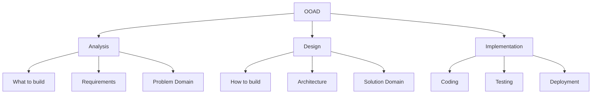

### Why OOAD?

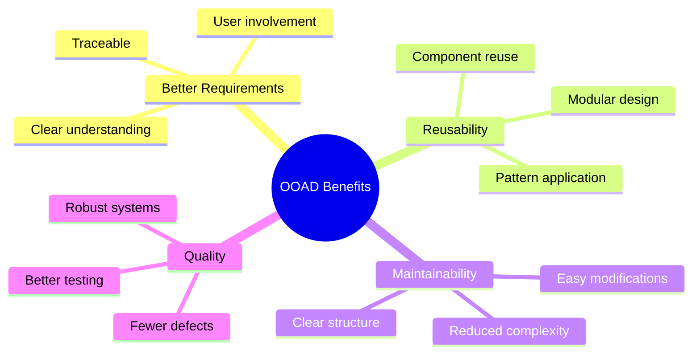

---

## OOAD Process

### Complete OOAD Workflow

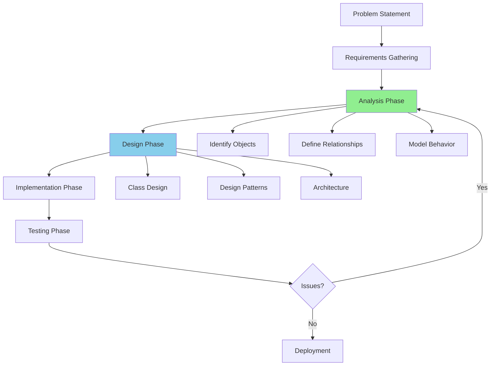

### Phases Overview

| Phase | Focus | Output | Tools |
|-------|-------|--------|-------|
| **Analysis** | What to build | Requirements, Use Cases | Use Case Diagrams, Domain Models |
| **Design** | How to build | Class Design, Architecture | Class Diagrams, Sequence Diagrams |
| **Implementation** | Building | Code | Programming Languages |
| **Testing** | Verification | Test Results | Unit Tests, Integration Tests |

---

## Analysis Phase

### Goal

Understand **WHAT** the system should do, not **HOW** it should do it.

### Activities

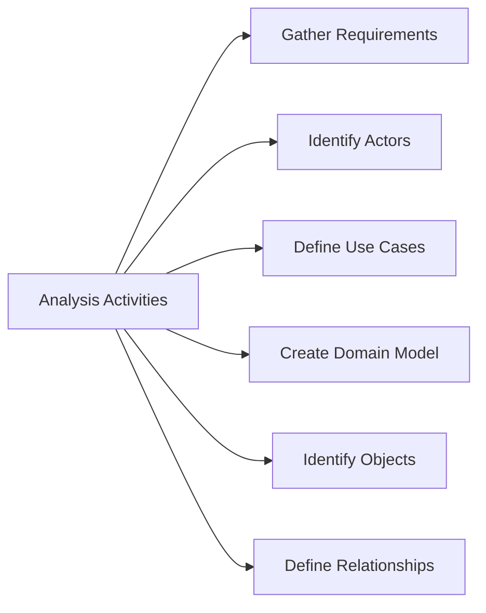

### 1. Requirements Gathering

**Functional Requirements**: What the system must do

```text
Example: Online Shopping System
- Users must be able to register and login
- Users can browse products by category
- Users can add products to cart
- Users can place orders
- System must process payments
- Admin can manage products and inventory
```

**Non-Functional Requirements**: Quality attributes

```text
Example: Online Shopping System
- Performance: Page load time < 2 seconds
- Security: Encrypted payment processing
- Scalability: Support 10,000 concurrent users
- Availability: 99.9% uptime
- Usability: Mobile-responsive interface
```

### 2. Use Case Analysis

**JavaScript Example:**

```javascript
// Documenting use cases in code
class UseCase {
    constructor(name, description, actors, preconditions, postconditions) {
        this.name = name;
        this.description = description;
        this.actors = actors;
        this.preconditions = preconditions;
        this.postconditions = postconditions;
        this.steps = [];
    }
    
    addStep(step) {
        this.steps.push(step);
    }
    
    describe() {
        console.log(`\n=== Use Case: ${this.name} ===`);
        console.log(`Description: ${this.description}`);
        console.log(`Actors: ${this.actors.join(', ')}`);
        console.log(`\nPreconditions:`);
        this.preconditions.forEach(pre => console.log(`  - ${pre}`));
        console.log(`\nSteps:`);
        this.steps.forEach((step, index) => console.log(`  ${index + 1}. ${step}`));
        console.log(`\nPostconditions:`);
        this.postconditions.forEach(post => console.log(`  - ${post}`));
    }
}

// Example: Place Order Use Case
const placeOrderUseCase = new UseCase(
    "Place Order",
    "Customer places an order for products in their cart",
    ["Customer", "Payment Gateway", "Inventory System"],
    [
        "Customer is logged in",
        "Cart contains at least one product",
        "Products are in stock"
    ],
    [
        "Order is created with unique ID",
        "Payment is processed",
        "Inventory is updated",
        "Order confirmation is sent to customer"
    ]
);

placeOrderUseCase.addStep("Customer reviews cart");
placeOrderUseCase.addStep("Customer provides shipping address");
placeOrderUseCase.addStep("Customer selects payment method");
placeOrderUseCase.addStep("System validates payment information");
placeOrderUseCase.addStep("System processes payment");
placeOrderUseCase.addStep("System creates order");
placeOrderUseCase.addStep("System updates inventory");
placeOrderUseCase.addStep("System sends confirmation email");

placeOrderUseCase.describe();
```

**Python Example:**

```python
class UseCase:
    def __init__(self, name, description, actors, preconditions, postconditions):
        self.name = name
        self.description = description
        self.actors = actors
        self.preconditions = preconditions
        self.postconditions = postconditions
        self.steps = []
    
    def add_step(self, step):
        self.steps.append(step)
    
    def describe(self):
        print(f"\n=== Use Case: {self.name} ===")
        print(f"Description: {self.description}")
        print(f"Actors: {', '.join(self.actors)}")
        print("\nPreconditions:")
        for pre in self.preconditions:
            print(f"  - {pre}")
        print("\nSteps:")
        for index, step in enumerate(self.steps, 1):
            print(f"  {index}. {step}")
        print("\nPostconditions:")
        for post in self.postconditions:
            print(f"  - {post}")

# Example: Place Order Use Case
place_order_use_case = UseCase(
    "Place Order",
    "Customer places an order for products in their cart",
    ["Customer", "Payment Gateway", "Inventory System"],
    [
        "Customer is logged in",
        "Cart contains at least one product",
        "Products are in stock"
    ],
    [
        "Order is created with unique ID",
        "Payment is processed",
        "Inventory is updated",
        "Order confirmation is sent to customer"
    ]
)

place_order_use_case.add_step("Customer reviews cart")
place_order_use_case.add_step("Customer provides shipping address")
place_order_use_case.add_step("Customer selects payment method")
place_order_use_case.add_step("System validates payment information")
place_order_use_case.add_step("System processes payment")
place_order_use_case.add_step("System creates order")
place_order_use_case.add_step("System updates inventory")
place_order_use_case.add_step("System sends confirmation email")

place_order_use_case.describe()
```

### 3. Domain Model

Identify key concepts in the problem domain.

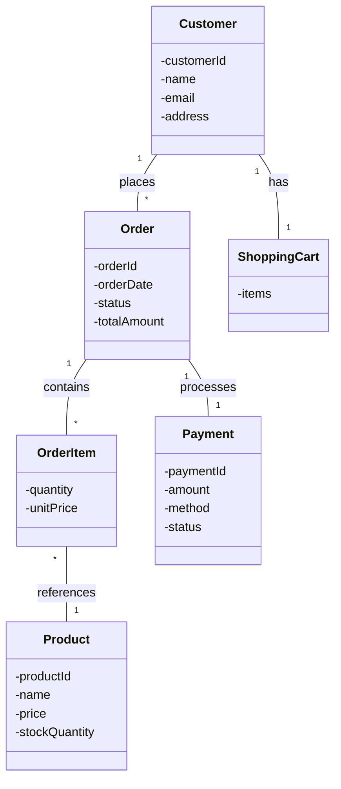

---

## Design Phase

### Goal

Determine **HOW** the system will be built to satisfy the requirements.

### Activities

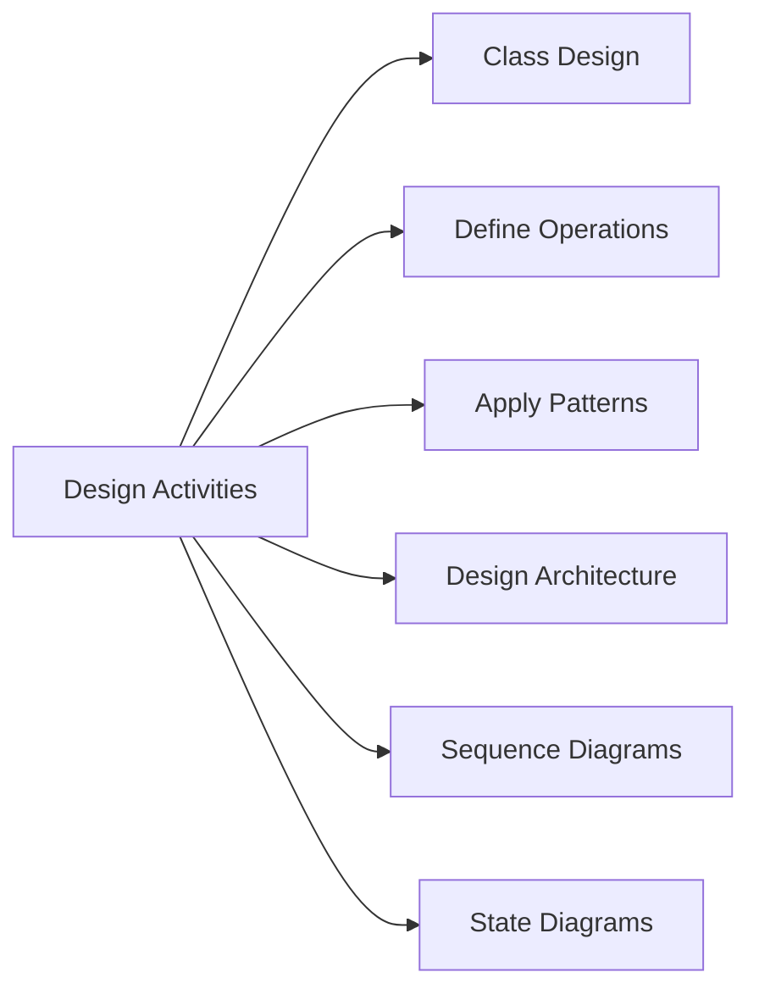

### 1. Class Design

Transform domain model into detailed class design with methods and relationships.

**JavaScript Example:**

```javascript
// Detailed class design from domain model

class Customer {
    #customerId;
    #name;
    #email;
    #address;
    #orders = [];
    #cart;
    
    constructor(customerId, name, email, address) {
        this.#customerId = customerId;
        this.#name = name;
        this.#email = email;
        this.#address = address;
        this.#cart = new ShoppingCart(this);
    }
    
    // Operations
    register(credentials) {
        // Registration logic
        console.log(`Customer ${this.#name} registered`);
    }
    
    login(credentials) {
        // Authentication logic
        console.log(`Customer ${this.#name} logged in`);
    }
    
    browseProducts(category) {
        // Browse logic
        return [];
    }
    
    addToCart(product, quantity) {
        this.#cart.addItem(product, quantity);
    }
    
    placeOrder() {
        const order = new Order(this, this.#cart.getItems());
        this.#orders.push(order);
        this.#cart.clear();
        return order;
    }
    
    getOrderHistory() {
        return this.#orders;
    }
}

class Product {
    #productId;
    #name;
    #description;
    #price;
    #stockQuantity;
    #category;
    
    constructor(productId, name, price, stockQuantity) {
        this.#productId = productId;
        this.#name = name;
        this.#price = price;
        this.#stockQuantity = stockQuantity;
    }
    
    // Operations
    isInStock() {
        return this.#stockQuantity > 0;
    }
    
    reduceStock(quantity) {
        if (quantity > this.#stockQuantity) {
            throw new Error("Insufficient stock");
        }
        this.#stockQuantity -= quantity;
    }
    
    increaseStock(quantity) {
        this.#stockQuantity += quantity;
    }
    
    getPrice() {
        return this.#price;
    }
    
    getInfo() {
        return {
            id: this.#productId,
            name: this.#name,
            price: this.#price,
            inStock: this.isInStock()
        };
    }
}

class ShoppingCart {
    #customer;
    #items = new Map();
    
    constructor(customer) {
        this.#customer = customer;
    }
    
    // Operations
    addItem(product, quantity) {
        if (!product.isInStock()) {
            throw new Error("Product out of stock");
        }
        
        if (this.#items.has(product)) {
            const currentQty = this.#items.get(product);
            this.#items.set(product, currentQty + quantity);
        } else {
            this.#items.set(product, quantity);
        }
        
        console.log(`Added ${quantity} x ${product.getInfo().name} to cart`);
    }
    
    removeItem(product) {
        this.#items.delete(product);
    }
    
    updateQuantity(product, quantity) {
        if (quantity <= 0) {
            this.removeItem(product);
        } else {
            this.#items.set(product, quantity);
        }
    }
    
    getItems() {
        return Array.from(this.#items.entries()).map(([product, quantity]) => ({
            product,
            quantity
        }));
    }
    
    calculateTotal() {
        let total = 0;
        for (const [product, quantity] of this.#items) {
            total += product.getPrice() * quantity;
        }
        return total;
    }
    
    clear() {
        this.#items.clear();
    }
}

class Order {
    #orderId;
    #customer;
    #items;
    #orderDate;
    #status;
    #totalAmount;
    #payment;
    
    constructor(customer, cartItems) {
        this.#orderId = `ORD-${Date.now()}`;
        this.#customer = customer;
        this.#items = cartItems.map(item => 
            new OrderItem(item.product, item.quantity)
        );
        this.#orderDate = new Date();
        this.#status = "PENDING";
        this.#totalAmount = this.calculateTotal();
    }
    
    // Operations
    calculateTotal() {
        return this.#items.reduce((sum, item) => sum + item.getSubtotal(), 0);
    }
    
    processPayment(paymentMethod, paymentDetails) {
        this.#payment = new Payment(this, paymentMethod, this.#totalAmount);
        const success = this.#payment.process(paymentDetails);
        
        if (success) {
            this.#status = "CONFIRMED";
            this.updateInventory();
            this.sendConfirmation();
        } else {
            this.#status = "PAYMENT_FAILED";
        }
        
        return success;
    }
    
    updateInventory() {
        this.#items.forEach(item => {
            item.getProduct().reduceStock(item.getQuantity());
        });
    }
    
    sendConfirmation() {
        console.log(`Order ${this.#orderId} confirmed and sent to customer`);
    }
    
    cancel() {
        if (this.#status === "CONFIRMED") {
            this.#status = "CANCELLED";
            // Restore inventory
            this.#items.forEach(item => {
                item.getProduct().increaseStock(item.getQuantity());
            });
        }
    }
    
    getStatus() {
        return this.#status;
    }
}

class OrderItem {
    #product;
    #quantity;
    #unitPrice;
    
    constructor(product, quantity) {
        this.#product = product;
        this.#quantity = quantity;
        this.#unitPrice = product.getPrice();
    }
    
    getSubtotal() {
        return this.#unitPrice * this.#quantity;
    }
    
    getProduct() {
        return this.#product;
    }
    
    getQuantity() {
        return this.#quantity;
    }
}

class Payment {
    #paymentId;
    #order;
    #amount;
    #method;
    #status;
    #transactionDate;
    
    constructor(order, method, amount) {
        this.#paymentId = `PAY-${Date.now()}`;
        this.#order = order;
        this.#method = method;
        this.#amount = amount;
        this.#status = "PENDING";
    }
    
    process(details) {
        // Payment processing logic
        console.log(`Processing ${this.#method} payment of $${this.#amount}`);
        
        // Simulate payment gateway
        const success = this.#validatePayment(details);
        
        if (success) {
            this.#status = "COMPLETED";
            this.#transactionDate = new Date();
            console.log(`Payment ${this.#paymentId} successful`);
        } else {
            this.#status = "FAILED";
            console.log(`Payment ${this.#paymentId} failed`);
        }
        
        return success;
    }
    
    #validatePayment(details) {
        // Validation logic
        return true; // Simplified
    }
    
    refund() {
        if (this.#status === "COMPLETED") {
            this.#status = "REFUNDED";
            console.log(`Payment ${this.#paymentId} refunded`);
            return true;
        }
        return false;
    }
}

// Usage Example
console.log("=== E-Commerce System Demo ===\n");

// Create products
const laptop = new Product("P001", "Laptop", 999.99, 10);
const mouse = new Product("P002", "Wireless Mouse", 29.99, 50);

// Create customer
const customer = new Customer("C001", "John Doe", "john@example.com", "123 Main St");

// Customer shops
customer.addToCart(laptop, 1);
customer.addToCart(mouse, 2);

// Place order
const order = customer.placeOrder();
console.log(`\nOrder ${order.getStatus()} - Total: $${order.calculateTotal()}`);

// Process payment
order.processPayment("CREDIT_CARD", { cardNumber: "****1234" });
console.log(`Order status: ${order.getStatus()}`);
```

### 2. Apply Design Patterns

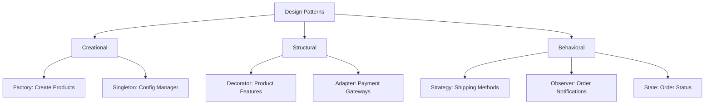

### 3. Sequence Diagrams

Model interactions between objects over time.

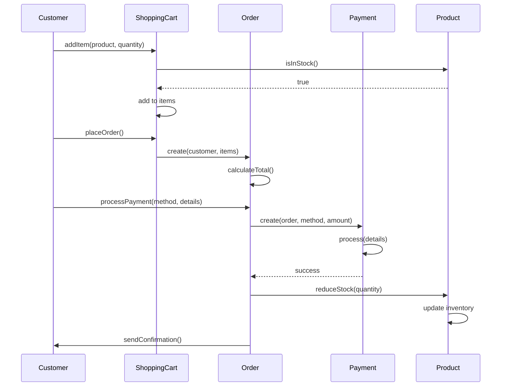

---

## Analysis vs Design

### Key Differences

| Aspect | Analysis | Design |
|--------|----------|--------|
| **Focus** | What to build | How to build |
| **Goal** | Understand requirements | Create solution |
| **Output** | Use cases, domain model | Class diagrams, sequence diagrams |
| **Level** | Conceptual | Technical |
| **Stakeholders** | Business users | Developers |
| **Abstraction** | High-level | Detailed |
| **Changes** | Expensive if wrong | Less expensive |

### Visual Comparison

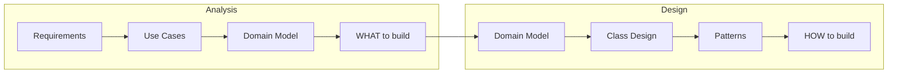

---

## Key Techniques

### 1. CRC Cards (Class-Responsibility-Collaboration)

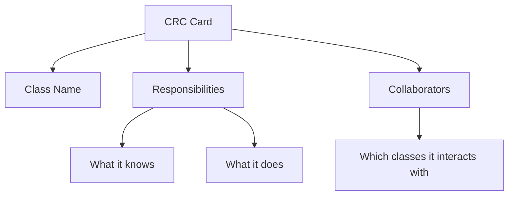

### 2. User Stories

```text
Format: As a [role], I want [feature], so that [benefit]

Examples:
- As a customer, I want to search for products by category, 
  so that I can find what I need quickly.
  
- As an admin, I want to manage inventory levels, 
  so that I can prevent stockouts.
  
- As a customer, I want to save items to a wishlist, 
  so that I can purchase them later.
```

### 3. Noun-Verb Analysis

Extract nouns (potential classes) and verbs (potential methods) from requirements.

```text
Example Requirement:
"The customer browses products, adds them to cart, and places an order. 
The system processes payment and sends confirmation."

Nouns (Classes):
- Customer
- Product
- Cart
- Order
- Payment
- Confirmation

Verbs (Methods):
- browse()
- add()
- place()
- process()
- send()
```

---

## Real-World Example

### Complete OOAD for Library Management System

#### Phase 1: Analysis

**Requirements:**
- Members can borrow and return books
- Librarians manage book catalog
- System tracks due dates and fines
- Members can reserve books

**Use Cases:**
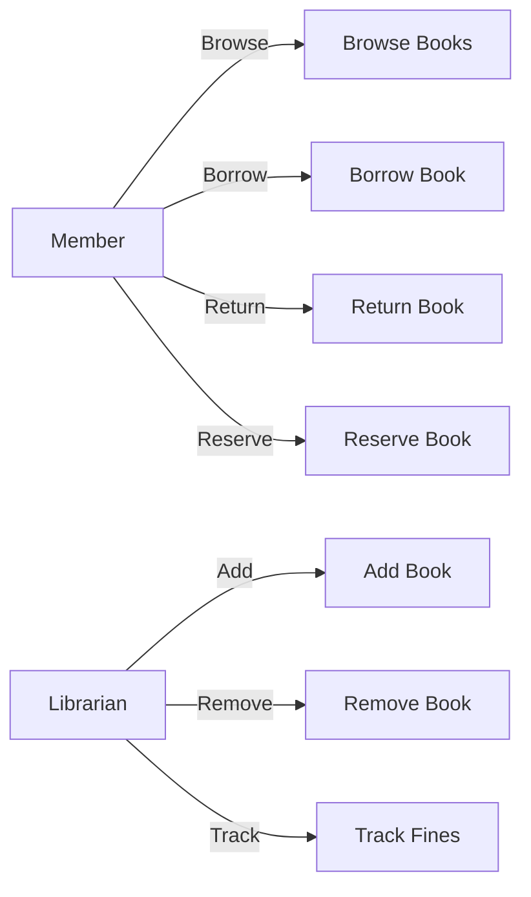

**Domain Model:**
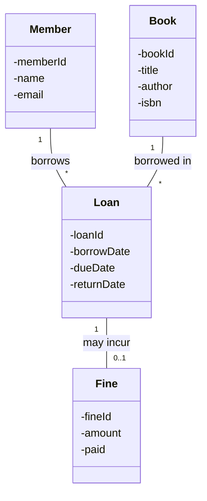

#### Phase 2: Design

**Detailed Class Design with Operations:**

```javascript
class Member {
    #memberId;
    #name;
    #email;
    #activeLoans = [];
    #loanHistory = [];
    #fines = [];
    
    constructor(memberId, name, email) {
        this.#memberId = memberId;
        this.#name = name;
        this.#email = email;
    }
    
    borrowBook(book) {
        if (this.#hasUnpaidFines()) {
            throw new Error("Cannot borrow: unpaid fines exist");
        }
        
        if (this.#activeLoans.length >= 5) {
            throw new Error("Maximum loan limit reached");
        }
        
        const loan = new Loan(this, book);
        this.#activeLoans.push(loan);
        book.setAvailable(false);
        
        console.log(`${this.#name} borrowed "${book.getTitle()}"`);
        return loan;
    }
    
    returnBook(loan) {
        loan.markReturned();
        this.#activeLoans = this.#activeLoans.filter(l => l !== loan);
        this.#loanHistory.push(loan);
        
        if (loan.isOverdue()) {
            const fine = loan.calculateFine();
            this.#fines.push(fine);
        }
        
        loan.getBook().setAvailable(true);
        console.log(`${this.#name} returned "${loan.getBook().getTitle()}"`);
    }
    
    #hasUnpaidFines() {
        return this.#fines.some(fine => !fine.isPaid());
    }
    
    getActiveLoans() {
        return this.#activeLoans;
    }
    
    getTotalFines() {
        return this.#fines
            .filter(fine => !fine.isPaid())
            .reduce((sum, fine) => sum + fine.getAmount(), 0);
    }
}

class Book {
    #bookId;
    #title;
    #author;
    #isbn;
    #available;
    
    constructor(bookId, title, author, isbn) {
        this.#bookId = bookId;
        this.#title = title;
        this.#author = author;
        this.#isbn = isbn;
        this.#available = true;
    }
    
    isAvailable() {
        return this.#available;
    }
    
    setAvailable(available) {
        this.#available = available;
    }
    
    getTitle() {
        return this.#title;
    }
    
    getInfo() {
        return {
            id: this.#bookId,
            title: this.#title,
            author: this.#author,
            isbn: this.#isbn,
            available: this.#available
        };
    }
}

class Loan {
    #loanId;
    #member;
    #book;
    #borrowDate;
    #dueDate;
    #returnDate;
    
    constructor(member, book) {
        this.#loanId = `LOAN-${Date.now()}`;
        this.#member = member;
        this.#book = book;
        this.#borrowDate = new Date();
        this.#dueDate = new Date(Date.now() + 14 * 24 * 60 * 60 * 1000); // 14 days
        this.#returnDate = null;
    }
    
    markReturned() {
        this.#returnDate = new Date();
    }
    
    isOverdue() {
        const checkDate = this.#returnDate || new Date();
        return checkDate > this.#dueDate;
    }
    
    getDaysOverdue() {
        if (!this.isOverdue()) return 0;
        
        const checkDate = this.#returnDate || new Date();
        const diffTime = Math.abs(checkDate - this.#dueDate);
        return Math.ceil(diffTime / (1000 * 60 * 60 * 24));
    }
    
    calculateFine() {
        if (!this.isOverdue()) return null;
        
        const daysOverdue = this.getDaysOverdue();
        const amount = daysOverdue * 0.50; // $0.50 per day
        return new Fine(this, amount);
    }
    
    getBook() {
        return this.#book;
    }
}

class Fine {
    #fineId;
    #loan;
    #amount;
    #paid;
    
    constructor(loan, amount) {
        this.#fineId = `FINE-${Date.now()}`;
        this.#loan = loan;
        this.#amount = amount;
        this.#paid = false;
    }
    
    pay() {
        this.#paid = true;
        console.log(`Fine of $${this.#amount.toFixed(2)} paid`);
    }
    
    isPaid() {
        return this.#paid;
    }
    
    getAmount() {
        return this.#amount;
    }
}

// Demo
const member = new Member("M001", "Alice", "alice@example.com");
const book1 = new Book("B001", "Clean Code", "Robert Martin", "978-0132350884");
const book2 = new Book("B002", "Design Patterns", "Gang of Four", "978-0201633610");

const loan1 = member.borrowBook(book1);
const loan2 = member.borrowBook(book2);

console.log(`\nActive loans: ${member.getActiveLoans().length}`);

// Return books
member.returnBook(loan1);
console.log(`\nActive loans: ${member.getActiveLoans().length}`);
console.log(`Total fines: $${member.getTotalFines().toFixed(2)}`);
```

---

## OOAD Best Practices

### 1. Start with Requirements

```javascript
// ✅ GOOD: Clear requirements first
/*
Requirements:
1. User can create account
2. User can post messages
3. User can follow other users
4. User can see feed of followed users' posts
*/

class SocialMediaSystem {
    // Implementation based on clear requirements
}

// ❌ BAD: Jump to implementation without understanding requirements
class System {
    // Random methods without clear purpose
}
```

### 2. Use Iterative Approach

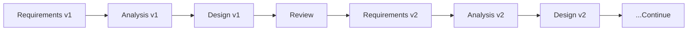

### 3. Focus on Objects, Not Functions

```javascript
// ✅ GOOD: Object-oriented thinking
class Order {
    calculateTotal() { }
    applyDiscount() { }
    process() { }
}

// ❌ BAD: Procedural thinking
function calculateOrderTotal(order) { }
function applyOrderDiscount(order, discount) { }
function processOrder(order) { }
```

### 4. Maintain Traceability

```text
Requirement → Use Case → Domain Object → Class → Code

Example:
Requirement: "Users can search for products"
  ↓
Use Case: "Search Products by Keyword"
  ↓
Domain Objects: User, Product, SearchService
  ↓
Classes: User, Product, SearchService, SearchResult
  ↓
Code: Implemented search functionality
```

### 5. Review and Refactor

```javascript
// Continuous improvement through refactoring
class OrderProcessor {
    // Initial design
    processOrder(order) {
        // All logic here
    }
    
    // After review: Break into smaller methods
    processOrder(order) {
        this.validateOrder(order);
        this.calculateTotal(order);
        this.processPayment(order);
        this.updateInventory(order);
        this.sendConfirmation(order);
    }
    
    validateOrder(order) { }
    calculateTotal(order) { }
    processPayment(order) { }
    updateInventory(order) { }
    sendConfirmation(order) { }
}
```

---

## Common Mistakes

### Mistake 1: Skipping Analysis

```text
❌ BAD: Jump directly to coding
Problem → Code (No analysis/design)

✅ GOOD: Follow OOAD process
Problem → Requirements → Analysis → Design → Code
```

### Mistake 2: Analysis Paralysis

```text
❌ BAD: Spend months in analysis/design
Over-document, over-design, never code

✅ GOOD: Iterative approach
Minimal viable analysis → Design → Code → Feedback → Refine
```

### Mistake 3: God Classes

```javascript
// ❌ BAD: One class does everything
class System {
    manageUsers() { }
    manageProducts() { }
    processOrders() { }
    handlePayments() { }
    sendEmails() { }
    generateReports() { }
    // ... 50 more methods
}

// ✅ GOOD: Single Responsibility
class UserManager { }
class ProductManager { }
class OrderProcessor { }
class PaymentService { }
class EmailService { }
class ReportGenerator { }
```

---

## Interview Questions

### Q1: What is OOAD?

**Answer**: OOAD (Object-Oriented Analysis and Design) is a systematic approach to software development that uses object-oriented principles for analyzing requirements, designing solutions, and implementing systems. It focuses on identifying objects, their attributes, behaviors, and relationships.

### Q2: What's the difference between OOA and OOD?

**Answer**:
- **OOA (Analysis)**: Focuses on understanding **WHAT** the system should do. Output: requirements, use cases, domain model
- **OOD (Design)**: Focuses on determining **HOW** the system will be built. Output: class diagrams, sequence diagrams, architecture

### Q3: What are the key activities in OOAD?

**Answer**:
1. **Requirements Gathering**: Understanding what needs to be built
2. **Use Case Analysis**: Identifying actors and their interactions
3. **Domain Modeling**: Identifying key concepts and relationships
4. **Class Design**: Defining classes with attributes and methods
5. **Applying Patterns**: Using design patterns for common problems
6. **Creating Diagrams**: Visualizing design with UML

### Q4: Why is OOAD important?

**Answer**:
- **Better Understanding**: Clear requirements and design
- **Reusability**: Modular, reusable components
- **Maintainability**: Easy to modify and extend
- **Quality**: Fewer defects, better testing
- **Communication**: Common language for stakeholders

### Q5: How do you identify classes in OOAD?

**Answer**:
1. **Noun Analysis**: Extract nouns from requirements (potential classes)
2. **Responsibility**: What should each class know and do?
3. **Collaboration**: Which classes work together?
4. **Domain Knowledge**: Real-world entities
5. **Patterns**: Common design patterns
6. **Refactoring**: Continuous refinement

### Q6: What is the difference between domain model and class diagram?

**Answer**:
- **Domain Model**: Conceptual, shows entities and relationships in problem domain, created during analysis
- **Class Diagram**: Technical, shows classes with attributes/methods, created during design, includes implementation details

---

## Summary

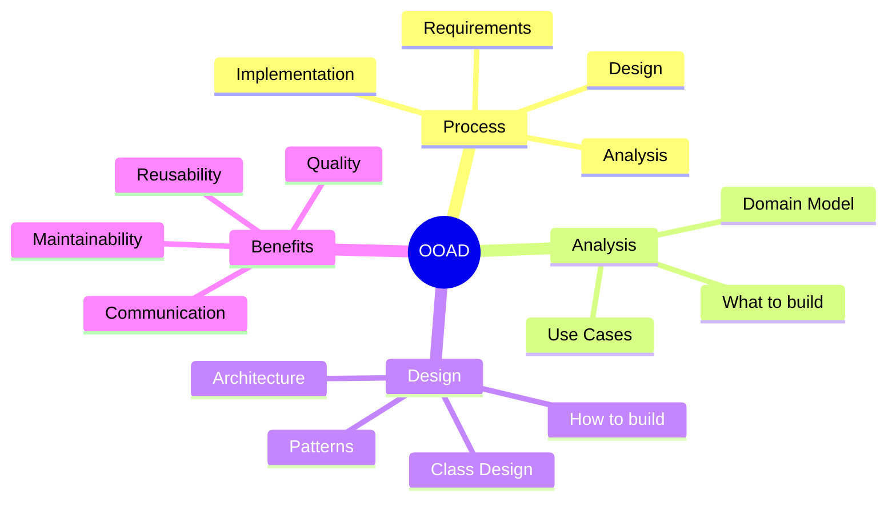

---

## Next Steps

1. **Study**: [UML Introduction](./uml-introduction.md)
2. **Study**: [Use Case Diagrams](./use-case-diagram.md)
3. **Study**: [Class Diagrams](./class-diagram.md)
4. **Practice**: Apply OOAD to a small project
5. **Review**: Design patterns and SOLID principles

---

**Key Takeaway**: OOAD provides a systematic, iterative approach to building software that is maintainable, reusable, and aligned with business requirements. Always understand the problem (Analysis) before jumping into the solution (Design)!

