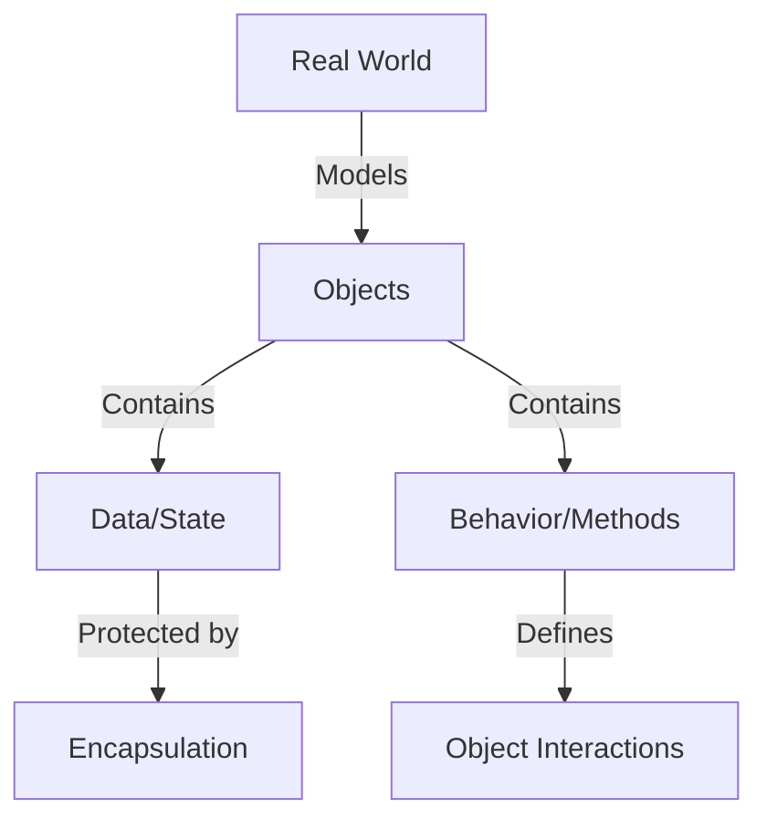
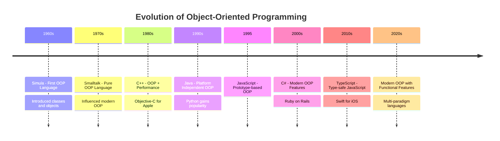
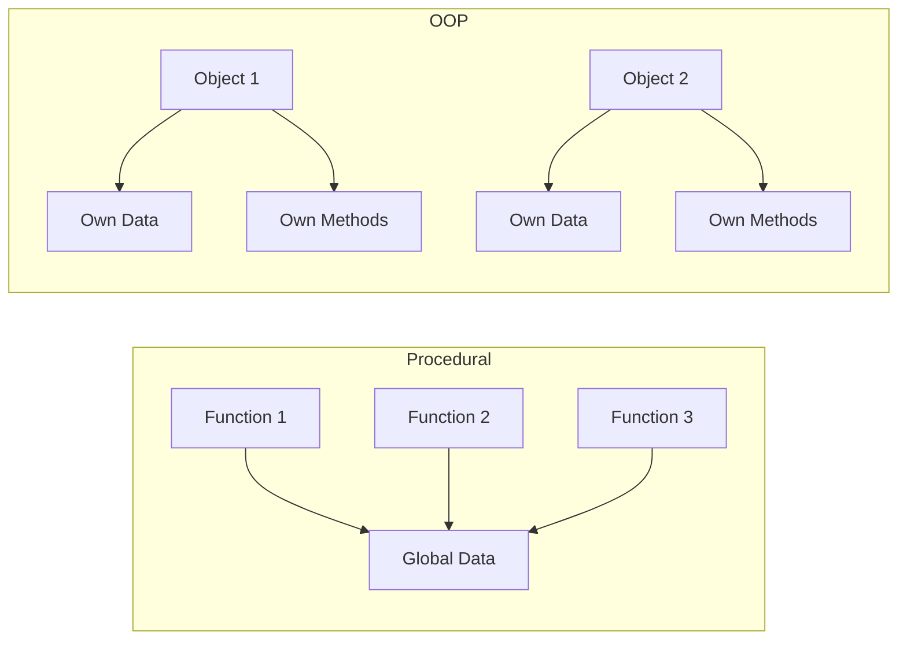
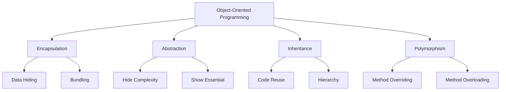
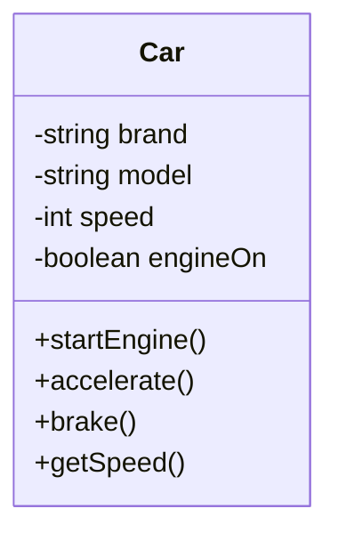
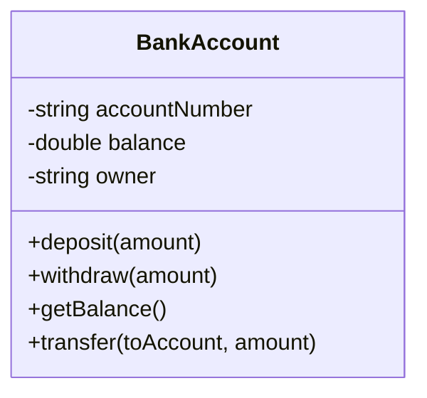
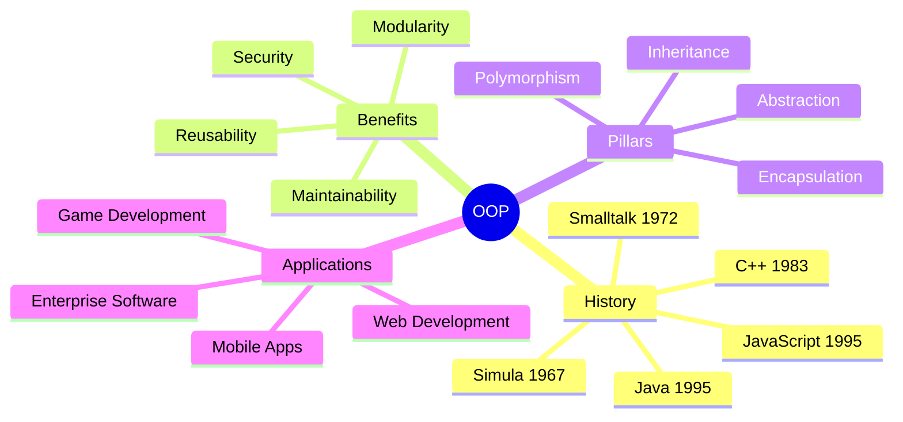

# Background of Object-Oriented Programming (OOP)

**Purpose**: Understanding the history, evolution, and fundamental concepts of Object-Oriented Programming to build a strong foundation for system design interviews.

---

## Table of Contents

1. [What is OOP?](#what-is-oop)
2. [History and Evolution](#history-and-evolution)
3. [Why OOP?](#why-oop)
4. [OOP vs Procedural Programming](#oop-vs-procedural-programming)
5. [Core Concepts Overview](#core-concepts-overview)
6. [Real-World Analogies](#real-world-analogies)
7. [Benefits of OOP](#benefits-of-oop)
8. [Limitations of OOP](#limitations-of-oop)
9. [Interview Questions](#interview-questions)

---

## What is OOP?

**Object-Oriented Programming (OOP)** is a programming paradigm based on the concept of "objects" that contain data (attributes/properties) and code (methods/functions). Objects represent real-world entities and their interactions.

### Key Definition

> OOP is a methodology that organizes software design around data (objects) rather than functions and logic. It focuses on the objects that developers want to manipulate rather than the logic required to manipulate them.

### Core Philosophy



---

## History and Evolution

### Timeline of OOP Development



### Pioneering Languages

#### 1. **Simula (1967)**

- First language to introduce classes and objects
- Developed for simulation purposes
- Foundation for modern OOP

#### 2. **Smalltalk (1972)**

- Pure object-oriented language
- Everything is an object
- Influenced Java, Ruby, Python

#### 3. **C++ (1983)**

- Extended C with OOP features
- Performance + OOP
- Widely used in systems programming

#### 4. **Java (1995)**

- "Write Once, Run Anywhere"
- Simplified C++ complexity
- Enterprise adoption

#### 5. **JavaScript (1995)**

- Prototype-based OOP
- Initially for web browsers
- Now full-stack with Node.js

---

## Why OOP?

### Problems with Procedural Programming

**Before OOP (Procedural Approach):**

```javascript
// Procedural approach - Data and functions are separate
let accountNumber1 = "ACC001";
let balance1 = 1000;
let accountNumber2 = "ACC002";
let balance2 = 2000;

function deposit(accountNumber, balance, amount) {
    balance += amount;
    return balance;
}

function withdraw(accountNumber, balance, amount) {
    if (balance >= amount) {
        balance -= amount;
        return balance;
    }
    throw new Error("Insufficient funds");
}

// Problems:
// 1. Data is scattered and not organized
// 2. No relationship between data and operations
// 3. Hard to maintain and scale
// 4. No data protection
```

```python
# Procedural approach - Data and functions are separate
account_number1 = "ACC001"
balance1 = 1000
account_number2 = "ACC002"
balance2 = 2000

def deposit(account_number, balance, amount):
    balance += amount
    return balance

def withdraw(account_number, balance, amount):
    if balance >= amount:
        balance -= amount
        return balance
    raise Exception("Insufficient funds")

# Same problems as JavaScript example
```

**With OOP (Object-Oriented Approach):**

```javascript
// OOP approach - Data and methods together
class BankAccount {
    #balance; // Private field
    
    constructor(accountNumber, initialBalance) {
        this.accountNumber = accountNumber;
        this.#balance = initialBalance;
    }
    
    deposit(amount) {
        if (amount > 0) {
            this.#balance += amount;
            return true;
        }
        return false;
    }
    
    withdraw(amount) {
        if (this.#balance >= amount && amount > 0) {
            this.#balance -= amount;
            return true;
        }
        throw new Error("Insufficient funds");
    }
    
    getBalance() {
        return this.#balance;
    }
}

// Usage
const account1 = new BankAccount("ACC001", 1000);
const account2 = new BankAccount("ACC002", 2000);

account1.deposit(500);
console.log(account1.getBalance()); // 1500

// Benefits:
// 1. Data and behavior bundled together
// 2. Clear relationship and organization
// 3. Data protection (private fields)
// 4. Easy to maintain and extend
```

```python
# OOP approach - Data and methods together
class BankAccount:
    def __init__(self, account_number, initial_balance):
        self.account_number = account_number
        self.__balance = initial_balance  # Private attribute
    
    def deposit(self, amount):
        if amount > 0:
            self.__balance += amount
            return True
        return False
    
    def withdraw(self, amount):
        if self.__balance >= amount and amount > 0:
            self.__balance -= amount
            return True
        raise Exception("Insufficient funds")
    
    def get_balance(self):
        return self.__balance

# Usage
account1 = BankAccount("ACC001", 1000)
account2 = BankAccount("ACC002", 2000)

account1.deposit(500)
print(account1.get_balance())  # 1500
```

---

## OOP vs Procedural Programming

### Comparison Table

| Aspect | Procedural Programming | Object-Oriented Programming |
|--------|------------------------|----------------------------|
| **Focus** | Functions and logic | Objects and data |
| **Data** | Global, shared data | Encapsulated within objects |
| **Code Reuse** | Function calls | Inheritance and composition |
| **Approach** | Top-down | Bottom-up |
| **Access Control** | Limited | Strong (public, private, protected) |
| **Maintenance** | Harder for large systems | Easier due to modularity |
| **Real-world Modeling** | Difficult | Natural and intuitive |
| **Examples** | C, Pascal, Fortran | Java, Python, JavaScript, C++ |

### Visual Comparison



---

## Core Concepts Overview

### The Four Pillars of OOP



### 1. **Encapsulation**

Bundling data and methods that operate on that data within a single unit (class), and controlling access to that data.

### 2. **Abstraction**

Hiding complex implementation details and showing only the necessary features of an object.

### 3. **Inheritance**

Mechanism where a new class derives properties and behavior from an existing class.

### 4. **Polymorphism**

Ability of objects to take multiple forms or ability to process objects differently based on their class type.

---

## Real-World Analogies

### 1. Car as an Object



**JavaScript Example:**

```javascript
class Car {
    #speed = 0;
    #engineOn = false;
    
    constructor(brand, model) {
        this.brand = brand;
        this.model = model;
    }
    
    startEngine() {
        this.#engineOn = true;
        console.log(`${this.brand} ${this.model} engine started`);
    }
    
    accelerate(amount) {
        if (this.#engineOn) {
            this.#speed += amount;
            console.log(`Speed: ${this.#speed} km/h`);
        } else {
            console.log("Start engine first!");
        }
    }
    
    brake(amount) {
        this.#speed = Math.max(0, this.#speed - amount);
        console.log(`Speed: ${this.#speed} km/h`);
    }
    
    getSpeed() {
        return this.#speed;
    }
}

// Usage
const myCar = new Car("Toyota", "Camry");
myCar.startEngine();
myCar.accelerate(50);
myCar.brake(20);
```

**Python Example:**

```python
class Car:
    def __init__(self, brand, model):
        self.brand = brand
        self.model = model
        self.__speed = 0
        self.__engine_on = False
    
    def start_engine(self):
        self.__engine_on = True
        print(f"{self.brand} {self.model} engine started")
    
    def accelerate(self, amount):
        if self.__engine_on:
            self.__speed += amount
            print(f"Speed: {self.__speed} km/h")
        else:
            print("Start engine first!")
    
    def brake(self, amount):
        self.__speed = max(0, self.__speed - amount)
        print(f"Speed: {self.__speed} km/h")
    
    def get_speed(self):
        return self.__speed

# Usage
my_car = Car("Toyota", "Camry")
my_car.start_engine()
my_car.accelerate(50)
my_car.brake(20)
```

### 2. Bank Account System



---

## Benefits of OOP

### 1. **Modularity**

Code is organized into self-contained objects, making it easier to manage and understand.

```javascript
// Each class is a module
class User { /* ... */ }
class Order { /* ... */ }
class Payment { /* ... */ }
```

### 2. **Reusability**

Through inheritance and composition, code can be reused across different parts of the application.

```javascript
class Animal {
    eat() { console.log("Eating..."); }
}

class Dog extends Animal {
    bark() { console.log("Woof!"); }
}

const dog = new Dog();
dog.eat();  // Reused from Animal
dog.bark(); // Dog-specific
```

### 3. **Flexibility and Extensibility**

Easy to add new features without modifying existing code.

```javascript
// Open for extension
class PaymentProcessor {
    processPayment(amount) { /* base implementation */ }
}

class CreditCardPayment extends PaymentProcessor {
    processPayment(amount) {
        // Extended functionality
        console.log(`Processing credit card payment: $${amount}`);
    }
}
```

### 4. **Maintainability**

Changes are localized to specific objects, reducing the risk of affecting other parts of the system.

### 5. **Data Security**

Through encapsulation, data can be protected from unauthorized access.

```javascript
class SecureData {
    #privateKey;
    
    constructor(key) {
        this.#privateKey = key;
    }
    
    // Controlled access
    getData(password) {
        if (this.#validatePassword(password)) {
            return this.#privateKey;
        }
        throw new Error("Access denied");
    }
    
    #validatePassword(password) {
        return password === "secret123";
    }
}
```

### 6. **Problem Solving**

OOP mirrors real-world scenarios, making it easier to conceptualize and solve problems.

---

## Limitations of OOP

### 1. **Steeper Learning Curve**

- Requires understanding of concepts like inheritance, polymorphism
- More abstract than procedural programming

### 2. **Performance Overhead**

- Object creation and method calls can be slower
- More memory usage due to object overhead

### 3. **Over-Engineering Risk**

- Can lead to unnecessarily complex designs
- "Everything as an object" can be overkill for simple problems

### 4. **Not Always the Best Fit**

- Simple scripts or data processing might be better with procedural
- Functional programming might be better for certain scenarios

### When to Use OOP

✅ **Use OOP when:**

- Building large, complex applications
- Need code reusability and maintainability
- Modeling real-world entities
- Team collaboration on large projects
- Long-term maintenance is required

❌ **Avoid OOP when:**

- Writing simple scripts
- Performance is critical (real-time systems)
- Problem is naturally procedural
- Small, one-off utilities

---

## Interview Questions

### Basic Questions

#### Q1: What is Object-Oriented Programming?

**Answer:** OOP is a programming paradigm that organizes software design around objects (data) rather than functions and logic. It focuses on creating reusable code through concepts like encapsulation, abstraction, inheritance, and polymorphism.

#### Q2: What are the main advantages of OOP?

**Answer:**

1. **Modularity**: Code is organized into self-contained objects
2. **Reusability**: Through inheritance and composition
3. **Maintainability**: Easy to update and fix
4. **Scalability**: Easy to extend functionality
5. **Security**: Data hiding through encapsulation

#### Q3: What is the difference between OOP and Procedural Programming?

**Answer:**

| OOP | Procedural |
|-----|------------|
| Focuses on objects | Focuses on functions |
| Bottom-up approach | Top-down approach |
| Data and methods bundled | Data and functions separate |
| Supports inheritance | No inheritance |
| Better for large systems | Better for simple tasks |

### Intermediate Questions

#### Q4: Explain the concept of a class and an object?

**Answer:**

- **Class**: A blueprint or template that defines the structure and behavior of objects
- **Object**: An instance of a class with actual values

```javascript
// Class - Blueprint
class Person {
    constructor(name, age) {
        this.name = name;
        this.age = age;
    }
}

// Objects - Instances
const person1 = new Person("Alice", 30);
const person2 = new Person("Bob", 25);
```

#### Q5: What are the four pillars of OOP?

**Answer:** The four pillars are:

1. **Encapsulation**: Bundling data and methods, hiding internal state
2. **Abstraction**: Hiding complexity, showing only essential features
3. **Inheritance**: Deriving new classes from existing ones
4. **Polymorphism**: Same interface, different implementations

### Advanced Questions

#### Q6: When would you choose composition over inheritance?

**Answer:**

**Composition** is preferred when:

- Objects have a "has-a" relationship rather than "is-a"
- Need flexibility to change behavior at runtime
- Want to avoid deep inheritance hierarchies

```javascript
// Composition example
class Engine {
    start() { console.log("Engine starting"); }
}

class Car {
    constructor() {
        this.engine = new Engine(); // Has-a relationship
    }
    
    start() {
        this.engine.start();
    }
}
```

#### Q7: How does OOP support the SOLID principles?

**Answer:**

- **S (Single Responsibility)**: Each class has one purpose
- **O (Open/Closed)**: Open for extension via inheritance
- **L (Liskov Substitution)**: Subclasses can replace parent classes
- **I (Interface Segregation)**: Interfaces define specific contracts
- **D (Dependency Inversion)**: Depend on abstractions, not concrete classes

---

## Summary



---

## Next Steps

1. **Study**: [Encapsulation](./encapsulation.md)
2. **Study**: [Abstraction](./abstraction.md)
3. **Study**: [Inheritance](./inheritance.md)
4. **Study**: [Polymorphism](./polymorphism.md)
5. **Practice**: Implement simple OOP examples in your preferred language

---

**Note**: This document provides the foundation for understanding OOP. Each core concept will be explored in detail in separate documents.
