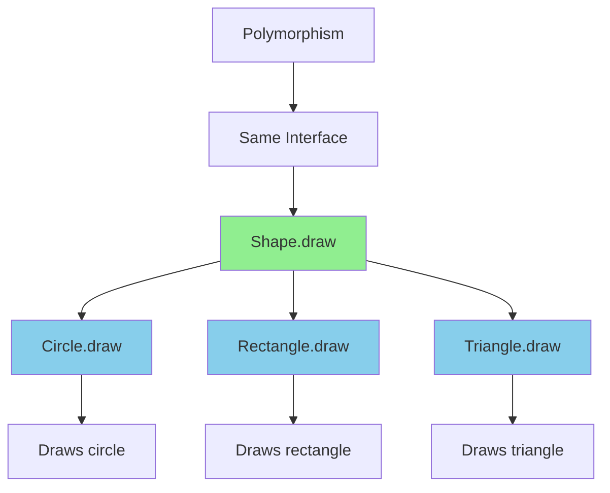
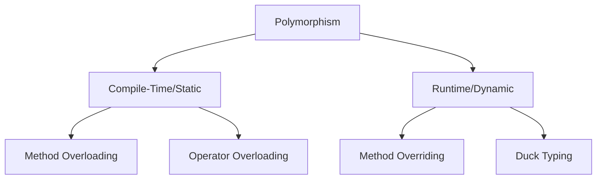
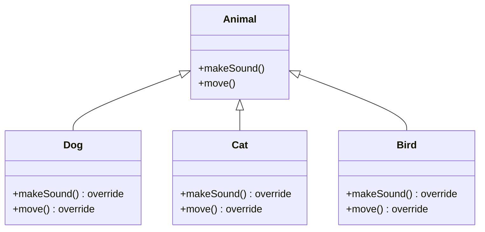
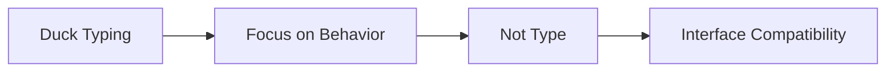
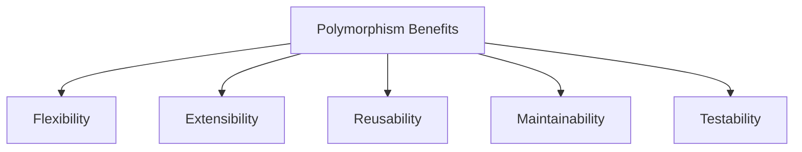
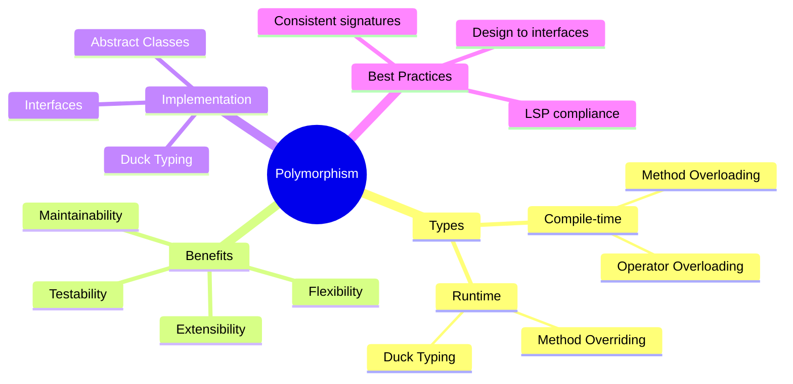

# Polymorphism

**Purpose**: Master polymorphism - the ability of objects to take multiple forms and behave differently based on their actual type while sharing a common interface.

---

## Table of Contents

1. [What is Polymorphism?](#what-is-polymorphism)
2. [Types of Polymorphism](#types-of-polymorphism)
3. [Compile-Time Polymorphism](#compile-time-polymorphism)
4. [Runtime Polymorphism](#runtime-polymorphism)
5. [Duck Typing](#duck-typing)
6. [Real-World Examples](#real-world-examples)
7. [Benefits](#benefits)
8. [Best Practices](#best-practices)
9. [Common Mistakes](#common-mistakes)
10. [Interview Questions](#interview-questions)

---

## What is Polymorphism?

**Polymorphism** (from Greek: "many forms") is the ability of objects of different classes to respond to the same method call in their own way. It allows a single interface to represent different underlying forms (data types).

### Key Definition

> Polymorphism enables objects of different types to be accessed through the same interface, with each type providing its own implementation of that interface.

### Visual Representation



---

## Types of Polymorphism



---

## Compile-Time Polymorphism

### Method Overloading

Same method name with different parameters (count, type, or order).

**Note**: JavaScript doesn't support traditional method overloading, but we can simulate it.

**JavaScript Example (Simulation):**

```javascript
class Calculator {
    // Simulate method overloading using rest parameters and type checking
    add(...args) {
        if (args.length === 2 && typeof args[0] === 'number' && typeof args[1] === 'number') {
            // add(a, b)
            return args[0] + args[1];
        } else if (args.length === 3) {
            // add(a, b, c)
            return args[0] + args[1] + args[2];
        } else if (args.length === 1 && Array.isArray(args[0])) {
            // add([a, b, c, ...])
            return args[0].reduce((sum, num) => sum + num, 0);
        } else if (args.length === 2 && typeof args[0] === 'string') {
            // add(str1, str2)
            return args[0] + args[1];
        }
        throw new Error("Invalid arguments");
    }
    
    multiply(...args) {
        if (args.length === 2) {
            return args[0] * args[1];
        } else if (args.length === 1 && Array.isArray(args[0])) {
            return args[0].reduce((product, num) => product * num, 1);
        }
        throw new Error("Invalid arguments");
    }
}

// Usage
const calc = new Calculator();
console.log(calc.add(5, 3));              // 8
console.log(calc.add(5, 3, 2));           // 10
console.log(calc.add([1, 2, 3, 4]));      // 10
console.log(calc.add("Hello", " World")); // "Hello World"

console.log(calc.multiply(5, 3));         // 15
console.log(calc.multiply([2, 3, 4]));    // 24
```

**Python Example (True Overloading with functools):**

```python
from functools import singledispatchmethod

class Calculator:
    @singledispatchmethod
    def add(self, arg):
        raise NotImplementedError("Cannot add this type")
    
    @add.register(int)
    @add.register(float)
    def _(self, a, b=0):
        return a + b
    
    @add.register(list)
    def _(self, numbers):
        return sum(numbers)
    
    @add.register(str)
    def _(self, s1, s2=""):
        return s1 + s2

# Usage
calc = Calculator()
print(calc.add(5, 3))              # 8
print(calc.add([1, 2, 3, 4]))      # 10
print(calc.add("Hello", " World")) # "Hello World"

# Alternative: Using default parameters
class SimpleCalculator:
    def add(self, a, b=None, c=None):
        if b is None:
            return a
        elif c is None:
            return a + b
        else:
            return a + b + c
    
    def multiply(self, *args):
        result = 1
        for num in args:
            result *= num
        return result

calc2 = SimpleCalculator()
print(calc2.add(5))           # 5
print(calc2.add(5, 3))        # 8
print(calc2.add(5, 3, 2))     # 10
print(calc2.multiply(2, 3, 4)) # 24
```

### Operator Overloading

**Python Example:**

```python
class Vector:
    def __init__(self, x, y):
        self.x = x
        self.y = y
    
    # Overload + operator
    def __add__(self, other):
        return Vector(self.x + other.x, self.y + other.y)
    
    # Overload - operator
    def __sub__(self, other):
        return Vector(self.x - other.x, self.y - other.y)
    
    # Overload * operator (scalar multiplication)
    def __mul__(self, scalar):
        return Vector(self.x * scalar, self.y * scalar)
    
    # Overload == operator
    def __eq__(self, other):
        return self.x == other.x and self.y == other.y
    
    # Overload str() function
    def __str__(self):
        return f"Vector({self.x}, {self.y})"
    
    # Overload len() function
    def __len__(self):
        return int((self.x ** 2 + self.y ** 2) ** 0.5)

# Usage
v1 = Vector(3, 4)
v2 = Vector(1, 2)

v3 = v1 + v2  # Uses __add__
print(v3)     # Vector(4, 6)

v4 = v1 - v2  # Uses __sub__
print(v4)     # Vector(2, 2)

v5 = v1 * 2   # Uses __mul__
print(v5)     # Vector(6, 8)

print(v1 == v2)  # False (uses __eq__)
print(len(v1))    # 5 (uses __len__)
```

**JavaScript Example (Symbol-based):**

```javascript
class Vector {
    constructor(x, y) {
        this.x = x;
        this.y = y;
    }
    
    // Custom addition method
    add(other) {
        return new Vector(this.x + other.x, this.y + other.y);
    }
    
    subtract(other) {
        return new Vector(this.x - other.x, this.y - other.y);
    }
    
    multiply(scalar) {
        return new Vector(this.x * scalar, this.y * scalar);
    }
    
    // Override toString
    toString() {
        return `Vector(${this.x}, ${this.y})`;
    }
    
    // Override valueOf for numeric operations
    valueOf() {
        return Math.sqrt(this.x ** 2 + this.y ** 2);
    }
    
    // Custom equality check
    equals(other) {
        return this.x === other.x && this.y === other.y;
    }
}

// Usage
const v1 = new Vector(3, 4);
const v2 = new Vector(1, 2);

const v3 = v1.add(v2);
console.log(v3.toString());  // Vector(4, 6)

const v4 = v1.subtract(v2);
console.log(v4.toString());  // Vector(2, 2)

const v5 = v1.multiply(2);
console.log(v5.toString());  // Vector(6, 8)

console.log(v1.equals(v2));  // false
console.log(+v1);            // 5 (uses valueOf())
```

---

## Runtime Polymorphism

### Method Overriding

Subclass provides specific implementation of a method already defined in its parent class.



**JavaScript Example:**

```javascript
class Shape {
    #color;
    
    constructor(color) {
        this.#color = color;
    }
    
    getColor() {
        return this.#color;
    }
    
    // Method to be overridden
    calculateArea() {
        throw new Error("Method 'calculateArea()' must be implemented");
    }
    
    calculatePerimeter() {
        throw new Error("Method 'calculatePerimeter()' must be implemented");
    }
    
    describe() {
        return `A ${this.#color} shape with area ${this.calculateArea().toFixed(2)}`;
    }
}

class Circle extends Shape {
    #radius;
    
    constructor(color, radius) {
        super(color);
        this.#radius = radius;
    }
    
    // Override
    calculateArea() {
        return Math.PI * this.#radius ** 2;
    }
    
    // Override
    calculatePerimeter() {
        return 2 * Math.PI * this.#radius;
    }
}

class Rectangle extends Shape {
    #width;
    #height;
    
    constructor(color, width, height) {
        super(color);
        this.#width = width;
        this.#height = height;
    }
    
    // Override
    calculateArea() {
        return this.#width * this.#height;
    }
    
    // Override
    calculatePerimeter() {
        return 2 * (this.#width + this.#height);
    }
}

class Triangle extends Shape {
    #base;
    #height;
    #side1;
    #side2;
    
    constructor(color, base, height, side1, side2) {
        super(color);
        this.#base = base;
        this.#height = height;
        this.#side1 = side1;
        this.#side2 = side2;
    }
    
    // Override
    calculateArea() {
        return (this.#base * this.#height) / 2;
    }
    
    // Override
    calculatePerimeter() {
        return this.#base + this.#side1 + this.#side2;
    }
}

// Polymorphic behavior - same interface, different implementations
function displayShapeInfo(shape) {
    console.log(shape.describe());
    console.log(`Perimeter: ${shape.calculatePerimeter().toFixed(2)}`);
    console.log('---');
}

// Usage - All shapes treated uniformly through Shape interface
const shapes = [
    new Circle("red", 5),
    new Rectangle("blue", 4, 6),
    new Triangle("green", 6, 4, 5, 5)
];

shapes.forEach(shape => displayShapeInfo(shape));
// Output:
// A red shape with area 78.54
// Perimeter: 31.42
// ---
// A blue shape with area 24.00
// Perimeter: 20.00
// ---
// A green shape with area 12.00
// Perimeter: 16.00
// ---
```

**Python Example:**

```python
from abc import ABC, abstractmethod
import math

class Shape(ABC):
    def __init__(self, color):
        self.__color = color
    
    def get_color(self):
        return self.__color
    
    @abstractmethod
    def calculate_area(self):
        pass
    
    @abstractmethod
    def calculate_perimeter(self):
        pass
    
    def describe(self):
        return f"A {self.__color} shape with area {self.calculate_area():.2f}"

class Circle(Shape):
    def __init__(self, color, radius):
        super().__init__(color)
        self.__radius = radius
    
    def calculate_area(self):
        return math.pi * self.__radius ** 2
    
    def calculate_perimeter(self):
        return 2 * math.pi * self.__radius

class Rectangle(Shape):
    def __init__(self, color, width, height):
        super().__init__(color)
        self.__width = width
        self.__height = height
    
    def calculate_area(self):
        return self.__width * self.__height
    
    def calculate_perimeter(self):
        return 2 * (self.__width + self.__height)

class Triangle(Shape):
    def __init__(self, color, base, height, side1, side2):
        super().__init__(color)
        self.__base = base
        self.__height = height
        self.__side1 = side1
        self.__side2 = side2
    
    def calculate_area(self):
        return (self.__base * self.__height) / 2
    
    def calculate_perimeter(self):
        return self.__base + self.__side1 + self.__side2

# Polymorphic behavior
def display_shape_info(shape):
    print(shape.describe())
    print(f"Perimeter: {shape.calculate_perimeter():.2f}")
    print('---')

# Usage
shapes = [
    Circle("red", 5),
    Rectangle("blue", 4, 6),
    Triangle("green", 6, 4, 5, 5)
]

for shape in shapes:
    display_shape_info(shape)
```

---

## Duck Typing

"If it walks like a duck and quacks like a duck, it must be a duck."

Objects are determined by what they can do, not by their class type.



**JavaScript Example:**

```javascript
// No explicit interface - just implement the methods
class FileLogger {
    log(message) {
        console.log(`[FILE] ${new Date().toISOString()}: ${message}`);
    }
}

class ConsoleLogger {
    log(message) {
        console.log(`[CONSOLE] ${message}`);
    }
}

class DatabaseLogger {
    log(message) {
        console.log(`[DATABASE] Saving log: ${message}`);
    }
}

// This function doesn't care about the logger type
// It only cares that it has a log() method
class Application {
    #logger;
    
    constructor(logger) {
        this.#logger = logger;
    }
    
    doSomething() {
        this.#logger.log("Application started");
        this.#logger.log("Processing data...");
        this.#logger.log("Application completed");
    }
}

// Duck typing in action - all loggers work!
const app1 = new Application(new FileLogger());
app1.doSomething();

const app2 = new Application(new ConsoleLogger());
app2.doSomething();

const app3 = new Application(new DatabaseLogger());
app3.doSomething();

// Even a simple object works!
const app4 = new Application({
    log(message) {
        console.log(`[CUSTOM] ${message}`);
    }
});
app4.doSomething();
```

**Python Example:**

```python
# No explicit interface - just implement the methods
class FileLogger:
    def log(self, message):
        from datetime import datetime
        print(f"[FILE] {datetime.now().isoformat()}: {message}")

class ConsoleLogger:
    def log(self, message):
        print(f"[CONSOLE] {message}")

class DatabaseLogger:
    def log(self, message):
        print(f"[DATABASE] Saving log: {message}")

# This function doesn't care about the logger type
# It only cares that it has a log() method
class Application:
    def __init__(self, logger):
        self.__logger = logger
    
    def do_something(self):
        self.__logger.log("Application started")
        self.__logger.log("Processing data...")
        self.__logger.log("Application completed")

# Duck typing in action - all loggers work!
app1 = Application(FileLogger())
app1.do_something()

app2 = Application(ConsoleLogger())
app2.do_something()

app3 = Application(DatabaseLogger())
app3.do_something()

# Even a simple class works!
class CustomLogger:
    def log(self, message):
        print(f"[CUSTOM] {message}")

app4 = Application(CustomLogger())
app4.do_something()
```

---

## Real-World Examples

### Example 1: Payment Processing System

```javascript
// Polymorphic payment processing
class PaymentProcessor {
    processPayment(paymentMethod, amount) {
        console.log(`\nProcessing payment of $${amount}...`);
        
        // Polymorphism: Each payment method implements its own process()
        const result = paymentMethod.process(amount);
        
        if (result.success) {
            console.log(`✓ Payment successful!`);
            console.log(`  Transaction ID: ${result.transactionId}`);
            console.log(`  Fee: $${result.fee}`);
        } else {
            console.log(`✗ Payment failed: ${result.error}`);
        }
        
        return result;
    }
}

// Different payment methods with same interface
class CreditCardPayment {
    #cardNumber;
    #cvv;
    
    constructor(cardNumber, cvv) {
        this.#cardNumber = cardNumber;
        this.#cvv = cvv;
    }
    
    process(amount) {
        console.log(`  Using credit card ending in ${this.#cardNumber.slice(-4)}`);
        // Credit card specific processing
        return {
            success: true,
            transactionId: `CC-${Date.now()}`,
            fee: amount * 0.029 // 2.9% fee
        };
    }
}

class PayPalPayment {
    #email;
    
    constructor(email) {
        this.#email = email;
    }
    
    process(amount) {
        console.log(`  Using PayPal account: ${this.#email}`);
        // PayPal specific processing
        return {
            success: true,
            transactionId: `PP-${Date.now()}`,
            fee: amount * 0.034 // 3.4% fee
        };
    }
}

class BankTransferPayment {
    #accountNumber;
    
    constructor(accountNumber) {
        this.#accountNumber = accountNumber;
    }
    
    process(amount) {
        console.log(`  Bank transfer from account ${this.#accountNumber}`);
        // Bank transfer specific processing
        return {
            success: true,
            transactionId: `BT-${Date.now()}`,
            fee: 0 // No fee
        };
    }
}

class CryptocurrencyPayment {
    #walletAddress;
    #currency;
    
    constructor(walletAddress, currency = "BTC") {
        this.#walletAddress = walletAddress;
        this.#currency = currency;
    }
    
    process(amount) {
        console.log(`  ${this.#currency} payment to ${this.#walletAddress.slice(0, 8)}...`);
        // Cryptocurrency specific processing
        return {
            success: true,
            transactionId: `${this.#currency}-${Date.now()}`,
            fee: 5 // Fixed network fee
        };
    }
}

// Usage - Polymorphism in action!
const processor = new PaymentProcessor();

// All payment methods can be used with the same processor
processor.processPayment(
    new CreditCardPayment("4111111111111111", "123"),
    100
);

processor.processPayment(
    new PayPalPayment("user@example.com"),
    100
);

processor.processPayment(
    new BankTransferPayment("123456789"),
    100
);

processor.processPayment(
    new CryptocurrencyPayment("1A1zP1eP5QGefi2DMPTfTL5SLmv7DivfNa", "BTC"),
    100
);
```

### Example 2: Notification System

```javascript
// Polymorphic notification system
class NotificationService {
    #subscribers = [];
    
    subscribe(notifier) {
        this.#subscribers.push(notifier);
    }
    
    notify(event) {
        console.log(`\n📢 Broadcasting event: ${event.type}`);
        console.log(`   Message: ${event.message}`);
        console.log(`   Priority: ${event.priority}`);
        console.log('---');
        
        // Polymorphism: Each notifier implements send() differently
        this.#subscribers.forEach(notifier => {
            if (notifier.shouldSend(event)) {
                notifier.send(event);
            }
        });
    }
}

class EmailNotifier {
    #emailAddress;
    
    constructor(emailAddress) {
        this.#emailAddress = emailAddress;
    }
    
    shouldSend(event) {
        return event.priority >= 2; // Medium and high priority
    }
    
    send(event) {
        console.log(`📧 Email sent to ${this.#emailAddress}`);
        console.log(`   Subject: ${event.type}`);
        console.log(`   Body: ${event.message}`);
    }
}

class SMSNotifier {
    #phoneNumber;
    
    constructor(phoneNumber) {
        this.#phoneNumber = phoneNumber;
    }
    
    shouldSend(event) {
        return event.priority === 3; // Only high priority
    }
    
    send(event) {
        console.log(`📱 SMS sent to ${this.#phoneNumber}`);
        console.log(`   Message: ${event.message.substring(0, 160)}`);
    }
}

class PushNotifier {
    #deviceToken;
    
    constructor(deviceToken) {
        this.#deviceToken = deviceToken;
    }
    
    shouldSend(event) {
        return true; // All events
    }
    
    send(event) {
        console.log(`🔔 Push notification to device ${this.#deviceToken.slice(0, 10)}...`);
        console.log(`   Title: ${event.type}`);
        console.log(`   Body: ${event.message}`);
    }
}

class SlackNotifier {
    #channel;
    
    constructor(channel) {
        this.#channel = channel;
    }
    
    shouldSend(event) {
        return event.priority >= 2; // Medium and high
    }
    
    send(event) {
        console.log(`💬 Slack message to ${this.#channel}`);
        console.log(`   *${event.type}* - Priority: ${event.priority}`);
        console.log(`   ${event.message}`);
    }
}

// Usage
const service = new NotificationService();

// Subscribe different notifiers
service.subscribe(new EmailNotifier("admin@example.com"));
service.subscribe(new SMSNotifier("+1-555-0123"));
service.subscribe(new PushNotifier("device_token_abc123"));
service.subscribe(new SlackNotifier("#alerts"));

// Send notifications with different priorities
service.notify({
    type: "Low Priority Info",
    message: "System update available",
    priority: 1
});

service.notify({
    type: "Order Confirmation",
    message: "Your order #12345 has been confirmed",
    priority: 2
});

service.notify({
    type: "CRITICAL: System Down",
    message: "Production server is not responding!",
    priority: 3
});
```

### Example 3: File Processing

```javascript
class FileProcessor {
    processFile(handler, filePath) {
        console.log(`\nProcessing file: ${filePath}`);
        
        // Polymorphism: Each handler processes differently
        handler.validate(filePath);
        const data = handler.read(filePath);
        const processed = handler.process(data);
        handler.save(filePath, processed);
        
        console.log(`✓ File processed successfully\n`);
    }
}

class ImageFileHandler {
    validate(filePath) {
        console.log("Validating image format...");
    }
    
    read(filePath) {
        console.log("Reading image data...");
        return { type: "image", data: "binary image data" };
    }
    
    process(data) {
        console.log("Applying filters and compression...");
        return { ...data, processed: true };
    }
    
    save(filePath, data) {
        console.log("Saving optimized image...");
    }
}

class TextFileHandler {
    validate(filePath) {
        console.log("Validating text encoding...");
    }
    
    read(filePath) {
        console.log("Reading text content...");
        return { type: "text", data: "text content" };
    }
    
    process(data) {
        console.log("Formatting and spell-checking...");
        return { ...data, processed: true };
    }
    
    save(filePath, data) {
        console.log("Saving formatted text...");
    }
}

class VideoFileHandler {
    validate(filePath) {
        console.log("Validating video codec...");
    }
    
    read(filePath) {
        console.log("Reading video stream...");
        return { type: "video", data: "video stream" };
    }
    
    process(data) {
        console.log("Transcoding and compressing...");
        return { ...data, processed: true };
    }
    
    save(filePath, data) {
        console.log("Saving transcoded video...");
    }
}

// Usage
const processor = new FileProcessor();

processor.processFile(new ImageFileHandler(), "photo.jpg");
processor.processFile(new TextFileHandler(), "document.txt");
processor.processFile(new VideoFileHandler(), "movie.mp4");
```

---

## Benefits

### 1. Flexibility

Different implementations can be swapped without changing client code.

### 2. Extensibility

New types can be added without modifying existing code.

### 3. Code Reusability

Common interfaces can be reused across different implementations.

### 4. Maintainability

Changes to one implementation don't affect others.

### 5. Testability

Easy to mock and test with different implementations.



---

## Best Practices

### 1. Design to Interfaces, Not Implementations

```javascript
// ✅ GOOD
class PaymentProcessor {
    process(paymentMethod) {
        return paymentMethod.charge(); // Interface method
    }
}

// ❌ BAD
class PaymentProcessor {
    process(payment) {
        if (payment instanceof CreditCard) {
            return payment.chargeCreditCard();
        } else if (payment instanceof PayPal) {
            return payment.chargePayPal();
        }
        // Not polymorphic!
    }
}
```

### 2. Follow Liskov Substitution Principle

```javascript
// ✅ GOOD: Subclasses are substitutable
class Bird {
    move() { return "flying"; }
}

class Sparrow extends Bird {
    move() { return "flying fast"; }
}

// ❌ BAD: Violates LSP
class Penguin extends Bird {
    move() { return "swimming"; } // Different behavior!
}
```

### 3. Keep Interfaces Consistent

```javascript
// ✅ GOOD: Consistent interface
class Shape {
    calculateArea() { }
    calculatePerimeter() { }
}

// ❌ BAD: Inconsistent interface
class Circle extends Shape {
    calculateArea() { }
    getCircumference() { } // Should be calculatePerimeter()
}
```

---

## Common Mistakes

### Mistake 1: Type Checking Instead of Polymorphism

```javascript
// ❌ BAD
function processShape(shape) {
    if (shape instanceof Circle) {
        return Math.PI * shape.radius ** 2;
    } else if (shape instanceof Rectangle) {
        return shape.width * shape.height;
    }
}

// ✅ GOOD
function processShape(shape) {
    return shape.calculateArea(); // Polymorphic!
}
```

### Mistake 2: Breaking Interface Contract

```javascript
// ❌ BAD
class Animal {
    move() { return "moving"; }
}

class Fish extends Animal {
    move(depth) { // Different signature!
        return `swimming at ${depth}m`;
    }
}

// ✅ GOOD
class Fish extends Animal {
    move() {
        return "swimming";
    }
    
    dive(depth) { // Separate method
        return `diving to ${depth}m`;
    }
}
```

---

## Interview Questions

### Q1: What is polymorphism?

**Answer**: Polymorphism is the ability of objects of different types to be accessed through the same interface, with each type providing its own implementation. It allows the same method call to behave differently based on the object's actual type.

### Q2: What are the types of polymorphism?

**Answer**:

1. **Compile-time (Static)**: Method overloading, operator overloading
2. **Runtime (Dynamic)**: Method overriding, duck typing

### Q3: What is the difference between overloading and overriding?

**Answer**:

| Overloading | Overriding |
|-------------|------------|
| Same name, different parameters | Same name, same parameters |
| Compile-time polymorphism | Runtime polymorphism |
| Within same class | In subclass |
| Can have different return types | Must have compatible return type |

### Q4: What is duck typing?

**Answer**: Duck typing is a programming concept where an object's suitability is determined by the presence of certain methods and properties, rather than the object's type itself. "If it walks like a duck and quacks like a duck, it must be a duck."

### Q5: How does polymorphism relate to the Open/Closed Principle?

**Answer**: Polymorphism enables the Open/Closed Principle by allowing code to be open for extension (new implementations) but closed for modification (existing client code doesn't change when new types are added).

### Q6: Can you have polymorphism without inheritance?

**Answer**: Yes! Through:
- **Duck typing** (JavaScript, Python)
- **Interfaces** (without inheritance hierarchy)
- **Composition** with common protocols

### Q7: What is the benefit of polymorphism in testing?

**Answer**: Polymorphism allows easy mocking and stubbing. You can create test doubles that implement the same interface, making unit testing much easier without needing the actual implementation.

---

## Summary



---

## Next Steps

1. **Study**: [OOAD](./ooad.md)
2. **Study**: [UML Diagrams](./uml-introduction.md)
3. **Practice**: Implement polymorphic designs
4. **Review**: SOLID principles (especially OCP and LSP)

---

**Key Takeaway**: Polymorphism is the cornerstone of flexible, maintainable object-oriented design. It allows you to write code that works with interfaces rather than concrete implementations, making your system extensible and testable!

