# Problem-Solving Approach for Low-Level Design

**Purpose**: Master a systematic, repeatable approach to solving any Low-Level Design (LLD) problem in interviews or real-world scenarios. This guide provides a step-by-step framework with real examples.

---

## Table of Contents

1. [Overview](#overview)
2. [The 7-Step Framework](#the-7-step-framework)
3. [Step 1: Understand Requirements](#step-1-understand-requirements)
4. [Step 2: Define Core Entities](#step-2-define-core-entities)
5. [Step 3: Identify Relationships](#step-3-identify-relationships)
6. [Step 4: Apply Design Principles](#step-4-apply-design-principles)
7. [Step 5: Select Design Patterns](#step-5-select-design-patterns)
8. [Step 6: Handle Edge Cases](#step-6-handle-edge-cases)
9. [Step 7: Optimize and Validate](#step-7-optimize-and-validate)
10. [Real Interview Examples](#real-interview-examples)
11. [Common Pitfalls](#common-pitfalls)
12. [Time Management](#time-management)
13. [Interview Tips](#interview-tips)

---

## Overview

### What is Low-Level Design?

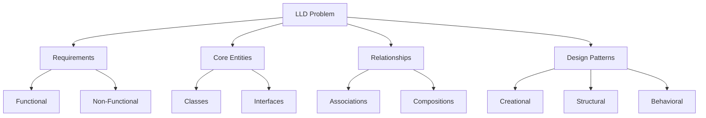

#### Low-Level Design focuses on

- **Class design**: What classes/interfaces are needed?
- **Relationships**: How do classes interact?
- **Design patterns**: Which patterns solve specific problems?
- **SOLID principles**: How to make design maintainable?
- **Code structure**: How to organize code effectively?

### Why Follow a Framework?

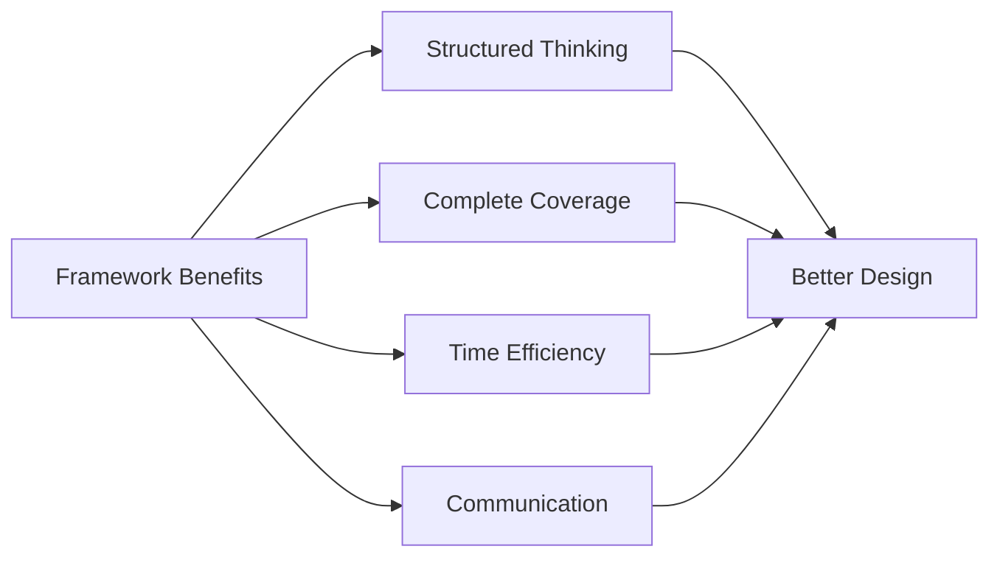

#### Benefits

- ✅ Don't miss important aspects
- ✅ Communicate clearly with interviewer
- ✅ Manage time effectively
- ✅ Show systematic thinking
- ✅ Handle unexpected questions

---

## The 7-Step Framework

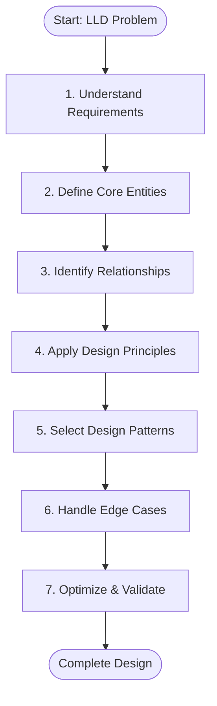

### Time Allocation (45-minute interview)

| Step | Time | Percentage |
|------|------|------------|
| 1. Requirements | 5-7 min | 15% |
| 2. Core Entities | 5-8 min | 15% |
| 3. Relationships | 5-7 min | 15% |
| 4. Design Principles | 3-5 min | 10% |
| 5. Design Patterns | 8-10 min | 20% |
| 6. Edge Cases | 5-7 min | 15% |
| 7. Optimize | 5-7 min | 10% |
| **Total** | **45 min** | **100%** |

---

## Step 1: Understand Requirements

**Goal**: Clarify what needs to be built and gather all necessary information.

### What to Ask

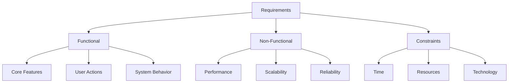

### Key Questions to Ask

#### Functional Requirements

1. What are the **core features**?
2. Who are the **users/actors**?
3. What **actions** can users perform?
4. What are the **business rules**?
5. Are there any **workflows** or state transitions?

#### Non-Functional Requirements

1. **Scale**: How many users? Concurrent operations?
2. **Performance**: Response time expectations?
3. **Availability**: 24/7 or scheduled maintenance?
4. **Extensibility**: Future features to consider?

#### Constraints

1. **Time**: How long for the interview?
2. **Scope**: Focus on specific parts?
3. **Technology**: Any language/framework preferences?

### Example: Parking Lot System

```text
Interviewer: "Design a parking lot system."

You: Great! Let me clarify the requirements:

Functional:
Q: What types of vehicles should the system support?
A: Cars, motorcycles, and trucks.

Q: How do vehicles enter and exit?
A: Through entry/exit gates with ticket dispensing.

Q: How is parking charged?
A: Hourly rate based on vehicle type and duration.

Q: Can users reserve spots in advance?
A: No, it's first-come-first-served for now.

Non-Functional:
Q: How many parking spots are we designing for?
A: Start with 100-200 spots across multiple floors.

Q: Should we handle payment processing?
A: Yes, but keep it simple - assume payment gateway exists.

Constraints:
Q: Should I focus more on class design or also handle concurrency?
A: Focus on class design and extensibility. Basic concurrency is fine.
```

### Requirements Checklist

#### Before moving to next step

- [ ] Core features identified
- [ ] User actions documented
- [ ] Business rules clarified
- [ ] Scale/performance discussed
- [ ] Constraints understood
- [ ] Interviewer agrees on scope

---

## Step 2: Define Core Entities

**Goal**: Identify the main objects/classes in the system.

### How to Identify Entities

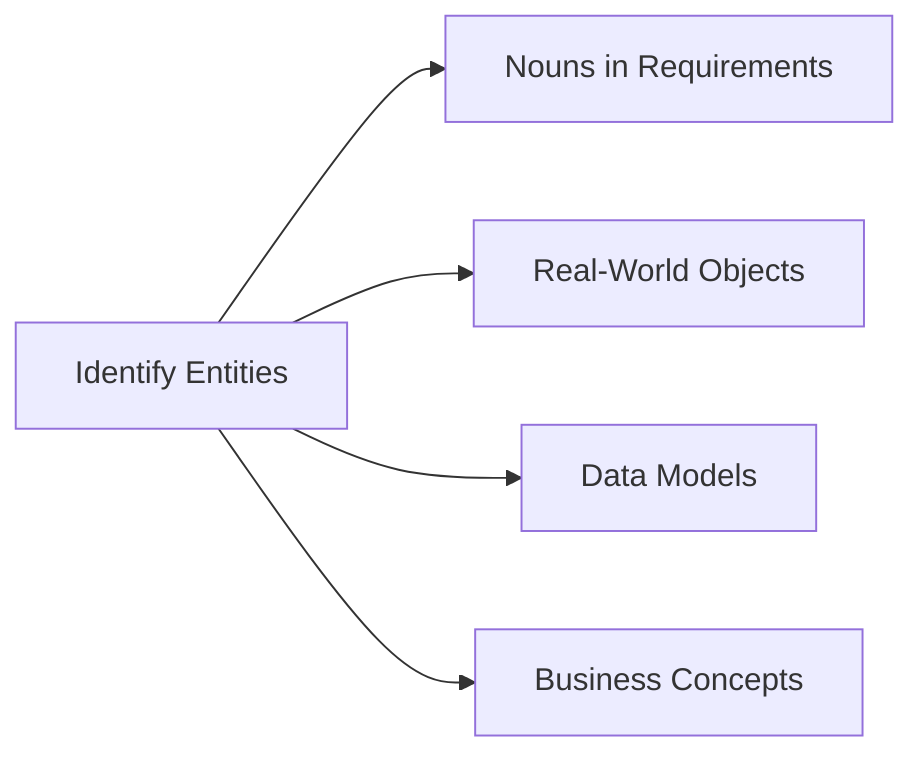

### Entity Identification Process

1. **List nouns** from requirements
2. **Group related concepts**
3. **Identify abstractions**
4. **Define responsibilities**

### Example: Parking Lot Entities

**Nouns from Requirements:**

- Parking Lot, Floor, Parking Spot
- Vehicle, Car, Motorcycle, Truck
- Ticket, Payment, Receipt
- Entry Gate, Exit Gate
- Admin, Customer

#### Core Entities (Classes)

```javascript
// 1. Vehicle Hierarchy
abstract class Vehicle {
    - licensePlate
    - type
    - size
}

class Car extends Vehicle
class Motorcycle extends Vehicle
class Truck extends Vehicle

// 2. Parking Infrastructure
class ParkingLot {
    - floors: Floor[]
    - entryGates: EntryGate[]
    - exitGates: ExitGate[]
}

class Floor {
    - floorNumber
    - spots: ParkingSpot[]
}

class ParkingSpot {
    - spotNumber
    - type
    - isAvailable
    - vehicle
}

// 3. Operations
class Ticket {
    - ticketId
    - vehicle
    - spot
    - entryTime
}

class Payment {
    - amount
    - paymentMethod
    - timestamp
}

// 4. System Components
class EntryGate {
    + dispenseTicket()
}

class ExitGate {
    + processPayment()
}
```

### Entity Definition Checklist

#### For each entity, define

- [ ] **Attributes**: What data does it hold?
- [ ] **Responsibilities**: What does it do?
- [ ] **Behaviors**: What methods does it have?
- [ ] **State**: Does it change over time?

---

## Step 3: Identify Relationships

**Goal**: Define how entities interact and relate to each other.

### Types of Relationships

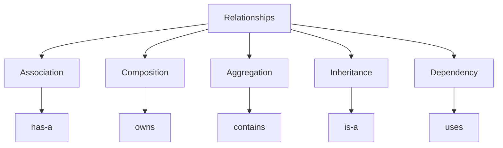

### Relationship Decision Matrix

| Relationship | When to Use | Example |
|--------------|-------------|---------|
| **Inheritance** (is-a) | Specialization | Car **is-a** Vehicle |
| **Composition** (part-of) | Strong ownership | Floor **owns** ParkingSpots |
| **Aggregation** (has-a) | Weak ownership | ParkingLot **has** Vehicles |
| **Association** | Objects work together | Ticket **references** Vehicle |
| **Dependency** | Temporary usage | PaymentProcessor **uses** Payment |

### Example: Parking Lot Relationships

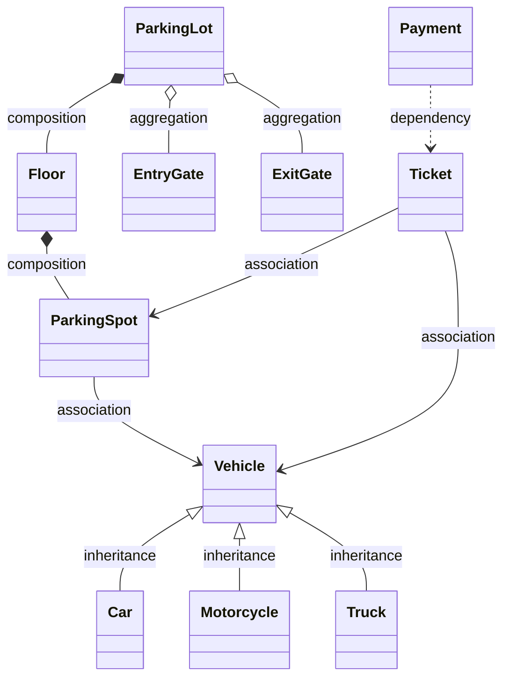

### Relationship Checklist

#### For each relationship

- [ ] Identify relationship type
- [ ] Define cardinality (1-to-1, 1-to-many, many-to-many)
- [ ] Determine ownership (who owns whom?)
- [ ] Check for bidirectional needs

---

## Step 4: Apply Design Principles

**Goal**: Ensure design follows SOLID principles and best practices.

### SOLID Principles Application

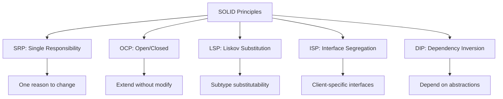

### Example: Parking Lot SOLID Application

**1. Single Responsibility Principle (SRP)**

```javascript
// ❌ BAD: ParkingSpot doing too much
class ParkingSpot {
    assignVehicle(vehicle) { }
    calculateFee() { }  // Not spot's responsibility!
    processPayment() { }  // Not spot's responsibility!
}

// ✅ GOOD: Separate concerns
class ParkingSpot {
    assignVehicle(vehicle) { }
    releaseVehicle() { }
}

class PricingStrategy {
    calculateFee(ticket) { }
}

class PaymentProcessor {
    processPayment(payment) { }
}
```

**2. Open/Closed Principle (OCP)**

```javascript
// ✅ GOOD: Open for extension, closed for modification
interface PricingStrategy {
    calculateFee(ticket): number
}

class HourlyPricing implements PricingStrategy {
    calculateFee(ticket) {
        const hours = calculateHours(ticket);
        return hours * this.hourlyRate;
    }
}

class FlatRatePricing implements PricingStrategy {
    calculateFee(ticket) {
        return this.flatRate;
    }
}

// Easy to add new pricing without modifying existing code
class WeekendPricing implements PricingStrategy {
    calculateFee(ticket) {
        // Weekend pricing logic
    }
}
```

**3. Liskov Substitution Principle (LSP)**

```javascript
// ✅ GOOD: Subtypes can replace base type
class Vehicle {
    canParkIn(spot) {
        return spot.size >= this.size;
    }
}

class Car extends Vehicle {
    canParkIn(spot) {
        return spot.type === 'COMPACT' || spot.type === 'LARGE';
    }
}

class Motorcycle extends Vehicle {
    canParkIn(spot) {
        return spot.type === 'MOTORCYCLE' || 
               spot.type === 'COMPACT' || 
               spot.type === 'LARGE';
    }
}
```

**4. Interface Segregation Principle (ISP)**

```javascript
// ✅ GOOD: Client-specific interfaces
interface Parkable {
    park(spot): void
    unpark(): void
}

interface Chargeable {
    calculateFee(): number
}

interface Reservable {
    reserve(spot): void
    cancelReservation(): void
}

// Clients only depend on what they need
class StandardVehicle implements Parkable, Chargeable {
    // Implementation
}

class VIPVehicle implements Parkable, Chargeable, Reservable {
    // Implementation
}
```

**5. Dependency Inversion Principle (DIP)**

```javascript
// ✅ GOOD: Depend on abstractions
class ParkingLot {
    constructor(
        private pricingStrategy: PricingStrategy,
        private paymentProcessor: PaymentProcessor,
        private notificationService: NotificationService
    ) {}
    
    processExit(ticket) {
        const fee = this.pricingStrategy.calculateFee(ticket);
        const payment = this.paymentProcessor.process(fee);
        this.notificationService.send(receipt);
    }
}
```

---

## Step 5: Select Design Patterns

**Goal**: Apply appropriate design patterns to solve specific problems.

### Pattern Selection Guide

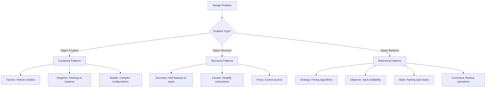

### Common LLD Patterns

| Problem | Pattern | Example |
|---------|---------|---------|
| Multiple object types | **Factory Method** | Vehicle factory |
| Single instance | **Singleton** | ParkingLot manager |
| Multiple algorithms | **Strategy** | Pricing strategies |
| Object state changes | **State** | Spot states (Available/Occupied) |
| Event notification | **Observer** | Spot availability notifications |
| Encapsulate requests | **Command** | Park/Unpark operations |
| Add functionality | **Decorator** | VIP parking features |

### Example: Parking Lot Patterns

**1. Factory Pattern (Vehicle Creation)**

```javascript
class VehicleFactory {
    static createVehicle(type, licensePlate) {
        switch(type) {
            case 'CAR':
                return new Car(licensePlate);
            case 'MOTORCYCLE':
                return new Motorcycle(licensePlate);
            case 'TRUCK':
                return new Truck(licensePlate);
            default:
                throw new Error('Unknown vehicle type');
        }
    }
}
```

**2. Strategy Pattern (Pricing)**

```javascript
interface PricingStrategy {
    calculateFee(duration, vehicleType): number
}

class HourlyPricing implements PricingStrategy {
    calculateFee(duration, vehicleType) {
        const rate = this.getRateForType(vehicleType);
        return Math.ceil(duration / 60) * rate;
    }
}

class FlatRatePricing implements PricingStrategy {
    calculateFee(duration, vehicleType) {
        return this.flatRate;
    }
}
```

**3. Observer Pattern (Availability Notifications)**

```javascript
class ParkingSpot {
    private observers = [];
    
    attach(observer) {
        this.observers.push(observer);
    }
    
    notify() {
        this.observers.forEach(obs => obs.update(this));
    }
    
    markAvailable() {
        this.isAvailable = true;
        this.notify();
    }
}

class DisplayBoard {
    update(spot) {
        console.log(`Spot ${spot.id} is now available`);
    }
}
```

**4. State Pattern (Spot States)**

```javascript
class ParkingSpot {
    constructor() {
        this.state = new AvailableState(this);
    }
    
    setState(state) {
        this.state = state;
    }
    
    park(vehicle) {
        this.state.park(vehicle);
    }
    
    unpark() {
        this.state.unpark();
    }
}

class AvailableState {
    park(vehicle) {
        // Assign vehicle
        spot.setState(new OccupiedState(spot));
    }
    
    unpark() {
        throw new Error('Cannot unpark from available spot');
    }
}

class OccupiedState {
    park(vehicle) {
        throw new Error('Spot already occupied');
    }
    
    unpark() {
        // Remove vehicle
        spot.setState(new AvailableState(spot));
    }
}
```

---

## Step 6: Handle Edge Cases

**Goal**: Think through boundary conditions and error scenarios.

### Common Edge Cases

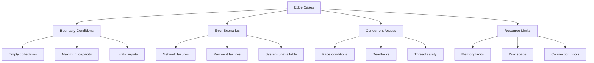

### Example: Parking Lot Edge Cases

**1. No Available Spots**

```javascript
class ParkingLot {
    findAvailableSpot(vehicleType) {
        const spot = this.searchSpot(vehicleType);
        
        if (!spot) {
            throw new NoAvailableSpotException(
                `No spots available for ${vehicleType}`
            );
        }
        
        return spot;
    }
}
```

**2. Invalid Vehicle Entry**

```javascript
class EntryGate {
    dispenseTicket(vehicle) {
        // Validate vehicle
        if (!vehicle || !vehicle.licensePlate) {
            throw new InvalidVehicleException('Invalid vehicle information');
        }
        
        // Check if already parked
        if (this.parkingLot.isVehicleParked(vehicle)) {
            throw new VehicleAlreadyParkedException(
                `Vehicle ${vehicle.licensePlate} is already parked`
            );
        }
        
        // Find spot
        const spot = this.parkingLot.findAvailableSpot(vehicle.type);
        
        // Create ticket
        return new Ticket(vehicle, spot);
    }
}
```

**3. Concurrent Spot Assignment**

```javascript
class ParkingSpot {
    assignVehicle(vehicle) {
        // Thread-safe assignment
        synchronized(this) {
            if (!this.isAvailable) {
                throw new SpotUnavailableException('Spot already occupied');
            }
            
            this.isAvailable = false;
            this.vehicle = vehicle;
        }
    }
}
```

**4. Payment Failure Handling**

```javascript
class ExitGate {
    processExit(ticket) {
        try {
            const fee = this.calculateFee(ticket);
            const payment = this.paymentProcessor.process(fee);
            
            if (!payment.success) {
                throw new PaymentFailedException('Payment processing failed');
            }
            
            this.releaseSpot(ticket.spot);
            return new Receipt(payment);
            
        } catch (error) {
            // Log error
            this.logger.error('Exit processing failed', error);
            
            // Keep gate closed, vehicle cannot exit
            throw error;
        }
    }
}
```

### Edge Case Checklist

- [ ] What if input is null/empty?
- [ ] What if resource is unavailable?
- [ ] What if operation fails midway?
- [ ] What if concurrent access occurs?
- [ ] What if system reaches capacity?
- [ ] What if external service fails?

---

## Step 7: Optimize and Validate

**Goal**: Review design for performance, maintainability, and completeness.

### Optimization Checklist

#### Performance

- [ ] Avoid unnecessary object creation
- [ ] Use appropriate data structures
- [ ] Consider caching frequently accessed data
- [ ] Optimize search operations

#### Maintainability

- [ ] Code is readable and well-organized
- [ ] Responsibilities are clearly separated
- [ ] Easy to add new features
- [ ] Well-documented public APIs

#### Scalability

- [ ] Design handles growth
- [ ] No bottlenecks identified
- [ ] Can distribute if needed

### Example: Parking Lot Optimizations

**1. Fast Spot Lookup**

```javascript
class ParkingLot {
    constructor() {
        // Optimize spot lookup with categorized availability
        this.availableSpots = {
            'MOTORCYCLE': new Set(),
            'COMPACT': new Set(),
            'LARGE': new Set()
        };
    }
    
    findAvailableSpot(vehicleType) {
        const spots = this.availableSpots[vehicleType];
        
        if (spots.size === 0) {
            return null;
        }
        
        // O(1) lookup instead of O(n) search
        const spot = spots.values().next().value;
        return spot;
    }
    
    markSpotAvailable(spot) {
        this.availableSpots[spot.type].add(spot);
    }
    
    markSpotOccupied(spot) {
        this.availableSpots[spot.type].delete(spot);
    }
}
```

**2. Efficient Ticket Lookup**

```javascript
class ParkingLot {
    constructor() {
        // Map for O(1) ticket lookup
        this.activeTickets = new Map(); // ticketId -> Ticket
    }
    
    getTicket(ticketId) {
        return this.activeTickets.get(ticketId);
    }
}
```

---

## Real Interview Examples

### Example 1: Library Management System

#### Requirements Summary

- Members can borrow/return books
- Track book availability
- Handle fines for late returns
- Search books by title/author

**Solution Approach:**

```javascript
// Step 2: Core Entities
class Book {
    isbn, title, author, status
}

class Member {
    memberId, name, borrowedBooks
}

class LibraryCard {
    cardId, member, isActive
}

class Transaction {
    transactionId, book, member, borrowDate, returnDate
}

// Step 5: Design Patterns

// 1. Singleton for Library
class Library {
    private static instance;
    private books;
    private members;
    
    static getInstance() { }
}

// 2. State Pattern for Book Status
class BookState {
    borrow() { }
    return() { }
}

class AvailableState extends BookState { }
class BorrowedState extends BookState { }
class ReservedState extends BookState { }

// 3. Strategy Pattern for Fine Calculation
interface FineStrategy {
    calculateFine(daysLate): number
}

class StandardFine implements FineStrategy { }
class PremiumMemberFine implements FineStrategy { }
```

### Example 2: Online Shopping Cart

#### Requirements Summary

- Add/remove products
- Apply discounts/coupons
- Calculate total with tax
- Support different payment methods

**Solution Approach:**

```javascript
// Step 2: Core Entities
class Product {
    productId, name, price, stock
}

class Cart {
    items: CartItem[]
    applyCoupon(coupon) { }
    calculateTotal() { }
}

class CartItem {
    product, quantity
}

// Step 5: Design Patterns

// 1. Decorator for Discounts
class CartDecorator {
    constructor(cart) {
        this.cart = cart;
    }
    
    calculateTotal() {
        return this.cart.calculateTotal();
    }
}

class CouponDecorator extends CartDecorator {
    calculateTotal() {
        const total = super.calculateTotal();
        return total * (1 - this.discountPercentage);
    }
}

class TaxDecorator extends CartDecorator {
    calculateTotal() {
        const total = super.calculateTotal();
        return total * (1 + this.taxRate);
    }
}

// 2. Strategy for Payment
interface PaymentStrategy {
    pay(amount): boolean
}

class CreditCardPayment implements PaymentStrategy { }
class PayPalPayment implements PaymentStrategy { }
class UPIPayment implements PaymentStrategy { }
```

---

## Common Pitfalls

### Pitfall 1: Over-Engineering

```javascript
// ❌ BAD: Too many abstractions for simple problem
interface VehicleFactory { }
interface VehicleBuilder { }
interface VehicleValidator { }
interface VehicleRepository { }
// ... 10 more interfaces for basic vehicle creation

// ✅ GOOD: Simple and sufficient
class Vehicle { }
class VehicleFactory {
    createVehicle(type) { }
}
```

### Pitfall 2: Ignoring Requirements

```text
❌ BAD: Designing without clarifying
Interviewer: "Design a parking lot"
You: *Immediately starts coding without asking questions*

✅ GOOD: Clarify first
You: "Let me clarify the requirements first..."
```

### Pitfall 3: Poor Communication

```text
❌ BAD: Thinking silently for 5 minutes

✅ GOOD: Think out loud
"I'm thinking we need a Vehicle hierarchy because 
we have different types. Let me sketch that out..."
```

---

## Time Management

### 45-Minute Interview Breakdown

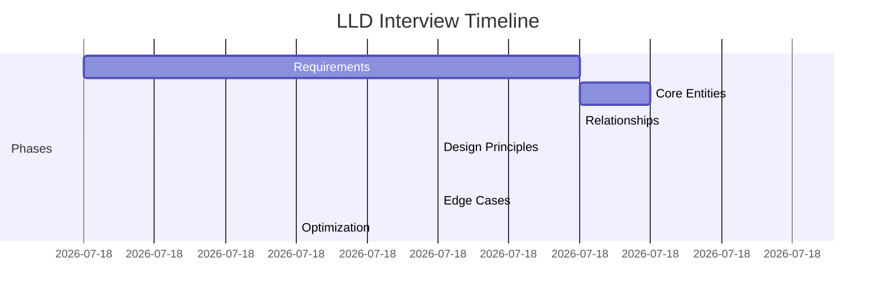

### Time-Saving Tips

1. **Use standard patterns**: Don't reinvent the wheel
2. **Draw diagrams**: Faster than explaining verbally
3. **Prioritize**: Core functionality first, extras later
4. **Communicate**: Keep interviewer informed

---

## Interview Tips

### Do's ✅

1. **Ask clarifying questions** - Never assume
2. **Think out loud** - Show your thought process
3. **Start simple** - Build complexity gradually
4. **Draw diagrams** - Visual aids help
5. **Discuss trade-offs** - Show you understand pros/cons
6. **Handle feedback** - Adapt based on interviewer hints
7. **Test your design** - Walk through scenarios
8. **Manage time** - Keep an eye on the clock

### Don'ts ❌

1. **Don't stay silent** - Communicate constantly
2. **Don't over-engineer** - Keep it simple initially
3. **Don't ignore edge cases** - Show you think thoroughly
4. **Don't argue with interviewer** - Listen and adapt
5. **Don't write perfect code** - Pseudocode is fine
6. **Don't forget SOLID** - Mention principles you apply
7. **Don't skip validation** - Walk through your design
8. **Don't panic** - Take a breath, think systematically

---

## Summary

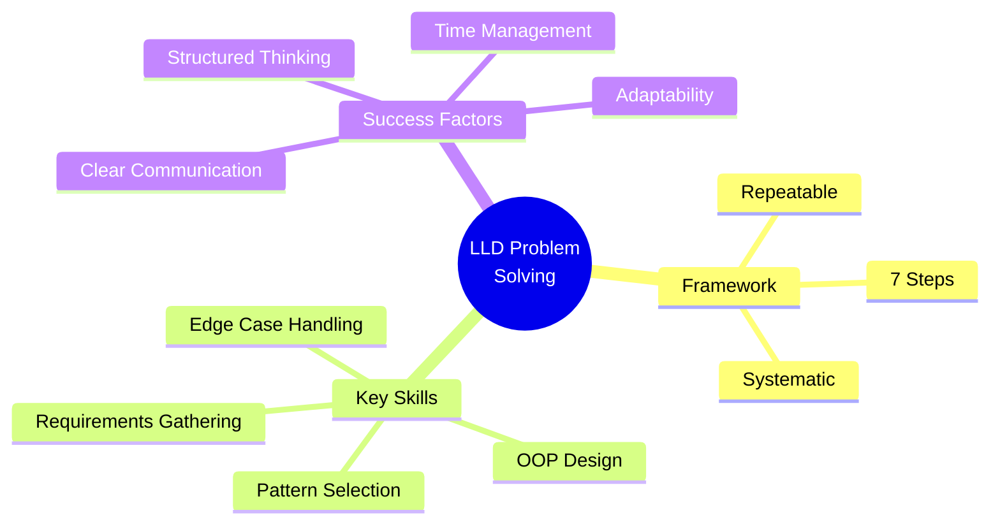

---

### Key Takeaways

- **Follow the 7-step framework** for systematic approach
- **Clarify requirements** before jumping into design
- **Apply SOLID principles** throughout your design
- **Use design patterns** appropriately, not everywhere
- **Think about edge cases** and error handling
- **Communicate clearly** with your interviewer
- **Manage your time** effectively during interview
- **Practice regularly** with different problems

**Remember**: The goal is not perfection, but demonstrating **structured thinking**, **good design principles**, and **clear communication**!

---

**Practice Problems**: Check the [main README](../README.md) for 26+ complete LLD problems to practice this framework!
