# Sequence Diagram

**Purpose**: Master sequence diagrams to visualize the dynamic behavior of systems, showing how objects interact over time through message exchanges. Essential for understanding object interactions, API flows, and system behavior.

---

## Table of Contents

1. [What is a Sequence Diagram?](#what-is-a-sequence-diagram)
2. [Core Components](#core-components)
3. [Message Types](#message-types)
4. [Activation Boxes](#activation-boxes)
5. [Interaction Fragments](#interaction-fragments)
6. [Time and Ordering](#time-and-ordering)
7. [Best Practices](#best-practices)
8. [Common Patterns](#common-patterns)
9. [Real-World Examples](#real-world-examples)
10. [Interview Questions](#interview-questions)

---

## What is a Sequence Diagram?

**Sequence Diagrams** are interaction diagrams that show how objects interact with each other in a particular scenario, emphasizing the **time ordering** of messages.

### Key Definition

> A sequence diagram is a UML diagram that shows object interactions arranged in time sequence. It depicts the objects and classes involved in the scenario and the sequence of messages exchanged between them.

### When to Use

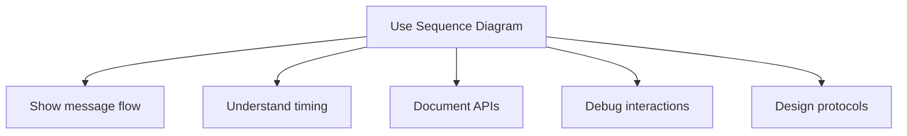
```mermaid
graph TD
    A[Use Sequence Diagram] --> B[Show message flow]
    A --> C[Understand timing]
    A --> D[Document APIs]
    A --> E[Debug interactions]
    A --> F[Design protocols]
```

**Use sequence diagrams for:**

- API call flows and integration patterns
- User authentication workflows
- Database transaction sequences
- Error handling and recovery flows
- Object interaction documentation
- Asynchronous messaging patterns

### Basic Structure

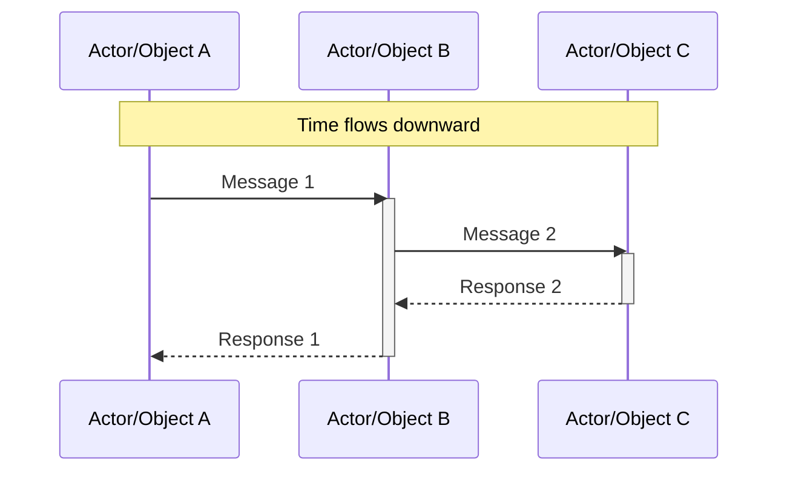
```mermaid
sequenceDiagram
    participant A as Actor/Object A
    participant B as Actor/Object B
    participant C as Actor/Object C
    
    Note over A,C: Time flows downward
    
    A->>B: Message 1
    activate B
    B->>C: Message 2
    activate C
    C-->>B: Response 2
    deactivate C
    B-->>A: Response 1
    deactivate B
```

---

## Core Components

### 1. Lifelines

**Lifelines** represent individual participants (objects, actors, or systems) in the interaction.

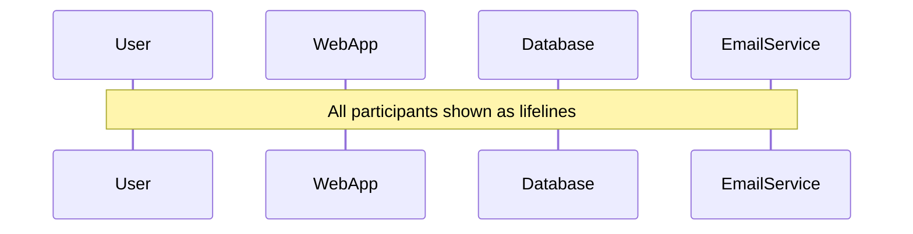
```mermaid
sequenceDiagram
    participant User
    participant WebApp
    participant Database
    participant EmailService
    
    Note over User,EmailService: All participants shown as lifelines
```

**JavaScript Implementation:**

```javascript
/**
 * Lifeline represents a participant in sequence diagram
 * Tracks activation state and message history
 */
class Lifeline {
    constructor(name, type = 'object') {
        this.name = name;
        this.type = type; // 'actor', 'object', 'system'
        this.activations = [];
        this.messageHistory = [];
    }
    
    /**
     * Activate this lifeline (processing starts)
     */
    activate(time) {
        this.activations.push({ start: time, end: null });
        console.log(`[${time}ms] ${this.name} activated`);
    }
    
    /**
     * Deactivate this lifeline (processing ends)
     */
    deactivate(time) {
        const lastActivation = this.activations[this.activations.length - 1];
        if (lastActivation && !lastActivation.end) {
            lastActivation.end = time;
            console.log(`[${time}ms] ${this.name} deactivated`);
        }
    }
    
    /**
     * Record a message sent or received
     */
    recordMessage(message, time) {
        this.messageHistory.push({ message, time });
    }
    
    /**
     * Check if lifeline is currently active
     */
    isActive(time) {
        return this.activations.some(
            a => a.start <= time && (!a.end || a.end > time)
        );
    }
}
```

**Python Implementation:**

```python
from typing import List, Dict, Optional
from datetime import datetime

class Lifeline:
    """
    Represents a participant in a sequence diagram.
    Tracks activation state and message history.
    """
    
    def __init__(self, name: str, lifeline_type: str = 'object'):
        """
        Initialize a lifeline.
        
        Args:
            name: Name of the participant
            lifeline_type: Type ('actor', 'object', 'system')
        """
        self.name = name
        self.type = lifeline_type
        self.activations: List[Dict] = []
        self.message_history: List[Dict] = []
    
    def activate(self, time: float) -> None:
        """Activate this lifeline (processing starts)"""
        self.activations.append({'start': time, 'end': None})
        print(f"[{time}ms] {self.name} activated")
    
    def deactivate(self, time: float) -> None:
        """Deactivate this lifeline (processing ends)"""
        if self.activations and self.activations[-1]['end'] is None:
            self.activations[-1]['end'] = time
            print(f"[{time}ms] {self.name} deactivated")
    
    def record_message(self, message: str, time: float) -> None:
        """Record a message sent or received"""
        self.message_history.append({'message': message, 'time': time})
    
    def is_active(self, time: float) -> bool:
        """Check if lifeline is currently active"""
        return any(
            a['start'] <= time and (a['end'] is None or a['end'] > time)
            for a in self.activations
        )
```

### 2. Messages

**Messages** represent communication between lifelines.

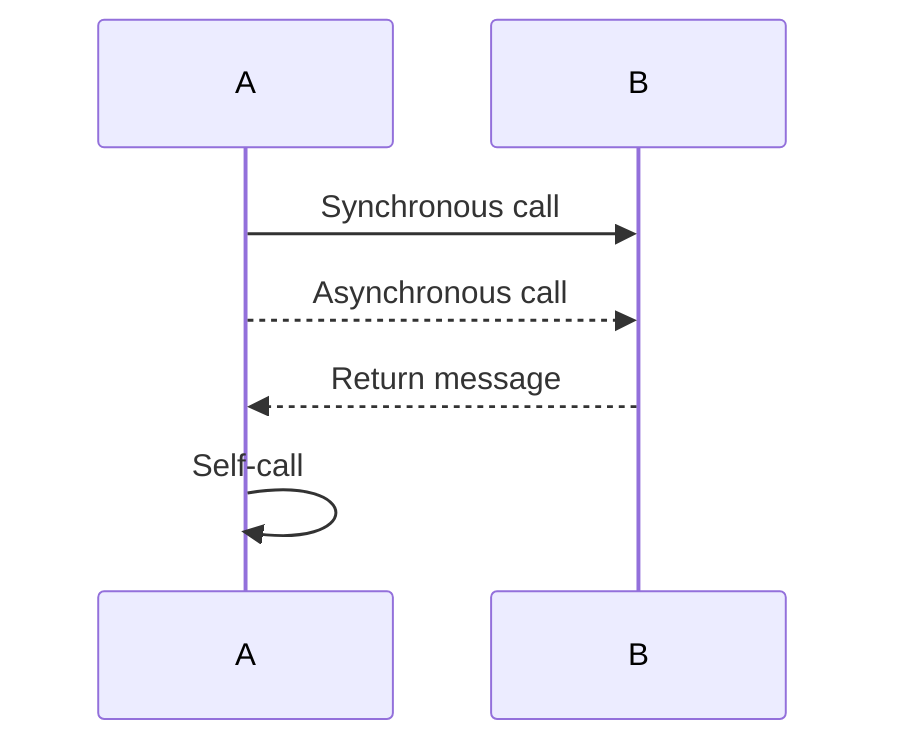
```mermaid
sequenceDiagram
    participant A
    participant B
    
    A->>B: Synchronous call
    A-->>B: Asynchronous call
    B-->>A: Return message
    A->>A: Self-call
```

### 3. Activation Boxes

**Activation boxes** (focus of control) show when an object is active and processing.

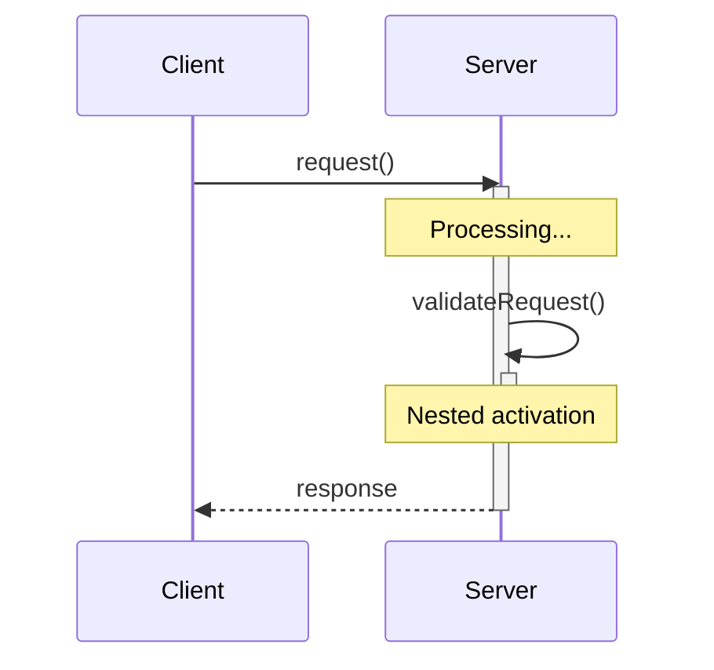
```mermaid
sequenceDiagram
    participant Client
    participant Server
    
    Client->>Server: request()
    activate Server
    Note over Server: Processing...
    Server->>Server: validateRequest()
    activate Server
    Note over Server: Nested activation
    deactivate Server
    Server-->>Client: response
    deactivate Server
```

### 4. Notes

**Notes** provide additional context or explanation.

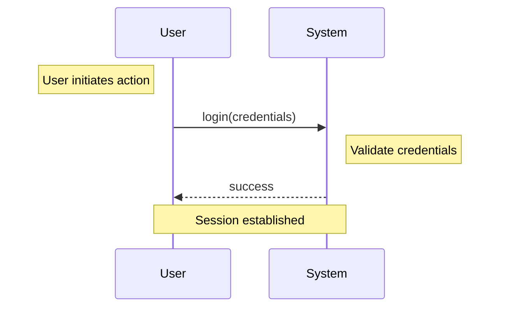
```mermaid
sequenceDiagram
    participant User
    participant System
    
    Note left of User: User initiates action
    User->>System: login(credentials)
    Note right of System: Validate credentials
    System-->>User: success
    Note over User,System: Session established
```

---

## Message Types

### 1. Synchronous Messages

**Synchronous** (blocking) calls where sender waits for response.

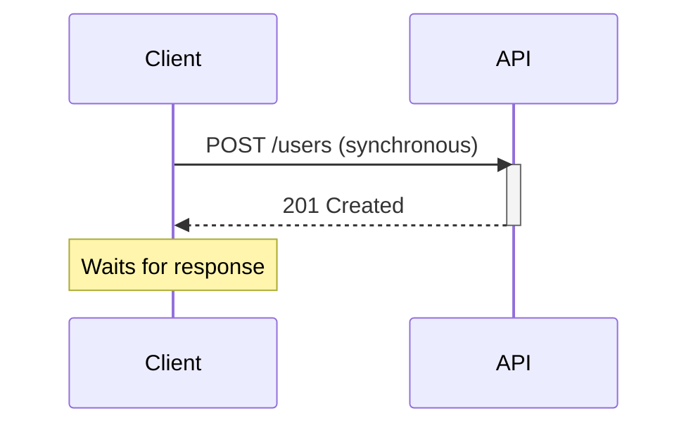
```mermaid
sequenceDiagram
    participant Client
    participant API
    
    Client->>API: POST /users (synchronous)
    activate API
    API-->>Client: 201 Created
    deactivate API
    Note over Client: Waits for response
```

**JavaScript Example:**

```javascript
/**
 * Synchronous message between objects
 */
class SynchronousMessage {
    constructor(from, to, method, args = []) {
        this.from = from;
        this.to = to;
        this.method = method;
        this.args = args;
        this.response = null;
        this.timestamp = Date.now();
    }
    
    /**
     * Send synchronous message and wait for response
     */
    async send() {
        console.log(`[${this.timestamp}] ${this.from.name} -> ${this.to.name}: ${this.method}()`);
        
        // Sender activates
        this.from.activate(this.timestamp);
        
        // Receiver activates
        this.to.activate(this.timestamp + 10);
        
        // Execute method on receiver
        if (typeof this.to[this.method] === 'function') {
            this.response = await this.to[this.method](...this.args);
        }
        
        // Receiver deactivates
        this.to.deactivate(this.timestamp + 50);
        
        // Return response
        console.log(`[${this.timestamp + 50}] ${this.to.name} -> ${this.from.name}: return ${this.response}`);
        
        // Sender deactivates
        this.from.deactivate(this.timestamp + 60);
        
        return this.response;
    }
}

// Example usage
class UserService extends Lifeline {
    constructor() {
        super('UserService', 'object');
    }
    
    createUser(userData) {
        console.log(`Creating user: ${userData.name}`);
        return { id: 1, ...userData };
    }
}

class UserController extends Lifeline {
    constructor(userService) {
        super('UserController', 'object');
        this.userService = userService;
    }
    
    async handleRequest(userData) {
        const message = new SynchronousMessage(
            this,
            this.userService,
            'createUser',
            [userData]
        );
        return await message.send();
    }
}
```

### 2. Asynchronous Messages

**Asynchronous** (non-blocking) calls where sender doesn't wait.

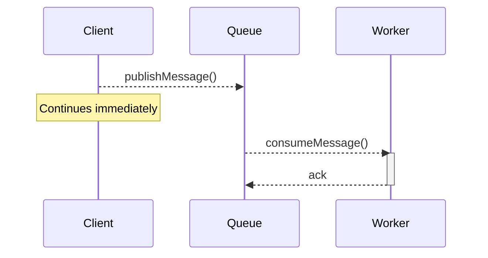
```mermaid
sequenceDiagram
    participant Client
    participant Queue
    participant Worker
    
    Client-->>Queue: publishMessage()
    Note over Client: Continues immediately
    
    Queue-->>Worker: consumeMessage()
    activate Worker
    Worker-->>Queue: ack
    deactivate Worker
```

**Python Example:**

```python
import asyncio
from typing import Any, Callable

class AsynchronousMessage:
    """
    Represents an asynchronous message between objects.
    Sender doesn't wait for response.
    """
    
    def __init__(self, from_obj, to_obj, method: str, args: list = None):
        self.from_obj = from_obj
        self.to_obj = to_obj
        self.method = method
        self.args = args or []
        self.timestamp = asyncio.get_event_loop().time()
    
    async def send(self) -> None:
        """Send async message (fire and forget)"""
        print(f"[{self.timestamp:.0f}] {self.from_obj.name} -->> {self.to_obj.name}: {self.method}()")
        
        # Send without waiting
        asyncio.create_task(self._execute())
    
    async def _execute(self) -> Any:
        """Execute method asynchronously"""
        self.to_obj.activate(self.timestamp + 10)
        
        if hasattr(self.to_obj, self.method):
            result = getattr(self.to_obj, self.method)(*self.args)
            if asyncio.iscoroutine(result):
                await result
        
        self.to_obj.deactivate(self.timestamp + 50)

# Example usage
class EmailService(Lifeline):
    """Asynchronous email service"""
    
    def __init__(self):
        super().__init__('EmailService', 'object')
    
    async def send_email(self, recipient: str, subject: str):
        """Send email asynchronously"""
        print(f"Sending email to {recipient}: {subject}")
        await asyncio.sleep(0.1)  # Simulate sending
        print(f"Email sent to {recipient}")
```

### 3. Return Messages

**Return messages** show the response from a synchronous call.

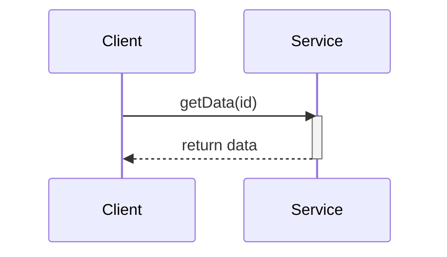
```mermaid
sequenceDiagram
    participant Client
    participant Service
    
    Client->>Service: getData(id)
    activate Service
    Service-->>Client: return data
    deactivate Service
```

### 4. Self-Messages

**Self-messages** (self-calls) represent an object calling its own method.

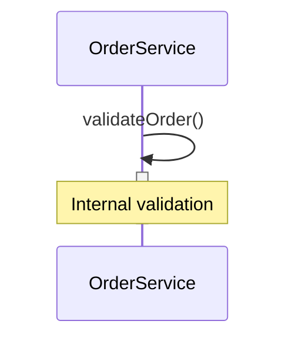
```mermaid
sequenceDiagram
    participant OrderService
    
    OrderService->>OrderService: validateOrder()
    activate OrderService
    Note over OrderService: Internal validation
    deactivate OrderService
```

**JavaScript Example:**

```javascript
/**
 * Demonstrates self-messages in sequence diagrams
 */
class OrderService extends Lifeline {
    constructor() {
        super('OrderService', 'object');
    }
    
    /**
     * Process order - demonstrates self-call pattern
     */
    async processOrder(order) {
        console.log(`\nProcessing order ${order.id}`);
        this.activate(Date.now());
        
        // Self-call 1: Validate
        console.log(`OrderService -> OrderService: validateOrder()`);
        const isValid = this.validateOrder(order);
        
        if (isValid) {
            // Self-call 2: Calculate total
            console.log(`OrderService -> OrderService: calculateTotal()`);
            order.total = this.calculateTotal(order.items);
            
            // Self-call 3: Apply discount
            console.log(`OrderService -> OrderService: applyDiscount()`);
            order.total = this.applyDiscount(order.total, order.coupon);
        }
        
        this.deactivate(Date.now());
        return order;
    }
    
    validateOrder(order) {
        return order.items && order.items.length > 0;
    }
    
    calculateTotal(items) {
        return items.reduce((sum, item) => sum + item.price * item.quantity, 0);
    }
    
    applyDiscount(total, coupon) {
        return coupon ? total * 0.9 : total;
    }
}
```

---

## Activation Boxes

**Activation boxes** show the period when an object is actively executing.

### Single Activation

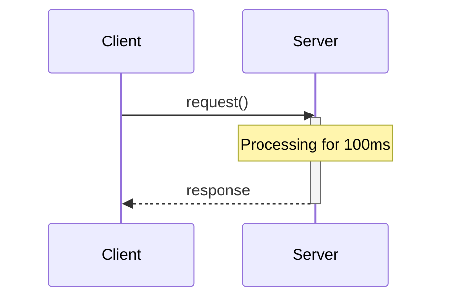
```mermaid
sequenceDiagram
    participant Client
    participant Server
    
    Client->>Server: request()
    activate Server
    Note over Server: Processing for 100ms
    Server-->>Client: response
    deactivate Server
```

### Nested Activations

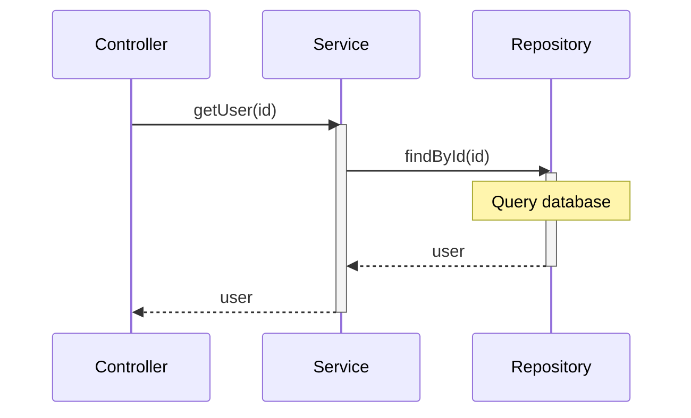
```mermaid
sequenceDiagram
    participant Controller
    participant Service
    participant Repository
    
    Controller->>Service: getUser(id)
    activate Service
    
    Service->>Repository: findById(id)
    activate Repository
    Note over Repository: Query database
    Repository-->>Service: user
    deactivate Repository
    
    Service-->>Controller: user
    deactivate Service
```

**Python Example:**

```python
class ActivationTracker:
    """
    Tracks activation depth and duration for sequence diagrams.
    """
    
    def __init__(self, lifeline_name: str):
        self.lifeline_name = lifeline_name
        self.depth = 0
        self.activations = []
    
    def enter(self, method: str) -> None:
        """Enter an activation (method call)"""
        self.depth += 1
        indent = "  " * (self.depth - 1)
        print(f"{indent}[{self.lifeline_name}] → {method}() [depth: {self.depth}]")
        self.activations.append({
            'method': method,
            'depth': self.depth,
            'start': asyncio.get_event_loop().time()
        })
    
    def exit(self, method: str, result: Any = None) -> None:
        """Exit an activation (method returns)"""
        if self.activations:
            activation = self.activations.pop()
            duration = asyncio.get_event_loop().time() - activation['start']
            indent = "  " * (self.depth - 1)
            print(f"{indent}[{self.lifeline_name}] ← {method}() returned (took {duration:.2f}s)")
        self.depth -= 1

# Example with nested activations
class UserController:
    """Controller with activation tracking"""
    
    def __init__(self, user_service):
        self.user_service = user_service
        self.tracker = ActivationTracker('UserController')
    
    def get_user_profile(self, user_id: int):
        self.tracker.enter('get_user_profile')
        
        # Nested call
        user = self.user_service.find_user(user_id)
        
        self.tracker.exit('get_user_profile', user)
        return user

class UserService:
    """Service with activation tracking"""
    
    def __init__(self, user_repository):
        self.user_repository = user_repository
        self.tracker = ActivationTracker('UserService')
    
    def find_user(self, user_id: int):
        self.tracker.enter('find_user')
        
        # Nested call to repository
        user = self.user_repository.find_by_id(user_id)
        
        self.tracker.exit('find_user', user)
        return user

class UserRepository:
    """Repository with activation tracking"""
    
    def __init__(self):
        self.tracker = ActivationTracker('UserRepository')
        self.users = {1: {'id': 1, 'name': 'John Doe'}}
    
    def find_by_id(self, user_id: int):
        self.tracker.enter('find_by_id')
        user = self.users.get(user_id)
        self.tracker.exit('find_by_id', user)
        return user
```

---

## Interaction Fragments

**Interaction fragments** represent control structures (loops, conditions, parallel execution).

### 1. Alt (Alternative) - If/Else

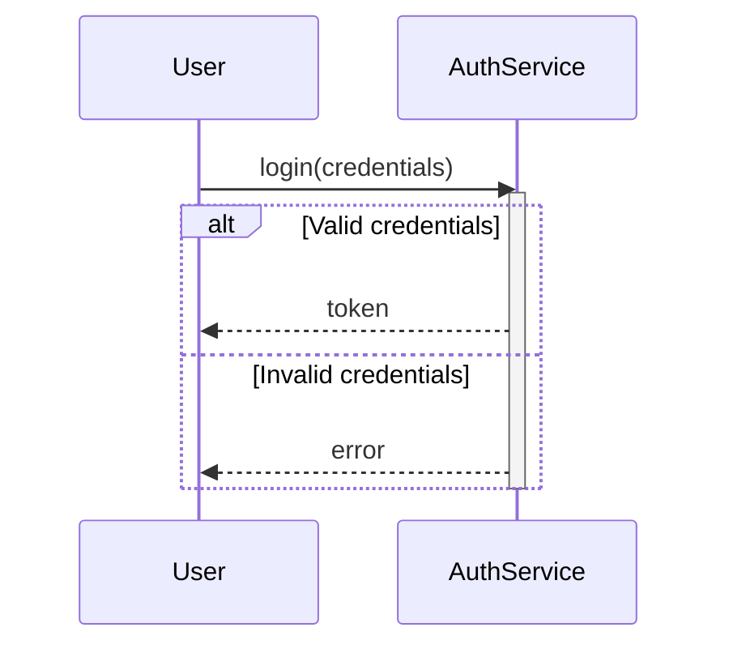
```mermaid
sequenceDiagram
    participant User
    participant AuthService
    
    User->>AuthService: login(credentials)
    activate AuthService
    
    alt Valid credentials
        AuthService-->>User: token
    else Invalid credentials
        AuthService-->>User: error
    end
    
    deactivate AuthService
```

**JavaScript Example:**

```javascript
/**
 * Alternative (if/else) interaction fragment
 */
class AuthService extends Lifeline {
    constructor() {
        super('AuthService', 'object');
        this.validUsers = new Map([
            ['john@example.com', 'password123']
        ]);
    }
    
    /**
     * Login with alt fragment (valid/invalid credentials)
     */
    login(credentials) {
        console.log(`\n=== ALT Fragment: Login ===`);
        this.activate(Date.now());
        
        const { email, password } = credentials;
        const storedPassword = this.validUsers.get(email);
        
        if (storedPassword && storedPassword === password) {
            console.log(`[ALT: Valid credentials path]`);
            const token = this.generateToken(email);
            this.deactivate(Date.now());
            return { success: true, token };
        } else {
            console.log(`[ALT: Invalid credentials path]`);
            this.deactivate(Date.now());
            return { success: false, error: 'Invalid credentials' };
        }
    }
    
    generateToken(email) {
        return `token_${email}_${Date.now()}`;
    }
}
```

### 2. Opt (Optional) - If Without Else

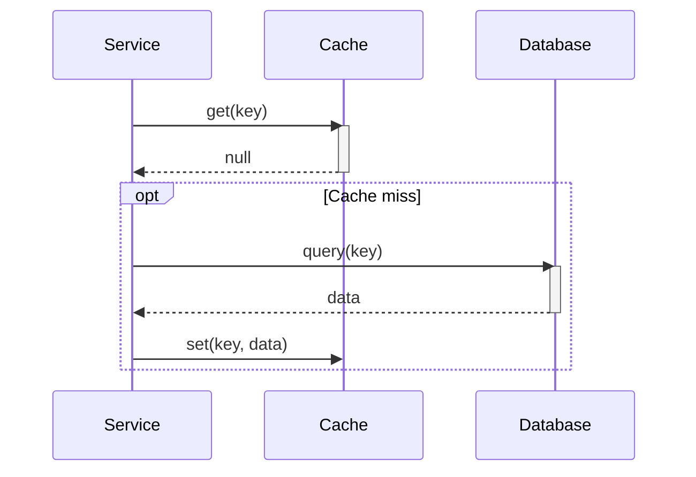
```mermaid
sequenceDiagram
    participant Service
    participant Cache
    participant Database
    
    Service->>Cache: get(key)
    activate Cache
    Cache-->>Service: null
    deactivate Cache
    
    opt Cache miss
        Service->>Database: query(key)
        activate Database
        Database-->>Service: data
        deactivate Database
        
        Service->>Cache: set(key, data)
    end
```

### 3. Loop - Iteration

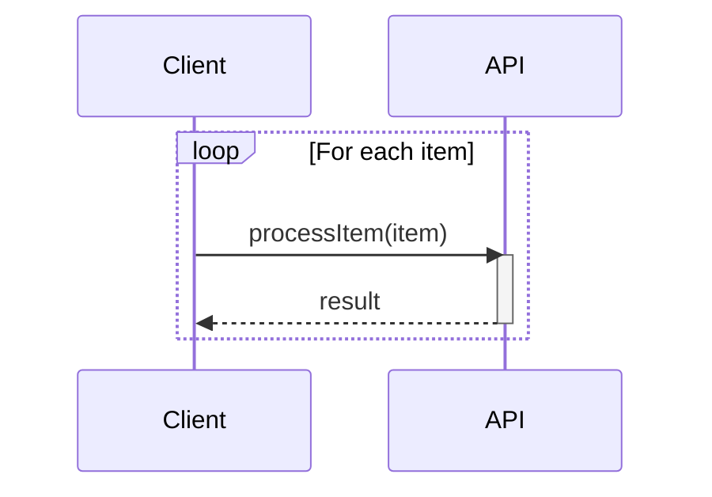
```mermaid
sequenceDiagram
    participant Client
    participant API
    
    loop For each item
        Client->>API: processItem(item)
        activate API
        API-->>Client: result
        deactivate API
    end
```

**Python Example:**

```python
class BatchProcessor(Lifeline):
    """
    Demonstrates loop fragment in sequence diagram.
    """
    
    def __init__(self, api_client):
        super().__init__('BatchProcessor', 'object')
        self.api_client = api_client
    
    def process_batch(self, items: list) -> list:
        """Process items in a loop"""
        print("\n=== LOOP Fragment: Process Batch ===")
        self.activate(0)
        
        results = []
        for i, item in enumerate(items):
            print(f"[LOOP iteration {i + 1}/{len(items)}]")
            result = self.api_client.process_item(item)
            results.append(result)
        
        self.deactivate(100)
        return results

class APIClient(Lifeline):
    """API client that processes individual items"""
    
    def __init__(self):
        super().__init__('APIClient', 'object')
    
    def process_item(self, item: dict) -> dict:
        """Process a single item"""
        self.activate(0)
        print(f"  Processing item: {item['id']}")
        self.deactivate(10)
        return {'id': item['id'], 'status': 'processed'}
```

### 4. Par (Parallel) - Concurrent Execution

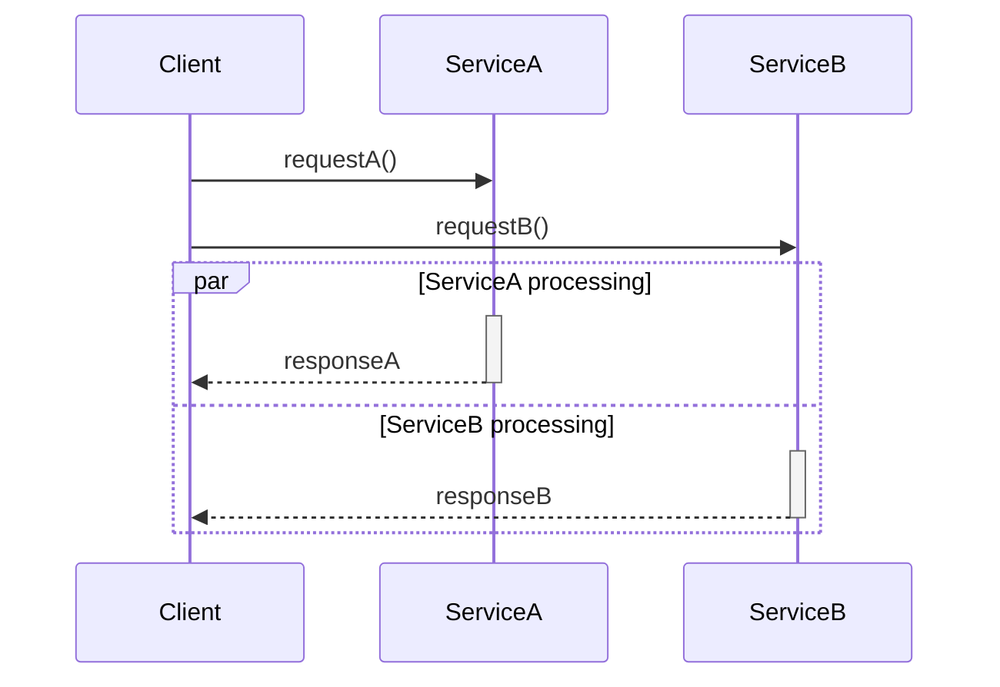
```mermaid
sequenceDiagram
    participant Client
    participant ServiceA
    participant ServiceB
    
    Client->>ServiceA: requestA()
    Client->>ServiceB: requestB()
    
    par ServiceA processing
        activate ServiceA
        ServiceA-->>Client: responseA
        deactivate ServiceA
    and ServiceB processing
        activate ServiceB
        ServiceB-->>Client: responseB
        deactivate ServiceB
    end
```

---

## Time and Ordering

### Time Flows Downward

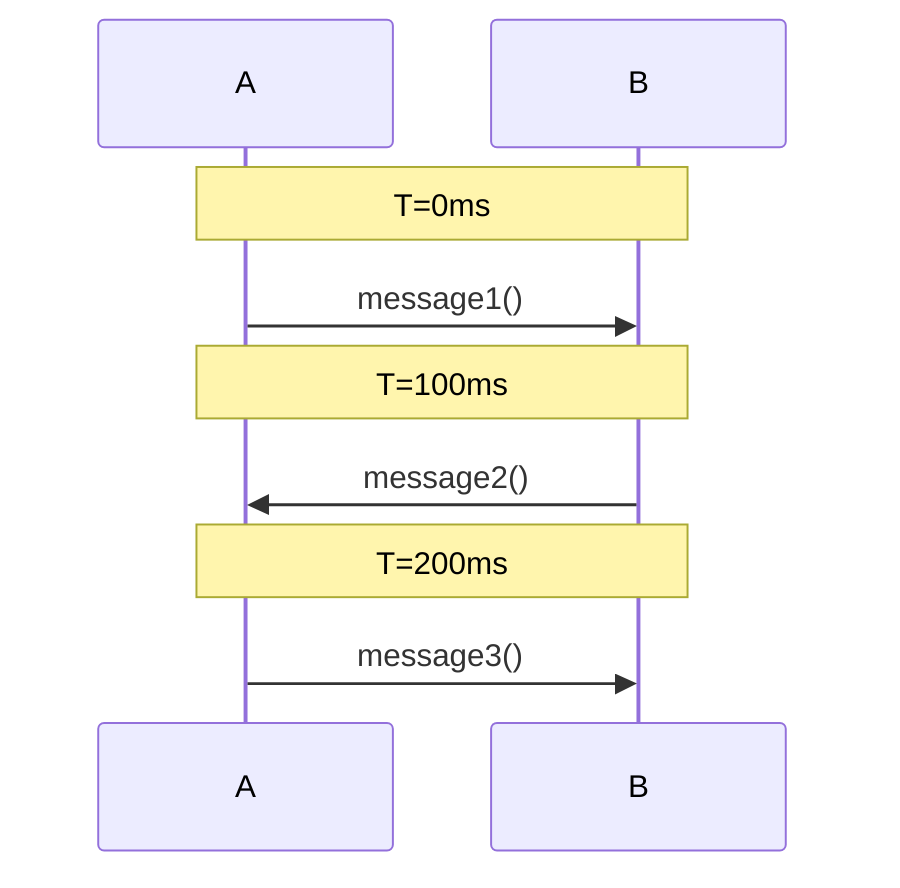
```mermaid
sequenceDiagram
    participant A
    participant B
    
    Note over A,B: T=0ms
    A->>B: message1()
    
    Note over A,B: T=100ms
    B->>A: message2()
    
    Note over A,B: T=200ms
    A->>B: message3()
```

### Message Ordering

**JavaScript Example - Demonstrating Order:**

```javascript
/**
 * Message sequencing and timing tracker
 */
class MessageSequencer {
    constructor() {
        this.messages = [];
        this.startTime = Date.now();
    }
    
    /**
     * Record a message with timestamp
     */
    recordMessage(from, to, method, type = 'sync') {
        const timestamp = Date.now() - this.startTime;
        const message = {
            sequence: this.messages.length + 1,
            timestamp,
            from: from.name,
            to: to.name,
            method,
            type
        };
        
        this.messages.push(message);
        console.log(
            `[${timestamp}ms] #${message.sequence}: ` +
            `${from.name} ${type === 'sync' ? '->>' : '-->>'} ${to.name}: ${method}()`
        );
    }
    
    /**
     * Generate sequence diagram report
     */
    generateReport() {
        console.log('\n=== Message Sequence Report ===');
        this.messages.forEach(msg => {
            console.log(
                `#${msg.sequence} [${msg.timestamp}ms]: ` +
                `${msg.from} → ${msg.to}: ${msg.method}()`
            );
        });
    }
}

// Example: E-commerce checkout flow
class CheckoutSequence {
    constructor() {
        this.sequencer = new MessageSequencer();
        this.cart = new Lifeline('ShoppingCart', 'object');
        this.payment = new Lifeline('PaymentService', 'object');
        this.inventory = new Lifeline('InventoryService', 'object');
        this.email = new Lifeline('EmailService', 'object');
    }
    
    async executeCheckout() {
        // Message 1: Validate cart
        this.sequencer.recordMessage(this.cart, this.inventory, 'validateItems', 'sync');
        await this.sleep(50);
        
        // Message 2: Process payment
        this.sequencer.recordMessage(this.cart, this.payment, 'processPayment', 'sync');
        await this.sleep(100);
        
        // Message 3: Update inventory
        this.sequencer.recordMessage(this.payment, this.inventory, 'decrementStock', 'sync');
        await this.sleep(30);
        
        // Message 4: Send confirmation (async)
        this.sequencer.recordMessage(this.cart, this.email, 'sendConfirmation', 'async');
        
        this.sequencer.generateReport();
    }
    
    sleep(ms) {
        return new Promise(resolve => setTimeout(resolve, ms));
    }
}
```

---

## Best Practices

### 1. Keep It Focused

```text
✅ DO: Show one specific scenario or use case
❌ DON'T: Try to show every possible path in one diagram
```

### 2. Use Meaningful Names

```text
✅ DO: UserController, PaymentService, EmailNotifier
❌ DON'T: Object1, Service2, Class3
```

### 3. Limit Number of Participants

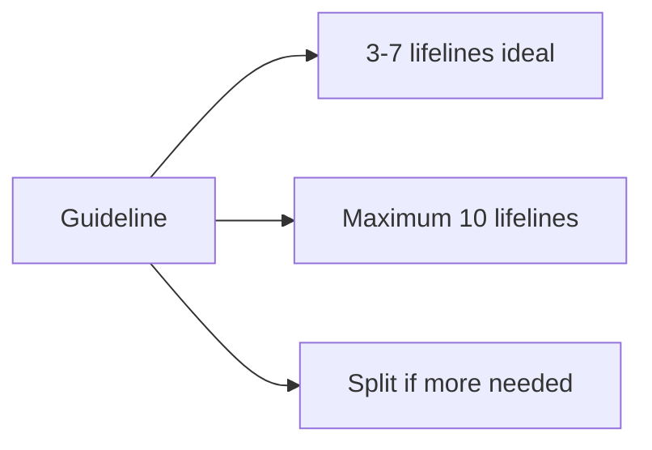
```mermaid
graph LR
    A[Guideline] --> B[3-7 lifelines ideal]
    A --> C[Maximum 10 lifelines]
    A --> D[Split if more needed]
```

### 4. Show Returns Explicitly

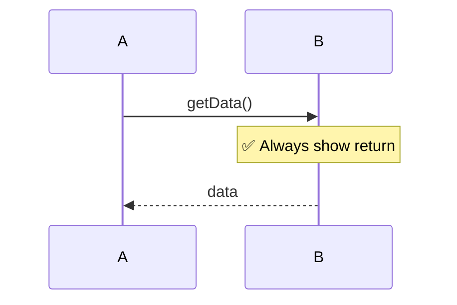
```mermaid
sequenceDiagram
    participant A
    participant B
    
    A->>B: getData()
    Note over B: ✅ Always show return
    B-->>A: data
```

### 5. Add Notes for Clarity

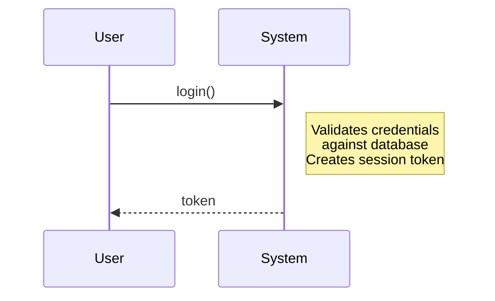
```mermaid
sequenceDiagram
    participant User
    participant System
    
    User->>System: login()
    Note right of System: Validates credentials<br/>against database<br/>Creates session token
    System-->>User: token
```

---

## Common Patterns

### 1. Authentication Flow

```mermaid
sequenceDiagram
    actor User
    participant Frontend
    participant AuthAPI
    participant Database
    participant TokenService
    
    User->>Frontend: Enter credentials
    Frontend->>AuthAPI: POST /login
    activate AuthAPI
    
    AuthAPI->>Database: findUserByEmail()
    activate Database
    Database-->>AuthAPI: user
    deactivate Database
    
    AuthAPI->>AuthAPI: validatePassword()
    
    AuthAPI->>TokenService: generateToken(user)
    activate TokenService
    TokenService-->>AuthAPI: JWT token
    deactivate TokenService
    
    AuthAPI-->>Frontend: {token, user}
    deactivate AuthAPI
    
    Frontend-->>User: Redirect to dashboard
```

### 2. REST API Call

```mermaid
sequenceDiagram
    participant Client
    participant API Gateway
    participant Service
    participant Database
    
    Client->>API Gateway: GET /users/123
    activate API Gateway
    
    API Gateway->>Service: getUserById(123)
    activate Service
    
    Service->>Database: SELECT * FROM users WHERE id=123
    activate Database
    Database-->>Service: user data
    deactivate Database
    
    Service-->>API Gateway: User object
    deactivate Service
    
    API Gateway-->>Client: 200 OK {user}
    deactivate API Gateway
```

**Complete JavaScript Implementation:**

```javascript
/**
 * REST API sequence diagram implementation
 */
class RESTAPISequence {
    constructor() {
        this.sequencer = new MessageSequencer();
    }
    
    async getUserById(userId) {
        console.log('\n=== REST API Sequence: GET /users/:id ===\n');
        
        const client = new Lifeline('Client', 'actor');
        const gateway = new APIGateway();
        const service = new UserService();
        const database = new Database();
        
        // Step 1: Client -> API Gateway
        this.sequencer.recordMessage(client, gateway, `GET /users/${userId}`, 'sync');
        gateway.activate(0);
        
        // Step 2: API Gateway -> Service
        this.sequencer.recordMessage(gateway, service, 'getUserById', 'sync');
        service.activate(10);
        
        // Step 3: Service -> Database
        this.sequencer.recordMessage(service, database, 'SELECT query', 'sync');
        database.activate(20);
        const userData = await database.query(`SELECT * FROM users WHERE id=${userId}`);
        database.deactivate(50);
        
        // Step 4: Database -> Service (return)
        console.log(`  └─ Database returns: ${JSON.stringify(userData)}`);
        service.deactivate(60);
        
        // Step 5: Service -> Gateway (return)
        console.log(`  └─ Service returns: User object`);
        gateway.deactivate(70);
        
        // Step 6: Gateway -> Client (return)
        console.log(`  └─ API Gateway returns: 200 OK`);
        
        return userData;
    }
}

class APIGateway extends Lifeline {
    constructor() {
        super('APIGateway', 'system');
    }
}

class UserService extends Lifeline {
    constructor() {
        super('UserService', 'object');
    }
}

class Database extends Lifeline {
    constructor() {
        super('Database', 'system');
        this.users = [
            { id: 1, name: 'John Doe', email: 'john@example.com' }
        ];
    }
    
    async query(sql) {
        await new Promise(resolve => setTimeout(resolve, 30));
        return this.users[0];
    }
}
```

### 3. Observer Pattern

```mermaid
sequenceDiagram
    participant Subject
    participant Observer1
    participant Observer2
    
    Subject->>Subject: setState(newState)
    activate Subject
    
    Subject->>Observer1: notify(newState)
    activate Observer1
    Observer1-->>Subject: acknowledged
    deactivate Observer1
    
    Subject->>Observer2: notify(newState)
    activate Observer2
    Observer2-->>Subject: acknowledged
    deactivate Observer2
    
    deactivate Subject
```

---

## Real-World Examples

### Example 1: E-Commerce Order Processing

```mermaid
sequenceDiagram
    actor Customer
    participant WebApp
    participant OrderService
    participant PaymentGateway
    participant InventoryService
    participant EmailService
    
    Customer->>WebApp: Place Order
    WebApp->>OrderService: createOrder(items)
    activate OrderService
    
    OrderService->>InventoryService: checkAvailability(items)
    activate InventoryService
    InventoryService-->>OrderService: available
    deactivate InventoryService
    
    OrderService->>PaymentGateway: processPayment(amount)
    activate PaymentGateway
    
    alt Payment Success
        PaymentGateway-->>OrderService: payment confirmed
        OrderService->>InventoryService: reserveItems(items)
        activate InventoryService
        InventoryService-->>OrderService: reserved
        deactivate InventoryService
        
        OrderService-->>WebApp: order created
        deactivate OrderService
        
        WebApp-->>EmailService: sendConfirmation(order)
        WebApp-->>Customer: Order Confirmed
    else Payment Failed
        PaymentGateway-->>OrderService: payment failed
        OrderService-->>WebApp: error
        deactivate OrderService
        WebApp-->>Customer: Payment Failed
    end
    
    deactivate PaymentGateway
```

**Complete Python Implementation:**

```python
from enum import Enum
from typing import Dict, List

class OrderStatus(Enum):
    PENDING = "pending"
    CONFIRMED = "confirmed"
    FAILED = "failed"

class EcommerceSequence:
    """
    Complete e-commerce order processing sequence.
    Demonstrates complex interactions with multiple services.
    """
    
    def __init__(self):
        self.customer = Lifeline('Customer', 'actor')
        self.webapp = Lifeline('WebApp', 'system')
        self.order_service = OrderService()
        self.payment_gateway = PaymentGateway()
        self.inventory = InventoryService()
        self.email = EmailService()
    
    async def place_order(self, items: List[Dict], payment_info: Dict):
        """Execute complete order sequence"""
        print("\n=== E-Commerce Order Sequence ===\n")
        
        # Step 1: Customer -> WebApp
        print("Customer -> WebApp: Place Order")
        
        # Step 2: WebApp -> OrderService
        print("WebApp -> OrderService: createOrder(items)")
        order = await self.order_service.create_order(items, payment_info)
        
        # Step 3: OrderService checks inventory
        print("OrderService -> InventoryService: checkAvailability(items)")
        available = await self.inventory.check_availability(items)
        
        if not available:
            print("InventoryService -> OrderService: items unavailable")
            print("OrderService -> WebApp: error")
            print("WebApp -> Customer: Items Unavailable")
            return {'status': OrderStatus.FAILED, 'reason': 'unavailable'}
        
        # Step 4: Process payment
        print("OrderService -> PaymentGateway: processPayment(amount)")
        payment_result = await self.payment_gateway.process_payment(
            order['total'],
            payment_info
        )
        
        if payment_result['success']:
            # ALT: Payment Success path
            print("[ALT: Payment Success]")
            print("PaymentGateway -> OrderService: payment confirmed")
            
            # Reserve items
            print("OrderService -> InventoryService: reserveItems(items)")
            await self.inventory.reserve_items(items, order['id'])
            print("InventoryService -> OrderService: reserved")
            
            # Confirm order
            print("OrderService -> WebApp: order created")
            print("WebApp -->> EmailService: sendConfirmation(order)")
            await self.email.send_confirmation(order)
            print("WebApp -> Customer: Order Confirmed")
            
            return {
                'status': OrderStatus.CONFIRMED,
                'order': order,
                'payment': payment_result
            }
        else:
            # ALT: Payment Failed path
            print("[ALT: Payment Failed]")
            print("PaymentGateway -> OrderService: payment failed")
            print("OrderService -> WebApp: error")
            print("WebApp -> Customer: Payment Failed")
            
            return {
                'status': OrderStatus.FAILED,
                'reason': 'payment_failed',
                'error': payment_result['error']
            }

class OrderService(Lifeline):
    """Order service handling order creation"""
    
    def __init__(self):
        super().__init__('OrderService', 'object')
        self.orders = {}
        self.order_counter = 1
    
    async def create_order(self, items: List[Dict], payment_info: Dict):
        """Create a new order"""
        order_id = f"ORD-{self.order_counter:04d}"
        self.order_counter += 1
        
        total = sum(item['price'] * item['quantity'] for item in items)
        
        order = {
            'id': order_id,
            'items': items,
            'total': total,
            'payment_info': payment_info
        }
        
        self.orders[order_id] = order
        return order

class PaymentGateway(Lifeline):
    """External payment gateway"""
    
    def __init__(self):
        super().__init__('PaymentGateway', 'system')
    
    async def process_payment(self, amount: float, payment_info: Dict):
        """Process payment (simulated)"""
        # Simulate payment processing
        if payment_info.get('card_number') == '4111111111111111':
            return {'success': True, 'transaction_id': 'TXN12345'}
        return {'success': False, 'error': 'Invalid card'}

class InventoryService(Lifeline):
    """Inventory management service"""
    
    def __init__(self):
        super().__init__('InventoryService', 'object')
        self.stock = {'ITEM001': 100, 'ITEM002': 50}
        self.reservations = {}
    
    async def check_availability(self, items: List[Dict]) -> bool:
        """Check if items are in stock"""
        return all(
            self.stock.get(item['id'], 0) >= item['quantity']
            for item in items
        )
    
    async def reserve_items(self, items: List[Dict], order_id: str):
        """Reserve items for an order"""
        self.reservations[order_id] = items
        for item in items:
            self.stock[item['id']] -= item['quantity']

class EmailService(Lifeline):
    """Email notification service"""
    
    def __init__(self):
        super().__init__('EmailService', 'system')
    
    async def send_confirmation(self, order: Dict):
        """Send order confirmation email"""
        print(f"  [Email sent: Order {order['id']} confirmed]")
```

### Example 2: Microservices Communication

```mermaid
sequenceDiagram
    participant Client
    participant APIGateway
    participant AuthService
    participant UserService
    participant Database
    participant Cache
    
    Client->>APIGateway: GET /profile (with token)
    activate APIGateway
    
    APIGateway->>AuthService: validateToken(token)
    activate AuthService
    AuthService-->>APIGateway: userId
    deactivate AuthService
    
    APIGateway->>UserService: getUserProfile(userId)
    activate UserService
    
    UserService->>Cache: get(userId)
    activate Cache
    Cache-->>UserService: null (cache miss)
    deactivate Cache
    
    UserService->>Database: queryUser(userId)
    activate Database
    Database-->>UserService: userData
    deactivate Database
    
    UserService->>Cache: set(userId, userData)
    
    UserService-->>APIGateway: userProfile
    deactivate UserService
    
    APIGateway-->>Client: 200 OK {profile}
    deactivate APIGateway
```

---

## Interview Questions

### Q1: What is the main purpose of a sequence diagram?

**Answer**: The main purpose is to visualize how objects interact over time in a specific scenario. It shows the **temporal ordering** of messages between participants, making it ideal for understanding dynamic behavior, API flows, and object collaborations.

### Q2: What's the difference between synchronous and asynchronous messages?

**Answer**:

- **Synchronous (→)**: Sender waits for receiver to process and return response. Blocks until complete.
- **Asynchronous (⇢)**: Sender doesn't wait. Fires message and continues immediately. No blocking.

### Q3: What are activation boxes?

**Answer**: Activation boxes (focus of control) are vertical rectangles on a lifeline showing when an object is actively processing. They indicate the duration an object is "active" or executing a method.

### Q4: How do you show a loop in a sequence diagram?

**Answer**: Use a **loop fragment** with a guard condition. The fragment shows repeated interactions:

```text
loop [for each item]
    A -> B: process(item)
end
```

### Q5: What's the difference between sequence and collaboration diagrams?

**Answer**:

- **Sequence Diagram**: Emphasizes **time ordering** (vertical), shows temporal flow
- **Collaboration Diagram**: Emphasizes **structural relationships** (spatial), shows organization

### Q6: Can sequence diagrams show concurrent operations?

**Answer**: Yes, using **par (parallel) fragments**:

```text
par
    A -> B: operation1()
and
    A -> C: operation2()
end
```

### Q7: How do you handle error cases in sequence diagrams?

**Answer**: Use **alt (alternative) fragments** with conditions:

```text
alt [success case]
    normal flow
else [error case]
    error handling flow
end
```

### Q8: What's a self-message?

**Answer**: A self-message is when an object sends a message to itself (calls its own method). Shown as an arrow from a lifeline back to itself.

---

## Summary

```mermaid
mindmap
  root((Sequence<br/>Diagrams))
    Components
      Lifelines
      Messages
      Activations
      Notes
    Message Types
      Synchronous
      Asynchronous
      Return
      Self
    Fragments
      alt if/else
      opt optional
      loop iteration
      par parallel
    Best Practices
      Focus on scenario
      Limit participants
      Show returns
      Add notes
    Use Cases
      API flows
      Authentication
      Error handling
      State changes
```

---

## Next Steps

1. **Practice**: Draw sequence diagrams for your current projects
2. **Study**: [Use Case Diagrams](./use-case-diagram.md)
3. **Study**: [Class Diagrams](./class-diagram.md)
4. **Study**: [Design Patterns](./design-patterns-introduction.md)
5. **Exercise**: Model a login flow end-to-end
6. **Exercise**: Document an existing API using sequence diagrams

---

**Key Takeaways:**

- Sequence diagrams show **how** objects interact over **time**
- Time flows **downward**, order matters
- Use activation boxes to show processing duration
- Fragments (alt, opt, loop, par) model control flow
- Keep diagrams focused on one scenario
- Perfect for API documentation and debugging

**Remember**: Sequence diagrams answer "**How does this scenario execute over time?**" - they're your tool for understanding and documenting dynamic behavior!
