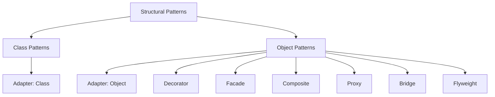
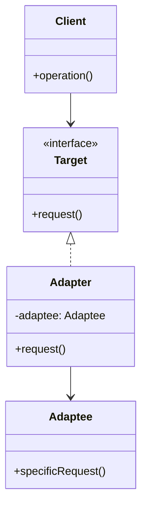
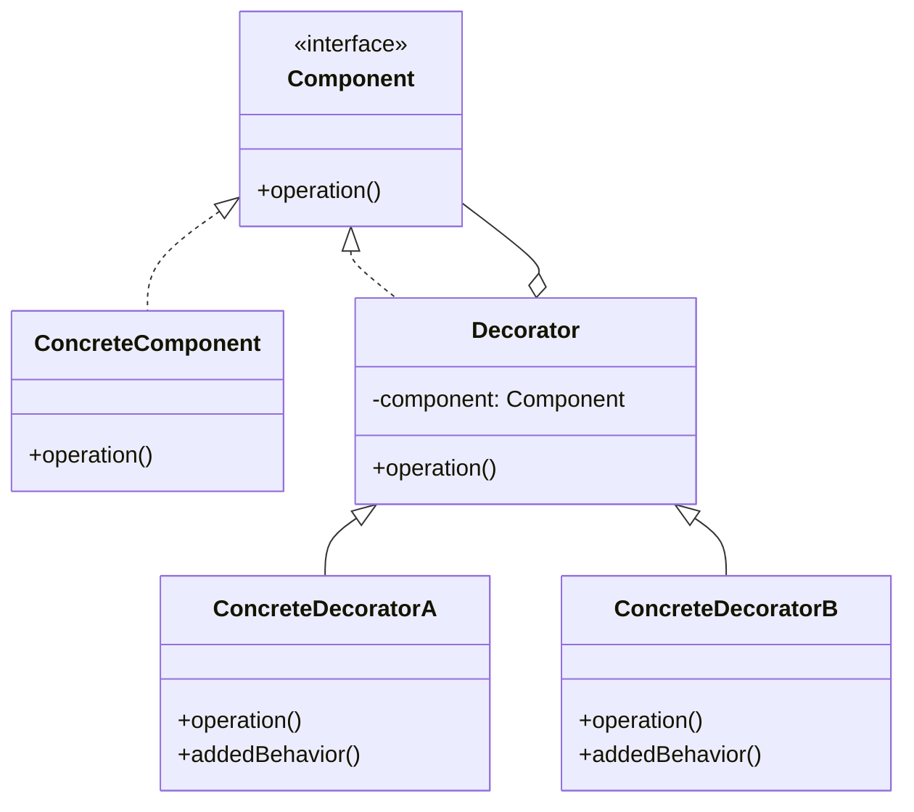
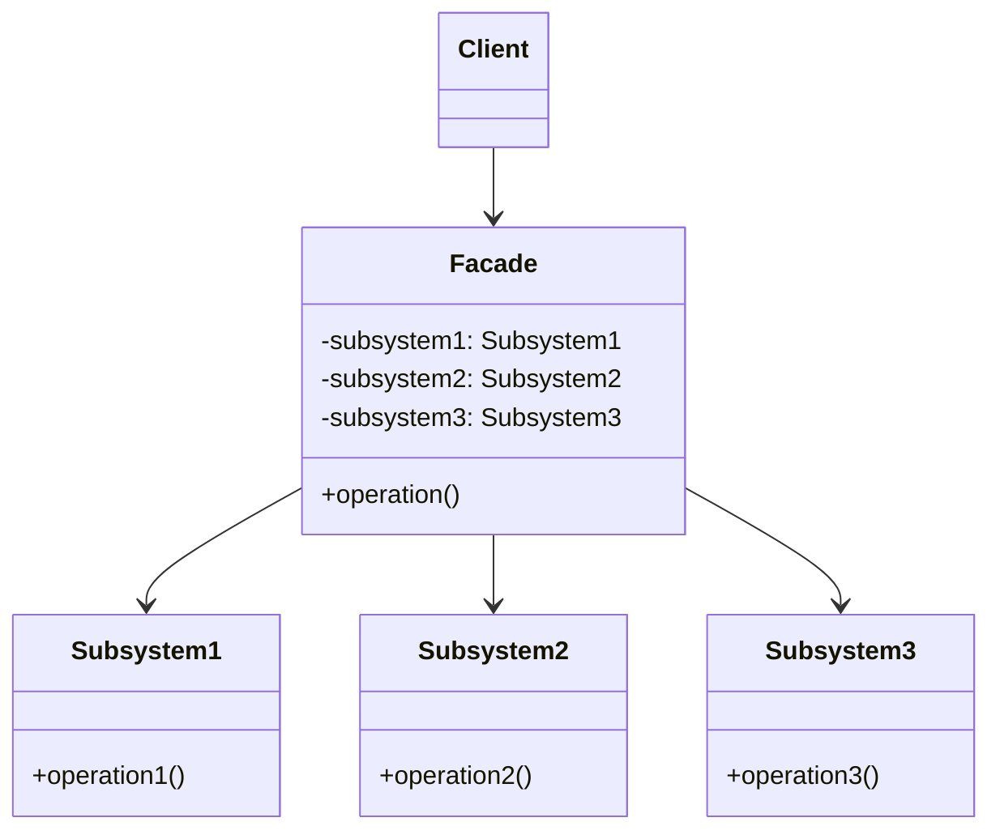
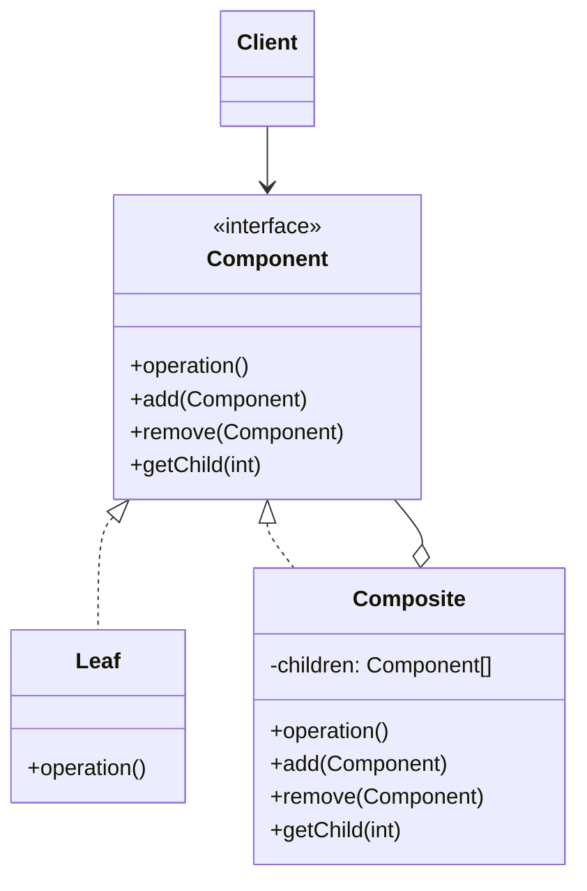
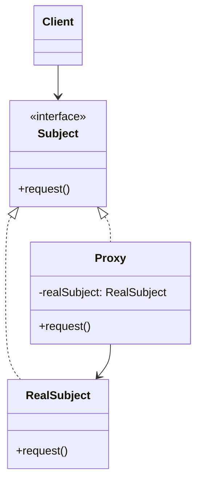
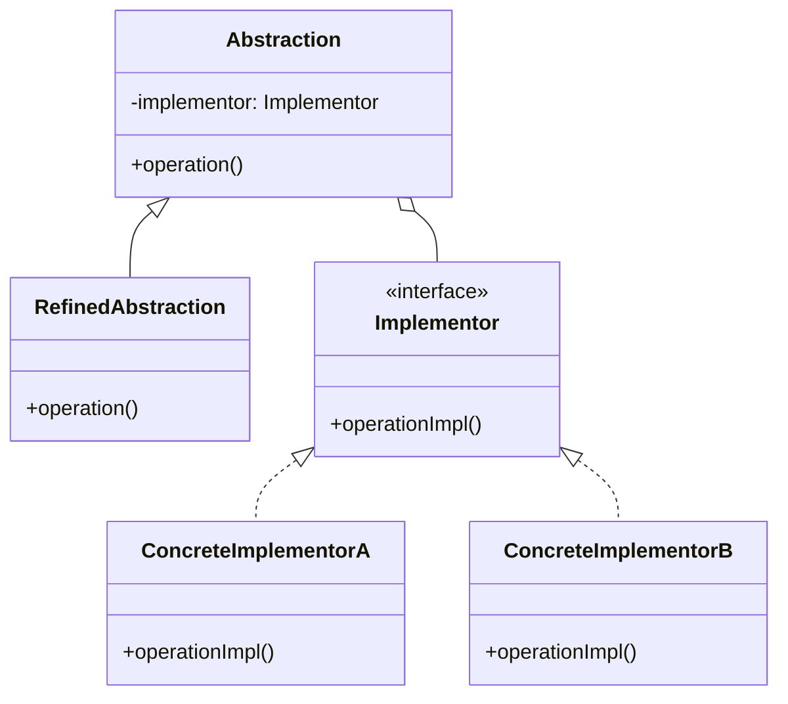
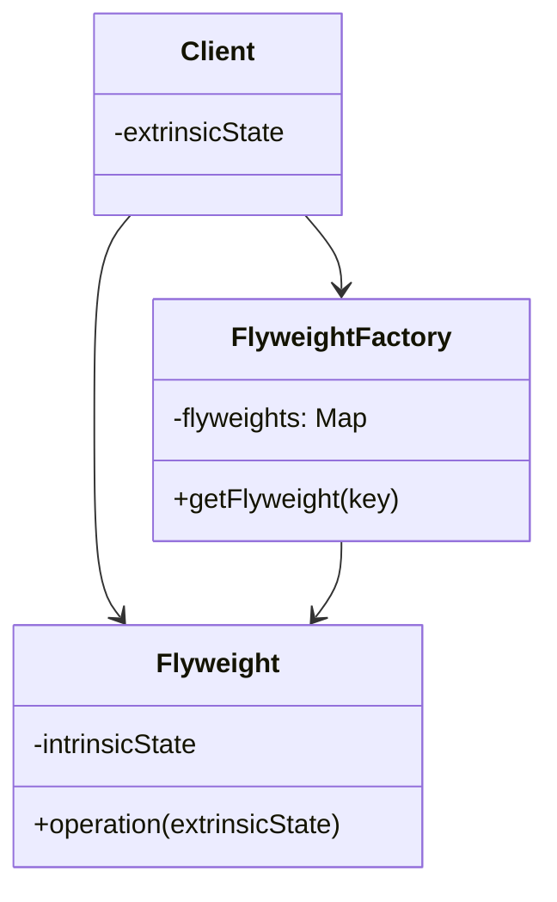
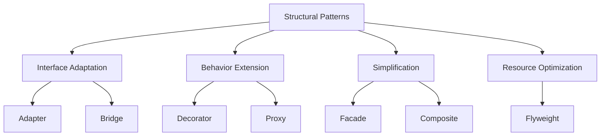
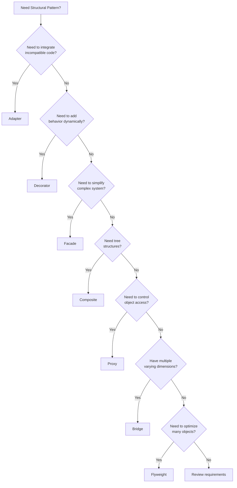

# Structural Design Patterns

**Purpose**: Master the 7 structural design patterns that deal with object composition and relationships between classes and objects.

---

## Table of Contents

1. [Introduction](#introduction)
2. [Adapter Pattern](#adapter-pattern)
3. [Decorator Pattern](#decorator-pattern)
4. [Facade Pattern](#facade-pattern)
5. [Composite Pattern](#composite-pattern)
6. [Proxy Pattern](#proxy-pattern)
7. [Bridge Pattern](#bridge-pattern)
8. [Flyweight Pattern](#flyweight-pattern)
9. [Pattern Comparison](#pattern-comparison)
10. [Interview Questions](#interview-questions)

---

## Introduction

### What are Structural Patterns?

Structural patterns explain how to assemble objects and classes into larger structures while keeping these structures flexible and efficient.



### Key Characteristics

- **Focus**: Object composition and relationships
- **Goal**: Simplify structure by identifying relationships
- **Benefit**: Flexibility in creating complex structures

### The 7 Structural Patterns

| Pattern | Purpose | Key Benefit |
|---------|---------|-------------|
| **Adapter** | Convert interface of a class | Enable incompatible interfaces to work together |
| **Decorator** | Add responsibilities dynamically | Extend functionality without subclassing |
| **Facade** | Unified interface to subsystem | Simplify complex subsystems |
| **Composite** | Tree structure of objects | Treat individual and composite objects uniformly |
| **Proxy** | Placeholder for another object | Control access to object |
| **Bridge** | Separate abstraction from implementation | Vary abstraction and implementation independently |
| **Flyweight** | Share objects to reduce memory | Support large numbers of fine-grained objects |

---

## Adapter Pattern

### Adapter: Problem

You have two incompatible interfaces that need to work together, but you cannot modify their source code.

### Adapter: Solution

Create an adapter that converts the interface of one class into an interface expected by clients.

### Adapter: Structure



### Adapter: JavaScript Implementation

```javascript
// Legacy payment system (Adaptee)
class OldPaymentSystem {
    processOldPayment(amount) {
        console.log(`Processing payment of $${amount} using old system`);
        return {
            success: true,
            transactionId: Math.random().toString(36).substr(2, 9),
            method: 'old_system'
        };
    }
}

// New payment interface (Target)
class PaymentProcessor {
    processPayment(paymentDetails) {
        throw new Error('Must implement processPayment()');
    }
}

// Adapter
class PaymentAdapter extends PaymentProcessor {
    constructor(oldSystem) {
        super();
        this.oldSystem = oldSystem;
    }
    
    processPayment(paymentDetails) {
        // Convert new interface to old interface
        console.log(`Adapting payment request for ${paymentDetails.customer}`);
        const result = this.oldSystem.processOldPayment(paymentDetails.amount);
        
        // Convert old response to new response format
        return {
            success: result.success,
            transactionId: result.transactionId,
            timestamp: new Date().toISOString(),
            customer: paymentDetails.customer,
            amount: paymentDetails.amount
        };
    }
}

// Client code
class PaymentService {
    constructor(processor) {
        this.processor = processor;
    }
    
    makePayment(customer, amount) {
        const paymentDetails = {
            customer,
            amount,
            timestamp: new Date()
        };
        
        return this.processor.processPayment(paymentDetails);
    }
}

// Usage
const oldSystem = new OldPaymentSystem();
const adapter = new PaymentAdapter(oldSystem);
const service = new PaymentService(adapter);

const result = service.makePayment('John Doe', 100);
console.log('Payment Result:', result);
```

### Adapter: Python Implementation

```python
from abc import ABC, abstractmethod
from datetime import datetime
import random
import string

# Legacy payment system (Adaptee)
class OldPaymentSystem:
    """Legacy payment processing system."""
    
    def process_old_payment(self, amount: float) -> dict:
        """Process payment using old system format."""
        print(f"Processing payment of ${amount} using old system")
        return {
            'success': True,
            'transaction_id': ''.join(random.choices(string.ascii_lowercase + string.digits, k=9)),
            'method': 'old_system'
        }

# New payment interface (Target)
class PaymentProcessor(ABC):
    """Modern payment processor interface."""
    
    @abstractmethod
    def process_payment(self, payment_details: dict) -> dict:
        """Process payment with modern interface."""
        pass

# Adapter
class PaymentAdapter(PaymentProcessor):
    """Adapter to make old system compatible with new interface."""
    
    def __init__(self, old_system: OldPaymentSystem):
        self.old_system = old_system
    
    def process_payment(self, payment_details: dict) -> dict:
        """Adapt new interface to old system."""
        print(f"Adapting payment request for {payment_details['customer']}")
        
        # Convert new interface to old interface
        result = self.old_system.process_old_payment(payment_details['amount'])
        
        # Convert old response to new response format
        return {
            'success': result['success'],
            'transaction_id': result['transaction_id'],
            'timestamp': datetime.now().isoformat(),
            'customer': payment_details['customer'],
            'amount': payment_details['amount']
        }

# Client code
class PaymentService:
    """Service using payment processor."""
    
    def __init__(self, processor: PaymentProcessor):
        self.processor = processor
    
    def make_payment(self, customer: str, amount: float) -> dict:
        """Make a payment."""
        payment_details = {
            'customer': customer,
            'amount': amount,
            'timestamp': datetime.now()
        }
        
        return self.processor.process_payment(payment_details)

# Usage
if __name__ == "__main__":
    old_system = OldPaymentSystem()
    adapter = PaymentAdapter(old_system)
    service = PaymentService(adapter)
    
    result = service.make_payment('John Doe', 100)
    print('Payment Result:', result)
```

### Adapter: Use Cases

- **Third-party integration**: Adapt external APIs to your application's interface
- **Legacy system integration**: Make old systems work with new code
- **Multiple data sources**: Unify different data source interfaces
- **Library compatibility**: Adapt libraries to match your application's interface

### Adapter: Best Practices

- ✅ Use when you cannot modify existing code
- ✅ Keep adapter simple and focused on interface conversion
- ✅ Document what is being adapted and why
- ✅ Consider two-way adapters if needed
- ❌ Don't add business logic to adapters
- ❌ Avoid using when you can modify the source code

---

## Decorator Pattern

### Decorator: Problem

You need to add responsibilities to objects dynamically without affecting other objects, and subclassing leads to an explosion of classes.

### Decorator: Solution

Wrap objects in decorator objects that add new behaviors while maintaining the same interface.

### Decorator: Structure



### Decorator: JavaScript Implementation

```javascript
// Component interface
class Coffee {
    cost() {
        throw new Error('Must implement cost()');
    }
    
    description() {
        throw new Error('Must implement description()');
    }
}

// Concrete Component
class SimpleCoffee extends Coffee {
    cost() {
        return 5;
    }
    
    description() {
        return 'Simple coffee';
    }
}

// Base Decorator
class CoffeeDecorator extends Coffee {
    constructor(coffee) {
        super();
        this.coffee = coffee;
    }
    
    cost() {
        return this.coffee.cost();
    }
    
    description() {
        return this.coffee.description();
    }
}

// Concrete Decorators
class MilkDecorator extends CoffeeDecorator {
    cost() {
        return this.coffee.cost() + 2;
    }
    
    description() {
        return this.coffee.description() + ', milk';
    }
}

class SugarDecorator extends CoffeeDecorator {
    cost() {
        return this.coffee.cost() + 1;
    }
    
    description() {
        return this.coffee.description() + ', sugar';
    }
}

class WhipDecorator extends CoffeeDecorator {
    cost() {
        return this.coffee.cost() + 3;
    }
    
    description() {
        return this.coffee.description() + ', whipped cream';
    }
}

// Usage
let coffee = new SimpleCoffee();
console.log(`${coffee.description()} costs $${coffee.cost()}`);

coffee = new MilkDecorator(coffee);
console.log(`${coffee.description()} costs $${coffee.cost()}`);

coffee = new SugarDecorator(coffee);
console.log(`${coffee.description()} costs $${coffee.cost()}`);

coffee = new WhipDecorator(coffee);
console.log(`${coffee.description()} costs $${coffee.cost()}`);
// Output: Simple coffee, milk, sugar, whipped cream costs $11
```

### Decorator: Python Implementation

```python
from abc import ABC, abstractmethod

# Component interface
class Coffee(ABC):
    """Coffee component interface."""
    
    @abstractmethod
    def cost(self) -> float:
        """Return cost of coffee."""
        pass
    
    @abstractmethod
    def description(self) -> str:
        """Return description of coffee."""
        pass

# Concrete Component
class SimpleCoffee(Coffee):
    """Basic coffee without any additions."""
    
    def cost(self) -> float:
        return 5.0
    
    def description(self) -> str:
        return 'Simple coffee'

# Base Decorator
class CoffeeDecorator(Coffee):
    """Base decorator for coffee."""
    
    def __init__(self, coffee: Coffee):
        self._coffee = coffee
    
    def cost(self) -> float:
        return self._coffee.cost()
    
    def description(self) -> str:
        return self._coffee.description()

# Concrete Decorators
class MilkDecorator(CoffeeDecorator):
    """Add milk to coffee."""
    
    def cost(self) -> float:
        return self._coffee.cost() + 2.0
    
    def description(self) -> str:
        return self._coffee.description() + ', milk'

class SugarDecorator(CoffeeDecorator):
    """Add sugar to coffee."""
    
    def cost(self) -> float:
        return self._coffee.cost() + 1.0
    
    def description(self) -> str:
        return self._coffee.description() + ', sugar'

class WhipDecorator(CoffeeDecorator):
    """Add whipped cream to coffee."""
    
    def cost(self) -> float:
        return self._coffee.cost() + 3.0
    
    def description(self) -> str:
        return self._coffee.description() + ', whipped cream'

# Usage
if __name__ == "__main__":
    coffee = SimpleCoffee()
    print(f"{coffee.description()} costs ${coffee.cost()}")
    
    coffee = MilkDecorator(coffee)
    print(f"{coffee.description()} costs ${coffee.cost()}")
    
    coffee = SugarDecorator(coffee)
    print(f"{coffee.description()} costs ${coffee.cost()}")
    
    coffee = WhipDecorator(coffee)
    print(f"{coffee.description()} costs ${coffee.cost()}")
    # Output: Simple coffee, milk, sugar, whipped cream costs $11.0
```

### Decorator: Use Cases

- **Add features to objects dynamically**: File streams (compression, encryption)
- **UI components**: Add scrollbars, borders, shadows
- **Middleware chains**: HTTP request/response processing
- **Text formatting**: Bold, italic, underline

### Decorator: Best Practices

- ✅ Use when you need flexible extension without subclassing
- ✅ Keep decorators focused on single responsibility
- ✅ Make decorators transparent to clients
- ✅ Chain decorators for complex behavior
- ❌ Don't use for static features (use inheritance)
- ❌ Avoid deep decorator chains (hard to debug)

---

## Facade Pattern

### Facade: Problem

A system has many complex subsystems with complicated interfaces, making it difficult for clients to use.

### Facade: Solution

Provide a unified, simplified interface that wraps the complex subsystem.

### Facade: Structure



### Facade: JavaScript Implementation

```javascript
// Complex subsystems
class VideoFile {
    constructor(filename) {
        this.filename = filename;
        console.log(`Loading video file: ${filename}`);
    }
}

class AudioMixer {
    fix(video) {
        console.log('Fixing audio...');
        return 'fixed_audio';
    }
}

class VideoCodec {
    constructor(type) {
        this.type = type;
    }
}

class MPEG4CompressionCodec extends VideoCodec {
    constructor() {
        super('mp4');
    }
}

class OggCompressionCodec extends VideoCodec {
    constructor() {
        super('ogg');
    }
}

class CodecFactory {
    static extract(file) {
        const ext = file.filename.split('.').pop();
        console.log(`Extracting codec for ${ext}...`);
        
        if (ext === 'mp4') {
            return new MPEG4CompressionCodec();
        }
        return new OggCompressionCodec();
    }
}

class BitrateReader {
    static read(file, codec) {
        console.log('Reading bitrate...');
        return 'buffer_data';
    }
    
    static convert(buffer, codec) {
        console.log('Converting buffer...');
        return 'converted_data';
    }
}

// Facade
class VideoConverter {
    convert(filename, format) {
        console.log('\n=== Starting Video Conversion ===');
        
        // Step 1: Load file
        const file = new VideoFile(filename);
        
        // Step 2: Extract codec
        const sourceCodec = CodecFactory.extract(file);
        
        // Step 3: Determine destination codec
        let destinationCodec;
        if (format === 'mp4') {
            destinationCodec = new MPEG4CompressionCodec();
        } else {
            destinationCodec = new OggCompressionCodec();
        }
        
        // Step 4: Read and convert
        const buffer = BitrateReader.read(file, sourceCodec);
        const result = BitrateReader.convert(buffer, destinationCodec);
        
        // Step 5: Fix audio
        const audio = new AudioMixer();
        audio.fix(result);
        
        console.log('=== Conversion Complete ===\n');
        return `converted_${filename.split('.')[0]}.${format}`;
    }
}

// Client code
const converter = new VideoConverter();
const outputFile = converter.convert('video.ogg', 'mp4');
console.log(`Output: ${outputFile}`);
```

### Facade: Python Implementation

```python
# Complex subsystems
class VideoFile:
    """Video file subsystem."""
    
    def __init__(self, filename: str):
        self.filename = filename
        print(f"Loading video file: {filename}")

class AudioMixer:
    """Audio processing subsystem."""
    
    def fix(self, video: str) -> str:
        """Fix audio in video."""
        print('Fixing audio...')
        return 'fixed_audio'

class VideoCodec:
    """Base video codec."""
    
    def __init__(self, codec_type: str):
        self.type = codec_type

class MPEG4CompressionCodec(VideoCodec):
    """MP4 codec."""
    
    def __init__(self):
        super().__init__('mp4')

class OggCompressionCodec(VideoCodec):
    """OGG codec."""
    
    def __init__(self):
        super().__init__('ogg')

class CodecFactory:
    """Codec factory."""
    
    @staticmethod
    def extract(file: VideoFile) -> VideoCodec:
        """Extract codec from file."""
        ext = file.filename.split('.')[-1]
        print(f"Extracting codec for {ext}...")
        
        if ext == 'mp4':
            return MPEG4CompressionCodec()
        return OggCompressionCodec()

class BitrateReader:
    """Bitrate reading and conversion subsystem."""
    
    @staticmethod
    def read(file: VideoFile, codec: VideoCodec) -> str:
        """Read file bitrate."""
        print('Reading bitrate...')
        return 'buffer_data'
    
    @staticmethod
    def convert(buffer: str, codec: VideoCodec) -> str:
        """Convert buffer format."""
        print('Converting buffer...')
        return 'converted_data'

# Facade
class VideoConverter:
    """Simplified interface for video conversion."""
    
    def convert(self, filename: str, format: str) -> str:
        """Convert video file to specified format."""
        print('\n=== Starting Video Conversion ===')
        
        # Step 1: Load file
        file = VideoFile(filename)
        
        # Step 2: Extract codec
        source_codec = CodecFactory.extract(file)
        
        # Step 3: Determine destination codec
        if format == 'mp4':
            destination_codec = MPEG4CompressionCodec()
        else:
            destination_codec = OggCompressionCodec()
        
        # Step 4: Read and convert
        buffer = BitrateReader.read(file, source_codec)
        result = BitrateReader.convert(buffer, destination_codec)
        
        # Step 5: Fix audio
        audio = AudioMixer()
        audio.fix(result)
        
        print('=== Conversion Complete ===\n')
        return f"converted_{filename.split('.')[0]}.{format}"

# Client code
if __name__ == "__main__":
    converter = VideoConverter()
    output_file = converter.convert('video.ogg', 'mp4')
    print(f"Output: {output_file}")
```

### Facade: Use Cases

- **Library wrappers**: Simplify complex library APIs
- **Database access**: Hide complex SQL/ORM operations
- **System integration**: Unify multiple service calls
- **Framework initialization**: Simplify complex setup

### Facade: Best Practices

- ✅ Use to simplify complex subsystems
- ✅ Provide convenience methods for common tasks
- ✅ Allow direct subsystem access when needed
- ✅ Keep facade lightweight
- ❌ Don't add business logic to facade
- ❌ Avoid making facade a "god object"

---

## Composite Pattern

### Composite: Problem

You need to work with tree structures where individual objects and compositions of objects should be treated uniformly.

### Composite: Solution

Compose objects into tree structures and provide a uniform interface for both individual objects and compositions.

### Composite: Structure



### Composite: JavaScript Implementation

```javascript
// Component interface
class FileSystemComponent {
    constructor(name) {
        this.name = name;
    }
    
    getSize() {
        throw new Error('Must implement getSize()');
    }
    
    display(indent = '') {
        throw new Error('Must implement display()');
    }
}

// Leaf
class File extends FileSystemComponent {
    constructor(name, size) {
        super(name);
        this.size = size;
    }
    
    getSize() {
        return this.size;
    }
    
    display(indent = '') {
        console.log(`${indent}📄 ${this.name} (${this.size} bytes)`);
    }
}

// Composite
class Directory extends FileSystemComponent {
    constructor(name) {
        super(name);
        this.children = [];
    }
    
    add(component) {
        this.children.push(component);
    }
    
    remove(component) {
        const index = this.children.indexOf(component);
        if (index !== -1) {
            this.children.splice(index, 1);
        }
    }
    
    getSize() {
        return this.children.reduce((total, child) => {
            return total + child.getSize();
        }, 0);
    }
    
    display(indent = '') {
        console.log(`${indent}📁 ${this.name} (${this.getSize()} bytes)`);
        this.children.forEach(child => {
            child.display(indent + '  ');
        });
    }
}

// Usage
const root = new Directory('root');

const documents = new Directory('documents');
documents.add(new File('resume.pdf', 1024));
documents.add(new File('cover_letter.pdf', 512));

const photos = new Directory('photos');
photos.add(new File('vacation.jpg', 2048));
photos.add(new File('family.jpg', 1536));

const videos = new Directory('videos');
videos.add(new File('wedding.mp4', 10240));

root.add(documents);
root.add(photos);
root.add(videos);
root.add(new File('readme.txt', 256));

console.log('File System Structure:');
root.display();
console.log(`\nTotal size: ${root.getSize()} bytes`);
```

### Composite: Python Implementation

```python
from abc import ABC, abstractmethod
from typing import List

# Component interface
class FileSystemComponent(ABC):
    """Abstract file system component."""
    
    def __init__(self, name: str):
        self.name = name
    
    @abstractmethod
    def get_size(self) -> int:
        """Get component size."""
        pass
    
    @abstractmethod
    def display(self, indent: str = '') -> None:
        """Display component."""
        pass

# Leaf
class File(FileSystemComponent):
    """File leaf component."""
    
    def __init__(self, name: str, size: int):
        super().__init__(name)
        self.size = size
    
    def get_size(self) -> int:
        return self.size
    
    def display(self, indent: str = '') -> None:
        print(f"{indent}📄 {self.name} ({self.size} bytes)")

# Composite
class Directory(FileSystemComponent):
    """Directory composite component."""
    
    def __init__(self, name: str):
        super().__init__(name)
        self.children: List[FileSystemComponent] = []
    
    def add(self, component: FileSystemComponent) -> None:
        """Add child component."""
        self.children.append(component)
    
    def remove(self, component: FileSystemComponent) -> None:
        """Remove child component."""
        if component in self.children:
            self.children.remove(component)
    
    def get_size(self) -> int:
        """Get total size of directory and its contents."""
        return sum(child.get_size() for child in self.children)
    
    def display(self, indent: str = '') -> None:
        """Display directory and its contents."""
        print(f"{indent}📁 {self.name} ({self.get_size()} bytes)")
        for child in self.children:
            child.display(indent + '  ')

# Usage
if __name__ == "__main__":
    root = Directory('root')
    
    documents = Directory('documents')
    documents.add(File('resume.pdf', 1024))
    documents.add(File('cover_letter.pdf', 512))
    
    photos = Directory('photos')
    photos.add(File('vacation.jpg', 2048))
    photos.add(File('family.jpg', 1536))
    
    videos = Directory('videos')
    videos.add(File('wedding.mp4', 10240))
    
    root.add(documents)
    root.add(photos)
    root.add(videos)
    root.add(File('readme.txt', 256))
    
    print('File System Structure:')
    root.display()
    print(f"\nTotal size: {root.get_size()} bytes")
```

### Composite: Use Cases

- **File systems**: Files and directories
- **UI components**: Containers and widgets
- **Organization structures**: Departments and employees
- **Graphics**: Shapes and groups of shapes

### Composite: Best Practices

- ✅ Use when you need part-whole hierarchies
- ✅ Make leaf and composite implement same interface
- ✅ Let clients treat all objects uniformly
- ✅ Consider caching results for performance
- ❌ Don't force meaningless operations on leafs
- ❌ Avoid complex child management in interface

---

## Proxy Pattern

### Proxy: Problem

You need to control access to an object, add lazy initialization, or implement access logging.

### Proxy: Solution

Create a proxy that controls access to the real object while providing the same interface.

### Proxy: Structure



### Proxy: JavaScript Implementation

```javascript
// Subject interface
class Image {
    display() {
        throw new Error('Must implement display()');
    }
}

// Real Subject
class RealImage extends Image {
    constructor(filename) {
        super();
        this.filename = filename;
        this.loadFromDisk();
    }
    
    loadFromDisk() {
        console.log(`Loading image from disk: ${this.filename}`);
        // Simulate expensive operation
    }
    
    display() {
        console.log(`Displaying image: ${this.filename}`);
    }
}

// Proxy
class ImageProxy extends Image {
    constructor(filename) {
        super();
        this.filename = filename;
        this.realImage = null;
    }
    
    display() {
        // Lazy initialization
        if (!this.realImage) {
            this.realImage = new RealImage(this.filename);
        }
        this.realImage.display();
    }
}

// Protection Proxy (with access control)
class ProtectedImageProxy extends Image {
    constructor(filename, user) {
        super();
        this.filename = filename;
        this.user = user;
        this.realImage = null;
    }
    
    display() {
        // Check permissions
        if (!this.user.hasPermission('view_image')) {
            console.log('Access denied: User lacks permission');
            return;
        }
        
        // Lazy initialization
        if (!this.realImage) {
            this.realImage = new RealImage(this.filename);
        }
        
        // Log access
        console.log(`User ${this.user.name} accessed image`);
        this.realImage.display();
    }
}

// User class
class User {
    constructor(name, permissions = []) {
        this.name = name;
        this.permissions = permissions;
    }
    
    hasPermission(permission) {
        return this.permissions.includes(permission);
    }
}

// Usage - Virtual Proxy (lazy loading)
console.log('=== Virtual Proxy Demo ===');
const image1 = new ImageProxy('photo1.jpg');
console.log('Proxy created (image not loaded yet)');
image1.display(); // Image loaded here
image1.display(); // Uses cached image

console.log('\n=== Protection Proxy Demo ===');
const admin = new User('Admin', ['view_image', 'edit_image']);
const guest = new User('Guest', []);

const image2 = new ProtectedImageProxy('photo2.jpg', admin);
image2.display(); // Success

const image3 = new ProtectedImageProxy('photo3.jpg', guest);
image3.display(); // Access denied
```

### Proxy: Python Implementation

```python
from abc import ABC, abstractmethod
from typing import List

# Subject interface
class Image(ABC):
    """Image interface."""
    
    @abstractmethod
    def display(self) -> None:
        """Display image."""
        pass

# Real Subject
class RealImage(Image):
    """Real image that loads from disk."""
    
    def __init__(self, filename: str):
        self.filename = filename
        self._load_from_disk()
    
    def _load_from_disk(self) -> None:
        """Simulate expensive loading operation."""
        print(f"Loading image from disk: {self.filename}")
    
    def display(self) -> None:
        """Display the image."""
        print(f"Displaying image: {self.filename}")

# Proxy
class ImageProxy(Image):
    """Proxy for lazy loading images."""
    
    def __init__(self, filename: str):
        self.filename = filename
        self._real_image = None
    
    def display(self) -> None:
        """Display image (load if needed)."""
        # Lazy initialization
        if self._real_image is None:
            self._real_image = RealImage(self.filename)
        self._real_image.display()

# Protection Proxy
class ProtectedImageProxy(Image):
    """Proxy with access control."""
    
    def __init__(self, filename: str, user: 'User'):
        self.filename = filename
        self.user = user
        self._real_image = None
    
    def display(self) -> None:
        """Display image if user has permission."""
        # Check permissions
        if not self.user.has_permission('view_image'):
            print('Access denied: User lacks permission')
            return
        
        # Lazy initialization
        if self._real_image is None:
            self._real_image = RealImage(self.filename)
        
        # Log access
        print(f"User {self.user.name} accessed image")
        self._real_image.display()

# User class
class User:
    """User with permissions."""
    
    def __init__(self, name: str, permissions: List[str] = None):
        self.name = name
        self.permissions = permissions or []
    
    def has_permission(self, permission: str) -> bool:
        """Check if user has permission."""
        return permission in self.permissions

# Usage
if __name__ == "__main__":
    # Virtual Proxy (lazy loading)
    print('=== Virtual Proxy Demo ===')
    image1 = ImageProxy('photo1.jpg')
    print('Proxy created (image not loaded yet)')
    image1.display()  # Image loaded here
    image1.display()  # Uses cached image
    
    # Protection Proxy
    print('\n=== Protection Proxy Demo ===')
    admin = User('Admin', ['view_image', 'edit_image'])
    guest = User('Guest', [])
    
    image2 = ProtectedImageProxy('photo2.jpg', admin)
    image2.display()  # Success
    
    image3 = ProtectedImageProxy('photo3.jpg', guest)
    image3.display()  # Access denied
```

### Proxy: Use Cases

- **Virtual Proxy**: Lazy initialization of expensive objects
- **Protection Proxy**: Access control and authorization
- **Remote Proxy**: Represent objects in different address spaces
- **Logging Proxy**: Log all method calls

### Proxy: Best Practices

- ✅ Use for lazy initialization of expensive objects
- ✅ Add access control and logging
- ✅ Keep proxy interface identical to real subject
- ✅ Cache real subject when appropriate
- ❌ Don't add too much logic to proxy
- ❌ Avoid using when overhead outweighs benefits

---

## Bridge Pattern

### Bridge: Problem

You have multiple dimensions of variation (e.g., shape and color) and using inheritance creates a combinatorial explosion of classes.

### Bridge: Solution

Separate abstraction from implementation so they can vary independently.

### Bridge: Structure



### Bridge: JavaScript Implementation

```javascript
// Implementor interface
class Renderer {
    renderCircle(radius) {
        throw new Error('Must implement renderCircle()');
    }
    
    renderSquare(side) {
        throw new Error('Must implement renderSquare()');
    }
}

// Concrete Implementors
class VectorRenderer extends Renderer {
    renderCircle(radius) {
        console.log(`Drawing circle with radius ${radius} using vector graphics`);
    }
    
    renderSquare(side) {
        console.log(`Drawing square with side ${side} using vector graphics`);
    }
}

class RasterRenderer extends Renderer {
    renderCircle(radius) {
        console.log(`Drawing pixels for circle with radius ${radius}`);
    }
    
    renderSquare(side) {
        console.log(`Drawing pixels for square with side ${side}`);
    }
}

// Abstraction
class Shape {
    constructor(renderer) {
        this.renderer = renderer;
    }
    
    draw() {
        throw new Error('Must implement draw()');
    }
    
    resize(factor) {
        throw new Error('Must implement resize()');
    }
}

// Refined Abstractions
class Circle extends Shape {
    constructor(renderer, radius) {
        super(renderer);
        this.radius = radius;
    }
    
    draw() {
        this.renderer.renderCircle(this.radius);
    }
    
    resize(factor) {
        this.radius *= factor;
    }
}

class Square extends Shape {
    constructor(renderer, side) {
        super(renderer);
        this.side = side;
    }
    
    draw() {
        this.renderer.renderSquare(this.side);
    }
    
    resize(factor) {
        this.side *= factor;
    }
}

// Usage
console.log('=== Vector Rendering ===');
const vectorRenderer = new VectorRenderer();
const circle1 = new Circle(vectorRenderer, 5);
circle1.draw();
circle1.resize(2);
circle1.draw();

const square1 = new Square(vectorRenderer, 10);
square1.draw();

console.log('\n=== Raster Rendering ===');
const rasterRenderer = new RasterRenderer();
const circle2 = new Circle(rasterRenderer, 3);
circle2.draw();

const square2 = new Square(rasterRenderer, 8);
square2.draw();
```

### Bridge: Python Implementation

```python
from abc import ABC, abstractmethod

# Implementor interface
class Renderer(ABC):
    """Rendering implementation interface."""
    
    @abstractmethod
    def render_circle(self, radius: float) -> None:
        """Render a circle."""
        pass
    
    @abstractmethod
    def render_square(self, side: float) -> None:
        """Render a square."""
        pass

# Concrete Implementors
class VectorRenderer(Renderer):
    """Vector graphics renderer."""
    
    def render_circle(self, radius: float) -> None:
        print(f"Drawing circle with radius {radius} using vector graphics")
    
    def render_square(self, side: float) -> None:
        print(f"Drawing square with side {side} using vector graphics")

class RasterRenderer(Renderer):
    """Raster graphics renderer."""
    
    def render_circle(self, radius: float) -> None:
        print(f"Drawing pixels for circle with radius {radius}")
    
    def render_square(self, side: float) -> None:
        print(f"Drawing pixels for square with side {side}")

# Abstraction
class Shape(ABC):
    """Shape abstraction."""
    
    def __init__(self, renderer: Renderer):
        self.renderer = renderer
    
    @abstractmethod
    def draw(self) -> None:
        """Draw the shape."""
        pass
    
    @abstractmethod
    def resize(self, factor: float) -> None:
        """Resize the shape."""
        pass

# Refined Abstractions
class Circle(Shape):
    """Circle shape."""
    
    def __init__(self, renderer: Renderer, radius: float):
        super().__init__(renderer)
        self.radius = radius
    
    def draw(self) -> None:
        self.renderer.render_circle(self.radius)
    
    def resize(self, factor: float) -> None:
        self.radius *= factor

class Square(Shape):
    """Square shape."""
    
    def __init__(self, renderer: Renderer, side: float):
        super().__init__(renderer)
        self.side = side
    
    def draw(self) -> None:
        self.renderer.render_square(self.side)
    
    def resize(self, factor: float) -> None:
        self.side *= factor

# Usage
if __name__ == "__main__":
    print('=== Vector Rendering ===')
    vector_renderer = VectorRenderer()
    circle1 = Circle(vector_renderer, 5)
    circle1.draw()
    circle1.resize(2)
    circle1.draw()
    
    square1 = Square(vector_renderer, 10)
    square1.draw()
    
    print('\n=== Raster Rendering ===')
    raster_renderer = RasterRenderer()
    circle2 = Circle(raster_renderer, 3)
    circle2.draw()
    
    square2 = Square(raster_renderer, 8)
    square2.draw()
```

### Bridge: Use Cases

- **UI frameworks**: Separate UI controls from platform rendering
- **Database drivers**: Abstract queries from specific database implementations
- **Device drivers**: Separate device operations from device-specific code
- **Graphics rendering**: Separate shapes from rendering methods

### Bridge: Best Practices

- ✅ Use when you have multiple orthogonal dimensions
- ✅ Prefer composition over inheritance
- ✅ Keep abstraction and implementation loosely coupled
- ✅ Make both hierarchies extensible independently
- ❌ Don't use for simple hierarchies
- ❌ Avoid when there's only one implementation

---

## Flyweight Pattern

### Flyweight: Problem

You need to support a large number of fine-grained objects efficiently, but creating all of them consumes too much memory.

### Flyweight: Solution

Share common state between multiple objects instead of storing it in each object.

### Flyweight: Structure



### Flyweight: JavaScript Implementation

```javascript
// Flyweight - shared state
class TreeType {
    constructor(name, color, texture) {
        this.name = name;
        this.color = color;
        this.texture = texture;
        console.log(`Creating TreeType: ${name}`);
    }
    
    draw(canvas, x, y) {
        console.log(
            `Drawing ${this.name} tree at (${x}, ${y}) ` +
            `with color ${this.color} and texture ${this.texture}`
        );
    }
}

// Flyweight Factory
class TreeFactory {
    constructor() {
        this.treeTypes = new Map();
    }
    
    getTreeType(name, color, texture) {
        const key = `${name}_${color}_${texture}`;
        
        if (!this.treeTypes.has(key)) {
            this.treeTypes.set(key, new TreeType(name, color, texture));
        }
        
        return this.treeTypes.get(key);
    }
    
    getTotalTreeTypes() {
        return this.treeTypes.size;
    }
}

// Context - unique state
class Tree {
    constructor(x, y, treeType) {
        this.x = x;
        this.y = y;
        this.treeType = treeType;
    }
    
    draw(canvas) {
        this.treeType.draw(canvas, this.x, this.y);
    }
}

// Forest - manages trees
class Forest {
    constructor() {
        this.trees = [];
        this.treeFactory = new TreeFactory();
    }
    
    plantTree(x, y, name, color, texture) {
        const treeType = this.treeFactory.getTreeType(name, color, texture);
        const tree = new Tree(x, y, treeType);
        this.trees.push(tree);
    }
    
    draw(canvas) {
        this.trees.forEach(tree => tree.draw(canvas));
    }
    
    getStats() {
        return {
            totalTrees: this.trees.length,
            uniqueTreeTypes: this.treeFactory.getTotalTreeTypes(),
            memorySaved: this.trees.length - this.treeFactory.getTotalTreeTypes()
        };
    }
}

// Usage
const forest = new Forest();

// Plant 1000 trees (but only 3 types)
for (let i = 0; i < 300; i++) {
    forest.plantTree(
        Math.random() * 1000,
        Math.random() * 1000,
        'Oak',
        'Green',
        'Rough'
    );
}

for (let i = 0; i < 400; i++) {
    forest.plantTree(
        Math.random() * 1000,
        Math.random() * 1000,
        'Pine',
        'Dark Green',
        'Smooth'
    );
}

for (let i = 0; i < 300; i++) {
    forest.plantTree(
        Math.random() * 1000,
        Math.random() * 1000,
        'Birch',
        'White',
        'Peeling'
    );
}

console.log('\n=== Forest Stats ===');
const stats = forest.getStats();
console.log(`Total trees planted: ${stats.totalTrees}`);
console.log(`Unique tree types: ${stats.uniqueTreeTypes}`);
console.log(`Memory optimization: ${stats.memorySaved} objects saved`);
```

### Flyweight: Python Implementation

```python
from typing import Dict
import random

# Flyweight - shared state
class TreeType:
    """Flyweight containing shared state."""
    
    def __init__(self, name: str, color: str, texture: str):
        self.name = name
        self.color = color
        self.texture = texture
        print(f"Creating TreeType: {name}")
    
    def draw(self, canvas: str, x: float, y: float) -> None:
        """Draw tree at position."""
        print(
            f"Drawing {self.name} tree at ({x:.1f}, {y:.1f}) "
            f"with color {self.color} and texture {self.texture}"
        )

# Flyweight Factory
class TreeFactory:
    """Factory for managing flyweight objects."""
    
    def __init__(self):
        self._tree_types: Dict[str, TreeType] = {}
    
    def get_tree_type(self, name: str, color: str, texture: str) -> TreeType:
        """Get or create tree type."""
        key = f"{name}_{color}_{texture}"
        
        if key not in self._tree_types:
            self._tree_types[key] = TreeType(name, color, texture)
        
        return self._tree_types[key]
    
    def get_total_tree_types(self) -> int:
        """Get count of unique tree types."""
        return len(self._tree_types)

# Context - unique state
class Tree:
    """Tree with unique position."""
    
    def __init__(self, x: float, y: float, tree_type: TreeType):
        self.x = x
        self.y = y
        self.tree_type = tree_type
    
    def draw(self, canvas: str) -> None:
        """Draw this tree."""
        self.tree_type.draw(canvas, self.x, self.y)

# Forest - manages trees
class Forest:
    """Forest containing many trees."""
    
    def __init__(self):
        self.trees = []
        self.tree_factory = TreeFactory()
    
    def plant_tree(self, x: float, y: float, name: str, color: str, texture: str) -> None:
        """Plant a new tree."""
        tree_type = self.tree_factory.get_tree_type(name, color, texture)
        tree = Tree(x, y, tree_type)
        self.trees.append(tree)
    
    def draw(self, canvas: str) -> None:
        """Draw all trees."""
        for tree in self.trees:
            tree.draw(canvas)
    
    def get_stats(self) -> dict:
        """Get forest statistics."""
        return {
            'total_trees': len(self.trees),
            'unique_tree_types': self.tree_factory.get_total_tree_types(),
            'memory_saved': len(self.trees) - self.tree_factory.get_total_tree_types()
        }

# Usage
if __name__ == "__main__":
    forest = Forest()
    
    # Plant 1000 trees (but only 3 types)
    for _ in range(300):
        forest.plant_tree(
            random.random() * 1000,
            random.random() * 1000,
            'Oak',
            'Green',
            'Rough'
        )
    
    for _ in range(400):
        forest.plant_tree(
            random.random() * 1000,
            random.random() * 1000,
            'Pine',
            'Dark Green',
            'Smooth'
        )
    
    for _ in range(300):
        forest.plant_tree(
            random.random() * 1000,
            random.random() * 1000,
            'Birch',
            'White',
            'Peeling'
        )
    
    print('\n=== Forest Stats ===')
    stats = forest.get_stats()
    print(f"Total trees planted: {stats['total_trees']}")
    print(f"Unique tree types: {stats['unique_tree_types']}")
    print(f"Memory optimization: {stats['memory_saved']} objects saved")
```

### Flyweight: Use Cases

- **Text editors**: Share character formatting data
- **Game development**: Share textures, models for many objects
- **GUI frameworks**: Share icons, fonts across widgets
- **String interning**: Share common strings in memory

### Flyweight: Best Practices

- ✅ Use when you have many similar objects
- ✅ Separate intrinsic (shared) from extrinsic (unique) state
- ✅ Make flyweights immutable
- ✅ Use factory to manage flyweights
- ❌ Don't use if most state is unique
- ❌ Avoid when object count is small

---

## Pattern Comparison

### When to Use Each Pattern

| Pattern | Use When | Don't Use When |
|---------|----------|----------------|
| **Adapter** | Need to use incompatible interfaces | You can modify the source code |
| **Decorator** | Need to add responsibilities dynamically | Static features are sufficient |
| **Facade** | Need to simplify complex subsystems | Subsystem is already simple |
| **Composite** | Need part-whole hierarchies | No tree structures needed |
| **Proxy** | Need to control access to objects | Direct access is fine |
| **Bridge** | Have multiple dimensions of variation | Only one dimension varies |
| **Flyweight** | Need many similar objects | Objects are mostly unique |

### Pattern Relationships



---

## Interview Questions

### Pattern Comparison: Adapter vs Bridge

**Q**: What's the difference between Adapter and Bridge patterns?

**A**:

- **Adapter**: Solves interface incompatibility problems after classes are designed. It makes existing classes work together.
- **Bridge**: Separates abstraction from implementation from the start. It's designed to let them vary independently.

**Key difference**: Adapter is reactive (fixing incompatibility), Bridge is proactive (preventing tight coupling).

### Pattern Comparison: Decorator vs Proxy

**Q**: How do Decorator and Proxy patterns differ?

**A**:

- **Decorator**: Focuses on adding new responsibilities/behaviors
- **Proxy**: Focuses on controlling access to an object

**Example**:

- Decorator: Adding compression, encryption to a file stream
- Proxy: Lazy loading, access control for an expensive object

### Pattern Comparison: Composite vs Decorator

**Q**: When would you choose Composite over Decorator?

**A**:

- **Composite**: Use for part-whole hierarchies (trees). Focus is on treating individual and composite objects uniformly.
- **Decorator**: Use for adding responsibilities to individual objects. Focus is on extending functionality.

### Pattern Comparison: Flyweight Implementation

**Q**: How would you implement Flyweight for a text editor with millions of characters?

**A**:

```javascript
// Intrinsic state (shared)
class CharacterStyle {
    constructor(font, size, color) {
        this.font = font;
        this.size = size;
        this.color = color;
    }
}

// Extrinsic state (unique per character)
class Character {
    constructor(char, position, style) {
        this.char = char;      // unique
        this.position = position; // unique
        this.style = style;    // shared via flyweight
    }
}

// Factory manages flyweights
class StyleFactory {
    constructor() {
        this.styles = new Map();
    }
    
    getStyle(font, size, color) {
        const key = `${font}_${size}_${color}`;
        if (!this.styles.has(key)) {
            this.styles.set(key, new CharacterStyle(font, size, color));
        }
        return this.styles.get(key);
    }
}
```

### Pattern Comparison: Facade Design

**Q**: What should you consider when designing a Facade?

**A**:

1. **Identify complex subsystems** that need simplification
2. **Define common use cases** the facade should support
3. **Keep facade lightweight** - no business logic
4. **Allow direct subsystem access** when needed
5. **Make facade optional** - not a forced bottleneck
6. **Document what's hidden** to help future maintenance

### Pattern Comparison: Real-World Example

**Q**: Give a real-world example using multiple structural patterns.

**A**: **Image Processing Application**

```javascript
// Adapter: Adapt different image formats
class ImageAdapter {
    constructor(externalImageLib) {
        this.lib = externalImageLib;
    }
    
    load(filename) {
        return this.lib.loadImage(filename);
    }
}

// Decorator: Add filters
class FilterDecorator {
    constructor(image) {
        this.image = image;
    }
    
    apply() {
        this.image.apply();
    }
}

class BlurFilter extends FilterDecorator {
    apply() {
        super.apply();
        console.log('Applying blur...');
    }
}

// Proxy: Lazy load large images
class ImageProxy {
    constructor(filename) {
        this.filename = filename;
        this.realImage = null;
    }
    
    display() {
        if (!this.realImage) {
            this.realImage = new RealImage(this.filename);
        }
        this.realImage.display();
    }
}

// Facade: Simple interface for complex operations
class ImageEditor {
    loadAndProcess(filename, filters) {
        let image = new ImageProxy(filename);
        filters.forEach(filter => {
            image = new filter(image);
        });
        return image;
    }
}
```

---

## Summary

### Key Takeaways

- **Structural patterns** organize classes and objects into flexible, efficient structures
- **Choose based on problem**: Interface compatibility (Adapter), dynamic extension (Decorator), simplification (Facade), hierarchies (Composite), access control (Proxy), multiple dimensions (Bridge), memory optimization (Flyweight)
- **Combine patterns** when needed - they work well together
- **Consider trade-offs**: Complexity vs flexibility, memory vs performance

### Pattern Selection Guide



---

**Practice**: Apply these patterns to real projects in the [main repository](../README.md)!
