# Types of UML Diagrams

**Purpose**: Master all 14 UML diagram types - understanding when and how to use each diagram to effectively model different aspects of software systems.

---

## Table of Contents

1. [Overview of UML Diagrams](#overview-of-uml-diagrams)
2. [Structural Diagrams](#structural-diagrams)
3. [Behavioral Diagrams](#behavioral-diagrams)
4. [Diagram Selection Guide](#diagram-selection-guide)
5. [Comparison Matrix](#comparison-matrix)
6. [Real-World Example](#real-world-example)
7. [Best Practices](#best-practices)
8. [Common Mistakes](#common-mistakes)
9. [Interview Questions](#interview-questions)

---

## Overview of UML Diagrams

UML 2.5 defines **14 different diagram types** organized into two main categories: **Structural** and **Behavioral**.

### Complete Hierarchy

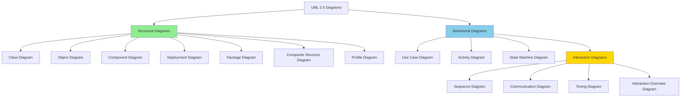

### Quick Reference

| Category | Diagram Type | Purpose | Usage Frequency |
|----------|-------------|---------|-----------------|
| Structural | Class | Show classes and relationships | ⭐⭐⭐⭐⭐ |
| Structural | Component | Show software components | ⭐⭐⭐ |
| Structural | Deployment | Show physical deployment | ⭐⭐⭐ |
| Structural | Object | Show object instances | ⭐⭐ |
| Structural | Package | Show package organization | ⭐⭐ |
| Structural | Composite Structure | Show internal structure | ⭐ |
| Structural | Profile | Extend UML | ⭐ |
| Behavioral | Use Case | Show system functionality | ⭐⭐⭐⭐⭐ |
| Behavioral | Sequence | Show time-ordered interactions | ⭐⭐⭐⭐⭐ |
| Behavioral | Activity | Show workflows | ⭐⭐⭐⭐ |
| Behavioral | State Machine | Show object states | ⭐⭐⭐ |
| Behavioral | Communication | Show message-based interactions | ⭐⭐ |
| Behavioral | Timing | Show time constraints | ⭐ |
| Behavioral | Interaction Overview | Show interaction flow | ⭐ |

---

## Structural Diagrams

Structural diagrams show the **static structure** of the system - what exists and how it's organized.

### 1. Class Diagram ⭐⭐⭐⭐⭐

**Purpose**: Most important diagram showing classes, attributes, methods, and relationships.

**When to Use**:

- Designing object-oriented systems
- Showing class hierarchy
- Documenting system architecture

**Example: E-Commerce System**

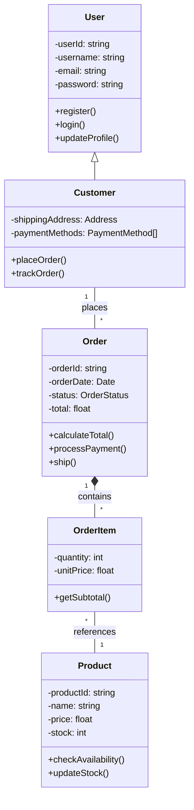

**JavaScript Implementation:**

```javascript
class User {
    #userId;
    #username;
    #email;
    #password;
    
    constructor(userId, username, email, password) {
        this.#userId = userId;
        this.#username = username;
        this.#email = email;
        this.#password = password;
    }
    
    register() {
        console.log(`User ${this.#username} registered`);
    }
    
    login(credentials) {
        return credentials.password === this.#password;
    }
}

class Customer extends User {
    #shippingAddress;
    #paymentMethods = [];
    #orders = [];
    
    constructor(userId, username, email, password, address) {
        super(userId, username, email, password);
        this.#shippingAddress = address;
    }
    
    placeOrder(items) {
        const order = new Order(this, items);
        this.#orders.push(order);
        return order;
    }
}
```

### 2. Object Diagram ⭐⭐

**Purpose**: Shows specific instances of classes at a particular moment in time.

**When to Use**:

- Understanding complex relationships
- Showing example scenarios
- Debugging design issues

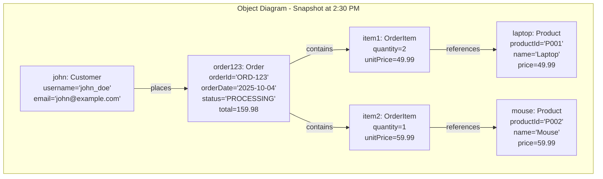

### 3. Component Diagram ⭐⭐⭐

**Purpose**: Shows how software components are organized and their dependencies.

**When to Use**:

- Designing system architecture
- Showing module dependencies
- Planning deployments

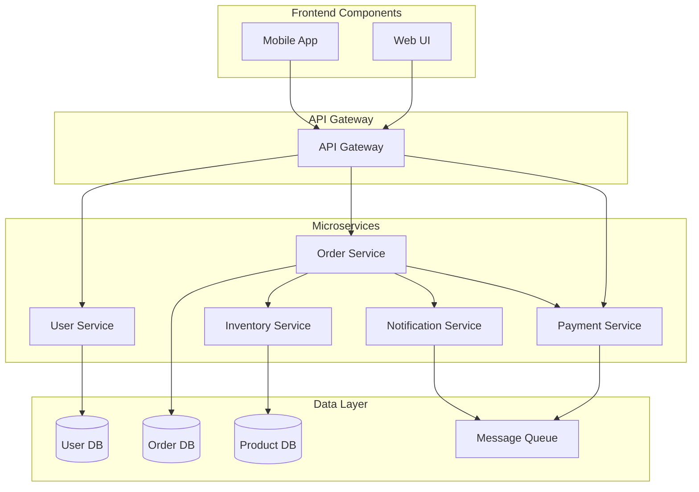

### 4. Deployment Diagram ⭐⭐⭐

**Purpose**: Shows physical deployment of artifacts on hardware nodes.

**When to Use**:

- Infrastructure planning
- System deployment
- DevOps documentation

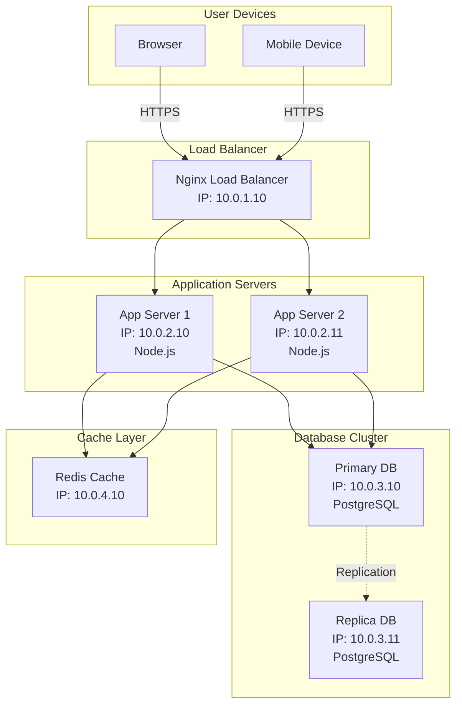

### 5. Package Diagram ⭐⭐

**Purpose**: Shows how packages are organized and their dependencies.

**When to Use**:

- Organizing large systems
- Managing dependencies
- Modular architecture

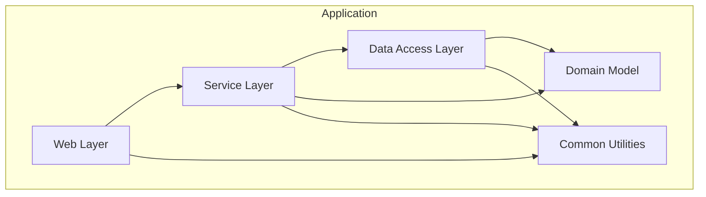

### 6. Composite Structure Diagram ⭐

**Purpose**: Shows internal structure of a class and collaborations.

**When to Use**:

- Complex class internals
- Design patterns implementation
- Component interactions

### 7. Profile Diagram ⭐

**Purpose**: Extends UML with custom stereotypes and constraints.

**When to Use**:

- Domain-specific modeling
- Custom notation needed
- Specialized systems

---

## Behavioral Diagrams

Behavioral diagrams show the **dynamic behavior** of the system - what happens and when.

### 1. Use Case Diagram ⭐⭐⭐⭐⭐

**Purpose**: Shows system functionality from user perspective.

**When to Use**:

- Requirements gathering
- Stakeholder communication
- System scope definition

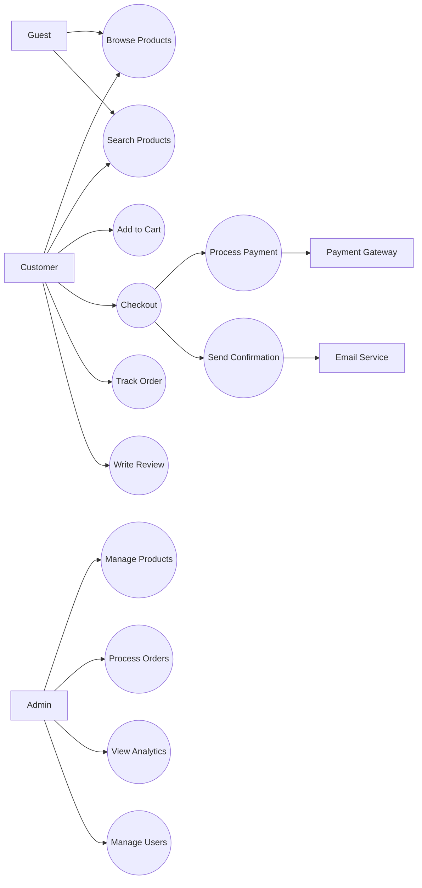

**JavaScript Example:**

```javascript
// Use Case: Checkout
class CheckoutUseCase {
    constructor(cart, paymentService, orderService, notificationService) {
        this.cart = cart;
        this.paymentService = paymentService;
        this.orderService = orderService;
        this.notificationService = notificationService;
    }
    
    async execute(customer, shippingAddress, paymentMethod) {
        // Validate cart
        if (this.cart.isEmpty()) {
            throw new Error("Cart is empty");
        }
        
        // Calculate total
        const total = this.cart.calculateTotal();
        
        // Process payment (uses Payment Gateway - actor)
        const paymentResult = await this.paymentService.process(
            paymentMethod,
            total
        );
        
        if (!paymentResult.success) {
            throw new Error("Payment failed");
        }
        
        // Create order
        const order = await this.orderService.createOrder({
            customer,
            items: this.cart.getItems(),
            shippingAddress,
            paymentResult
        });
        
        // Send confirmation (uses Email Service - actor)
        await this.notificationService.sendOrderConfirmation(
            customer.email,
            order
        );
        
        // Clear cart
        this.cart.clear();
        
        return order;
    }
}
```

### 2. Sequence Diagram ⭐⭐⭐⭐⭐

**Purpose**: Shows interactions between objects over time.

**When to Use**:

- Designing interactions
- Understanding message flow
- Documenting protocols

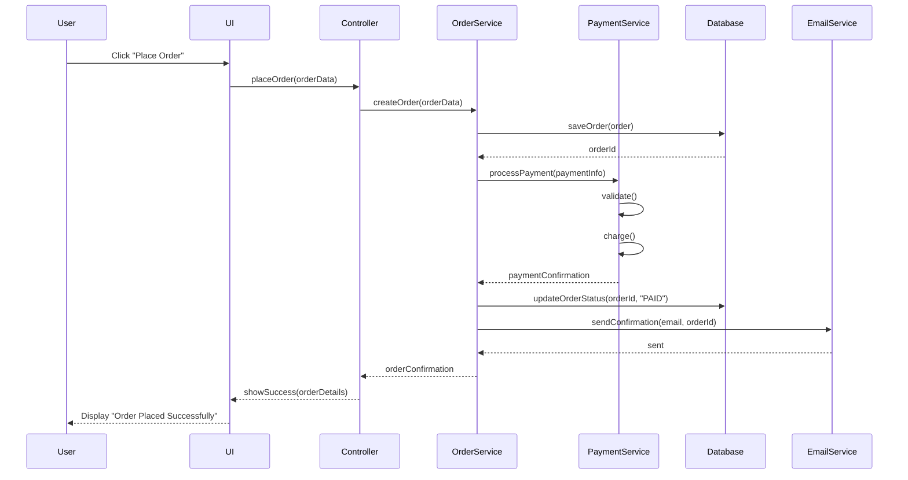

**JavaScript Implementation:**

```javascript
class OrderController {
    constructor(orderService, paymentService, emailService) {
        this.orderService = orderService;
        this.paymentService = paymentService;
        this.emailService = emailService;
    }
    
    async placeOrder(orderData) {
        try {
            // Create order
            const order = await this.orderService.createOrder(orderData);
            
            // Process payment
            const payment = await this.paymentService.processPayment({
                orderId: order.id,
                amount: order.total,
                method: orderData.paymentMethod
            });
            
            // Update order status
            await this.orderService.updateStatus(order.id, 'PAID');
            
            // Send confirmation
            await this.emailService.sendConfirmation(
                orderData.customer.email,
                order.id
            );
            
            return {
                success: true,
                orderId: order.id,
                message: "Order placed successfully"
            };
        } catch (error) {
            return {
                success: false,
                error: error.message
            };
        }
    }
}
```

### 3. Activity Diagram ⭐⭐⭐⭐

**Purpose**: Shows workflow, business processes, and algorithms.

**When to Use**:

- Business process modeling
- Workflow documentation
- Algorithm visualization

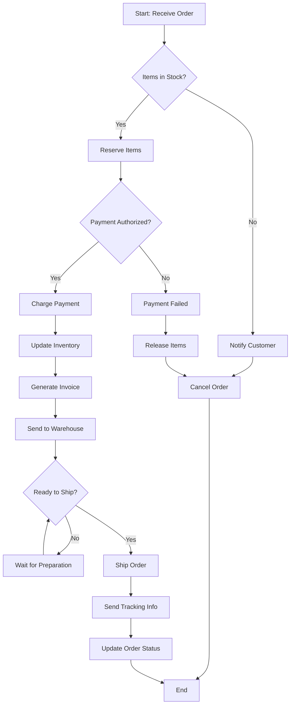

**Python Implementation:**

```python
class OrderWorkflow:
    def __init__(self, inventory, payment_service, shipping_service):
        self.inventory = inventory
        self.payment_service = payment_service
        self.shipping_service = shipping_service
    
    def process_order(self, order):
        # Check stock
        if not self.inventory.check_availability(order.items):
            self.notify_customer(order, "Items not in stock")
            self.cancel_order(order)
            return False
        
        # Reserve items
        self.inventory.reserve(order.items)
        
        # Authorize payment
        if not self.payment_service.authorize(order.payment_info):
            self.notify_customer(order, "Payment authorization failed")
            self.inventory.release(order.items)
            self.cancel_order(order)
            return False
        
        # Charge payment
        self.payment_service.charge(order.payment_info, order.total)
        
        # Update inventory
        self.inventory.deduct(order.items)
        
        # Generate invoice
        invoice = self.generate_invoice(order)
        
        # Send to warehouse
        self.shipping_service.prepare_shipment(order)
        
        # Wait for shipment ready
        while not self.shipping_service.is_ready(order):
            time.sleep(60)  # Check every minute
        
        # Ship order
        tracking = self.shipping_service.ship(order)
        
        # Send tracking info
        self.notify_customer(order, f"Shipped! Tracking: {tracking}")
        
        # Update status
        order.status = "SHIPPED"
        
        return True
```

### 4. State Machine Diagram ⭐⭐⭐

**Purpose**: Shows states of an object and transitions between states.

**When to Use**:

- Complex object lifecycle
- Protocol design
- UI state management

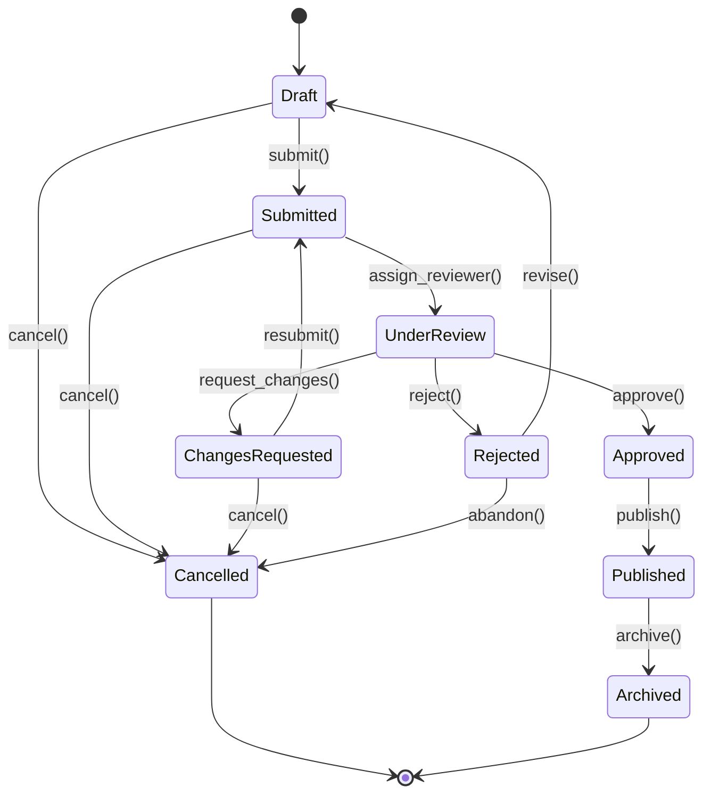

**JavaScript Implementation:**

```javascript
class Document {
    #state;
    #content;
    
    constructor(content) {
        this.#content = content;
        this.#state = 'DRAFT';
    }
    
    submit() {
        if (this.#state !== 'DRAFT' && this.#state !== 'CHANGES_REQUESTED') {
            throw new Error(`Cannot submit from ${this.#state} state`);
        }
        this.#state = 'SUBMITTED';
        console.log('Document submitted');
    }
    
    assignReviewer(reviewer) {
        if (this.#state !== 'SUBMITTED') {
            throw new Error(`Cannot assign reviewer from ${this.#state} state`);
        }
        this.#state = 'UNDER_REVIEW';
        console.log(`Document under review by ${reviewer}`);
    }
    
    requestChanges(comments) {
        if (this.#state !== 'UNDER_REVIEW') {
            throw new Error(`Cannot request changes from ${this.#state} state`);
        }
        this.#state = 'CHANGES_REQUESTED';
        console.log(`Changes requested: ${comments}`);
    }
    
    approve() {
        if (this.#state !== 'UNDER_REVIEW') {
            throw new Error(`Cannot approve from ${this.#state} state`);
        }
        this.#state = 'APPROVED';
        console.log('Document approved');
    }
    
    reject(reason) {
        if (this.#state !== 'UNDER_REVIEW') {
            throw new Error(`Cannot reject from ${this.#state} state`);
        }
        this.#state = 'REJECTED';
        console.log(`Document rejected: ${reason}`);
    }
    
    publish() {
        if (this.#state !== 'APPROVED') {
            throw new Error(`Cannot publish from ${this.#state} state`);
        }
        this.#state = 'PUBLISHED';
        console.log('Document published');
    }
    
    getState() {
        return this.#state;
    }
}

// Demo
const doc = new Document("My Article");
doc.submit();
doc.assignReviewer("John");
doc.approve();
doc.publish();
console.log(`Final state: ${doc.getState()}`);
```

### 5. Communication Diagram ⭐⭐

**Purpose**: Shows interactions between objects with focus on relationships.

**When to Use**:

- Alternative to sequence diagrams
- Emphasizing object relationships
- Complex collaborations

### 6. Timing Diagram ⭐

**Purpose**: Shows behavior over time with time constraints.

**When to Use**:

- Real-time systems
- Time-critical operations
- Performance analysis

### 7. Interaction Overview Diagram ⭐

**Purpose**: Shows overview of interaction flow.

**When to Use**:

- High-level interaction flow
- Combining multiple scenarios
- System overview

---

## Diagram Selection Guide

### Decision Tree

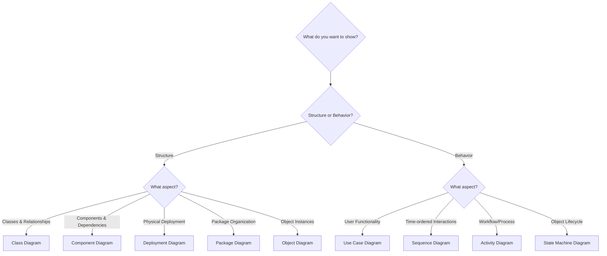

### Common Scenarios

| Scenario | Recommended Diagram |
|----------|---------------------|
| Designing class hierarchy | Class Diagram |
| Showing user features | Use Case Diagram |
| Documenting API calls | Sequence Diagram |
| Business process | Activity Diagram |
| Order lifecycle | State Machine Diagram |
| Microservices architecture | Component Diagram |
| Infrastructure setup | Deployment Diagram |
| Package dependencies | Package Diagram |

---

## Comparison Matrix

### Structural Diagrams Comparison

| Feature | Class | Component | Deployment | Package |
|---------|-------|-----------|------------|---------|
| **Abstraction Level** | Low | Medium | High | Medium |
| **Shows Code Structure** | Yes | Partially | No | Yes |
| **Shows Physical Deployment** | No | No | Yes | No |
| **Used in Design Phase** | Yes | Yes | No | Yes |
| **Used in Development** | Yes | Yes | No | Yes |
| **Used in Operations** | No | Partially | Yes | No |

### Behavioral Diagrams Comparison

| Feature | Use Case | Sequence | Activity | State Machine |
|---------|----------|----------|----------|---------------|
| **Shows User Perspective** | Yes | No | Partially | No |
| **Shows Time Order** | No | Yes | Partially | Yes |
| **Shows Workflow** | No | No | Yes | No |
| **Shows Object States** | No | No | No | Yes |
| **Good for Requirements** | Yes | No | Yes | No |
| **Good for Design** | No | Yes | Yes | Yes |

---

## Real-World Example

### Complete System Documentation

Let's document an **Online Food Ordering System** using multiple diagrams.

#### 1. Use Case Diagram - System Functionality

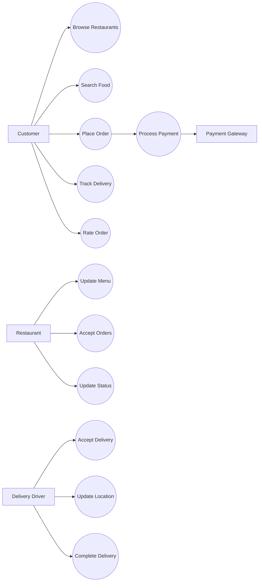

#### 2. Class Diagram - System Structure

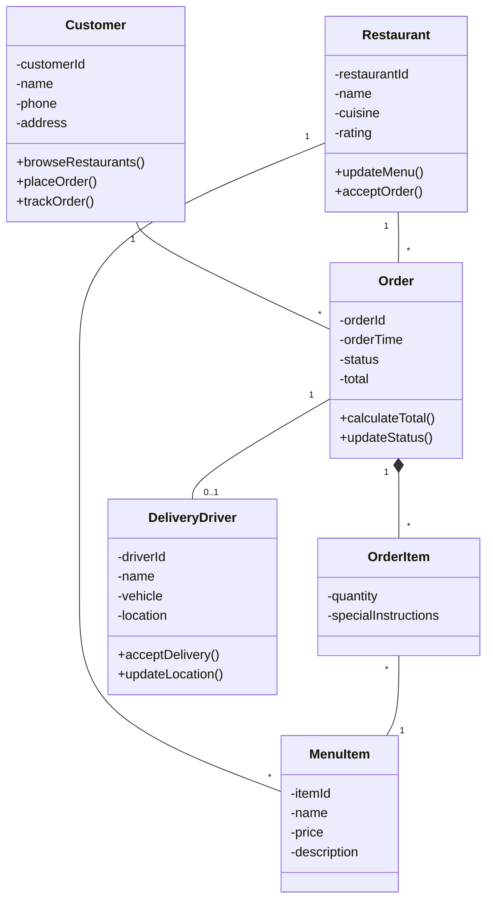

#### 3. Sequence Diagram - Place Order Flow

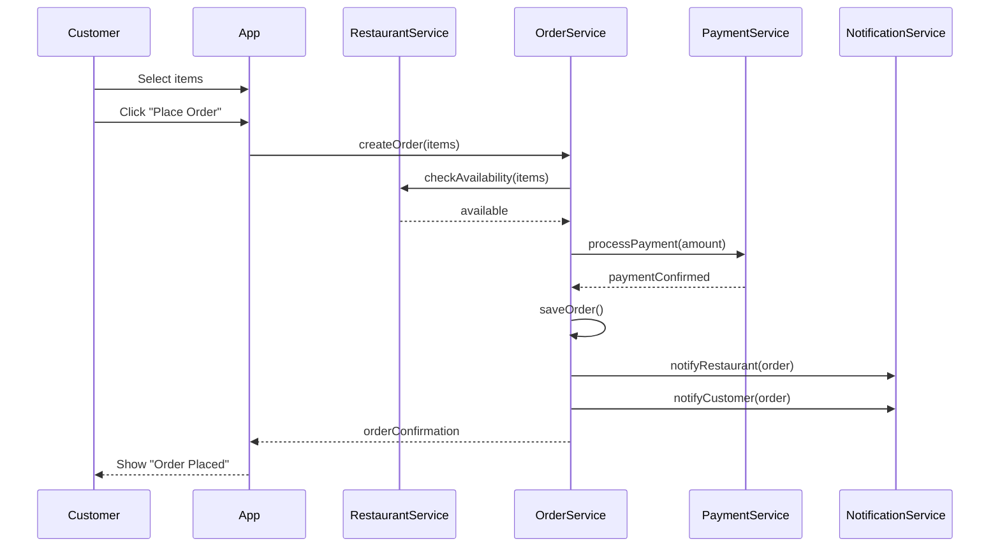

#### 4. State Machine Diagram - Order Lifecycle

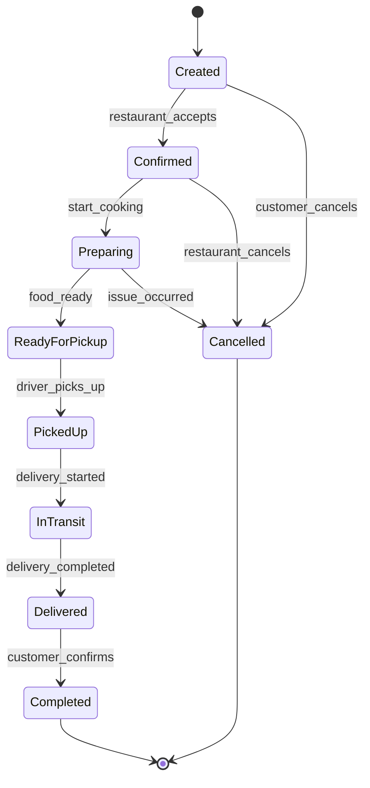

#### 5. Activity Diagram - Order Processing

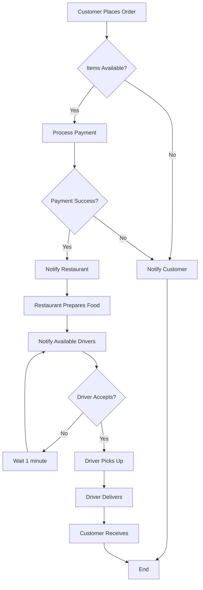

---

## Best Practices

### 1. Choose the Right Diagram

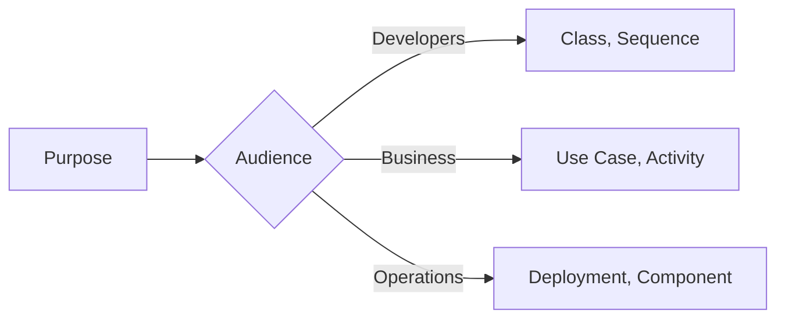

### 2. Keep It Simple

```javascript
// ✅ GOOD: One diagram per concern
// - Class diagram for User Management
// - Class diagram for Order Management
// - Class diagram for Payment Processing

// ❌ BAD: One massive class diagram with everything
```

### 3. Use Consistent Notation

```javascript
// ✅ GOOD: Consistent across all diagrams
/*
+ public
- private
# protected
~ package
*/

// ❌ BAD: Mixed notation
/*
Some diagrams use +public
Others use public:
*/
```

### 4. Add Context

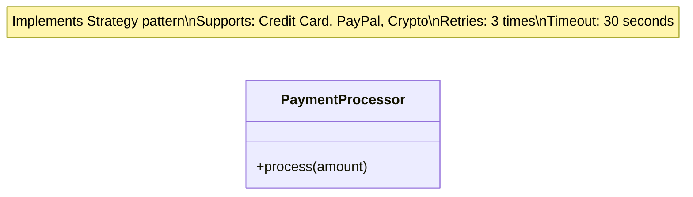

### 5. Version and Maintain

```bash
# Store diagrams in version control
docs/
  diagrams/
    class/
      user-management-v1.0.puml
      order-management-v1.0.puml
    sequence/
      checkout-flow-v1.0.mmd
```

---

## Common Mistakes

### Mistake 1: Wrong Diagram Type

```text
❌ BAD:
- Using Class Diagram to show process flow
  (Use Activity Diagram instead)

- Using Sequence Diagram to show class relationships
  (Use Class Diagram instead)

✅ GOOD:
- Use Class Diagram for structure
- Use Sequence Diagram for interactions
- Use Activity Diagram for workflows
```

### Mistake 2: Too Much Detail

```text
❌ BAD: Include every getter/setter
class User {
    -id
    +getId()
    +setId()
    -name
    +getName()
    +setName()
    // ... 20 more properties
}

✅ GOOD: Show only relevant details
class User {
    -id
    -name
    -email
    +authenticate()
    +updateProfile()
}
```

### Mistake 3: Inconsistent Abstraction Levels

```text
❌ BAD: Mixing high and low level
- Some classes show implementation details
- Others show just interfaces
- Inconsistent granularity

✅ GOOD: Consistent abstraction
- All classes at same level
- Either all detailed or all high-level
- Consistent granularity
```

---

## Interview Questions

### Q1: What are the two main categories of UML diagrams?

**Answer**:

1. **Structural Diagrams**: Show static structure (Class, Component, Deployment, Package, Object, Composite Structure, Profile)
2. **Behavioral Diagrams**: Show dynamic behavior (Use Case, Sequence, Activity, State Machine, Communication, Timing, Interaction Overview)

### Q2: When would you use a sequence diagram vs a communication diagram?

**Answer**:

- **Sequence Diagram**: When time ordering is important, showing messages in chronological order
- **Communication Diagram**: When object relationships are important, showing how objects collaborate

### Q3: What's the difference between class diagram and object diagram?

**Answer**:

- **Class Diagram**: Shows classes, attributes, methods, and relationships (general structure)
- **Object Diagram**: Shows specific instances at a point in time (concrete snapshot)

### Q4: When should you use a state machine diagram?

**Answer**: Use state machine diagrams when:

- Object has well-defined states
- Complex lifecycle
- State-dependent behavior
- Protocol design
- Examples: Order status, Document workflow, Connection states

### Q5: What diagram would you use to show system deployment?

**Answer**: **Deployment Diagram** - shows how software components are deployed on physical hardware nodes, including servers, networks, and connections.

### Q6: How do you decide which diagram to create first?

**Answer**:

1. **Use Case Diagram**: Start here for requirements
2. **Class Diagram**: Then design structure
3. **Sequence Diagram**: Then detail interactions
4. **Activity Diagram**: For complex processes
5. **State Machine**: For stateful objects
6. **Deployment**: Finally, for deployment planning

### Q7: Can you combine multiple diagram types?

**Answer**: No, maintain diagram purity. Each diagram should serve one purpose. However, you can create multiple diagrams that complement each other for complete system documentation.

---

## Summary

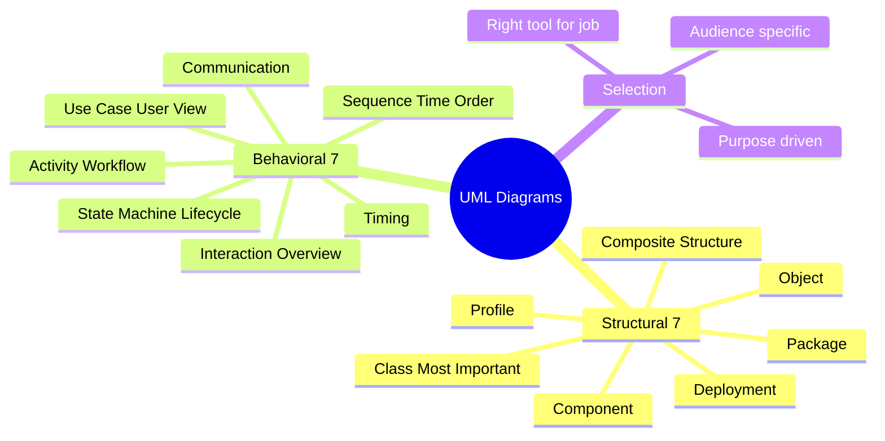

---

## Next Steps

1. **Study**: [Use Case Diagrams](./use-case-diagram.md) in detail
2. **Study**: [Class Diagrams](./class-diagram.md) in detail
3. **Study**: [Sequence Diagrams](./sequence-diagram.md) in detail
4. **Practice**: Create diagrams for a small project
5. **Review**: Practice reading and creating each diagram type

---

**Key Takeaway**: Each UML diagram serves a specific purpose. Master the most common ones (Class, Use Case, Sequence, Activity, State Machine) and use the right diagram for your specific need. Don't try to show everything in one diagram!

