# Introduction to Unified Modeling Language (UML)

**Purpose**: Master UML - the industry-standard visual language for modeling, designing, and documenting software systems using standardized diagrams.

---

## Table of Contents

1. [What is UML?](#what-is-uml)
2. [History and Evolution](#history-and-evolution)
3. [Why Use UML?](#why-use-uml)
4. [UML Building Blocks](#uml-building-blocks)
5. [UML Diagram Categories](#uml-diagram-categories)
6. [When to Use UML](#when-to-use-uml)
7. [UML Tools](#uml-tools)
8. [Best Practices](#best-practices)
9. [Common Mistakes](#common-mistakes)
10. [Interview Questions](#interview-questions)

---

## What is UML?

**Unified Modeling Language (UML)** is a standardized visual modeling language used to specify, visualize, construct, and document the artifacts of software systems. It provides a common language for developers, analysts, and stakeholders to communicate about system design.

### Key Definition

> UML is a general-purpose, developmental, modeling language that provides a standard way to visualize the design of a system through diagrams.

### UML Overview

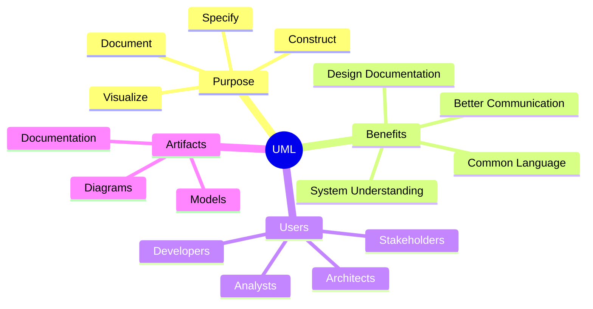

---

## History and Evolution

### Timeline

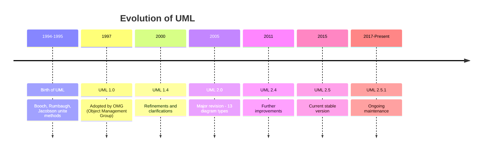

### The Three Amigos

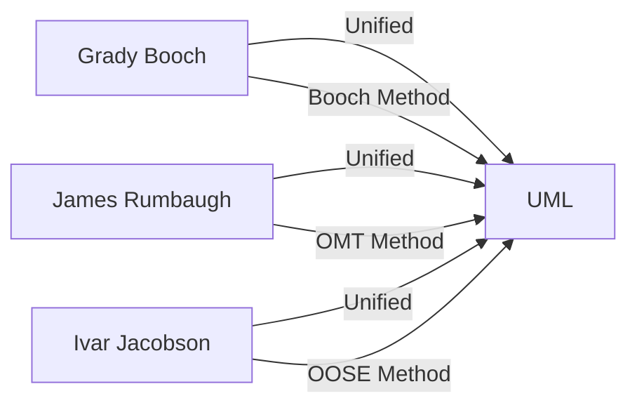

**Key Contributors:**
- **Grady Booch**: Booch Method
- **James Rumbaugh**: Object Modeling Technique (OMT)
- **Ivar Jacobson**: Object-Oriented Software Engineering (OOSE)

---

## Why Use UML?

### Benefits

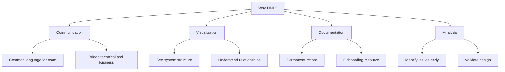

### 1. **Standardized Communication**

UML provides a universal language understood by developers worldwide.

**Example Scenario:**

```javascript
// Without UML: Lengthy textual description
/*
The Order class has a customer reference and a collection of order items.
Each order item has a product and quantity. When an order is placed,
it calculates the total by iterating through items and summing their
subtotals. The order interacts with a payment processor...
*/

// With UML: One diagram shows all relationships clearly
// See class diagram below
```

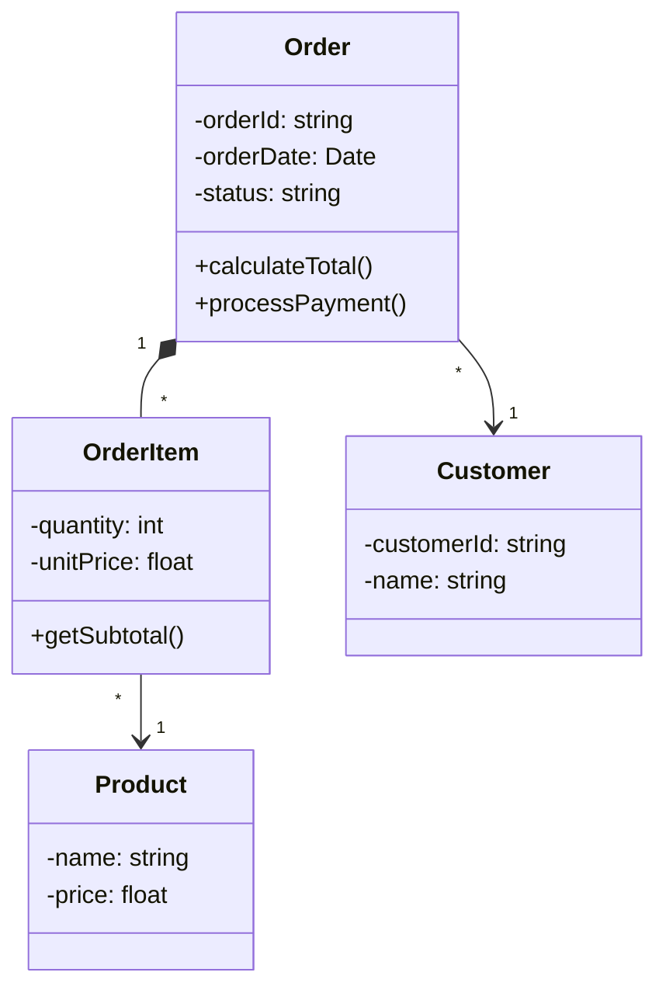

### 2. **Early Problem Detection**

Visualizing system structure helps identify design flaws before coding.

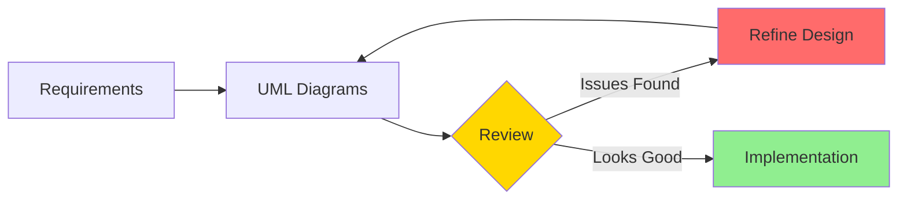

### 3. **Better Planning**

Helps estimate effort, identify components, and plan architecture.

### 4. **Team Collaboration**

Provides common understanding across roles:
- Developers understand technical details
- Business analysts understand workflows
- Managers understand system scope

---

## UML Building Blocks

### 1. Things (Elements)

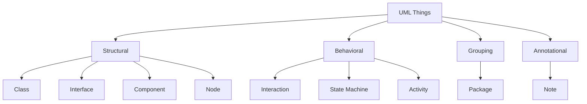

**Structural Things**: Static parts of the model
- Class, Interface, Component, Node, etc.

**Behavioral Things**: Dynamic parts showing behavior
- Interaction, State Machine, Activity

**Grouping Things**: Organizational parts
- Package (groups related elements)

**Annotational Things**: Explanatory parts
- Note (comments on diagrams)

### 2. Relationships

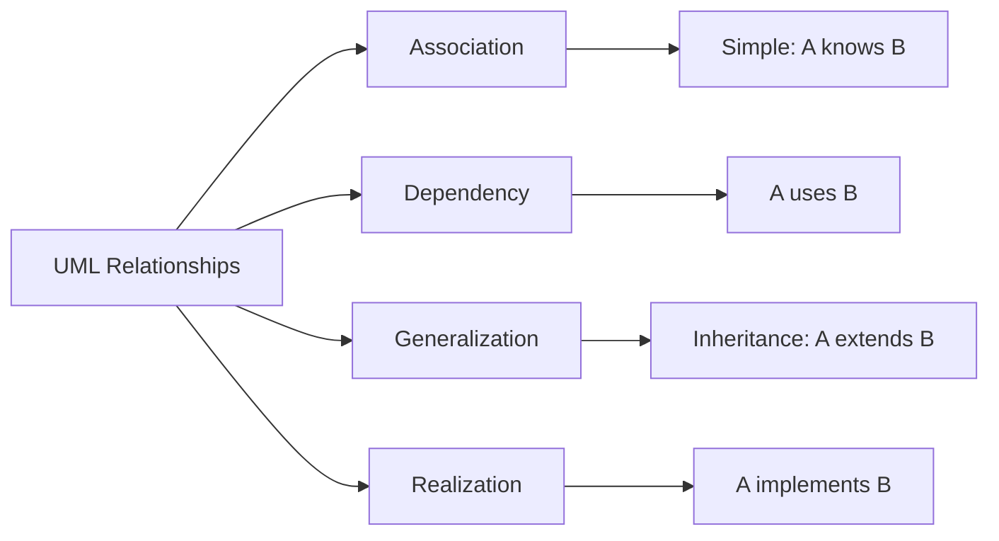

**Association Example:**

```javascript
class Customer {
    #orders = []; // Customer has Orders
    
    placeOrder(order) {
        this.#orders.push(order);
    }
}

class Order {
    #customer; // Order belongs to Customer
    
    constructor(customer) {
        this.#customer = customer;
    }
}
```

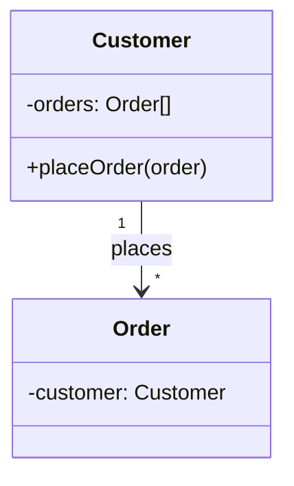

**Dependency Example:**

```javascript
class OrderProcessor {
    process(order) {
        // Depends on Order but doesn't store it
        const total = order.calculateTotal();
        return total;
    }
}
```

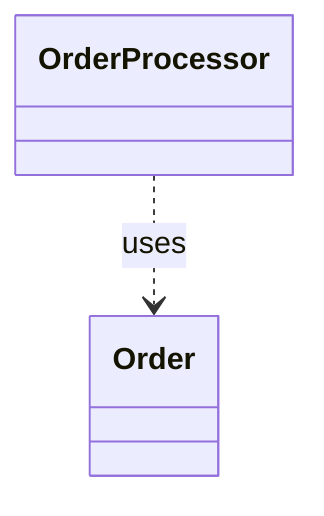

**Generalization (Inheritance) Example:**

```javascript
class Animal {
    move() { }
}

class Dog extends Animal {
    bark() { }
}
```

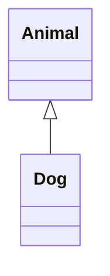

**Realization (Interface Implementation) Example:**

```javascript
// Interface (concept)
class Drawable {
    draw() {
        throw new Error("Must implement draw()");
    }
}

class Circle extends Drawable {
    draw() {
        console.log("Drawing circle");
    }
}
```

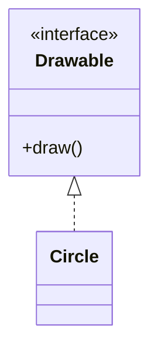

### 3. Diagrams

Visual representations of Things and their Relationships.

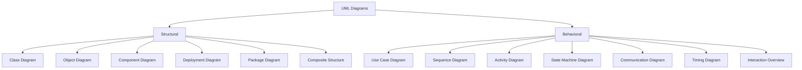

---

## UML Diagram Categories

### Structural Diagrams

Show the static structure of the system.

#### 1. Class Diagram

Most common diagram showing classes, attributes, methods, and relationships.

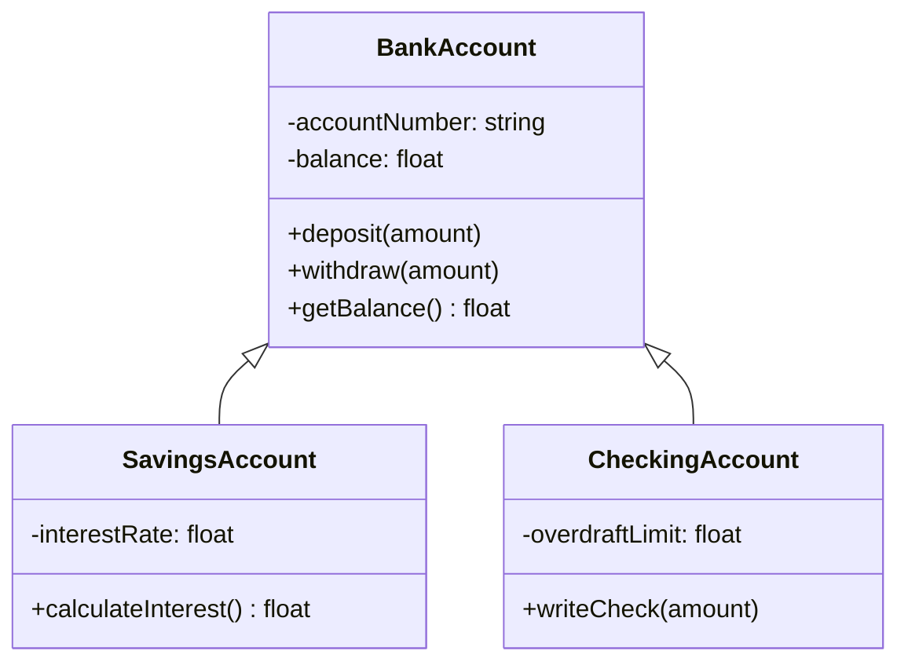

#### 2. Component Diagram

Shows software components and their dependencies.

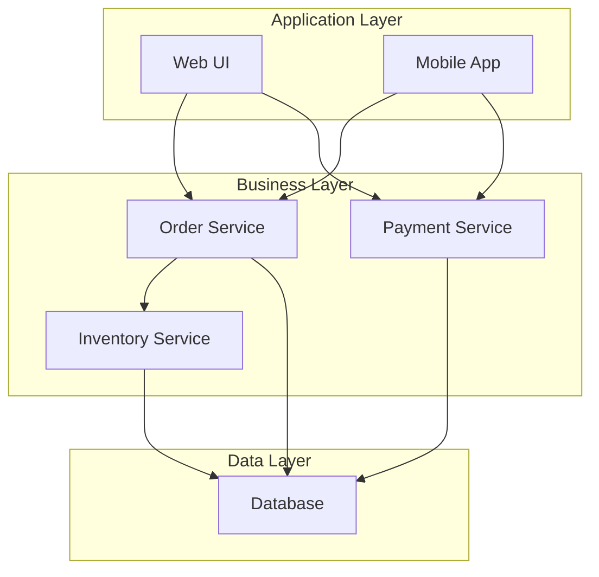

#### 3. Deployment Diagram

Shows physical deployment of artifacts on nodes.

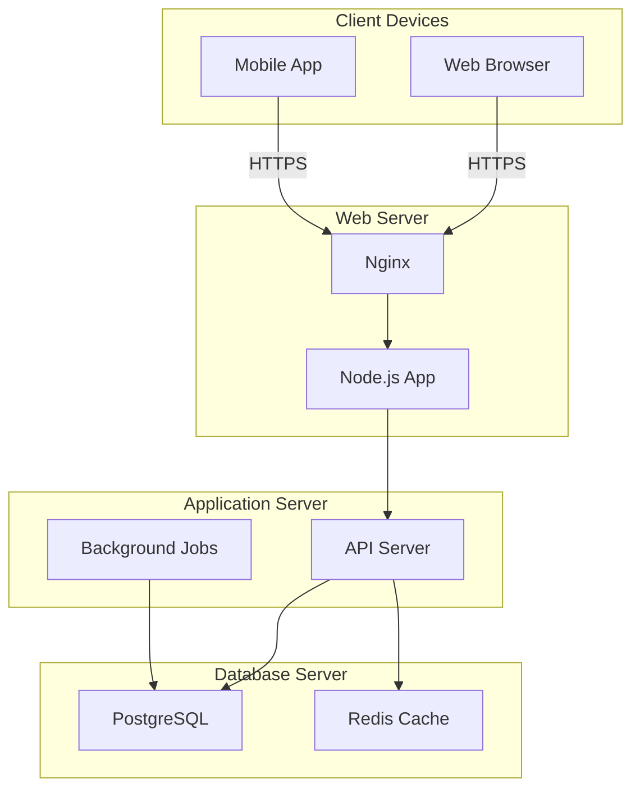

### Behavioral Diagrams

Show the dynamic behavior of the system.

#### 1. Use Case Diagram

Shows system functionality from user perspective.

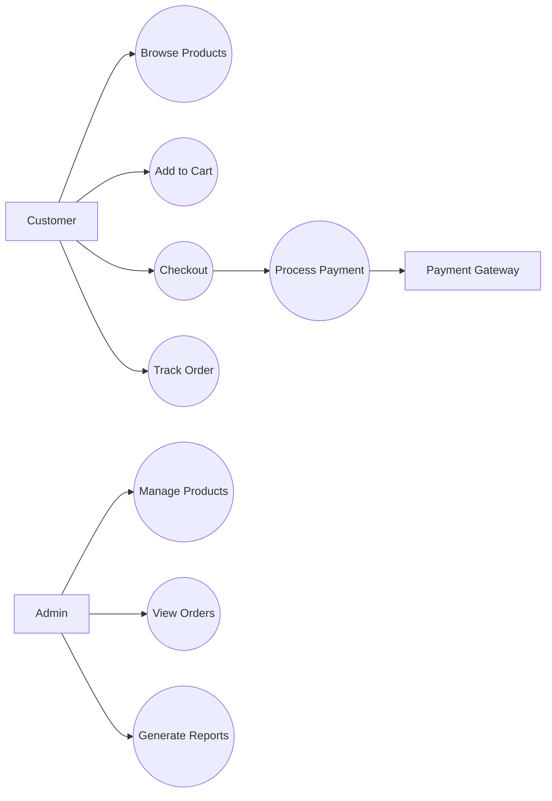

#### 2. Sequence Diagram

Shows interactions between objects over time.

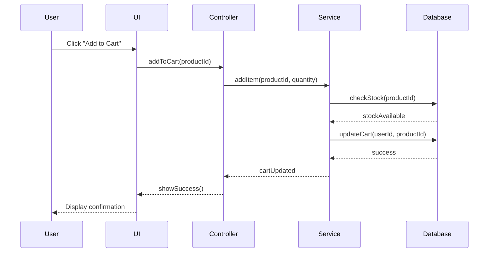

#### 3. Activity Diagram

Shows workflow or process flow.

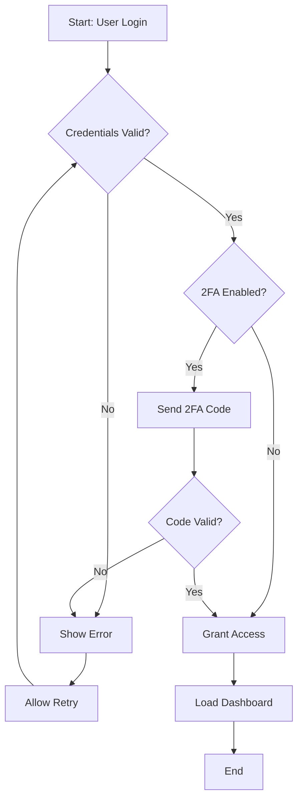

#### 4. State Machine Diagram

Shows states and transitions of an object.

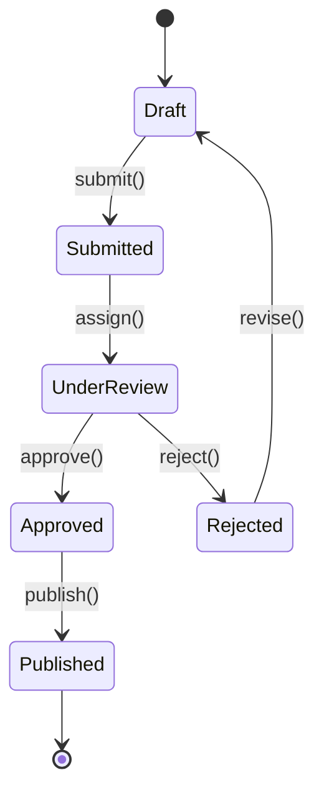

---

## When to Use UML

### Perfect For

✅ **Complex Systems**
- Multiple components and interactions
- Need clear visualization

✅ **Team Communication**
- Multiple developers
- Mixed technical/non-technical stakeholders

✅ **Documentation**
- System architecture
- Design decisions
- Onboarding materials

✅ **Design Phase**
- Planning before coding
- Identifying potential issues
- Architectural decisions

### Not Necessary For

❌ **Simple Scripts**
- Quick utilities
- Small automation tasks

❌ **Prototypes**
- Rapid experimentation
- Proof of concepts

❌ **Over-Documentation**
- Every small change
- Trivial features

### Decision Matrix

```mermaid
graph TD
    A{System Complexity?} -->|High| B[Use UML]
    A -->|Low| C{Team Size?}
    C -->|Large| B
    C -->|Small| D{Need Documentation?}
    D -->|Yes| B
    D -->|No| E[UML Optional]
```

---

## UML Tools

### Popular Tools

```mermaid
graph LR
    A[UML Tools] --> B[Desktop]
    A --> C[Web-Based]
    A --> D[IDE Plugins]
    A --> E[Code-to-Diagram]
    
    B --> B1[StarUML]
    B --> B2[Visual Paradigm]
    B --> B3[Enterprise Architect]
    
    C --> C1[Lucidchart]
    C --> C2[Draw.io]
    C --> C3[PlantUML]
    C --> C4[Mermaid]
    
    D --> D1[VS Code Extensions]
    D --> D2[IntelliJ Plugins]
    
    E --> E1[Code Reverse Engineering]
```

### Mermaid Example

```javascript
// You can embed Mermaid in markdown
/*
```mermaid
classDiagram
    class User {
        -id: string
        -name: string
        +login()
        +logout()
    }
```
*/
```

### PlantUML Example

```text
@startuml
class User {
    -id: string
    -name: string
    +login()
    +logout()
}
@enduml
```

---

## Best Practices

### 1. Keep Diagrams Simple

```mermaid
graph LR
    A[Simplicity] --> B[One Purpose per Diagram]
    A --> C[Limit Elements 7-10]
    A --> D[Clear Labels]
    A --> E[Consistent Notation]
```

**Example:**

```javascript
// ❌ BAD: One massive diagram with 50 classes
// ✅ GOOD: Multiple focused diagrams

// Diagram 1: User Management Classes
// - User, UserProfile, Authentication

// Diagram 2: Order Management Classes  
// - Order, OrderItem, Payment

// Diagram 3: Inventory Management Classes
// - Product, Inventory, Supplier
```

### 2. Use Appropriate Diagram Types

```mermaid
graph TD
    A{What to Show?} -->|System Features| B[Use Case Diagram]
    A -->|Class Structure| C[Class Diagram]
    A -->|Interactions| D[Sequence Diagram]
    A -->|Workflow| E[Activity Diagram]
    A -->|Object States| F[State Diagram]
```

### 3. Maintain Consistency

```javascript
// ✅ GOOD: Consistent naming
class UserService {
    createUser() { }
    updateUser() { }
    deleteUser() { }
}

class OrderService {
    createOrder() { }  // Consistent with UserService
    updateOrder() { }
    deleteOrder() { }
}

// ❌ BAD: Inconsistent naming
class UserService {
    createUser() { }
    modifyUser() { }  // Should be updateUser()
    removeUser() { }  // Should be deleteUser()
}
```

### 4. Add Meaningful Notes

```mermaid
classDiagram
    class PaymentProcessor {
        +process(amount)
    }
    
    note for PaymentProcessor "Uses Stripe API\nRetries 3 times on failure\nTimeout: 30 seconds"
```

### 5. Version Control Diagrams

```bash
# Store UML source files in version control
git add diagrams/class-diagram.puml
git add diagrams/sequence-diagram.mmd
git commit -m "docs: update payment flow sequence diagram"
```

---

## Common Mistakes

### Mistake 1: Over-Complicating Diagrams

```mermaid
graph LR
    A[❌ BAD] --> B[50+ classes in one diagram]
    A --> C[Every detail shown]
    A --> D[Unreadable mess]
    
    E[✅ GOOD] --> F[5-10 classes per diagram]
    E --> G[Focus on key aspects]
    E --> H[Clear and readable]
```

### Mistake 2: Inconsistent Notation

```javascript
// ❌ BAD: Mixing notations
/*
Some diagrams use:
- public methods
Other diagrams use:
+ public methods
*/

// ✅ GOOD: Pick one notation and stick to it
/*
All diagrams consistently use:
+ public
- private
# protected
*/
```

### Mistake 3: Outdated Diagrams

```mermaid
graph TD
    A[Code Changes] -->|Update| B[Source Code]
    A -->|Forget| C[UML Diagrams]
    C --> D[❌ Diagrams become misleading]
    
    E[Best Practice] --> F[Update diagrams with code]
    E --> G[Version control together]
```

### Mistake 4: Wrong Diagram Type

```text
❌ BAD Examples:
- Using Class Diagram to show workflow (use Activity Diagram)
- Using Sequence Diagram to show structure (use Class Diagram)
- Using Use Case Diagram for detailed logic (use Activity Diagram)

✅ GOOD: Choose the right diagram for your purpose
```

### Mistake 5: No Context

```mermaid
classDiagram
    class Order {
        +process()
    }
    
    note for Order "❌ BAD: No context about what process() does"
```

```mermaid
classDiagram
    class Order {
        +process()
    }
    
    note for Order "✅ GOOD: Validates, charges payment,\nupdates inventory, sends confirmation"
```

---

## Interview Questions

### Q1: What is UML?

**Answer**: UML (Unified Modeling Language) is a standardized visual modeling language used to specify, visualize, construct, and document software systems. It provides a common notation for communicating system design across teams and stakeholders.

### Q2: What are the main categories of UML diagrams?

**Answer**:
1. **Structural Diagrams**: Show static structure (Class, Component, Deployment, Package, Object, Composite Structure)
2. **Behavioral Diagrams**: Show dynamic behavior (Use Case, Sequence, Activity, State Machine, Communication, Timing, Interaction Overview)

### Q3: When should you use UML?

**Answer**: Use UML when:
- System is complex with multiple components
- Team needs clear communication
- Documentation is important
- Planning and design phase
- Need to identify issues early
- Multiple stakeholders involved

### Q4: What's the difference between class diagram and object diagram?

**Answer**:
- **Class Diagram**: Shows classes and their relationships (static structure)
- **Object Diagram**: Shows specific instances of classes at a point in time (snapshot)

### Q5: Why is UML important in software development?

**Answer**:
1. **Standardization**: Universal language
2. **Communication**: Bridges technical and business
3. **Visualization**: See system structure
4. **Documentation**: Permanent design record
5. **Analysis**: Identify issues early
6. **Planning**: Better estimation and architecture

### Q6: What are the building blocks of UML?

**Answer**:
1. **Things**: Elements (structural, behavioral, grouping, annotational)
2. **Relationships**: Connections (association, dependency, generalization, realization)
3. **Diagrams**: Visual representations

### Q7: Can UML diagrams be generated from code?

**Answer**: Yes! Tools like:
- IDE plugins (IntelliJ, VS Code)
- Reverse engineering tools
- Documentation generators (JavaDoc, JSDoc)
- PlantUML from code annotations

However, manually created diagrams often provide better abstraction and focus.

### Q8: What's the difference between association and dependency?

**Answer**:
- **Association**: Stronger relationship, object holds reference (e.g., Customer has Orders)
- **Dependency**: Weaker relationship, temporary usage (e.g., Method uses a class as parameter)

---

## Summary

```mermaid
mindmap
  root((UML))
    Purpose
      Visualize
      Specify
      Document
      Communicate
    Diagram Types
      Structural
        Class
        Component
        Deployment
      Behavioral
        Use Case
        Sequence
        Activity
        State Machine
    Benefits
      Standard Language
      Early Problem Detection
      Better Planning
      Team Collaboration
    Best Practices
      Keep Simple
      Stay Consistent
      Choose Right Type
      Version Control
```

---

## Next Steps

1. **Study**: [UML Diagram Types](./uml-diagrams.md)
2. **Study**: [Use Case Diagrams](./use-case-diagram.md)
3. **Study**: [Class Diagrams](./class-diagram.md)
4. **Study**: [Sequence Diagrams](./sequence-diagram.md)
5. **Practice**: Create UML diagrams for a simple project

---

## Resources

- **Official OMG UML Spec**: https://www.omg.org/spec/UML/
- **Mermaid Diagrams**: https://mermaid.js.org/
- **PlantUML**: https://plantuml.com/
- **Draw.io**: https://app.diagrams.net/

---

**Key Takeaway**: UML is a powerful communication tool that helps teams visualize, understand, and document software systems. Use it appropriately - not every project needs detailed UML, but complex systems benefit greatly from clear visual models!

