# Use Case Diagram

**Purpose**: Master use case diagrams - the primary tool for capturing functional requirements and showing system functionality from the user's perspective in UML.

---

## Table of Contents

1. [What is a Use Case Diagram?](#what-is-a-use-case-diagram)
2. [Components of Use Case Diagrams](#components-of-use-case-diagrams)
3. [Actors](#actors)
4. [Use Cases](#use-cases)
5. [Relationships](#relationships)
6. [Creating Use Case Diagrams](#creating-use-case-diagrams)
7. [Real-World Examples](#real-world-examples)
8. [Best Practices](#best-practices)
9. [Common Mistakes](#common-mistakes)
10. [Interview Questions](#interview-questions)

---

## What is a Use Case Diagram?

**Use Case Diagram** shows the functional requirements of a system by depicting how users (actors) interact with the system to achieve specific goals (use cases).

### Key Definition

> A Use Case Diagram represents the functionality of a system from an external user's point of view, showing what the system does (not how it does it) and who interacts with it.

### Purpose

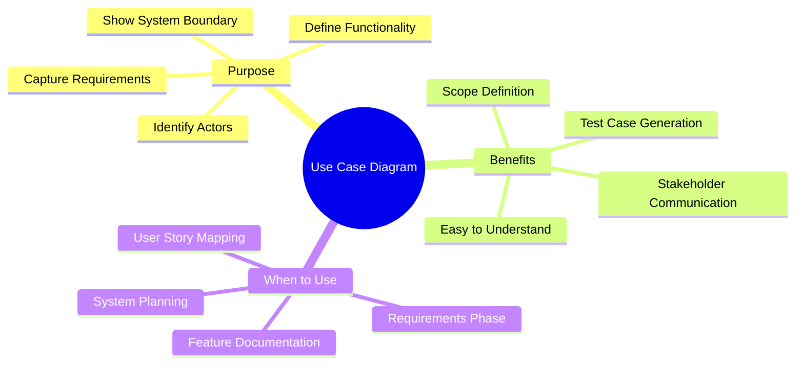

### Visual Overview

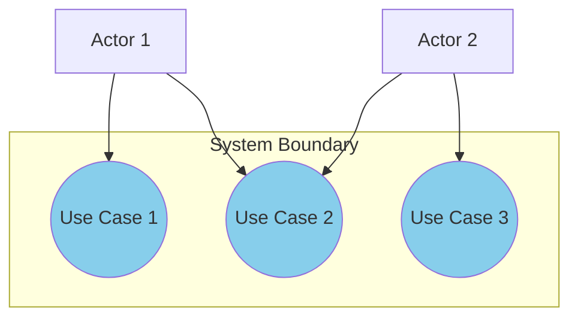

---

## Components of Use Case Diagrams

### 1. System Boundary

The rectangle that defines the scope of the system.

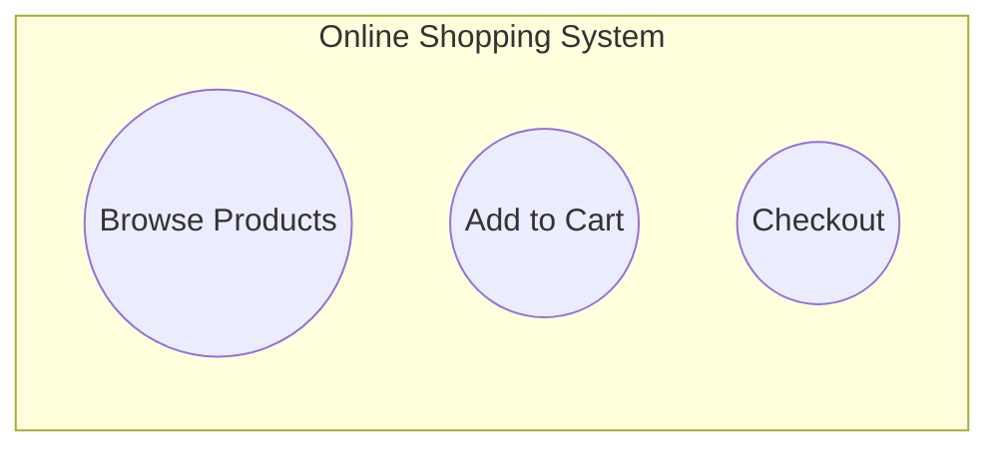

### 2. Actors

External entities that interact with the system.

### 3. Use Cases

Specific functionality or goals users want to achieve.

### 4. Relationships

Connections between actors and use cases, or between use cases.

### Complete Structure

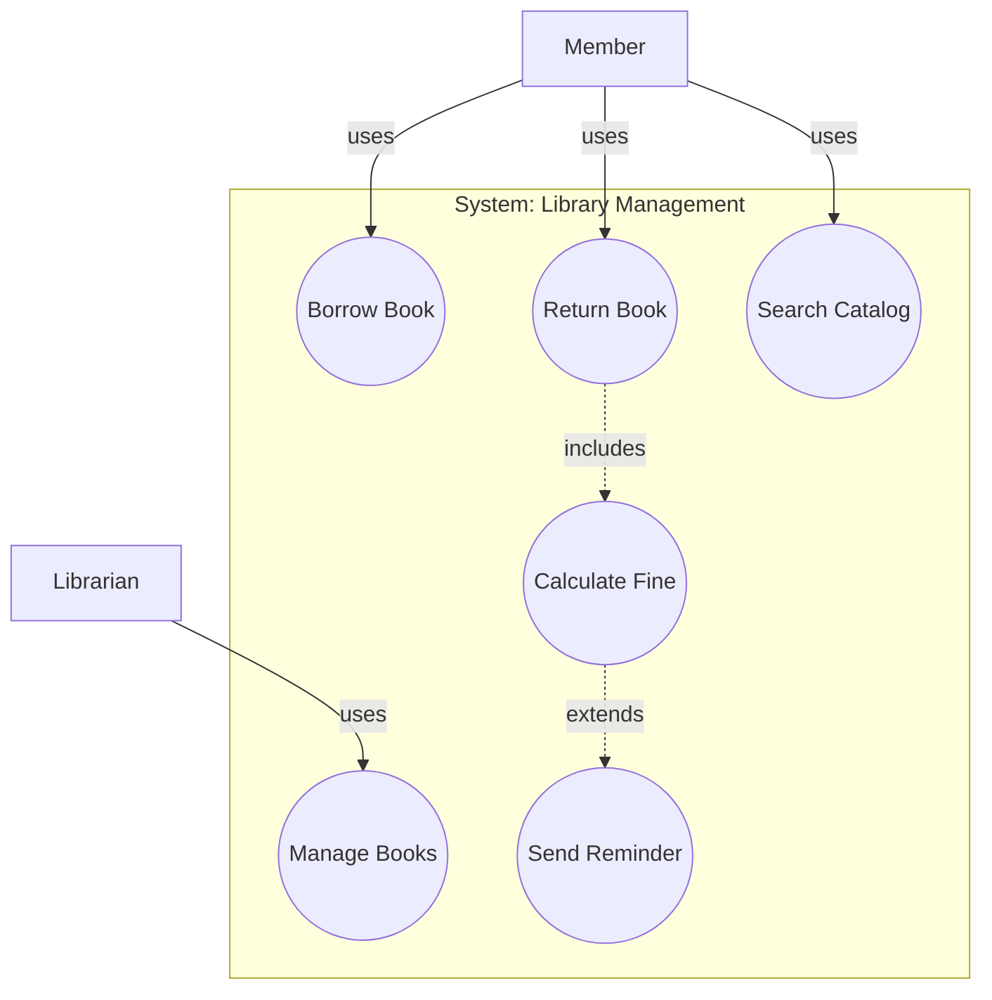

---

## Actors

### What is an Actor?

An actor represents a role played by an external entity (person, organization, or system) that interacts with the system.

### Types of Actors

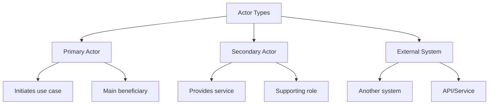

### Actor Notation

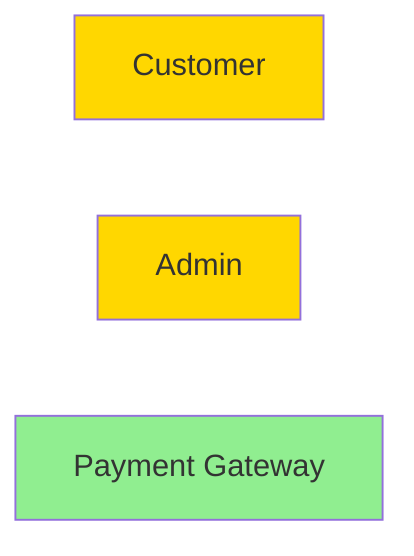

### Example: E-Commerce System Actors

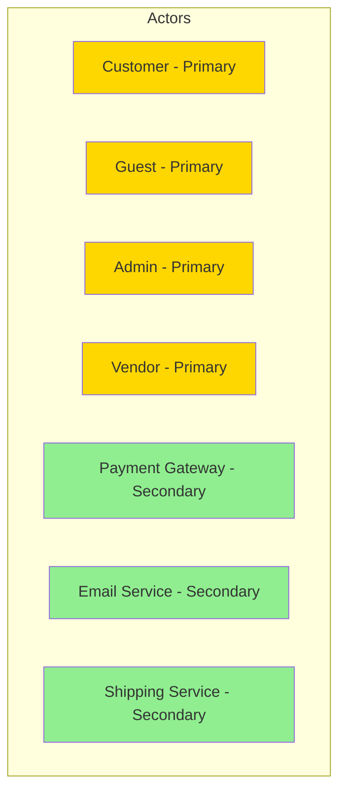

### Identifying Actors

**JavaScript Example:**

```javascript
class ActorIdentification {
    constructor(systemName) {
        this.systemName = systemName;
        this.actors = [];
    }
    
    addActor(name, type, description, responsibilities) {
        this.actors.push({
            name,
            type, // 'primary', 'secondary', 'external_system'
            description,
            responsibilities
        });
    }
    
    listActors() {
        console.log(`\n=== Actors for ${this.systemName} ===\n`);
        
        const primary = this.actors.filter(a => a.type === 'primary');
        const secondary = this.actors.filter(a => a.type === 'secondary');
        const external = this.actors.filter(a => a.type === 'external_system');
        
        console.log("PRIMARY ACTORS:");
        primary.forEach(actor => {
            console.log(`  - ${actor.name}: ${actor.description}`);
            console.log(`    Responsibilities: ${actor.responsibilities.join(', ')}`);
        });
        
        console.log("\nSECONDARY ACTORS:");
        secondary.forEach(actor => {
            console.log(`  - ${actor.name}: ${actor.description}`);
        });
        
        console.log("\nEXTERNAL SYSTEMS:");
        external.forEach(actor => {
            console.log(`  - ${actor.name}: ${actor.description}`);
        });
    }
}

// Example: Online Shopping System
const ecommerce = new ActorIdentification("E-Commerce System");

ecommerce.addActor(
    "Customer",
    "primary",
    "Registered user who shops online",
    ["Browse products", "Place orders", "Track shipments", "Write reviews"]
);

ecommerce.addActor(
    "Guest",
    "primary",
    "Non-registered visitor",
    ["Browse products", "Search items", "View details"]
);

ecommerce.addActor(
    "Admin",
    "primary",
    "System administrator",
    ["Manage products", "Process orders", "Handle disputes", "Generate reports"]
);

ecommerce.addActor(
    "Payment Gateway",
    "external_system",
    "Third-party payment processor",
    []
);

ecommerce.addActor(
    "Email Service",
    "secondary",
    "Email notification system",
    []
);

ecommerce.listActors();
```

**Python Example:**

```python
class ActorIdentification:
    def __init__(self, system_name):
        self.system_name = system_name
        self.actors = []
    
    def add_actor(self, name, actor_type, description, responsibilities):
        self.actors.append({
            'name': name,
            'type': actor_type,  # 'primary', 'secondary', 'external_system'
            'description': description,
            'responsibilities': responsibilities
        })
    
    def list_actors(self):
        print(f"\n=== Actors for {self.system_name} ===\n")
        
        primary = [a for a in self.actors if a['type'] == 'primary']
        secondary = [a for a in self.actors if a['type'] == 'secondary']
        external = [a for a in self.actors if a['type'] == 'external_system']
        
        print("PRIMARY ACTORS:")
        for actor in primary:
            print(f"  - {actor['name']}: {actor['description']}")
            print(f"    Responsibilities: {', '.join(actor['responsibilities'])}")
        
        print("\nSECONDARY ACTORS:")
        for actor in secondary:
            print(f"  - {actor['name']}: {actor['description']}")
        
        print("\nEXTERNAL SYSTEMS:")
        for actor in external:
            print(f"  - {actor['name']}: {actor['description']}")

# Example: Online Shopping System
ecommerce = ActorIdentification("E-Commerce System")

ecommerce.add_actor(
    "Customer",
    "primary",
    "Registered user who shops online",
    ["Browse products", "Place orders", "Track shipments", "Write reviews"]
)

ecommerce.add_actor(
    "Guest",
    "primary",
    "Non-registered visitor",
    ["Browse products", "Search items", "View details"]
)

ecommerce.add_actor(
    "Admin",
    "primary",
    "System administrator",
    ["Manage products", "Process orders", "Handle disputes", "Generate reports"]
)

ecommerce.add_actor(
    "Payment Gateway",
    "external_system",
    "Third-party payment processor",
    []
)

ecommerce.add_actor(
    "Email Service",
    "secondary",
    "Email notification system",
    []
)

ecommerce.list_actors()
```

---

## Use Cases

### What is a Use Case?

A use case represents a specific functionality or goal that an actor wants to achieve using the system.

### Use Case Characteristics

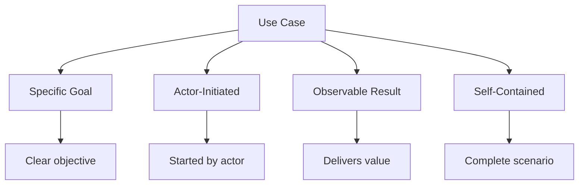

### Use Case Template

```javascript
class UseCase {
    constructor(name, id) {
        this.name = name;
        this.id = id;
        this.actors = [];
        this.description = "";
        this.preconditions = [];
        this.postconditions = [];
        this.mainFlow = [];
        this.alternativeFlows = [];
        this.exceptionFlows = [];
    }
    
    addActor(actor) {
        this.actors.push(actor);
    }
    
    setDescription(desc) {
        this.description = desc;
    }
    
    addPrecondition(condition) {
        this.preconditions.push(condition);
    }
    
    addPostcondition(condition) {
        this.postconditions.push(condition);
    }
    
    addMainFlowStep(step) {
        this.mainFlow.push(step);
    }
    
    addAlternativeFlow(name, steps) {
        this.alternativeFlows.push({ name, steps });
    }
    
    addExceptionFlow(name, steps) {
        this.exceptionFlows.push({ name, steps });
    }
    
    display() {
        console.log(`\n${'='.repeat(70)}`);
        console.log(`USE CASE: ${this.name} (${this.id})`);
        console.log('='.repeat(70));
        
        console.log(`\nDescription: ${this.description}`);
        
        console.log(`\nActors: ${this.actors.join(', ')}`);
        
        console.log(`\nPreconditions:`);
        this.preconditions.forEach((p, i) => console.log(`  ${i + 1}. ${p}`));
        
        console.log(`\nMain Flow:`);
        this.mainFlow.forEach((s, i) => console.log(`  ${i + 1}. ${s}`));
        
        if (this.alternativeFlows.length > 0) {
            console.log(`\nAlternative Flows:`);
            this.alternativeFlows.forEach(flow => {
                console.log(`  ${flow.name}:`);
                flow.steps.forEach((s, i) => console.log(`    ${i + 1}. ${s}`));
            });
        }
        
        if (this.exceptionFlows.length > 0) {
            console.log(`\nException Flows:`);
            this.exceptionFlows.forEach(flow => {
                console.log(`  ${flow.name}:`);
                flow.steps.forEach((s, i) => console.log(`    ${i + 1}. ${s}`));
            });
        }
        
        console.log(`\nPostconditions:`);
        this.postconditions.forEach((p, i) => console.log(`  ${i + 1}. ${p}`));
    }
}

// Example: Place Order Use Case
const placeOrder = new UseCase("Place Order", "UC-001");
placeOrder.addActor("Customer");
placeOrder.setDescription("Customer places an order for products in their cart");

placeOrder.addPrecondition("Customer is logged in");
placeOrder.addPrecondition("Cart contains at least one product");
placeOrder.addPrecondition("All products are in stock");

placeOrder.addMainFlowStep("Customer reviews cart items");
placeOrder.addMainFlowStep("Customer selects shipping address");
placeOrder.addMainFlowStep("Customer chooses shipping method");
placeOrder.addMainFlowStep("System calculates total with shipping");
placeOrder.addMainFlowStep("Customer selects payment method");
placeOrder.addMainFlowStep("System processes payment");
placeOrder.addMainFlowStep("System creates order");
placeOrder.addMainFlowStep("System sends confirmation email");
placeOrder.addMainFlowStep("System displays order confirmation");

placeOrder.addAlternativeFlow("Apply Discount Code", [
    "At step 4, customer enters discount code",
    "System validates code",
    "System applies discount",
    "Continue to step 5"
]);

placeOrder.addExceptionFlow("Payment Failed", [
    "At step 6, payment processing fails",
    "System displays error message",
    "Customer can retry or choose different payment method",
    "Return to step 5"
]);

placeOrder.addExceptionFlow("Out of Stock", [
    "At step 6, system detects item out of stock",
    "System notifies customer",
    "Customer removes item or cancels order",
    "Return to step 1 or end"
]);

placeOrder.addPostcondition("Order is created with unique ID");
placeOrder.addPostcondition("Inventory is updated");
placeOrder.addPostcondition("Confirmation email is sent");
placeOrder.addPostcondition("Payment is processed");

placeOrder.display();
```

---

## Relationships

### Types of Relationships

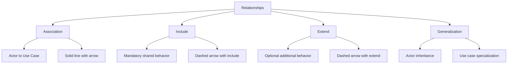

### 1. Association

Direct interaction between actor and use case.

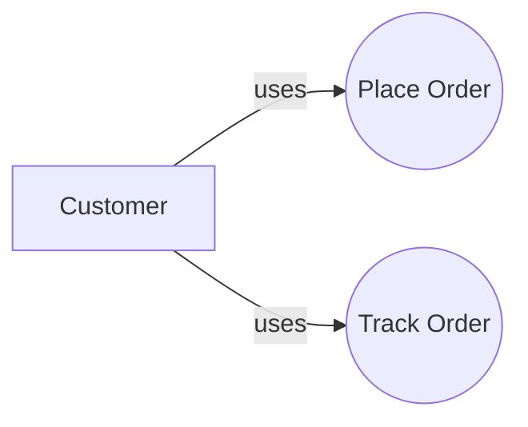

### 2. Include Relationship

One use case always includes another (mandatory).

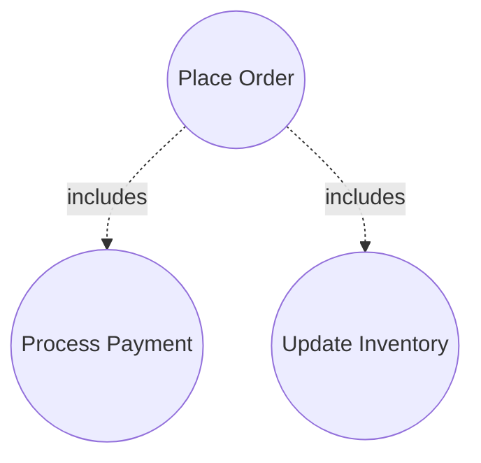

**JavaScript Example:**

```javascript
class UseCaseWithInclude {
    constructor(name) {
        this.name = name;
        this.includedUseCases = [];
    }
    
    include(useCase) {
        this.includedUseCases.push(useCase);
    }
    
    execute() {
        console.log(`\nExecuting: ${this.name}`);
        
        // Execute main use case logic
        console.log(`  - Main logic of ${this.name}`);
        
        // Always execute included use cases
        this.includedUseCases.forEach(uc => {
            console.log(`  - Including: ${uc.name}`);
            uc.execute();
        });
    }
}

// Define use cases
const processPayment = new UseCaseWithInclude("Process Payment");
const updateInventory = new UseCaseWithInclude("Update Inventory");
const sendConfirmation = new UseCaseWithInclude("Send Confirmation");

const placeOrderUC = new UseCaseWithInclude("Place Order");
placeOrderUC.include(processPayment);
placeOrderUC.include(updateInventory);
placeOrderUC.include(sendConfirmation);

// Execute
placeOrderUC.execute();
// Output:
// Executing: Place Order
//   - Main logic of Place Order
//   - Including: Process Payment
//   - Including: Update Inventory
//   - Including: Send Confirmation
```

### 3. Extend Relationship

One use case optionally extends another (conditional).

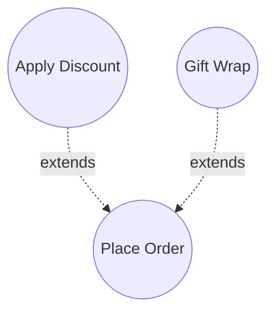

**JavaScript Example:**

```javascript
class UseCaseWithExtend {
    constructor(name) {
        this.name = name;
        this.extensions = [];
    }
    
    addExtension(useCase, condition) {
        this.extensions.push({ useCase, condition });
    }
    
    execute(context = {}) {
        console.log(`\nExecuting: ${this.name}`);
        console.log(`  - Main flow of ${this.name}`);
        
        // Check and execute extensions if conditions are met
        this.extensions.forEach(({ useCase, condition }) => {
            if (condition(context)) {
                console.log(`  - Extension applied: ${useCase.name}`);
                useCase.execute(context);
            }
        });
    }
}

// Define base use case
const placeOrderBase = new UseCaseWithExtend("Place Order");

// Define extensions
const applyDiscount = new UseCaseWithExtend("Apply Discount");
const giftWrap = new UseCaseWithExtend("Gift Wrap");

// Add extensions with conditions
placeOrderBase.addExtension(
    applyDiscount,
    (ctx) => ctx.hasDiscountCode === true
);

placeOrderBase.addExtension(
    giftWrap,
    (ctx) => ctx.isGift === true
);

// Execute with different contexts
console.log("Scenario 1: Regular order");
placeOrderBase.execute({ hasDiscountCode: false, isGift: false });

console.log("\nScenario 2: Order with discount");
placeOrderBase.execute({ hasDiscountCode: true, isGift: false });

console.log("\nScenario 3: Gift order with discount");
placeOrderBase.execute({ hasDiscountCode: true, isGift: true });
```

### 4. Generalization

Inheritance between actors or use cases.

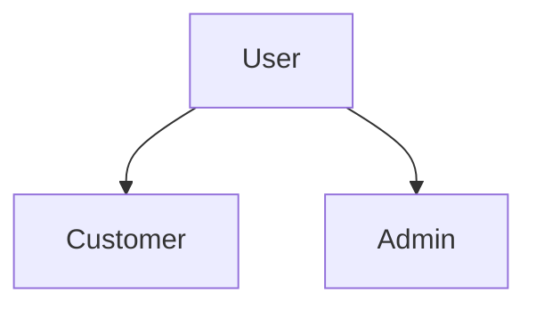

---

## Creating Use Case Diagrams

### Step-by-Step Process

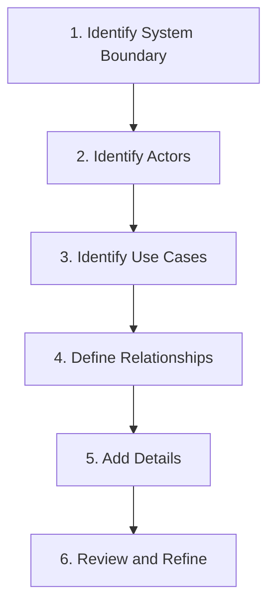

### Example: Banking System

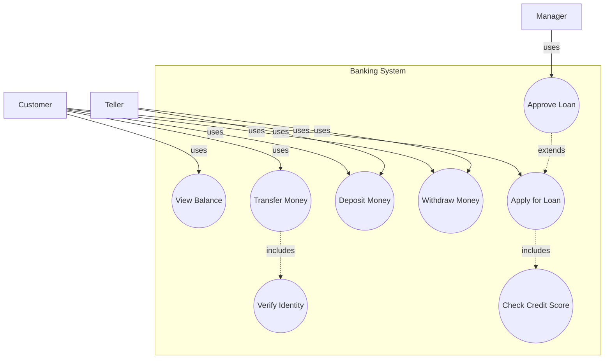

**Python Implementation:**

```python
class UseCaseDiagram:
    def __init__(self, system_name):
        self.system_name = system_name
        self.actors = set()
        self.use_cases = set()
        self.associations = []  # (actor, use_case)
        self.includes = []      # (base_uc, included_uc)
        self.extends = []       # (extension_uc, base_uc)
    
    def add_actor(self, actor_name):
        self.actors.add(actor_name)
    
    def add_use_case(self, use_case_name):
        self.use_cases.add(use_case_name)
    
    def add_association(self, actor, use_case):
        self.actors.add(actor)
        self.use_cases.add(use_case)
        self.associations.append((actor, use_case))
    
    def add_include(self, base_uc, included_uc):
        self.use_cases.add(base_uc)
        self.use_cases.add(included_uc)
        self.includes.append((base_uc, included_uc))
    
    def add_extend(self, extension_uc, base_uc):
        self.use_cases.add(extension_uc)
        self.use_cases.add(base_uc)
        self.extends.append((extension_uc, base_uc))
    
    def display(self):
        print(f"\n{'='*70}")
        print(f"USE CASE DIAGRAM: {self.system_name}")
        print('='*70)
        
        print(f"\nACTORS ({len(self.actors)}):")
        for actor in sorted(self.actors):
            print(f"  - {actor}")
        
        print(f"\nUSE CASES ({len(self.use_cases)}):")
        for uc in sorted(self.use_cases):
            print(f"  - {uc}")
        
        print(f"\nASSOCIATIONS ({len(self.associations)}):")
        for actor, uc in self.associations:
            print(f"  - {actor} --> {uc}")
        
        if self.includes:
            print(f"\nINCLUDE RELATIONSHIPS ({len(self.includes)}):")
            for base, included in self.includes:
                print(f"  - {base} <<includes>> {included}")
        
        if self.extends:
            print(f"\nEXTEND RELATIONSHIPS ({len(self.extends)}):")
            for extension, base in self.extends:
                print(f"  - {extension} <<extends>> {base}")

# Create Banking System Use Case Diagram
banking = UseCaseDiagram("Banking System")

# Add associations
banking.add_association("Customer", "View Balance")
banking.add_association("Customer", "Transfer Money")
banking.add_association("Customer", "Deposit Money")
banking.add_association("Customer", "Withdraw Money")
banking.add_association("Customer", "Apply for Loan")

banking.add_association("Teller", "Deposit Money")
banking.add_association("Teller", "Withdraw Money")

banking.add_association("Manager", "Approve Loan")

# Add include relationships
banking.add_include("Transfer Money", "Verify Identity")
banking.add_include("Apply for Loan", "Check Credit Score")

# Add extend relationships
banking.add_extend("Approve Loan", "Apply for Loan")

# Display
banking.display()
```

---

## Real-World Examples

### Example 1: Restaurant Management System

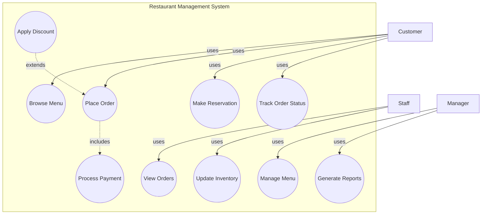

**JavaScript Implementation:**

```javascript
// Complete Restaurant Management System Use Cases
class RestaurantSystem {
    constructor() {
        this.useCases = new Map();
        this.actors = new Set();
    }
    
    defineUseCase(id, name, actors, description) {
        this.useCases.set(id, {
            name,
            actors,
            description,
            preconditions: [],
            steps: [],
            postconditions: []
        });
        
        actors.forEach(actor => this.actors.add(actor));
    }
    
    demonstrateUseCases() {
        console.log("\n=== Restaurant Management System Use Cases ===\n");
        
        // Customer use cases
        console.log("CUSTOMER USE CASES:");
        console.log("1. Browse Menu - View available dishes and prices");
        console.log("2. Place Order - Order food for dine-in or takeout");
        console.log("3. Make Reservation - Book a table");
        console.log("4. Track Order Status - Check order preparation status");
        
        // Staff use cases
        console.log("\nSTAFF USE CASES:");
        console.log("5. View Orders - See pending and in-progress orders");
        console.log("6. Update Inventory - Manage ingredient stock");
        
        // Manager use cases
        console.log("\nMANAGER USE CASES:");
        console.log("7. Manage Menu - Add/remove/update menu items");
        console.log("8. Generate Reports - Sales, inventory, performance reports");
        
        // System use cases (included)
        console.log("\nSYSTEM USE CASES:");
        console.log("9. Process Payment - Handle payments (included in Place Order)");
        console.log("10. Apply Discount - Optional discount (extends Place Order)");
    }
}

const restaurant = new RestaurantSystem();
restaurant.demonstrateUseCases();
```

### Example 2: Hospital Management System

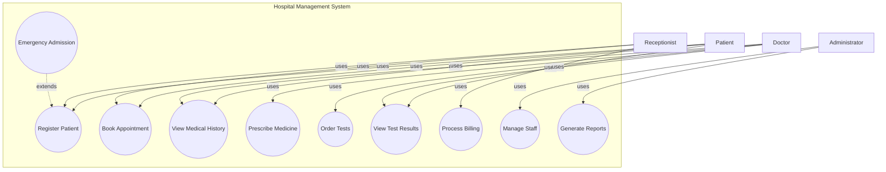

---

## Best Practices

### 1. Clear Use Case Names

```javascript
// ✅ GOOD: Verb + Noun
const goodNames = [
    "Place Order",
    "Search Products",
    "Update Profile",
    "Cancel Reservation",
    "Generate Report"
];

// ❌ BAD: Vague or technical
const badNames = [
    "Order",              // Missing verb
    "Process",            // Too vague
    "DatabaseUpdate",     // Too technical
    "DoStuff"             // Meaningless
];
```

### 2. Appropriate Granularity

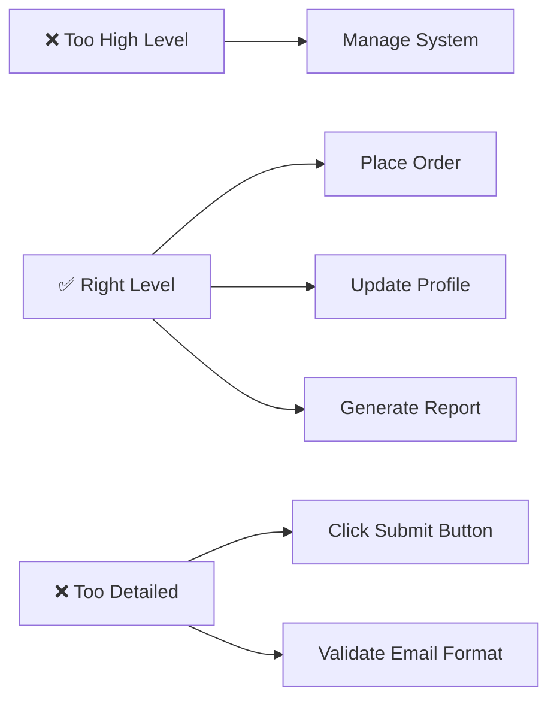

### 3. Actor Perspective

```javascript
// ✅ GOOD: User's perspective
"Place Order"      // What the user wants to achieve
"Search Products"  // User's goal
"Track Shipment"   // User's need

// ❌ BAD: System perspective
"Process Order"    // System's action
"Query Database"   // Technical detail
"Send Email"       // Implementation
```

### 4. System Boundary

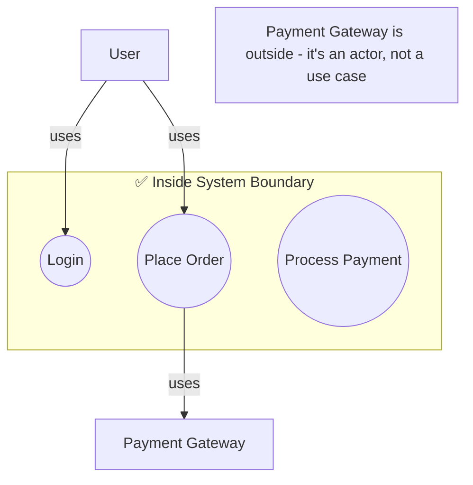

### 5. Include vs Extend

```javascript
// ✅ GOOD: Use Include for mandatory behavior
class PlaceOrder {
    execute() {
        this.validateCart();
        this.processPayment();  // Always included - mandatory
        this.updateInventory(); // Always included - mandatory
        this.sendConfirmation(); // Always included - mandatory
    }
}

// ✅ GOOD: Use Extend for optional behavior
class PlaceOrderWithExtensions {
    execute(options = {}) {
        this.validateCart();
        this.processPayment();
        
        // Optional extensions
        if (options.hasGiftWrap) {
            this.applyGiftWrap(); // Extends - optional
        }
        
        if (options.hasDiscount) {
            this.applyDiscount();  // Extends - optional
        }
        
        this.sendConfirmation();
    }
}
```

---

## Common Mistakes

### Mistake 1: Too Many Relationships

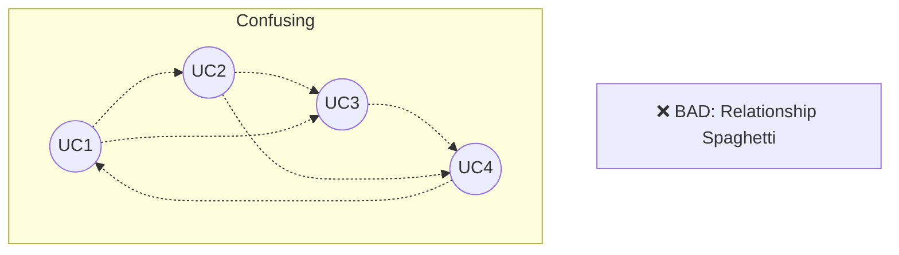

```mermaid
graph TB
    B[✅ GOOD: Clear Relationships]
    
    subgraph "Clear"
        UC5((Place Order))
        UC6((Process Payment))
        UC7((Update Inventory))
    end
    
    UC5 -.->|includes| UC6
    UC5 -.->|includes| UC7
```

### Mistake 2: Implementation Details

```javascript
// ❌ BAD: Technical implementation
const badUseCases = [
    "Execute SQL Query",
    "Call API Endpoint",
    "Update Database Record",
    "Parse JSON Response"
];

// ✅ GOOD: User goals
const goodUseCases = [
    "Search Products",
    "View Order History",
    "Update Profile",
    "Track Shipment"
];
```

### Mistake 3: Missing Actors

```mermaid
graph TB
    A[❌ BAD: Floating Use Cases]
    
    subgraph "System"
        UC1((Process Payment))
        UC2((Send Email))
    end
```

```mermaid
graph TB
    B[✅ GOOD: Connected Actors]
    
    subgraph "System"
        UC3((Place Order))
        UC4((Process Payment))
    end
    
    C[Customer] -->|uses| UC3
    UC3 -.->|includes| UC4
    UC4 -->|uses| D[Payment Gateway]
```

### Mistake 4: Wrong Abstraction Level

```text
❌ BAD: Mixed levels
- Manage System (too high)
- Place Order (good)
- Click Button (too low)

✅ GOOD: Consistent level
- Search Products
- Place Order
- Track Shipment
- Update Profile
```

---

## Interview Questions

### Q1: What is a use case diagram?

**Answer**: A use case diagram is a UML behavioral diagram that shows the functional requirements of a system from an external user's perspective. It depicts actors (users) and use cases (system functionality) and how they interact.

### Q2: What's the difference between an actor and a use case?

**Answer**:
- **Actor**: External entity (person, system) that interacts with the system
- **Use Case**: Specific functionality or goal that the actor wants to achieve

### Q3: When would you use include vs extend relationships?

**Answer**:
- **Include**: When a use case ALWAYS needs another use case (mandatory behavior)
  - Example: "Place Order" always includes "Process Payment"
- **Extend**: When a use case OPTIONALLY adds behavior (conditional)
  - Example: "Apply Discount" optionally extends "Place Order"

### Q4: Can a use case have multiple actors?

**Answer**: Yes! Multiple actors can interact with the same use case. For example, "View Order Status" might be used by both Customer and Admin.

### Q5: What should be inside the system boundary?

**Answer**: Only use cases (system functionality). Actors are always outside the boundary. The boundary defines what the system does, not who uses it.

### Q6: How do you identify actors?

**Answer**:
1. Who uses the system?
2. Who needs information from the system?
3. Who provides information to the system?
4. What external systems interact with it?
5. Who maintains/administers the system?

### Q7: What's the difference between primary and secondary actors?

**Answer**:
- **Primary Actor**: Initiates the use case and receives value (e.g., Customer placing order)
- **Secondary Actor**: Provides supporting service (e.g., Payment Gateway, Email Service)

### Q8: Should you show system internals in use case diagrams?

**Answer**: No! Use case diagrams show WHAT the system does from a user perspective, not HOW it does it internally. Implementation details belong in other diagrams.

---

## Summary

```mermaid
mindmap
  root((Use Case Diagram))
    Components
      Actors
        Primary
        Secondary
        External Systems
      Use Cases
        User Goals
        System Functions
      Relationships
        Association
        Include
        Extend
        Generalization
      System Boundary
    Purpose
      Requirements
      Communication
      Scope Definition
    Best Practices
      Clear Names
      User Perspective
      Right Granularity
      Avoid Implementation
```

---

## Next Steps

1. **Study**: [Class Diagrams](./class-diagram.md)
2. **Study**: [Sequence Diagrams](./sequence-diagram.md)
3. **Practice**: Create use case diagrams for a project you're working on
4. **Exercise**: Identify actors and use cases for common systems (ATM, Library, Hospital)
5. **Review**: Practice converting user stories to use cases

---

**Key Takeaway**: Use case diagrams are the bridge between business requirements and system design. They focus on WHAT the system does from the user's perspective, not HOW it does it. Keep them simple, user-focused, and free of implementation details!

