# Splitwise / Expense Sharing System - Low Level Design

## 🔗 Implementation Links

- [Python Implementation](python/expense-sharing/main.py)
- [JavaScript Implementation](javascript/expense-sharing/main.js)

## Problem Statement

Design an expense sharing system like Splitwise that allows users to track shared expenses among friends and groups, automatically calculates who owes whom, and simplifies debts using minimal transactions. The system should support multiple split strategies (equal, exact amounts, percentages), maintain accurate balance sheets, handle group expenses, provide settlement mechanisms, and generate expense history reports.

#### Core Capabilities

1. **Multiple Split Types**: Support equal, exact, and percentage-based expense splitting
2. **Balance Tracking**: Maintain accurate individual and group balances
3. **Debt Simplification**: Minimize number of transactions needed for settlements
4. **Group Management**: Handle expenses within groups and across users
5. **Settlement System**: Process payments and update balances accordingly
6. **Expense History**: Track and report all expense transactions

## Requirements

#### Functional Requirements

- Add expenses with multiple participants and different split strategies
- Calculate individual shares based on split type (equal, exact, percentage)
- Track user balances and show who owes whom
- Simplify debts using graph algorithms to minimize transactions
- Support group creation and group-based expense tracking
- Handle settle-up operations between users
- Maintain complete expense history with timestamps
- Generate balance sheets and settlement reports

#### Non-Functional Requirements

- Handle floating-point precision accurately for monetary calculations
- Scale to support thousands of users and groups
- Provide fast balance calculations (O(1) or O(log n))
- Ensure data consistency during concurrent operations
- Maintain audit trail for all transactions

## Design Decisions

#### Key Classes

1. **ExpenseManager**: Central coordinator managing all expense operations
2. **SplitStrategy**: Abstract interface for different splitting algorithms
3. **BalanceSheet**: Tracks user-to-user balances efficiently
4. **DebtSimplifier**: Implements graph algorithms for minimizing transactions
5. **Group**: Manages group membership and group expenses

#### Design Patterns Used

1. **Strategy Pattern**: Different expense split strategies (EqualSplit, ExactSplit, PercentageSplit)
2. **Factory Pattern**: SplitFactory creates appropriate split strategy instances
3. **Observer Pattern**: Notify users when new expenses are added or balances change
4. **Command Pattern**: Encapsulate expense operations (AddExpense, SettleUp, DeleteExpense)
5. **Composite Pattern**: Group expenses can contain individual expenses

#### Key Features

- **Debt Simplification Algorithm**: Uses greedy approach with heap/priority queue
- **Balance Sheet Optimization**: Maintains O(1) lookup using hash maps
- **Precision Handling**: Uses integer arithmetic (cents) to avoid floating-point errors
- **Transaction History**: Immutable expense records for audit trail

## Class Diagram


## Usage Example

```python
# Create users
alice = User("1", "Alice", "alice@example.com")
bob = User("2", "Bob", "bob@example.com")
charlie = User("3", "Charlie", "charlie@example.com")

# Initialize expense manager
manager = ExpenseManager()
manager.add_user(alice)
manager.add_user(bob)
manager.add_user(charlie)

# Add equal split expense
expense1 = Expense(
    "e1", 
    "Dinner", 
    300.00, 
    alice, 
    [alice, bob, charlie], 
    EqualSplit()
)
manager.add_expense(expense1)

# Add exact split expense
exact_amounts = {bob: 100.00, charlie: 50.00}
expense2 = Expense(
    "e2",
    "Movie tickets",
    150.00,
    bob,
    [bob, charlie],
    ExactSplit(exact_amounts)
)
manager.add_expense(expense2)

# Get balances
balances = manager.get_balances(alice)
print(f"Alice's balances: {balances}")

# Simplify debts
simplified = manager.simplify_debts([alice, bob, charlie])
print(f"Simplified transactions: {simplified}")

# Settle up between two users
manager.settle_up(bob, alice)
```

## Business Rules

1. **Expense Validation**: Total of exact amounts or percentages must equal the expense amount
2. **Balance Calculation**: Balance[A][B] = Amount A owes to B (negative means B owes A)
3. **Debt Simplification**: Use greedy algorithm to minimize transaction count
4. **Group Expenses**: All group members must be participants in group expenses
5. **Settlement**: Settling up creates a transaction that zeros out the balance between two users
6. **Precision**: All monetary amounts stored as integers (cents) to avoid floating-point errors

## Algorithms

#### Debt Simplification Algorithm

```text
1. Calculate net balance for each user (total_owed - total_owing)
2. Separate users into creditors (positive balance) and debtors (negative balance)
3. Use max heap for creditors and min heap for debtors
4. Repeatedly match largest creditor with largest debtor
5. Create transaction for min(creditor_amount, debtor_amount)
6. Update balances and continue until all balanced

Time Complexity: O(n log n) where n is number of users
Space Complexity: O(n) for heaps and balance maps
```

#### Balance Sheet Structure

```text
Use nested hash maps: Map<UserId, Map<UserId, Amount>>
- balance[A][B] represents amount A owes to B
- balance[B][A] represents amount B owes to A
- Keep only one entry: if A owes B, store positive in balance[A][B]
- Provides O(1) lookup and update
```

## Extension Points

1. **Multiple Currencies**: Add currency conversion and multi-currency support
2. **Recurring Expenses**: Support recurring bills and automatic expense creation
3. **Expense Categories**: Categorize expenses (food, travel, utilities) for reports
4. **Payment Integration**: Integrate with payment gateways for actual money transfer
5. **Expense Splitting Rules**: Add custom split rules (e.g., split by consumption)
6. **Analytics Dashboard**: Provide spending analytics and trends
7. **Expense Approval**: Add workflow for expense approval in groups
8. **Receipt Scanning**: OCR integration for automatic expense creation from receipts

## Security Considerations

1. **Authorization**: Users can only view expenses they're part of
2. **Data Encryption**: Encrypt sensitive financial data at rest
3. **Audit Trail**: Maintain immutable log of all transactions
4. **Input Validation**: Validate all monetary amounts and split percentages
5. **Concurrency Control**: Use optimistic locking for balance updates

## Time Complexity

- **Add Expense**: O(n) where n is number of participants
- **Get Balance**: O(1) with hash map implementation
- **Simplify Debts**: O(n log n) using heap-based greedy algorithm
- **Settle Up**: O(1) for balance update
- **Group Operations**: O(m) where m is number of members

## Space Complexity

- **Balance Sheet**: O(u²) where u is number of users (worst case all pairs)
- **Expense Storage**: O(e × p) where e is expenses, p is avg participants
- **Group Storage**: O(g × m) where g is groups, m is avg members
- **Overall System**: O(u² + e×p + g×m)

## State Diagram

```mermaid
stateDiagram-v2
    [*] --> Active
    Active --> Processing: Add Expense
    Processing --> Updated: Calculate Splits
    Updated --> Active: Balances Updated
    
    Active --> Simplifying: Simplify Debts
    Simplifying --> Simplified: Generate Transactions
    Simplified --> Active: Return Transactions
    
    Active --> Settling: Settle Up
    Settling --> Active: Balance Cleared
    
    Active --> Archived: Delete Expense
    Archived --> [*]
    
    note right of Processing
        Validate split strategy
        Calculate shares
        Update balance sheet
    end note
    
    note right of Simplifying
        Calculate net balances
        Apply greedy algorithm
        Minimize transactions
    end note
```



