# Flight Booking System - Low Level Design

## Table of Contents

- [Overview](#overview)
- [Requirements](#requirements)
  - [Functional Requirements](#functional-requirements)
  - [Non-Functional Requirements](#non-functional-requirements)
- [Core Use Cases](#core-use-cases)
- [Design Patterns Used](#design-patterns-used)
- [Class Diagram](#class-diagram)
- [Component Design](#component-design)
- [Data Structures](#data-structures)
- [API Design](#api-design)
- [Implementation Details](#implementation-details)
- [Business Rules](#business-rules)
- [Extension Points](#extension-points)
- [Complexity Analysis](#complexity-analysis)
- [Trade-offs and Design Decisions](#trade-offs-and-design-decisions)

## Overview

A Flight Booking System is a comprehensive platform (like Expedia, Kayak, MakeMyTrip) that enables users to search, book, and manage flight reservations. The system handles complex multi-city itineraries, real-time seat inventory, dynamic pricing, payment processing, and loyalty programs.

### Key Features

- **Flight Search**: Multi-city search, filters (price, duration, stops, airlines)
- **Seat Management**: Real-time availability, seat maps, class selection (Economy, Business, First)
- **Dynamic Pricing**: Fare classes, baggage fees, taxes, seasonal pricing
- **Booking Management**: Hold seats, payment processing, PNR generation, confirmation
- **Multi-leg Flights**: Complex routing, layovers, connecting flights
- **Cancellation & Refund**: Cancellation policies, refund calculation, rebooking
- **Loyalty Programs**: Frequent flyer miles, tier benefits, redemption
- **Inventory Management**: Overbooking strategy, waitlist, seat allocation
- **Add-ons**: Baggage, meals, seat selection, travel insurance
- **Notifications**: Booking confirmation, flight status, gate changes

## Requirements

### Functional Requirements

1. **Flight Search**
   - Search flights by origin, destination, date
   - Support one-way, round-trip, multi-city
   - Filter by price, duration, stops, departure time, airlines
   - Sort by price, duration, departure/arrival time
   - Show flight details (airline, aircraft, duration, layovers)

2. **Seat Management**
   - Real-time seat availability
   - Multiple classes (Economy, Business, First)
   - Seat maps with selection
   - Block/hold seats temporarily
   - Release seats after timeout
   - Track available vs. booked vs. blocked seats

3. **Pricing Engine**
   - Base fare by class
   - Dynamic pricing based on demand
   - Fare classes (Flexible, Semi-flexible, Non-refundable)
   - Add-on pricing (baggage, meals, seat selection)
   - Taxes and fees calculation
   - Discount codes and promotions

4. **Booking Workflow**
   - Hold seats for payment (15 minutes)
   - Collect passenger details
   - Process payment
   - Generate PNR (Passenger Name Record)
   - Send booking confirmation
   - Issue e-tickets

5. **Multi-leg Flights**
   - Book connecting flights as single itinerary
   - Calculate total journey time
   - Validate layover times (minimum connection time)
   - Handle baggage transfer
   - Support open-jaw tickets

6. **Cancellation & Refund**
   - Cancel bookings
   - Calculate refund based on fare rules
   - Apply cancellation fees
   - Rebook to different flights
   - Handle partial cancellations (multi-passenger)

7. **Loyalty Program**
   - Earn miles based on distance and fare class
   - Redeem miles for flights
   - Tier benefits (Silver, Gold, Platinum)
   - Priority boarding, extra baggage
   - Lounge access

8. **Inventory Management**
   - Track seat inventory per flight
   - Overbooking strategy
   - Waitlist management
   - Upgrade requests
   - Seat allocation algorithm

9. **Add-ons & Ancillaries**
   - Extra baggage
   - Meal selection
   - Seat selection
   - Travel insurance
   - Lounge access
   - Priority boarding

10. **Notifications**
    - Booking confirmation
    - Payment receipt
    - Flight status updates
    - Gate changes
    - Delay notifications
    - Cancellation alerts

### Non-Functional Requirements

1. **Performance**
   - Search results in <2 seconds
   - Handle 100,000+ concurrent searches
   - Seat locking in <100ms
   - Support millions of flights

2. **Reliability**
   - 99.99% uptime
   - No double bookings
   - Accurate inventory tracking
   - Transaction consistency

3. **Scalability**
   - Horizontal scaling for search
   - Distributed seat inventory
   - Handle peak booking periods
   - Cache frequently searched routes

4. **Concurrency**
   - Handle simultaneous seat bookings
   - Optimistic locking for seats
   - Prevent race conditions
   - Atomic booking operations

5. **Security**
   - PCI-DSS compliant payments
   - Encrypted PII data
   - Secure authentication
   - Fraud detection

6. **Availability**
   - Multi-region deployment
   - Failover mechanisms
   - Data replication
   - Disaster recovery

## Core Use Cases

### Use Case 1: Search and Book One-Way Flight

```text
Actor: Passenger
Precondition: User has account and payment method

Main Flow:
1. User searches for flights (origin, destination, date)
2. System retrieves available flights
3. System displays results with filters
4. User selects flight and class
5. System shows seat map
6. User selects seat
7. System holds seat for 15 minutes
8. User enters passenger details
9. User adds baggage/meals
10. System calculates total price
11. User makes payment
12. System confirms booking
13. System generates PNR
14. System sends confirmation email

Alternative Flow:
- No flights available → Show alternative dates/airports
- Seat unavailable → Show other available seats
- Payment fails → Release seat, retry payment
- Timeout → Release held seat, restart booking
```

### Use Case 2: Book Multi-City Flight

```text
Actor: Passenger
Precondition: User wants to visit multiple cities

Main Flow:
1. User selects multi-city option
2. User adds multiple legs (city pairs with dates)
3. System finds flights for each leg
4. System validates connection times
5. User selects flights for each leg
6. System creates combined itinerary
7. System calculates total price
8. User completes booking
9. System issues single PNR for all legs

Alternative Flow:
- Invalid connection time → Suggest longer layover
- Flight combination unavailable → Show alternatives
- Price changes during booking → Alert user, confirm
```

### Use Case 3: Cancel and Refund Booking

```text
Actor: Passenger
Precondition: User has confirmed booking

Main Flow:
1. User requests cancellation
2. System retrieves booking details
3. System checks cancellation policy
4. System calculates refund amount
5. System applies cancellation fees
6. System shows refund breakdown
7. User confirms cancellation
8. System releases seats
9. System processes refund
10. System updates booking status
11. System sends cancellation confirmation

Alternative Flow:
- Non-refundable ticket → No refund, only credit
- Partial cancellation → Cancel some passengers only
- Within 24 hours → Full refund (regulation)
- Rebook instead → Transfer to different flight
```

## Design Patterns Used

### 1. Builder Pattern

- **Purpose**: Construct complex flight itineraries
- **Usage**: FlightItineraryBuilder for multi-leg trips
- **Benefit**: Step-by-step itinerary construction

### 2. Strategy Pattern

- **Purpose**: Different search and pricing algorithms
- **Usage**: PricingStrategy (Dynamic, Fixed, Seasonal), SearchStrategy (Direct, OneStop, MultiStop)
- **Benefit**: Flexible pricing and search logic

### 3. State Pattern

- **Purpose**: Manage booking lifecycle states
- **Usage**: Pending, Confirmed, Cancelled, CheckedIn, Completed states
- **Benefit**: Clean state transitions and validation

### 4. Factory Pattern

- **Purpose**: Create different flight and booking types
- **Usage**: FlightFactory, BookingFactory for various configurations
- **Benefit**: Centralized creation logic

### 5. Observer Pattern

- **Purpose**: Real-time inventory and status updates
- **Usage**: Notify users of flight status, price changes, seat availability
- **Benefit**: Decoupled notification system

### 6. Command Pattern

- **Purpose**: Encapsulate booking operations
- **Usage**: BookFlightCommand, CancelBookingCommand with undo capability
- **Benefit**: Transaction support, undo, logging

### 7. Composite Pattern

- **Purpose**: Represent multi-leg flights as tree structure
- **Usage**: FlightSegment as leaf, FlightItinerary as composite
- **Benefit**: Uniform treatment of single/multi-leg flights

### 8. Decorator Pattern

- **Purpose**: Add features to bookings dynamically
- **Usage**: BaggageDecorator, MealDecorator, InsuranceDecorator
- **Benefit**: Flexible add-on features

### 9. Singleton Pattern

- **Purpose**: Single inventory manager instance
- **Usage**: InventoryManager, BookingManager
- **Benefit**: Centralized inventory control

### 10. Template Method Pattern

- **Purpose**: Standardize booking workflow
- **Usage**: BookingTemplate defines steps, subclasses implement specifics
- **Benefit**: Consistent booking process

## Class Diagram

```mermaid
classDiagram
    class User {
        -str id
        -str name
        -str email
        -str phone
        -LoyaltyAccount loyalty_account
        +search_flights(criteria) List
        +book_flight(flight) Booking
        +get_bookings() List
    }
    
    class LoyaltyAccount {
        -str account_number
        -int miles
        -LoyaltyTier tier
        +earn_miles(distance, class) void
        +redeem_miles(amount) void
        +get_benefits() List
    }
    
    class Airport {
        -str code
        -str name
        -str city
        -str country
        -str timezone
        +get_location() Location
    }
    
    class Aircraft {
        -str registration
        -str model
        -Airline airline
        -SeatConfiguration seat_config
        +get_capacity() int
        +get_seat_map() SeatMap
    }
    
    class SeatConfiguration {
        -int economy_seats
        -int business_seats
        -int first_class_seats
        -str seat_layout
        +get_total_seats() int
        +get_seat_map() SeatMap
    }
    
    class Seat {
        -str number
        -SeatClass class
        -SeatStatus status
        -List~str~ features
        +is_available() bool
        +block(duration) void
        +book(passenger) void
    }
    
    class Flight {
        -str flight_number
        -Airline airline
        -Aircraft aircraft
        -Airport origin
        -Airport destination
        -datetime departure_time
        -datetime arrival_time
        -timedelta duration
        -FlightStatus status
        -Dict available_seats
        +get_available_seats(class) int
        +book_seat(seat, passenger) void
        +get_price(class) Decimal
        +is_available() bool
    }
    
    class FlightSegment {
        -Flight flight
        -int segment_number
        +get_duration() timedelta
        +get_origin() Airport
        +get_destination() Airport
    }
    
    class FlightItinerary {
        -List~FlightSegment~ segments
        -List~Layover~ layovers
        -timedelta total_duration
        +add_segment(segment) void
        +get_total_duration() timedelta
        +validate_connections() bool
        +get_layover_times() List
    }
    
    class PricingStrategy {
        <<interface>>
        +calculate_price(flight, class) Decimal
    }
    
    class DynamicPricing {
        +calculate_price(flight, class) Decimal
    }
    
    class FixedPricing {
        +calculate_price(flight, class) Decimal
    }
    
    class SeasonalPricing {
        +calculate_price(flight, class) Decimal
    }
    
    class DemandBased {
        +calculate_price(flight, class) Decimal
    }
    
    class FareClass {
        -str name
        -str code
        -SeatClass seat_class
        -bool refundable
        -bool changeable
        -Decimal change_fee
        -Decimal cancellation_fee
        -int baggage_included
        +calculate_refund(price) Decimal
        +calculate_change_fee() Decimal
    }
    
    class Booking {
        -str pnr
        -User user
        -FlightItinerary itinerary
        -List~Passenger~ passengers
        -Dict seats
        -FareClass fare_class
        -Decimal base_price
        -Decimal taxes
        -Decimal total_price
        -BookingState state
        -Payment payment
        -datetime created_at
        +add_passenger(passenger) void
        +select_seat(segment, seat) void
        +add_baggage(count) void
        +add_meal(passenger, meal) void
        +calculate_total() Decimal
        +confirm() void
        +cancel() void
    }
    
    class BookingState {
        <<interface>>
        +confirm(booking) void
        +cancel(booking) void
        +check_in(booking) void
    }
    
    class PendingState {
        +confirm(booking) void
    }
    
    class ConfirmedState {
        +check_in(booking) void
    }
    
    class CheckedInState {
        +complete(booking) void
    }
    
    class CancelledState {
        +cancel(booking) void
    }
    
    class Passenger {
        -str first_name
        -str last_name
        -date date_of_birth
        -str passport_number
        -str nationality
        -str loyalty_number
        +get_full_name() str
        +is_child() bool
    }
    
    class Payment {
        -str transaction_id
        -Decimal amount
        -PaymentMethod method
        -PaymentStatus status
        -datetime timestamp
        +process() bool
        +refund(amount) bool
    }
    
    class BookingDecorator {
        <<abstract>>
        -Booking booking
        +get_price() Decimal
    }
    
    class BaggageDecorator {
        +get_price() Decimal
    }
    
    class MealDecorator {
        +get_price() Decimal
    }
    
    class SeatSelDecorator {
        +get_price() Decimal
    }
    
    class InsuranceDecorator {
        +get_price() Decimal
    }
    
    class InventoryManager {
        <<singleton>>
        -Dict inventory
        -Dict blocked_seats
        +get_availability(flight) int
        +block_seat(seat, duration) void
        +release_seat(seat) void
        +book_seat(seat, passenger) void
        +update_inventory(flight) void
    }
    
    class SearchEngine {
        -SearchStrategy strategy
        -SearchCache cache
        +search(criteria) List~Flight~
        +filter(results, filters) List
        +sort(results, criteria) List
    }
    
    class BookingManager {
        <<singleton>>
        -Dict~PNR,Booking~ bookings
        -InventoryManager inventory_manager
        -PaymentProcessor payment_processor
        +create_booking(itinerary) Booking
        +confirm_booking(pnr) bool
        +cancel_booking(pnr) bool
        +get_booking(pnr) Booking
    }
    
    User "1" --> "1" LoyaltyAccount : has
    Flight "*" --> "2" Airport : origin/dest
    Flight "1" --> "1" Aircraft : uses
    Aircraft "1" --> "1" SeatConfiguration : has
    FlightItinerary "1" --> "*" FlightSegment : contains
    FlightSegment "*" --> "1" Flight : references
    PricingStrategy <|-- DynamicPricing : implements
    PricingStrategy <|-- FixedPricing : implements
    PricingStrategy <|-- SeasonalPricing : implements
    PricingStrategy <|-- DemandBased : implements
    Booking "*" --> "1" User : for
    Booking "1" --> "1" FlightItinerary : has
    Booking "1" --> "*" Passenger : includes
    Booking "1" --> "1" FareClass : uses
    Booking "1" --> "1" BookingState : has
    Booking "1" --> "1" Payment : processes
    BookingState <|-- PendingState : implements
    BookingState <|-- ConfirmedState : implements
    BookingState <|-- CheckedInState : implements
    BookingState <|-- CancelledState : implements
    BookingDecorator <|-- BaggageDecorator : extends
    BookingDecorator <|-- MealDecorator : extends
    BookingDecorator <|-- SeatSelDecorator : extends
    BookingDecorator <|-- InsuranceDecorator : extends
    BookingManager ..> InventoryManager : uses
    InventoryManager ..> Flight : manages
```



## Component Design

### 1. Flight Component

```python
class Flight:
    """
    Represents a single flight.
    
    Usage:
        flight = Flight("AA100", airline, aircraft, jfk, lax, 
                        departure_time, arrival_time)
        available = flight.get_available_seats(SeatClass.ECONOMY)
    
    Returns:
        Flight instance with seat management
    """
    - flight_number: Unique identifier
    - airline, aircraft: Airline and aircraft details
    - origin, destination: Airport objects
    - departure_time, arrival_time: Scheduled times
    - duration: Flight duration
    - available_seats: Seats by class
```

### 2. Booking Component

```python
class Booking:
    """
    Represents a flight booking with passengers and seats.
    
    Usage:
        booking = Booking(user, itinerary, passengers)
        booking.add_baggage(2)
        booking.confirm()
    
    Returns:
        Booking with PNR and confirmation
    """
    - pnr: 6-character booking reference
    - user: Who made the booking
    - itinerary: Flight(s) being booked
    - passengers: List of travelers
    - seats: Seat assignments
    - state: Current booking state
```

### 3. Seat Management

```python
class Seat:
    """
    Represents an aircraft seat.
    
    Usage:
        seat = Seat("12A", SeatClass.ECONOMY)
        seat.block(minutes=15)
        seat.book(passenger)
    
    Returns:
        Seat with booking status
    """
    - number: Seat identifier (12A)
    - class: Economy/Business/First
    - status: Available/Blocked/Booked
    - features: Window, aisle, extra legroom
```

## Data Structures

### 1. Trie (for Airport/City Search)

```text
Purpose: Fast prefix search for airports
Structure: Prefix tree
Operations:
  - Insert: O(L) where L = name length
  - Search: O(L + K) where K = results

Usage: Autocomplete airport names
```

### 2. Priority Queue (for Search Results)

```text
Purpose: Sort flights by price/time
Structure: Min-heap by selected criteria
Operations:
  - Insert: O(log N)
  - Extract min: O(log N)

Usage: Show cheapest/fastest flights first
```

### 3. Hash Map (for Inventory Tracking)

```text
Purpose: Fast seat availability lookup
Structure: Map[FlightID, SeatInventory]
Operations:
  - Lookup: O(1)
  - Update: O(1)

Usage: Real-time seat availability
```

### 4. Interval Tree (for Flight Timing)

```text
Purpose: Find flights within time range
Structure: Balanced tree of time intervals
Operations:
  - Insert: O(log N)
  - Query: O(log N + K)

Usage: Search flights by departure time
```

## API Design

### Flight Search APIs

```python
# Search Flights
search_flights(
    origin: Airport,
    destination: Airport,
    date: date,
    passengers: int,
    class: SeatClass
) -> List[Flight]
    """Search available flights"""

search_multi_city(
    legs: List[FlightLeg],
    passengers: int
) -> List[FlightItinerary]
    """Search multi-city itineraries"""

get_flight_details(flight_number: str, date: date) -> Flight
    """Get detailed flight information"""

# Filtering & Sorting
filter_flights(
    flights: List[Flight],
    filters: Dict[str, Any]
) -> List[Flight]
    """Apply filters (price, stops, time, airline)"""

sort_flights(
    flights: List[Flight],
    sort_by: SortCriteria
) -> List[Flight]
    """Sort by price, duration, departure time"""
```

### Booking APIs

```python
# Create Booking
create_booking(
    user: User,
    itinerary: FlightItinerary,
    passengers: List[Passenger]
) -> Booking
    """Create new booking with seat hold"""

select_seat(
    booking_id: str,
    segment: int,
    passenger: Passenger,
    seat: Seat
) -> bool
    """Select seat for passenger on segment"""

add_baggage(
    booking_id: str,
    passenger: Passenger,
    count: int
) -> Decimal
    """Add extra baggage"""

confirm_booking(booking_id: str, payment: Payment) -> str
    """Confirm booking and generate PNR"""

# Cancellation
cancel_booking(pnr: str, reason: str) -> Refund
    """Cancel booking and calculate refund"""

rebook(
    pnr: str,
    new_itinerary: FlightItinerary
) -> Booking
    """Rebook to different flights"""

# Retrieval
get_booking(pnr: str) -> Booking
    """Get booking by PNR"""

get_user_bookings(user: User) -> List[Booking]
    """Get all bookings for user"""
```

### Seat Management APIs

```python
# Seat Operations
get_seat_map(flight_id: str) -> SeatMap
    """Get seat layout and availability"""

block_seat(
    flight_id: str,
    seat: Seat,
    duration_minutes: int
) -> bool
    """Temporarily block seat"""

release_seat(flight_id: str, seat: Seat) -> bool
    """Release blocked seat"""

book_seat(
    flight_id: str,
    seat: Seat,
    passenger: Passenger
) -> bool
    """Book seat for passenger"""
```

## Implementation Details

### 1. Seat Blocking with Timeout

```python
def block_seat_with_timeout(flight: Flight, seat: Seat, duration: int) -> bool:
    """
    Block seat temporarily with automatic release.
    
    Algorithm:
        1. Check if seat is available
        2. Mark seat as blocked
        3. Store expiry time
        4. Schedule automatic release
        5. Return success/failure
    
    Complexity: O(1)
    """
    if seat.status != SeatStatus.AVAILABLE:
        return False
    
    seat.status = SeatStatus.BLOCKED
    seat.blocked_until = datetime.now() + timedelta(minutes=duration)
    seat.blocked_by = user_id
    
    # Schedule automatic release
    scheduler.schedule_task(
        task=release_seat,
        args=(flight, seat),
        delay=duration * 60
    )
    
    return True
```

### 2. Multi-City Itinerary Building

```python
def build_multi_city_itinerary(legs: List[FlightLeg]) -> FlightItinerary:
    """
    Build complex multi-city itinerary with validation.
    
    Algorithm:
        1. Search flights for each leg
        2. Validate connection times (min 1 hour layover)
        3. Check baggage transfer compatibility
        4. Calculate total duration
        5. Combine into single itinerary
    
    Complexity: O(L * F) where L = legs, F = flights per leg
    """
    itinerary = FlightItinerary()
    
    for i, leg in enumerate(legs):
        flights = search_flights(leg.origin, leg.destination, leg.date)
        selected_flight = flights[0]  # User selects
        
        # Validate connection time
        if i > 0:
            prev_arrival = itinerary.segments[-1].arrival_time
            connection_time = selected_flight.departure_time - prev_arrival
            
            if connection_time < timedelta(hours=1):
                raise InvalidConnectionError("Insufficient layover time")
        
        itinerary.add_segment(FlightSegment(selected_flight, i + 1))
    
    return itinerary
```

### 3. Dynamic Pricing Algorithm

```python
def calculate_dynamic_price(
    flight: Flight,
    seat_class: SeatClass,
    booking_date: date
) -> Decimal:
    """
    Calculate price based on demand and time to departure.
    
    Algorithm:
        1. Start with base fare
        2. Apply demand multiplier (seats booked / total seats)
        3. Apply time-to-departure multiplier
        4. Apply seasonal adjustments
        5. Add taxes and fees
    
    Complexity: O(1)
    """
    base_fare = flight.get_base_fare(seat_class)
    
    # Demand multiplier (higher demand = higher price)
    seats_booked = flight.get_booked_seats(seat_class)
    total_seats = flight.get_total_seats(seat_class)
    demand_ratio = seats_booked / total_seats
    demand_multiplier = 1 + (demand_ratio * 0.5)  # Up to 50% increase
    
    # Time multiplier (closer to departure = higher price)
    days_to_departure = (flight.departure_time.date() - booking_date).days
    if days_to_departure < 7:
        time_multiplier = 1.5
    elif days_to_departure < 30:
        time_multiplier = 1.2
    else:
        time_multiplier = 1.0
    
    # Seasonal adjustment
    season_multiplier = get_season_multiplier(flight.departure_time)
    
    # Calculate final price
    price = base_fare * demand_multiplier * time_multiplier * season_multiplier
    
    return price
```

### 4. Refund Calculation

```python
def calculate_refund(booking: Booking, cancellation_date: date) -> Refund:
    """
    Calculate refund based on fare rules and timing.
    
    Algorithm:
        1. Check fare class refund policy
        2. Calculate time to departure
        3. Apply cancellation fee based on timing
        4. Calculate refundable amount
        5. Process miles/points reversal
    
    Complexity: O(1)
    """
    if not booking.fare_class.refundable:
        return Refund(amount=Decimal("0"), reason="Non-refundable ticket")
    
    total_paid = booking.total_price
    
    # Time-based cancellation fee
    days_to_departure = (
        booking.itinerary.departure_time.date() - cancellation_date
    ).days
    
    if days_to_departure >= 30:
        cancellation_fee = booking.fare_class.cancellation_fee  # Fixed fee
    elif days_to_departure >= 7:
        cancellation_fee = total_paid * Decimal("0.25")  # 25% penalty
    elif days_to_departure >= 1:
        cancellation_fee = total_paid * Decimal("0.50")  # 50% penalty
    else:
        cancellation_fee = total_paid * Decimal("0.75")  # 75% penalty
    
    refund_amount = total_paid - cancellation_fee
    
    return Refund(
        amount=refund_amount,
        cancellation_fee=cancellation_fee,
        processing_days=7
    )
```

### 5. Loyalty Miles Calculation

```python
def calculate_miles_earned(
    booking: Booking,
    flight: Flight
) -> int:
    """
    Calculate frequent flyer miles earned.
    
    Algorithm:
        1. Calculate base miles (flight distance)
        2. Apply fare class multiplier
        3. Apply tier status multiplier
        4. Add bonus miles for promotions
    
    Complexity: O(1)
    """
    # Base miles = flight distance
    distance = flight.calculate_distance()  # in miles
    
    # Fare class multiplier
    fare_multipliers = {
        'F': 2.0,  # First class: 200%
        'J': 1.5,  # Business: 150%
        'Y': 1.0,  # Full economy: 100%
        'M': 0.5,  # Discounted: 50%
    }
    fare_multiplier = fare_multipliers.get(
        booking.fare_class.code[0], 1.0
    )
    
    # Tier multiplier
    tier_multipliers = {
        LoyaltyTier.PLATINUM: 1.5,
        LoyaltyTier.GOLD: 1.25,
        LoyaltyTier.SILVER: 1.1,
        LoyaltyTier.BASIC: 1.0
    }
    tier_multiplier = tier_multipliers[booking.user.loyalty_account.tier]
    
    # Calculate total miles
    miles = int(distance * fare_multiplier * tier_multiplier)
    
    return miles
```

## Business Rules

### Rule 1: Minimum Connection Time

```text
Definition: Minimum layover time between connecting flights
Default Times:
- Domestic to Domestic: 45 minutes
- Domestic to International: 90 minutes
- International to International: 120 minutes
- Same terminal: Reduce by 15 minutes

Rationale: Allow sufficient time for deplaning, security, boarding
```

### Rule 2: Seat Hold Duration

```text
Duration: 15 minutes from seat selection
Behavior: 
- Seat blocked for payment
- Automatic release after timeout
- Can extend once for 5 minutes
- No holds during peak booking (optional)

Rationale: Prevent indefinite blocking while allowing payment time
```

### Rule 3: Cancellation Policy

```text
24-Hour Rule: Full refund if cancelled within 24 hours of booking
              (US DOT regulation for flights 7+ days out)

Refundable Tickets:
- 30+ days: Fixed fee ($50-$100)
- 7-29 days: 25% penalty
- 1-6 days: 50% penalty
- <24 hours: 75% penalty

Non-Refundable:
- No cash refund
- May receive credit for future travel (minus fee)

Rationale: Balance customer flexibility with revenue protection
```

### Rule 4: Overbooking Strategy

```text
Overbooking Percentage:
- Economy: 5-10% overbook
- Business: 2-5% overbook
- First: No overbooking

Criteria: Based on historical no-show rates

Denied Boarding:
- Request volunteers (compensation: vouchers)
- Involuntary bumping (compensation: 2-4x ticket price)
- Priority: Last to check-in, no loyalty status

Rationale: Maximize revenue while managing no-shows
```

### Rule 5: Child Passenger Rules

```text
Age Definitions:
- Infant: 0-2 years (lap infant free, own seat 50%)
- Child: 2-12 years (full price, discounts available)
- Adult: 12+ years

Requirements:
- Infants must be accompanied by adult
- Unaccompanied minors (5-12): Special service, fee applies
- Children under 5 cannot sit alone

Rationale: Safety and regulatory compliance
```

### Rule 6: Baggage Allowance

```text
Included Baggage by Class:
- First: 3 bags (32kg each)
- Business: 2 bags (32kg each)
- Premium Economy: 2 bags (23kg each)
- Economy: 1 bag (23kg)

Extra Baggage Fees:
- Additional bag: $50-$100
- Overweight (23-32kg): $50
- Oversized: $100

Rationale: Revenue optimization, operational efficiency
```

## Extension Points

### 1. Group Booking

```python
class GroupBooking(Booking):
    """
    Booking for 10+ passengers with special pricing.
    
    Features:
    - Group discount (5-15%)
    - Name changes allowed
    - Flexible payment
    - Dedicated support
    """
```

### 2. Corporate Travel

```python
class CorporateBooking(Booking):
    """
    Corporate account booking with approvals.
    
    Features:
    - Company billing
    - Approval workflow
    - Travel policy enforcement
    - Expense integration
    """
```

### 3. Charter Flights

```python
class CharterFlight(Flight):
    """
    Entire aircraft chartered.
    
    Features:
    - Custom schedule
    - Private terminal
    - Flexible routing
    - Premium pricing
    """
```

### 4. Codeshare Flights

```python
class CodeshareAgreement:
    """
    Multiple airlines sharing same flight.
    
    Features:
    - Operating carrier vs marketing carrier
    - Miles credited to preferred airline
    - Interline baggage
    """
```

## Complexity Analysis

### Time Complexity

| Operation | Complexity | Notes |
|-----------|------------|-------|
| Search flights | O(F log F) | F flights, sorted |
| Filter results | O(F * C) | F flights, C criteria |
| Build itinerary | O(L * F) | L legs, F flights |
| Block seat | O(1) | Hash map lookup |
| Calculate price | O(1) | Formula-based |
| Confirm booking | O(P + S) | P passengers, S segments |
| Cancel booking | O(S) | S segments to release |
| Calculate refund | O(1) | Rule-based |

### Space Complexity

| Component | Complexity | Notes |
|-----------|------------|-------|
| Flight inventory | O(F * S) | F flights, S seats |
| Booking storage | O(B * P) | B bookings, P passengers |
| Search cache | O(Q * R) | Q queries, R results |
| Seat map | O(S) | S seats per flight |
| User bookings | O(U * B) | U users, B bookings |
| Total | O(F*S + B*P + Q*R) | Dominated by inventory |

## Trade-offs and Design Decisions

### 1. Seat Locking Strategy

**Decision:** Temporary blocking with timeout

| Approach | Pros | Cons |
|----------|------|------|
| No locking | Simple, no timeouts | Double bookings possible |
| Pessimistic lock | No conflicts | Seats locked too long |
| Optimistic lock | Better utilization | Retry complexity |
| Timeout lock (chosen) | Good balance | Need cleanup tasks |

**Rationale:** 15-minute timeout balances user experience with inventory efficiency.

### 2. Search Result Caching

**Decision:** Cache popular routes for 5 minutes

**Pros:**

- Faster search response
- Reduced database load
- Handle traffic spikes

**Cons:**

- Slightly stale prices
- Cache invalidation complexity
- Memory overhead

**Rationale:** Flight data doesn't change frequently; short TTL keeps it fresh.

### 3. Overbooking Strategy

**Decision:** Controlled overbooking based on historical data

| Strategy | Revenue | Risk | Customer Satisfaction |
|----------|---------|------|----------------------|
| No overbook | Low | None | High |
| 5% overbook | Medium | Low | Medium |
| 10% overbook | High | Medium | Low |

**Rationale:** Moderate overbooking maximizes revenue while minimizing denied boarding.

### 4. Multi-City Search

**Decision:** Search each leg independently, then combine

**Pros:**

- More flexibility
- Better pricing options
- Simpler algorithm

**Cons:**

- May miss optimal combinations
- Longer search time
- Manual connection validation

**Rationale:** Users prefer flexibility over absolute optimal price.

### 5. Payment Timing

**Decision:** Charge immediately on confirmation

| Approach | Risk | User Experience | Complexity |
|----------|------|-----------------|------------|
| Immediate charge | Low | Standard | Low |
| Pre-auth hold | Low | Better (refund faster) | Medium |
| Pay at airport | High | Best | High |

**Rationale:** Immediate payment standard in industry, reduces fraud risk.

## Summary

The Flight Booking System provides a comprehensive airline reservation platform with:

- **Multi-City Booking**: Complex itineraries with validated connections
- **Real-Time Inventory**: Seat availability with optimistic locking
- **Dynamic Pricing**: Demand-based, time-sensitive pricing
- **Loyalty Integration**: Miles earning and redemption
- **Flexible Cancellation**: Rule-based refunds with fare classes
- **Add-on Services**: Baggage, meals, seat selection, insurance

**Key Design Principles:**

1. **Consistency**: No double bookings, accurate inventory
2. **Performance**: Fast search (<2s), efficient caching
3. **Flexibility**: Support one-way, round-trip, multi-city
4. **Scalability**: Handle millions of searches, thousands of bookings
5. **User Experience**: Clear pricing, easy booking, flexible cancellation

**Perfect for:**

- Online travel agencies (Expedia, Kayak)
- Airline direct booking (United, Delta)
- Corporate travel management
- Travel metasearch engines
- Consolidators and aggregators
