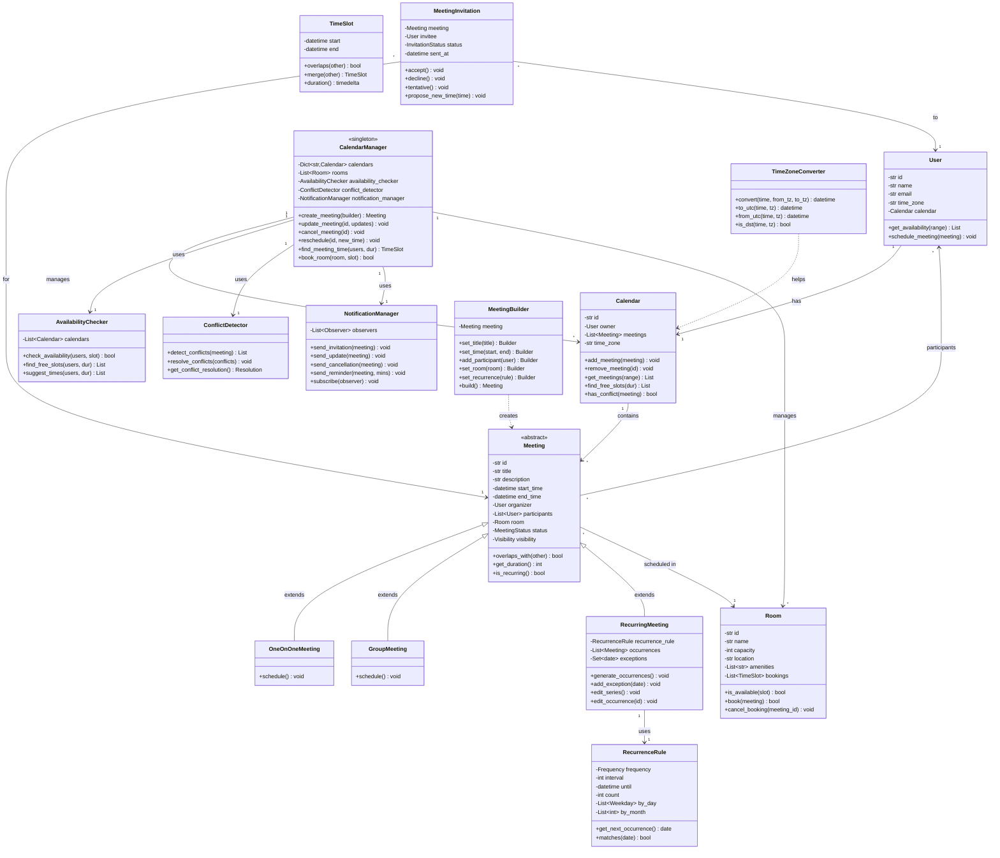

# Meeting Scheduler System - Low Level Design

## Table of Contents

- [Overview](#overview)
- [Requirements](#requirements)
  - [Functional Requirements](#functional-requirements)
  - [Non-Functional Requirements](#non-functional-requirements)
- [Core Use Cases](#core-use-cases)
- [Design Patterns Used](#design-patterns-used)
- [Class Diagram](#class-diagram)
- [Component Design](#component-design)
- [Data Structures](#data-structures)
- [API Design](#api-design)
- [Implementation Details](#implementation-details)
- [Business Rules](#business-rules)
- [Extension Points](#extension-points)
- [Complexity Analysis](#complexity-analysis)
- [Trade-offs and Design Decisions](#trade-offs-and-design-decisions)

## Overview

A Meeting Scheduler System is a collaborative calendar application (like Google Calendar, Outlook Calendar) that enables users to schedule meetings, check availability, handle conflicts, and manage meeting rooms. The system supports multiple time zones, recurring meetings, and real-time notifications.

### Key Features

- **Meeting Management**: Create, update, delete, reschedule meetings
- **Availability Checking**: Find free slots across multiple participants
- **Conflict Detection**: Identify and resolve scheduling conflicts
- **Time Zone Support**: Handle meetings across different time zones
- **Recurring Meetings**: Daily, weekly, monthly, custom patterns
- **Room Booking**: Reserve meeting rooms with capacity constraints
- **Notifications**: Reminders, invitations, updates, cancellations
- **Calendar Views**: Day, week, month, agenda views
- **Meeting Types**: One-on-one, group, all-hands, recurring
- **Privacy**: Public, private, confidential meetings

## Requirements

### Functional Requirements

1. **Meeting Creation**
   - Schedule meetings with title, description, location
   - Set start time, end time, duration
   - Add participants (required, optional)
   - Book meeting room
   - Set recurrence pattern
   - Add agenda and attachments

2. **Availability Management**
   - Check participant availability
   - Find common free time slots
   - Suggest alternative times
   - View busy/free status
   - Block out-of-office time

3. **Conflict Resolution**
   - Detect overlapping meetings
   - Highlight conflicts for users
   - Propose alternative times
   - Allow double booking with warnings
   - Priority-based scheduling

4. **Recurring Meetings**
   - Daily, weekly, monthly recurrence
   - Custom recurrence patterns
   - Edit single occurrence or series
   - Delete series or future occurrences
   - Handle exceptions (skip dates)

5. **Room Management**
   - Book meeting rooms
   - Check room availability
   - Room capacity constraints
   - Room amenities (projector, video conf)
   - Reserve equipment

6. **Notifications**
   - Send meeting invitations
   - Reminder notifications (email, push)
   - Update notifications on changes
   - Cancellation notifications
   - Configurable reminder times

7. **Calendar Operations**
   - View calendar (day/week/month)
   - Search meetings
   - Filter by participant, room, date
   - Export calendar (ICS format)
   - Import from other calendars

8. **Meeting Actions**
   - Accept/decline invitations
   - Propose new time
   - Add comments
   - Mark tentative
   - Forward invitations

9. **Time Zone Handling**
   - Display in user's time zone
   - Schedule across time zones
   - Handle daylight saving time
   - Show time zone differences

10. **Access Control**
    - Meeting visibility (public/private)
    - Calendar sharing permissions
    - Delegate access
    - View-only vs edit access

### Non-Functional Requirements

1. **Performance**
   - Fast conflict detection (<100ms)
   - Quick availability checks
   - Efficient recurring meeting expansion
   - Scalable to 1000s of users

2. **Reliability**
   - No lost meetings
   - Consistent state across devices
   - Handle network failures gracefully
   - Transaction support for bookings

3. **Availability**
   - 99.9% uptime
   - Real-time synchronization
   - Offline mode support
   - Background sync

4. **Usability**
   - Intuitive interface
   - Smart suggestions
   - Quick meeting scheduling
   - Mobile-friendly

5. **Security**
   - Encrypted meeting data
   - Access control enforcement
   - Audit logs
   - GDPR compliance

## Core Use Cases

### Use Case 1: Schedule Meeting

```text
Actor: Organizer
Precondition: Organizer has calendar access

Main Flow:
1. User creates new meeting
2. Sets title, time, duration
3. Adds participants
4. System checks availability
5. System detects conflicts (if any)
6. User resolves conflicts or proceeds
7. System books meeting
8. System sends invitations
9. System adds to all calendars

Alternative Flow:
- Availability conflict → Suggest alternative times
- Room not available → Suggest different room
- Recurring pattern → Create series
```

### Use Case 2: Find Common Free Time

```text
Actor: Organizer
Precondition: Multiple participants selected

Main Flow:
1. User selects participants
2. User specifies date range
3. System retrieves all calendars
4. System finds overlapping free slots
5. System displays available times
6. User selects preferred slot
7. System creates meeting

Alternative Flow:
- No common slots → Expand time range
- Partial availability → Show tentative slots
```

### Use Case 3: Handle Recurring Meeting

```text
Actor: Organizer
Precondition: Meeting series exists

Main Flow:
1. User edits recurring meeting
2. System asks: this occurrence or series?
3. User selects series
4. System updates all future occurrences
5. System notifies all participants
6. System handles exceptions

Alternative Flow:
- Edit single occurrence → Create exception
- Delete series → Cancel all meetings
- Change participants → Update invitations
```

## Design Patterns Used

### 1. Strategy Pattern

- **Purpose**: Different availability checking and conflict resolution strategies
- **Usage**: FreeTimeStrategy, ConflictResolutionStrategy, NotificationStrategy
- **Benefit**: Flexible algorithms for finding slots and resolving conflicts

### 2. Observer Pattern

- **Purpose**: Notify participants of meeting changes
- **Usage**: MeetingObserver for invitations, updates, cancellations
- **Benefit**: Decoupled notification system

### 3. Factory Pattern

- **Purpose**: Create different meeting types
- **Usage**: MeetingFactory creates OneOnOne, Group, Recurring meetings
- **Benefit**: Encapsulated creation logic

### 4. Builder Pattern

- **Purpose**: Construct complex meeting objects
- **Usage**: MeetingBuilder with fluent interface
- **Benefit**: Clean creation of meetings with many optional parameters

### 5. Chain of Responsibility Pattern

- **Purpose**: Handle conflict resolution chain
- **Usage**: ConflictHandler chain (check availability → check rooms → notify)
- **Benefit**: Extensible validation pipeline

### 6. State Pattern

- **Purpose**: Manage meeting lifecycle states
- **Usage**: Scheduled, InProgress, Completed, Cancelled states
- **Benefit**: Clean state transitions and behavior

### 7. Composite Pattern

- **Purpose**: Represent recurring meeting series
- **Usage**: Meeting series as composite of individual occurrences
- **Benefit**: Uniform treatment of single and recurring meetings

### 8. Memento Pattern

- **Purpose**: Undo meeting changes and track history
- **Usage**: MeetingMemento saves meeting state
- **Benefit**: Rollback capability

### 9. Singleton Pattern

- **Purpose**: Single calendar manager instance
- **Usage**: CalendarManager, NotificationManager
- **Benefit**: Centralized management

### 10. Template Method Pattern

- **Purpose**: Standardize meeting workflow
- **Usage**: MeetingSchedulerTemplate defines steps
- **Benefit**: Consistent scheduling process

## Class Diagram



## Component Design

### 1. Meeting Component

```python
class Meeting:
    """
    Represents a scheduled meeting.
    
    Usage:
        meeting = Meeting("Standup", start_time, end_time, organizer)
        meeting.add_participant(user)
        meeting.book_room(room)
    
    Returns:
        Meeting: Meeting instance with all details
    """
    - id: Unique identifier
    - title, description: Meeting details
    - start_time, end_time: Meeting schedule (UTC)
    - organizer: Meeting creator
    - participants: List of attendees (required + optional)
    - room: Booked meeting room
    - status: SCHEDULED, IN_PROGRESS, COMPLETED, CANCELLED
    - visibility: PUBLIC, PRIVATE, CONFIDENTIAL
```

### 2. Calendar Component

```python
class Calendar:
    """
    User's calendar managing meetings.
    
    Usage:
        calendar = Calendar(user, "America/New_York")
        calendar.add_meeting(meeting)
        conflicts = calendar.has_conflict(new_meeting)
        free_slots = calendar.find_free_slots(duration, date_range)
    
    Returns:
        Calendar: Calendar with meeting management
    """
    - Stores all meetings for a user
    - Provides availability checking
    - Detects conflicts
    - Finds free time slots
    - Handles time zone conversions
```

### 3. RecurringMeeting Component

```python
class RecurringMeeting(Meeting):
    """
    Recurring meeting with recurrence pattern.
    
    Usage:
        rule = RecurrenceRule(Frequency.WEEKLY, interval=1, until=end_date)
        meeting = RecurringMeeting(title, start, end, organizer, rule)
        meeting.generate_occurrences()
    
    Returns:
        RecurringMeeting: Series with all occurrences
    """
    - Generates series of occurrences based on rule
    - Handles exceptions (skip specific dates)
    - Supports edit series vs single occurrence
    - Expands recurrence pattern efficiently
```

### 4. AvailabilityChecker Component

```python
class AvailabilityChecker:
    """
    Finds common free time across participants.
    
    Usage:
        checker = AvailabilityChecker()
        free_slots = checker.find_free_slots([user1, user2], duration, date_range)
        is_available = checker.check_availability(users, time_slot)
    
    Returns:
        AvailabilityChecker: Availability checking utility
    """
    - Retrieves all participant calendars
    - Finds overlapping free time
    - Suggests alternative times
    - Considers time zones
    - Respects working hours
```

### 5. ConflictDetector Component

```python
class ConflictDetector:
    """
    Detects and resolves scheduling conflicts.
    
    Usage:
        detector = ConflictDetector()
        conflicts = detector.detect_conflicts(meeting)
        resolution = detector.resolve_conflicts(conflicts)
    
    Returns:
        ConflictDetector: Conflict detection and resolution
    """
    - Identifies overlapping meetings
    - Checks room availability
    - Validates participant availability
    - Suggests resolution strategies
    - Applies priority rules
```

## Data Structures

### 1. Interval Tree (for Conflict Detection)

```text
Purpose: Efficiently find overlapping meetings
Structure: Augmented BST with max endpoint
Operations:
  - Insert: O(log N)
  - Delete: O(log N)
  - Query overlaps: O(log N + K)

Usage: Find all meetings overlapping with a time range
```

### 2. Priority Queue (for Reminder Notifications)

```text
Purpose: Schedule and send reminders at specific times
Structure: Min-heap by reminder time
Operations:
  - Insert: O(log N)
  - Extract min: O(log N)
  - Peek: O(1)

Usage: Pop and send reminders as time progresses
```

### 3. Trie (for Meeting Search)

```text
Purpose: Fast prefix search for meeting titles
Structure: Prefix tree
Operations:
  - Insert: O(L) where L = string length
  - Search: O(L)
  - Prefix match: O(L + K) where K = matches

Usage: Autocomplete meeting search
```

### 4. Segment Tree (for Room Availability)

```text
Purpose: Query room availability for time ranges
Structure: Binary tree with range aggregation
Operations:
  - Build: O(N log N)
  - Query: O(log N)
  - Update: O(log N)

Usage: Check if room is free in given time range
```

## API Design

### Meeting Management APIs

```python
# Create Meeting
create_meeting(builder: MeetingBuilder) -> Meeting
    """Create a new meeting with validation"""
    
update_meeting(meeting_id: str, updates: Dict) -> Meeting
    """Update meeting details"""
    
cancel_meeting(meeting_id: str, notify: bool = True) -> bool
    """Cancel a meeting and notify participants"""
    
reschedule_meeting(meeting_id: str, new_start: datetime, new_end: datetime) -> Meeting
    """Reschedule a meeting to new time"""

# Recurring Meetings
create_recurring_meeting(builder: MeetingBuilder, rule: RecurrenceRule) -> RecurringMeeting
    """Create a recurring meeting series"""
    
edit_series(series_id: str, updates: Dict) -> RecurringMeeting
    """Edit all future occurrences"""
    
edit_occurrence(occurrence_id: str, updates: Dict) -> Meeting
    """Edit single occurrence (creates exception)"""
    
delete_series(series_id: str) -> bool
    """Delete entire series"""
```

### Availability APIs

```python
# Availability Checking
check_availability(users: List[User], time_slot: TimeSlot) -> Dict[User, bool]
    """Check if users are available in time slot"""
    
find_free_slots(users: List[User], duration: int, date_range: DateRange) -> List[TimeSlot]
    """Find common free time slots"""
    
suggest_meeting_times(users: List[User], duration: int, preferences: Dict) -> List[TimeSlot]
    """Suggest optimal meeting times based on preferences"""
    
get_busy_times(user: User, date_range: DateRange) -> List[TimeSlot]
    """Get all busy time slots for a user"""
```

### Room Management APIs

```python
# Room Booking
book_room(room_id: str, meeting: Meeting) -> bool
    """Book a room for a meeting"""
    
cancel_room_booking(room_id: str, meeting_id: str) -> bool
    """Cancel room booking"""
    
find_available_rooms(time_slot: TimeSlot, capacity: int, amenities: List[str]) -> List[Room]
    """Find available rooms matching criteria"""
    
get_room_schedule(room_id: str, date: date) -> List[Meeting]
    """Get all meetings scheduled in a room"""
```

### Invitation APIs

```python
# Meeting Invitations
send_invitation(meeting: Meeting, invitee: User) -> MeetingInvitation
    """Send meeting invitation"""
    
respond_to_invitation(invitation_id: str, response: InvitationStatus) -> None
    """Accept/decline/tentative response"""
    
propose_new_time(invitation_id: str, proposed_time: TimeSlot) -> None
    """Propose alternative meeting time"""
    
forward_invitation(invitation_id: str, recipient: User) -> None
    """Forward invitation to another user"""
```

### Notification APIs

```python
# Notifications
send_reminder(meeting: Meeting, minutes_before: int) -> None
    """Send reminder notification"""
    
notify_update(meeting: Meeting, changes: Dict) -> None
    """Notify participants of meeting changes"""
    
notify_cancellation(meeting: Meeting, reason: str) -> None
    """Notify participants of cancellation"""
```

## Implementation Details

### 1. Interval Overlap Detection

```python
def overlaps_with(self, other: Meeting) -> bool:
    """
    Check if two meetings overlap.
    
    Algorithm:
        Meeting A overlaps B if:
        (A.start < B.end) AND (A.end > B.start)
    
    Complexity: O(1)
    """
    return (self.start_time < other.end_time and 
            self.end_time > other.start_time)
```

### 2. Find Common Free Time

```python
def find_free_slots(users: List[User], duration: int, 
                   date_range: DateRange) -> List[TimeSlot]:
    """
    Find common free time across all users.
    
    Algorithm:
        1. Get all busy times for each user
        2. Merge overlapping busy times
        3. Find gaps between busy times
        4. Filter gaps >= duration
        5. Return available slots
    
    Complexity: O(N × M log M) where N = users, M = meetings/user
    """
    # Collect all busy times
    all_busy_times = []
    for user in users:
        busy = user.calendar.get_busy_times(date_range)
        all_busy_times.extend(busy)
    
    # Sort by start time
    all_busy_times.sort(key=lambda slot: slot.start)
    
    # Merge overlapping intervals
    merged = merge_intervals(all_busy_times)
    
    # Find gaps
    free_slots = []
    current_time = date_range.start
    
    for busy_slot in merged:
        if current_time < busy_slot.start:
            gap = TimeSlot(current_time, busy_slot.start)
            if gap.duration() >= duration:
                free_slots.append(gap)
        current_time = max(current_time, busy_slot.end)
    
    # Check final gap
    if current_time < date_range.end:
        gap = TimeSlot(current_time, date_range.end)
        if gap.duration() >= duration:
            free_slots.append(gap)
    
    return free_slots
```

### 3. Merge Intervals

```python
def merge_intervals(intervals: List[TimeSlot]) -> List[TimeSlot]:
    """
    Merge overlapping time intervals.
    
    Algorithm (similar to LeetCode Merge Intervals):
        1. Sort intervals by start time
        2. Iterate and merge overlapping intervals
        3. Return merged list
    
    Complexity: O(N log N)
    """
    if not intervals:
        return []
    
    intervals.sort(key=lambda x: x.start)
    merged = [intervals[0]]
    
    for current in intervals[1:]:
        last = merged[-1]
        if current.start <= last.end:
            # Overlapping, merge
            last.end = max(last.end, current.end)
        else:
            # Non-overlapping, add new interval
            merged.append(current)
    
    return merged
```

### 4. Recurring Meeting Generation

```python
def generate_occurrences(self, until: datetime) -> List[Meeting]:
    """
    Generate all occurrences of recurring meeting.
    
    Algorithm:
        1. Start with first occurrence
        2. Apply recurrence rule repeatedly
        3. Skip exceptions
        4. Stop at 'until' date or 'count' limit
        5. Create Meeting objects for each occurrence
    
    Complexity: O(K) where K = number of occurrences
    """
    occurrences = []
    current_date = self.start_time.date()
    count = 0
    
    while (current_date <= until.date() and 
           (self.recurrence_rule.count is None or 
            count < self.recurrence_rule.count)):
        
        # Skip exceptions
        if current_date not in self.exceptions:
            # Create occurrence
            occurrence_start = datetime.combine(
                current_date, 
                self.start_time.time()
            )
            occurrence_end = occurrence_start + self.duration
            
            occurrence = Meeting(
                self.title,
                occurrence_start,
                occurrence_end,
                self.organizer
            )
            occurrences.append(occurrence)
            count += 1
        
        # Get next occurrence date
        current_date = self.recurrence_rule.get_next_date(current_date)
    
    return occurrences
```

### 5. Time Zone Conversion

```python
def convert_time_zone(time: datetime, from_tz: str, to_tz: str) -> datetime:
    """
    Convert time from one timezone to another.
    
    Algorithm:
        1. Localize time to source timezone
        2. Convert to UTC
        3. Convert to target timezone
        4. Handle DST transitions
    
    Complexity: O(1)
    """
    from_zone = pytz.timezone(from_tz)
    to_zone = pytz.timezone(to_tz)
    
    # Localize to source timezone
    localized = from_zone.localize(time)
    
    # Convert to target timezone
    converted = localized.astimezone(to_zone)
    
    return converted
```

### 6. Conflict Detection with Priority

```python
def detect_conflicts(meeting: Meeting) -> List[Conflict]:
    """
    Detect conflicts with existing meetings.
    
    Algorithm:
        1. For each participant, get their calendar
        2. Find overlapping meetings using interval tree
        3. Check room conflicts
        4. Apply priority rules
        5. Return list of conflicts with severity
    
    Complexity: O(P × log N) where P = participants, N = meetings
    """
    conflicts = []
    
    # Check participant conflicts
    for participant in meeting.participants:
        overlapping = participant.calendar.find_overlapping(
            meeting.start_time,
            meeting.end_time
        )
        
        for other_meeting in overlapping:
            severity = calculate_conflict_severity(
                meeting, other_meeting, participant
            )
            conflicts.append(Conflict(
                participant, other_meeting, severity
            ))
    
    # Check room conflict
    if meeting.room:
        if not meeting.room.is_available(
            meeting.start_time, meeting.end_time
        ):
            conflicts.append(RoomConflict(meeting.room))
    
    return conflicts
```

## Business Rules

### Rule 1: Meeting Duration Constraints

```text
Minimum Duration: 15 minutes
Maximum Duration: 8 hours
Default Duration: 30 minutes
Increment: 15 minutes

Rationale: Standard meeting practices
Enforcement: Validation on meeting creation
```

### Rule 2: Advance Booking

```text
Minimum Advance: 15 minutes
Maximum Advance: 1 year

Rationale: Prevent last-minute conflicts, limit long-term booking
Exception: Recurring meetings can extend beyond 1 year
```

### Rule 3: Room Capacity

```text
Constraint: Number of participants <= Room capacity
Warning Threshold: 80% of capacity
Over-booking: Not allowed

Rationale: Physical space limitations
Enforcement: Check during room booking
```

### Rule 4: Conflict Resolution Priority

```text
Priority Order:
1. All-hands meetings
2. Client meetings
3. Team meetings
4. One-on-ones
5. Optional meetings

Rationale: Business importance hierarchy
Application: Suggest rescheduling lower priority meetings
```

### Rule 5: Reminder Timing

```text
Default Reminders:
- 15 minutes before
- 1 day before (for multi-day events)

Customizable: Users can set 0-7 reminders per meeting
Maximum Advance: 1 week before

Rationale: Balance between useful reminders and spam
```

### Rule 6: Recurring Meeting Limits

```text
Maximum Occurrences: 365 per series
Maximum Duration: 2 years

Rationale: Prevent infinite series, encourage review
Enforcement: Validation on recurrence rule creation
```

### Rule 7: Working Hours

```text
Default Working Hours: 9 AM - 5 PM (user's timezone)
Configurable: Users can set custom working hours
After-hours Booking: Allowed with warning

Rationale: Respect work-life balance
Application: Highlight in availability suggestions
```

## Extension Points

### 1. External Calendar Integration

```python
class CalendarProvider:
    """
    Integrate with external calendar systems.
    
    Providers: Google Calendar, Outlook, Apple Calendar
    Features: Sync meetings, import/export, two-way updates
    Implementation: OAuth authentication, API integration
    """
```

### 2. AI-Powered Scheduling

```python
class SmartScheduler:
    """
    ML-based intelligent scheduling.
    
    Features:
    - Learn user preferences
    - Predict optimal meeting times
    - Auto-decline low-priority conflicts
    - Suggest meeting length based on agenda
    """
```

### 3. Video Conferencing Integration

```python
class VideoConferenceProvider:
    """
    Integrate with video platforms.
    
    Providers: Zoom, Google Meet, Microsoft Teams
    Features:
    - Auto-generate meeting links
    - Start meeting from calendar
    - Record meetings
    - Share recordings
    """
```

### 4. Meeting Analytics

```python
class MeetingAnalytics:
    """
    Track and analyze meeting patterns.
    
    Metrics:
    - Time spent in meetings
    - Meeting frequency by type
    - Average meeting length
    - Participant engagement
    - Cost analysis (time × hourly rate)
    """
```

### 5. Resource Management

```python
class ResourceManager:
    """
    Manage additional meeting resources.
    
    Resources:
    - Equipment (projectors, whiteboards)
    - Catering services
    - Parking spots
    - IT support
    """
```

## Complexity Analysis

### Time Complexity

| Operation | Complexity | Notes |
|-----------|------------|-------|
| Create meeting | O(P log N) | P = participants, N = meetings per calendar |
| Check availability | O(P × M) | P = participants, M = meetings in range |
| Find free slots | O(P × M log M) | Merge intervals across participants |
| Detect conflicts | O(P × log N) | Interval tree query per participant |
| Book room | O(log R) | R = room bookings |
| Generate recurring | O(K) | K = occurrences |
| Search meetings | O(L + K) | L = query length, K = results |
| Time zone convert | O(1) | Direct timezone lookup |

### Space Complexity

| Component | Complexity | Notes |
|-----------|------------|-------|
| Calendar | O(M) | M = meetings per calendar |
| Recurring series | O(K) | K = occurrences (lazy expansion) |
| Interval tree | O(N) | N = meetings |
| Room bookings | O(B) | B = total bookings |
| Notification queue | O(Q) | Q = pending notifications |
| Total | O(U × M + B + Q) | U = users, M = avg meetings/user |

## Trade-offs and Design Decisions

### 1. Eager vs. Lazy Recurring Meeting Expansion

**Decision:** Lazy expansion (generate on demand)

| Approach | Pros | Cons |
|----------|------|------|
| Eager (all at once) | Fast queries | High storage, memory |
| Lazy (on demand) | Low storage | Slightly slower queries |
| Hybrid (cache window) | Balanced | More complex |

**Rationale:** Save storage, most recurring meetings not queried far in future.

### 2. Conflict Handling

**Decision:** Warn but allow (with explicit confirmation)

**Pros:**

- User flexibility
- Handle urgent meetings
- Respect user judgment

**Cons:**

- Possible double-booking
- Participant confusion
- Calendar integrity

**Rationale:** Trust users to make decisions, provide clear warnings.

### 3. Time Zone Storage

**Decision:** Store all times in UTC, convert on display

| Approach | Pros | Cons |
|----------|------|------|
| UTC storage | Consistent, no DST issues | Conversion overhead |
| Local time | No conversion needed | DST confusion, sync issues |
| Dual storage | Fast both ways | Double storage |

**Rationale:** UTC ensures consistency across time zones and DST transitions.

### 4. Room Booking Strategy

**Decision:** First-come-first-served with cancellation

**Alternatives:**

- Priority-based (executives first)
- Auction-based (bid for rooms)
- Round-robin (fair distribution)

**Rationale:** Simplest and fairest for most organizations.

### 5. Notification Delivery

**Decision:** Multi-channel (email + push + in-app)

| Channel | Reliability | Latency | Cost |
|---------|------------|---------|------|
| Email | High | Minutes | Low |
| Push | Medium | Seconds | Low |
| SMS | High | Seconds | High |
| In-app | Medium | Instant | Low |

**Rationale:** Redundancy ensures delivery, users choose preference.

## Summary

The Meeting Scheduler System provides a comprehensive calendar and scheduling solution with:

- **Intelligent Scheduling**: Availability checking, conflict detection, smart suggestions
- **Recurring Meetings**: Flexible recurrence patterns with exception handling
- **Time Zone Support**: Global teams work across time zones seamlessly
- **Room Management**: Book meeting rooms with capacity and amenity constraints
- **Notifications**: Multi-channel reminders and updates
- **Conflict Resolution**: Priority-based conflict handling
- **Calendar Sync**: Integration with external calendar providers

**Key Design Principles:**

1. **Performance**: Efficient algorithms for conflict detection and availability checking
2. **Flexibility**: Support various meeting types and scheduling patterns
3. **User Experience**: Smart suggestions and intuitive conflict resolution
4. **Scalability**: Handle enterprise-scale with thousands of users
5. **Reliability**: Consistent state, transaction support, data integrity

**Perfect for:**

- Enterprise calendar systems
- Collaborative scheduling applications
- Resource booking platforms
- Conference room management
- Interview scheduling systems
