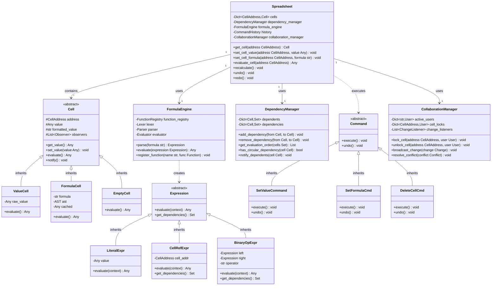

# Spreadsheet System - Low Level Design

## 1. Problem Statement

Design a collaborative spreadsheet system similar to Google Sheets or Microsoft Excel that supports:

### Core Requirements

1. **Cell Management**
   - Support for different cell types (number, text, formula)
   - Cell addressing (A1, B2, etc.)
   - Range operations (A1:B5)
   - Cell formatting and styling

2. **Formula Engine**
   - Formula parsing and evaluation
   - Cell references (A1, B2)
   - Range references (SUM(A1:A5))
   - Built-in functions (SUM, AVERAGE, COUNT, MIN, MAX, IF, etc.)
   - Arithmetic operations (+, -, *, /, %)
   - Comparison operations (>, <, >=, <=, ==, !=)
   - Logical operations (AND, OR, NOT)

3. **Dependency Management**
   - Track cell dependencies (which cells depend on which)
   - Automatic recalculation when dependencies change
   - Circular dependency detection
   - Topological ordering for evaluation

4. **Collaboration Features**
   - Multi-user editing
   - Real-time updates
   - Conflict resolution
   - User presence tracking
   - Cell locking during editing

5. **History & Undo/Redo**
   - Operation history
   - Undo/Redo support
   - Change tracking

6. **Advanced Features**
   - Named ranges
   - Cell validation
   - Conditional formatting
   - Import/Export (CSV, JSON)

### Non-Functional Requirements

1. **Performance**
   - Fast formula evaluation (< 100ms for complex formulas)
   - Efficient dependency tracking
   - Lazy evaluation when possible

2. **Scalability**
   - Support for 1000+ rows and 100+ columns
   - Handle complex dependency graphs
   - Optimize memory for sparse matrices

3. **Reliability**
   - Prevent circular dependencies
   - Handle formula errors gracefully
   - Data consistency in collaborative editing

## 2. Core Components

### 2.1 Cell System

```text
Cell (Abstract Base)
├── ValueCell (stores direct values)
│   ├── NumberCell
│   ├── TextCell
│   └── BooleanCell
└── FormulaCell (stores formulas)
    ├── parsed_expression
    ├── cached_value
    └── dependencies
```

### 2.2 Formula Engine

```text
Formula Engine
├── Lexer (tokenization)
├── Parser (AST generation)
├── Evaluator (expression evaluation)
└── Function Registry
    ├── Aggregate Functions (SUM, AVERAGE, COUNT)
    ├── Math Functions (ABS, ROUND, SQRT)
    ├── Logical Functions (IF, AND, OR)
    └── Text Functions (CONCAT, UPPER, LOWER)
```

### 2.3 Dependency Graph

```text
Dependency Manager
├── Forward Dependencies (A1 → [B1, C1])
├── Reverse Dependencies ([B1, C1] → A1)
├── Topological Sort (evaluation order)
└── Cycle Detection
```

### 2.4 Collaboration System

```text
Collaboration Manager
├── Active Users
├── Cell Locks
├── Change Broadcasting
└── Conflict Resolution
```

## 3. Class Diagram



## 4. Design Patterns Used

### 4.1 Interpreter Pattern (Formula Parsing)

**Purpose:** Parse and evaluate formulas with a grammar-based approach.

**Implementation:**

- **Lexer:** Tokenizes formula string
- **Parser:** Builds Abstract Syntax Tree (AST)
- **Expression:** Abstract base for all expression types
- **Terminal Expressions:** Literals, cell references
- **Non-Terminal Expressions:** Binary operations, function calls

**Example:**

```text
Formula: "=A1 + B2 * 2"

Tokens: [EQUALS, CELL_REF(A1), PLUS, CELL_REF(B2), MULTIPLY, NUMBER(2)]

AST:
    BinaryOp(+)
    ├── CellRef(A1)
    └── BinaryOp(*)
        ├── CellRef(B2)
        └── Literal(2)
```

### 4.2 Observer Pattern (Cell Dependencies)

**Purpose:** Automatically update dependent cells when a cell value changes.

**Implementation:**

- **Subject:** Cell (when value changes)
- **Observer:** Dependent cells
- **Notification:** Triggers recalculation cascade

**Flow:**

```text
A1 changes → notifies [B1, C1] → B1 recalculates → notifies [D1] → ...
```

### 4.3 Command Pattern (Undo/Redo)

**Purpose:** Encapsulate cell operations for undo/redo support.

**Commands:**

- `SetValueCommand`: Set cell value
- `SetFormulaCommand`: Set cell formula
- `DeleteCellCommand`: Delete cell
- `PasteCommand`: Paste range
- `InsertRowCommand`: Insert row

**History Stack:**

```text
Undo Stack: [Cmd1, Cmd2, Cmd3] ← Current
Redo Stack: []

After Undo:
Undo Stack: [Cmd1, Cmd2]
Redo Stack: [Cmd3] ← Can be redone
```

### 4.4 Composite Pattern (Formula Expressions)

**Purpose:** Represent formula expressions in a tree structure.

**Structure:**

- **Component:** Expression (abstract)
- **Leaf:** LiteralExpression, CellReferenceExpression
- **Composite:** BinaryOperationExpression, FunctionCallExpression

**Example:**

```text
SUM(A1:A3) + B1

Composite Tree:
    BinaryOp(+)
    ├── FunctionCall(SUM)
    │   └── RangeExpr(A1:A3)
    └── CellRef(B1)
```

### 4.5 Strategy Pattern (Cell Value Types & Formatters)

**Purpose:** Different strategies for storing and formatting cell values.

**Strategies:**

- **Value Types:** Number, Text, Boolean, Date, Error
- **Formatters:** NumberFormatter, DateFormatter, CurrencyFormatter, PercentageFormatter

**Example:**

```python
# Number: 1234.56
formatters = {
    'general': "1234.56",
    'currency': "$1,234.56",
    'percentage': "123456%",
    'scientific': "1.23E+03"
}
```

### 4.6 Factory Pattern (Cell Creation)

**Purpose:** Create appropriate cell types based on input.

**Factory Logic:**

```text
Input Analysis:
- Starts with '=' → FormulaCell
- Is numeric → NumberCell
- Is text → TextCell
- Is empty → EmptyCell
```

### 4.7 Memento Pattern (Cell State)

**Purpose:** Save and restore cell state for undo/redo.

**Components:**

- **Originator:** Cell
- **Memento:** CellMemento (stores cell state)
- **Caretaker:** CommandHistory

**State Snapshot:**

```python
class CellMemento:
    def __init__(self, value, formula, format):
        self.value = value
        self.formula = formula
        self.format = format
```

### 4.8 Singleton Pattern (Spreadsheet Instance)

**Purpose:** Ensure single spreadsheet instance in application.

**Usage:**

```python
spreadsheet = Spreadsheet.get_instance()
```

### 4.9 Visitor Pattern (Formula Traversal)

**Purpose:** Traverse and analyze formula AST without modifying structure.

**Visitors:**

- **DependencyVisitor:** Extract cell dependencies
- **EvaluationVisitor:** Evaluate expressions
- **ValidationVisitor:** Validate formula syntax

### 4.10 Proxy Pattern (Lazy Cell Evaluation)

**Purpose:** Defer expensive formula calculations until needed.

**Implementation:**

- **RealSubject:** FormulaCell (actual evaluation)
- **Proxy:** CellProxy (caches result, evaluates on demand)

## 5. Key Algorithms

### 5.1 Formula Parsing (Recursive Descent Parser)

```text
Grammar:
  expression := term (('+' | '-') term)*
  term := factor (('*' | '/' | '%') factor)*
  factor := NUMBER | CELL_REF | FUNCTION | '(' expression ')'
  function := IDENTIFIER '(' arguments ')'
  arguments := expression (',' expression)*
  cell_ref := COLUMN ROW | COLUMN ROW ':' COLUMN ROW
```

**Algorithm:**

```python
def parse_expression():
    left = parse_term()
    while current_token in ['+', '-']:
        op = current_token
        advance()
        right = parse_term()
        left = BinaryOp(op, left, right)
    return left

def parse_term():
    left = parse_factor()
    while current_token in ['*', '/', '%']:
        op = current_token
        advance()
        right = parse_factor()
        left = BinaryOp(op, left, right)
    return left

def parse_factor():
    if current_token.type == NUMBER:
        return Literal(current_token.value)
    elif current_token.type == CELL_REF:
        return CellRef(current_token.value)
    elif current_token.type == IDENTIFIER:
        return parse_function()
    elif current_token == '(':
        advance()
        expr = parse_expression()
        expect(')')
        return expr
```

**Time Complexity:** O(n) where n = formula length

### 5.2 Dependency Graph & Topological Sort

**Purpose:** Determine evaluation order to handle dependencies correctly.

**Data Structure:**

```python
dependencies = {
    'A1': set(),           # A1 = 10 (no deps)
    'B1': {'A1'},          # B1 = A1 + 5
    'C1': {'A1', 'B1'},    # C1 = A1 + B1
    'D1': {'C1'}           # D1 = C1 * 2
}
```

**Topological Sort Algorithm (Kahn's Algorithm):**

```python
def topological_sort(cells):
    in_degree = {cell: 0 for cell in cells}
    
    # Calculate in-degrees
    for cell in cells:
        for dependent in get_dependents(cell):
            in_degree[dependent] += 1
    
    # Queue cells with no dependencies
    queue = [cell for cell in cells if in_degree[cell] == 0]
    result = []
    
    while queue:
        cell = queue.pop(0)
        result.append(cell)
        
        # Reduce in-degree for dependents
        for dependent in get_dependents(cell):
            in_degree[dependent] -= 1
            if in_degree[dependent] == 0:
                queue.append(dependent)
    
    if len(result) != len(cells):
        raise CircularDependencyError()
    
    return result
```

**Time Complexity:** O(V + E) where V = cells, E = dependencies

### 5.3 Circular Dependency Detection

**Purpose:** Prevent infinite recursion from circular references.

**Algorithm (DFS with visited states):**

```python
def has_cycle(cell, visited, rec_stack):
    visited.add(cell)
    rec_stack.add(cell)
    
    for dependent in get_dependents(cell):
        if dependent not in visited:
            if has_cycle(dependent, visited, rec_stack):
                return True
        elif dependent in rec_stack:
            return True  # Back edge found!
    
    rec_stack.remove(cell)
    return False

def detect_circular_dependency(start_cell):
    return has_cycle(start_cell, set(), set())
```

**Example Detection:**

```text
A1 = B1 + 1
B1 = C1 * 2
C1 = A1 + 5  ← Circular! (A1 → B1 → C1 → A1)

Detection:
Visit A1 (rec_stack: {A1})
  Visit B1 (rec_stack: {A1, B1})
    Visit C1 (rec_stack: {A1, B1, C1})
      Visit A1 ← Already in rec_stack! CYCLE DETECTED
```

**Time Complexity:** O(V + E)

### 5.4 Incremental Recalculation

**Purpose:** Recalculate only affected cells when a value changes.

**Algorithm:**

```python
def recalculate_cell(changed_cell):
    # Find all cells affected by this change
    affected = get_all_dependents_transitive(changed_cell)
    
    # Sort in evaluation order
    evaluation_order = topological_sort(affected)
    
    # Recalculate in order
    for cell in evaluation_order:
        if isinstance(cell, FormulaCell):
            new_value = cell.evaluate()
            if new_value != cell.cached_value:
                cell.cached_value = new_value
                cell.notify_observers()
```

**Example:**

```text
Before: A1=10, B1=A1+5 (15), C1=B1*2 (30), D1=5 (5)

Change: A1 = 20

Affected: {B1, C1} (D1 not affected)
Order: [B1, C1]

Recalculate:
1. B1 = 20 + 5 = 25
2. C1 = 25 * 2 = 50
```

### 5.5 Range Evaluation

**Purpose:** Efficiently evaluate range operations like SUM(A1:A10).

**Algorithm:**

```python
def evaluate_range(start_addr, end_addr):
    start_row, start_col = parse_address(start_addr)
    end_row, end_col = parse_address(end_addr)
    
    cells = []
    for row in range(start_row, end_row + 1):
        for col in range(start_col, end_col + 1):
            addr = format_address(row, col)
            cells.append(get_cell(addr))
    
    return cells

def sum_range(range_ref):
    cells = evaluate_range(range_ref.start, range_ref.end)
    return sum(cell.get_value() for cell in cells if cell.is_numeric())
```

**Time Complexity:** O(rows × cols) for range

### 5.6 Conflict Resolution (Collaborative Editing)

**Purpose:** Handle simultaneous edits by multiple users.

**Strategy:** Last-Write-Wins with Operational Transformation

```python
def resolve_conflict(local_change, remote_change):
    if local_change.cell != remote_change.cell:
        # No conflict - different cells
        return [local_change, remote_change]
    
    # Same cell - check timestamps
    if local_change.timestamp > remote_change.timestamp:
        return [local_change]  # Local wins
    else:
        return [remote_change]  # Remote wins

def operational_transform(op1, op2):
    """
    Transform operation op1 against op2 to maintain consistency
    """
    if op1.affects(op2):
        return op1.transform_against(op2)
    return op1
```

## 6. API Design

### 6.1 Spreadsheet Operations

```python
class Spreadsheet:
    def set_cell_value(self, address: str, value: Any) -> None:
        """Set a cell to a direct value"""
        
    def set_cell_formula(self, address: str, formula: str) -> None:
        """Set a cell to a formula"""
        
    def get_cell_value(self, address: str) -> Any:
        """Get the evaluated value of a cell"""
        
    def get_cell_formula(self, address: str) -> str:
        """Get the formula of a cell"""
        
    def delete_cell(self, address: str) -> None:
        """Clear a cell"""
        
    def copy_range(self, start: str, end: str) -> Range:
        """Copy a range of cells"""
        
    def paste_range(self, start: str, data: Range) -> None:
        """Paste a range of cells"""
        
    def insert_row(self, row: int) -> None:
        """Insert a new row"""
        
    def delete_row(self, row: int) -> None:
        """Delete a row"""
        
    def insert_column(self, col: str) -> None:
        """Insert a new column"""
        
    def delete_column(self, col: str) -> None:
        """Delete a column"""
```

### 6.2 Formula Functions

```python
# Aggregate Functions
SUM(range)          # Sum of values
AVERAGE(range)      # Average of values
COUNT(range)        # Count of numeric values
MIN(range)          # Minimum value
MAX(range)          # Maximum value

# Math Functions
ABS(value)          # Absolute value
ROUND(value, decimals)  # Round to decimals
SQRT(value)         # Square root
POW(base, exp)      # Power

# Logical Functions
IF(condition, true_val, false_val)  # Conditional
AND(expr1, expr2, ...)              # Logical AND
OR(expr1, expr2, ...)               # Logical OR
NOT(expr)                           # Logical NOT

# Text Functions
CONCAT(str1, str2, ...)  # Concatenate strings
UPPER(str)               # Uppercase
LOWER(str)               # Lowercase
LEN(str)                 # String length
```

### 6.3 Collaboration API

```python
class CollaborationManager:
    def add_user(self, user_id: str, name: str) -> User:
        """Add a user to the session"""
        
    def remove_user(self, user_id: str) -> None:
        """Remove a user from the session"""
        
    def lock_cell(self, address: str, user_id: str) -> bool:
        """Lock a cell for editing"""
        
    def unlock_cell(self, address: str, user_id: str) -> None:
        """Unlock a cell after editing"""
        
    def broadcast_change(self, change: Change) -> None:
        """Broadcast a change to all users"""
        
    def register_listener(self, listener: ChangeListener) -> None:
        """Register a listener for changes"""
```

## 7. Implementation Examples

### 7.1 Basic Cell Operations

```python
# Create spreadsheet
sheet = Spreadsheet()

# Set values
sheet.set_cell_value('A1', 10)
sheet.set_cell_value('A2', 20)
sheet.set_cell_value('A3', 30)

# Set formulas
sheet.set_cell_formula('B1', '=A1 + A2')
sheet.set_cell_formula('B2', '=SUM(A1:A3)')
sheet.set_cell_formula('B3', '=IF(B1 > 25, "High", "Low")')

# Get values
print(sheet.get_cell_value('B1'))  # 30
print(sheet.get_cell_value('B2'))  # 60
print(sheet.get_cell_value('B3'))  # "High"

# Change A1 - triggers recalculation
sheet.set_cell_value('A1', 100)
print(sheet.get_cell_value('B1'))  # 120
print(sheet.get_cell_value('B2'))  # 150
```

### 7.2 Circular Dependency Detection

```python
# Create circular reference
sheet.set_cell_formula('A1', '=B1 + 1')
sheet.set_cell_formula('B1', '=C1 + 1')

try:
    sheet.set_cell_formula('C1', '=A1 + 1')  # Creates cycle!
except CircularDependencyError as e:
    print(f"Error: {e.message}")
    print(f"Cycle: {e.cycle}")  # [A1, B1, C1, A1]
```

### 7.3 Undo/Redo

```python
# Make changes
sheet.set_cell_value('A1', 10)
sheet.set_cell_value('A2', 20)
sheet.set_cell_formula('A3', '=A1 + A2')

print(sheet.get_cell_value('A3'))  # 30

# Undo last operation
sheet.undo()
print(sheet.get_cell_value('A3'))  # Empty (formula removed)

# Redo
sheet.redo()
print(sheet.get_cell_value('A3'))  # 30 (formula restored)
```

### 7.4 Collaborative Editing

```python
# Add users
collab = CollaborationManager()
user1 = collab.add_user('u1', 'Alice')
user2 = collab.add_user('u2', 'Bob')

# User 1 locks and edits cell
collab.lock_cell('A1', 'u1')
sheet.set_cell_value('A1', 100)
collab.unlock_cell('A1', 'u1')

# User 2 tries to edit - waits for lock
collab.lock_cell('A1', 'u2')  # Blocks until available
sheet.set_cell_value('A1', 200)
collab.unlock_cell('A1', 'u2')

# Changes are broadcast to all users
collab.register_listener(lambda change: print(f"Cell {change.address} changed"))
```

## 8. Edge Cases & Error Handling

### 8.1 Formula Errors

```text
# Division by zero
'=A1 / 0'  → #DIV/0! error

# Invalid cell reference
'=ZZ999 + 1'  → #REF! error

# Circular dependency
'=A1 + 1' in A1  → #CIRCULAR! error

# Invalid function
'=INVALID(A1)'  → #NAME! error

# Type mismatch
'=SUM("text")'  → #VALUE! error
```

### 8.2 Edge Cases

1. **Empty Cells in Formulas**

   ```text
   A1 = empty
   B1 = =A1 + 5
   Result: B1 = 5 (empty treated as 0)
   ```

2. **Large Ranges**

   ```text
   =SUM(A1:Z1000)  # Optimize for sparse matrices
   ```

3. **Nested Functions**

   ```text
   =IF(AND(A1>10, B1<20), SUM(C1:C5), AVERAGE(D1:D5))
   ```

4. **Mixed Types**

   ```text
   A1 = 10 (number)
   A2 = "20" (text)
   A3 = =A1 + A2  # Type coercion: "20" → 20
   ```

5. **Formula with Side Effects**

   ```text
   # Prevent infinite recursion
   A1 = =A1 + 1  # Detect self-reference
   ```

## 9. Optimizations

### 9.1 Sparse Matrix Storage

**Problem:** Most spreadsheets have many empty cells.

**Solution:** Use dictionary instead of 2D array.

```python
# Instead of:
cells = [[None] * 1000 for _ in range(1000)]  # 1M elements

# Use:
cells = {}  # Only stores non-empty cells
```

**Memory Savings:** From O(rows × cols) to O(non-empty cells)

### 9.2 Formula Caching

**Problem:** Recalculating complex formulas on every access is expensive.

**Solution:** Cache formula results, invalidate on dependency changes.

```python
class FormulaCell:
    def __init__(self, formula):
        self.formula = formula
        self.cached_value = None
        self.is_dirty = True
    
    def get_value(self):
        if self.is_dirty:
            self.cached_value = self.evaluate()
            self.is_dirty = False
        return self.cached_value
    
    def mark_dirty(self):
        self.is_dirty = True
```

### 9.3 Lazy Evaluation

**Problem:** Evaluating all cells on every change is wasteful.

**Solution:** Only evaluate cells that are accessed.

```python
def recalculate_cell(cell):
    # Mark dependent cells as dirty, but don't evaluate yet
    for dependent in get_dependents(cell):
        dependent.mark_dirty()
    
    # Evaluation happens only when get_value() is called
```

### 9.4 Incremental Parsing

**Problem:** Reparsing entire formula on every change.

**Solution:** Cache parsed AST, only reparse if formula changes.

```python
class FormulaCell:
    def __init__(self, formula):
        self.formula = formula
        self.ast = None  # Cached AST
    
    def set_formula(self, new_formula):
        if new_formula != self.formula:
            self.formula = new_formula
            self.ast = parse_formula(new_formula)  # Only parse if changed
```

## 10. Testing Strategy

### 10.1 Unit Tests

```python
# Test cell operations
test_set_value()
test_set_formula()
test_get_value()

# Test formula parsing
test_parse_simple_formula()
test_parse_complex_formula()
test_parse_invalid_formula()

# Test formula evaluation
test_evaluate_arithmetic()
test_evaluate_functions()
test_evaluate_cell_references()

# Test dependencies
test_add_dependency()
test_remove_dependency()
test_topological_sort()
test_circular_dependency_detection()

# Test undo/redo
test_undo_value_change()
test_redo_value_change()
test_undo_formula_change()
```

### 10.2 Integration Tests

```python
# Test complex scenarios
test_cascading_updates()
test_large_dependency_chain()
test_concurrent_editing()
test_formula_with_multiple_ranges()
```

### 10.3 Performance Tests

```python
# Test performance
test_large_spreadsheet_load_time()
test_formula_evaluation_speed()
test_recalculation_performance()
test_memory_usage()
```

## 11. Extensions

### 11.1 Named Ranges

```python
# Define named range
sheet.define_name('SalesData', 'A1:A10')

# Use in formulas
sheet.set_cell_formula('B1', '=SUM(SalesData)')
```

### 11.2 Conditional Formatting

```python
# Highlight cells > 100
sheet.add_conditional_format('A1:A10', lambda val: val > 100, color='red')
```

### 11.3 Data Validation

```python
# Restrict cell input
sheet.set_validation('A1', ValidationRule(
    type='number',
    min=0,
    max=100,
    error_message='Value must be between 0 and 100'
))
```

### 11.4 Import/Export

```python
# Export to CSV
sheet.export_csv('data.csv')

# Import from CSV
sheet.import_csv('data.csv')

# Export to JSON
sheet.export_json('data.json')
```

### 11.5 Charts & Visualization

```python
# Create chart
chart = Chart(type='bar', data_range='A1:B10')
sheet.add_chart(chart, position='D1')
```

## 12. Scalability Considerations

### 12.1 Large Spreadsheets

**Challenge:** Handle 10,000+ rows × 100+ columns efficiently.

**Solutions:**

1. **Virtualization:** Only render visible cells
2. **Pagination:** Load data in chunks
3. **Compression:** Compress formula ASTs
4. **Indexing:** Index cells for fast lookup

### 12.2 Distributed Spreadsheets

**Challenge:** Share spreadsheet across multiple servers.

**Solutions:**

1. **Sharding:** Partition cells across servers
2. **Replication:** Replicate for high availability
3. **Eventual Consistency:** Use CRDTs for conflict-free updates
4. **WebSocket:** Real-time synchronization

### 12.3 Concurrent Editing

**Challenge:** Multiple users editing simultaneously.

**Solutions:**

1. **Operational Transformation:** Transform operations for consistency
2. **Cell Locking:** Lock cells during editing
3. **Merge Strategies:** Last-write-wins, user priority, manual merge
4. **Change Tracking:** Track who changed what when

## 13. Summary

### Key Design Patterns (10)

1. **Interpreter Pattern** - Formula parsing and evaluation
2. **Observer Pattern** - Dependency tracking and updates
3. **Command Pattern** - Undo/redo operations
4. **Composite Pattern** - Formula expression tree
5. **Strategy Pattern** - Value types and formatters
6. **Factory Pattern** - Cell type creation
7. **Memento Pattern** - State saving for undo
8. **Singleton Pattern** - Spreadsheet instance
9. **Visitor Pattern** - Formula AST traversal
10. **Proxy Pattern** - Lazy formula evaluation

### Core Algorithms

1. **Recursive Descent Parser** - O(n) formula parsing
2. **Topological Sort** - O(V+E) dependency ordering
3. **DFS Cycle Detection** - O(V+E) circular dependency detection
4. **Incremental Recalculation** - Only update affected cells
5. **Operational Transformation** - Conflict resolution

### Complexity Analysis

| Operation | Time Complexity | Space Complexity |
|-----------|----------------|------------------|
| Set Value | O(1) | O(1) |
| Get Value | O(1) cached, O(d) uncached | O(1) |
| Parse Formula | O(n) | O(n) |
| Evaluate Formula | O(d) | O(d) |
| Recalculate | O(V + E) | O(V) |
| Detect Cycle | O(V + E) | O(V) |
| Undo/Redo | O(1) | O(h) |

Where:

- n = formula length
- d = dependency depth
- V = number of cells
- E = number of dependencies
- h = history size

### Features Implemented

✅ Cell management (value, formula, empty)  
✅ Formula engine with parser and evaluator  
✅ 15+ built-in functions  
✅ Dependency tracking and auto-recalculation  
✅ Circular dependency detection  
✅ Undo/redo support  
✅ Collaborative editing with conflict resolution  
✅ Cell locking  
✅ Error handling (#DIV/0!, #REF!, #CIRCULAR!)  
✅ Range operations (SUM, AVERAGE, etc.)  
✅ Optimizations (caching, lazy evaluation)  

### Real-World Applications

- **Google Sheets** - Collaborative spreadsheets
- **Microsoft Excel** - Desktop spreadsheet application
- **Airtable** - Database-spreadsheet hybrid
- **Notion** - Tables with formulas
- **Smart Contracts** - On-chain calculations

---

**Difficulty:** HARD (P2 - High Priority)  
**Category:** Collaborative Systems  
**Estimated Implementation Time:** 6-8 hours  
**Lines of Code:** ~1500-2000 (with comprehensive features)
