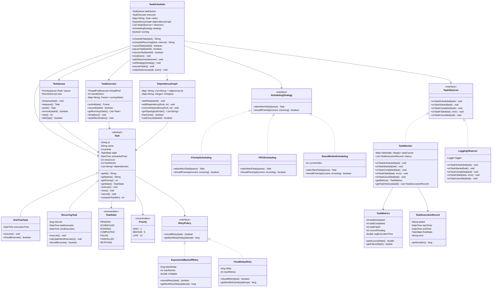
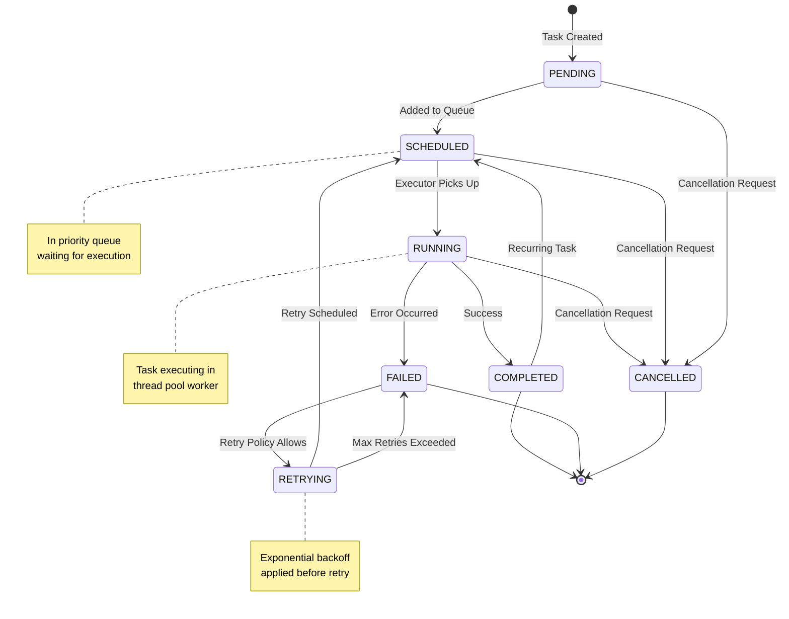
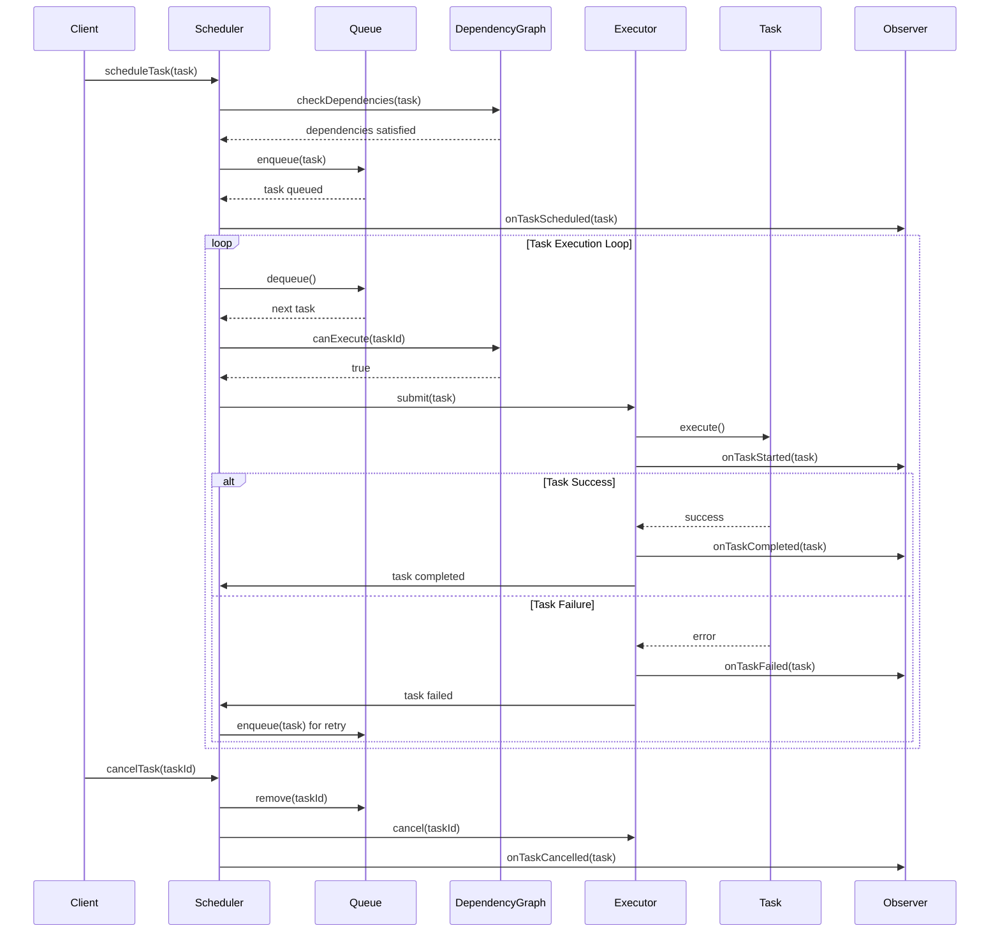

# Task Scheduler System - Low Level Design

## 🔗 Implementation Links

- [Python Implementation](python/task-scheduler/main.py)
- [JavaScript Implementation](javascript/task-scheduler/main.js)

## Problem Statement

Design a comprehensive task scheduling system that executes tasks based on time constraints, priority levels, and dependency relationships. The system should support both one-time and recurring tasks, provide task cancellation capabilities, implement retry mechanisms with exponential backoff, monitor task execution status, and handle concurrent task execution efficiently while respecting dependencies and resource constraints.

### Core Capabilities

1. **Task Scheduling**: Schedule one-time and recurring tasks with flexible timing
2. **Priority Management**: Execute tasks based on configurable priority levels
3. **Dependency Resolution**: Handle task dependencies using DAG (Directed Acyclic Graph)
4. **Cancellation Support**: Cancel pending or running tasks gracefully
5. **Monitoring & Observability**: Track task status and execution metrics
6. **Retry Mechanism**: Automatic retry with exponential backoff for failed tasks

## Requirements

### Functional Requirements

- Schedule tasks with specific execution times (one-time tasks)
- Support recurring tasks with configurable intervals (daily, weekly, custom)
- Execute tasks based on priority levels (HIGH, MEDIUM, LOW)
- Manage task dependencies and execute in topological order
- Cancel tasks before or during execution
- Retry failed tasks with configurable retry policies
- Track task execution history and status
- Support concurrent task execution with thread safety
- Provide task monitoring and notification capabilities

#### Non-Functional Requirements

- Efficient task scheduling using priority queue (O(log n) operations)
- Thread-safe operations for concurrent access
- Low latency task execution (sub-millisecond scheduling)
- Support for thousands of concurrent tasks
- Graceful shutdown with task cleanup

## Design Decisions

### Key Classes

1. **TaskScheduler**: Main coordinator managing task lifecycle and execution
2. **Task**: Abstract representation of executable work (Command pattern)
3. **TaskQueue**: Priority queue implementation using heap
4. **TaskExecutor**: Thread pool executor for concurrent task execution
5. **SchedulingStrategy**: Different scheduling algorithms (FIFO, Priority, Fair)

#### Design Patterns Used

1. **Command Pattern**: Task encapsulates execution logic as command object
2. **Strategy Pattern**: Different scheduling strategies (Priority, FIFO, Round Robin)
3. **Observer Pattern**: TaskMonitor observes task state changes and events
4. **State Pattern**: Task lifecycle states (Pending, Running, Completed, Failed, Cancelled)
5. **Singleton Pattern**: TaskScheduler as single system-wide instance
6. **Template Method Pattern**: Retry mechanism with customizable backoff strategies

#### Key Features

- **Heap-based Priority Queue**: O(log n) insert/remove for efficient scheduling
- **DAG Dependency Resolution**: Topological sort for dependency ordering
- **Exponential Backoff**: Configurable retry delays (base × 2^attempt)
- **Thread Pool**: Concurrent execution with configurable worker threads
- **Graceful Degradation**: Continue operation even with some task failures

## Class Diagram



## Usage Example

```python
# Create task scheduler with priority strategy
scheduler = TaskScheduler(max_workers=4, strategy=PriorityScheduling())

# Add task monitor
monitor = TaskMonitor()
scheduler.add_observer(monitor)

# Schedule one-time task
task1 = OneTimeTask(
    name="Send Email",
    priority=Priority.HIGH,
    execution_time=datetime.now() + timedelta(seconds=5),
    retry_policy=ExponentialBackoffRetry(max_retries=3)
)
task_id1 = scheduler.schedule_task(task1)

# Schedule recurring task
task2 = RecurringTask(
    name="Database Backup",
    priority=Priority.MEDIUM,
    interval=timedelta(hours=24),
    retry_policy=FixedDelayRetry(delay=60, max_retries=2)
)
task_id2 = scheduler.schedule_recurring(task2)

# Schedule task with dependencies
task3 = OneTimeTask(name="Data Processing", priority=Priority.HIGH)
task4 = OneTimeTask(name="Generate Report", priority=Priority.MEDIUM)
scheduler.add_dependency(task3.id, task4.id)  # task4 depends on task3

# Monitor task status
metrics = monitor.get_metrics()
print(f"Success Rate: {metrics.get_success_rate():.2%}")

# Cancel task
scheduler.cancel_task(task_id1)

# Graceful shutdown
scheduler.shutdown()
```

## Business Rules

1. **Priority Ordering**: Higher priority tasks execute before lower priority tasks
2. **Dependency Enforcement**: Dependent tasks execute only after dependencies complete
3. **Retry Limit**: Failed tasks retry up to maximum retry count, then marked as FAILED
4. **Execution Time**: Tasks scheduled in the past execute immediately
5. **Recurring Tasks**: After execution, automatically schedule next occurrence
6. **Cancellation**: Only PENDING and SCHEDULED tasks can be cancelled
7. **Thread Safety**: All operations must be thread-safe for concurrent access
8. **Cycle Detection**: Dependency graph must be acyclic (DAG validation)

## Algorithms

### Task Scheduling (Priority Queue)

```text
Data Structure: Min-Heap based on (priority, scheduled_time)

Enqueue Operation:
1. Add task to heap
2. Heapify up based on comparator
Time Complexity: O(log n)

Dequeue Operation:
1. Remove root (highest priority task)
2. Replace with last element
3. Heapify down
Time Complexity: O(log n)

Peek Operation:
1. Return root without removing
Time Complexity: O(1)
```

#### Dependency Resolution (Topological Sort)

```text
Algorithm: Kahn's Algorithm using BFS

1. Calculate in-degree for all tasks
2. Enqueue all tasks with in-degree 0
3. While queue not empty:
   a. Dequeue task and add to result
   b. For each dependent task:
      - Decrease in-degree
      - If in-degree becomes 0, enqueue
4. If result size < total tasks, cycle detected

Time Complexity: O(V + E) where V = tasks, E = dependencies
Space Complexity: O(V)
```

#### Exponential Backoff

```text
Retry Delay Calculation:
delay = base_delay × (multiplier ^ attempt_number)
max_delay = min(calculated_delay, max_backoff)

Example with base=1000ms, multiplier=2:
- Attempt 1: 1000ms
- Attempt 2: 2000ms
- Attempt 3: 4000ms
- Attempt 4: 8000ms (capped at max_backoff)

Time Complexity: O(1)
```

## State Diagram



## Extension Points

1. **Distributed Scheduling**: Distribute tasks across multiple nodes with coordination
2. **Task Persistence**: Save task state to database for recovery after crashes
3. **Dynamic Priority**: Adjust task priority based on waiting time or external factors
4. **Resource Constraints**: Consider CPU/memory limits before scheduling
5. **Task Chaining**: Support complex workflows with conditional execution paths
6. **Rate Limiting**: Limit task execution rate per time window
7. **Task Grouping**: Execute related tasks together for optimization
8. **Deadline Scheduling**: Earliest Deadline First (EDF) scheduling algorithm
9. **Task Preemption**: Allow high-priority tasks to preempt running low-priority tasks
10. **Metrics Dashboard**: Real-time visualization of scheduler performance

## Security Considerations

1. **Task Authorization**: Verify permissions before executing tasks
2. **Resource Limits**: Prevent resource exhaustion from malicious tasks
3. **Task Validation**: Validate task parameters before scheduling
4. **Audit Logging**: Log all task operations for security audit
5. **Isolation**: Execute tasks in sandboxed environments

## Time Complexity

- **Schedule Task**: O(log n) for heap insertion
- **Execute Task**: O(1) to dequeue from heap
- **Cancel Task**: O(n) to search and remove from heap
- **Check Dependencies**: O(1) with hash map lookup
- **Topological Sort**: O(V + E) where V = tasks, E = dependencies
- **Get Task Status**: O(1) with hash map lookup

## Space Complexity

- **Task Queue**: O(n) where n is number of pending tasks
- **Dependency Graph**: O(V + E) for adjacency list representation
- **Running Tasks**: O(w) where w is number of worker threads
- **Task History**: O(h) where h is history size limit
- **Overall System**: O(n + V + E + w + h)

## Sequence Diagram



## Performance Optimization

1. **Lock-Free Queue**: Use concurrent queue implementations where possible
2. **Task Batching**: Batch multiple small tasks for efficient execution
3. **Lazy Evaluation**: Defer dependency resolution until execution time
4. **Cache Topology**: Cache topological sort results for static dependencies
5. **Thread Pool Tuning**: Optimize worker count based on workload

## Testing Considerations

1. **Concurrency Testing**: Test thread safety with multiple concurrent operations
2. **Dependency Testing**: Verify correct execution order with complex DAGs
3. **Failure Testing**: Test retry mechanisms and failure handling
4. **Load Testing**: Verify performance with thousands of tasks
5. **Edge Cases**: Empty queue, circular dependencies, task timeouts
