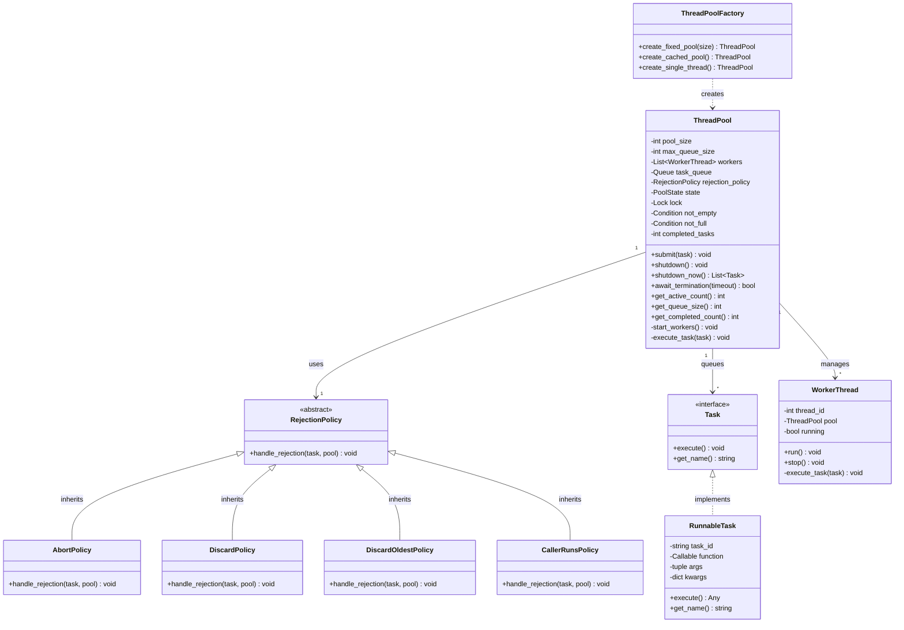

# Thread Pool - Low Level Design

## 1. Problem Statement

Design a Thread Pool system that efficiently manages a pool of worker threads to execute tasks concurrently, providing better performance than creating new threads for each task.

### Core Requirements

1. **Thread Management**
   - Fixed pool of worker threads
   - Dynamic thread creation/destruction
   - Thread reuse for multiple tasks
   - Graceful shutdown

2. **Task Queue**
   - Bounded/unbounded queue
   - Thread-safe enqueue/dequeue
   - Priority task support
   - Queue size monitoring

3. **Task Execution**
   - Submit tasks for execution
   - Execute tasks on worker threads
   - Exception handling in tasks
   - Task completion callbacks

4. **Rejection Policies**
   - Abort: Throw exception when queue full
   - Discard: Silently drop task
   - Discard Oldest: Remove oldest task
   - Caller Runs: Execute in caller thread

5. **Monitoring & Metrics**
   - Active thread count
   - Queue size
   - Completed task count
   - Pool state (running/shutdown)

### Non-Functional Requirements

1. **Performance**
   - Minimize thread creation overhead
   - Efficient task distribution
   - Low latency task submission

2. **Thread Safety**
   - Thread-safe operations
   - No race conditions
   - Proper synchronization

3. **Resource Management**
   - Bounded resource usage
   - Graceful cleanup
   - Memory leak prevention

## 2. Thread Pool Architecture

### 2.1 Conceptual View

```text
┌─────────────────────────────────────────────────────────┐
│                    Thread Pool                          │
│                                                         │
│  ┌─────────────┐     ┌──────────────────┐             │
│  │   Client    │────▶│   Task Queue     │             │
│  │  (Submit)   │     │  [T1][T2][T3]... │             │
│  └─────────────┘     └──────────────────┘             │
│                              │                          │
│                              ▼                          │
│  ┌──────────────────────────────────────────────┐     │
│  │         Worker Threads (Pool)                │     │
│  │  ┌─────────┐  ┌─────────┐  ┌─────────┐     │     │
│  │  │ Thread1 │  │ Thread2 │  │ Thread3 │ ... │     │
│  │  │  BUSY   │  │  IDLE   │  │  BUSY   │     │     │
│  │  └─────────┘  └─────────┘  └─────────┘     │     │
│  └──────────────────────────────────────────────┘     │
│                              │                          │
│                              ▼                          │
│  ┌──────────────────────────────────────────────┐     │
│  │         Task Execution & Results             │     │
│  └──────────────────────────────────────────────┘     │
└─────────────────────────────────────────────────────────┘
```

### 2.2 Component Interaction

```text
Client → submit(task) → ThreadPool → queue.enqueue(task)
                                  ↓
Worker Thread → queue.dequeue() → execute(task) → result
                    ↑                   ↓
                    └─── (loop) ────────┘
```

## 3. Class Diagram



## 4. Design Patterns Used

### 4.1 Object Pool Pattern

**Purpose:** Reuse worker threads instead of creating new ones.

**Implementation:**

```python
class ThreadPool:
    def __init__(self, pool_size):
        self.workers = []
        for i in range(pool_size):
            worker = WorkerThread(i, self)
            self.workers.append(worker)
            worker.start()  # Reuse these threads
```

**Benefits:**

- Avoids thread creation overhead
- Bounded resource usage
- Better performance

### 4.2 Command Pattern

**Purpose:** Encapsulate tasks as objects.

**Implementation:**

```python
class Task(ABC):
    @abstractmethod
    def execute(self):
        pass

class RunnableTask(Task):
    def __init__(self, func, *args, **kwargs):
        self.func = func
        self.args = args
        self.kwargs = kwargs
    
    def execute(self):
        return self.func(*self.args, **self.kwargs)
```

### 4.3 Strategy Pattern

**Purpose:** Different rejection policies for when queue is full.

**Strategies:**

- **AbortPolicy:** Throw exception
- **DiscardPolicy:** Silently drop task
- **DiscardOldestPolicy:** Remove oldest task
- **CallerRunsPolicy:** Execute in caller thread

### 4.4 Observer Pattern

**Purpose:** Monitor pool state and metrics.

**Implementation:**

```python
class ThreadPoolObserver:
    def on_task_submitted(self, task):
        pass
    
    def on_task_completed(self, task, result):
        pass
    
    def on_task_failed(self, task, error):
        pass
```

### 4.5 Factory Pattern

**Purpose:** Create different types of thread pools.

**Types:**

- **Fixed Thread Pool:** Fixed number of threads
- **Cached Thread Pool:** Dynamic thread creation
- **Single Thread Executor:** Single worker thread

### 4.6 Singleton Pattern

**Purpose:** Global thread pool instance.

**Implementation:**

```python
class ThreadPoolSingleton:
    _instance = None
    
    def __new__(cls):
        if cls._instance is None:
            cls._instance = super().__new__(cls)
            cls._instance.pool = ThreadPool(10)
        return cls._instance
```

## 5. Key Algorithms

### 5.1 Worker Thread Lifecycle

**Purpose:** Continuously process tasks from queue.

**Algorithm:**

```python
def worker_run(self):
    """
    Main worker thread loop
    
    Time Complexity: O(1) per task
    Space Complexity: O(1)
    """
    while self.running or not self.pool.task_queue.empty():
        try:
            # Wait for task with timeout
            task = self.pool.task_queue.get(timeout=1.0)
            
            if task is None:  # Poison pill
                break
            
            # Execute task
            try:
                result = task.execute()
                self.pool.on_task_completed(task, result)
            except Exception as e:
                self.pool.on_task_failed(task, e)
            finally:
                self.pool.task_queue.task_done()
                
        except queue.Empty:
            continue
```

**States:**

- **IDLE:** Waiting for task
- **BUSY:** Executing task
- **STOPPED:** Terminated

### 5.2 Task Submission

**Purpose:** Add task to queue with rejection handling.

**Algorithm:**

```python
def submit(self, task):
    """
    Submit task to pool
    
    Time Complexity: O(1)
    Space Complexity: O(1)
    
    Raises:
        RejectedExecutionError: If pool is shutdown or queue full
    """
    with self.lock:
        # Check if pool is shutdown
        if self.state == PoolState.SHUTDOWN:
            raise RejectedExecutionError("Pool is shutdown")
        
        # Try to enqueue task
        try:
            self.task_queue.put(task, block=False)
            self.submitted_tasks += 1
            self.notify_observers('task_submitted', task)
        except queue.Full:
            # Apply rejection policy
            self.rejection_policy.handle_rejection(task, self)
```

### 5.3 Graceful Shutdown

**Purpose:** Stop accepting new tasks and complete pending tasks.

**Algorithm:**

```python
def shutdown(self):
    """
    Graceful shutdown - complete pending tasks
    
    Time Complexity: O(n) where n = number of workers
    Space Complexity: O(1)
    """
    with self.lock:
        if self.state != PoolState.RUNNING:
            return
        
        self.state = PoolState.SHUTDOWN
    
    # Wait for all tasks to complete
    self.task_queue.join()
    
    # Send poison pills to workers
    for _ in self.workers:
        self.task_queue.put(None)
    
    # Wait for workers to terminate
    for worker in self.workers:
        worker.join()
```

### 5.4 Immediate Shutdown

**Purpose:** Stop immediately and return pending tasks.

**Algorithm:**

```python
def shutdown_now(self):
    """
    Immediate shutdown - stop workers and return pending tasks
    
    Time Complexity: O(n + m) where n = workers, m = pending tasks
    Space Complexity: O(m)
    """
    with self.lock:
        self.state = PoolState.TERMINATED
        
        # Stop all workers immediately
        for worker in self.workers:
            worker.running = False
        
        # Drain queue
        pending_tasks = []
        while not self.task_queue.empty():
            try:
                task = self.task_queue.get_nowait()
                pending_tasks.append(task)
            except queue.Empty:
                break
        
        return pending_tasks
```

## 6. Rejection Policies

### 6.1 Abort Policy (Default)

```python
class AbortPolicy(RejectionPolicy):
    def handle_rejection(self, task, pool):
        raise RejectedExecutionError(
            f"Task {task.get_name()} rejected from {pool}"
        )
```

**Use Case:** Critical tasks that must not be lost

### 6.2 Discard Policy

```python
class DiscardPolicy(RejectionPolicy):
    def handle_rejection(self, task, pool):
        # Silently discard the task
        pass
```

**Use Case:** Non-critical tasks, best-effort execution

### 6.3 Discard Oldest Policy

```python
class DiscardOldestPolicy(RejectionPolicy):
    def handle_rejection(self, task, pool):
        # Remove oldest task and try again
        try:
            pool.task_queue.get_nowait()
            pool.task_queue.put(task)
        except:
            pass
```

**Use Case:** Prioritize recent tasks

### 6.4 Caller Runs Policy

```python
class CallerRunsPolicy(RejectionPolicy):
    def handle_rejection(self, task, pool):
        # Execute in caller's thread
        if pool.state == PoolState.RUNNING:
            task.execute()
```

**Use Case:** Provide graceful degradation, throttle submission rate

## 7. Complexity Analysis

### 7.1 Time Complexity

| Operation | Time Complexity | Notes |
|-----------|----------------|-------|
| Submit Task | O(1) | Queue insertion |
| Task Dequeue | O(1) | Queue removal |
| Execute Task | O(task) | Depends on task |
| Shutdown | O(n) | Wait for n workers |
| Get Metrics | O(1) | Simple counter access |

### 7.2 Space Complexity

**Total Space:** O(n + m)

- n = number of worker threads
- m = maximum queue size

**Memory per thread:**

- Thread stack: ~1MB (default)
- Thread context: ~10KB

**Example:**

- 10 threads = ~10MB stack space
- Queue size 100 = depends on task size

## 8. Thread Safety

### 8.1 Synchronization Primitives

**Lock (Mutex):**

```python
with self.lock:
    # Critical section
    self.state = PoolState.SHUTDOWN
```

**Condition Variables:**

```python
with self.not_empty:
    while self.queue.empty():
        self.not_empty.wait()
    task = self.queue.get()
```

**Thread-Safe Queue:**

```python
# Python's Queue is thread-safe
self.task_queue = queue.Queue(maxsize=max_queue_size)
```

### 8.2 Race Condition Prevention

**Problem:** Multiple threads accessing shared state

**Solution:**

1. **Locks:** Protect shared state
2. **Atomic Operations:** Use thread-safe data structures
3. **Immutable Data:** Where possible
4. **Proper Ordering:** Memory barriers

## 9. Implementation Examples

### 9.1 Basic Usage

```python
# Create thread pool
pool = ThreadPool(pool_size=5, max_queue_size=10)

# Submit tasks
def process_data(data):
    return data * 2

for i in range(20):
    task = RunnableTask(process_data, i)
    pool.submit(task)

# Shutdown gracefully
pool.shutdown()
pool.await_termination(timeout=30)
```

### 9.2 With Callbacks

```python
# Task with callback
def on_complete(result):
    print(f"Task completed: {result}")

task = RunnableTask(
    func=process_data,
    args=(10,),
    callback=on_complete
)

pool.submit(task)
```

### 9.3 Different Pool Types

```python
# Fixed thread pool
fixed_pool = ThreadPoolFactory.create_fixed_pool(size=10)

# Single thread executor
single_thread = ThreadPoolFactory.create_single_thread()

# Cached thread pool (dynamic sizing)
cached_pool = ThreadPoolFactory.create_cached_pool()
```

## 10. Edge Cases & Error Handling

### 10.1 Queue Full

```python
try:
    pool.submit(task)
except RejectedExecutionError as e:
    print(f"Task rejected: {e}")
    # Handle rejection (retry, log, etc.)
```

### 10.2 Task Exception

```python
def risky_task():
    raise ValueError("Something went wrong")

task = RunnableTask(risky_task)
pool.submit(task)
# Exception is caught and logged, pool continues
```

### 10.3 Shutdown Timeout

```python
pool.shutdown()
if not pool.await_termination(timeout=10):
    print("Timeout! Forcing shutdown...")
    pending = pool.shutdown_now()
    print(f"Pending tasks: {len(pending)}")
```

### 10.4 Deadlock Prevention

```python
# Avoid submitting task from within task
def recursive_task():
    # BAD: Can cause deadlock
    pool.submit(RunnableTask(another_task))

# GOOD: Use separate pool or different mechanism
```

## 11. Monitoring & Metrics

### 11.1 Pool Statistics

```python
class ThreadPoolMetrics:
    def __init__(self, pool):
        self.pool = pool
    
    def get_stats(self):
        return {
            'active_threads': self.pool.get_active_count(),
            'queue_size': self.pool.get_queue_size(),
            'completed_tasks': self.pool.get_completed_count(),
            'submitted_tasks': self.pool.submitted_tasks,
            'rejected_tasks': self.pool.rejected_tasks,
            'pool_state': self.pool.state.name
        }
```

### 11.2 Performance Metrics

- **Throughput:** Tasks completed per second
- **Latency:** Time from submission to completion
- **Queue Time:** Time waiting in queue
- **Execution Time:** Actual task execution time
- **Utilization:** Percentage of time threads are busy

## 12. Best Practices

### 12.1 Pool Sizing

**CPU-Bound Tasks:**

```python
pool_size = os.cpu_count()
```

**I/O-Bound Tasks:**

```python
pool_size = os.cpu_count() * 2  # or more
```

**Mixed Workload:**

```python
# Start with conservative estimate
pool_size = os.cpu_count() + 2
# Monitor and adjust based on metrics
```

### 12.2 Queue Sizing

**Bounded Queue:** Better for backpressure

```python
max_queue_size = pool_size * 10  # 10x pool size
```

**Unbounded Queue:** Risk of OOM

```python
max_queue_size = 0  # Unlimited (use carefully)
```

### 12.3 Graceful Shutdown

```python
try:
    # Application logic
    for task in tasks:
        pool.submit(task)
finally:
    # Always shutdown pool
    pool.shutdown()
    pool.await_termination(timeout=60)
```

## 13. Real-World Applications

### 13.1 Web Servers

**Use Case:** Handle HTTP requests concurrently

```python
# Apache/Nginx use thread pools
request_pool = ThreadPool(pool_size=200)

def handle_request(request):
    response = process_request(request)
    return response

# For each incoming request
request_pool.submit(RunnableTask(handle_request, request))
```

### 13.2 Database Connection Pools

**Use Case:** Reuse database connections

```python
# Connection pool is a type of thread pool
db_pool = ThreadPool(pool_size=20)

def execute_query(query):
    conn = get_connection()
    result = conn.execute(query)
    conn.close()
    return result
```

### 13.3 Image Processing

**Use Case:** Process multiple images concurrently

```python
image_pool = ThreadPool(pool_size=4)  # CPU count

for image_path in image_paths:
    task = RunnableTask(process_image, image_path)
    image_pool.submit(task)
```

### 13.4 Data Pipeline

**Use Case:** ETL pipeline with stages

```python
extract_pool = ThreadPool(5)
transform_pool = ThreadPool(10)
load_pool = ThreadPool(5)

# Extract stage
extract_pool.submit(RunnableTask(extract_data, source))
```

## 14. Comparison with Alternatives

| Approach | Pros | Cons | Use Case |
|----------|------|------|----------|
| **Thread Pool** | Thread reuse, bounded resources | GIL in Python limits CPU parallelism | I/O-bound tasks |
| **Process Pool** | True parallelism, no GIL | Higher overhead, memory copying | CPU-bound tasks |
| **Async/Await** | Efficient for I/O, single thread | Complex code, learning curve | High-concurrency I/O |
| **Thread per Task** | Simple | Thread creation overhead, unbounded | Very few tasks |

## 15. Testing Strategy

### 15.1 Unit Tests

```python
def test_submit_task():
    pool = ThreadPool(pool_size=2)
    task = RunnableTask(lambda x: x * 2, 5)
    pool.submit(task)
    assert pool.get_queue_size() > 0 or pool.get_active_count() > 0

def test_rejection_policy():
    pool = ThreadPool(pool_size=1, max_queue_size=1)
    # Fill pool and queue
    pool.submit(RunnableTask(time.sleep, 10))
    pool.submit(RunnableTask(time.sleep, 10))
    
    # This should be rejected
    with pytest.raises(RejectedExecutionError):
        pool.submit(RunnableTask(lambda: None))
```

### 15.2 Stress Tests

```python
def stress_test_thread_pool():
    pool = ThreadPool(pool_size=10)
    
    # Submit many tasks
    for i in range(10000):
        pool.submit(RunnableTask(lambda x: x + 1, i))
    
    pool.shutdown()
    assert pool.await_termination(timeout=60)
    assert pool.get_completed_count() == 10000
```

## 16. Summary

### Design Patterns (6)

1. **Object Pool Pattern** - Worker thread reuse
2. **Command Pattern** - Task encapsulation
3. **Strategy Pattern** - Rejection policies
4. **Observer Pattern** - Pool monitoring
5. **Factory Pattern** - Pool creation
6. **Singleton Pattern** - Global pool instance

### Core Algorithms

1. **Worker Lifecycle** - Continuous task processing loop
2. **Task Submission** - Thread-safe enqueue with rejection
3. **Graceful Shutdown** - Complete pending tasks
4. **Immediate Shutdown** - Stop and drain queue

### Key Features

✅ Fixed pool of reusable worker threads  
✅ Thread-safe task queue with blocking operations  
✅ Multiple rejection policies (Abort, Discard, CallerRuns)  
✅ Graceful and immediate shutdown modes  
✅ Comprehensive metrics and monitoring  
✅ Exception handling and error recovery  
✅ Configurable pool and queue sizes  

### Real-World Usage

- **Web Servers:** Apache, Nginx, Tomcat
- **Databases:** Connection pooling
- **Java:** `java.util.concurrent.ThreadPoolExecutor`
- **Python:** `concurrent.futures.ThreadPoolExecutor`
- **C#:** `System.Threading.ThreadPool`

---

**Difficulty:** HARD (P3 - Medium Priority)  
**Category:** Utilities  
**Estimated Implementation Time:** 6-8 hours  
**Lines of Code:** ~1000-1200 (with comprehensive features)
