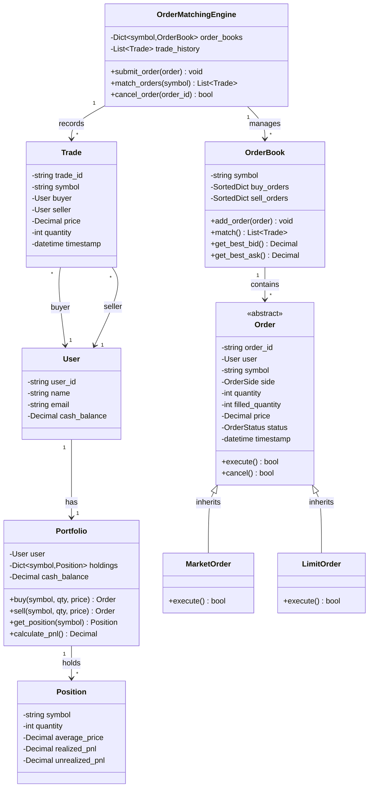

# Trading Platform - Low Level Design

## 1. Problem Statement

Design a Trading Platform that handles stock trading with order matching, portfolio management, real-time price updates, and transaction processing.

### Core Requirements

1. **Order Management**
   - Place buy/sell orders (Market, Limit, Stop-Loss)
   - Cancel orders
   - Modify orders
   - Order validation

2. **Order Matching Engine**
   - Match buy and sell orders
   - Price-time priority
   - Partial fills
   - Order book management

3. **Portfolio Management**
   - Track holdings
   - Calculate profit/loss
   - Buying power calculation
   - Position tracking

4. **Market Data**
   - Real-time price updates
   - Order book depth
   - Trade history
   - Market statistics

5. **Risk Management**
   - Margin requirements
   - Position limits
   - Circuit breakers
   - Risk checks

### Non-Functional Requirements

1. **Performance**
   - Sub-millisecond order matching
   - High throughput (100K+ orders/sec)
   - Low latency price updates

2. **Consistency**
   - ACID transactions
   - No double execution
   - Atomic order matching

3. **Availability**
   - 99.99% uptime
   - Fault tolerance
   - Data persistence

## 2. Order Types

```text
1. Market Order
   - Execute immediately at best available price
   - Guaranteed execution (if liquidity exists)
   - No price guarantee

2. Limit Order
   - Execute only at specified price or better
   - Price guarantee
   - No execution guarantee

3. Stop-Loss Order
   - Triggered when price reaches stop price
   - Becomes market order when triggered
   - Protects against losses
```

## 3. Class Diagram



## 4. Design Patterns Used

### 4.1 Strategy Pattern (Order Types)

**Purpose:** Different order execution strategies.

```python
class OrderStrategy(ABC):
    @abstractmethod
    def execute(self, order, order_book):
        pass

class MarketOrderStrategy(OrderStrategy):
    def execute(self, order, order_book):
        # Execute at best available price
        pass

class LimitOrderStrategy(OrderStrategy):
    def execute(self, order, order_book):
        # Execute only at limit price or better
        pass
```

### 4.2 Observer Pattern (Market Data)

**Purpose:** Notify subscribers of price updates.

```python
class MarketDataObserver(ABC):
    @abstractmethod
    def on_price_update(self, symbol, price):
        pass

    @abstractmethod
    def on_trade(self, trade):
        pass
```

### 4.3 Singleton Pattern (Matching Engine)

**Purpose:** Single matching engine instance.

### 4.4 Factory Pattern (Order Creation)

**Purpose:** Create different order types.

### 4.5 Command Pattern (Order Commands)

**Purpose:** Encapsulate order operations.

### 4.6 State Pattern (Order States)

**Purpose:** Manage order lifecycle states.

## 5. Order Matching Algorithm

### 5.1 Price-Time Priority

```python
def match_orders(buy_orders, sell_orders):
    """
    Match orders using price-time priority.
    
    Rules:
    1. Best price gets priority
    2. Same price: earlier time gets priority
    3. Match until no overlap between bid/ask
    
    Time Complexity: O(n log n) for sorting
    Space Complexity: O(n)
    """
    trades = []
    
    while buy_orders and sell_orders:
        best_buy = buy_orders.peek()  # Highest price
        best_sell = sell_orders.peek()  # Lowest price
        
        if best_buy.price < best_sell.price:
            break  # No match possible
        
        # Match at seller's price (more favorable)
        trade_price = best_sell.price
        trade_qty = min(best_buy.remaining_qty, best_sell.remaining_qty)
        
        # Create trade
        trade = Trade(
            buyer=best_buy.user,
            seller=best_sell.user,
            price=trade_price,
            quantity=trade_qty
        )
        trades.append(trade)
        
        # Update orders
        best_buy.filled_quantity += trade_qty
        best_sell.filled_quantity += trade_qty
        
        # Remove fully filled orders
        if best_buy.is_fully_filled():
            buy_orders.pop()
        if best_sell.is_fully_filled():
            sell_orders.pop()
    
    return trades
```

### 5.2 Order Book Structure

```text
Buy Orders (Descending Price):
Price    Qty    Time
------   ---    ----
$101.50  100    10:00:01
$101.00  200    10:00:02
$100.50  150    10:00:03

Sell Orders (Ascending Price):
Price    Qty    Time
------   ---    ----
$102.00  150    10:00:04
$102.50  100    10:00:05
$103.00  200    10:00:06

Spread = $102.00 - $101.50 = $0.50
```

## 6. Complexity Analysis

| Operation | Time Complexity | Space Complexity |
|-----------|----------------|------------------|
| Place Order | O(log n) | O(1) |
| Match Orders | O(n log n) | O(n) |
| Cancel Order | O(log n) | O(1) |
| Get Best Bid/Ask | O(1) | O(1) |
| Calculate P&L | O(m) | O(1) |

Where:

- n = number of orders in book
- m = number of positions

## 7. Real-World Applications

### 7.1 Stock Exchanges

- NYSE, NASDAQ
- Continuous order matching
- High-frequency trading

### 7.2 Cryptocurrency Exchanges

- Binance, Coinbase
- 24/7 trading
- Multiple trading pairs

### 7.3 Forex Trading

- Currency pair trading
- Leverage and margin

## 8. Summary

### Design Patterns (6)

1. **Strategy** - Order execution strategies
2. **Observer** - Market data updates
3. **Singleton** - Matching engine
4. **Factory** - Order creation
5. **Command** - Order operations
6. **State** - Order lifecycle

### Core Algorithms

1. **Price-Time Priority** - Order matching
2. **P&L Calculation** - Portfolio valuation
3. **Risk Management** - Position limits

### Key Features

✅ Multiple order types (Market, Limit, Stop-Loss)  
✅ Real-time order matching engine  
✅ Portfolio management with P&L tracking  
✅ Order book with price-time priority  
✅ Trade execution and history  
✅ Risk management and validation  

---

**Difficulty:** HARD (P3 - Medium Priority)  
**Category:** Financial  
**Estimated Implementation Time:** 6-8 hours  
**Lines of Code:** ~900-1100 (with comprehensive features)
