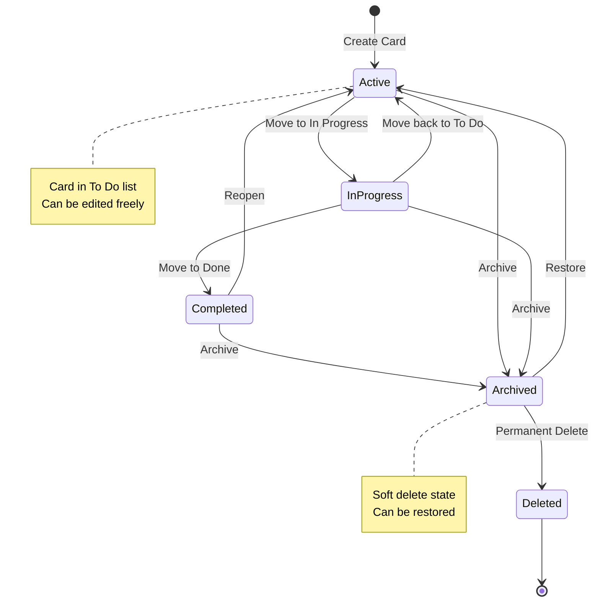

# Trello / Kanban Board System - Low Level Design

## 🔗 Implementation Links

- [Python Implementation](python/trello-kanban/main.py)
- [JavaScript Implementation](javascript/trello-kanban/main.js)

## Problem Statement

Design a comprehensive Kanban board system like Trello that enables teams to organize projects using boards, lists, and cards. The system should support drag-and-drop reordering, card customization with labels and due dates, file attachments, activity tracking, user permissions, real-time collaboration, and undo/redo functionality. Users should be able to create multiple boards, organize tasks in lists representing workflow stages, move cards between lists, collaborate with team members, and maintain a complete audit trail of all activities.

### Core Capabilities

1. **Board Management**: Create, update, and organize multiple boards for different projects
2. **List Organization**: Create lists representing workflow stages (To Do, In Progress, Done)
3. **Card Management**: Create, move, and customize task cards with rich metadata
4. **Drag & Drop**: Reorder cards within lists and move between lists
5. **Collaboration**: Multiple users can work on boards with role-based permissions
6. **Activity Tracking**: Complete audit log of all board activities

## Requirements

### Functional Requirements

- Create and manage multiple boards with customizable backgrounds
- Create lists within boards to represent workflow stages
- Create cards within lists with title, description, and metadata
- Drag and drop cards to reorder within lists
- Move cards between lists to track progress
- Add labels/tags to cards for categorization
- Set due dates and track card deadlines
- Add attachments (files, links) to cards
- Add comments to cards for discussions
- Assign members to cards for responsibility tracking
- Track activity history for boards, lists, and cards
- Implement undo/redo for operations
- Support board templates for quick setup
- Archive and restore boards, lists, and cards
- Search and filter cards across boards

### Non-Functional Requirements

- **Real-time Updates**: Changes visible to all users instantly via WebSockets
- **Performance**: Load boards with 100+ cards in <500ms
- **Concurrent Access**: Handle multiple users editing same board
- **Optimistic UI**: Show changes immediately, sync in background
- **Offline Support**: Queue operations when offline, sync when online
- **Scalability**: Support thousands of boards and users

## Design Decisions

### Key Classes

1. **Board**: Top-level container for project organization
2. **List**: Workflow stage containing cards
3. **Card**: Individual task or work item
4. **User**: System user with permissions
5. **ActivityLog**: Audit trail of all operations

### Design Patterns Used

1. **Composite Pattern**: Board contains Lists, List contains Cards (tree structure)
2. **Command Pattern**: All operations as commands for undo/redo functionality
3. **Observer Pattern**: Real-time updates when board state changes
4. **Memento Pattern**: Save and restore board states for undo
5. **Chain of Responsibility**: Permission checking chain
6. **Decorator Pattern**: Add features to cards (labels, attachments, comments)

### Key Features

- **Position-based Ordering**: Fractional indexing for efficient reordering
- **Optimistic Locking**: Version numbers to handle concurrent edits
- **Event Sourcing**: Store all changes as events for audit trail
- **WebSocket Updates**: Real-time synchronization across clients
- **Hierarchical Permissions**: Board → List → Card permission inheritance

## Class Diagram

```mermaid
classDiagram
    class Board {
        -String id
        -String name
        -String description
        -User owner
        -List~BoardList~ lists
        -List~User~ members
        -DateTime createdAt
        -DateTime updatedAt
        -BoardVisibility visibility
        +addList(list) void
        +removeList(listId) void
        +moveList(listId, position) void
        +addMember(user, role) void
        +removeMember(userId) void
        +getActivities() List~Activity~
    }

    class BoardList {
        -String id
        -String name
        -Board board
        -List~Card~ cards
        -double position
        -DateTime createdAt
        +addCard(card) void
        +removeCard(cardId) void
        +moveCard(cardId, position) void
        +getCardCount() int
    }

    class Card {
        -String id
        -String title
        -String description
        -BoardList list
        -double position
        -DateTime dueDate
        -List~Label~ labels
        -List~User~ assignedMembers
        -List~Attachment~ attachments
        -List~Comment~ comments
        -List~Checklist~ checklists
        -DateTime createdAt
        -DateTime updatedAt
        +addLabel(label) void
        +addAttachment(attachment) void
        +addComment(comment) void
        +assignMember(user) void
        +moveTo(list, position) void
    }

    class User {
        -String id
        -String name
        -String email
        -String avatarUrl
        +getId() String
        +getName() String
        +getEmail() String
    }

    class Label {
        -String id
        -String name
        -String color
        -Board board
        +getId() String
        +getName() String
        +getColor() String
    }

    class Attachment {
        -String id
        -String filename
        -String url
        -long size
        -User uploadedBy
        -DateTime uploadedAt
        +getFilename() String
        +getUrl() String
    }

    class Comment {
        -String id
        -String text
        -User author
        -Card card
        -DateTime createdAt
        -DateTime updatedAt
        +getText() String
        +getAuthor() User
    }

    class Checklist {
        -String id
        -String title
        -List~ChecklistItem~ items
        +addItem(item) void
        +getProgress() double
    }

    class ChecklistItem {
        -String id
        -String text
        -boolean completed
        +toggle() void
        +isCompleted() boolean
    }

    class Activity {
        -String id
        -ActivityType type
        -User user
        -String entityId
        -String description
        -DateTime timestamp
        -Map metadata
        +getDescription() String
        +getTimestamp() DateTime
    }

    class ActivityType {
        <<enumeration>>
        BOARD_CREATED
        LIST_ADDED
        LIST_MOVED
        CARD_CREATED
        CARD_MOVED
        CARD_ARCHIVED
        MEMBER_ADDED
        COMMENT_ADDED
    }

    class BoardVisibility {
        <<enumeration>>
        PRIVATE
        TEAM
        PUBLIC
    }

    class Permission {
        -User user
        -Role role
        -Board board
        +canView() boolean
        +canEdit() boolean
        +canDelete() boolean
    }

    class Role {
        <<enumeration>>
        OWNER
        ADMIN
        MEMBER
        OBSERVER
    }

    class Command {
        <<interface>>
        +execute() void
        +undo() void
        +getDescription() String
    }

    class CreateCardCommand {
        -BoardList list
        -Card card
        +execute() void
        +undo() void
    }

    class MoveCardCommand {
        -Card card
        -BoardList fromList
        -BoardList toList
        -double oldPosition
        -double newPosition
        +execute() void
        +undo() void
    }

    class UpdateCardCommand {
        -Card card
        -CardMemento oldState
        -CardMemento newState
        +execute() void
        +undo() void
    }

    class DeleteCardCommand {
        -Card card
        -BoardList list
        -double position
        +execute() void
        +undo() void
    }

    class CommandHistory {
        -Stack~Command~ undoStack
        -Stack~Command~ redoStack
        +executeCommand(command) void
        +undo() void
        +redo() void
        +canUndo() boolean
        +canRedo() boolean
    }

    class CardMemento {
        -String title
        -String description
        -DateTime dueDate
        -List~Label~ labels
        +restore(card) void
        +createFrom(card) CardMemento
    }

    class BoardObserver {
        <<interface>>
        +onBoardUpdated(board) void
        +onListAdded(list) void
        +onCardMoved(card) void
    }

    class WebSocketNotifier {
        -Map~String, WebSocket~ connections
        +onBoardUpdated(board) void
        +onListAdded(list) void
        +onCardMoved(card) void
        -notifyClients(event) void
    }

    class ActivityLogger {
        -List~Activity~ activities
        +onBoardUpdated(board) void
        +onListAdded(list) void
        +onCardMoved(card) void
        +logActivity(activity) void
    }

    class PermissionChecker {
        -PermissionChecker next
        +setNext(checker) void
        +checkPermission(user, resource, action) boolean
    }

    class BoardPermissionChecker {
        +checkPermission(user, resource, action) boolean
    }

    class ListPermissionChecker {
        +checkPermission(user, resource, action) boolean
    }

    class CardPermissionChecker {
        +checkPermission(user, resource, action) boolean
    }

    class CardDecorator {
        <<abstract>>
        -Card card
        +addLabel(label) void
        +addAttachment(attachment) void
    }

    class LabelDecorator {
        -List~Label~ labels
        +addLabel(label) void
        +getLabels() List~Label~
    }

    class AttachmentDecorator {
        -List~Attachment~ attachments
        +addAttachment(attachment) void
        +getAttachments() List~Attachment~
    }

    class BoardService {
        -Map~String, Board~ boards
        -CommandHistory commandHistory
        -List~BoardObserver~ observers
        -PermissionChecker permissionChecker
        +createBoard(name, owner) Board
        +createList(boardId, name) BoardList
        +createCard(listId, title) Card
        +moveCard(cardId, listId, position) void
        +addLabelToCard(cardId, label) void
        +undo() void
        +redo() void
        +addObserver(observer) void
    }

    Board "1" *-- "many" BoardList : contains
    BoardList "1" *-- "many" Card : contains
    Card "1" *-- "many" Label : has
    Card "1" *-- "many" Attachment : has
    Card "1" *-- "many" Comment : has
    Card "1" *-- "many" Checklist : has
    Checklist "1" *-- "many" ChecklistItem : contains
    Board "1" *-- "many" User : members
    Card "many" -- "many" User : assigned
    Activity --> User
    Activity --> ActivityType
    Board --> BoardVisibility
    Permission --> User
    Permission --> Board
    Permission --> Role
    Command <|.. CreateCardCommand
    Command <|.. MoveCardCommand
    Command <|.. UpdateCardCommand
    Command <|.. DeleteCardCommand
    CommandHistory --> Command
    CardMemento --> Card
    BoardObserver <|.. WebSocketNotifier
    BoardObserver <|.. ActivityLogger
    PermissionChecker <|-- BoardPermissionChecker
    PermissionChecker <|-- ListPermissionChecker
    PermissionChecker <|-- CardPermissionChecker
    CardDecorator <|-- LabelDecorator
    CardDecorator <|-- AttachmentDecorator
    CardDecorator --> Card
    BoardService --> Board
    BoardService --> CommandHistory
    BoardService --> BoardObserver
    BoardService --> PermissionChecker
```



## Usage Example

```python
# Create board service
board_service = BoardService()

# Add observers
ws_notifier = WebSocketNotifier()
activity_logger = ActivityLogger()
board_service.add_observer(ws_notifier)
board_service.add_observer(activity_logger)

# Create board
owner = User("user_1", "Alice", "alice@example.com")
board = board_service.create_board("Project Alpha", owner)

# Add members
bob = User("user_2", "Bob", "bob@example.com")
board_service.add_member(board.get_id(), bob, Role.MEMBER)

# Create lists
todo_list = board_service.create_list(board.get_id(), "To Do")
in_progress_list = board_service.create_list(board.get_id(), "In Progress")
done_list = board_service.create_list(board.get_id(), "Done")

# Create cards
card1 = board_service.create_card(todo_list.get_id(), "Implement authentication")
card1.set_description("Add OAuth 2.0 authentication")
card1.set_due_date(datetime.now() + timedelta(days=7))

card2 = board_service.create_card(todo_list.get_id(), "Design database schema")

# Add labels
label_urgent = Label("label_1", "Urgent", "#FF0000", board)
board_service.add_label_to_card(card1.get_id(), label_urgent)

# Assign members
board_service.assign_member_to_card(card1.get_id(), bob)

# Add comment
comment = Comment("comment_1", "Let's use Auth0 for this", owner, card1)
board_service.add_comment(card1.get_id(), comment)

# Move card
board_service.move_card(card1.get_id(), in_progress_list.get_id(), 1.0)

# Undo last operation
board_service.undo()

# Redo
board_service.redo()

# Get activity log
activities = board.get_activities()
for activity in activities:
    print(f"{activity.get_timestamp()}: {activity.get_description()}")
```

## Business Rules

1. **Board Ownership**: Only board owner can delete board or change ownership
2. **List Ordering**: Lists ordered by position (fractional indexing for efficiency)
3. **Card Position**: Cards use fractional indexing for O(1) reordering
4. **Permission Hierarchy**: Board permissions cascade to lists and cards
5. **Archive vs Delete**: Cards/lists archived by default, permanently deleted after 30 days
6. **Member Limits**: Free boards limited to 10 members, unlimited for premium
7. **Attachment Size**: Max 10MB per file, 100MB total per board
8. **Activity Retention**: Activities stored for 90 days
9. **Concurrent Edits**: Last-write-wins with conflict notification
10. **Undo Limit**: Maximum 50 operations in undo stack

## Fractional Indexing Algorithm

```text
Position Calculation for Reordering:

When inserting card between positions A and B:
new_position = (A + B) / 2

Example:
Cards with positions: [1.0, 2.0, 3.0]
Insert between 1.0 and 2.0:
new_position = (1.0 + 2.0) / 2 = 1.5

Result: [1.0, 1.5, 2.0, 3.0]

Benefits:
- O(1) insertion (no need to update other positions)
- Efficient database updates (single row)
- Handles frequent reordering

Edge Case: Position too close (difference < epsilon)
Solution: Rebalance positions when gap < 0.001
  - Assign positions: 1.0, 2.0, 3.0, ... N.0

Time Complexity: O(1) for insertion, O(n) for rebalancing
Space Complexity: O(1)
```

## Permission System

```text
Permission Check Flow (Chain of Responsibility):

Request: Can user Bob edit Card X?

1. BoardPermissionChecker
   - Check if Bob is board member
   - Check board-level role (OWNER/ADMIN/MEMBER/OBSERVER)
   - If OBSERVER → DENY
   - If MEMBER/ADMIN/OWNER → Continue to next checker

2. ListPermissionChecker
   - Check if list has specific restrictions
   - Check if Bob has list-level permissions
   - If blocked → DENY
   - Otherwise → Continue to next checker

3. CardPermissionChecker
   - Check if card has specific restrictions
   - Check if Bob is assigned to card
   - If card is locked and Bob not assigned → DENY
   - Otherwise → ALLOW

Default: If no restrictions at any level → ALLOW for MEMBER role

Time Complexity: O(k) where k is number of checkers (constant)
```

## State Diagram



## Extension Points

1. **Power-Ups/Plugins**: Extensible plugin system for third-party integrations
2. **Custom Fields**: User-defined fields on cards (dropdowns, numbers, dates)
3. **Automation**: Butler-style automation rules (when X happens, do Y)
4. **Card Templates**: Predefined card structures for common tasks
5. **Gantt View**: Timeline view of cards with dependencies
6. **Calendar View**: Calendar visualization of cards by due date
7. **Sprint Planning**: Agile sprint management with burndown charts
8. **Time Tracking**: Log time spent on cards, generate reports
9. **Voting System**: Team members vote on card priority
10. **Card Dependencies**: Link cards with blocking/blocked relationships
11. **Board Sync**: Mirror cards across multiple boards
12. **Email Integration**: Create cards from emails
13. **Slack Integration**: Notifications and commands via Slack
14. **Export/Import**: Export boards to JSON, import from other tools

## Security Considerations

1. **Authentication**: OAuth 2.0 for secure login, support SSO
2. **Authorization**: RBAC with board-level and card-level permissions
3. **Data Encryption**: Encrypt sensitive data at rest and in transit
4. **API Rate Limiting**: Prevent abuse with per-user rate limits
5. **CSRF Protection**: Tokens for all state-changing operations
6. **XSS Prevention**: Sanitize all user-generated content
7. **SQL Injection**: Use parameterized queries
8. **File Upload Security**: Validate file types, scan for malware
9. **Audit Logging**: Log all security-relevant events
10. **Session Management**: Secure session tokens, automatic timeout

## Time Complexity

- **Create Board/List/Card**: O(1)
- **Move Card**: O(1) with fractional indexing
- **Reorder (rebalance)**: O(n) where n is cards in list
- **Search Cards**: O(m) where m is total cards (can use indexing)
- **Get Activity Log**: O(k) where k is activities (paginated)
- **Permission Check**: O(d) where d is depth of chain (constant)
- **Undo/Redo**: O(1) for stack operations

## Space Complexity

- **Board Storage**: O(b) where b is number of boards
- **Card Storage**: O(c) where c is total cards
- **Activity Log**: O(a) where a is activities (with retention policy)
- **Undo Stack**: O(u) where u is undo limit (typically 50)
- **Overall System**: O(b + c + a + u)

## Real-time Collaboration

```text
WebSocket Event Flow:

Client A: Move card from "To Do" to "In Progress"
  ↓
1. Optimistic UI Update (instant feedback)
  ↓
2. Send WebSocket message to server
  ↓
3. Server validates and executes command
  ↓
4. Server broadcasts event to all connected clients
  ↓
5. Client B receives event and updates UI
  ↓
6. Client A receives confirmation (or rollback if failed)

Conflict Resolution:
- Use optimistic locking with version numbers
- If version mismatch → notify user of conflict
- User can choose: Keep mine, Take theirs, or Merge

Event Types:
- board.updated
- list.added, list.moved, list.archived
- card.created, card.moved, card.updated
- comment.added
- member.assigned

Message Format:
{
  "event": "card.moved",
  "data": {
    "cardId": "card_123",
    "fromListId": "list_1",
    "toListId": "list_2",
    "position": 1.5,
    "timestamp": "2025-01-01T12:00:00Z",
    "userId": "user_1"
  }
}
```

## Performance Optimization

1. **Lazy Loading**: Load cards on-demand when list is opened
2. **Virtual Scrolling**: Render only visible cards in viewport
3. **Caching**: Cache board structure in Redis
4. **Database Indexing**: Index on board_id, list_id, position
5. **CDN**: Serve static assets (attachments) from CDN
6. **Pagination**: Paginate activity log and comments
7. **Debouncing**: Debounce card title edits before saving
8. **Connection Pooling**: Reuse database connections
9. **Compression**: Gzip WebSocket messages
10. **Batch Updates**: Batch multiple DB operations in transaction

## Testing Considerations

1. **Unit Tests**: Test each command's execute/undo independently
2. **Integration Tests**: Test board service with all components
3. **Concurrency Tests**: Simulate multiple users editing same board
4. **Permission Tests**: Verify all role combinations
5. **Real-time Tests**: Test WebSocket message delivery
6. **Performance Tests**: Load test with 1000+ cards
7. **Undo/Redo Tests**: Test complex undo/redo sequences

