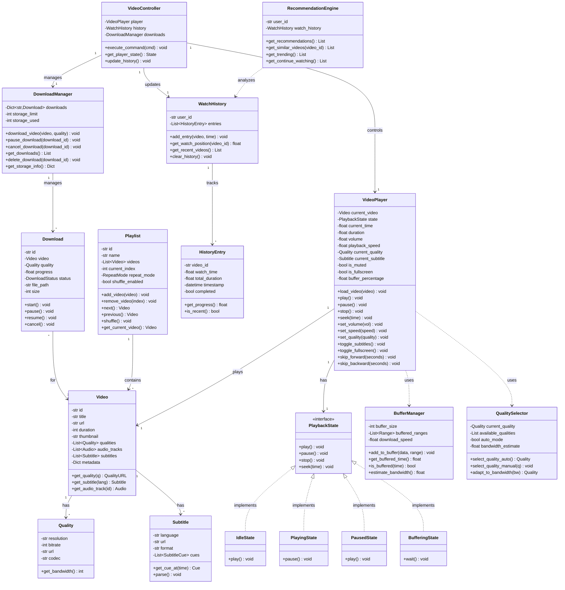

# Video Player System - Low Level Design

## Table of Contents

- [Overview](#overview)
- [Requirements](#requirements)
  - [Functional Requirements](#functional-requirements)
  - [Non-Functional Requirements](#non-functional-requirements)
- [Core Use Cases](#core-use-cases)
- [Design Patterns Used](#design-patterns-used)
- [Class Diagram](#class-diagram)
- [Component Design](#component-design)
- [Data Structures](#data-structures)
- [API Design](#api-design)
- [Implementation Details](#implementation-details)
- [Business Rules](#business-rules)
- [Extension Points](#extension-points)
- [Complexity Analysis](#complexity-analysis)
- [Trade-offs and Design Decisions](#trade-offs-and-design-decisions)

## Overview

A Video Player System is a media application (like YouTube, Netflix player, VLC) that enables users to watch videos with rich playback controls, quality selection, subtitles, and playlist management. The system supports adaptive streaming, offline playback, and personalized recommendations.

### Key Features

- **Playback Controls**: Play, pause, stop, seek, skip, replay
- **Quality Selection**: Auto, 360p, 480p, 720p, 1080p, 4K, 8K
- **Speed Control**: 0.25x to 2x playback speed
- **Audio/Subtitles**: Multiple audio tracks, subtitle support (SRT, VTT)
- **Advanced Features**: Picture-in-picture, fullscreen, loop, shuffle
- **Streaming**: Adaptive bitrate streaming (HLS, DASH)
- **Buffering**: Pre-buffering, progressive download
- **Offline Mode**: Download for offline viewing
- **Watch History**: Track viewing progress, resume playback
- **Playlists**: Create, manage, auto-play next video

## Requirements

### Functional Requirements

1. **Video Playback**
   - Play/pause/stop video
   - Seek to specific timestamp
   - Skip forward/backward (10s, 30s)
   - Replay from beginning
   - Resume from last position

2. **Quality Management**
   - Select video quality manually
   - Auto-quality based on bandwidth
   - Smooth quality transitions
   - Display current quality

3. **Speed Control**
   - Adjust playback speed (0.25x to 2x)
   - Maintain audio pitch at different speeds
   - Display current speed

4. **Audio and Subtitles**
   - Switch between audio tracks
   - Enable/disable subtitles
   - Select subtitle language
   - Adjust subtitle size and position
   - Subtitle synchronization

5. **Volume Control**
   - Adjust volume (0-100%)
   - Mute/unmute
   - Remember volume preference

6. **View Modes**
   - Theater mode
   - Fullscreen mode
   - Picture-in-picture (PiP)
   - Mini player

7. **Playlist Management**
   - Create playlists
   - Add/remove videos
   - Reorder playlist
   - Auto-play next video
   - Shuffle and repeat modes

8. **Watch History**
   - Track viewing progress
   - Save watch position
   - View watch history
   - Resume from last position

9. **Offline Viewing**
   - Download videos for offline
   - Manage downloaded content
   - Quality selection for downloads
   - Storage management

10. **Recommendations**
    - Suggest similar videos
    - Continue watching
    - Trending and popular
    - Personalized feed

### Non-Functional Requirements

1. **Performance**
   - Low latency (<100ms)
   - Smooth playback (no stuttering)
   - Fast seeking (<500ms)
   - Efficient buffering

2. **Streaming**
   - Adaptive bitrate streaming
   - Minimal buffering events
   - Handle network changes gracefully
   - Support live streaming

3. **Scalability**
   - Support concurrent users
   - Handle large video libraries
   - CDN integration

4. **Compatibility**
   - Multiple video formats (MP4, WebM, MKV)
   - Cross-platform support
   - Mobile and desktop

5. **Usability**
   - Intuitive controls
   - Keyboard shortcuts
   - Touch gestures (mobile)
   - Accessibility features

## Core Use Cases

### Use Case 1: Watch Video

```text
Actor: Viewer
Precondition: Video is available

Main Flow:
1. User selects video to watch
2. System loads video and shows player
3. System resumes from last position (if available)
4. User clicks play
5. System starts playback with auto-quality
6. User watches video
7. System tracks watch progress
8. System saves position on close

Alternative Flow:
- User seeks to different timestamp
- User changes quality manually
- User enables subtitles
- User adjusts playback speed
```

### Use Case 2: Create Playlist

```text
Actor: Viewer
Precondition: User is logged in

Main Flow:
1. User creates new playlist
2. User names playlist
3. User adds videos to playlist
4. System saves playlist
5. User plays playlist
6. System auto-plays videos in sequence

Alternative Flow:
- User reorders playlist items
- User removes videos from playlist
- User sets playlist to shuffle/repeat
```

### Use Case 3: Download for Offline

```text
Actor: Viewer
Precondition: User has download permission

Main Flow:
1. User selects video to download
2. User chooses quality for download
3. System queues download
4. System downloads video in background
5. System notifies on completion
6. User watches offline

Alternative Flow:
- Download fails (network error)
- User pauses/resumes download
- User deletes downloaded video
```

## Design Patterns Used

### 1. State Pattern

- **Purpose**: Manage playback states
- **Usage**: Playing, Paused, Stopped, Buffering, Error states
- **Benefit**: Clean state transitions and behavior isolation

### 2. Strategy Pattern

- **Purpose**: Different quality and streaming strategies
- **Usage**: QualitySelectionStrategy, StreamingStrategy (HLS, DASH)
- **Benefit**: Easy to add new formats and strategies

### 3. Observer Pattern

- **Purpose**: Notify UI and components of changes
- **Usage**: Progress updates, quality changes, buffering events
- **Benefit**: Decoupled components, reactive updates

### 4. Command Pattern

- **Purpose**: Encapsulate playback commands
- **Usage**: Play, Pause, Seek, ChangeQuality commands
- **Benefit**: Undo/redo, command history, remote control

### 5. Singleton Pattern

- **Purpose**: Single player instance
- **Usage**: VideoPlayer, DownloadManager, HistoryManager
- **Benefit**: Centralized state management

### 6. Factory Pattern

- **Purpose**: Create appropriate decoders and parsers
- **Usage**: VideoDecoderFactory, SubtitleParserFactory
- **Benefit**: Encapsulated creation logic

### 7. Decorator Pattern

- **Purpose**: Add effects and filters
- **Usage**: Video filters (brightness, contrast), subtitle overlays
- **Benefit**: Dynamic feature addition

### 8. Proxy Pattern

- **Purpose**: Control access to video resources
- **Usage**: BufferingProxy, CachingProxy for streaming
- **Benefit**: Lazy loading, caching, access control

### 9. Adapter Pattern

- **Purpose**: Adapt different video formats
- **Usage**: Format adapters for MP4, WebM, MKV
- **Benefit**: Uniform interface for different formats

## Class Diagram



## Component Design

### 1. Video Component

```python
class Video:
    """
    Represents a video with metadata and available qualities.
    
    Usage:
        video = Video("v123", "Tutorial", "https://cdn.com/video.mp4", 3600)
        quality_720p = video.get_quality("720p")
        subtitle = video.get_subtitle("en")
    
    Returns:
        Video: Video instance with full metadata
    """
    - id: Unique video identifier
    - title: Video title
    - url: Base URL or manifest URL
    - duration: Total duration in seconds
    - thumbnail: Thumbnail image URL
    - qualities: Available quality options
    - audio_tracks: Available audio tracks
    - subtitles: Available subtitle tracks
    - metadata: Additional info (description, tags, views, likes)
```

### 2. VideoPlayer Component

```python
class VideoPlayer:
    """
    Main video player managing playback and controls.
    
    Usage:
        player = VideoPlayer()
        player.load_video(video)
        player.play()
        player.seek(120)  # Seek to 2:00
        player.set_quality("1080p")
    
    Returns:
        VideoPlayer: Player instance with full control
    """
    - Manages playback state (playing, paused, buffering)
    - Handles user controls (play, pause, seek, volume)
    - Tracks current position and duration
    - Manages quality selection
    - Handles subtitle display
    - Implements fullscreen and PiP modes
```

### 3. BufferManager Component

```python
class BufferManager:
    """
    Manages video buffering and streaming.
    
    Usage:
        buffer_mgr = BufferManager(buffer_size=30)
        buffer_mgr.add_to_buffer(data, Range(0, 1024))
        is_buffered = buffer_mgr.is_buffered(current_time)
    
    Returns:
        BufferManager: Manager for buffering operations
    """
    - Maintains buffer of downloaded video segments
    - Tracks buffered time ranges
    - Estimates download speed
    - Predicts buffering needs
    - Implements adaptive buffering
```

### 4. Playlist Component

```python
class Playlist:
    """
    Manages video playlist with playback order.
    
    Usage:
        playlist = Playlist("My Playlist")
        playlist.add_video(video1)
        playlist.add_video(video2)
        playlist.shuffle()
        next_video = playlist.next()
    
    Returns:
        Playlist: Playlist with video management
    """
    - Stores ordered list of videos
    - Manages current playback position
    - Implements repeat modes (OFF, ONE, ALL)
    - Supports shuffle
    - Auto-advance to next video
```

### 5. WatchHistory Component

```python
class WatchHistory:
    """
    Tracks user's viewing history and progress.
    
    Usage:
        history = WatchHistory("user_123")
        history.add_entry(video, watch_time=1200)
        position = history.get_watch_position(video_id)
        recent = history.get_recent_videos()
    
    Returns:
        WatchHistory: History tracker with resume capability
    """
    - Records watched videos and positions
    - Enables resume from last position
    - Tracks completion status
    - Provides recently watched list
    - Calculates watch progress
```

## Data Structures

### 1. Segment Tree (for Buffered Ranges)

```text
Purpose: Efficiently track buffered video segments
Structure: Interval tree or range list
Operations:
  - Add range: O(log N)
  - Query range: O(log N)
  - Merge overlapping: O(N)

Usage: Track which parts of video are buffered
```

### 2. Priority Queue (for Download Queue)

```text
Purpose: Manage download priorities
Structure: Heap-based priority queue
Operations:
  - Insert: O(log N)
  - Extract max: O(log N)
  - Update priority: O(log N)

Usage: Prioritize downloads by user preference
```

### 3. LRU Cache (for Metadata)

```text
Purpose: Cache video metadata and thumbnails
Structure: HashMap + Doubly Linked List
Operations:
  - Get: O(1)
  - Put: O(1)
  - Evict LRU: O(1)

Usage: Fast access to frequently accessed metadata
```

### 4. Ring Buffer (for Streaming)

```text
Purpose: Continuous buffer for live streaming
Structure: Circular array
Operations:
  - Write: O(1)
  - Read: O(1)
  - Overwrite old: O(1)

Usage: Efficient memory use for live streams
```

## API Design

### Playback Control APIs

```python
# Core Playback
load_video(video_id: str) -> Video
    """Load video and prepare for playback"""
    
play() -> None
    """Start or resume playback"""
    
pause() -> None
    """Pause playback"""
    
stop() -> None
    """Stop playback and reset"""
    
seek(time: float) -> None
    """Seek to specific time in seconds"""
    
skip_forward(seconds: int) -> None
    """Skip forward by N seconds"""
    
skip_backward(seconds: int) -> None
    """Skip backward by N seconds"""

# Volume Control
set_volume(volume: float) -> None
    """Set volume (0.0 to 1.0)"""
    
mute() -> None
    """Mute audio"""
    
unmute() -> None
    """Unmute audio"""

# Speed Control
set_playback_speed(speed: float) -> None
    """Set playback speed (0.25x to 2.0x)"""
    
get_playback_speed() -> float
    """Get current playback speed"""

# Quality Management
set_quality(quality: str) -> None
    """Set video quality manually"""
    
enable_auto_quality() -> None
    """Enable adaptive quality selection"""
    
get_available_qualities() -> List[Quality]
    """Get list of available qualities"""

# Subtitles
enable_subtitles(language: str) -> None
    """Enable subtitles in specified language"""
    
disable_subtitles() -> None
    """Disable subtitles"""
    
get_available_subtitles() -> List[Subtitle]
    """Get list of available subtitle tracks"""

# View Modes
toggle_fullscreen() -> None
    """Toggle fullscreen mode"""
    
enable_pip() -> None
    """Enable picture-in-picture mode"""
    
disable_pip() -> None
    """Disable picture-in-picture mode"""

# State Query
get_current_time() -> float
    """Get current playback time"""
    
get_duration() -> float
    """Get total video duration"""
    
get_buffered_percentage() -> float
    """Get buffer percentage (0-1)"""
    
is_playing() -> bool
    """Check if video is currently playing"""
    
get_player_state() -> PlayerState
    """Get current player state"""
```

### Playlist APIs

```python
# Playlist Management
create_playlist(name: str) -> Playlist
    """Create a new playlist"""
    
add_to_playlist(playlist_id: str, video_id: str) -> bool
    """Add video to playlist"""
    
remove_from_playlist(playlist_id: str, index: int) -> bool
    """Remove video at index from playlist"""
    
reorder_playlist(playlist_id: str, old_index: int, new_index: int) -> bool
    """Reorder videos in playlist"""

# Playback Control
play_playlist(playlist_id: str, start_index: int = 0) -> None
    """Play playlist from specified index"""
    
next_in_playlist() -> Video
    """Play next video in playlist"""
    
previous_in_playlist() -> Video
    """Play previous video in playlist"""
    
set_repeat_mode(mode: RepeatMode) -> None
    """Set repeat mode (OFF, ONE, ALL)"""
    
toggle_shuffle() -> None
    """Toggle shuffle mode"""
```

### Download APIs

```python
# Download Management
download_video(video_id: str, quality: str) -> Download
    """Queue video for download"""
    
pause_download(download_id: str) -> None
    """Pause an active download"""
    
resume_download(download_id: str) -> None
    """Resume a paused download"""
    
cancel_download(download_id: str) -> None
    """Cancel and delete download"""
    
get_downloads() -> List[Download]
    """Get all downloads"""
    
get_download_progress(download_id: str) -> float
    """Get download progress (0-1)"""
    
get_storage_info() -> Dict
    """Get storage usage information"""
```

### History APIs

```python
# Watch History
save_watch_position(video_id: str, time: float) -> None
    """Save current watch position"""
    
get_watch_position(video_id: str) -> float
    """Get last watch position for video"""
    
get_watch_history(limit: int = 50) -> List[HistoryEntry]
    """Get recent watch history"""
    
get_continue_watching() -> List[Video]
    """Get videos to continue watching"""
    
clear_history() -> None
    """Clear watch history"""
```

## Implementation Details

### 1. Adaptive Streaming (ABR)

```python
class AdaptiveBitrateController:
    """
    Controls quality based on network conditions.
    
    Algorithm:
        1. Measure download speed
        2. Estimate available bandwidth
        3. Predict future bandwidth
        4. Select appropriate quality
        5. Switch quality smoothly
    
    Complexity: O(1) per decision
    """
    
    def select_quality(self) -> Quality:
        bandwidth = self.estimate_bandwidth()
        buffer_level = self.get_buffer_level()
        
        # Conservative approach: require 1.5x bandwidth
        for quality in sorted(self.qualities, reverse=True):
            if bandwidth >= quality.bitrate * 1.5:
                if buffer_level > 10:  # 10 seconds buffer
                    return quality
        
        # Fallback to lowest quality
        return self.qualities[0]
```

### 2. Buffering Strategy

```text
Algorithm:
1. Start with initial buffer (5-10 seconds)
2. Continuously download ahead
3. Monitor buffer level
4. Pause download if buffer full
5. Resume if buffer below threshold
6. Handle network interruptions gracefully

Buffer States:
- EMPTY: Buffer level < 2s → Enter buffering state
- LOW: Buffer level < 10s → Download high priority
- NORMAL: Buffer level 10-30s → Normal download
- FULL: Buffer level > 30s → Pause download

Complexity: O(1) per buffer check
```

### 3. Seek Operation

```text
Algorithm:
1. User requests seek to time T
2. Pause current playback
3. Calculate segment containing time T
4. Check if segment is buffered
5. If buffered: Jump to T immediately
6. If not buffered:
   a. Enter buffering state
   b. Request segment from server
   c. Download segment
   d. Resume playback at T
7. Update UI

Complexity: O(log N) to find segment, O(1) for local seek
```

### 4. Subtitle Synchronization

```python
def get_subtitle_at_time(time: float) -> Optional[str]:
    """
    Get subtitle text for current time.
    
    Algorithm:
        1. Binary search in sorted subtitle cues
        2. Find cue where start <= time <= end
        3. Return text if found
    
    Complexity: O(log N) where N = number of cues
    """
    left, right = 0, len(self.cues) - 1
    
    while left <= right:
        mid = (left + right) // 2
        cue = self.cues[mid]
        
        if cue.start_time <= time <= cue.end_time:
            return cue.text
        elif time < cue.start_time:
            right = mid - 1
        else:
            left = mid + 1
    
    return None
```

### 5. Quality Switching

```text
Algorithm:
1. User or ABR selects new quality
2. Note current playback time
3. Start buffering new quality stream
4. Continue playing current quality
5. When new quality buffered:
   a. Seamlessly switch at segment boundary
   b. Update quality indicator
6. Resume normal playback

Seamless Switching:
- Use GOP (Group of Pictures) boundaries
- Pre-buffer 2-3 seconds of new quality
- Switch at keyframe
- No playback interruption

Complexity: O(1) switch decision, O(N) buffer download
```

## Business Rules

### Rule 1: Auto-Save Watch Position

```text
Trigger: Every 10 seconds during playback or on pause/stop
Action: Save current time to watch history
Rationale: Enable resume from last position
Exception: Don't save for previews or trailers < 1 minute
```

### Rule 2: Quality Selection Constraints

```text
Bandwidth-Quality Mapping:
- < 1 Mbps: 360p max
- 1-3 Mbps: 480p max
- 3-5 Mbps: 720p max
- 5-10 Mbps: 1080p max
- > 10 Mbps: 4K allowed

Rationale: Prevent buffering, ensure smooth playback
Override: User can manually select lower quality
```

### Rule 3: Buffer Thresholds

```text
Minimum Buffer: 2 seconds before playback starts
Target Buffer: 30 seconds during playback
Low Buffer Warning: Show warning at 5 seconds
Buffering State: Enter if buffer < 2 seconds

Rationale: Balance startup time and smooth playback
```

### Rule 4: Download Limits

```text
Concurrent Downloads: Maximum 3 simultaneous
Storage Limit: Configurable (default 10GB)
Quality Priority: Allow downloads in any quality
Expiration: Downloaded videos expire after 30 days

Rationale: Manage bandwidth and storage effectively
```

### Rule 5: Playlist Auto-Advance

```text
Conditions for Auto-Play Next:
- Video completed (> 95% watched)
- Playlist has next video
- User hasn't disabled auto-play
- Wait 5 seconds before advancing (can cancel)

Rationale: Seamless binge-watching experience
```

### Rule 6: Subtitle Display Rules

```text
Position: Bottom center, 10% from bottom
Size: Responsive to video size
Style: White text with black outline
Duration: Show exact timing from SRT/VTT file
Overlap: Handle overlapping subtitles (show both)

Rationale: Readability across all video content
```

## Extension Points

### 1. New Video Codecs

```python
class VideoCodecAdapter:
    """
    Add support for new video codecs.
    
    Example: AV1, VP9, HEVC
    Implementation: Implement decode() method
    Registration: Register with DecoderFactory
    """
```

### 2. Live Streaming

```python
class LiveStreamManager:
    """
    Support for live streaming protocols.
    
    Protocols: RTMP, WebRTC, HLS Live
    Features: Low latency mode, live DVR, live chat
    Implementation: Continuous buffer refresh
    """
```

### 3. VR/360° Video

```python
class VRVideoPlayer:
    """
    Support for 360° and VR video playback.
    
    Features:
    - Gyroscope control
    - Touch to pan
    - VR headset support (split-screen)
    - Spatial audio
    """
```

### 4. Social Features

```python
class SocialManager:
    """
    Social viewing features.
    
    Features:
    - Watch parties (synchronized playback)
    - Comments and reactions
    - Share timestamps
    - Collaborative playlists
    """
```

### 5. Analytics Integration

```python
class VideoAnalytics:
    """
    Track viewing metrics and behavior.
    
    Metrics:
    - View count, watch time
    - Drop-off points
    - Quality selection patterns
    - Device and location data
    """
```

## Complexity Analysis

### Time Complexity

| Operation | Complexity | Notes |
|-----------|------------|-------|
| load_video | O(1) | Load metadata only |
| play/pause | O(1) | State transition |
| seek | O(log N) | Find segment in buffer |
| set_quality | O(1) | Mark for switch |
| enable_subtitles | O(log N) | Binary search for cue |
| add_to_playlist | O(1) | Append to list |
| next_video | O(1) | Index increment |
| search_history | O(N) | Linear scan |
| recommend | O(N log N) | Similarity calculation |

### Space Complexity

| Component | Complexity | Notes |
|-----------|------------|-------|
| Video buffer | O(B) | B = buffer size (MB) |
| Playlist | O(P) | P = videos in playlist |
| Watch history | O(H) | H = history entries |
| Downloaded videos | O(D × S) | D = downloads, S = avg size |
| Subtitle cues | O(C) | C = number of cues |
| Total | O(B + P + H + D×S + C) | Dominated by video buffer |

## Trade-offs and Design Decisions

### 1. Adaptive vs. Fixed Quality

**Decision:** Default to adaptive with manual override

| Aspect | Adaptive | Fixed |
|--------|----------|-------|
| User Experience | Smooth, no buffering | Consistent quality |
| Bandwidth | Efficient | Can waste or starve |
| Control | Automatic | User controlled |
| Complexity | Higher | Lower |

**Rationale:** Adaptive provides better overall experience; manual for power users.

### 2. Buffering Strategy Decision

**Decision:** Progressive buffering with adaptive target

| Strategy | Startup Time | Memory | Smoothness |
|----------|--------------|--------|------------|
| Minimal buffer (2s) | Fast | Low | Risky |
| Large buffer (60s) | Slow | High | Very smooth |
| Adaptive (10-30s) | Medium | Medium | Good |

**Rationale:** Balance between quick start and smooth playback.

### 3. Download Storage

**Decision:** Local storage with LRU eviction

| Approach | Pros | Cons |
|----------|------|------|
| Unlimited | User freedom | Storage issues |
| Fixed limit (10GB) | Predictable | May be insufficient |
| LRU eviction | Automatic management | May delete wanted content |

**Rationale:** Fixed limit with LRU provides good UX and resource management.

### 4. Subtitle Rendering

**Decision:** Native rendering with custom styling

| Approach | Quality | Performance | Flexibility |
|----------|---------|-------------|-------------|
| Burned-in | Best | N/A | None |
| Native | Good | Fast | High |
| Canvas overlay | Variable | Medium | Very High |

**Rationale:** Native rendering is fast and flexible for most use cases.

### 5. Playlist Behavior

**Decision:** Auto-advance with 5-second countdown

**Pros:**

- Enables binge-watching
- User can cancel if desired
- Countdown provides control

**Cons:**

- May auto-play unwanted content
- Requires network for next video

**Rationale:** Enhances user experience for series watching while preserving control.

## Summary

The Video Player System provides a comprehensive media playback experience with:

- **Rich Controls**: Play, pause, seek, speed, volume, quality
- **Adaptive Streaming**: Smooth playback across varying network conditions
- **Playlist Management**: Create, organize, auto-play sequences
- **Offline Support**: Download for offline viewing
- **Watch History**: Resume from last position, continue watching
- **Subtitles**: Multi-language support with synchronization
- **Recommendations**: Personalized video suggestions

**Key Design Principles:**

1. **Performance**: Low latency, smooth playback, efficient buffering
2. **Adaptability**: Adjust to network conditions automatically
3. **User Control**: Manual overrides for all automatic features
4. **Extensibility**: Plugin architecture for new codecs and features
5. **Reliability**: Graceful degradation, error recovery

**Perfect for:**

- Video streaming platforms (YouTube, Netflix)
- Educational platforms (Coursera, Udemy)
- Enterprise video solutions
- Social media video players
- Live streaming applications
