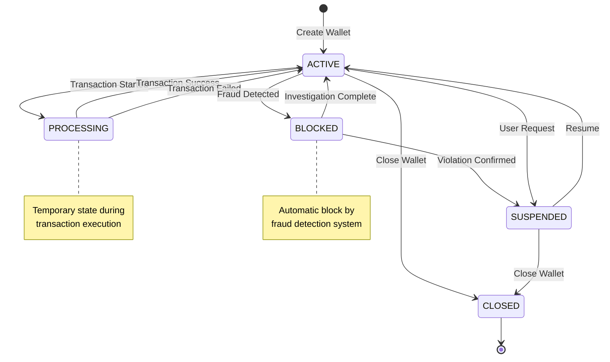

# Digital Wallet System - Low Level Design

## 🔗 Implementation Links

- [Python Implementation](python/wallet-system/main.py)
- [JavaScript Implementation](javascript/wallet-system/main.js)

## Problem Statement

Design a comprehensive digital wallet system that enables users to store money securely, perform various types of transactions (add money, withdraw, transfer), and maintain transaction history with ACID guarantees. The system should implement fraud detection mechanisms, support multiple payment methods, handle concurrent transactions safely, provide real-time balance tracking, and ensure transaction idempotency to prevent duplicate operations in case of network failures or retries.

### Core Capabilities

1. **Account Management**: Create and manage wallet accounts with secure authentication
2. **Transaction Processing**: Add money, withdraw, and transfer between wallets
3. **ACID Compliance**: Ensure Atomicity, Consistency, Isolation, and Durability
4. **Fraud Detection**: Real-time detection of suspicious transaction patterns
5. **Payment Methods**: Support multiple payment sources (bank, credit card, UPI)
6. **Transaction History**: Complete audit trail of all operations

## Requirements

### Functional Requirements

- Create wallet accounts with unique identifiers and KYC verification
- Add money to wallet from various payment methods (bank transfer, card, UPI)
- Withdraw money from wallet to bank account
- Transfer money between two wallet accounts
- Check wallet balance with real-time accuracy
- View transaction history with filtering and pagination
- Implement transaction limits (daily, per-transaction)
- Support transaction reversal and refunds
- Send notifications for all wallet activities
- Maintain transaction audit logs for compliance

### Non-Functional Requirements

- **ACID Properties**: Atomicity (all-or-nothing), Consistency (valid state), Isolation (concurrent safety), Durability (persistent)
- **Concurrency Control**: Handle concurrent transactions using locks or optimistic locking
- **High Availability**: 99.9% uptime with fault tolerance
- **Performance**: Process transactions in <200ms
- **Security**: Encrypt sensitive data, secure authentication, PCI DSS compliance
- **Scalability**: Support millions of wallets and thousands of TPS

## Design Decisions

### Key Classes

1. **Wallet**: Main entity managing balance and transactions
2. **Transaction**: Represents financial operation with ACID properties
3. **PaymentMethod**: Abstract interface for payment sources
4. **FraudDetector**: Analyzes transactions for suspicious patterns
5. **TransactionManager**: Coordinates transaction execution with two-phase commit

### Design Patterns Used

1. **Command Pattern**: Transaction as command object for execution and rollback
2. **State Pattern**: Wallet states (Active, Blocked, Suspended, Closed)
3. **Strategy Pattern**: Different payment methods (BankTransfer, CreditCard, UPI)
4. **Observer Pattern**: Notify users and systems about wallet events
5. **Factory Pattern**: Create appropriate payment method instances
6. **Template Method Pattern**: Transaction processing workflow
7. **Singleton Pattern**: TransactionManager for system-wide coordination

### Key Features

- **Two-Phase Commit**: Ensures consistency in money transfers
- **Idempotency Keys**: Prevent duplicate transactions from retries
- **Optimistic Locking**: Version-based concurrency control
- **Transaction Ledger**: Immutable record of all operations
- **Fraud Scoring**: ML-based risk assessment for transactions

## Class Diagram

```mermaid
classDiagram
    class Wallet {
        -String id
        -String userId
        -BigDecimal balance
        -WalletState state
        -DateTime createdAt
        -int version
        -List~Transaction~ transactions
        +getId() String
        +getBalance() BigDecimal
        +getState() WalletState
        +credit(amount, transaction) void
        +debit(amount, transaction) void
        +isActive() boolean
        +block() void
        +unblock() void
    }

    class WalletState {
        <<enumeration>>
        ACTIVE
        BLOCKED
        SUSPENDED
        CLOSED
    }

    class Transaction {
        <<abstract>>
        -String id
        -String idempotencyKey
        -Wallet sourceWallet
        -Wallet targetWallet
        -BigDecimal amount
        -TransactionType type
        -TransactionStatus status
        -DateTime timestamp
        -String description
        +execute() TransactionResult
        +rollback() void
        +validate() boolean
    }

    class AddMoneyTransaction {
        -PaymentMethod paymentMethod
        +execute() TransactionResult
        +rollback() void
        +validate() boolean
    }

    class WithdrawTransaction {
        -BankAccount targetAccount
        +execute() TransactionResult
        +rollback() void
        +validate() boolean
    }

    class TransferTransaction {
        -Wallet fromWallet
        -Wallet toWallet
        +execute() TransactionResult
        +rollback() void
        +validate() boolean
    }

    class TransactionType {
        <<enumeration>>
        ADD_MONEY
        WITHDRAW
        TRANSFER
        REFUND
        REVERSAL
    }

    class TransactionStatus {
        <<enumeration>>
        PENDING
        PROCESSING
        COMPLETED
        FAILED
        REVERSED
    }

    class TransactionResult {
        -boolean success
        -String message
        -Transaction transaction
        -String errorCode
        +isSuccess() boolean
        +getMessage() String
    }

    class PaymentMethod {
        <<interface>>
        +processPayment(amount) PaymentResult
        +validatePayment() boolean
        +getType() PaymentType
    }

    class BankTransferPayment {
        -String accountNumber
        -String ifscCode
        -String bankName
        +processPayment(amount) PaymentResult
        +validatePayment() boolean
    }

    class CreditCardPayment {
        -String cardNumber
        -String cvv
        -String expiryDate
        +processPayment(amount) PaymentResult
        +validatePayment() boolean
    }

    class UPIPayment {
        -String upiId
        -String upiApp
        +processPayment(amount) PaymentResult
        +validatePayment() boolean
    }

    class PaymentMethodFactory {
        +createPaymentMethod(type, details) PaymentMethod
    }

    class PaymentType {
        <<enumeration>>
        BANK_TRANSFER
        CREDIT_CARD
        DEBIT_CARD
        UPI
        NET_BANKING
    }

    class TransactionManager {
        <<singleton>>
        -Map~String, Transaction~ activeTransactions
        -TransactionLedger ledger
        -FraudDetector fraudDetector
        -Lock transactionLock
        +executeTransaction(transaction) TransactionResult
        +rollbackTransaction(transactionId) void
        +getTransactionStatus(transactionId) TransactionStatus
        -twoPhaseCommit(transaction) boolean
    }

    class FraudDetector {
        -List~FraudRule~ rules
        -Map~String, RiskScore~ userRiskScores
        +analyzeTransaction(transaction) FraudAnalysisResult
        +calculateRiskScore(wallet, transaction) double
        +isHighRisk(transaction) boolean
        +addRule(rule) void
    }

    class FraudRule {
        <<interface>>
        +evaluate(transaction) boolean
        +getRuleName() String
    }

    class AmountLimitRule {
        -BigDecimal maxAmount
        +evaluate(transaction) boolean
    }

    class FrequencyLimitRule {
        -int maxTransactions
        -Duration timeWindow
        +evaluate(transaction) boolean
    }

    class VelocityCheckRule {
        -int maxTransfersPerHour
        +evaluate(transaction) boolean
    }

    class FraudAnalysisResult {
        -boolean suspicious
        -double riskScore
        -List~String~ triggeredRules
        -String recommendation
        +isSuspicious() boolean
        +getRiskScore() double
    }

    class TransactionLedger {
        -List~LedgerEntry~ entries
        -Map~String, Transaction~ transactionIndex
        +recordTransaction(transaction) void
        +getTransaction(transactionId) Transaction
        +getHistory(walletId) List~Transaction~
        +getBalance(walletId) BigDecimal
    }

    class LedgerEntry {
        -String id
        -DateTime timestamp
        -String transactionId
        -String walletId
        -BigDecimal amount
        -String operation
        -BigDecimal balanceAfter
        +getId() String
        +getTimestamp() DateTime
    }

    class TransactionObserver {
        <<interface>>
        +onTransactionStarted(transaction) void
        +onTransactionCompleted(transaction) void
        +onTransactionFailed(transaction) void
    }

    class NotificationService {
        +onTransactionStarted(transaction) void
        +onTransactionCompleted(transaction) void
        +onTransactionFailed(transaction) void
        -sendEmail(user, message) void
        -sendSMS(user, message) void
        -sendPushNotification(user, message) void
    }

    class AuditLogger {
        +onTransactionStarted(transaction) void
        +onTransactionCompleted(transaction) void
        +onTransactionFailed(transaction) void
        -logAuditEntry(entry) void
    }

    class WalletService {
        -Map~String, Wallet~ wallets
        -TransactionManager transactionManager
        -FraudDetector fraudDetector
        -List~TransactionObserver~ observers
        +createWallet(userId) Wallet
        +addMoney(walletId, amount, paymentMethod) TransactionResult
        +withdraw(walletId, amount, bankAccount) TransactionResult
        +transfer(fromWalletId, toWalletId, amount) TransactionResult
        +getBalance(walletId) BigDecimal
        +getTransactionHistory(walletId) List~Transaction~
        +addObserver(observer) void
    }

    Transaction <|-- AddMoneyTransaction
    Transaction <|-- WithdrawTransaction
    Transaction <|-- TransferTransaction
    Transaction --> TransactionType
    Transaction --> TransactionStatus
    Transaction --> Wallet
    Wallet --> WalletState
    Wallet --> Transaction
    TransactionManager --> Transaction
    TransactionManager --> TransactionLedger
    TransactionManager --> FraudDetector
    PaymentMethod <|.. BankTransferPayment
    PaymentMethod <|.. CreditCardPayment
    PaymentMethod <|.. UPIPayment
    PaymentMethodFactory ..> PaymentMethod : creates
    AddMoneyTransaction --> PaymentMethod
    FraudDetector --> FraudRule
    FraudDetector --> FraudAnalysisResult
    FraudRule <|.. AmountLimitRule
    FraudRule <|.. FrequencyLimitRule
    FraudRule <|.. VelocityCheckRule
    TransactionLedger --> LedgerEntry
    TransactionObserver <|.. NotificationService
    TransactionObserver <|.. AuditLogger
    WalletService --> Wallet
    WalletService --> TransactionManager
    WalletService --> FraudDetector
    WalletService --> TransactionObserver
    Transaction --> TransactionResult
```



## Usage Example

```python
# Create wallet service
wallet_service = WalletService()

# Add observers
notification_service = NotificationService()
audit_logger = AuditLogger()
wallet_service.add_observer(notification_service)
wallet_service.add_observer(audit_logger)

# Create wallets
wallet1 = wallet_service.create_wallet("user_123")
wallet2 = wallet_service.create_wallet("user_456")

# Add money to wallet
payment_method = CreditCardPayment("4111111111111111", "123", "12/25")
result = wallet_service.add_money(
    wallet1.get_id(),
    1000.00,
    payment_method,
    idempotency_key="add_money_txn_001"
)

if result.is_success():
    print(f"Money added successfully. Balance: ${wallet_service.get_balance(wallet1.get_id())}")

# Transfer money between wallets
transfer_result = wallet_service.transfer(
    wallet1.get_id(),
    wallet2.get_id(),
    250.00,
    idempotency_key="transfer_txn_001"
)

# Withdraw money
bank_account = BankAccount("1234567890", "HDFC0001234")
withdraw_result = wallet_service.withdraw(
    wallet1.get_id(),
    100.00,
    bank_account,
    idempotency_key="withdraw_txn_001"
)

# Check transaction history
history = wallet_service.get_transaction_history(wallet1.get_id())
for transaction in history:
    print(f"{transaction.get_type()}: ${transaction.get_amount()} - {transaction.get_status()}")
```

## Business Rules

1. **Balance Validation**: Wallet balance cannot go negative (except for credit wallets)
2. **Transaction Atomicity**: Either complete entire transaction or roll back all changes
3. **Idempotency**: Same idempotency key returns cached result, prevents duplicates
4. **Daily Limits**: Maximum transaction amounts per day (configurable per wallet)
5. **Fraud Threshold**: Transactions above risk score 0.7 require manual approval
6. **Wallet States**: Only ACTIVE wallets can perform transactions
7. **Two-Phase Commit**: Transfers use 2PC - reserve, then commit or rollback
8. **Audit Trail**: All transactions logged immutably in ledger
9. **Concurrent Access**: Optimistic locking with version numbers
10. **Transaction Timeout**: Pending transactions auto-fail after timeout

## ACID Implementation

### Atomicity

```text
Transaction Execution:
1. BEGIN transaction
2. Validate all preconditions
3. Lock required resources (wallets)
4. Execute all operations
5. If any step fails → ROLLBACK
6. If all succeed → COMMIT
7. Release locks

Implementation: Try-catch with rollback on exception
```

### Consistency

```text
Invariants Maintained:
- Total money in system remains constant (for transfers)
- Balance ≥ 0 (for regular wallets)
- Transaction sum = Debits + Credits balance

Validation Before Commit:
- Check balance constraints
- Verify state transitions
- Validate business rules
```

### Isolation

```text
Concurrency Control:
- Optimistic Locking: Version number on wallet
- Pessimistic Locking: Database row locks
- Transaction Serialization: Queue for same wallet

Example: Two concurrent transfers to same wallet
- Transaction A reads balance = 1000, version = 5
- Transaction B reads balance = 1000, version = 5
- Transaction A updates balance = 1200, version = 6
- Transaction B tries to update → version mismatch → retry
```

### Durability

```text
Persistence Guarantees:
- Write-Ahead Logging (WAL)
- Synchronous disk writes for commits
- Transaction log replication
- Periodic snapshots

Recovery: Replay transaction log from last checkpoint
```

## Two-Phase Commit Protocol

```text
For Transfer from Wallet A to Wallet B:

Phase 1: Prepare
1. Lock Wallet A (source)
2. Validate A has sufficient balance
3. Reserve amount in A (mark as pending)
4. Lock Wallet B (destination)
5. Validate B can receive (not blocked)
6. If both OK → VOTE YES, else VOTE NO

Phase 2: Commit/Abort
If both voted YES:
  1. Debit amount from A
  2. Credit amount to B
  3. Update both wallet versions
  4. Record in ledger
  5. Release locks
  6. Return SUCCESS

If any voted NO:
  1. Unreserve amount in A
  2. Release all locks
  3. Return FAILURE

Time Complexity: O(1) for transfer execution
Space Complexity: O(1) for transaction state
```

## Fraud Detection Algorithm

```text
Risk Score Calculation:

risk_score = 0.0

# Amount-based risk
if amount > daily_limit:
    risk_score += 0.3
if amount > 10 * average_transaction:
    risk_score += 0.2

# Frequency-based risk
transactions_last_hour = count_recent_transactions(1 hour)
if transactions_last_hour > 10:
    risk_score += 0.25

# Velocity check
transfers_last_hour = count_transfers(1 hour)
if transfers_last_hour > 5:
    risk_score += 0.15

# Unusual pattern
if transaction_time between 2AM and 5AM:
    risk_score += 0.1

# Geographic anomaly
if location_distance > 500km from last_transaction:
    risk_score += 0.2

Decision:
- risk_score < 0.3: AUTO_APPROVE
- 0.3 ≤ risk_score < 0.7: REQUIRE_OTP
- risk_score ≥ 0.7: MANUAL_REVIEW

Time Complexity: O(1) for rule evaluation
```

## State Diagram



## Extension Points

1. **Multi-Currency Support**: Support multiple currencies with real-time exchange rates
2. **Credit Line**: Allow negative balance up to credit limit for premium users
3. **Savings Wallet**: Separate wallet with interest earning on balance
4. **Investment Integration**: Allow investing wallet balance in mutual funds/stocks
5. **QR Code Payments**: Generate QR codes for merchant payments
6. **Recurring Payments**: Schedule automatic transfers (subscriptions, EMIs)
7. **Split Payments**: Split transaction amount between multiple wallets
8. **Cashback & Rewards**: Loyalty points and cashback on transactions
9. **Bill Payments**: Direct integration with utility bill providers
10. **P2P Lending**: Allow users to lend money to each other through platform

## Security Considerations

1. **Encryption**: Encrypt sensitive data (card numbers, bank accounts) at rest and in transit
2. **Authentication**: Multi-factor authentication for high-value transactions
3. **Authorization**: Role-based access control (RBAC) for operations
4. **PCI DSS Compliance**: Never store CVV, use tokenization for cards
5. **Rate Limiting**: Prevent brute force attacks on wallet operations
6. **SQL Injection Prevention**: Use parameterized queries
7. **Session Management**: Secure session tokens with expiration
8. **Audit Logging**: Log all security-relevant events
9. **Data Masking**: Mask sensitive information in logs and UI
10. **Penetration Testing**: Regular security audits and testing

## Time Complexity

- **Add Money**: O(1) for transaction execution
- **Withdraw**: O(1) for transaction execution
- **Transfer**: O(1) for two-phase commit protocol
- **Get Balance**: O(1) with in-memory wallet cache
- **Transaction History**: O(n) where n is number of transactions (can paginate)
- **Fraud Detection**: O(k) where k is number of fraud rules (typically constant)
- **Rollback**: O(1) for transaction reversal

## Space Complexity

- **Wallet Storage**: O(w) where w is number of wallets
- **Transaction Ledger**: O(t) where t is total transactions
- **Active Transactions**: O(a) where a is concurrent transactions
- **Fraud Detection Cache**: O(w) for per-user risk scores
- **Overall System**: O(w + t)

## Performance Optimization

1. **Caching**: Cache wallet balances in Redis for fast reads
2. **Database Indexes**: Index on wallet_id, transaction_id, timestamp
3. **Partitioning**: Shard transactions by wallet_id for horizontal scaling
4. **Async Processing**: Use message queues for notifications and audit logs
5. **Read Replicas**: Use read replicas for transaction history queries
6. **Connection Pooling**: Reuse database connections
7. **Batch Processing**: Batch multiple transactions for ledger writes

## Testing Considerations

1. **Unit Tests**: Test each transaction type independently
2. **Concurrency Tests**: Test race conditions with multiple threads
3. **ACID Tests**: Verify transaction properties under failures
4. **Idempotency Tests**: Verify duplicate prevention with same key
5. **Fraud Tests**: Test all fraud rules with edge cases
6. **Load Tests**: Test system under high transaction volume
7. **Chaos Tests**: Test system resilience with random failures
